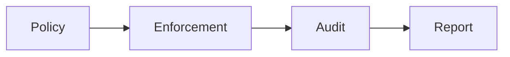

# Compliance Evolution Feature Tracking

> **Stage**: Flink/security/evolution | **Prerequisites**: [Compliance][^1] | **Formalization Level**: L3

## 1. Definitions

### Def-F-Comp-01: Compliance Standard

Compliance standard:
$$
\text{Standard} \in \{\text{GDPR}, \text{HIPAA}, \text{SOC2}, \text{PCI-DSS}\}
$$

### Def-F-Comp-02: Data Governance

Data governance:
$$
\text{Governance} = \text{Policy} + \text{Enforcement} + \text{Audit}
$$

## 2. Properties

### Prop-F-Comp-01: Data Retention

Data retention:
$$
T_{\text{retention}} \leq \text{Policy}_{\text{max}}
$$

## 3. Relations

### Compliance Evolution

| Version | Feature | Status |
|---------|---------|--------|
| 2.4 | Basic Policy | GA |
| 2.5 | Auto-Compliance | GA |
| 3.0 | Intelligent Compliance | In Design |

## 4. Argumentation

### 4.1 Compliance Checks

| Check Item | Description |
|------------|-------------|
| Encryption | Data encryption |
| Access | Access control |
| Audit | Operation logs |
| Retention | Data lifecycle |

## 5. Proof / Engineering Argument

### 5.1 Compliance Configuration

```yaml
compliance: 
  gdpr: 
    data_retention: 7y
    right_to_erasure: true
  hipaa: 
    encryption_required: true
    audit_logging: true
```

## 6. Examples

### 6.1 Data Classification

```java
@PII
private String ssn;

@Sensitive(level = HIGH)
private String creditCard;
```

## 7. Visualizations



## 8. References

[^1]: GDPR/HIPAA Documentation

---

## Tracking Information

| Attribute | Value |
|-----------|-------|
| Version | 2.4-3.0 |
| Current Status | Evolving |
