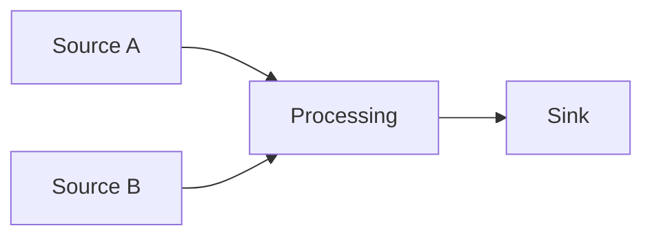

# Data Governance Evolution Feature Tracking

> **Stage**: Flink/security/evolution | **Prerequisites**: [Data Governance][^1] | **Formalization Level**: L3

## 1. Definitions

### Def-F-Gov-01: Data Catalog

Data catalog:
$$
\text{Catalog} = \{ (\text{Dataset}, \text{Metadata}, \text{Lineage}) \}
$$

### Def-F-Gov-02: Data Quality

Data quality:
$$
\text{Quality} = \frac{\text{ValidRecords}}{\text{TotalRecords}}
$$

## 2. Properties

### Prop-F-Gov-01: Data Lineage

Data lineage:
$$
\text{Lineage} : \text{Sink} \to \{\text{Sources}\}
$$

## 3. Relations

### Governance Evolution

| Version | Feature | Status |
|---------|---------|--------|
| 2.4 | Basic Metadata | GA |
| 2.5 | Lineage Tracking | GA |
| 3.0 | Intelligent Governance | In Design |

## 4. Argumentation

### 4.1 Governance Capabilities

| Capability | Description |
|------------|-------------|
| Discovery | Automatic discovery |
| Classification | Sensitive data identification |
| Quality | Rule checking |
| Lineage | Impact analysis |

## 5. Proof / Engineering Argument

### 5.1 Lineage Tracking

```java
LineageRecorder.record(new DataLineage()
    .setSource("kafka.orders")
    .setTransform("enrich")
    .setSink("jdbc.results"));
```

## 6. Examples

### 6.1 Quality Rules

```yaml
data_quality: 
  rules: 
    - column: email
      pattern: ".*@.*\\..*"
    - column: age
      range: [0, 150]
```

## 7. Visualizations



## 8. References

[^1]: Data Governance Documentation

---

## Tracking Information

| Attribute | Value |
|-----------|-------|
| Version | 2.4-3.0 |
| Current Status | Evolving |
