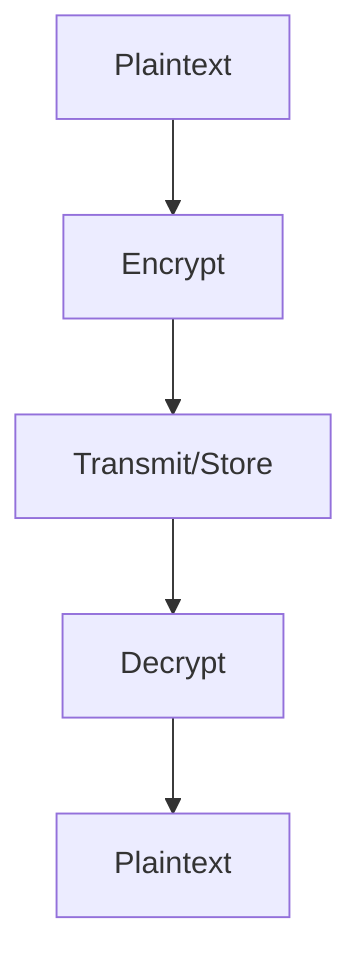

# Encryption Mechanism Evolution Tracking

> Stage: Flink/security/evolution | Prerequisites: [Encryption][^1] | Formalization Level: L3

## 1. Definitions

### Def-F-Enc-01: Encryption at Rest

Encryption at rest:
$$
\text{Data}_{\text{rest}} = \text{Encrypt}(\text{Plaintext}, \text{Key})
$$

### Def-F-Enc-02: Encryption in Transit

Encryption in transit:
$$
\text{Data}_{\text{transit}} = \text{TLS}(\text{Plaintext})
$$

## 2. Properties

### Prop-F-Enc-01: Key Rotation

Key rotation:
$$
T_{\text{rotation}} \leq 90\text{days}
$$

## 3. Relations

### Encryption Evolution

| Version | Feature | Status |
|---------|---------|--------|
| 2.4 | SSL/TLS | GA |
| 2.5 | State Encryption | GA |
| 3.0 | Column-Level Encryption | In Design |

## 4. Argumentation

### 4.1 Encryption Layers

| Layer | Mechanism |
|-------|-----------|
| Network | TLS 1.3 |
| State | AES-256 |
| Configuration | Vault Integration |

## 5. Proof / Engineering Argument

### 5.1 TLS Configuration

```yaml
security.ssl.algorithms: TLSv1.3
security.ssl.rest.enabled: true
security.ssl.internal.enabled: true
```

## 6. Examples

### 6.1 Key Management

```java
// [伪代码片段 - 不可直接运行] 仅展示核心逻辑
KeyVault vault = KeyVault.create(config);
SecretKey key = vault.getKey("state-encryption");
```

## 7. Visualizations



## 8. References

[^1]: Flink Encryption Documentation

---

## Tracking Information

| Property | Value |
|----------|-------|
| Version | 2.4-3.0 |
| Current Status | Evolving |
