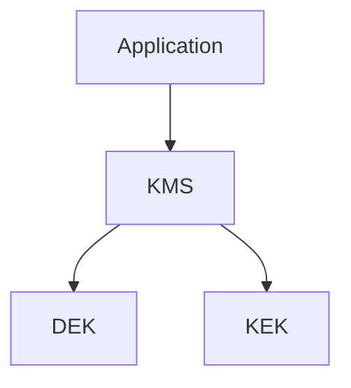

# Key Management Evolution Feature Tracking

> Stage: Flink/security/evolution | Prerequisites: [Key Management][^1] | Formalization Level: L3

## 1. Definitions

### Def-F-Key-01: Key Hierarchy

Key hierarchy:
$$
\text{Keys} = \{\text{RootKey}, \text{DEK}, \text{KEK}\}
$$

### Def-F-Key-02: Key Rotation

Key rotation:
$$
\text{Rotation} : \text{Key}_{\text{old}} \to \text{Key}_{\text{new}}
$$

## 2. Properties

### Prop-F-Key-01: Key Separation

Key separation:
$$
\text{Key}_i \perp \text{Key}_j
$$

## 3. Relations

### Key Evolution

| Version | Feature | Status |
|---------|---------|--------|
| 2.4 | File Key | GA |
| 2.5 | KMS Integration | GA |
| 3.0 | HSM Support | In Design |

## 4. Argumentation

### 4.1 KMS Integration

| Service | Status |
|---------|--------|
| AWS KMS | Integrated |
| Azure Key Vault | Integrated |
| HashiCorp Vault | Integrated |

## 5. Proof / Engineering Argument

### 5.1 Vault Integration

```java
Vault vault = Vault.builder()
    .address("https://vault:8200")
    .token(token)
    .build();

SecretKey key = vault.logical()
    .read("secret/flink-key")
    .getData();
```

## 6. Examples

### 6.1 Auto Rotation

```yaml
security.key.rotation.enabled: true
security.key.rotation.period: 90d
```

## 7. Visualizations



## 8. References

[^1]: Vault Documentation

---

## Tracking Information

| Property | Value |
|----------|-------|
| Version | 2.4-3.0 |
| Current Status | Evolving |
