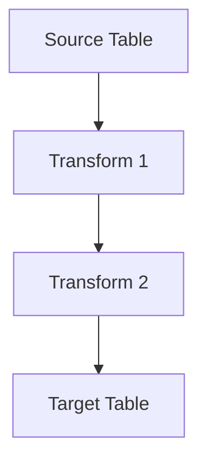

# Data Lineage Evolution Feature Tracking

> Stage: Flink/security/evolution | Prerequisites: [Data Lineage][^1] | Formalization Level: L3

## 1. Definitions

### Def-F-Lineage-01: Data Lineage

Data lineage:
$$
\text{Lineage} = \text{Source} \xrightarrow{\text{Transform}} \text{Target}
$$

### Def-F-Lineage-02: Column Lineage

Column-level lineage:
$$
\text{ColumnLineage} : \text{OutputCol} \to \{\text{InputCols}\}
$$

## 2. Properties

### Prop-F-Lineage-01: Completeness

Completeness:
$$
\text{Coverage} > 0.95
$$

## 3. Relations

### Lineage Evolution

| Version | Feature | Status |
|---------|---------|--------|
| 2.4 | Table-Level Lineage | GA |
| 2.5 | Column-Level Lineage | GA |
| 3.0 | Fine-Grained Lineage | In Design |

## 4. Argumentation

### 4.1 Lineage Granularity

| Granularity | Precision |
|-------------|-----------|
| Table-Level | Coarse |
| Column-Level | Medium |
| Row-Level | Fine |

## 5. Proof / Engineering Argument

### 5.1 Lineage Collection

```java
// [伪代码片段 - 不可直接运行] 仅展示核心逻辑
LineageContext ctx = LineageContext.current();
ctx.recordRelation("users.id", "orders.user_id");
```

## 6. Examples

### 6.1 Lineage Query

```sql
-- Query lineage
SELECT * FROM lineage
WHERE target_table = 'orders_summary';
```

## 7. Visualizations



## 8. References

[^1]: OpenLineage Documentation

---

## Tracking Information

| Property | Value |
|----------|-------|
| Version | 2.4-3.0 |
| Current Status | Evolving |
