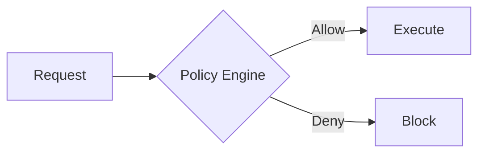

# Security Policy Evolution Feature Tracking

> **Stage**: Flink/security/evolution | **Prerequisites**: [Security Policy][^1] | **Formalization Level**: L3

## 1. Definitions

### Def-F-Policy-01: Security Policy

Security policy:
$$
\text{Policy} = \langle \text{Rule}, \text{Action}, \text{Priority} \rangle
$$

### Def-F-Policy-02: Policy as Code

Policy as Code:
$$
\text{Policy} \in \text{Code} \xrightarrow{\text{CI/CD}} \text{Runtime}
$$

## 2. Properties

### Prop-F-Policy-01: Enforcement

Policy enforcement:
$$
\forall \text{Action} : \text{Check}(\text{Policy})
$$

## 3. Relations

### Policy Evolution

| Version | Feature | Status |
|---------|---------|--------|
| 2.4 | Static Policy | GA |
| 2.5 | Dynamic Policy | GA |
| 3.0 | Intelligent Policy | In Design |

## 4. Argumentation

### 4.1 Policy Types

| Type | Description |
|------|-------------|
| Access Policy | Who can do what |
| Data Policy | How data is used |
| Network Policy | Communication restrictions |

## 5. Proof / Engineering Argument

### 5.1 OPA Integration

```rego
package flink.authz

default allow = false

allow {
    input.user.role == "admin"
}
```

## 6. Examples

### 6.1 Policy Definition

```yaml
policies:
  - name: restrict-sensitive
    condition: data.classification == "sensitive"
    action: deny
    except: [role:admin]
```

## 7. Visualizations



## 8. References

[^1]: Open Policy Agent Documentation

---

## Tracking Information

| Attribute | Value |
|-----------|-------|
| Version | 2.4-3.0 |
| Current Status | Evolving |
