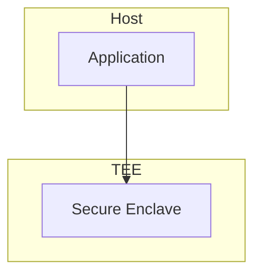

> **Status**: 🔮 Forward-looking | **Risk Level**: High | **Last Updated**: 2026-04
>
> The content described in this document is in early planning stages and may differ from the final implementation. Please refer to official Apache Flink releases.

# Trusted Execution Environment Evolution Feature Tracking

> **Stage**: Flink/security/evolution | **Prerequisites**: [TEE][^1] | **Formalization Level**: L3

## 1. Definitions

### Def-F-TEE-01: Trusted Execution Environment

Trusted Execution Environment:
$$
\text{TEE} = \text{Isolated} + \text{Attested} + \text{Secure}
$$

### Def-F-TEE-02: Secure Enclave

Secure enclave:
$$
\text{Enclave} : \text{Code} + \text{Data} \to \text{Protected}
$$

## 2. Properties

### Prop-F-TEE-01: Memory Isolation

Memory isolation:
$$
\text{EnclaveMemory} \perp \text{HostMemory}
$$

## 3. Relations

### TEE Evolution

| Version | Feature | Status |
|---------|---------|--------|
| 2.4 | None | - |
| 2.5 | SGX Experiment | Preview |
| 3.0 | Multi-TEE Support | In Design |

## 4. Argumentation

### 4.1 TEE Technologies

| Technology | Vendor |
|------------|--------|
| SGX | Intel |
| SEV | AMD |
| TrustZone | ARM |

## 5. Proof / Engineering Argument

### 5.1 SGX Execution

```java
Enclave enclave = EnclaveLoader.load("enclave.so");
byte[] result = enclave.execute(input);
```

## 6. Examples

### 6.1 Sensitive Computation

```java
// Process sensitive data in TEE
EnclaveResult result = teeExecutor.execute(() -> {
    return processSensitiveData(data);
});
```

## 7. Visualizations



## 8. References

[^1]: Intel SGX Documentation

---

## Tracking Information

| Attribute | Value |
|-----------|-------|
| Version | 2.5-3.0 |
| Current Status | Experimental |
