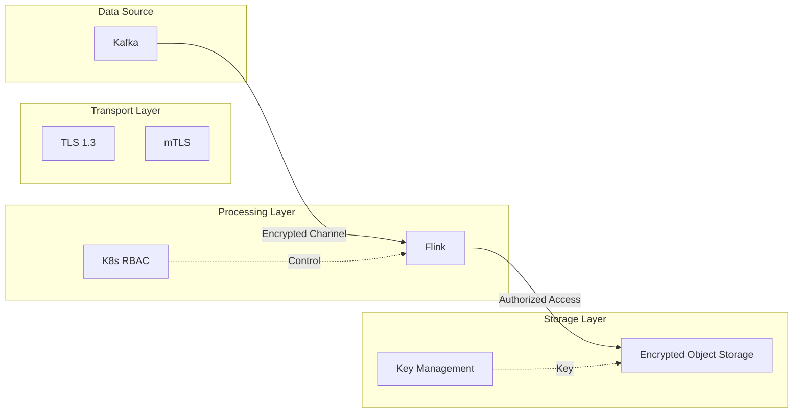
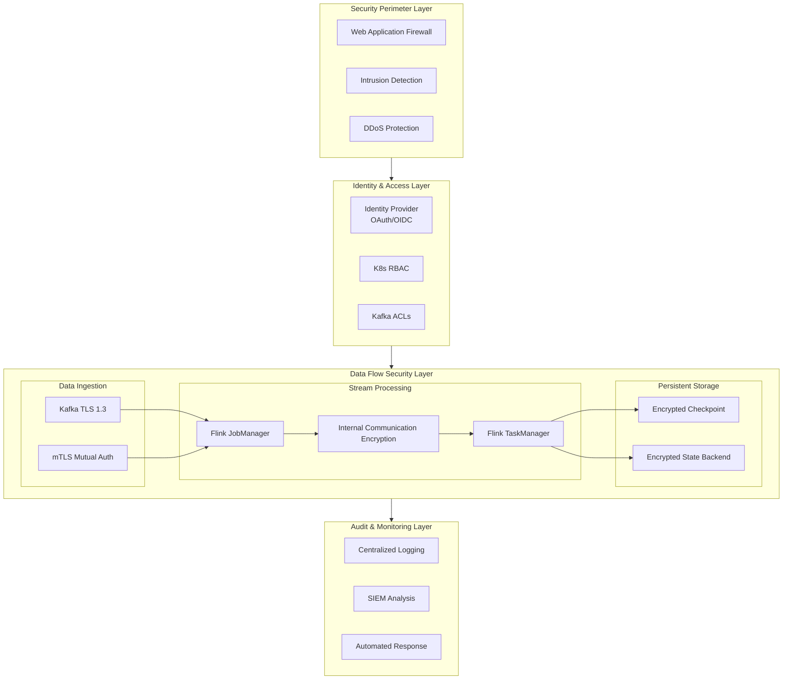
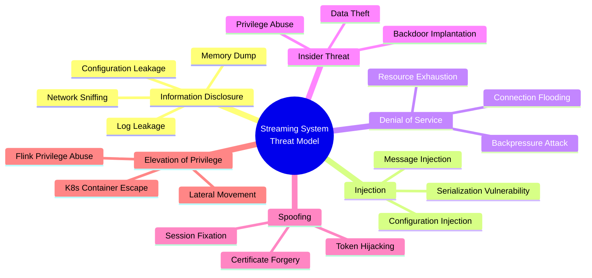
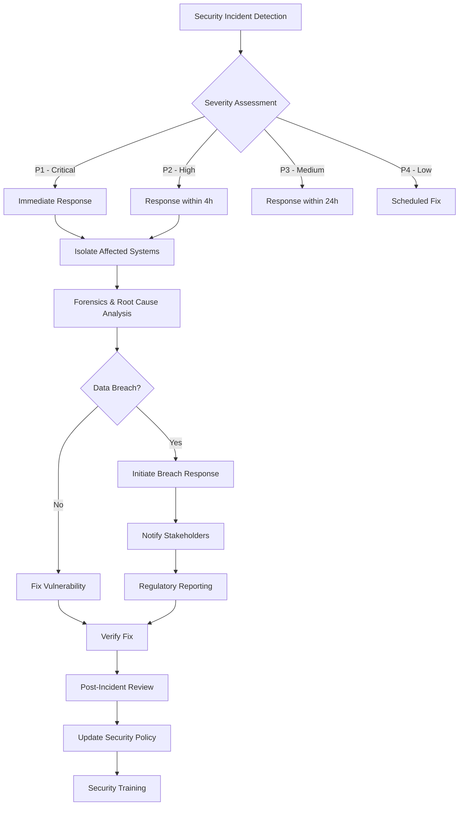
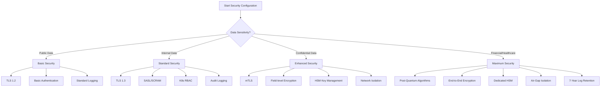

# Streaming Security Best Practices Guide

> **Status**: Prospective | **Expected Release**: 2026-Q3 | **Last Updated**: 2026-04-12
>
> ⚠️ The features described in this document are in early discussion stages and have not been officially released. Implementation details may change.

> **Stage**: Flink | **Prerequisites**: [Flink Security Hardening Guide](./security-hardening-guide.md), [Flink 2.4 Security Enhancements](./flink-24-security-enhancements.md) | **Formalization Level**: L3

---

## 1. Definitions

### Def-F-13-01: Streaming Security Threat Model

**Streaming Security Threat Model** is a formal framework describing potential security threats, attack vectors, and defense strategies in stream computing systems.

Let the stream processing system be $\mathcal{S} = (P, D, C, N)$, where:

- $P$: set of processing components (Flink JobManager/TaskManager)
- $D$: set of data streams (Kafka Topic, State Store)
- $C$: set of control planes (K8s API, Flink REST)
- $N$: set of network topologies

**Threat Classification** (STRIDE for Streaming):

| Threat Type | Attack Vector | Impact Level |
|-------------|---------------|--------------|
| **Information Disclosure** | Network sniffing, config leakage, log leakage | Critical |
| **Injection** | Malicious messages, SQL injection, code injection | Critical |
| **DoS** | Resource exhaustion, Backpressure attacks, connection flooding | High |
| **Insider Threat** | Privilege abuse, data theft, config tampering | High |
| **Spoofing** | Forged producer/consumer identities | Medium |
| **Elevation** | K8s escape, Flink privilege abuse | Critical |

### Def-F-13-02: Data Security Boundary

**Data Security Boundary** defines security control points in the stream data lifecycle:

$$
\text{Boundary} = \{ \text{Ingestion}, \text{Processing}, \text{Storage}, \text{Egress} \}
$$

**Def-F-13-03: Defense in Depth Principle**

Defense in Depth requires deploying **independent and redundant** control measures at each security boundary:

$$
\forall b \in \text{Boundary}, \exists \phi_b: \text{DefenseLevel}(b) \geq 2
$$

---

## 2. Properties

### Lemma-F-13-01: Transitivity of Least Privilege

**Lemma**: If stream processing component $c_1$ accesses data source $s$ with least privilege, and $c_2$ accesses the output of $c_1$ with least privilege, then the entire chain satisfies least privilege.

**Proof**: Let $R(c)$ be the actual privileges of component $c$, and $R_{\min}(c)$ be the minimum necessary privileges.

- By assumption: $R(c_1) = R_{\min}(c_1)$ and $R(c_2) = R_{\min}(c_2)$
- Component $c_2$ can only access data through the output of $c_1$
- Therefore: $R_{\text{chain}} = R(c_1) \cap R(c_2) = R_{\min}(c_1) \cap R_{\min}(c_2)$
- That is, chain privileges do not exceed either component $\square$

### Lemma-F-13-02: Encryption Overhead Upper Bound

**Lemma**: Enabling TLS encryption has an upper-bounded impact on stream processing latency:

$$
\Delta_{\text{latency}} \leq T_{\text{handshake}} + \frac{L_{\text{record}}}{B_{\text{encrypted}}} - \frac{L_{\text{record}}}{B_{\text{plaintext}}}
$$

**Engineering significance**: In a gigabit network environment, TLS overhead is typically < 5% and can be further reduced via connection reuse.

### Lemma-F-13-03: Audit Integrity

**Lemma**: A complete audit logging system satisfies non-repudiation if and only if:

1. Log generation is strongly bound to the subject identity
2. Log storage is tamper-proof (WORM storage)
3. Log timestamps are trustworthily synchronized (NTP/PTP)

---

## 3. Relations

### 3.1 Relationship with Zero Trust Architecture

Mapping between stream processing systems and Zero Trust principles:

| Zero Trust Principle | Stream Processing Implementation |
|----------------------|----------------------------------|
| Never trust, always verify | mTLS mutual authentication, dynamic tokens |
| Least privilege access | Kafka ACL, K8s RBAC |
| Assume breach | Micro-segmentation, network policies |
| Continuous validation | Real-time monitoring, anomaly detection |

### 3.2 Relationship with Compliance Frameworks

```
GDPR/CCPA         NIST 800-53        SOC 2
   |                   |                |
   v                   v                v
Data Classification ──→ Access Control ──→ Audit Logs ──→ Compliance Reports
   ↑                   ↑                ↑
Encryption Protection ←── Key Management ←── Monitoring Alerts ←── Continuous Improvement
```

### 3.3 Relationship between Security Controls and Data Flow



---

## 4. Argumentation

### 4.1 Defense in Depth Strategy Argumentation

**Threat**: An attacker attempts to steal sensitive data from stream processing.

**Defense Layers**:

```
┌─────────────────────────────────────────────────────────────┐
│  Layer 5: Application-layer Encryption (Field-level)         │
│  ─────────────────────────────────────────────────────────  │
│  Layer 4: Transport-layer Encryption (TLS 1.3)               │
│  ─────────────────────────────────────────────────────────  │
│  Layer 3: Network Isolation (VPC/NetworkPolicy)              │
│  ─────────────────────────────────────────────────────────  │
│  Layer 2: Access Control (RBAC/ACL)                          │
│  ─────────────────────────────────────────────────────────  │
│  Layer 1: Identity Authentication (mTLS/OAuth)               │
└─────────────────────────────────────────────────────────────┘
```

**Argumentation**: Even if the attacker breaks through Layers 1–3, they still need to crack Layers 4–5 to obtain plaintext data, satisfying the defense-in-depth requirement.

### 4.2 Key Rotation Strategy Analysis

**Strategy Comparison**:

| Strategy | Implementation Complexity | Security Gain | Availability Impact |
|----------|---------------------------|---------------|---------------------|
| Static keys | Low | Low | None |
| Periodic rotation (90 days) | Medium | Medium | Brief interruption |
| Dynamic rotation (on-demand) | High | High | Imperceptible |
| Automatic emergency rotation | High | Highest | Controllable interruption |

**Recommendation**: Production environments should adopt a combination of dynamic rotation + automatic emergency rotation.

---

## 5. Proof / Engineering Argument

### Thm-F-13-01: Security Configuration Completeness Theorem

**Theorem**: Given a stream processing system $\mathcal{S}$, if the following conditions are met, the system reaches production-grade security standards:

1. **Transport Security**: $\forall e \in \text{Edges}(\mathcal{S}), \text{Encrypted}(e)$
2. **Authentication Completeness**: $\forall c \in \text{Components}(\mathcal{S}), \text{Authenticated}(c)$
3. **Authorization Minimization**: $\forall p \in \text{Permissions}, |p| = |p_{\min}|$
4. **Audit Integrity**: $\forall a \in \text{Actions}, \text{Logged}(a) \land \text{Immutable}(\text{Log}(a))$
5. **Effective Isolation**: $\forall z \in \text{Zones}, \text{Isolated}(z)$

**Engineering argument**: This theorem provides a verifiable checklist for security configuration, where each condition maps to a concrete technical implementation.

### Thm-F-13-02: Security–Performance Trade-off Theorem

**Theorem**: In a stream processing system, security strength $S$ and performance $P$ are approximately inversely proportional:

$$
P \approx \frac{P_{\max}}{1 + \alpha \cdot S}
$$

where $\alpha$ is a system-specific security coefficient.

**Engineering significance**: Security hardening should not pursue the theoretical maximum; instead, find the balance between compliance requirements and business SLA.

---

## 6. Examples

### 6.1 Kafka TLS/SSL Production Configuration

```yaml
# kafka-server.properties
# TLS 1.3 configuration
listeners=SASL_SSL://:9093
security.inter.broker.protocol=SASL_SSL
ssl.enabled.protocols=TLSv1.3
ssl.protocol=TLS

# Certificate configuration
ssl.keystore.location=/etc/kafka/keystore.p12
ssl.keystore.password=${KAFKA_SSL_KEYSTORE_PASSWORD}
ssl.key.password=${KAFKA_SSL_KEY_PASSWORD}
ssl.truststore.location=/etc/kafka/truststore.p12
ssl.truststore.password=${KAFKA_SSL_TRUSTSTORE_PASSWORD}

# Client authentication (mutual TLS)
ssl.client.auth=required

# SASL configuration
sasl.enabled.mechanisms=SCRAM-SHA-512
sasl.mechanism.inter.broker.protocol=SCRAM-SHA-512
```

### 6.2 Flink SSL Internal Communication Configuration

```yaml
# flink-conf.yaml
# Internal communication encryption
security.ssl.internal.enabled: true
security.ssl.internal.keystore: /opt/flink/ssl/flink.keystore
security.ssl.internal.keystore-password: ${FLINK_KEYSTORE_PASSWORD}
security.ssl.internal.key-password: ${FLINK_KEY_PASSWORD}
security.ssl.internal.truststore: /opt/flink/ssl/flink.truststore
security.ssl.internal.truststore-password: ${FLINK_TRUSTSTORE_PASSWORD}

# Algorithm selection (performance optimization)
security.ssl.internal.protocol: TLSv1.3
security.ssl.internal.algorithms: TLS_AES_256_GCM_SHA384,TLS_AES_128_GCM_SHA256

# REST API HTTPS
security.ssl.rest.enabled: true
security.ssl.rest.keystore: /opt/flink/ssl/rest.keystore
security.ssl.rest.keystore-password: ${REST_KEYSTORE_PASSWORD}
```

### 6.3 Kafka ACL Configuration Example

```bash
# Create SASL/SCRAM user
kafka-configs.sh --bootstrap-server kafka:9093 \
  --alter --add-config 'SCRAM-SHA-512=[password=secure-password]' \
  --entity-type users --entity-name flink-producer

# Set Topic ACL - producer permissions
kafka-acls.sh --bootstrap-server kafka:9093 \
  --add --allow-principal User:flink-producer \
  --operation Write --operation Describe \
  --topic 'events.*'

# Set Topic ACL - consumer permissions
kafka-acls.sh --bootstrap-server kafka:9093 \
  --add --allow-principal User:flink-consumer \
  --operation Read --operation Describe \
  --topic 'events.input' --group 'flink-consumer-group'

# Deny rule (explicit deny preferred over implicit)
kafka-acls.sh --bootstrap-server kafka:9093 \
  --add --deny-principal User:untrusted-app \
  --operation All --topic '*'
```

### 6.4 Kubernetes RBAC Configuration

```yaml
# flink-operator-rbac.yaml
apiVersion: v1
kind: ServiceAccount
metadata:
  name: flink-operator
  namespace: flink-jobs
automountServiceAccountToken: false  # Security best practice
---
apiVersion: rbac.authorization.k8s.io/v1
kind: Role
metadata:
  name: flink-operator-role
  namespace: flink-jobs
rules:
  # Least privilege - only necessary resources
  - apiGroups: ["apps"]
    resources: ["deployments"]
    verbs: ["get", "list", "watch", "create", "update", "patch", "delete"]
  - apiGroups: [""]
    resources: ["pods", "services", "configmaps"]
    verbs: ["get", "list", "watch", "create", "update", "patch", "delete"]
  - apiGroups: ["flink.apache.org"]
    resources: ["flinkdeployments", "flinksessionjobs"]
    verbs: ["get", "list", "watch", "create", "update", "patch", "delete"]
  # Explicitly exclude sensitive permissions
  # - resources: ["secrets"]  # Not allowed to access secrets
---
apiVersion: rbac.authorization.k8s.io/v1
kind: RoleBinding
metadata:
  name: flink-operator-binding
  namespace: flink-jobs
subjects:
  - kind: ServiceAccount
    name: flink-operator
    namespace: flink-jobs
roleRef:
  kind: Role
  name: flink-operator-role
  apiGroup: rbac.authorization.k8s.io
```

### 6.5 Checkpoint Encryption Configuration

```java

// [伪代码片段 - 不可直接运行] 仅展示核心逻辑
import org.apache.flink.streaming.api.CheckpointingMode;

// Flink Checkpoint encryption configuration
CheckpointConfig checkpointConfig = env.getCheckpointConfig();

// Enable Checkpoint encryption
EncryptedCheckpointStorage encryptedStorage =
    new EncryptedCheckpointStorage(
        "hdfs://checkpoint/path",
        new AES256EncryptionProvider()  // 256-bit AES
    );

checkpointConfig.setCheckpointStorage(encryptedStorage);

// Use external KMS for key management
checkpointConfig.setCheckpointingMode(CheckpointingMode.EXACTLY_ONCE);
checkpointConfig.setCheckpointInterval(60000);
checkpointConfig.setCheckpointTimeout(600000);
checkpointConfig.setExternalizedCheckpointCleanup(
    ExternalizedCheckpointCleanup.RETAIN_ON_CANCELLATION
);
```

### 6.6 NetworkPolicy Network Isolation

```yaml
# flink-network-policy.yaml
apiVersion: networking.k8s.io/v1
kind: NetworkPolicy
metadata:
  name: flink-jobmanager-policy
  namespace: flink-jobs
spec:
  podSelector:
    matchLabels:
      app: flink-jobmanager
  policyTypes:
    - Ingress
    - Egress
  ingress:
    # Only allow traffic from Web UI
    - from:
        - namespaceSelector:
            matchLabels:
              name: ingress-nginx
      ports:
        - protocol: TCP
          port: 8081  # Flink Web UI
    # Allow TaskManager connections
    - from:
        - podSelector:
            matchLabels:
              app: flink-taskmanager
      ports:
        - protocol: TCP
          port: 6123  # JobManager RPC
  egress:
    # Only allow connections to Kafka
    - to:
        - podSelector:
            matchLabels:
              app: kafka
      ports:
        - protocol: TCP
          port: 9093  # Kafka SSL
    # DNS queries
    - to:
        - namespaceSelector: {}
      ports:
        - protocol: UDP
          port: 53
---
apiVersion: networking.k8s.io/v1
kind: NetworkPolicy
metadata:
  name: flink-taskmanager-policy
  namespace: flink-jobs
spec:
  podSelector:
    matchLabels:
      app: flink-taskmanager
  policyTypes:
    - Ingress
    - Egress
  ingress:
    # Only allow JobManager connections
    - from:
        - podSelector:
            matchLabels:
              app: flink-jobmanager
  egress:
    # Allow connections to JobManager
    - to:
        - podSelector:
            matchLabels:
              app: flink-jobmanager
    # Allow connections to Kafka
    - to:
        - podSelector:
            matchLabels:
              app: kafka
```

### 6.7 Financial-Grade Security Configuration Checklist

```yaml
# production-security-checklist.yaml
security_profile: financial_grade
compliance: [PCI-DSS, SOC2, ISO27001]

transport_security:
  tls_version: "1.3"
  cipher_suites:
    - TLS_AES_256_GCM_SHA384
    - TLS_AES_128_GCM_SHA256
  mutual_tls: required
  certificate_validity_days: 90
  auto_rotation: enabled

authentication:
  kafka: SCRAM-SHA-512
  flink_ui: OAuth2/OIDC
  k8s_api: short-lived-tokens
  admin_access: MFA_required

authorization:
  kafka_acls: enabled
  k8s_rbac: strict
  least_privilege: enforced
  regular_audit: monthly

encryption_at_rest:
  checkpoints: AES-256-GCM
  state_backend: encrypted
  log_files: encrypted
  key_management: AWS-KMS/Azure-KeyVault

audit_logging:
  flink_audit: enabled
  k8s_audit: enabled
  kafka_audit: enabled
  log_retention_days: 2555  # 7 years
  tamper_protection: enabled

network_security:
  network_policies: strict
  service_mesh: enabled
  egress_filtering: whitelist_only
  ingress_controller: waf_enabled

monitoring:
  security_alerts: real_time
  anomaly_detection: ML_based
  incident_response: automated
  penetration_testing: quarterly
```

---

## 7. Visualizations

### 7.1 Streaming Security Architecture Panorama

The following Mermaid diagram shows the end-to-end streaming security architecture covering the perimeter, identity, data flow, and audit layers:



### 7.2 Threat Model Diagram (STRIDE)



### 7.3 Security Incident Response Process



### 7.4 Security Configuration Decision Tree



---

## 8. References

---

*Document Version: v1.0 | Last Updated: 2026-04-02 | Status: Completed*
