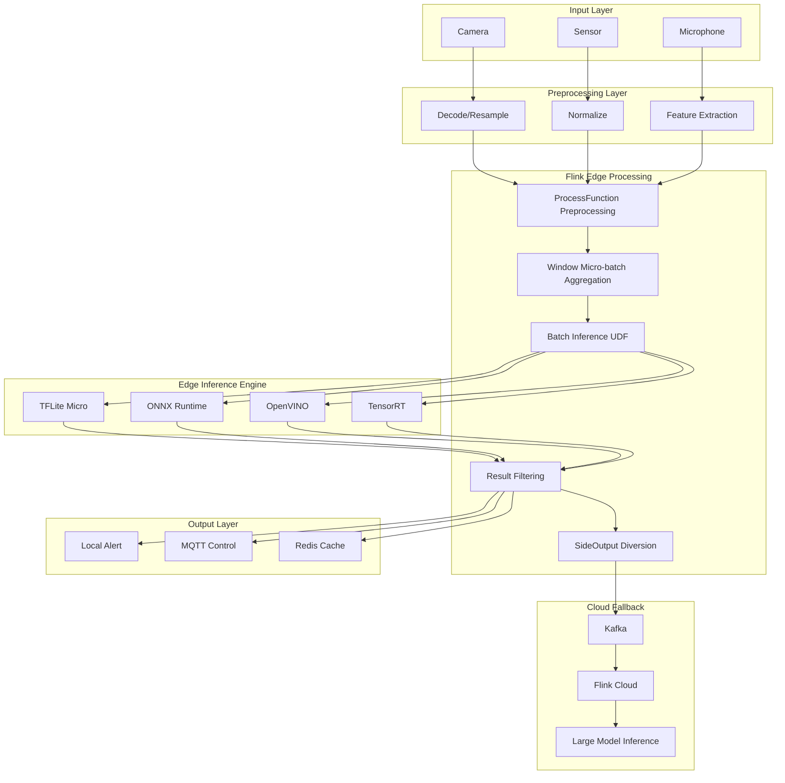
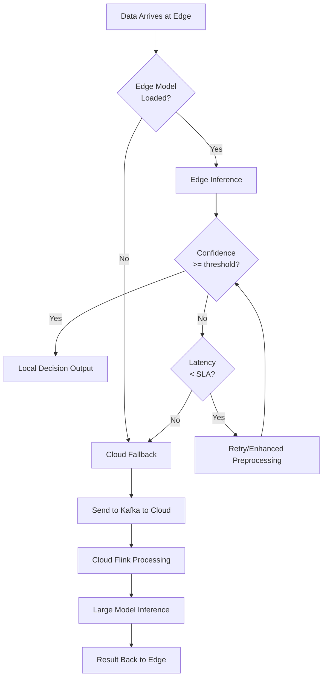

# Flink Edge AI Inference Optimization

> **Stage**: Flink/09-practices/09.05-edge | **Prerequisites**: [flink-edge-streaming-guide.md](./flink-edge-streaming-guide.md), [../../06-ai-ml/flink-llm-realtime-inference-guide.md](../../06-ai-ml/flink-llm-realtime-inference-guide.md) | **Formality Level**: L4

---

## 1. Definitions

### Def-F-09-12: Edge AI Inference

**Def-F-09-12a**: Edge AI inference refers to the process of executing machine learning model forward computation on terminal devices or edge gateways close to the data source, rather than transmitting raw data to a cloud data center for processing. Formally:

$$\hat{y} = M_{edge}(x), \quad x \in \mathcal{X}_{local}, \; M_{edge} \subseteq M_{cloud}$$

Where $M_{edge}$ is the subset or distilled version of the model deployed at the edge, satisfying resource constraints:

$$\text{Memory}(M_{edge}) \leq R_{mem}, \quad \text{Latency}(M_{edge}(x)) \leq \tau_{edge}$$

**Def-F-09-12b**: Edge-Cloud Collaborative Inference

When the edge model cannot independently complete a decision, cloud inference is triggered as a supplement:

$$\hat{y} = \begin{cases}
M_{edge}(x) & \text{if } \text{confidence}(M_{edge}(x)) \geq \theta \\
M_{cloud}(x) & \text{otherwise}
\end{cases}$$

---

### Def-F-09-13: Model Lightweighting

**Def-F-09-13**: Model lightweighting is a collection of techniques that compress large neural networks into forms suitable for edge deployment:

| Technique | Definition | Compression Ratio | Accuracy Loss |
|-----------|------------|-------------------|---------------|
| Quantization | Mapping FP32 weights to INT8/INT4 | 4x | 1-3% |
| Pruning | Removing low-importance weights or neurons | 2-10x | 0-5% |
| Distillation | Small model learning large model output distribution | Model-dependent | 1-4% |
| NAS | Automatically searching efficient network structures | Model-dependent | 0-3% |

---

### Def-F-09-14: Energy Efficiency of Stream Inference

**Def-F-09-14**: The energy efficiency $E$ of an edge device is defined as the energy required to process a unit of data:

$$E = \frac{P_{avg} \cdot T_{inference}}{N_{samples}} \quad [\text{J/sample}]$$

Where $P_{avg}$ is average power consumption, $T_{inference}$ is inference time, and $N_{samples}$ is the number of samples processed.

**Edge Optimization Objective**: Minimize $E$ while satisfying latency constraint $\tau$.

---

## 2. Properties

### Prop-F-09-06: Edge Inference Latency Boundary

**Proposition**: For single-sample edge inference, the end-to-end latency $L_{total}$ can be decomposed as:

$$L_{total} = L_{preprocess} + L_{inference} + L_{postprocess} + L_{communication}$$

In pure edge scenarios, $L_{communication} \approx 0$; in edge-cloud collaborative scenarios:

$$L_{total}^{hybrid} = p_{edge} \cdot L_{edge} + (1 - p_{edge}) \cdot (L_{edge} + L_{network} + L_{cloud})$$

Where $p_{edge}$ is the probability of successful edge-side decision.

**Implication**: Every 10% increase in $p_{edge}$ reduces average latency by a proportion of $(1 - p_{edge}) \cdot L_{network}$.

---

### Lemma-F-09-04: Throughput Gain of Batch Inference

**Lemma**: If an edge AI accelerator (e.g., NPU, GPU) supports batching, then batch size $B$ and throughput $Q$ satisfy:

$$Q(B) = \frac{B}{T_{fixed} + B \cdot T_{marginal}}$$

Where $T_{fixed}$ is fixed overhead (memory copy, kernel launch), and $T_{marginal}$ is marginal sample processing time.

**Derivation**: When $B \gg T_{fixed} / T_{marginal}$, $Q(B) \approx 1 / T_{marginal}$, reaching saturated throughput. In stream processing, a trade-off is needed between the latency increase and throughput improvement brought by batching.

---

## 3. Relations

### Mapping to the Flink Stream Processing Stack

| Edge AI Concept | Flink Abstraction | Optimization Strategy |
|-----------------|-------------------|-----------------------|
| Model Loading | OperatorState / BroadcastState | Pre-loading + Incremental Hot Update |
| Feature Preprocessing | ProcessFunction / FlatMap | SIMD optimization, hardware acceleration |
| Batch Inference | Window / Buffer | Micro-batch aggregation, NPU batch processing |
| Result Filtering | Filter / SideOutput | Low-confidence requests diverted to cloud |
| Model Version Management | State TTL / Broadcast Stream | A/B testing, canary release |

---

### Relationship with Cloud AI Inference

```
                    Raw Data Stream
                         │
         ┌───────────────┼───────────────┐
         ▼               ▼               ▼
    ┌─────────┐    ┌─────────┐    ┌─────────┐
    │ Edge    │    │ Edge    │    │ Cloud   │
    │ Device  │    │ Gateway │    │ Cluster │
    │ (MCU)   │    │ (Flink) │    │ (Flink) │
    └────┬────┘    └────┬────┘    └────┬────┘
         │ Lightweight   │ Medium Model  │ Large Model
         │ (TFLite Micro)│ (ONNX Runtime)│ (PyTorch/TensorFlow)
         │               │               │
         └───────────────┴───────────────┘
                         │
                    Fused Decision Output
```

---

## 4. Argumentation

### 4.1 Why Does Edge AI Require Dedicated Stream Processing Optimization?

Edge environments have three core constraints compared to cloud data centers:

1. **Compute Constraint**: Edge device CPU performance is typically 1/100 - 1/10 of a cloud server, making it impossible to run large models directly.
2. **Memory Constraint**: A typical edge gateway has 2-8GB memory, while cloud GPU memory is 24-80GB.
3. **Energy Constraint**: Battery-powered devices require inference power consumption < 5W, while cloud GPUs consume 100-400W.

Therefore, edge AI optimization is not simply "model deployment"; it requires full-stack collaborative optimization from model selection, input preprocessing, batching strategy to hardware acceleration.

---

### 4.2 Edge Inference Framework Comparison

| Framework | Supported Hardware | Model Format | Batching | Applicable Scenario |
|-----------|-------------------|--------------|----------|---------------------|
| TensorFlow Lite | ARM CPU, GPU, NPU | .tflite | Supported | Mobile/Embedded |
| ONNX Runtime | x86, ARM, GPU | .onnx | Supported | Edge Gateway |
| OpenVINO | Intel CPU, GPU, VPU | IR, ONNX | Supported | Industrial Vision |
| NVIDIA TensorRT | NVIDIA GPU | ONNX, UFF | Strongly Supported | High-performance Edge Box |
| Apache TVM | Multi-hardware | Multiple | Supported | Custom Hardware |

**Recommended Combinations**:
- **Lightweight Edge** (cameras, sensors): TFLite + ARM NPU
- **Edge Gateway** (industrial PC, edge server): ONNX Runtime + OpenVINO
- **High-performance Edge Box** (NVIDIA Jetson): TensorRT + CUDA

---

## 5. Proof / Engineering Argument

### 5.1 Model Quantization Accuracy-Speed Trade-off

**Engineering Argument**: INT8 quantization can reduce model size and inference latency by about 4x, with accuracy loss typically in the 1-3% range.

Let FP32 model accuracy be $Acc_{fp32}$, INT8 model accuracy be $Acc_{int8}$, then:

$$\Delta Acc = Acc_{fp32} - Acc_{int8} \approx 0.01 - 0.03$$

For image classification tasks (e.g., ResNet-50), FP32 Top-1 accuracy is 76.1%, INT8 accuracy is 75.3%, $\Delta Acc = 0.8\%$.

**Engineering Practice Recommendations**:
- Classification/detection tasks: prioritize INT8 quantization
- Generation tasks (e.g., speech synthesis): use FP16 or mixed precision
- Medical/financial scenarios with extreme accuracy sensitivity: retain FP32 as fallback

---

### 5.2 Stream Batching Latency Boundary

**Theorem (Thm-F-09-03)**: In Flink edge stream processing, the micro-batch buffering latency $L_{batch}$ introduced to maximize NPU utilization has an upper bound:

$$L_{batch} = B \cdot \Delta t_{inter arrival} + L_{timeout}$$

Where $B$ is the target batch size, $\Delta t_{inter arrival}$ is the average sample inter-arrival interval, and $L_{timeout}$ is the timeout waiting time.

**Optimization Strategies**:
1. **Dynamic batch size**: Adaptively adjust $B$ based on data arrival rate
2. **Timeout truncation**: Set $L_{timeout} \leq \tau_{SLA} / 2$ to avoid excessive buffering latency
3. **Speculative execution**: For sparse arrival streams, allow immediate inference when $B < B_{target}$

---

## 6. Examples

### 6.1 Real-time Image Classification Optimization on Edge Gateway

**Scenario**: A smart retail store needs to analyze camera footage in real time on an edge gateway to identify customer heat zones and product attention levels.

```java
// ============================================
// Flink Edge AI: Batch Image Classification Optimization
// ============================================

public class EdgeImageClassificationJob {
    public static void main(String[] args) throws Exception {
        StreamExecutionEnvironment env = StreamExecutionEnvironment.getExecutionEnvironment();
        env.setParallelism(2); // Edge gateway typically 2-4 cores

        // Receive RTSP video frame stream
        DataStream<VideoFrame> frames = env
            .addSource(new RtspFrameSource("rtsp://camera.local/stream"))
            .assignTimestampsAndWatermarks(
                WatermarkStrategy.<VideoFrame>forBoundedOutOfOrderness(Duration.ofMillis(100))
            );

        // Step 1: Feature extraction preprocessing (Resize, Normalize)
        DataStream<ImageTensor> tensors = frames
            .map(new FramePreprocessFunction(224, 224))
            .setParallelism(2);

        // Step 2: Micro-batch aggregation — trigger inference every 32ms or when 8 frames are ready
        DataStream<List<ClassificationResult>> batchResults = tensors
            .keyBy(t -> t.cameraId)
            .window(ProcessingTimeSessionWindows.withDynamicGap(
                (element) -> Time.milliseconds(32)
            ))
            .trigger(CountTrigger.of(8))
            .apply(new BatchInferenceWindowFunction());

        // Step 3: Flatten results and filter low confidence
        DataStream<ClassificationResult> results = batchResults
            .flatMap((List<ClassificationResult> list, Collector<ClassificationResult> out) -> {
                for (ClassificationResult r : list) {
                    if (r.confidence > 0.7) {
                        out.collect(r);
                    }
                }
            }).returns(ClassificationResult.class);

        // Low-confidence events side-output to cloud
        final OutputTag<ClassificationResult> cloudFallbackTag =
            new OutputTag<ClassificationResult>("cloud-fallback"){};

        SingleOutputStreamOperator<ClassificationResult> filtered = results
            .process(new ProcessFunction<ClassificationResult, ClassificationResult>() {
                @Override
                public void processElement(ClassificationResult value, Context ctx,
                        Collector<ClassificationResult> out) {
                    if (value.confidence >= 0.85) {
                        out.collect(value);
                    } else {
                        ctx.output(cloudFallbackTag, value);
                    }
                }
            });

        filtered.addSink(new MqttSink<>("edge/results"));
        filtered.getSideOutput(cloudFallbackTag).addSink(new KafkaSink<>("cloud/fallback"));

        env.execute("Edge AI Image Classification");
    }
}

// Batch inference window function — calls ONNX Runtime
class BatchInferenceWindowFunction implements WindowFunction<
        ImageTensor, List<ClassificationResult>, String, TimeWindow> {

    private transient OrtEnvironment env;
    private transient OrtSession session;

    @Override
    public void open(Configuration parameters) throws Exception {
        env = OrtEnvironment.getEnvironment();
        // Load INT8 quantized ONNX model
        session = env.createSession("/opt/models/mobilenet_v3_int8.onnx",
            new OrtSession.SessionOptions());
    }

    @Override
    public void apply(String cameraId, TimeWindow window,
            Iterable<ImageTensor> input,
            Collector<List<ClassificationResult>> out) throws Exception {

        List<ImageTensor> batch = new ArrayList<>();
        input.forEach(batch::add);

        // Build batch input tensor [B, 3, 224, 224]
        float[] batchData = new float[batch.size() * 3 * 224 * 224];
        for (int i = 0; i < batch.size(); i++) {
            System.arraycopy(batch.get(i).data, 0, batchData, i * 3 * 224 * 224, 3 * 224 * 224);
        }

        OnnxTensor inputTensor = OnnxTensor.createTensor(env,
            FloatBuffer.wrap(batchData), new long[]{batch.size(), 3, 224, 224});

        OrtSession.Result results = session.run(Collections.singletonMap("input", inputTensor));

        // Parse output and associate original frame metadata
        List<ClassificationResult> output = parseResults(results, batch);
        out.collect(output);
    }
}
```

---

### 6.2 Industrial Anomaly Detection with TFLite Edge Deployment

**Scenario**: Motor vibration sensor data on a factory production line needs anomaly detection on an edge device (ARM Cortex-A53, 1GB RAM).

```python
# ============================================
# Flink Python UDF: TFLite Edge Anomaly Detection
# ============================================

import numpy as np
import tensorflow as tf
from pyflink.table.udf import udf
from pyflink.table.types import DataTypes

# Load INT8 quantized TFLite model
interpreter = tf.lite.Interpreter(model_path="/opt/models/anomaly_autoencoder_int8.tflite")
interpreter.allocate_tensors()
input_details = interpreter.get_input_details()
output_details = interpreter.get_output_details()

@udf(result_type=DataTypes.ROW([
    DataTypes.FIELD("anomaly_score", DataTypes.FLOAT()),
    DataTypes.FIELD("is_anomaly", DataTypes.BOOLEAN())
]))
def tflite_anomaly_detect(vibration_array: list) -> dict:
    """
    Input: 128-dim vibration feature vector
    Output: anomaly score and boolean judgment
    """
    # Prepare input
    input_data = np.array(vibration_array, dtype=np.float32).reshape(1, 128)

    # INT8 quantization requires dequantization
    scale, zero_point = input_details[0]['quantization']
    if scale != 0:
        input_data = (input_data / scale + zero_point).astype(np.int8)

    interpreter.set_tensor(input_details[0]['index'], input_data)
    interpreter.invoke()

    output_data = interpreter.get_tensor(output_details[0]['index'])

    # Compute reconstruction error as anomaly score
    anomaly_score = float(np.mean(np.abs(vibration_array - output_data.flatten())))
    is_anomaly = anomaly_score > 0.15

    return {"anomaly_score": anomaly_score, "is_anomaly": is_anomaly}

# Flink SQL registration and usage
# CREATE TEMPORARY SYSTEM FUNCTION TfliteAnomalyDetect AS 'tflite_anomaly_detect';
#
# SELECT device_id, TfliteAnomalyDetect(features) AS result
# FROM sensor_stream;
```

---

### 6.3 Edge-Cloud Collaborative Inference Decision Tree Configuration

```yaml
# ============================================
# Edge AI Inference Routing Configuration
# ============================================

edge_ai_routing:
  # Edge model configuration
  edge_models:
    image_classification:
      model_path: /opt/models/mobilenet_v3_int8.onnx
      framework: onnxruntime
      batch_size: 8
      max_latency_ms: 50
      min_confidence: 0.70

    anomaly_detection:
      model_path: /opt/models/anomaly_autoencoder_int8.tflite
      framework: tflite
      batch_size: 1
      max_latency_ms: 20
      min_confidence: 0.80

  # Cloud fallback configuration
  cloud_fallback:
    trigger_conditions:
      - confidence_below_threshold
      - latency_exceeded
      - model_not_loaded
    kafka_topic: cloud.ai.fallback.requests
    max_retry: 3
    timeout_ms: 2000

  # Dynamic model update
  model_update:
    enabled: true
    check_interval_minutes: 60
    source: s3://edge-models-registry/
    rollback_on_failure: true
```

---

## 7. Visualizations

### 7.1 Edge AI Optimization Architecture Diagram



### 7.2 Latency vs Batch Size Trade-off Chart

```mermaid
xychart-beta
    title Batch Size vs Latency/Throughput Trade-off
    x-axis "Batch Size B" 1 --> 64
    y-axis "Latency (ms)" 0 --> 100
    line [5, 8, 12, 18, 25, 35, 48, 62]

    y-axis "Throughput (samples/sec)" 0 --> 2000
    line [200, 380, 650, 920, 1200, 1450, 1650, 1800]
```

### 7.3 Edge-Cloud Collaborative Decision Flow



---

## 8. References

[^1]: TensorFlow Lite Documentation, "Post-training quantization", 2024. https://www.tensorflow.org/lite/performance/post_training_quantization
[^2]: ONNX Runtime Documentation, "Quantization", 2024. https://onnxruntime.ai/docs/performance/quantization.html
[^3]: Intel OpenVINO Documentation, "Model Optimization Guide", 2024. https://docs.openvino.ai/
[^4]: NVIDIA TensorRT Documentation, "Optimizing Deep Learning Inference", 2024. https://developer.nvidia.com/tensorrt
[^5]: Apache Flink Documentation, "Async I/O for External Data Access", 2025. https://nightlies.apache.org/flink/flink-docs-stable/docs/dev/datastream/operators/asyncio/
[^6]: H. Wu et al., "Tiny Machine Learning: Progress and Futures", IEEE IoT Journal, 2023.
[^7]: G. Hinton et al., "Distilling the Knowledge in a Neural Network", NIPS Deep Learning Workshop, 2015.
[^8]: AnalysisDataFlow Project, "Flink/06-ai-ml/flink-llm-realtime-inference-guide.md", 2026.


### 6.4 Edge Device Selection Decision Matrix

When deploying Flink edge AI solutions in production, device selection directly affects model complexity, latency, and cost. The following is a comprehensive capability comparison of common edge devices:

| Device Type | Representative Product | CPU | NPU/GPU | Memory | Power | Recommended Model Size | Price Range |
|---------|---------|-----|---------|------|------|-------------|---------|
| Microcontroller | Raspberry Pi Pico | Cortex-M0+ | None | 264KB | < 1W | TFLite Micro (< 100KB) | $5-10 |
| Lightweight Edge Board | Raspberry Pi 5 | ARM A76 | None | 4-8GB | 5-8W | ONNX/TFLite (< 50MB) | $80-120 |
| AI Edge Box | NVIDIA Jetson Nano | ARM A57 | 128 CUDA | 4GB | 5-10W | TensorRT (< 200MB) | $150-250 |
| High-performance Edge Box | NVIDIA Jetson AGX | ARM v8.2 | 512 CUDA | 32GB | 15-60W | TensorRT (< 1GB) | $800-1200 |
| Industrial Gateway | Intel NUC / Industrial PC | x86 i5/i7 | Intel GPU / VPU | 16-32GB | 25-65W | OpenVINO / ONNX (< 2GB) | $500-1500 |

**Selection Recommendations**:
- **Indoor security camera**: Raspberry Pi 5 + Coral USB Accelerator (TFLite/Edge TPU)
- **Industrial QC production line**: NVIDIA Jetson Orin + TensorRT (high-throughput visual inspection)
- **Outdoor environmental monitoring**: Low-power ARM gateway + solar power (TFLite Micro or ONNX Runtime)
- **Smart retail store**: Intel NUC + OpenVINO (multi-camera concurrent analysis)

---

### 6.5 Model Hot Update and A/B Testing

In edge scenarios, models cannot be updated by stopping the job. Using Flink's Broadcast Stream, model hot updates and A/B testing can be completed without interrupting the data stream.

```java
// Broadcast stream: model update commands
DataStream<ModelUpdate> modelUpdates = env
    .addSource(new KafkaSource<>("edge.model.updates", new ModelUpdateDeserializer()));

// Main data stream: data to be inferred
DataStream<SensorReading> readings = env
    .addSource(new MqttSource<>("sensors/+/data"));

// Broadcast State descriptor
MapStateDescriptor<String, ModelMetadata> modelStateDescriptor =
    new MapStateDescriptor<>("model-state", String.class, ModelMetadata.class);

// Main processing function: receives broadcast model updates
class ModelInferenceWithBroadcast extends BroadcastProcessFunction<SensorReading, ModelUpdate, InferenceResult> {
    private transient OrtSession session;
    private String currentModelVersion = "v1.0";

    @Override
    public void open(Configuration parameters) {
        loadModel("/opt/models/anomaly_v1.onnx");
    }

    @Override
    public void processElement(SensorReading value, ReadOnlyContext ctx,
            Collector<InferenceResult> out) throws Exception {
        ReadOnlyBroadcastState<String, ModelMetadata> state = ctx.getBroadcastState(modelStateDescriptor);
        ModelMetadata meta = state.get("active-model");

        // Detect model version change and hot-load
        if (meta != null && !meta.version.equals(currentModelVersion)) {
            loadModel(meta.modelPath);
            currentModelVersion = meta.version;
        }

        // Execute inference
        float score = runInference(value.getFeatures());
        out.collect(new InferenceResult(value.getSensorId(), score, currentModelVersion));
    }

    @Override
    public void processBroadcastElement(ModelUpdate update, Context ctx,
            Collector<InferenceResult> out) throws Exception {
        BroadcastState<String, ModelMetadata> state = ctx.getBroadcastState(modelStateDescriptor);

        switch (update.action) {
            case "DEPLOY":
                state.put("active-model", new ModelMetadata(update.version, update.path));
                break;
            case "ROLLBACK":
                state.put("active-model", new ModelMetadata(update.previousVersion, update.previousPath));
                break;
            case "AB_TEST":
                // A/B test:分流 by sensor ID hash
                state.put("ab-config", new ModelMetadata(update.version, update.path));
                break;
        }
    }

    private void loadModel(String path) { /* ONNX Runtime loading logic */ }
    private float runInference(float[] features) { /* Inference logic */ }
}

// Connect main data stream with broadcast stream
DataStream<InferenceResult> results = readings
    .connect(modelUpdates.broadcast(modelStateDescriptor))
    .process(new ModelInferenceWithBroadcast());
```

**Key Advantages**:
- **Zero-downtime update**: Model files are distributed via S3/NFS, update commands are broadcast via Kafka, job does not restart.
- **Canary release**: A/B test configurations are distributed via Broadcast State, allowing small-traffic verification by device ID or region.
- **Fast rollback**: When a new model version suffers accuracy degradation, broadcasting a "ROLLBACK" command restores the old version within seconds.
