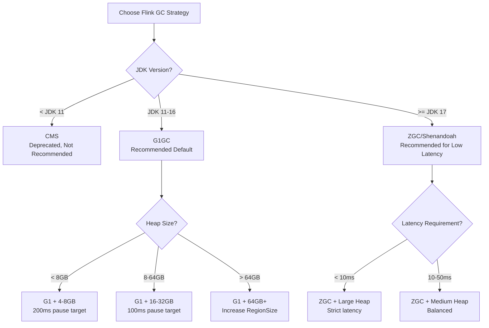
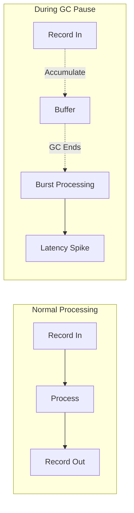

# Flink JVM GC Tuning Guide

> **Stage**: Flink/09-practices/ | **Prerequisites**: [Flink Performance Tuning Methodology](./flink-performance-tuning-methodology.md) | **Formalization Level**: L4

---

## 1. Concept Definitions

**Def-F-GC-01: GC Pause**
The period during which the JVM garbage collector stops application threads to maintain heap memory consistency. For latency-sensitive stream processing engines like Flink, long GC pauses directly lead to surging processing latency and Checkpoint timeouts.

**Def-F-GC-02: G1 Garbage Collector**
G1 (Garbage-First) is a low-latency garbage collector oriented toward server-side applications. It adopts a Region-based memory layout and incremental collection strategy, aiming to keep GC pauses within a configurable maximum pause time (`MaxGCPauseMillis`).

**Def-F-GC-03: Z Garbage Collector (ZGC)**
ZGC is a scalable low-latency garbage collector introduced in JDK 11+, supporting TB-level heaps and sub-millisecond (<10ms) GC pauses. Flink 2.0+ can experimentally use ZGC in JDK 17+ environments.

---

## 2. Property Derivation

**Lemma-F-GC-01: Inverse Correlation Between GC Frequency and Throughput**
When other conditions remain unchanged, the higher the GC frequency (i.e., the more GC occurrences per unit time), the fewer time slices available for application threads to execute Flink operator logic, resulting in lower effective throughput.

**Lemma-F-GC-02: Trade-off Between Heap Size and GC Pause**
Increasing heap memory can reduce Full GC frequency, but it also increases the scanning workload of a single GC. For G1, a moderate heap size (16GB–64GB) paired with a reasonable Region size usually achieves the optimal pause-throughput balance.

**Prop-F-GC-01: Off-Heap Memory Can Bypass Young GC Impact**
Flink's Managed Memory (used for RocksDB, network buffers, etc.) is allocated outside the JVM heap and is not directly scanned by Young GC. Therefore, moving large numbers of short-lived objects off-heap or reusing object pools can significantly reduce Young GC frequency.

---

## 3. Relations

### 3.1 GC Selection Decision Matrix



### 3.2 Memory Regions and GC Impact

| Memory Region | Purpose | GC Impact |
|---------------|---------|-----------|
| JVM Heap (Young) | User objects, temporary state | Frequent Young GC scanning |
| JVM Heap (Old) | Long-lived objects, caches | G1 Mixed/Full GC scanning |
| Managed Memory | RocksDB, network buffers, sorting | Not scanned by GC |
| Direct Memory | NIO ByteBuffer, JNI | Not scanned by GC |
| JVM Metaspace | Class metadata | Only Full GC / concurrent collection |

---

## 4. Argumentation

### 4.1 Why Is Flink Sensitive to GC?

1. **Latency Sensitivity**: Stream processing requires millisecond- to second-level latency. A 1-second GC pause can cause massive data backlogs.
2. **Checkpoint Coupling**: Checkpoint barrier propagation requires coordination among Task threads. GC pauses may trigger Checkpoint timeouts.
3. **Backpressure Amplification**: During GC, operators pause processing, causing upstream data to accumulate in buffers. After recovery, bursty backpressure is likely to occur.

### 4.2 Key GC Log Analysis Points

After collecting logs with `-Xlog:gc*:file=gc.log`, focus on the following metrics:

- **GC Frequency**: Young GC > 30 times per minute usually indicates excessive object allocation.
- **GC Pause Time**: P99 GC Pause should be < 200ms (G1) or < 10ms (ZGC).
- **Heap Collection Efficiency**: Growth trend of Old Gen after each Young GC to predict Full GC risk.

---

## 5. Proof / Engineering Argument

### 5.1 Systematic Approach to G1 GC Tuning

**Theorem (Thm-F-GC-01)**: For Flink's G1 GC configuration, there exists a set of parameters $(HeapSize, RegionSize, MaxGCPauseMillis)$ such that, under a given workload, the sum of P99 processing latency and GC Pause is minimized.

**Engineering Argument**:

1. **Baseline Measurement**: Run a typical workload with default G1 parameters, recording GC pause distribution and throughput.
2. **HeapSize Scanning**: Fix other parameters and gradually adjust HeapSize (e.g., 16GB → 32GB → 64GB), observing the curves of GC frequency and pause time.
3. **RegionSize Optimization**: For large heaps (>32GB), increase `-XX:G1HeapRegionSize` from the default 1MB to 16MB or 32MB to reduce Region management overhead.
4. **MaxGCPauseMillis Constraint**: Gradually tighten from 200ms to 100ms, observing whether throughput decline is within acceptable limits.
5. **Convergence Verification**: Repeat steps 2–4 until a Pareto optimal point is found.

---

## 6. Examples

### 6.1 Recommended G1 GC Configuration (32GB Heap)

```bash
# Pass via env.java.opts.taskmanager in flink-conf.yaml
env.java.opts.taskmanager: >
  -XX:+UseG1GC
  -Xms32g -Xmx32g
  -XX:MaxGCPauseMillis=100
  -XX:G1HeapRegionSize=16m
  -XX:+UnlockExperimentalVMOptions
  -XX:+UseContainerSupport
  -Xlog:gc*:file=/opt/flink/log/gc.log:time,uptime:filecount=5,filesize=100m
```

### 6.2 ZGC Configuration Example (JDK 17+, Large Heap Low Latency)

```bash
env.java.opts.taskmanager: >
  -XX:+UseZGC
  -Xms64g -Xmx64g
  -XX:+ZGenerational
  -XX:ZCollectionInterval=5
  -Xlog:gc*:file=/opt/flink/log/gc.log:time,uptime:filecount=5,filesize=100m
```

### 6.3 GC Log Analysis Commands

```bash
# Analyze using jvm-tools or gcviewer
java -jar gcviewer.jar gc.log

# Key output metrics
# Throughput:     > 95% is excellent
# Avg Pause:      < 100ms is excellent
# Max Pause:      < 500ms is acceptable
# Full GC Count:  0 is optimal
```

---

## 7. Visualizations

### 7.1 Latency Fluctuation Model Under GC Impact



---

## 8. References
