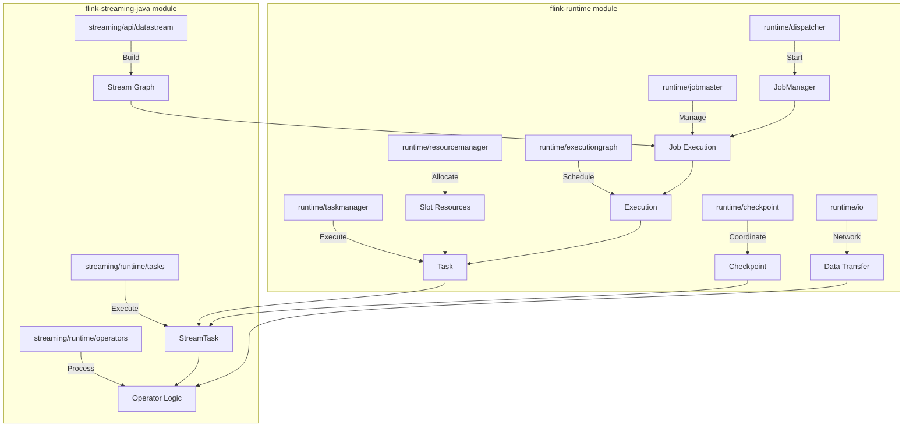
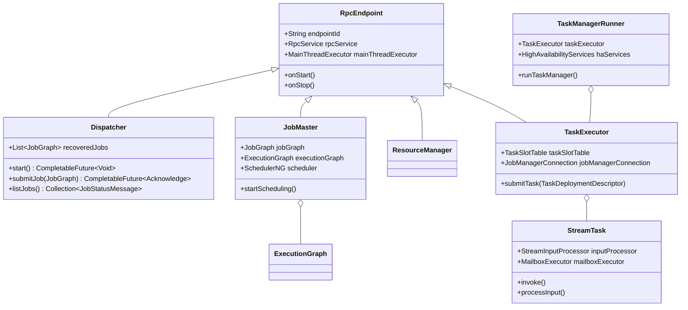
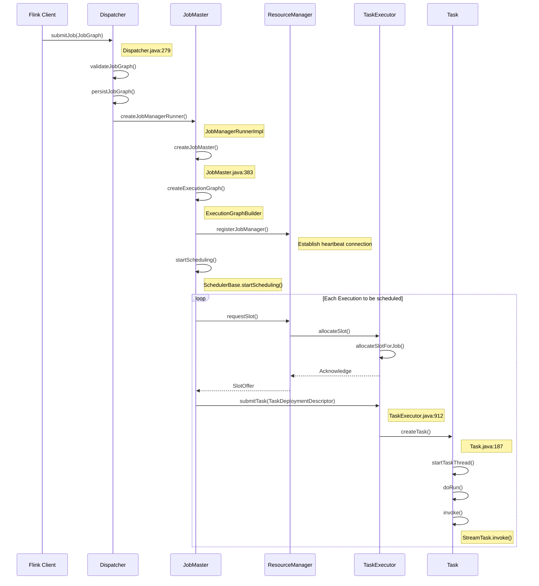
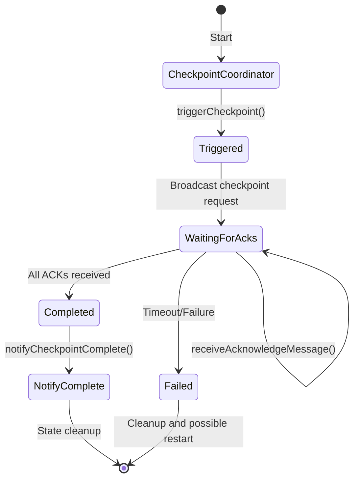
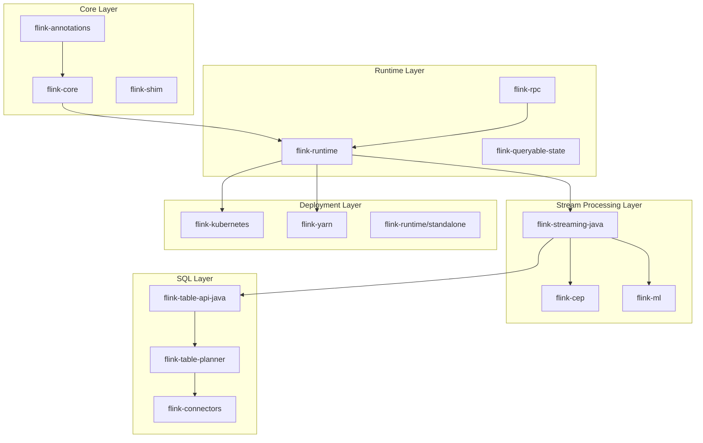
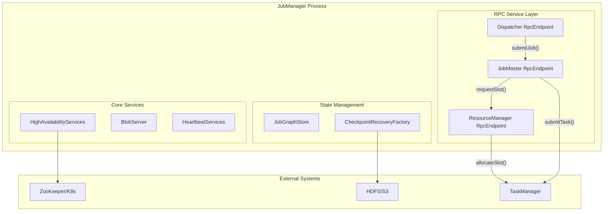
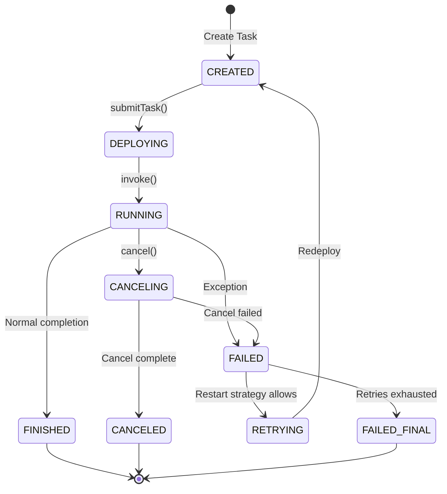
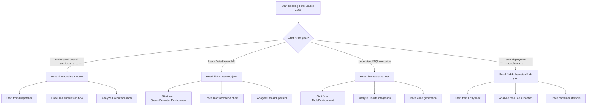

# Flink Source Code Reading Guide

> **Stage**: Flink/10-internals | **Prerequisites**: [flink-system-architecture-deep-dive.md](../01-concepts/flink-system-architecture-deep-dive.md), [Flink/04-runtime/README.md](../04-runtime/README.md) | **Formality Level**: L3 (Engineering Practice)

## 1. Definitions

### Def-F-10-01: Cognitive Model of Source Code Reading

**Definition**: Flink source code reading is a **layered, progressive knowledge construction process** that forms a deep understanding of a distributed stream processing system by establishing mappings between code entities and runtime concepts.

$$\text{CodeUnderstanding} = \langle \text{Structure}, \text{Behavior}, \text{State}, \text{Interaction} \rangle$$

Where:

- **Structure**: Module organization, package structure, class hierarchy
- **Behavior**: Method call chains, execution flows, event handling
- **State**: State variables, configuration parameters, runtime data
- **Interaction**: Component communication, protocol interaction, data flow

### Def-F-10-02: Key Entry Points

**Definition**: Entry points are the starting positions of code execution flows, characterized by:

1. Containing a `main()` method or equivalent startup method
2. Responsible for initializing core components and configurations
3. Establishing connections with other systems (RPC, network, file system, etc.)

```
Entry Point Classification:
├── Process Entry
│   ├── StandaloneSessionClusterEntrypoint (JobManager standalone mode)
│   ├── TaskManagerRunner (TaskManager entry)
│   └── CliFrontend (CLI client entry)
├── Service Entry
│   ├── Dispatcher (Job reception and distribution)
│   ├── ResourceManager (Resource management)
│   └── JobMaster (Job execution management)
└── API Entry
    ├── StreamExecutionEnvironment (DataStream API)
    ├── TableEnvironment (Table API)
    └── DataSet API (deprecated)
```

### Def-F-10-03: Code Navigation Dimensions

**Definition**: Four core dimensions of source code navigation:

| Dimension | Description | Typical Question |
|------|------|----------|
| **Vertical** | Call chain depth tracking | "What does this method ultimately call?" |
| **Horizontal** | Same-layer component relationships | "What other similar implementations exist?" |
| **Temporal** | Execution flow sequence | "When does this operation occur?" |
| **State** | Data transformation process | "When is this variable modified?" |

---

## 2. Properties

### Prop-F-10-01: Module Dependency Hierarchy

**Proposition**: Flink modules follow strict layered dependency principles.

**Proof Sketch**:

```
flink-core (basic types and interfaces)
    ↓ (depends only)
flink-runtime (runtime core)
    ↓ (depends only)
flink-streaming-java (stream processing implementation)
    ↓ (depends only)
flink-table-planner (SQL layer)
```

**Derived Properties**:

- Lower-layer modules do not depend on upper-layer modules (no circular dependencies)
- Understanding lower layers is a prerequisite for understanding upper layers
- Modifying lower layers has broader impact

### Prop-F-10-02: Core Component Lifecycle Correspondence

**Proposition**: There is a strict correspondence between component lifecycles in code and runtime process lifecycles.

| Code Component | Runtime Instance | Lifecycle |
|----------|------------|----------|
| `Dispatcher` | Service within JobManager process | Process-level |
| `JobMaster` | One per Job | Job-level |
| `ExecutionGraph` | One per Job | Job-level |
| `Task` | Multiple within each TaskManager | Task-level |
| `StreamTask` | One per Task | Task-level |

### Prop-F-10-03: Isomorphism Between Data Flow and Code Flow

**Proposition**: The path of data flow through the system is isomorphically mapped to code call chains.

**Example Mapping**:

```
Data Flow: Source → Map → Filter → Sink
         ↓      ↓       ↓       ↓
Code Chain: SourceFunction.map().filter().addSink()
         ↓      ↓       ↓       ↓
Runtime: StreamSource → OneInputStreamTask → ... → StreamSink
```

---

## 3. Relations

### 3.1 Module Structure to Runtime Component Mapping



### 3.2 Key Class Inheritance and Composition Relationships



---

## 4. Argumentation

### 4.1 Why Dispatcher Is the Recommended Entry Point for Reading JobManager

**Argumentation**:

1. **Architectural Position**: Dispatcher is the core entry component of JobManager, responsible for receiving all Job submission requests
2. **Clear Responsibilities**: Single responsibility — Job lifecycle management (submit, query, cancel)
3. **Complete Dependencies**: From Dispatcher, one can naturally extend to ResourceManager, JobMaster, and other core components
4. **Code Quality**: As a core service, the code is well-regulated and thoroughly commented

**Reading Path Design**:

```
Dispatcher.submitJob()
    ↓
JobManagerRunnerImpl.createJobManagerRunner() [standalone mode]
    ↓
JobMaster.start() → ExecutionGraphBuilder.buildGraph()
    ↓
SchedulerBase.startScheduling() → DefaultScheduler.startSchedulingInternal()
    ↓
Execution.deploy() → TaskExecutorGateway.submitTask()
```

### 4.2 Rationale for Choosing TaskManager Reading Entry Point

**Argumentation**:

Reasons for using TaskManagerRunner as the entry point:

1. **Process Boundary**: It is the startup class of the TaskManager process, containing the complete initialization flow
2. **Configuration Loading**: Shows how to parse configurations from flink-conf.yaml
3. **Service Startup**: Shows how to start core services such as RPC, network, and memory management
4. **Heartbeat Mechanism**: Contains the complete logic for establishing connections with JobManager

**Key Extension Points**:

```
TaskManagerRunner
    ↓ Creates
TaskExecutor (RPC Endpoint)
    ↓ Manages
TaskSlotTable (Slot Resources)
    ↓ Executes
Task (Runtime layer)
    ↓ Wraps
StreamTask (Streaming layer)
    ↓ Calls
StreamOperator (Business Logic)
```

---

## 5. Proof / Engineering Argument

### 5.1 Complete Tracing of Job Submission Flow

**Theorem**: The complete flow from Job submission to execution can be traced as a deterministic call chain.

**Engineering Argument**:



**Key Code Locations**:

| Stage | Class | Method | Line (approx.) |
|------|-----|------|----------|
| Job submission entry | `Dispatcher` | `submitJob()` | 279 |
| JobMaster creation | `JobManagerRunnerImpl` | `createJobManagerRunner()` | 142 |
| ExecutionGraph build | `ExecutionGraphBuilder` | `buildGraph()` | 118 |
| Scheduling start | `DefaultScheduler` | `startSchedulingInternal()` | 183 |
| Task submission | `TaskExecutor` | `submitTask()` | 912 |
| Task execution | `StreamTask` | `invoke()` | 575 |

### 5.2 Source Code Tracing of Checkpoint Flow

**Argumentation**:

Checkpoint is the core of Flink fault tolerance; its coordination flow is as follows:

```
CheckpointCoordinator.triggerCheckpoint()
    ↓
Execution.triggerCheckpoint() [Send checkpoint request to all Tasks]
    ↓
TaskExecutorGateway.triggerCheckpoint() [RPC call]
    ↓
StreamTask.triggerCheckpointAsync() [Async processing]
    ↓
CheckpointableElement.snapshotState() [Per-operator state snapshot]
    ↓
StateBackend.createCheckpointStorage() [State storage]
    ↓
CheckpointCoordinator.receiveAcknowledgeMessage() [Collect ACKs]
    ↓
CheckpointCoordinator.completePendingCheckpoint() [Complete Checkpoint]
```

**Key State Transitions**:



### 5.3 Source-Level Understanding of Data Transfer Flow

**Argumentation**:

Flink's data transfer involves efficient network layer implementation:

```
RecordWriter.emit(record)
    ↓
ChannelSelector.selectChannels(record) [Select target channels]
    ↓
BufferBuilder.append(record) [Serialize to Buffer]
    ↓
LocalBufferPool.requestBuffer() [Acquire Buffer]
    ↓
PartitionRequestQueue.enqueue() [Add to send queue]
    ↓
CreditBasedPartitionRequestHandler.channelRead() [Receiver-side processing]
    ↓
RemoteInputChannel.getNextBuffer() [Consume Buffer]
    ↓
StreamInputProcessor.processInput() [Deserialize and process]
```

---

## 6. Examples

### 6.1 Complete Tracing Example from DataStream API to Execution

**Example Scenario**: Simple Word Count program

```java

import org.apache.flink.streaming.api.environment.StreamExecutionEnvironment;
import org.apache.flink.streaming.api.datastream.DataStream;

// User code
StreamExecutionEnvironment env =
    StreamExecutionEnvironment.getExecutionEnvironment();

DataStream<String> text = env.socketTextStream("localhost", 9999);

DataStream<Tuple2<String, Integer>> counts = text
    .flatMap(new Tokenizer())
    .keyBy(0)
    .sum(1);

counts.print();
env.execute("WordCount");
```

**Source Code Tracing Path**:

**Step 1: Environment Creation**

```java

import org.apache.flink.streaming.api.environment.StreamExecutionEnvironment;

// StreamExecutionEnvironment.java
public static StreamExecutionEnvironment getExecutionEnvironment() {
    // Create local or remote environment based on context
    if (contextEnvironmentFactory != null) {
        return contextEnvironmentFactory.createExecutionEnvironment();
    }
    // Default to local environment
    return createLocalEnvironment();
}
```

**Step 2: DataStream Transformation**

```java
// DataStream.java
public <R> SingleOutputStreamOperator<R> flatMap(
        FlatMapFunction<T, R> flatMapper) {
    // Obtain type information
    TypeInformation<R> outType = TypeExtractor.getFlatMapReturnTypes(
        clean(flatMapper), getType(), Utils.getCallLocationName(), true);

    // Create transformation node
    return transform("Flat Map", outType,
        new StreamFlatMap<>(clean(flatMapper)));
}
```

**Step 3: Transformation Added to Graph**

```java

import org.apache.flink.streaming.api.environment.StreamExecutionEnvironment;

// StreamExecutionEnvironment.java
protected <T> SingleOutputStreamOperator<T> addOperator(
        String operatorName,
        TypeInformation<T> outTypeInfo,
        StreamOperatorFactory<T> operatorFactory) {

    // Create Transformation node
    OneInputTransformation<T> transformation = new OneInputTransformation<>(
        inputStream.getTransformation(),
        operatorName,
        operatorFactory,
        outTypeInfo,
        environment.getParallelism());

    // Add to transformation list
    transformations.add(transformation);

    return new SingleOutputStreamOperator<>(environment, transformation);
}
```

**Step 4: Execution Plan Generation**

```java
// StreamGraphGenerator.java
public StreamGraph generate() {
    streamGraph = new StreamGraph(executionConfig, checkpointConfig, savepointRestoreSettings);

    // Create StreamNode for each Transformation
    for (Transformation<?> transformation : transformations) {
        transform(transformation);
    }

    // Connect StreamNodes to form edges
    connectEdges();

    return streamGraph;
}
```

**Step 5: JobGraph Construction**

```java
// StreamingJobGraphGenerator.java
public JobGraph createJobGraph(StreamGraph streamGraph) {
    // Set scheduling mode
    jobGraph.setScheduleMode(streamGraph.getScheduleMode());

    // Generate JobVertex
    setChaining(streamGraph, hash -> streamGraph.getStreamNode(hash));

    // Configure physical edges
    setPhysicalEdges();

    // Set memory configuration
    setResources();

    return jobGraph;
}
```

**Step 6: ExecutionGraph Construction**

```java
// ExecutionGraphBuilder.java
public static ExecutionGraph buildGraph(...)
    throws JobExecutionException {

    // Create ExecutionJobVertex
    for (JobVertex jobVertex : jobGraph.getVertices()) {
        ExecutionJobVertex ejv = new ExecutionJobVertex(
            executionGraph, jobVertex, ...)
    }

    // Connect ExecutionVertices
    connectVertices();

    return executionGraph;
}
```

### 6.2 Debugging Trace for Custom Operator

**Example**: Implementing a custom FlatMapFunction with debug logging

```java
public class DebuggableTokenizer extends RichFlatMapFunction<String, Tuple2<String, Integer>> {

    private transient Counter counter;

    @Override
    public void open(Configuration parameters) {
        // Debug point 1: lifecycle method
        System.out.println("[DEBUG] Operator opened at: " +
            getRuntimeContext().getIndexOfThisSubtask());
        counter = getRuntimeContext().getMetricGroup().counter("recordCount");
    }

    @Override
    public void flatMap(String value, Collector<Tuple2<String, Integer>> out) {
        // Debug point 2: data processing
        System.out.println("[DEBUG] Processing: " + value);
        counter.inc();

        for (String word : value.toLowerCase().split("\\W+")) {
            if (word.length() > 0) {
                // Debug point 3: output collection
                System.out.println("[DEBUG] Emitting: " + word);
                out.collect(new Tuple2<>(word, 1));
            }
        }
    }

    @Override
    public void close() {
        // Debug point 4: cleanup
        System.out.println("[DEBUG] Operator closed");
    }
}
```

**IDE Breakpoint Recommendations**:

| Position | Class | Method | Purpose |
|------|-----|------|------|
| Operator lifecycle | `AbstractStreamOperator` | `open()` | Verify initialization |
| Data processing | `StreamFlatMap` | `processElement()` | Track data flow |
| State access | `RuntimeContext` | `getState()` | Verify state |
| Checkpoint trigger | `StreamTask` | `triggerCheckpointAsync()` | Verify fault tolerance |

---

## 7. Visualizations

### 7.1 Flink Source Code Module Dependency Diagram



### 7.2 JobManager Internal Component Interaction Diagram



### 7.3 Task Execution State Machine



### 7.4 Source Code Reading Decision Tree



---

## 8. Debugging Techniques in Detail

### 8.1 IntelliJ IDEA Configuration Guide

#### Project Import

**Step 1: Import Maven Project**

```
1. File → New → Project from Existing Sources
2. Select the pom.xml in the Flink source root directory
3. Choose "Import Maven projects automatically"
4. Wait for dependency download to complete (approx. 10-20 minutes, depending on network)
```

**Step 2: Source Code Association Configuration**

```
1. File → Project Structure → Libraries
2. Confirm that all Flink module sources are correctly associated
3. For SNAPSHOT versions, add Maven repository sources
```

**Step 3: Compiler Configuration**

```
1. Settings → Build, Execution, Deployment → Compiler → Java Compiler
2. Set Target bytecode version: 11 (Flink 1.17+)
3. Set Project bytecode version: 11
```

### 8.2 Breakpoint Setting Strategy

#### Key Breakpoint Location List

| Component | Class | Method | Line | Watch Variables |
|------|-----|------|------|----------|
| Job submission | `Dispatcher` | `submitJob()` | ~279 | jobGraph |
| JobMaster startup | `JobMaster` | `onStart()` | ~380 | jobGraph, executionGraph |
| Scheduler startup | `DefaultScheduler` | `startSchedulingInternal()` | ~183 | schedulingStrategy |
| Task submission | `TaskExecutor` | `submitTask()` | ~912 | taskDeploymentDescriptor |
| Task startup | `Task` | `run()` | ~545 | invokable |
| StreamTask execution | `StreamTask` | `invoke()` | ~575 | configuration |
| Operator processing | `StreamFlatMap` | `processElement()` | ~47 | element |
| Checkpoint trigger | `CheckpointCoordinator` | `triggerCheckpoint()` | ~652 | checkpointID |
| Checkpoint completion | `CheckpointCoordinator` | `completePendingCheckpoint()` | ~891 | pendingCheckpoint |

#### Conditional Breakpoint Examples

**Scenario**: Break only on a specific Job ID

```java
// Set conditional breakpoint in Dispatcher.submitJob()
jobGraph.getJobID().toString().equals("your-job-id")
```

**Scenario**: Break only on a specific Task

```java
// Set conditional breakpoint in TaskExecutor.submitTask()
taskDeploymentDescriptor.getJobID().toString().equals("your-job-id") &&
taskDeploymentDescriptor.getTaskInfo().getTaskName().contains("Map")
```

### 8.3 Log Analysis Techniques

#### Log Level Configuration

```yaml
# conf/log4j.properties
rootLogger.level = INFO

# Key components at DEBUG level
logger.runtime.name = org.apache.flink.runtime
logger.runtime.level = DEBUG

logger.streaming.name = org.apache.flink.streaming
logger.streaming.level = DEBUG

# Checkpoint detailed tracing
logger.checkpoint.name = org.apache.flink.runtime.checkpoint
logger.checkpoint.level = TRACE

# Network layer tracing
logger.network.name = org.apache.flink.runtime.io.network
logger.network.level = DEBUG
```

#### Key Log Patterns

```
# Job lifecycle
[JobID] Created JobManagerRunner for job
[JobID] Starting JobMaster
[JobID] Successfully created execution graph from job graph
[JobID] Starting scheduling with scheduling strategy

# Task lifecycle
[JobID] Deploying [task name] to [task manager]
[JobID] Received task [task name] at [task manager]
[JobID] [task name] switched from CREATED to DEPLOYING
[JobID] [task name] switched from DEPLOYING to RUNNING

# Checkpoint lifecycle
[JobID] Triggering checkpoint [checkpointID]
[JobID] Received acknowledge message for checkpoint [checkpointID]
[JobID] Completed checkpoint [checkpointID]
[JobID] Notifying task [task name] of checkpoint [checkpointID] completion

# Failure recovery
[JobID] Restarting failed job with restart strategy
[JobID] Cancelling job because of [failure cause]
[JobID] Failed job because of [failure cause]
```

### 8.4 Remote Debugging Configuration

#### Remote Debugging in Standalone Mode

**Step 1: Modify Startup Script**

```bash
# bin/jobmanager.sh (add debug parameters)
export JVM_ARGS="$JVM_ARGS -agentlib:jdwp=transport=dt_socket,server=y,suspend=n,address=5005"
```

**Step 2: IntelliJ Configuration**

```
1. Run → Edit Configurations → + → Remote JVM Debug
2. Name: Flink JobManager Debug
3. Host: localhost (or remote host IP)
4. Port: 5005
5. Use module classpath: flink-runtime
```

**Step 3: Start Debug Session**

```
1. Start Flink cluster first
2. Click Debug button in IntelliJ to connect
3. Set breakpoints and submit Job
```

#### TaskManager Remote Debugging

```bash
# bin/taskmanager.sh
export JVM_ARGS="$JVM_ARGS -agentlib:jdwp=transport=dt_socket,server=y,suspend=n,address=5006"
```

**Multi-TaskManager Debugging Tips**:

```bash
# Start multiple TMs with different ports
TM1: address=5006
TM2: address=5007
TM3: address=5008
```

### 8.5 Memory and Performance Profiling

#### Heap Memory Analysis

```bash
# Generate heap dump
jmap -dump:format=b,file=flink.hprof <pid>

# Analyze with Eclipse MAT or VisualVM
# Focus on:
# - org.apache.flink.runtime.executiongraph.ExecutionGraph
# - org.apache.flink.streaming.runtime.tasks.StreamTask
# - NetworkBufferPool
```

#### Thread Dump Analysis

```bash
# Obtain thread dump
jstack <pid> > thread-dump.txt

# Key thread patterns
"flink-akka.actor.default-dispatcher" - Akka message processing
"Checkpoint Timer" - Checkpoint timer
"AsyncCheckpointRunnable" - Async checkpoint thread
"Flink-MetricRegistry" - Metrics collection
```

---

## 9. Recommended Source Code Reading Paths

### 9.1 Beginner Path (2-3 weeks)

```
Week 1: Basic Concepts and API
├── Day 1-2: Read flink-core types and configuration packages
├── Day 3-4: Read StreamExecutionEnvironment and DataStream
└── Day 5-7: Trace a simple Job from API to StreamGraph

Week 2: Runtime Basics
├── Day 1-2: Read StreamGraph and JobGraph construction
├── Day 3-4: Understand ExecutionGraph structure
└── Day 5-7: Trace Job submission flow (from CLI to Execution)

Week 3: Task Execution
├── Day 1-2: Read StreamTask lifecycle
├── Day 3-4: Understand StreamOperator chained calls
└── Day 5-7: Trace data transfer between Tasks
```

### 9.2 Advanced Path (3-4 weeks)

```
Week 1: Scheduling and Resource Management
├── Day 1-2: Deep dive into Scheduler implementation (DefaultScheduler)
├── Day 3-4: Read SlotPool and SlotSharingManager
└── Day 5-7: Understand slot allocation strategies

Week 2: Checkpoint and Fault Tolerance
├── Day 1-2: Read CheckpointCoordinator
├── Day 3-4: Understand Barrier alignment and Backpressure
└── Day 5-7: Read StateBackend implementation (HeapStateBackend)

Week 3: Network Layer
├── Day 1-2: Read RecordWriter and ChannelSelector
├── Day 3-4: Understand Buffer pool and Credit-based flow control
└── Day 5-7: Read Netty server and client implementation

Week 4: Advanced Features
├── Day 1-2: Read Async I/O implementation
├── Day 3-4: Understand Broadcast State mechanism
└── Day 5-7: Read Queryable State implementation
```

### 9.3 Expert Path (4-6 weeks)

```
Week 1-2: SQL and Table API
├── Calcite integration and optimizer
├── Physical plan generation
└── Code generation mechanism

Week 3-4: Deployment and HA
├── Kubernetes integration
├── ZooKeeper high availability
└── Failure recovery mechanism

Week 5-6: Performance Optimization and Tuning
├── Serialization framework (TypeInformation)
├── Memory management and Unsafe operations
└── Metrics system implementation
```

---

## 10. Frequently Asked Questions (FAQ)

### Q1: How to quickly locate the concrete implementation of a specific feature?

**A**: Use the following search strategy:

```bash
# 1. Search by class name
grep -r "class.*CheckpointCoordinator" --include="*.java" flink-runtime/

# 2. Search by method name
grep -r "triggerCheckpoint" --include="*.java" flink-runtime/

# 3. Search by comment keywords
grep -r "TODO.*checkpoint" --include="*.java" flink-runtime/

# 4. Use Search Everywhere (double Shift) in IntelliJ
```

### Q2: How to understand the large amount of Akka code in the source?

**A**: Key concept mapping of Flink's RPC layer based on Akka:

| Akka Concept | Flink Implementation | Corresponding Position |
|----------|-----------|----------|
| Actor | RpcEndpoint | flink-rpc |
| ActorRef | RpcGateway | Interface definition |
| ActorSystem | RpcService | Creation and management |
| Props | RpcEndpoint constructor | Instantiation parameters |

**Simplified understanding**: Think of `RpcEndpoint` as a class with RPC capabilities, where method calls are automatically forwarded over the network.

### Q3: How to understand Flink's type system?

**A**: Type system core class hierarchy:

```
TypeInformation<T> (Abstract type information)
    ├── BasicTypeInfo<T> (Basic types)
    ├── TupleTypeInfo<T> (Tuple types)
    ├── PojoTypeInfo<T> (POJO types)
    ├── GenericTypeInfo<T> (Kryo serialization)
    └── PrimitiveArrayTypeInfo<T> (Array types)
```

**Key Points**:

- Type information is used for serialization/deserialization
- Prefer BasicTypeInfo and TupleTypeInfo (better performance)
- POJO types need to satisfy specific conditions (no-arg constructor, getter/setter)

### Q4: How to troubleshoot Checkpoint failures?

**A**: Troubleshooting checklist:

```
1. Check Checkpoint timeout configuration
   - state.checkpoints.timeout (default 10 minutes)

2. Check Checkpoint logs
   - grep "checkpoint" logs/flink-*-jobmanager.log

3. Confirm State Backend configuration
   - state.backend (filesystem/rocksdb)
   - state.checkpoints.dir (Checkpoint directory)

4. Check network buffers
   - taskmanager.memory.network.fraction

5. Check Barrier processing in TaskManager logs
   - grep "barrier" logs/flink-*-taskmanager.log
```

### Q5: How to contribute code to the Flink community?

**A**: Contribution workflow:

```
1. Subscribe to the dev@flink.apache.org mailing list

2. Select or create an issue in JIRA
   - https://issues.apache.org/jira/projects/FLINK

3. Fork the Flink GitHub repository
   - https://github.com/apache/flink

4. Create a branch and develop
   git checkout -b FLINK-XXXX-short-description

5. Follow code conventions
   - Format with mvn spotless:apply
   - Add unit tests
   - Update relevant documentation

6. Submit a Pull Request
   - PR title format: [FLINK-XXXX] Description
   - Link to JIRA issue
```

### Q6: What are common points of confusion when reading the source code?

**A**: Common confusion points explained:

| Confusion Point | Explanation |
|--------|------|
| Difference between RpcGateway and RpcEndpoint | Gateway is the client interface; Endpoint is the server implementation |
| Difference between ExecutionGraph and JobGraph | JobGraph is the logical graph; ExecutionGraph is the execution graph (contains parallel instances) |
| Difference between StreamTask and Task | Task is a Runtime-layer concept; StreamTask is a Streaming-layer wrapper |
| Difference between ResultPartition and IntermediateResult | ResultPartition is a physical partition; IntermediateResult is a logical result |
| Difference between LocalKeyBy and GlobalKeyBy | LocalKeyBy aggregates locally first to reduce network transfer |

### Q7: How to trace the complete path of a data record from input to output?

**A**: Tracing steps:

```
1. Source side
   - SourceFunction.run() → collect(record)

2. Serialization
   - RecordWriter.emit() → serializer.serialize(record)

3. Network transfer
   - RemoteInputChannel.getNextBuffer() → Buffer deserialization

4. Deserialization
   - StreamInputProcessor.processInput() → deserializer.deserialize()

5. Operator processing
   - StreamFlatMap.processElement() → userFunction.flatMap()

6. Output collection
   - TimestampedCollector.collect() → RecordWriter.emit()

7. Sink side
   - SinkFunction.invoke() → Write to external system
```

**Debugging Tip**: Set conditional breakpoints at RecordWriter.emit() and StreamInputProcessor.processInput(), filtering for specific record content.

### Q8: How to track API changes when upgrading Flink versions?

**A**: Version tracking strategy:

```
1. Check Release Notes
   - https://nightlies.apache.org/flink/flink-docs-stable/release-notes/

2. Compare @Deprecated annotations
   - grep -r "@Deprecated" --include="*.java" flink-streaming-java/

3. Use IntelliJ's Compare with Branch feature
   - Compare source differences between versions

4. Follow FLIP proposals
   - https://github.com/apache/flink/tree/main/flink-docs/docs/flips/
```

---

## References


---

*Document Version: 1.0 | Last Updated: 2026-04-11 | Applicable Flink Version: 1.17+*
