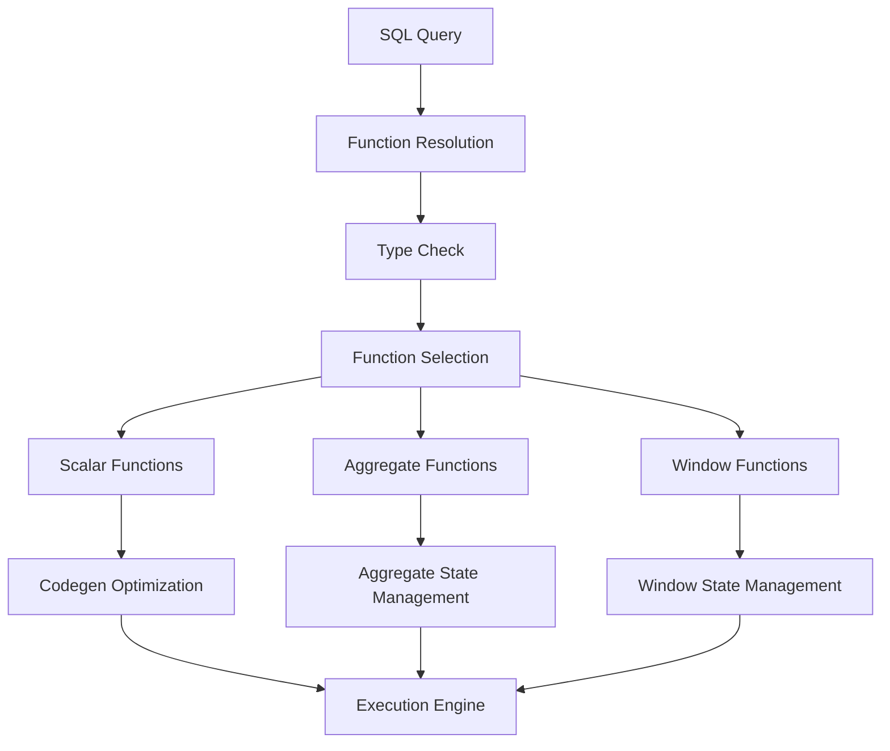
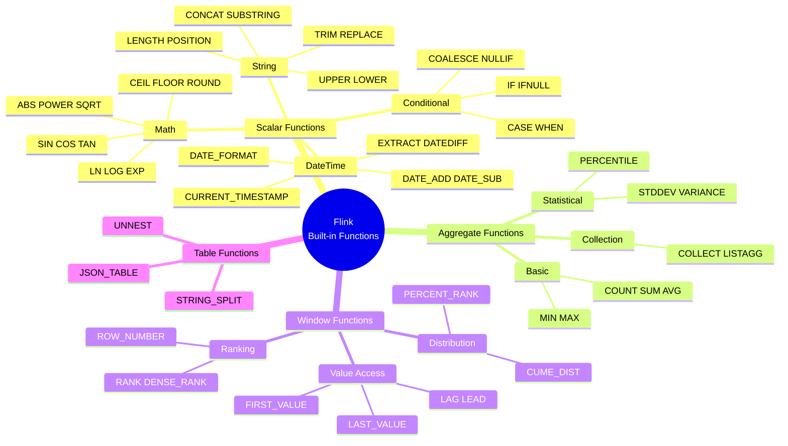
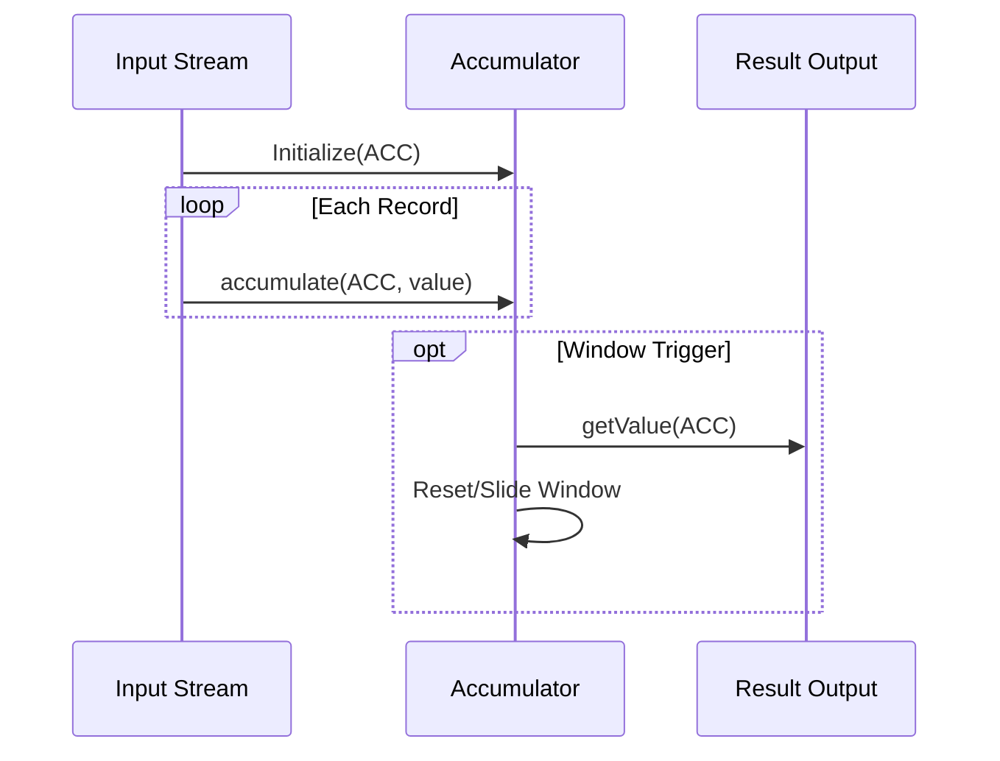

# Flink Built-in Functions Complete Reference

> Stage: Flink | Prerequisites: [data-types-complete-reference.md](./data-types-complete-reference.md) | Formalization Level: L4

---

## 1. Definitions

### Def-F-Func-01: Built-in Function System

**Definition**: The Flink SQL built-in function system is the formalized implementation of SQL standard functions in a stream computing environment:

$$
\mathcal{F} = (F_{scalar}, F_{agg}, F_{window}, F_{table}, \Sigma, \Delta)
$$

Where:

- $F_{scalar}$: Scalar function set (1:1 row transformation)
- $F_{agg}$: Aggregate function set (N:1 row aggregation)
- $F_{window}$: Window function set (computation within a window)
- $F_{table}$: Table function set (1:N row expansion)
- $\Sigma$: Function signature $\sigma: f \mapsto (domain, codomain)$
- $\Delta$: Determinism marker (deterministic / non-deterministic)

### Def-F-Func-02: Scalar Functions

**Definition**: Scalar functions map a single input row to a single output value:

$$
\forall f \in F_{scalar}: f: Row \rightarrow Value
$$

**Categories**:

| Category | Count | Examples |
|----------|-------|----------|
| Math Functions | 25+ | ABS, POWER, LN, LOG, EXP, SIN, COS |
| String Functions | 30+ | CONCAT, SUBSTRING, TRIM, REPLACE, UPPER |
| DateTime Functions | 20+ | CURRENT_DATE, DATE_FORMAT, EXTRACT, DATEDIFF |
| Conditional Functions | 10+ | COALESCE, NULLIF, CASE, IF |
| Type Conversion Functions | 15+ | CAST, TRY_CAST, TYPEOF |

### Def-F-Func-03: Aggregate Functions

**Definition**: Aggregate functions reduce multiple input rows to a single value:

$$
\forall g \in F_{agg}: g: \{Row\} \rightarrow Value
$$

**Core Aggregate Functions**:

| Function | Semantics | Incremental Computation Support |
|----------|-----------|---------------------------------|
| COUNT(*) | Count | ✅ Yes |
| SUM(expr) | Sum | ✅ Yes |
| AVG(expr) | Average | ✅ Yes |
| MIN/MAX(expr) | Min/Max | ⚠️ Partially supported |
| STDDEV(expr) | Standard deviation | ❌ No |
| COLLECT(expr) | Collect into array | ❌ No |

### Def-F-Func-04: Window Functions

**Definition**: Window functions perform calculations over a window partition without changing the number of rows:

$$
\forall w \in F_{window}: w: (Row, Window) \rightarrow Value
$$

**Window Function Categories**:

| Category | Function | Semantics |
|----------|----------|-----------|
| Ranking | ROW_NUMBER() | Unique sequence number within partition |
| Ranking | RANK() | Ranking with tie handling |
| Ranking | DENSE_RANK() | Dense ranking without gaps |
| Distribution | PERCENT_RANK() | Relative rank percentage |
| Distribution | CUME_DIST() | Cumulative distribution |
| Value Access | FIRST_VALUE(expr) | First value in window |
| Value Access | LAST_VALUE(expr) | Last value in window |
| Value Access | LAG(expr, n) | Value offset n rows backward |
| Value Access | LEAD(expr, n) | Value offset n rows forward |

---

## 2. Properties

### Lemma-F-Func-01: Function Determinism Classification

**Lemma**: Built-in functions are classified into three determinism categories:

$$
\Delta(f) = \begin{cases}
\text{DETERMINISTIC} & \text{if } f(x) = f(x) \text{ always holds} \\
\text{NON-DETERMINISTIC} & \text{if } f(x) \text{ may vary} \\
\text{DYNAMIC} & \text{if } f(x) \text{ depends on context}
\end{cases}
$$

**Classification Examples**:

| Determinism | Function Examples | Description |
|-------------|-------------------|-------------|
| Deterministic | ABS, UPPER, CONCAT | Same input always produces same output |
| Non-deterministic | RAND(), CURRENT_TIMESTAMP | Each call may produce different results |
| Dynamic | SESSION_USER, CURRENT_DATABASE | Depends on execution context |

### Lemma-F-Func-02: NULL Propagation Rule

**Lemma**: Most built-in functions follow the **NULL input → NULL output** principle:

$$
f(\text{NULL}) = \text{NULL}, \quad \forall f \in F_{scalar} \setminus F_{null\_handling}
$$

**Exception Functions** (explicitly handle NULL):

- `COALESCE(a, b, ...)` - Returns first non-NULL value
- `NULLIF(a, b)` - Returns NULL if a=b, otherwise returns a
- `IFNULL(a, b)` - Returns b if a is NULL
- `IS NULL` / `IS NOT NULL` - NULL predicate

### Prop-F-Func-01: Type Inference Completeness

**Proposition**: The type system can infer the result type of any valid function expression.

```
Input Type → Type Check → Implicit Conversion → Function Execution → Output Type
    ↑___________________________|
          (Type Compatibility Validation)
```

---

## 3. Relations

### 3.1 SQL Standard Compatibility

| Standard Source | Coverage | Description |
|-----------------|----------|-------------|
| ANSI SQL-92 | 95% | Core functions fully compatible |
| ANSI SQL:2016 | 80% | JSON functions partially compatible |
| Apache Calcite | 100% | Based on Calcite SQL parser |
| Extension Functions | - | Flink-specific functions |

### 3.2 Function Dependency and Optimization



### 3.3 Stream-Batch Function Semantic Consistency

| Function | Stream Semantics | Batch Semantics | Consistency |
|----------|------------------|-----------------|-------------|
| COUNT | Continuous accumulation | Global count | ✅ Consistent |
| SUM | Incremental update | Global sum | ✅ Consistent |
| RANK | Rank within window | Global rank | ⚠️ Requires window constraint |
| LAG | Preceding in stream | Preceding after sort | ✅ Consistent |

---

## 4. Argumentation

### 4.1 TRY_CAST Design Decision

**Question**: Why is `TRY_CAST` needed?

**Argumentation**:

- **Problem**: `CAST` throws an exception on conversion failure, interrupting query execution
- **Solution**: `TRY_CAST` returns NULL instead of an exception
- **Trade-off**: Slightly lower performance (requires exception catching), but improves fault tolerance

**Usage Scenario Comparison**:

```sql
-- Strict mode: failure throws error
SELECT CAST('invalid' AS INT);  -- throws exception

-- Fault-tolerant mode: failure returns NULL
SELECT TRY_CAST('invalid' AS INT);  -- returns NULL
```

### 4.2 Window Functions vs Grouped Aggregation

| Characteristic | Grouped Aggregation | Window Functions |
|----------------|---------------------|------------------|
| Output rows | ≤ Input rows | = Input rows |
| Semantics | Data compression | Additional computed columns |
| Usage position | SELECT + GROUP BY | SELECT clause |
| Typical use | Statistical summary | Ranking, trend analysis |

---

## 5. Proof / Engineering Argument

### Thm-F-Func-01: Aggregate Function Incremental Computation Correctness

**Theorem**: Aggregate functions supporting incremental computation produce results in stream processing consistent with batch processing.

**Proof** (taking SUM as an example):

1. **Batch processing**: $SUM_{batch} = \sum_{i=1}^{n} x_i$
2. **Stream incremental processing**: $SUM_{stream} = \sum_{k} \Delta_k$, where $\Delta_k$ is the micro-batch increment
3. **Equivalence**: $\sum_{i=1}^{n} x_i = \sum_{k} \sum_{i \in batch_k} x_i$

### Thm-F-Func-02: Window Function Computational Complexity

**Theorem**: The time complexity of ranking window functions is $O(n \log n)$, and value-access functions is $O(n)$.

**Engineering Optimization Strategies**:

- **Ranking**: Use efficient sorting algorithms, maintain partition-ordered structures
- **Value Access**: Use ring buffers to maintain window boundaries
- **Incremental Update**: Reuse computation results when window slides

---

## 6. Examples

### 6.1 Math Functions Example

```sql
-- Math functions usage
SELECT
    order_id,
    amount,
    ABS(amount) AS abs_amount,
    ROUND(amount, 2) AS rounded,
    POWER(amount, 2) AS squared,
    SQRT(ABS(amount)) AS root,
    LN(amount + 1) AS log_natural,
    MOD(order_id, 100) AS bucket
FROM orders;
```

### 6.2 String Functions Example

```sql
-- String processing
SELECT
    email,
    UPPER(email) AS email_upper,
    LOWER(SUBSTRING(email, 1, POSITION('@' IN email) - 1)) AS username,
    TRIM(BOTH ' ' FROM email) AS trimmed,
    REPLACE(email, '@', '[at]') AS obfuscated,
    CONCAT(first_name, ' ', last_name) AS full_name,
    LENGTH(email) AS email_length
FROM users;
```

### 6.3 DateTime Functions Example

```sql
-- DateTime processing
SELECT
    event_time,
    CURRENT_DATE AS today,
    DATE_FORMAT(event_time, 'yyyy-MM-dd HH:mm:ss') AS formatted,
    EXTRACT(YEAR FROM event_time) AS year,
    EXTRACT(MONTH FROM event_time) AS month,
    DATEDIFF(CURRENT_DATE, DATE(event_time)) AS days_ago,
    DATE_ADD(DATE(event_time), 7) AS next_week,
    TIMESTAMPADD(HOUR, 8, event_time) AS beijing_time
FROM events;
```

### 6.4 Aggregate Functions Example

```sql
-- Aggregate analysis
SELECT
    category,
    COUNT(*) AS total_orders,
    COUNT(DISTINCT user_id) AS unique_users,
    SUM(amount) AS total_amount,
    AVG(amount) AS avg_amount,
    MIN(amount) AS min_amount,
    MAX(amount) AS max_amount,
    STDDEV(amount) AS std_amount,
    PERCENTILE(amount, 0.95) AS p95_amount
FROM orders
GROUP BY category;
```

### 6.5 Window Functions Example

```sql
-- Window analysis
SELECT
    user_id,
    order_time,
    amount,

    -- Ranking functions
    ROW_NUMBER() OVER (ORDER BY amount DESC) AS row_num,
    RANK() OVER (ORDER BY amount DESC) AS rank_num,
    DENSE_RANK() OVER (ORDER BY amount DESC) AS dense_rank,

    -- Partition ranking
    ROW_NUMBER() OVER (PARTITION BY user_id ORDER BY order_time) AS user_order_seq,

    -- Value access functions
    FIRST_VALUE(amount) OVER (PARTITION BY user_id ORDER BY order_time) AS first_order,
    LAST_VALUE(amount) OVER (PARTITION BY user_id ORDER BY order_time) AS last_order,
    LAG(amount, 1, 0) OVER (PARTITION BY user_id ORDER BY order_time) AS prev_order,
    LEAD(amount, 1, 0) OVER (PARTITION BY user_id ORDER BY order_time) AS next_order,

    -- Distribution functions
    PERCENT_RANK() OVER (ORDER BY amount) AS pct_rank,
    CUME_DIST() OVER (ORDER BY amount) AS cum_dist
FROM orders;
```

### 6.6 Conditional and NULL Handling

```sql
-- Conditional expressions
SELECT
    user_id,
    amount,

    -- CASE expression
    CASE
        WHEN amount < 100 THEN 'small'
        WHEN amount < 1000 THEN 'medium'
        ELSE 'large'
    END AS order_size,

    -- Simplified condition
    IF(amount > 1000, 'VIP', 'Regular') AS customer_type,

    -- NULL handling
    COALESCE(phone, email, 'N/A') AS contact,
    NULLIF(status, 'deleted') AS active_status,
    IFNULL(discount, 0) AS final_discount
FROM orders;
```

---

## 7. Visualizations

### 7.1 Function Classification Hierarchy



### 7.2 Aggregation Computation Flow



---

## 8. References
