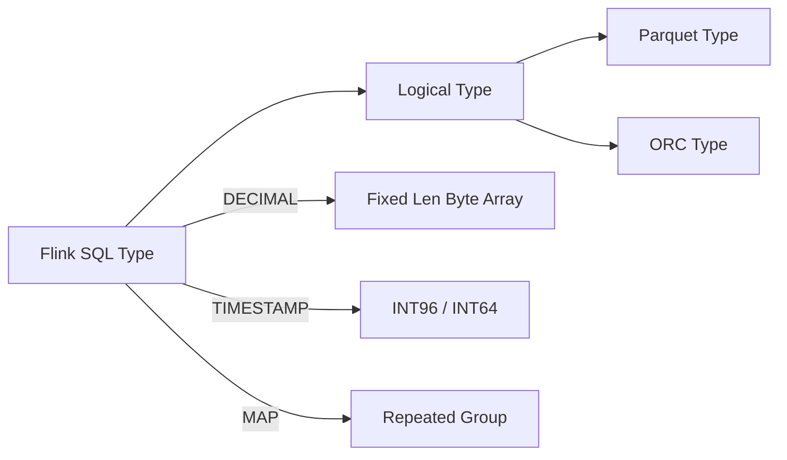
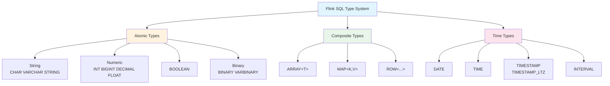
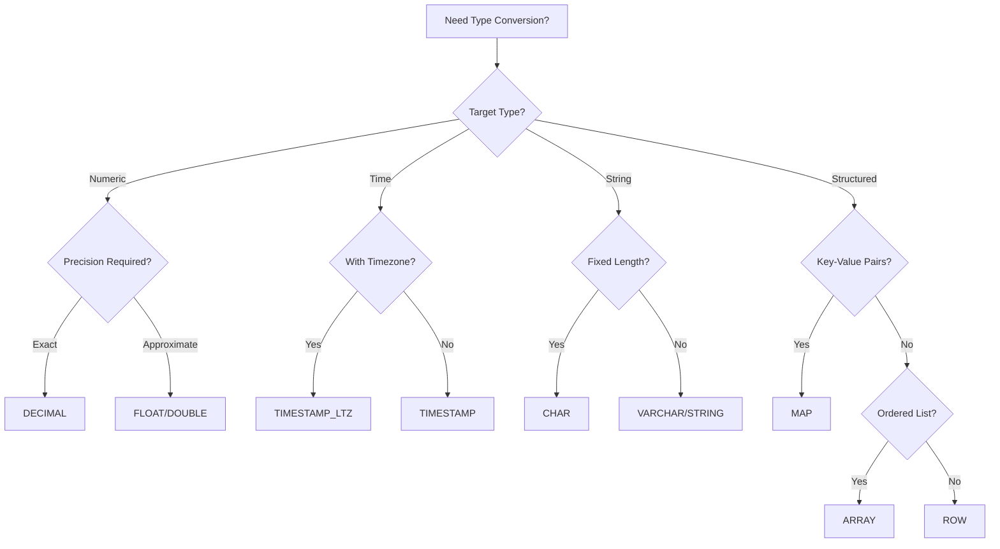

# Flink Data Types Complete Reference

> Stage: Flink | Prerequisites: [Flink/00-QUICK-START.md](00-meta/00-QUICK-START.md) | Formalization Level: L4

---

## 1. Concept Definitions (Definitions)

### Def-F-DataType-01: Data Type System

**Definition**: The Flink SQL data type system is the engineering implementation of type theory in the stream computing domain, defined as a quintuple:

$$
\mathcal{T}_{Flink} = (T_{atomic}, T_{composite}, T_{time}, \prec, \Sigma)
$$

Where:

- $T_{atomic}$: Atomic type set (indivisible base types)
- $T_{composite}$: Composite type set (nestable structured types)
- $T_{time}$: Time type set (stream-computing-specialized time-related types)
- $\prec$: Type partial order relation (implicit conversion direction)
- $\Sigma$: Type signature mapping (operator to type constraint mapping)

### Def-F-DataType-02: Atomic Types

**Definition**: Atomic types are indivisible data types whose values are semantically treated as single units:

$$
T_{atomic} = \{STRING, BOOLEAN, NUMERIC, BINARY\}
$$

| Category | Type | Storage Range | Physical Representation |
|----------|------|---------------|-------------------------|
| String | CHAR(n), VARCHAR(n), STRING | 1~2³¹-1 bytes | UTF-8 encoded |
| Boolean | BOOLEAN | {true, false} | 1 byte |
| Numeric | TINYINT, SMALLINT, INT, BIGINT | Signed integers | 1/2/4/8 bytes |
| Numeric | DECIMAL(p,s), FLOAT, DOUBLE | Floating/fixed point | Variable/4/8 bytes |
| Binary | BINARY(n), VARBINARY(n), BYTES | Raw byte sequence | Fixed/variable length |

### Def-F-DataType-03: Composite Types

**Definition**: Composite types are structured types composed of other types:

$$
\begin{aligned}
ARRAY\langle T \rangle &= \{ [e_1, e_2, ..., e_n] \mid e_i \in T \} \\
MAP\langle K, V \rangle &= \{ (k_i, v_i) \mid k_i \in K \land v_i \in V \} \\
ROW\langle f_1:T_1, ..., f_n:T_n \rangle &= \{ (f_1:v_1, ..., f_n:v_n) \mid v_i \in T_i \}
\end{aligned}
$$

### Def-F-DataType-04: Time Types

**Definition**: Flink time types are stream-computing-scenario-specialized time representations:

$$
T_{time} = \{ DATE, TIME, TIMESTAMP, TIMESTAMP_LTZ, INTERVAL \}
$$

**Semantic Distinction**:

| Type | Semantics | Timezone Handling | Typical Application Scenario |
|------|-----------|-------------------|------------------------------|
| TIMESTAMP | Local timestamp | No timezone info | Business event occurrence time |
| TIMESTAMP_LTZ | Timestamp with timezone | UTC internal storage | Cross-timezone data sync |
| DATE | Calendar date | No timezone | Day-level partitioning |
| TIME | Time of day | No timezone | Time period analysis |
| INTERVAL | Time span | - | Window computation |

---

## 2. Property Derivation (Properties)

### Lemma-F-DataType-01: Type Completeness

**Lemma**: The Flink SQL type system is type-complete with respect to the standard SQL data model.

**Proof Points**:

1. **Atomic Type Coverage**: All standard SQL atomic types have corresponding implementations
2. **Composite Type Closure**: Composite types can be recursively nested, forming algebraic data types
3. **Null Handling**: All types support NULL values, satisfying three-valued logic

### Lemma-F-DataType-02: Type Conversion Monotonicity

**Lemma**: The type conversion relation $\prec$ forms a partially ordered set, satisfying:

$$
\forall T_1, T_2, T_3 \in \mathcal{T}: T_1 \prec T_2 \land T_2 \prec T_3 \Rightarrow T_1 \prec T_3
$$

**Implicit Conversion Chain**:

```
TINYINT → SMALLINT → INT → BIGINT → DECIMAL → DOUBLE
CHAR → VARCHAR → STRING
DATE → TIMESTAMP → TIMESTAMP_LTZ
```

### Prop-F-DataType-01: Type Safety Guarantee

**Proposition**: All type mismatch errors can be detected at compile time.

$$
\forall Q \in SQL: \text{TypeCheck}(Q) = \bot \Rightarrow \nexists E: \text{Execute}(Q, E) \neq \text{Error}
$$

---

## 3. Relationship Establishment (Relations)

### 3.1 SQL Standard Type Mapping

| ANSI SQL Type | Flink SQL Type | Compatibility |
|---------------|----------------|---------------|
| CHARACTER(n) | CHAR(n) | ✅ Fully Compatible |
| CHARACTER VARYING(n) | VARCHAR(n) | ✅ Fully Compatible |
| INTEGER | INT | ✅ Fully Compatible |
| DECIMAL(p,s) | DECIMAL(p,s) | ✅ Fully Compatible |
| TIMESTAMP WITH TIME ZONE | TIMESTAMP_LTZ | ⚠️ Semantically equivalent, different name |

### 3.2 Java/Scala Physical Type Mapping

| Flink SQL Type | Java Type | Scala Type | Serializer |
|----------------|-----------|------------|------------|
| STRING | java.lang.String | String | StringSerializer |
| INT | java.lang.Integer | Int | IntSerializer |
| BIGINT | java.lang.Long | Long | LongSerializer |
| DECIMAL(p,s) | java.math.BigDecimal | BigDecimal | BigDecSerializer |
| TIMESTAMP(3) | java.time.LocalDateTime | LocalDateTime | LocalDateTimeSerializer |

### 3.3 Parquet/ORC Format Mapping



---

## 4. Argumentation Process (Argumentation)

### 4.1 DECIMAL Precision Design Decision

**Question**: Why choose DECIMAL over FLOAT for precise numeric computation?

**Argumentation**:

- **Floating-point Error**: FLOAT/DOUBLE uses IEEE 754 representation, incurring precision loss
- **Financial Scenarios**: Currency computation requires precision to the cent, DECIMAL(19,4) satisfies this
- **Performance Tradeoff**: DECIMAL computation is slower than FLOAT, but correctness takes priority

### 4.2 TIMESTAMP vs TIMESTAMP_LTZ Selection

**Decision Matrix**:

| Scenario | Recommended Type | Reason |
|----------|------------------|--------|
| Single-timezone application | TIMESTAMP | Simple and intuitive, no timezone conceptual burden |
| Multi-timezone application | TIMESTAMP_LTZ | Unified UTC storage, frontend localized display |
| Kafka Integration | TIMESTAMP_LTZ | Kafka uses UTC epoch millis |

---

## 5. Formal Proof / Engineering Argument (Proof / Engineering Argument)

### Thm-F-DataType-01: Type Consistency Guarantee

**Theorem**: Under Exactly-Once semantics, the type state after Checkpoint recovery is consistent with the pre-failure state.

**Proof**:

1. **Serialization Consistency**: TypeSerializer guarantees the value-to-byte mapping is bijective
2. **Snapshot Atomicity**: Checkpoint barrier ensures atomic persistence of type state
3. **Recovery Isomorphism**: Deserialization is the inverse of serialization, type information is fully preserved

### Thm-F-DataType-02: Type Inference Completeness

**Theorem**: For any valid Flink SQL query, the type inference algorithm can compute the result schema.

**Engineering Argument**:

```
Input: Abstract Syntax Tree AST(Q)
Output: Result Type Schema(Q)

1. Leaf node type = Table metadata || Literal type
2. Unary operation type = TypeRule(op, input_type)
3. Binary operation type = Coalesce(TypeRule(op, left, right))
4. Aggregation type = Combine(partial_types)
5. Return root node type
```

---

## 6. Example Validation (Examples)

### 6.1 DDL Type Definition Example

```sql
-- Create a table with the complete type system
CREATE TABLE user_events (
    -- Atomic types
    user_id BIGINT,
    username VARCHAR(128),
    is_active BOOLEAN,
    score DECIMAL(10, 2),
    avatar BINARY(1024),

    -- Time types
    birth_date DATE,
    login_time TIME,
    event_ts TIMESTAMP(3),
    event_ts_utc TIMESTAMP_LTZ(3),

    -- Composite types
    tags ARRAY<STRING>,
    properties MAP<STRING, STRING>,
    address ROW<
        street STRING,
        city STRING,
        zipcode STRING,
        coordinates ROW<lat DOUBLE, lon DOUBLE>
    >,

    -- Watermark definition
    WATERMARK FOR event_ts AS event_ts - INTERVAL '5' SECOND
) WITH (
    'connector' = 'kafka',
    'topic' = 'user-events',
    'format' = 'json'
);
```

### 6.2 Type Conversion Example

```sql
-- Implicit conversion (automatic)
SELECT
    user_id + 1.5 AS user_id_double,  -- BIGINT → DOUBLE
    CONCAT('ID:', CAST(user_id AS STRING)) AS user_id_str
FROM user_events;

-- Explicit conversion (CAST)
SELECT
    CAST(event_ts AS DATE) AS event_date,
    CAST(score AS INT) AS score_int,  -- Truncates decimals
    TRY_CAST(username AS INT) AS username_maybe  -- Returns NULL on failure
FROM user_events;
```

### 6.3 Java API Type Usage

```java
// [伪代码片段 - 不可直接运行] 仅展示核心逻辑
import org.apache.flink.table.api.DataTypes;
import org.apache.flink.table.api.Schema;

import org.apache.flink.api.common.typeinfo.Types;


// Programmatic schema definition
Schema schema = Schema.newBuilder()
    .column("user_id", DataTypes.BIGINT().notNull())
    .column("username", DataTypes.VARCHAR(128))
    .column("tags", DataTypes.ARRAY(DataTypes.STRING()))
    .column("address", DataTypes.ROW(
        DataTypes.FIELD("street", DataTypes.STRING()),
        DataTypes.FIELD("city", DataTypes.STRING())
    ))
    .columnByExpression("event_ts", "PROCTIME()")
    .build();
```

---

## 7. Visualizations (Visualizations)

### 7.1 Type System Hierarchy Diagram



### 7.2 Type Conversion Decision Tree



---

## 8. References (References)
