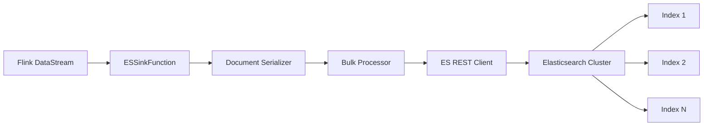
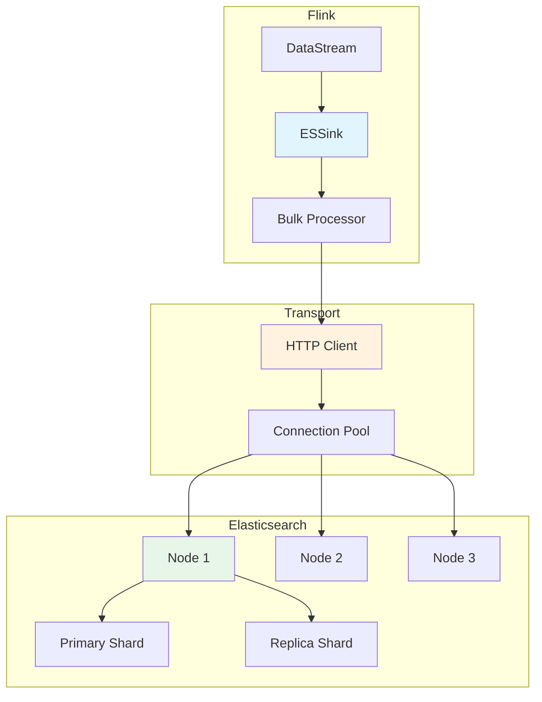
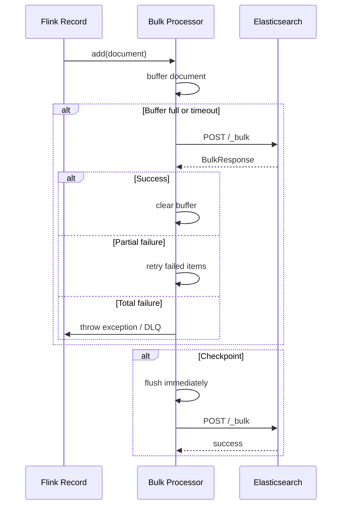

# Elasticsearch Connector Detailed Guide

> Stage: Flink | Prerequisites: [data-types-complete-reference.md](./data-types-complete-reference.md) | Formalization Level: L4

---

## 1. Concept Definitions (Definitions)

### Def-F-ES-01: Elasticsearch Sink Definition

**Definition**: Elasticsearch Sink is a connector that writes Flink data streams to an ES cluster:

$$
\text{ESSink} = \langle C, I, B, R, S \rangle
$$

Where:

- $C$: Cluster configuration $\langle hosts, username, password, ssl \rangle$
- $I$: Index configuration $\langle indexName, type, routing \rangle$
- $B$: Batch configuration $\langle batchSize, batchInterval, maxActions \rangle$
- $R$: Retry configuration $\langle maxRetries, retryInterval \rangle$
- $S$: Serialization configuration

**Core Semantics**:

$$
\forall r \in \text{Stream}: r \xrightarrow{serialize} \text{Doc} \xrightarrow{bulk} \text{ES Index}
$$

### Def-F-ES-02: Index and Document Model

**Definition**: Elasticsearch data organization hierarchy:

| Level | Concept | Relational Database Mapping |
|-------|---------|-----------------------------|
| Cluster | Cluster | Database instance |
| Index | Index | Table |
| Shard | Shard | Partition |
| Document | Document | Row |
| Field | Field | Column |

**Formal Representation**:

$$
\text{Index} = \{ \text{Doc}_1, \text{Doc}_2, ..., \text{Doc}_n \}
$$

$$
\text{Doc} = \langle \_id: String, \_source: JSON, \_version: Long, \_timestamp: Long \rangle
$$

### Def-F-ES-03: Bulk API Mechanism

**Definition**: Bulk API packages multiple operations into a single request:

$$
\text{BulkRequest} = [\text{IndexOp} | \text{UpdateOp} | \text{DeleteOp}]^{+}
$$

Constraints:

- $|\text{BulkRequest}| \leq bulk.flush.max.actions$
- $size(\text{BulkRequest}) \leq bulk.flush.max.size$

### Def-F-ES-04: Idempotent Write Semantics

**Definition**: Achieving Exactly-Once semantics through `_id`:

$$
\forall \text{checkpoint}: \text{records processed} \rightarrow \text{ES committed}
$$

$$
\land \text{failure} \rightarrow \text{replay from checkpoint}
$$

$$
\land \text{no duplicate documents (by } \_id \text{)}
$$

---

## 2. Property Derivation (Properties)

### Lemma-F-ES-01: Batch Size vs Latency Tradeoff

**Lemma**: Increasing `bulk.flush.max.actions` improves throughput but increases latency:

$$
\text{Latency} \approx \frac{N_{actions}}{\lambda_{arrival}} + RTT_{network} + T_{processing}
$$

$$
\text{Throughput} \approx \frac{N_{actions}}{\text{Latency}}
$$

Where:

- $\lambda_{arrival}$: Record arrival rate
- $RTT_{network}$: Network round-trip latency
- $T_{processing}$: ES processing time

### Lemma-F-ES-02: Write Performance Boundary

**Lemma**: ES Sink maximum throughput is constrained by the following factors:

$$
T_{max} = \min(T_{bulk}, T_{es}, T_{network})
$$

Where:

- $T_{bulk}$: Bulk API throughput
- $T_{es}$: ES cluster indexing capacity (shard count × single shard throughput)
- $T_{network}$: Network bandwidth / average document size

### Prop-F-ES-01: Version Conflict Handling

**Proposition**: When multiple concurrent writes target the same document:

$$
\text{if } (v_{provided} = v_{current}) \lor (v_{provided} > v_{current}) \Rightarrow \text{update succeeds}
$$

$$
\text{if } v_{provided} < v_{current} \Rightarrow \text{VersionConflictException}
$$

---

## 3. Relationship Establishment (Relations)

### 3.1 Flink Stream to ES Index Mapping



### 3.2 Data Type Mapping

| Flink SQL Type | Elasticsearch Type | Description |
|----------------|-------------------|-------------|
| STRING | `text` / `keyword` | text for full-text search, keyword for exact match |
| INT / BIGINT | `integer` / `long` | Integer types |
| DECIMAL | `scaled_float` | Fixed-point storage |
| FLOAT / DOUBLE | `float` / `double` | Floating point |
| BOOLEAN | `boolean` | Boolean value |
| TIMESTAMP | `date` | Date/time |
| ARRAY | `array` | Array type |
| MAP / ROW | `object` / `nested` | Nested object |

### 3.3 Checkpoint and Flush Relationship

```
Flink Checkpoint
    ↓ (trigger)
Flush All Buffered Documents
    ↓ (wait)
Bulk Response ACK
    ↓ (confirm)
Checkpoint Complete
```

---

## 4. Argumentation Process (Argumentation)

### 4.1 Dynamic Index Naming Strategy

**Strategy Comparison**:

| Strategy | Implementation | Applicable Scenario |
|----------|----------------|---------------------|
| Static Index | Fixed index name | Small-scale data |
| Time Rotation | `logs-{date}` | Log scenarios |
| Field Routing | Based on record field | Multi-tenant scenarios |

### 4.2 Failure Handling Strategy

| Strategy | Behavior | Data Guarantee |
|----------|----------|----------------|
| Ignore | Ignore failure | Possible data loss |
| Fail | Job fails | Strict consistency |
| Retry | Exponential backoff retry | Eventual consistency |
| DLQ | Write to dead letter queue | Auditable recovery |

---

## 5. Formal Proof / Engineering Argument (Proof / Engineering Argument)

### Thm-F-ES-01: At-Least-Once Correctness

**Theorem**: With Checkpoint enabled, ES Sink provides At-Least-Once semantics.

**Proof Sketch**:

1. Records enter the buffer after arriving at Sink
2. Checkpoint forces Flush of all buffered data
3. Checkpoint is acknowledged only after Flush succeeds
4. After failure recovery, replay from the last successful Checkpoint
5. Therefore all records are written at least once

### Thm-F-ES-02: Exactly-Once Conditions

**Theorem**: ES Sink can achieve Exactly-Once when the following conditions are met:

1. **Idempotent Write**: Use `_id` to ensure document uniqueness
2. **UPSERT Semantics**: `index` operation overwrites or creates document
3. **Version Control**: Use external version number to control concurrency

**Proof**:

- Multiple writes of the same record are overwritten because `_id` is the same
- Final result is equivalent to exactly-once write

---

## 6. Example Validation (Examples)

### 6.1 Maven Dependencies

```xml
<dependency>
    <groupId>org.apache.flink</groupId>
    <artifactId>flink-connector-elasticsearch7</artifactId>
    <version>3.0.1-1.17</version>
</dependency>

<!-- Or use Elasticsearch 8 -->
<dependency>
    <groupId>org.apache.flink</groupId>
    <artifactId>flink-connector-elasticsearch8</artifactId>
    <version>3.0.1-1.17</version>
</dependency>
```

### 6.2 DataStream API Example

```java
import org.apache.flink.connector.elasticsearch.sink.Elasticsearch7SinkBuilder;
import org.apache.flink.connector.elasticsearch.sink.ElasticsearchEmitter;
import org.apache.http.HttpHost;
import org.elasticsearch.action.index.IndexRequest;
import org.elasticsearch.client.Requests;

import java.util.HashMap;
import java.util.Map;

// Create ES Sink
ElasticsearchSink<Event> esSink = new Elasticsearch7SinkBuilder<Event>()
    .setBulkFlushMaxActions(1000)
    .setBulkFlushInterval(5000)
    .setHosts(new HttpHost("localhost", 9200))
    // Authentication config (if needed)
    .setRestClientFactory(
        restClientBuilder -> {
            restClientBuilder.setDefaultHeaders(
                new Header[]{new BasicHeader("Authorization", "ApiKey xxx")}
            );
        }
    )
    // Document builder
    .setEmitter((element, context, indexer) -> {
        Map<String, Object> json = new HashMap<>();
        json.put("user_id", element.getUserId());
        json.put("event_type", element.getEventType());
        json.put("timestamp", element.getTimestamp());
        json.put("data", element.getData());

        IndexRequest request = Requests.indexRequest()
            .index("events-" + element.getDate())
            .id(element.getEventId())  // Set _id for idempotency
            .source(json);

        indexer.add(request);
    })
    .build();

// Add to stream
stream.sinkTo(esSink);
```

### 6.3 Table API / SQL Example

```sql
-- Create Elasticsearch table
CREATE TABLE user_events (
    user_id STRING,
    event_type STRING,
    event_time TIMESTAMP,
    properties MAP<STRING, STRING>,
    -- Metadata column
    INDEX VARCHAR METADATA FROM 'index'
) WITH (
    'connector' = 'elasticsearch-7',
    'hosts' = 'http://localhost:9200',
    'index' = 'user-events-{event_time|yyyy.MM.dd}',
    'document-id' = 'user_id-event_time',
    'bulk-flush.max-actions' = '1000',
    'bulk-flush.interval' = '5000',
    'format' = 'json'
);

-- Write data
INSERT INTO user_events
SELECT
    user_id,
    event_type,
    event_time,
    properties
FROM kafka_source;
```

### 6.4 Configuration Template

```java
// Advanced configuration example
ElasticsearchSink<Event> esSink = new Elasticsearch7SinkBuilder<Event>()
    // Batch configuration
    .setBulkFlushMaxActions(1000)
    .setBulkFlushMaxSizeMb(5)
    .setBulkFlushInterval(5000)

    // Retry configuration
    .setBulkFlushBackoffStrategy(
        ElasticsearchSinkBase.FlushBackoffType.EXPONENTIAL,
        8,    // Max retries
        1000  // Initial retry interval (ms)
    )

    // Connection configuration
    .setHosts(
        new HttpHost("es-node1", 9200),
        new HttpHost("es-node2", 9200),
        new HttpHost("es-node3", 9200)
    )

    // Failure handling
    .setFailureHandler(new RetryRejectedExecutionFailureHandler())

    // Document builder
    .setEmitter(new MyElasticsearchEmitter())
    .build();
```

---

## 7. Visualizations (Visualizations)

### 7.1 ES Connector Architecture Diagram



### 7.2 Bulk Processing Flow



### 7.3 Index Design Decision Tree

```mermaid
flowchart TD
    A[Design ES Index] --> B{Data Scale?}
    B -->|Small| C[Single Index]
    B -->|Large| D{Time Characteristic?}

    D -->|Time-series| E[Time-rotated Index<br/>logs-{YYYY.MM.DD}]
    D -->|Non-time-series| F{Multi-tenant?}

    F -->|Yes| G[Tenant-routed<br/>Index Alias]
    F -->|No| H[Business Partition]

    C --> I[Configure Mapping]
    E --> I
    G --> I
    H --> I

    I --> J{Field Type?}
    J -->|Text Search| K[text + keyword]
    J -->|Exact Match| L[keyword]
    J -->|Numeric Range| M[numeric + range]
```

---

## 8. References (References)
