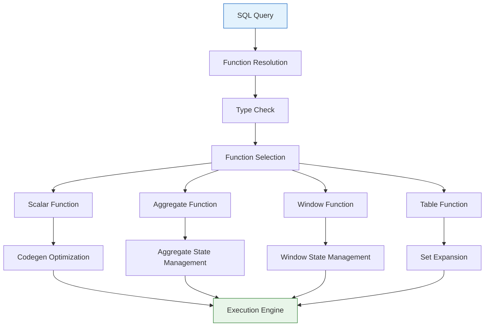
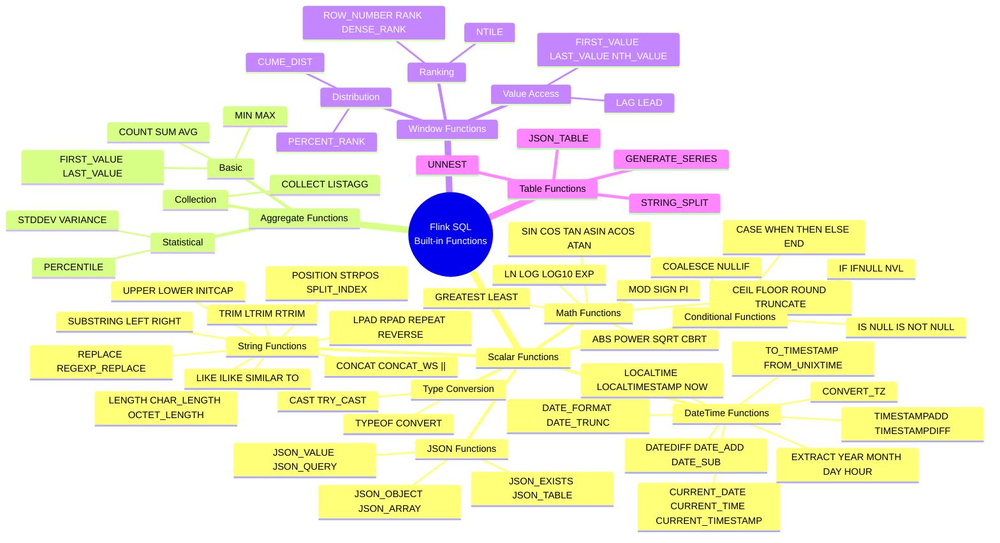
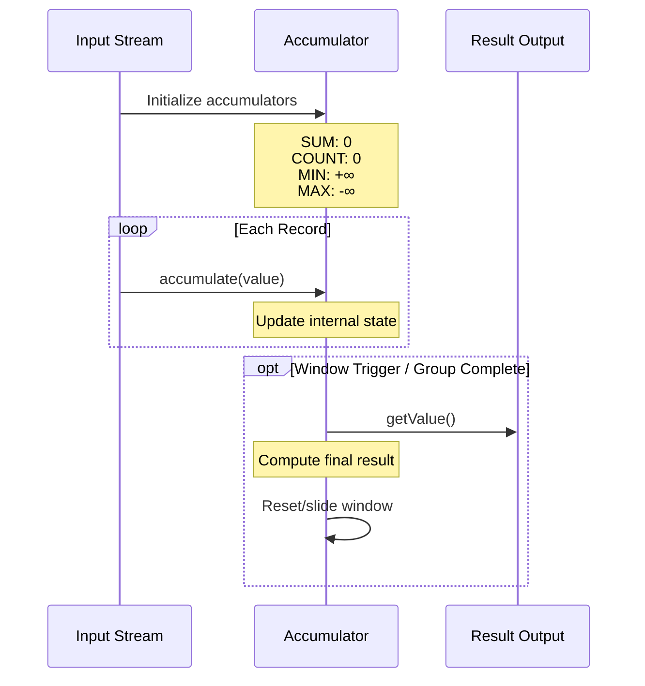
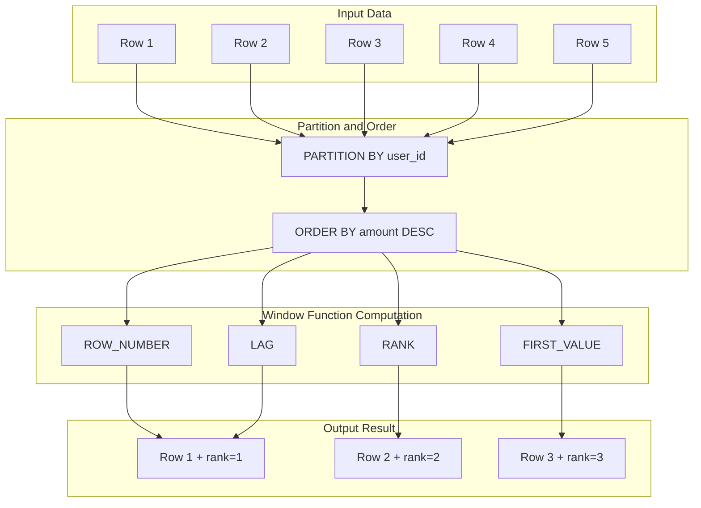

# Flink Built-in Functions Complete Reference

> Stage: Flink | Prerequisites: [flink-data-types-reference.md](./flink-data-types-reference.md) | Formalization Level: L4

---

## 1. Definitions

### Def-F-02-01: Built-in Function System

**Definition**: The Flink SQL built-in function system is the formalized implementation of SQL standard functions in the stream computing environment:

$$
\mathcal{F} = (F_{scalar}, F_{agg}, F_{window}, F_{table}, \Sigma, \Delta)
$$

Where:

- $F_{scalar}$: Scalar function set (1:1 row transformation)
- $F_{agg}$: Aggregate function set (N:1 row aggregation)
- $F_{window}$: Window function set (computations within windows)
- $F_{table}$: Table function set (1:N row expansion)
- $\Sigma$: Function signature $\sigma: f \mapsto (domain, codomain)$
- $\Delta$: Determinism marker (deterministic / non-deterministic)

### Def-F-02-02: Scalar Functions

**Definition**: Scalar functions map a single row input to a single row output:

$$
\forall f \in F_{scalar}: f: Row \rightarrow Value
$$

**Categories and Count Statistics**:

| Category | Function Count | Main Functions | Examples |
|----------|----------------|----------------|----------|
| **Math Functions** | 30+ | Numeric computation | ABS, POWER, LN, LOG, EXP, SIN, COS |
| **String Functions** | 35+ | Text processing | CONCAT, SUBSTRING, TRIM, REPLACE, UPPER |
| **DateTime Functions** | 25+ | Time operations | CURRENT_DATE, DATE_FORMAT, EXTRACT, DATEDIFF |
| **Conditional Functions** | 10+ | Logical judgment | COALESCE, NULLIF, CASE, IF |
| **Type Conversion Functions** | 15+ | Type conversion | CAST, TRY_CAST, TYPEOF |
| **JSON Functions** | 10+ | JSON processing | JSON_VALUE, JSON_QUERY, JSON_OBJECT |
| **Other Functions** | 20+ | Auxiliary functions | UUID, MD5, SHA256 |

### Def-F-02-03: Aggregate Functions

**Definition**: Aggregate functions reduce multiple row inputs to a single value:

$$
\forall g \in F_{agg}: g: \{Row\} \rightarrow Value
$$

**Core Aggregate Function Table**:

| Function | Syntax | Return Type | Incremental Computation Support | Applicable Types |
|----------|--------|-------------|--------------------------------|------------------|
| `COUNT(*)` | `COUNT(*)` | BIGINT | ✅ Yes | Any |
| `COUNT(expr)` | `COUNT(column)` | BIGINT | ✅ Yes | Any |
| `COUNT(DISTINCT)` | `COUNT(DISTINCT col)` | BIGINT | ⚠️ Partial | Any |
| `SUM(expr)` | `SUM(column)` | Same as input | ✅ Yes | Numeric |
| `AVG(expr)` | `AVG(column)` | DOUBLE/DECIMAL | ✅ Yes | Numeric |
| `MIN(expr)` | `MIN(column)` | Same as input | ⚠️ Partial | Comparable |
| `MAX(expr)` | `MAX(column)` | Same as input | ⚠️ Partial | Comparable |
| `STDDEV(expr)` | `STDDEV(column)` | DOUBLE | ❌ No | Numeric |
| `VARIANCE(expr)` | `VARIANCE(column)` | DOUBLE | ❌ No | Numeric |
| `COLLECT(expr)` | `COLLECT(column)` | ARRAY | ❌ No | Any |
| `LISTAGG(expr)` | `LISTAGG(str, delimiter)` | STRING | ❌ No | String |

### Def-F-02-04: Window Functions

**Definition**: Window functions perform computations over window partitions without changing the number of rows:

$$
\forall w \in F_{window}: w: (Row, Window) \rightarrow Value
$$

**Complete Window Function List**:

| Category | Function | Syntax | Return Value | Description |
|----------|----------|--------|--------------|-------------|
| **Ranking** | `ROW_NUMBER()` | `ROW_NUMBER() OVER (...)` | BIGINT | Unique sequence number, no ties |
| | `RANK()` | `RANK() OVER (...)` | BIGINT | Handles ties, with gaps |
| | `DENSE_RANK()` | `DENSE_RANK() OVER (...)` | BIGINT | Handles ties, no gaps |
| | `NTILE(n)` | `NTILE(4) OVER (...)` | INT | Bucket number |
| **Distribution** | `PERCENT_RANK()` | `PERCENT_RANK() OVER (...)` | DOUBLE | Relative rank percentage |
| | `CUME_DIST()` | `CUME_DIST() OVER (...)` | DOUBLE | Cumulative distribution |
| **Value Access** | `FIRST_VALUE(expr)` | `FIRST_VALUE(col) OVER (...)` | Same as input | First value in window |
| | `LAST_VALUE(expr)` | `LAST_VALUE(col) OVER (...)` | Same as input | Last value in window |
| | `NTH_VALUE(expr, n)` | `NTH_VALUE(col, 3) OVER (...)` | Same as input | nth value in window |
| | `LAG(expr, offset, default)` | `LAG(col, 1, 0) OVER (...)` | Same as input | Look backward |
| | `LEAD(expr, offset, default)` | `LEAD(col, 1, 0) OVER (...)` | Same as input | Look forward |

---

## 2. Properties

### Lemma-F-02-01: Function Determinism Classification

**Lemma**: Built-in functions are classified into three categories by determinism:

$$
\Delta(f) = \begin{cases}
\text{DETERMINISTIC} & \text{if } f(x) = f(x) \text{ always holds} \\
\text{NON-DETERMINISTIC} & \text{if } f(x) \text{ may vary between calls} \\
\text{DYNAMIC} & \text{if } f(x) \text{ depends on execution context}
\end{cases}
$$

**Determinism Classification Table**:

| Determinism | Function Examples | Description |
|-------------|-------------------|-------------|
| **Deterministic** | `ABS`, `UPPER`, `CONCAT`, `DATE_ADD` | Same input always produces same output |
| **Non-deterministic** | `RAND()`, `CURRENT_TIMESTAMP`, `UUID()` | Each call may produce different results |
| **Dynamic** | `SESSION_USER`, `CURRENT_DATABASE`, `CURRENT_SCHEMA` | Depends on execution context |

### Lemma-F-02-02: Null Propagation Rules

**Lemma**: Most built-in functions follow the **NULL input → NULL output** principle:

$$
f(\text{NULL}) = \text{NULL}, \quad \forall f \in F_{scalar} \setminus F_{null\_handling}
$$

**Exception Function Table** (explicitly handle NULL):

| Function | Syntax | Behavior | Example |
|----------|--------|----------|---------|
| `COALESCE` | `COALESCE(a, b, ...)` | Returns first non-NULL value | `COALESCE(NULL, 1, 2)` → 1 |
| `NULLIF` | `NULLIF(a, b)` | Returns NULL if a=b, otherwise a | `NULLIF(5, 5)` → NULL |
| `IFNULL` | `IFNULL(a, b)` | Returns b if a is NULL | `IFNULL(NULL, 'default')` → 'default' |
| `IS NULL` | `a IS NULL` | Checks if NULL | `NULL IS NULL` → TRUE |
| `IS NOT NULL` | `a IS NOT NULL` | Checks if not NULL | `5 IS NOT NULL` → TRUE |
| `NVL` | `NVL(a, b)` | Same as IFNULL | `NVL(NULL, 0)` → 0 |

### Prop-F-02-01: Type Inference Completeness

**Proposition**: The type system can infer the result type of any valid function expression.

```
Input type → Type check → Implicit conversion → Function execution → Output type
    ↑___________________________|
          (Type compatibility validation)
```

---

## 3. Relations

### 3.1 SQL Standard Compatibility

| Standard Source | Coverage | Description |
|-----------------|----------|-------------|
| ANSI SQL-92 | 95% | Core functions fully compatible |
| ANSI SQL:2016 | 80% | JSON functions partially compatible |
| Apache Calcite | 100% | Based on Calcite SQL parser |
| Flink Extensions | - | Stream-computing-specific functions |

### 3.2 Function Dependency and Execution Flow



### 3.3 Stream-Batch Function Semantic Consistency

| Function | Streaming Semantics | Batch Semantics | Consistency |
|----------|---------------------|-----------------|-------------|
| COUNT | Continuous accumulation | Global count | ✅ Consistent |
| SUM | Incremental update | Global sum | ✅ Consistent |
| AVG | Incremental average | Global average | ✅ Consistent |
| RANK | Rank within window | Global rank | ⚠️ Requires window constraint |
| LAG | Preceding in stream | Preceding after ordering | ✅ Consistent |

---

## 4. Argumentation

### 4.1 TRY_CAST vs CAST Design Decision

**Question**: Why is `TRY_CAST` needed?

**Argument**:

| Characteristic | CAST | TRY_CAST |
|----------------|------|----------|
| Failure behavior | Throws exception | Returns NULL |
| Performance | Higher | Slightly lower (exception catching) |
| Fault tolerance | Low | High |
| Applicable scenarios | Strict data validation | Fault-tolerant data processing |

**Usage Scenario Comparison**:

```sql
-- Strict mode: failure aborts query
SELECT CAST('invalid' AS INT);  -- Throws exception, query interrupted

-- Fault-tolerant mode: failure returns NULL
SELECT TRY_CAST('invalid' AS INT);  -- Returns NULL, continues execution
```

### 4.2 Window Functions vs Grouped Aggregation Comparison

| Characteristic | Grouped Aggregation | Window Functions |
|----------------|---------------------|------------------|
| Output row count | ≤ Input row count | = Input row count |
| Semantics | Data compression/summary | Additional computed columns |
| Usage position | SELECT + GROUP BY | SELECT clause |
| Typical applications | Statistical summary | Ranking, trend analysis, inter-row computation |
| State requirements | Grouping state | Window buffer |

---

## 5. Proof / Engineering Argument

### Thm-F-02-01: Aggregate Function Incremental Computation Correctness

**Theorem**: Aggregate functions supporting incremental computation produce results in stream processing consistent with batch processing.

**Proof** (using SUM as example):

1. **Batch semantics**:
   $$SUM_{batch} = \sum_{i=1}^{n} x_i$$

2. **Stream incremental semantics**:
   $$SUM_{stream} = \sum_{k} \Delta_k$$
   Where $\Delta_k$ is the micro-batch increment

3. **Equivalence proof**:
   $$\sum_{i=1}^{n} x_i = \sum_{k} \sum_{i \in batch_k} x_i$$
   Proved by associativity and commutativity of addition.

### Thm-F-02-02: Window Function Computation Complexity

**Theorem**: Ranking window functions have time complexity $O(n \log n)$, and value-access functions have $O(n)$.

**Engineering Optimization Strategies**:

- **Ranking** ($O(n \log n)$): Use efficient sorting algorithms, maintain partition-ordered structures
- **Value-access** ($O(n)$): Use ring buffers to maintain window boundaries
- **Incremental update**: Reuse computation results when window slides, amortized $O(1)$

---

## 6. Examples

### 6.1 Math Functions Complete Example

```sql
-- Math function usage
SELECT
    order_id,
    amount,

    -- Basic operations
    ABS(amount) AS abs_amount,
    ROUND(amount, 2) AS rounded,
    CEIL(amount) AS ceiling,
    FLOOR(amount) AS flooring,

    -- Power and roots
    POWER(amount, 2) AS squared,
    SQRT(ABS(amount)) AS square_root,
    CBRT(amount) AS cube_root,

    -- Logarithms
    LN(amount + 1) AS natural_log,
    LOG10(amount + 1) AS log_base_10,
    LOG(2, amount + 1) AS log_base_2,
    EXP(amount) AS exponential,

    -- Trigonometric functions
    SIN(amount) AS sine,
    COS(amount) AS cosine,
    TAN(amount) AS tangent,

    -- Modulo and sign
    MOD(order_id, 100) AS bucket,
    SIGN(amount) AS sign_value,
    PI() AS pi_constant,

    -- Boundary limits
    GREATEST(amount, 100) AS at_least_100,
    LEAST(amount, 10000) AS at_most_10000
FROM orders;
```

### 6.2 String Functions Complete Example

```sql
-- String processing
SELECT
    email,

    -- Case conversion
    UPPER(email) AS email_upper,
    LOWER(email) AS email_lower,
    INITCAP(email) AS email_title_case,

    -- Substring extraction
    SUBSTRING(email, 1, 5) AS first_5_chars,
    SUBSTRING(email FROM 1 FOR 5) AS first_5_alt,
    LEFT(email, 3) AS left_3,
    RIGHT(email, 4) AS domain_suffix,

    -- Position search
    POSITION('@' IN email) AS at_position,
    STRPOS(email, '@') AS at_position_alt,

    -- Substring extraction (position-based)
    SUBSTRING(email, 1, POSITION('@' IN email) - 1) AS username,
    SUBSTRING(email, POSITION('@' IN email) + 1) AS domain,

    -- Whitespace handling
    TRIM(BOTH ' ' FROM email) AS trimmed,
    TRIM(LEADING ' ' FROM email) AS ltrimmed,
    TRIM(TRAILING ' ' FROM email) AS rtrimmed,

    -- Replacement
    REPLACE(email, '@', '[at]') AS obfuscated,
    REGEXP_REPLACE(email, '@.*', '') AS regex_username,

    -- Concatenation
    CONCAT(first_name, ' ', last_name) AS full_name,
    first_name || ' ' || last_name AS full_name_alt,
    CONCAT_WS(' - ', first_name, last_name, email) AS joined,

    -- Length and padding
    LENGTH(email) AS email_length,
    CHAR_LENGTH(email) AS char_length,
    OCTET_LENGTH(email) AS byte_length,
    LPAD(order_id::STRING, 10, '0') AS padded_id,
    RPAD(status, 10, '_') AS r_padded_status,

    -- Repeat and reverse
    REPEAT('*', LENGTH(password)) AS masked_password,
    REVERSE(email) AS reversed_email,

    -- Containment checks
    email LIKE '%@gmail.com' AS is_gmail,
    email ILIKE '%@GMAIL.COM' AS is_gmail_case_insensitive,
    email SIMILAR TO '[a-z]+@[a-z]+\.[a-z]+' AS valid_pattern,

    -- Splitting
    SPLIT_INDEX(email, '@', 0) AS split_username,
    SPLIT_INDEX(email, '@', 1) AS split_domain
FROM users;
```

### 6.3 DateTime Functions Complete Example

```sql
-- DateTime processing
SELECT
    event_time,

    -- Current time functions
    CURRENT_DATE AS today,
    CURRENT_TIME AS current_time,
    CURRENT_TIMESTAMP AS now,
    LOCALTIME AS local_time,
    LOCALTIMESTAMP AS local_timestamp,
    NOW() AS now_alt,

    -- Formatting
    DATE_FORMAT(event_time, 'yyyy-MM-dd HH:mm:ss') AS formatted,
    DATE_FORMAT(event_time, 'yyyy年MM月dd日') AS chinese_format,

    -- Component extraction
    EXTRACT(YEAR FROM event_time) AS year,
    EXTRACT(MONTH FROM event_time) AS month,
    EXTRACT(DAY FROM event_time) AS day,
    EXTRACT(HOUR FROM event_time) AS hour,
    EXTRACT(MINUTE FROM event_time) AS minute,
    EXTRACT(SECOND FROM event_time) AS second,
    EXTRACT(WEEK FROM event_time) AS week_of_year,
    EXTRACT(DOW FROM event_time) AS day_of_week,
    EXTRACT(DOY FROM event_time) AS day_of_year,
    EXTRACT(QUARTER FROM event_time) AS quarter,

    -- Convenient extraction functions
    YEAR(event_time) AS year_alt,
    MONTH(event_time) AS month_alt,
    DAYOFMONTH(event_time) AS day_alt,
    DAYOFWEEK(event_time) AS dayofweek_alt,
    DAYOFYEAR(event_time) AS dayofyear_alt,
    HOUR(event_time) AS hour_alt,
    MINUTE(event_time) AS minute_alt,
    SECOND(event_time) AS second_alt,

    -- Date computation
    DATE(event_time) AS date_only,
    TIME(event_time) AS time_only,
    DATEDIFF(CURRENT_DATE, DATE(event_time)) AS days_ago,
    DATEDIFF(event_time, TIMESTAMP '2024-01-01') AS days_since_year_start,

    -- Date arithmetic
    DATE_ADD(DATE(event_time), 7) AS next_week,
    DATE_SUB(DATE(event_time), 30) AS month_ago,
    event_time + INTERVAL '1' DAY AS tomorrow_same_time,
    event_time - INTERVAL '2' HOUR AS two_hours_ago,
    TIMESTAMPADD(HOUR, 8, event_time) AS beijing_time,
    TIMESTAMPDIFF(DAY, TIMESTAMP '2024-01-01', event_time) AS day_diff,

    -- Month start/end
    DATE_TRUNC('MONTH', event_time) AS month_start,
    LAST_DAY(event_time) AS month_end,

    -- Timezone conversion
    CONVERT_TZ(event_time, 'UTC', 'Asia/Shanghai') AS shanghai_time,
    TO_TIMESTAMP_LTZ(UNIX_TIMESTAMP(event_time) * 1000, 3) AS as_ltz,

    -- Others
    UNIX_TIMESTAMP(event_time) AS unix_seconds,
    UNIX_TIMESTAMP(event_time) * 1000 AS unix_millis,
    FROM_UNIXTIME(UNIX_TIMESTAMP(event_time)) AS from_unix
FROM events;
```

### 6.4 Aggregate Functions Complete Example

```sql
-- Aggregation analysis
SELECT
    category,

    -- Basic counting
    COUNT(*) AS total_orders,
    COUNT(order_id) AS count_order_id,
    COUNT(DISTINCT user_id) AS unique_users,
    COUNT(DISTINCT DATE(event_time)) AS active_days,

    -- Sum and average
    SUM(amount) AS total_amount,
    AVG(amount) AS avg_amount,
    SUM(amount) / COUNT(*) AS manual_avg,

    -- Min/max
    MIN(amount) AS min_amount,
    MAX(amount) AS max_amount,
    MIN(event_time) AS first_order_time,
    MAX(event_time) AS last_order_time,

    -- Range statistics
    MAX(amount) - MIN(amount) AS amount_range,

    -- Statistical functions
    STDDEV(amount) AS std_amount,
    STDDEV_SAMP(amount) AS std_sample,
    STDDEV_POP(amount) AS std_population,
    VARIANCE(amount) AS variance_amount,
    VAR_SAMP(amount) AS var_sample,
    VAR_POP(amount) AS var_population,

    -- Percentiles
    PERCENTILE(amount, 0.5) AS median,
    PERCENTILE(amount, 0.95) AS p95,
    PERCENTILE(amount, 0.99) AS p99,

    -- Collection aggregation
    COLLECT(user_id) AS user_list,
    COLLECT(DISTINCT user_id) AS unique_user_list,

    -- String aggregation
    LISTAGG(product_name, ', ') AS product_list,
    LISTAGG(DISTINCT category, ' | ') AS category_list,

    -- First/last values
    FIRST_VALUE(amount) AS first_amount,
    LAST_VALUE(amount) AS last_amount,

    -- Conditional aggregation
    COUNT(*) FILTER (WHERE amount > 1000) AS high_value_count,
    SUM(amount) FILTER (WHERE status = 'completed') AS completed_amount,
    AVG(amount) FILTER (WHERE payment_method = 'credit_card') AS cc_avg
FROM orders
GROUP BY category;
```

### 6.5 Window Functions Complete Example

```sql
-- Window analysis
SELECT
    user_id,
    order_time,
    amount,
    category,

    -- Ranking functions (global)
    ROW_NUMBER() OVER (ORDER BY amount DESC) AS overall_rank,
    RANK() OVER (ORDER BY amount DESC) AS overall_rank_with_ties,
    DENSE_RANK() OVER (ORDER BY amount DESC) AS overall_dense_rank,

    -- Ranking functions (partitioned)
    ROW_NUMBER() OVER (PARTITION BY category ORDER BY amount DESC) AS category_rank,
    RANK() OVER (PARTITION BY category ORDER BY amount DESC) AS category_rank_ties,
    DENSE_RANK() OVER (PARTITION BY category ORDER BY amount DESC) AS category_dense_rank,
    NTILE(4) OVER (ORDER BY amount) AS quartile,

    -- Partition ordering
    ROW_NUMBER() OVER (PARTITION BY user_id ORDER BY order_time) AS user_order_seq,

    -- Value access functions
    FIRST_VALUE(amount) OVER (PARTITION BY user_id ORDER BY order_time) AS first_order,
    LAST_VALUE(amount) OVER (
        PARTITION BY user_id
        ORDER BY order_time
        ROWS BETWEEN UNBOUNDED PRECEDING AND UNBOUNDED FOLLOWING
    ) AS last_order,
    NTH_VALUE(amount, 2) OVER (PARTITION BY user_id ORDER BY order_time) AS second_order,

    -- Offset functions
    LAG(amount, 1, 0) OVER (PARTITION BY user_id ORDER BY order_time) AS prev_order,
    LAG(amount, 2, 0) OVER (PARTITION BY user_id ORDER BY order_time) AS prev_2_order,
    LEAD(amount, 1, 0) OVER (PARTITION BY user_id ORDER BY order_time) AS next_order,
    LEAD(amount, 3, 0) OVER (PARTITION BY user_id ORDER BY order_time) AS next_3_order,

    -- Change computation
    amount - LAG(amount, 1, 0) OVER (PARTITION BY user_id ORDER BY order_time) AS amount_change,
    (amount - LAG(amount, 1, amount) OVER (PARTITION BY user_id ORDER BY order_time))
        / LAG(amount, 1, amount) OVER (PARTITION BY user_id ORDER BY order_time) * 100 AS pct_change,

    -- Distribution functions
    PERCENT_RANK() OVER (ORDER BY amount) AS pct_rank,
    CUME_DIST() OVER (ORDER BY amount) AS cum_dist,

    -- Moving average
    AVG(amount) OVER (
        PARTITION BY user_id
        ORDER BY order_time
        ROWS BETWEEN 2 PRECEDING AND CURRENT ROW
    ) AS moving_avg_3,

    -- Cumulative sum
    SUM(amount) OVER (
        PARTITION BY user_id
        ORDER BY order_time
        ROWS BETWEEN UNBOUNDED PRECEDING AND CURRENT ROW
    ) AS running_total,

    -- Window total percentage
    amount / SUM(amount) OVER (PARTITION BY user_id) * 100 AS pct_of_user_total,
    amount / SUM(amount) OVER () * 100 AS pct_of_grand_total

FROM orders;
```

### 6.6 Conditional and Null Handling Complete Example

```sql
-- Conditional expressions
SELECT
    user_id,
    amount,
    status,
    discount,
    phone,
    email,

    -- CASE expression (full form)
    CASE
        WHEN amount < 100 THEN 'small'
        WHEN amount < 1000 THEN 'medium'
        WHEN amount < 10000 THEN 'large'
        ELSE 'enterprise'
    END AS order_size,

    -- CASE expression (simple form)
    CASE status
        WHEN 'pending' THEN 'Pending'
        WHEN 'processing' THEN 'Processing'
        WHEN 'completed' THEN 'Completed'
        WHEN 'cancelled' THEN 'Cancelled'
        ELSE 'Unknown'
    END AS status_en,

    -- Simplified conditional functions
    IF(amount > 1000, 'VIP', 'Regular') AS customer_type,
    IF(status = 'completed', amount, 0) AS completed_amount,

    -- Null handling
    COALESCE(phone, email, 'N/A') AS primary_contact,
    COALESCE(discount, 0) AS safe_discount,
    COALESCE(discount, 0, amount * 0.1) AS discount_or_default,

    -- NULL conditional checks
    NULLIF(status, 'deleted') AS active_status,
    IFNULL(discount, 0) AS final_discount,
    NVL(discount, 0) AS nvl_discount,

    -- Existence checks
    phone IS NULL AS has_no_phone,
    email IS NOT NULL AS has_email,
    COALESCE(phone, email) IS NOT NULL AS has_contact,

    -- Conditional aggregation (within window functions)
    COUNT(*) FILTER (WHERE status = 'completed') OVER () AS total_completed,

    -- NULL-safe comparison
    NULLIF(amount, 0) AS safe_divisor,
    amount / NULLIF(discount, 0) AS risky_division_safe
FROM orders;
```

---

## 7. Visualizations

### 7.1 Function Classification Hierarchy Diagram



### 7.2 Aggregate Computation Flow



### 7.3 Window Function Execution Model



---

## 8. References
