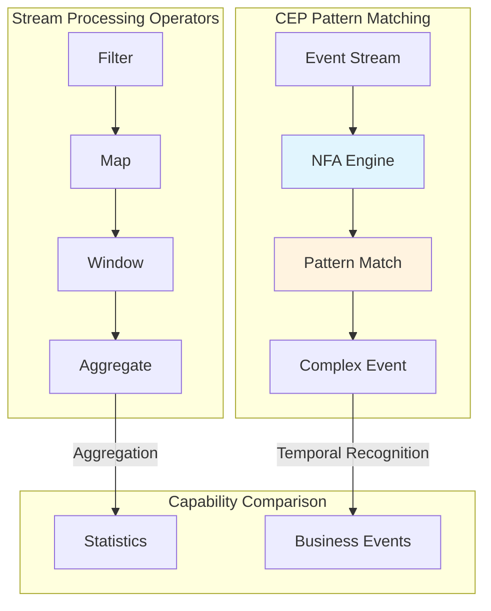
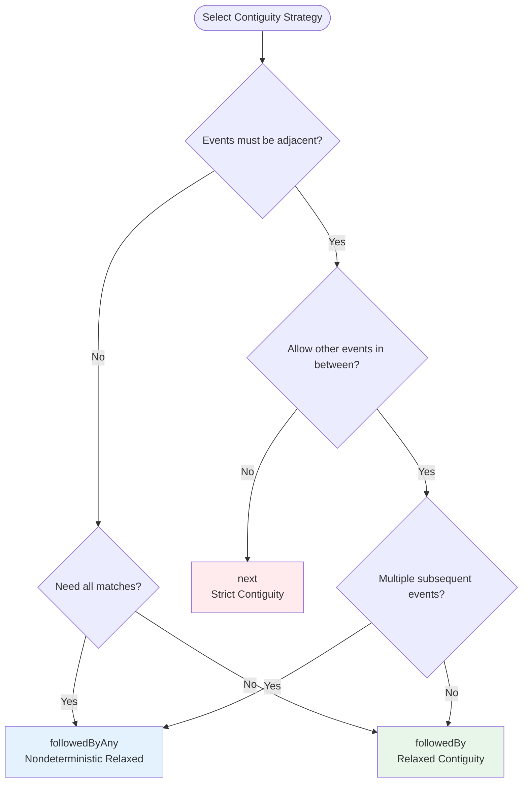
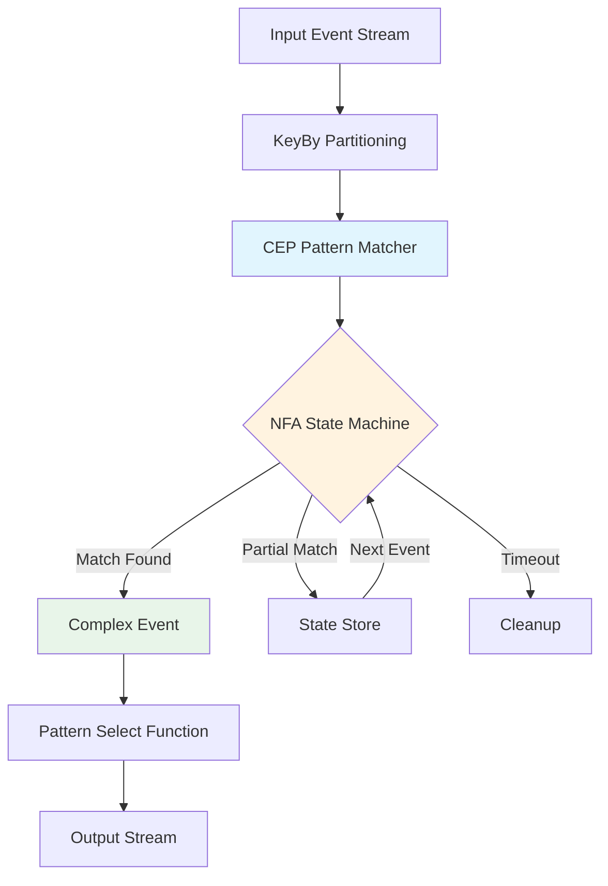
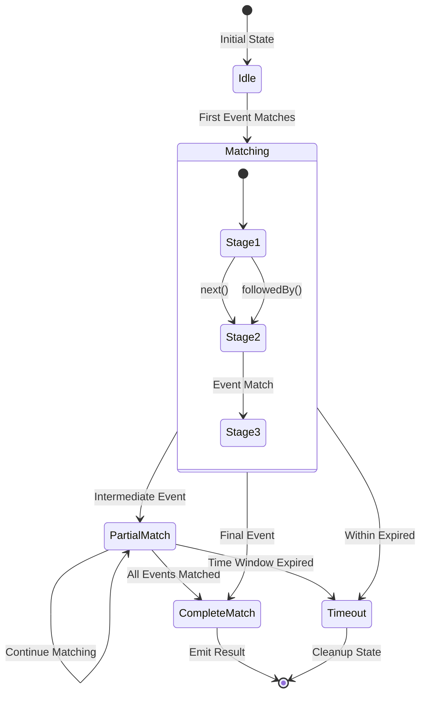
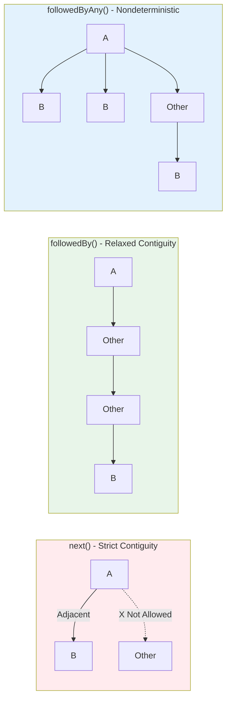
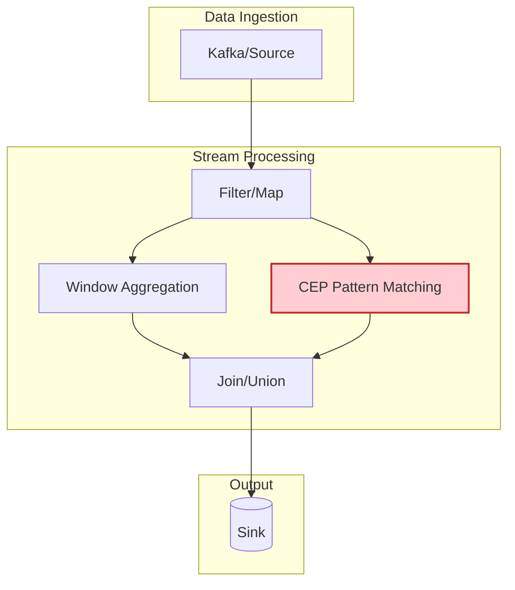

# Flink CEP Complete Tutorial

> **Stage**: Flink/03-sql-table-api | **Prerequisites**: [flink-cep-complete-guide.md](../../../Flink/03-api/03.02-table-sql-api/flink-cep-complete-guide.md), [time-semantics-and-watermark.md](../../../Flink/02-core/time-semantics-and-watermark.md) | **Formalization Level**: L3-L4
> **Version**: Flink 1.13-2.2+ | **Difficulty**: Intermediate-Advanced | **Estimated Reading Time**: 90 minutes

---

## 1. Definitions

### Def-F-CEP-Tutorial-01: CEP Core Concepts

**Complex Event Processing (CEP)** is the technology for detecting complex patterns from event streams:

$$
\text{CEP} = (E, P, \mathcal{M}, \mathcal{A})
$$

| Component | Description | Flink Implementation |
|-----------|-------------|---------------------|
| $E$ | Event stream | `DataStream<Event>` |
| $P$ | Pattern definition | `Pattern<T, ?>` |
| $\mathcal{M}$ | Matching engine | NFA (Nondeterministic Finite Automaton) |
| $\mathcal{A}$ | Post-match action | `PatternSelectFunction` |

**CEP Processing Flow**:

```
Input Event Stream → Pattern API Definition → NFA State Machine → Match Results → Business Actions
       ↓                   ↓                      ↓                ↓              ↓
   Raw Events         Pattern Rules         State Transitions   Complex Events  Alerts/Processing
```

### Def-F-CEP-Tutorial-02: Pattern API Core Elements

**Pattern API** is Flink CEP's declarative pattern definition interface:

```
Pattern<T, ?> = begin(name)
    → [where|subtype]
    → [next|followedBy|followedByAny]
    → [times|oneOrMore|optional]
    → [within]
```

**Core Element Definitions**:

| Element | Method | Semantics |
|---------|--------|-----------|
| **Start** | `begin(name)` | Pattern starting point, creates initial state |
| **Condition** | `where(condition)` | Event filtering condition |
| **Contiguity** | `next()` / `followedBy()` | Event relationship constraints |
| **Quantifier** | `times(n,m)` | Loop matching count |
| **Time** | `within(time)` | Pattern time window |

### Def-F-CEP-Tutorial-03: NFA Pattern Matching

**Nondeterministic Finite Automaton (NFA)** is the underlying execution model for CEP:

```
NFA = (Q, Σ, δ, q₀, F)
```

- $Q$: Set of states (corresponding to pattern stages)
- $Σ$: Input alphabet (event types)
- $δ$: Transition function (event-driven state transitions)
- $q₀$: Initial state
- $F$: Accepting states (pattern match complete)

**NFA Execution Example**:

```
Pattern: A → B → C

State Transition Diagram:
    [Start] --A--> [State_A] --B--> [State_B] --C--> [Accept]
                      ↑_______|            ↑_________|
                      (loop wait)            (loop wait)
```

---

## 2. Properties

### Lemma-F-CEP-Tutorial-01: Pattern API Closure Property

**Lemma**: Pattern API maintains closure under composition operations.

**Proof Sketch**:

1. **Sequential composition**: `P1.next(P2)` is still a valid Pattern
2. **Choice composition**: `P1.or(P2)` is still a valid Pattern
3. **Loop composition**: `P1.times(n,m)` is still a valid Pattern

$$
\forall P_1, P_2 \in \text{Pattern}: P_1 \oplus P_2 \in \text{Pattern}
$$

### Lemma-F-CEP-Tutorial-02: Time Window State Pruning

**Lemma**: The time window constraint `within(T)` reduces the NFA active state count upper bound from $O(|E|)$ to $O(T/\bar{\delta})$.

**Derivation**:

```
Without time window:
  Each event may start a new match
  Active states ∝ Total events |E|

With time window T:
  Only retain events within the window
  Active states ∝ T / average event interval
```

### Prop-F-CEP-Tutorial-01: Contiguity Strategy Match Set Relationship

**Proposition**: The match sets of the three contiguity strategies satisfy the inclusion relationship:

$$
\text{Matches}_{\text{next}} \subseteq \text{Matches}_{\text{followedBy}} \subseteq \text{Matches}_{\text{followedByAny}}
$$

**Example Verification**:

```
Event Stream: [A, X, A, B, B, C]

Pattern: A → B → C

next():            No match (no B immediately after A)
followedBy():      Match [A(3), B(4), C(6)]
followedByAny():   Match [A(3), B(4), C(6)] and [A(3), B(5), C(6)]
```

---

## 3. Relations

### 3.1 CEP vs SQL MATCH_RECOGNIZE Comparison

| Feature | Pattern API | SQL MATCH_RECOGNIZE |
|---------|-------------|---------------------|
| **Expressiveness** | Turing-complete | Regular-class |
| **Usage** | Java/Scala API | SQL declarative |
| **Dynamic patterns** | Supported | Not supported |
| **Post-match processing** | Flexible (arbitrary code) | Limited (SQL projection) |
| **Applicable scenarios** | Complex business logic | Simple pattern recognition |

### 3.2 CEP vs Stream Processing Operators Comparison



### 3.3 Pattern API to Regular Expression Mapping

| Regex | Pattern API | Description |
|-------|-------------|-------------|
| `a+` | `A.oneOrMore()` | One or more times |
| `a?` | `A.optional()` | Zero or one time |
| `a{n,m}` | `A.times(n, m)` | n to m times |
| `a\|b` | `A.or(B)` | Choice |
| `ab` | `A.next(B)` | Strict sequence |
| `a.*b` | `A.followedBy(B)` | Relaxed sequence |

---

## 4. Argumentation

### 4.1 Contiguity Strategy Selection Decision Tree



### 4.2 Time Window Design Trade-offs

| Window Size | Advantages | Disadvantages | Applicable Scenarios |
|-------------|------------|---------------|----------------------|
| **Small (<1 min)** | Low latency, fewer false positives, low state | May miss slow attacks | High-frequency trading, real-time risk control |
| **Medium (1-10 min)** | Balance latency and coverage | Medium state overhead | General business monitoring |
| **Large (>10 min)** | Capture long-term patterns | High state, high latency | Business process analysis |

### 4.3 Consumption Strategy Selection Guide

| Strategy | Output Match Count | Applicable Scenarios |
|----------|-------------------|----------------------|
| `NO_SKIP` | Most | Need all possible matches |
| `SKIP_TO_NEXT` | Medium | Start from next initiating event |
| `SKIP_PAST_LAST_EVENT` | Least | Avoid overlapping matches |
| `SKIP_TO_FIRST` | Controllable | Jump to specified pattern start |

---

## 5. Proof / Engineering Argument

### Thm-F-CEP-Tutorial-01: CEP Exactly-Once Semantics

**Theorem**: Under Flink's Checkpoint mechanism, CEP pattern matching satisfies Exactly-Once semantics.

**Proof**:

1. **State inclusion**: Checkpoint saves the complete NFA state
   - Active state instances
   - Partially matched event sequences
   - Time window boundaries

2. **Recovery consistency**: After recovery from Checkpoint
   - NFA state is consistent with pre-failure state
   - Processed events are not replayed (Flink guarantee)
   - Partial matches continue from the breakpoint

3. **Output consistency**: Match results are output only once
   - Already output matches are marked in state
   - No duplicate output after recovery

$$
\text{Output}_{\text{before_failure}} = \text{Output}_{\text{after_recovery}}
$$

### Thm-F-CEP-Tutorial-02: Pattern Matching Time Complexity

**Theorem**: For a pattern of length $n$ and event stream, CEP matching time complexity is $O(|E| \cdot n \cdot k)$, where $k$ is the maximum number of concurrent matches.

**Engineering Optimizations**:

1. **Index optimization**: Build indexes by event type
2. **Window pruning**: Timeout matches are automatically cleaned up
3. **State compression**: Similar matches are merged for storage

---

## 6. Examples

### 6.1 Maven Dependency Configuration

```xml
<!-- Flink CEP dependency -->
<dependency>
    <groupId>org.apache.flink</groupId>
    <artifactId>flink-cep</artifactId>
    <version>1.17.0</version>
</dependency>

<!-- Scala API (optional) -->
<dependency>
    <groupId>org.apache.flink</groupId>
    <artifactId>flink-cep-scala_2.12</artifactId>
    <version>1.17.0</version>
</dependency>
```

### 6.2 Basic Pattern API in Detail

#### 6.2.1 Java API Complete Example

```java
import org.apache.flink.cep.CEP;
import org.apache.flink.cep.PatternStream;
import org.apache.flink.cep.pattern.Pattern;
import org.apache.flink.cep.pattern.conditions.SimpleCondition;
import org.apache.flink.cep.pattern.conditions.IterativeCondition;
import org.apache.flink.streaming.api.datastream.DataStream;
import org.apache.flink.streaming.api.windowing.time.Time;

public class CEPCompleteTutorial {

    // ========== 1. Basic Pattern Definitions ==========

    /**
     * Example 1: Simple sequence pattern
     * Detect: Login followed by payment within 5 minutes
     */
    public static Pattern<LoginEvent, ?> loginThenPayPattern() {
        return Pattern.<LoginEvent>begin("login")
            .where(new SimpleCondition<LoginEvent>() {
                @Override
                public boolean filter(LoginEvent event) {
                    return event.getType().equals("LOGIN");
                }
            })
            .followedBy("payment")
            .where(new SimpleCondition<LoginEvent>() {
                @Override
                public boolean filter(LoginEvent event) {
                    return event.getType().equals("PAYMENT");
                }
            })
            .within(Time.minutes(5));
    }

    /**
     * Example 2: Loop pattern
     * Detect: 3+ failed logins within 5 minutes
     */
    public static Pattern<LoginEvent, ?> bruteForcePattern() {
        return Pattern.<LoginEvent>begin("failed")
            .where(new SimpleCondition<LoginEvent>() {
                @Override
                public boolean filter(LoginEvent event) {
                    return event.getType().equals("LOGIN") && !event.isSuccess();
                }
            })
            .timesOrMore(3)  // 3 or more times
            .greedy()        // Greedy mode, match as many as possible
            .within(Time.minutes(5));
    }

    /**
     * Example 3: Negation pattern
     * Detect: Order not paid within 30 minutes
     */
    public static Pattern<OrderEvent, ?> orderNotPaidPattern() {
        return Pattern.<OrderEvent>begin("order")
            .where(new SimpleCondition<OrderEvent>() {
                @Override
                public boolean filter(OrderEvent event) {
                    return event.getType().equals("ORDER_CREATED");
                }
            })
            .notFollowedBy("payment")
            .where(new SimpleCondition<OrderEvent>() {
                @Override
                public boolean filter(OrderEvent event) {
                    return event.getType().equals("PAYMENT");
                }
            })
            .within(Time.minutes(30));
    }

    // ========== 2. Complex Condition Patterns ==========

    /**
     * Example 4: Iterative condition (access previously matched events)
     * Detect: Temperature continuously rising above threshold
     */
    public static Pattern<SensorReading, ?> temperatureRisingPattern() {
        return Pattern.<SensorReading>begin("first")
            .where(new SimpleCondition<SensorReading>() {
                @Override
                public boolean filter(SensorReading reading) {
                    return reading.getTemperature() > 80.0;
                }
            })
            .next("second")
            .where(new IterativeCondition<SensorReading>() {
                @Override
                public boolean filter(SensorReading reading, Context<SensorReading> ctx) {
                    // Access previously matched events
                    double firstTemp = ctx.getEventsForPattern("first")
                        .get(0).getTemperature();
                    return reading.getTemperature() > firstTemp + 5.0;
                }
            })
            .next("third")
            .where(new IterativeCondition<SensorReading>() {
                @Override
                public boolean filter(SensorReading reading, Context<SensorReading> ctx) {
                    double secondTemp = ctx.getEventsForPattern("second")
                        .get(0).getTemperature();
                    return reading.getTemperature() > secondTemp + 5.0;
                }
            })
            .within(Time.minutes(10));
    }

    // ========== 3. Composite Patterns ==========

    /**
     * Example 5: OR composite pattern
     * Detect: High-value transaction by VIP user OR abnormal transaction by normal user
     */
    public static Pattern<Transaction, ?> fraudPattern() {
        Pattern<Transaction, ?> vipPattern = Pattern.<Transaction>begin("vip")
            .where(new SimpleCondition<Transaction>() {
                @Override
                public boolean filter(Transaction tx) {
                    return tx.getUserType().equals("VIP") && tx.getAmount() > 50000;
                }
            });

        Pattern<Transaction, ?> normalPattern = Pattern.<Transaction>begin("normal")
            .where(new SimpleCondition<Transaction>() {
                @Override
                public boolean filter(Transaction tx) {
                    return tx.getUserType().equals("NORMAL") && tx.getAmount() > 10000;
                }
            });

        return Pattern.<Transaction>begin("start")
            .where(new SimpleCondition<Transaction>() {
                @Override
                public boolean filter(Transaction tx) {
                    return tx.getAmount() < 10;  // Small probing amount
                }
            })
            .next("suspicious")
            .where(new SimpleCondition<Transaction>() {
                @Override
                public boolean filter(Transaction tx) {
                    return tx.getAmount() > 5000;
                }
            })
            .or(vipPattern)  // OR composition
            .within(Time.minutes(10));
    }
}
```

#### 6.2.2 Scala API Complete Example

```scala
import org.apache.flink.cep.scala.CEP
import org.apache.flink.cep.scala.pattern.Pattern
import org.apache.flink.streaming.api.scala._
import org.apache.flink.streaming.api.windowing.time.Time

object CEPScalaTutorial {

  // Example 1: Simple pattern
  val loginPattern = Pattern.begin[LoginEvent]("login")
    .where(_.eventType == "LOGIN")
    .followedBy("payment")
    .where(_.eventType == "PAYMENT")
    .within(Time.minutes(5))

  // Example 2: Loop pattern
  val bruteForcePattern = Pattern.begin[LoginEvent]("failed")
    .where(evt => evt.eventType == "LOGIN" && !evt.success)
    .timesOrMore(3)
    .greedy()
    .within(Time.minutes(5))

  // Example 3: Iterative condition
  val temperatureRisingPattern = Pattern.begin[SensorReading]("first")
    .where(_.temperature > 80.0)
    .next("second")
    .where((reading, ctx) => {
      val firstTemp = ctx.getEventsForPattern("first").head.temperature
      reading.temperature > firstTemp + 5.0
    })
    .next("third")
    .where((reading, ctx) => {
      val secondTemp = ctx.getEventsForPattern("second").head.temperature
      reading.temperature > secondTemp + 5.0
    })
    .within(Time.minutes(10))

  // Apply to stream
  def applyPattern[T](stream: DataStream[T], pattern: Pattern[T, _]): Unit = {
    val patternStream = CEP.pattern(stream, pattern)

    patternStream.select(pattern => {
      // Process match results
      pattern.toString
    })
  }
}
```

### 6.3 Real-world Case Studies

#### 6.3.1 Fraud Detection Complete Implementation

```java
import org.apache.flink.streaming.api.environment.StreamExecutionEnvironment;

import org.apache.flink.streaming.api.datastream.DataStream;
import org.apache.flink.streaming.api.windowing.time.Time;


/**
 * Case: Credit card fraud detection
 * Pattern: Small test → Large transaction (within 5 minutes)
 */
public class FraudDetectionCEP {

    public static void main(String[] args) throws Exception {
        StreamExecutionEnvironment env =
            StreamExecutionEnvironment.getExecutionEnvironment();
        env.setParallelism(4);

        // 1. Create event stream
        DataStream<Transaction> transactions = env
            .addSource(new TransactionSource())
            .assignTimestampsAndWatermarks(
                WatermarkStrategy.<Transaction>forBoundedOutOfOrderness(
                    Duration.ofSeconds(5))
                    .withIdleness(Duration.ofMinutes(1))
            );

        // 2. Define fraud detection pattern
        Pattern<Transaction, ?> fraudPattern = Pattern
            .<Transaction>begin("small-amount")
            .where(new SimpleCondition<Transaction>() {
                @Override
                public boolean filter(Transaction tx) {
                    // Small probing transaction
                    return tx.getAmount() > 0 && tx.getAmount() < 10.0;
                }
            })
            .followedBy("large-amount")
            .where(new IterativeCondition<Transaction>() {
                @Override
                public boolean filter(Transaction tx, Context<Transaction> ctx) {
                    // Large transaction (>5000)
                    if (tx.getAmount() <= 5000.0) {
                        return false;
                    }

                    // Same user
                    String userId = ctx.getEventsForPattern("small-amount")
                        .get(0).getUserId();
                    return tx.getUserId().equals(userId);
                }
            })
            .within(Time.minutes(5));

        // 3. Apply pattern to stream
        PatternStream<Transaction> patternStream = CEP.pattern(
            transactions.keyBy(Transaction::getUserId),  // Partition by user
            fraudPattern
        );

        // 4. Process match results
        DataStream<Alert> alerts = patternStream
            .select(new PatternSelectFunction<Transaction, Alert>() {
                @Override
                public Alert select(Map<String, List<Transaction>> pattern) {
                    Transaction small = pattern.get("small-amount").get(0);
                    Transaction large = pattern.get("large-amount").get(0);

                    return new Alert(
                        small.getUserId(),
                        "FRAUD_PATTERN_DETECTED",
                        String.format("Small: $%.2f at %s, Large: $%.2f at %s",
                            small.getAmount(), small.getTimestamp(),
                            large.getAmount(), large.getTimestamp()),
                        System.currentTimeMillis()
                    );
                }
            });

        // 5. Output alerts
        alerts.addSink(new AlertSink());

        env.execute("Fraud Detection with CEP");
    }
}
```

#### 6.3.2 Login Anomaly Detection

```java
import org.apache.flink.cep.Pattern;

import org.apache.flink.streaming.api.environment.StreamExecutionEnvironment;
import org.apache.flink.streaming.api.datastream.DataStream;
import org.apache.flink.streaming.api.windowing.time.Time;


/**
 * Case: Anomalous login detection
 * Pattern 1: 3 failed logins within 5 minutes → successful login (brute force)
 * Pattern 2: Geo-location anomaly (sudden city change)
 */
public class LoginAnomalyDetection {

    // Pattern 1: Brute force detection
    public static Pattern<LoginEvent, ?> bruteForcePattern() {
        return Pattern.<LoginEvent>begin("failed-logins")
            .where(new SimpleCondition<LoginEvent>() {
                @Override
                public boolean filter(LoginEvent event) {
                    return !event.isSuccess();
                }
            })
            .timesOrMore(3)
            .greedy()
            .followedBy("success-login")
            .where(new SimpleCondition<LoginEvent>() {
                @Override
                public boolean filter(LoginEvent event) {
                    return event.isSuccess();
                }
            })
            .within(Time.minutes(5));
    }

    // Pattern 2: Geo-location anomaly detection
    public static Pattern<LoginEvent, ?> geoAnomalyPattern() {
        return Pattern.<LoginEvent>begin("first-login")
            .where(new SimpleCondition<LoginEvent>() {
                @Override
                public boolean filter(LoginEvent event) {
                    return event.isSuccess();
                }
            })
            .next("second-login")
            .where(new IterativeCondition<LoginEvent>() {
                @Override
                public boolean filter(LoginEvent event, Context<LoginEvent> ctx) {
                    if (!event.isSuccess()) return false;

                    LoginEvent first = ctx.getEventsForPattern("first-login").get(0);

                    // Same user, different city, interval < 2 hours
                    return event.getUserId().equals(first.getUserId())
                        && !event.getCity().equals(first.getCity())
                        && (event.getTimestamp() - first.getTimestamp()) < Time.hours(2).toMilliseconds();
                }
            })
            .within(Time.hours(2));
    }

    public static void main(String[] args) throws Exception {
        StreamExecutionEnvironment env =
            StreamExecutionEnvironment.getExecutionEnvironment();

        DataStream<LoginEvent> logins = env
            .addSource(new LoginEventSource())
            .assignTimestampsAndWatermarks(
                WatermarkStrategy.<LoginEvent>forBoundedOutOfOrderness(
                    Duration.ofSeconds(10))
            );

        // Apply multiple patterns
        Pattern<LoginEvent, ?> pattern = bruteForcePattern();

        PatternStream<LoginEvent> patternStream = CEP.pattern(
            logins.keyBy(LoginEvent::getUserId),
            pattern
        );

        // Process matches and timeouts
        DataStream<Alert> alerts = patternStream
            .process(new PatternProcessFunction<LoginEvent, Alert>() {
                @Override
                public void processMatch(
                        Map<String, List<LoginEvent>> match,
                        Context ctx,
                        Collector<Alert> out) {

                    // Normal match processing: brute force succeeded
                    List<LoginEvent> failed = match.get("failed-logins");
                    LoginEvent success = match.get("success-login").get(0);

                    out.collect(new Alert(
                        success.getUserId(),
                        "BRUTE_FORCE_SUCCESS",
                        String.format("%d failed attempts followed by success", failed.size()),
                        success.getTimestamp()
                    ));
                }

                @Override
                public void processTimedOutMatch(
                        Map<String, List<LoginEvent>> match,
                        Context ctx,
                        Collector<Alert> out) {

                    // Timeout processing: multiple failures without success (still attempting)
                    List<LoginEvent> failed = match.get("failed-logins");

                    out.collect(new Alert(
                        failed.get(0).getUserId(),
                        "BRUTE_FORCE_ATTEMPT",
                        String.format("%d failed attempts without success", failed.size()),
                        System.currentTimeMillis()
                    ));
                }
            });

        alerts.print();
        env.execute("Login Anomaly Detection");
    }
}
```

#### 6.3.3 Business Process Monitoring

```java
import org.apache.flink.cep.Pattern;

import org.apache.flink.streaming.api.environment.StreamExecutionEnvironment;
import org.apache.flink.streaming.api.datastream.DataStream;
import org.apache.flink.streaming.api.windowing.time.Time;


/**
 * Case: Business process timeout monitoring
 * Monitor order process: Created → Paid → Shipped → Delivered
 * Detect timeouts at each stage
 */
public class BusinessProcessMonitor {

    // Full order process monitoring
    public static Pattern<OrderEvent, ?> orderProcessPattern() {
        return Pattern.<OrderEvent>begin("created")
            .where(evt -> evt.getType().equals("ORDER_CREATED"))
            .followedBy("paid")
            .where(evt -> evt.getType().equals("ORDER_PAID"))
            .followedBy("shipped")
            .where(evt -> evt.getType().equals("ORDER_SHIPPED"))
            .followedBy("delivered")
            .where(evt -> evt.getType().equals("ORDER_DELIVERED"))
            .within(Time.hours(72));  // 72 hours for full process
    }

    // Payment timeout detection
    public static Pattern<OrderEvent, ?> paymentTimeoutPattern() {
        return Pattern.<OrderEvent>begin("created")
            .where(evt -> evt.getType().equals("ORDER_CREATED"))
            .notFollowedBy("paid")
            .where(evt -> evt.getType().equals("ORDER_PAID"))
            .within(Time.minutes(30));  // Not paid within 30 minutes
    }

    // Shipping timeout detection
    public static Pattern<OrderEvent, ?> shippingTimeoutPattern() {
        return Pattern.<OrderEvent>begin("paid")
            .where(evt -> evt.getType().equals("ORDER_PAID"))
            .notFollowedBy("shipped")
            .where(evt -> evt.getType().equals("ORDER_SHIPPED"))
            .within(Time.hours(24));  // Not shipped within 24 hours
    }

    public static void main(String[] args) throws Exception {
        StreamExecutionEnvironment env =
            StreamExecutionEnvironment.getExecutionEnvironment();

        DataStream<OrderEvent> orders = env
            .addSource(new OrderEventSource())
            .assignTimestampsAndWatermarks(
                WatermarkStrategy.<OrderEvent>forBoundedOutOfOrderness(
                    Duration.ofSeconds(30))
            );

        // Detect payment timeout
        PatternStream<OrderEvent> timeoutStream = CEP.pattern(
            orders.keyBy(OrderEvent::getOrderId),
            paymentTimeoutPattern()
        );

        DataStream<TimeoutAlert> alerts = timeoutStream
            .process(new PatternProcessFunction<OrderEvent, TimeoutAlert>() {
                @Override
                public void processMatch(
                        Map<String, List<OrderEvent>> match,
                        Context ctx,
                        Collector<TimeoutAlert> out) {
                    // Normal match won't trigger (notFollowedBy)
                }

                @Override
                public void processTimedOutMatch(
                        Map<String, List<OrderEvent>> match,
                        Context ctx,
                        Collector<TimeoutAlert> out) {

                    OrderEvent created = match.get("created").get(0);
                    long elapsed = System.currentTimeMillis() - created.getTimestamp();

                    out.collect(new TimeoutAlert(
                        created.getOrderId(),
                        "PAYMENT_TIMEOUT",
                        String.format("Order not paid within %d minutes", elapsed / 60000),
                        created.getTimestamp()
                    ));
                }
            });

        alerts.addSink(new AlertSink());
        env.execute("Business Process Monitor");
    }
}
```

### 6.4 Time Processing in Detail

#### 6.4.1 Event Time vs Processing Time

```java
import org.apache.flink.streaming.api.environment.StreamExecutionEnvironment;

import org.apache.flink.streaming.api.datastream.DataStream;
import org.apache.flink.streaming.api.windowing.time.Time;


/**
 * CEP time semantics in detail
 */
public class CEPTimeSemantics {

    public static void main(String[] args) throws Exception {
        StreamExecutionEnvironment env =
            StreamExecutionEnvironment.getExecutionEnvironment();

        DataStream<Event> stream = env.addSource(new EventSource());

        // ========== Event Time Processing (Recommended for production) ==========
        DataStream<Event> eventTimeStream = stream
            .assignTimestampsAndWatermarks(
                WatermarkStrategy.<Event>forBoundedOutOfOrderness(
                    Duration.ofSeconds(30))  // Allow 30s out-of-order
                    .withIdleness(Duration.ofMinutes(5))  // Mark idle after 5 min without data
            );

        // In Event Time mode, within() uses event timestamps
        Pattern<Event, ?> pattern = Pattern.<Event>begin("start")
            .where(evt -> evt.getType().equals("A"))
            .followedBy("end")
            .where(evt -> evt.getType().equals("B"))
            .within(Time.minutes(5));  // 5 minute window based on Event Time

        // ========== Processing Time Processing (Low latency scenarios) ==========
        // In Processing Time mode, within() uses machine time
        // Suitable for: high real-time requirements, tolerating occasional late event loss

        PatternStream<Event> patternStream = CEP.pattern(
            eventTimeStream.keyBy(Event::getKey),
            pattern
        );

        // Process results
        patternStream.select(match -> {
            // Match processing
            return match;
        });
    }
}
```

#### 6.4.2 Watermark and Late Event Handling

```java
import org.apache.flink.api.common.eventtime.WatermarkStrategy;

/**
 * Watermark strategy configuration in CEP
 */
public class CEPWatermarkConfig {

    /**
     * Recommended config: Bounded Out Of Orderness
     * Suitable for: Most production scenarios
     */
    public static WatermarkStrategy<Event> boundedOutOfOrdernessStrategy() {
        return WatermarkStrategy.<Event>forBoundedOutOfOrderness(
                Duration.ofSeconds(30))
            .withTimestampAssigner((event, timestamp) -> event.getEventTime())
            .withIdleness(Duration.ofMinutes(1));
    }

    /**
     * Strictly ordered scenario
     * Suitable for: Data source is inherently ordered (e.g., Kafka single partition)
     */
    public static WatermarkStrategy<Event> monotonousStrategy() {
        return WatermarkStrategy.<Event>forMonotonousTimestamps()
            .withTimestampAssigner((event, timestamp) -> event.getEventTime());
    }

    /**
     * Custom Watermark generation
     * Suitable for: Special out-of-order scenarios
     */
    public static WatermarkStrategy<Event> customWatermarkStrategy() {
        return new WatermarkStrategy<Event>() {
            @Override
            public WatermarkGenerator<Event> createWatermarkGenerator(
                    WatermarkGeneratorSupplier.Context context) {
                return new WatermarkGenerator<Event>() {
                    private long maxTimestamp = Long.MIN_VALUE;
                    private final long outOfOrdernessMillis = 30000;  // 30 seconds

                    @Override
                    public void onEvent(Event event, long eventTimestamp, WatermarkOutput output) {
                        maxTimestamp = Math.max(maxTimestamp, eventTimestamp);
                    }

                    @Override
                    public void onPeriodicEmit(WatermarkOutput output) {
                        output.emitWatermark(
                            new Watermark(maxTimestamp - outOfOrdernessMillis - 1));
                    }
                };
            }
        }.withTimestampAssigner((event, timestamp) -> event.getEventTime());
    }
}
```

### 6.5 Advanced Pattern Techniques

#### 6.5.1 Dynamic Pattern Generation

```java
/**
 * Dynamically generate CEP patterns based on configuration
 */

import org.apache.flink.streaming.api.windowing.time.Time;

public class DynamicPatternBuilder {

    public static <T> Pattern<T, ?> buildPatternFromConfig(
            PatternConfig config,
            Class<T> eventClass) {

        Pattern<T, ?> pattern = Pattern.begin(config.getStartName());

        // Add start condition
        pattern = pattern.where(createCondition(config.getStartCondition()));

        // Add subsequent pattern stages
        for (PatternStage stage : config.getStages()) {
            switch (stage.getContiguity()) {
                case NEXT:
                    pattern = pattern.next(stage.getName());
                    break;
                case FOLLOWED_BY:
                    pattern = pattern.followedBy(stage.getName());
                    break;
                case FOLLOWED_BY_ANY:
                    pattern = pattern.followedByAny(stage.getName());
                    break;
            }

            pattern = pattern.where(createCondition(stage.getCondition()));

            // Add quantifiers
            if (stage.getMinTimes() > 1 || stage.getMaxTimes() != null) {
                pattern = pattern.times(stage.getMinTimes(), stage.getMaxTimes());
            }

            if (stage.isOptional()) {
                pattern = pattern.optional();
            }
        }

        // Add time window
        pattern = pattern.within(Time.milliseconds(config.getWindowMillis()));

        return pattern;
    }

    private static <T> SimpleCondition<T> createCondition(ConditionConfig config) {
        return new SimpleCondition<T>() {
            @Override
            public boolean filter(T event) {
                // Parse condition based on configuration
                return evaluateCondition(event, config);
            }
        };
    }
}
```

#### 6.5.2 Multi-pattern Parallel Detection

```java
import org.apache.flink.streaming.api.environment.StreamExecutionEnvironment;

import org.apache.flink.streaming.api.datastream.DataStream;
import org.apache.flink.streaming.api.windowing.time.Time;


/**
 * Detect multiple CEP patterns simultaneously
 */
public class MultiPatternDetection {

    public static void main(String[] args) throws Exception {
        StreamExecutionEnvironment env =
            StreamExecutionEnvironment.getExecutionEnvironment();

        DataStream<Transaction> transactions = env.addSource(new TransactionSource());

        // Define multiple detection patterns
        Pattern<Transaction, ?> fraudPattern1 = Pattern.<Transaction>begin("small")
            .where(tx -> tx.getAmount() < 10)
            .followedBy("large")
            .where(tx -> tx.getAmount() > 10000)
            .within(Time.minutes(5));

        Pattern<Transaction, ?> fraudPattern2 = Pattern.<Transaction>begin("rapid")
            .where(tx -> tx.getAmount() > 1000)
            .timesOrMore(3)
            .within(Time.minutes(1));

        // Apply multiple patterns in parallel
        DataStream<Alert> alerts1 = CEP.pattern(transactions, fraudPattern1)
            .select(match -> new Alert("FRAUD_PATTERN_1", match));

        DataStream<Alert> alerts2 = CEP.pattern(transactions, fraudPattern2)
            .select(match -> new Alert("FRAUD_PATTERN_2", match));

        // Merge alert streams
        DataStream<Alert> allAlerts = alerts1.union(alerts2);

        allAlerts.addSink(new AlertSink());
        env.execute("Multi-Pattern Detection");
    }
}
```

---

## 7. Performance Optimization

### 7.1 State Optimization Strategies

| Optimization Strategy | Description | Effect |
|----------------------|-------------|--------|
| **Time window limits** | Use reasonable `within()` | Reduce state storage |
| **Consumption strategy** | Choose appropriate `SkipStrategy` | Reduce duplicate matches |
| **KeyBy partitioning** | Choose partition key wisely | Reduce cross-partition state |
| **Pre-filtering** | Pre-filter before Pattern | Reduce invalid events entering CEP |

### 7.2 Code Optimization Examples

```java
/**
 * CEP performance optimization examples
 */

import org.apache.flink.streaming.api.datastream.DataStream;
import org.apache.flink.streaming.api.windowing.time.Time;

public class CEPPerformanceOptimization {

    /**
     * Optimization 1: Reasonable KeyBy partitioning
     * Avoid hotspots, ensure even data distribution
     */
    public static void optimizedKeyBy(DataStream<Event> stream) {
        // Not recommended: user ID may cause hotspots
        // stream.keyBy(Event::getUserId)

        // Recommended: Use composite key or hash
        stream.keyBy(event ->
            (event.getUserId().hashCode() % 100) + "_" + event.getRegion()
        );
    }

    /**
     * Optimization 2: Pre-filtering
     * Reduce the number of events entering CEP
     */
    public static DataStream<Event> preFilter(DataStream<Event> stream) {
        return stream.filter(event ->
            // Only let potentially matching events into CEP
            event.getType().equals("LOGIN") ||
            event.getType().equals("PAYMENT")
        );
    }

    /**
     * Optimization 3: Choose efficient contiguity strategy
     */
    public static Pattern<Event, ?> optimizedPattern() {
        // next() performs better than followedByAny()
        // Only use followedByAny() when needed
        return Pattern.<Event>begin("start")
            .where(evt -> evt.getType().equals("A"))
            .next("end")  // Prefer next()
            .where(evt -> evt.getType().equals("B"))
            .within(Time.minutes(1));
    }

    /**
     * Optimization 4: Set reasonable time windows
     */
    public static Pattern<Event, ?> optimizedWindow() {
        // Smaller window means less state
        // Choose the minimum feasible window based on business scenario
        return Pattern.<Event>begin("start")
            .where(evt -> evt.getType().equals("A"))
            .followedBy("end")
            .where(evt -> evt.getType().equals("B"))
            .within(Time.minutes(5));  // Avoid overly large windows
    }
}
```

### 7.3 Monitoring Metrics

```java
import org.apache.flink.cep.PatternStream;

/**
 * CEP monitoring metrics collection
 */
public class CEPMetrics {

    public static void collectMetrics(PatternStream<Event> patternStream) {
        patternStream.select(new PatternSelectFunction<Event, Result>() {
            private transient Counter matchCounter;
            private transient Histogram matchLatency;

            @Override
            public void open(Configuration parameters) {
                matchCounter = getRuntimeContext()
                    .getMetricGroup()
                    .counter("cep.matches");
                matchLatency = getRuntimeContext()
                    .getMetricGroup()
                    .histogram("cep.matchLatency", new DropwizardHistogramWrapper(
                        new com.codahale.metrics.Histogram(
                            new SlidingWindowReservoir(500))));
            }

            @Override
            public Result select(Map<String, List<Event>> pattern) {
                matchCounter.inc();

                // Calculate match latency
                long startTime = pattern.get("start").get(0).getTimestamp();
                long latency = System.currentTimeMillis() - startTime;
                matchLatency.update(latency);

                return new Result(pattern);
            }
        });
    }
}
```

---

## 8. Troubleshooting

### 8.1 Common Issues and Solutions

| Issue | Symptom | Cause | Solution |
|-------|---------|-------|----------|
| **Excessive state** | OOM, Checkpoint timeout | Time window too large | Reduce `within()` window |
| **Match latency** | Events not matched in time | Watermark delay | Adjust Watermark strategy |
| **Missing matches** | Expected matches not triggered | Incorrect contiguity strategy | Check `next()` vs `followedBy()` |
| **Duplicate matches** | Same event matched multiple times | Consumption strategy config | Set `SkipStrategy` |
| **Performance degradation** | Throughput drop | Key hotspot | Optimize KeyBy strategy |

### 8.2 Debugging Techniques

```java
import org.apache.flink.streaming.api.datastream.DataStream;

/**
 * CEP debugging tools
 */
public class CEPDebugging {

    /**
     * Debug 1: Print all events
     */
    public static void debugEvents(DataStream<Event> stream) {
        stream.map(event -> {
            System.out.println("[DEBUG] Event: " + event +
                " @ " + System.currentTimeMillis());
            return event;
        });
    }

    /**
     * Debug 2: Monitor Watermark progress
     */
    public static void debugWatermarks(DataStream<Event> stream) {
        stream.assignTimestampsAndWatermarks(
            WatermarkStrategy.<Event>forBoundedOutOfOrderness(Duration.ofSeconds(5))
                .withTimestampAssigner((event, ts) -> event.getTimestamp())
        ).map(event -> {
            // Print current Watermark
            return event;
        });
    }

    /**
     * Debug 3: Pattern match details
     */
    public static void debugPatternMatches(
            PatternStream<Event> patternStream) {

        patternStream.select(new PatternSelectFunction<Event, String>() {
            @Override
            public String select(Map<String, List<Event>> pattern) {
                StringBuilder sb = new StringBuilder();
                sb.append("=== Pattern Match ===\n");

                for (Map.Entry<String, List<Event>> entry : pattern.entrySet()) {
                    sb.append("Stage: ").append(entry.getKey()).append("\n");
                    for (Event e : entry.getValue()) {
                        sb.append("  - ").append(e).append("\n");
                    }
                }

                System.out.println(sb.toString());
                return sb.toString();
            }
        });
    }
}
```

---

## 9. Visualizations

### 9.1 CEP Architecture Flow



### 9.2 Pattern Matching State Machine



### 9.3 Contiguity Strategy Comparison



### 9.4 CEP in Stream Processing



---

## 10. References
