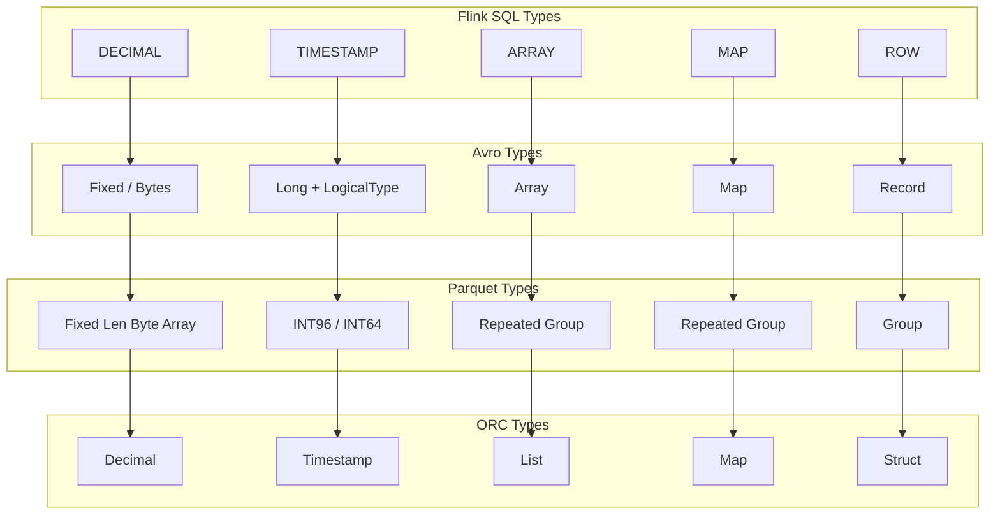
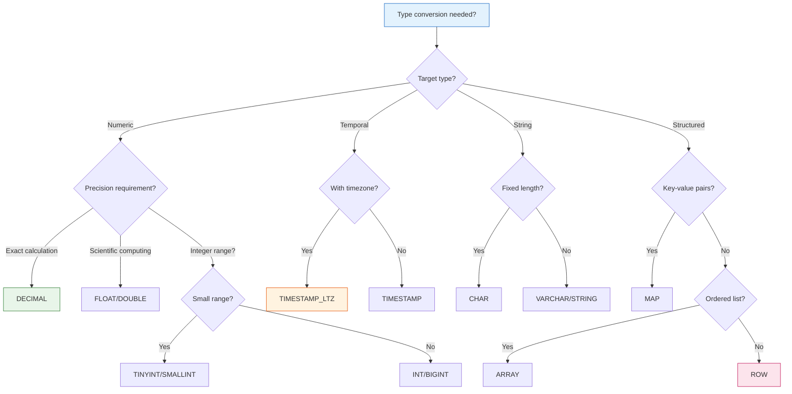
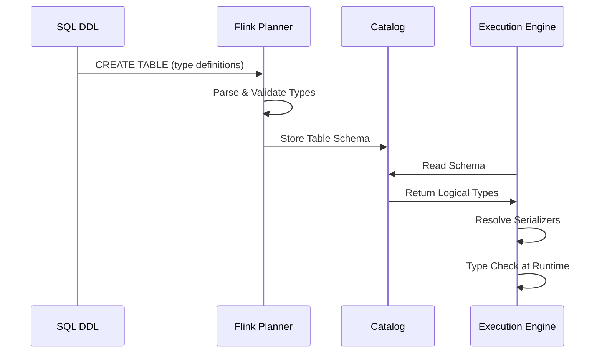

# Flink Data Types Complete Reference

> Stage: Flink | Prerequisites: [Flink/00-QUICK-START.md](00-meta/00-QUICK-START.md) | Formalization Level: L4

---

## 1. Definitions

### Def-F-01-01: Data Type System

**Definition**: The Flink SQL data type system is the engineering implementation of type theory in the stream computing domain, defined as a quintuple:

$$
\mathcal{T}_{Flink} = (T_{atomic}, T_{composite}, T_{structured}, T_{time}, \prec)
$$

Where:

- $T_{atomic}$: Set of atomic types (indivisible basic types)
- $T_{composite}$: Set of composite types (nestable structured types)
- $T_{structured}$: Set of structured types (ROW, ARRAY, MAP)
- $T_{time}$: Set of temporal types (stream-computing-specific time-related types)
- $\prec$: Type partial order relation (implicit conversion direction)

### Def-F-01-02: Atomic Types

**Definition**: Atomic types are indivisible data types whose values are semantically treated as single units:

$$
T_{atomic} = \{STRING, BOOLEAN, BYTES\} \cup T_{numeric}
$$

| Category | Type | Storage Range | Physical Representation | Default Value |
|----------|------|---------------|------------------------|---------------|
| **String** | `CHAR(n)` | 1~255 chars | UTF-8 encoded, fixed-length | Space-padded |
| | `VARCHAR(n)` | 1~2,147,483,647 chars | UTF-8 encoded, variable-length | NULL |
| | `STRING` | Unlimited | UTF-8 encoded | NULL |
| **Boolean** | `BOOLEAN` | {true, false} | 1 byte | NULL |
| **Binary** | `BINARY(n)` | Fixed-length byte sequence | Raw bytes | 0x00-padded |
| | `VARBINARY(n)` | Variable-length byte sequence | Raw bytes | NULL |
| | `BYTES` | Unlimited | Raw bytes | NULL |

### Def-F-01-03: Numeric Types

**Definition**: Numeric types are ordered scalar numeric sets:

$$
T_{numeric} = T_{integral} \cup T_{fractional}
$$

**Integer Types** ($T_{integral}$):

| Type | Range | Storage | Java Type | Example |
|------|-------|---------|-----------|---------|
| `TINYINT` | -128 ~ 127 | 1 byte | `Byte` | 127 |
| `SMALLINT` | -32,768 ~ 32,767 | 2 bytes | `Short` | 1000 |
| `INT` / `INTEGER` | -2³¹ ~ 2³¹-1 | 4 bytes | `Integer` | 100000 |
| `BIGINT` | -2⁶³ ~ 2⁶³-1 | 8 bytes | `Long` | 10000000000 |

**Floating/Fixed-point Types** ($T_{fractional}$):

| Type | Precision | Storage | Java Type | Applicable Scenarios |
|------|-----------|---------|-----------|----------------------|
| `FLOAT` | IEEE 754 single precision | 4 bytes | `Float` | Scientific computing |
| `DOUBLE` | IEEE 754 double precision | 8 bytes | `Double` | General floating-point |
| `DECIMAL(p,s)` | p: 1~38, s: 0~p | Variable-length | `BigDecimal` | Financial computing |
| `NUMERIC(p,s)` | Same as DECIMAL | Variable-length | `BigDecimal` | SQL standard compatibility |

### Def-F-01-04: Composite Types

**Definition**: Composite types are structured types composed of other types:

$$
\begin{aligned}
ARRAY\langle T \rangle &= \{ [e_1, e_2, ..., e_n] \mid e_i \in T, n \geq 0 \} \\
MAP\langle K, V \rangle &= \{ (k_1,v_1), ..., (k_n,v_n) \} \text{ where } k_i \text{ unique}, k_i \in K, v_i \in V \\
ROW\langle f_1:T_1, ..., f_n:T_n \rangle &= \{ (f_1:v_1, ..., f_n:v_n) \mid v_i \in T_i \}
\end{aligned}
$$

**Composite Type Constraints**:

| Type | Key Type Constraint | Value Type Constraint | Max Nesting Depth |
|------|---------------------|------------------------|-------------------|
| `ARRAY<T>` | - | Any type | 100 |
| `MAP<K,V>` | Atomic types only | Any type | 100 |
| `ROW<...>` | Unique field names | Any type | 100 |

### Def-F-01-05: Temporal Types

**Definition**: Flink temporal types are time representations specialized for stream computing scenarios:

$$
T_{time} = \{ DATE, TIME, TIMESTAMP, TIMESTAMP_LTZ, INTERVAL \}
$$

| Type | Format | Precision | Timezone Handling | Typical Application |
|------|--------|-----------|-------------------|---------------------|
| `DATE` | `yyyy-MM-dd` | Day precision | No timezone | Birthday, anniversary |
| `TIME` | `HH:mm:ss[.fractional]` | 0~9 digits | No timezone | Business hours |
| `TIME(p)` | Time with precision | p: 0~9 | No timezone | Precise timestamp |
| `TIMESTAMP(p)` | Date + time | p: 0~9 | No timezone | Event occurrence time |
| `TIMESTAMP_LTZ(p)` | Timezone-aware timestamp | p: 0~9 | Stored internally as UTC | Cross-timezone synchronization |
| `INTERVAL YEAR TO MONTH` | Year-month interval | Month precision | - | Age calculation |
| `INTERVAL DAY TO SECOND` | Day-second interval | Nanosecond precision | - | Duration calculation |

**Temporal Type Semantic Distinction**:

| Characteristic | TIMESTAMP | TIMESTAMP_LTZ |
|----------------|-----------|---------------|
| Storage form | Local time | UTC time |
| Display form | Written value | Converted to session timezone |
| Applicable scenarios | Single-timezone applications | Multi-timezone/cross-region applications |
| Kafka integration | Requires timezone conversion | Direct mapping |

### Def-F-01-06: Type Conversion Relation

**Definition**: The type conversion relation $\prec$ defines the direction of implicit conversion between types:

$$
\prec = \{ (T_1, T_2) \mid T_1 \text{ can be implicitly converted to } T_2 \}
$$

**Implicit Conversion Chains**:

```
Numeric chain:
TINYINT → SMALLINT → INT → BIGINT → DECIMAL → DOUBLE

String chain:
CHAR(n) → VARCHAR(n) → STRING

Temporal chain:
DATE → TIMESTAMP → TIMESTAMP_LTZ
```

---

## 2. Properties

### Lemma-F-01-01: Type Completeness

**Lemma**: The Flink SQL type system is type-complete with respect to the standard SQL:2016 data model.

**Proof Sketch**:

1. **Atomic type coverage**: All standard SQL atomic types have corresponding implementations
2. **Composite type closure**: ARRAY/MAP/ROW support recursive nesting, forming algebraic data types
3. **Null handling**: All types support NULL values, satisfying three-valued logic
4. **Temporal extension**: Extends TIMESTAMP_LTZ on top of the SQL standard to adapt to stream computing

### Lemma-F-01-02: Type Conversion Monotonicity

**Lemma**: The type conversion relation $\prec$ forms a partially ordered set, satisfying transitivity:

$$
\forall T_1, T_2, T_3 \in \mathcal{T}: T_1 \prec T_2 \land T_2 \prec T_3 \Rightarrow T_1 \prec T_3
$$

**Proof**: Directly follows from the definition of conversion chains. The conversion between each adjacent pair of types is an injective function, and composition remains injective.

### Prop-F-01-01: Type Safety Guarantee

**Proposition**: All type mismatch errors can be detected at compile time.

$$
\forall Q \in SQL: \text{TypeCheck}(Q) = \bot \Rightarrow \nexists E: \text{Execute}(Q, E) \neq \text{Error}
$$

---

## 3. Relations

### 3.1 SQL Standard Type Mapping

| ANSI SQL:2016 | Flink SQL | Compatibility | Notes |
|---------------|-----------|---------------|-------|
| `CHARACTER(n)` | `CHAR(n)` | ✅ Fully compatible | - |
| `CHARACTER VARYING(n)` | `VARCHAR(n)` | ✅ Fully compatible | - |
| `INTEGER` | `INT` | ✅ Fully compatible | - |
| `DECIMAL(p,s)` | `DECIMAL(p,s)` | ✅ Fully compatible | p: 1~38 |
| `REAL` | `FLOAT` | ✅ Fully compatible | - |
| `DOUBLE PRECISION` | `DOUBLE` | ✅ Fully compatible | - |
| `TIMESTAMP WITH TIME ZONE` | `TIMESTAMP_LTZ` | ⚠️ Semantically equivalent | Different name |
| `TIMESTAMP WITHOUT TIME ZONE` | `TIMESTAMP` | ✅ Fully compatible | - |

### 3.2 Java/Scala Physical Type Mapping

| Flink SQL Type | Java Type | Scala Type | Serializer |
|----------------|-----------|------------|------------|
| `STRING` | `java.lang.String` | `String` | `StringSerializer` |
| `BOOLEAN` | `java.lang.Boolean` | `Boolean` | `BooleanSerializer` |
| `TINYINT` | `java.lang.Byte` | `Byte` | `ByteSerializer` |
| `SMALLINT` | `java.lang.Short` | `Short` | `ShortSerializer` |
| `INT` | `java.lang.Integer` | `Int` | `IntSerializer` |
| `BIGINT` | `java.lang.Long` | `Long` | `LongSerializer` |
| `FLOAT` | `java.lang.Float` | `Float` | `FloatSerializer` |
| `DOUBLE` | `java.lang.Double` | `Double` | `DoubleSerializer` |
| `DECIMAL(p,s)` | `java.math.BigDecimal` | `BigDecimal` | `BigDecimalSerializer` |
| `DATE` | `java.time.LocalDate` | `LocalDate` | `LocalDateSerializer` |
| `TIME(p)` | `java.time.LocalTime` | `LocalTime` | `LocalTimeSerializer` |
| `TIMESTAMP(p)` | `java.time.LocalDateTime` | `LocalDateTime` | `LocalDateTimeSerializer` |
| `TIMESTAMP_LTZ(p)` | `java.time.Instant` | `Instant` | `InstantSerializer` |
| `ARRAY<T>` | `T[]` / `ArrayList<T>` | `Array[T]` / `List[T]` | `ArraySerializer` |
| `MAP<K,V>` | `HashMap<K,V>` | `Map[K,V]` | `MapSerializer` |
| `ROW<...>` | `Row` | `Row` | `RowSerializer` |

### 3.3 Avro/Parquet/ORC Format Mapping



---

## 4. Argumentation

### 4.1 DECIMAL vs FLOAT Selection Decision

**Question**: Why choose DECIMAL rather than FLOAT for precise numeric computation?

**Argument**:

| Dimension | DECIMAL | FLOAT/DOUBLE |
|-----------|---------|--------------|
| Precision | Exact representation, no rounding error | IEEE 754 approximate representation |
| Range | Limited (1~38 digits) | Extremely large (~10³⁰⁸) |
| Performance | Slower (software implementation) | Fast (hardware accelerated) |
| Storage | Variable-length, larger | Fixed 4/8 bytes |
| Applicability | Finance, currency calculation | Scientific computing, approximate analysis |

**Decision**: Financial scenarios must use DECIMAL(p,s). DECIMAL(19,4) is recommended to meet most currency calculation needs.

### 4.2 TIMESTAMP vs TIMESTAMP_LTZ Selection Matrix

| Application Scenario | Recommended Type | Reason |
|----------------------|------------------|--------|
| Single-timezone application | `TIMESTAMP` | Simple and intuitive, no timezone concept overhead |
| Multi-timezone application | `TIMESTAMP_LTZ` | Unified UTC storage, frontend localized display |
| Kafka integration | `TIMESTAMP_LTZ` | Kafka uses UTC epoch millis |
| Audit logs | `TIMESTAMP_LTZ` | Guarantees global time consistency |
| Business event time | `TIMESTAMP` | Business semantics are usually local time |

---

## 5. Proof / Engineering Argument

### Thm-F-01-01: Type Consistency Guarantee

**Theorem**: Under Exactly-Once semantics, the type state after Checkpoint recovery is consistent with the state before failure.

**Proof**:

1. **Serialization consistency**: TypeSerializer guarantees the value-to-byte mapping is bijective
   $$\forall v \in T: Deserialize(Serialize(v)) = v$$

2. **Snapshot atomicity**: Checkpoint barriers ensure atomic persistence of type state
   $$State_{checkpoint} = \{ (k, Serialize(v)) \mid (k,v) \in State_{runtime} \}$$

3. **Recovery isomorphism**: Deserialization is the inverse of serialization
   $$State_{recovered} = \{ (k, Deserialize(s)) \mid (k,s) \in State_{checkpoint} \} = State_{runtime}$$

### Thm-F-01-02: Type Inference Completeness

**Theorem**: For any valid Flink SQL query, the type inference algorithm can compute the result schema.

**Engineering Argument**:

```
Algorithm: TypeInference(AST)
Input: Abstract syntax tree AST(Q)
Output: Result type Schema(Q)

1. Leaf node types ← table metadata || literal types
2. Unary operation types ← TypeRule(op, input_type)
3. Binary operation types ← Coalesce(TypeRule(op, left, right))
4. Aggregate types ← Combine(partial_types)
5. Return root node type
```

---

## 6. Examples

### 6.1 Complete DDL Type Definition Example

```sql
-- Create a table containing the complete type system
CREATE TABLE user_events (
    -- Atomic types - identification and status
    user_id BIGINT NOT NULL,
    username VARCHAR(128) NOT NULL,
    is_active BOOLEAN DEFAULT TRUE,
    user_type CHAR(1) DEFAULT 'R',  -- R: Regular, V: VIP

    -- Numeric types - business metrics
    score DECIMAL(10, 4),           -- Precise score
    temperature FLOAT,              -- Sensor reading (approximate)

    -- Binary types
    avatar_hash VARBINARY(64),
    raw_payload BYTES,

    -- Temporal types - stream computing core
    birth_date DATE,
    preferred_time TIME(3),
    event_ts TIMESTAMP(3),          -- Event time (local)
    event_ts_utc TIMESTAMP_LTZ(3),  -- Event time (UTC)

    -- Composite types - structured data
    tags ARRAY<VARCHAR(50)>,
    properties MAP<STRING, STRING>,
    address ROW<
        street STRING,
        city STRING,
        country STRING DEFAULT 'CN',
        coordinates ROW<
            lat DOUBLE,
            lon DOUBLE
        >
    >,

    -- Metadata column
    proc_time AS PROCTIME(),

    -- Watermark definition
    WATERMARK FOR event_ts AS event_ts - INTERVAL '5' SECOND
) WITH (
    'connector' = 'kafka',
    'topic' = 'user-events',
    'format' = 'json',
    'json.fail-on-missing-field' = 'false',
    'json.ignore-parse-errors' = 'true'
);
```

### 6.2 Type Conversion Example

```sql
-- Implicit conversion (automatic)
SELECT
    user_id + 1.5 AS user_id_double,           -- BIGINT → DOUBLE
    CONCAT('ID:', CAST(user_id AS STRING)) AS user_id_str
FROM user_events;

-- Explicit conversion (CAST)
SELECT
    CAST(event_ts AS DATE) AS event_date,
    CAST(event_ts AS STRING) AS ts_string,
    CAST(score AS INT) AS score_int,           -- Truncates decimals
    CAST(score AS BIGINT) AS score_bigint
FROM user_events;

-- Safe conversion (TRY_CAST)
SELECT
    TRY_CAST(username AS INT) AS username_num, -- Returns NULL on failure
    TRY_CAST('2024-01-15' AS DATE) AS valid_date,
    TRY_CAST('invalid' AS DATE) AS null_date   -- Returns NULL
FROM user_events;
```

### 6.3 Java API Type Programming

```java
import org.apache.flink.table.api.DataTypes;
import org.apache.flink.table.api.Schema;
import org.apache.flink.table.api.Table;
import org.apache.flink.table.api.TableDescriptor;

import org.apache.flink.api.common.typeinfo.Types;


public class DataTypeExample {

    // Programmatic schema definition
    public Schema createUserSchema() {
        return Schema.newBuilder()
            .column("user_id", DataTypes.BIGINT().notNull())
            .column("username", DataTypes.VARCHAR(128))
            .column("is_active", DataTypes.BOOLEAN().defaultValue(true))
            .column("score", DataTypes.DECIMAL(10, 4))
            .column("tags", DataTypes.ARRAY(DataTypes.VARCHAR(50)))
            .column("properties", DataTypes.MAP(
                DataTypes.STRING(),
                DataTypes.STRING()
            ))
            .column("address", DataTypes.ROW(
                DataTypes.FIELD("street", DataTypes.STRING()),
                DataTypes.FIELD("city", DataTypes.STRING()),
                DataTypes.FIELD("zipcode", DataTypes.CHAR(6))
            ))
            .column("event_ts", DataTypes.TIMESTAMP(3))
            .columnByExpression("proc_time", "PROCTIME()")
            .watermark("event_ts", "SOURCE_WATERMARK()")
            .build();
    }

    // Using TableDescriptor definition
    public TableDescriptor createKafkaDescriptor() {
        return TableDescriptor.forConnector("kafka")
            .schema(createUserSchema())
            .option("topic", "user-events")
            .option("properties.bootstrap.servers", "localhost:9092")
            .format("json")
            .build();
    }
}
```

### 6.4 Python Table API Type Usage

```python
from pyflink.table import DataTypes, Schema, TableDescriptor
from pyflink.table.table_environment import StreamTableEnvironment

# Define schema
schema = Schema.new_builder() \
    .column("user_id", DataTypes.BIGINT().not_null()) \
    .column("username", DataTypes.STRING()) \
    .column("score", DataTypes.DECIMAL(10, 4)) \
    .column("tags", DataTypes.ARRAY(DataTypes.STRING())) \
    .column("metadata", DataTypes.MAP(
        DataTypes.STRING(),
        DataTypes.STRING()
    )) \
    .column("event_time", DataTypes.TIMESTAMP(3)) \
    .column_by_expression("proc_time", "PROCTIME()") \
    .watermark("event_time", "SOURCE_WATERMARK()") \
    .build()

# Create table
descriptor = TableDescriptor.for_connector("kafka") \
    .schema(schema) \
    .option("topic", "events") \
    .option("properties.bootstrap.servers", "kafka:9092") \
    .format("json") \
    .build()
```

---

## 7. Visualizations

### 7.1 Type System Hierarchy Diagram

```mermaid
graph TB
    Root[Flink SQL Type System]

    Root --> Atomic[Atomic Types]
    Root --> Composite[Composite Types]
    Root --> Time[Temporal Types]

    Atomic --> String[String<br/>CHAR VARCHAR STRING]
    Atomic --> Numeric[Numeric<br/>TINYINT SMALLINT INT BIGINT<br/>DECIMAL FLOAT DOUBLE]
    Atomic --> Boolean[BOOLEAN]
    Atomic --> Binary[Binary<br/>BINARY VARBINARY BYTES]

    Composite --> Array[ARRAY&lt;T&gt;]
    Composite --> Map[MAP&lt;K,V&gt;]
    Composite --> Row[ROW&lt;...&gt;]
    Composite --> Multiset[MULTISET&lt;T&gt;]

    Time --> Date[DATE]
    Time --> TimeOfDay[TIME<br/>TIME(p)]
    Time --> Timestamp[TIMESTAMP<br/>TIMESTAMP_LTZ]
    Time --> Interval[INTERVAL<br/>YEAR TO MONTH<br/>DAY TO SECOND]

    style Root fill:#e1f5fe,stroke:#01579b
    style Atomic fill:#fff3e0,stroke:#e65100
    style Composite fill:#e8f5e9,stroke:#2e7d32
    style Time fill:#fce4ec,stroke:#c2185b
```

### 7.2 Type Conversion Decision Tree



### 7.3 Physical Type Mapping Flow



---

## 8. References
