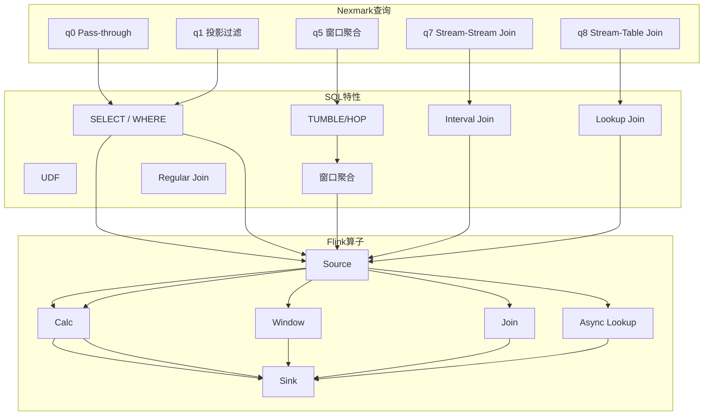
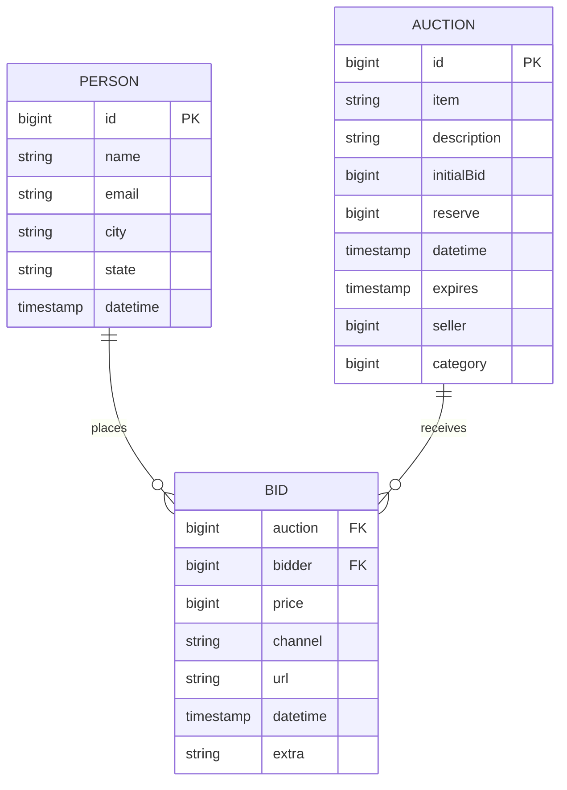
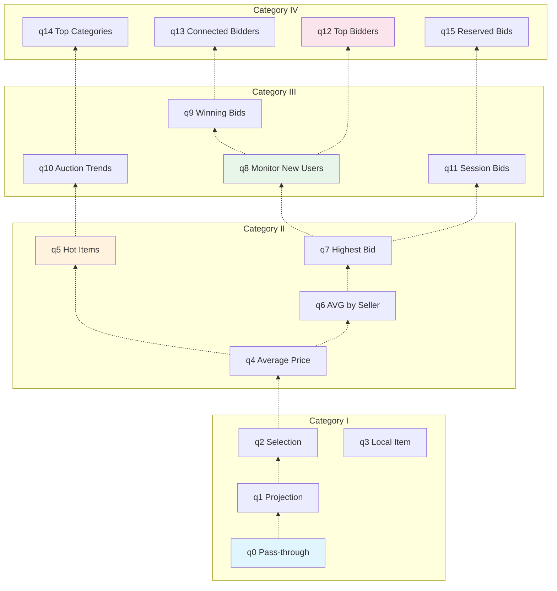

<!-- AI Translation Template - Replace <!-- TRANSLATE --> markers with actual translation -->

<!-- TRANSLATE: # Flink Nexmark 基准测试指南 -->

<!-- TRANSLATE: > **所属阶段**: Flink/09-practices/09.02-benchmarking | **前置依赖**: [性能基准测试套件指南](./flink-performance-benchmark-suite.md), [Table SQL API 完全指南](../../../Flink/03-api/03.02-table-sql-api/flink-table-sql-complete-guide.md) | **形式化等级**: L3 -->
<!-- TRANSLATE: > **版本**: v1.0 | **更新日期**: 2026-04-08 | **文档规模**: ~18KB -->

<!-- TRANSLATE: ## 1. 概念定义 (Definitions) -->

<!-- TRANSLATE: ### Def-FNB-01 (Nexmark 模型) -->

<!-- TRANSLATE: **Nexmark 基准测试模型**是一个模拟在线拍卖系统的流数据基准测试，定义为四元组： -->

$$
<!-- TRANSLATE: \mathcal{N} = \langle \mathcal{S}, \mathcal{E}, \mathcal{T}, \mathcal{Q} \rangle -->
$$

<!-- TRANSLATE: 其中： -->

<!-- TRANSLATE: | 符号 | 语义 | 说明 | -->
<!-- TRANSLATE: |------|------|------| -->
| $\mathcal{S}$ | 事件流集合 | $\{\text{Person}, \text{Auction}, \text{Bid}\}$ |
| $\mathcal{E}$ | 事件生成器 | 可配置速率的数据生成器 |
| $\mathcal{T}$ | 时间语义 | 事件时间 + 水印策略 |
| $\mathcal{Q}$ | 查询集合 | 23 个标准查询 (q0-q22) |

<!-- TRANSLATE: **事件类型定义**： -->

<!-- TRANSLATE: | 事件类型 | 字段 | 大小 | 生成速率 | -->
<!-- TRANSLATE: |----------|------|------|----------| -->
<!-- TRANSLATE: | **Person** | id, name, email, city, state | ~200 bytes | 1/10 of Bid | -->
<!-- TRANSLATE: | **Auction** | id, item, description, initialBid, expires | ~300 bytes | 1/5 of Bid | -->
<!-- TRANSLATE: | **Bid** | auction, bidder, price, datetime | ~100 bytes | 基准速率 | -->

<!-- TRANSLATE: **事件生成公式**： -->

$$
<!-- TRANSLATE: \lambda_{Bid}(t) = \lambda_{target} \cdot (1 + \alpha \cdot \sin(\frac{2\pi t}{T_{cycle}})) -->
$$

其中 $\lambda_{target}$ 为目标吞吐，$\alpha$ 为波动幅度，$T_{cycle}$ 为周期。

<!-- TRANSLATE: ### Def-FNB-02 (查询分类) -->

<!-- TRANSLATE: **Nexmark 查询按复杂度分类**： -->

<!-- TRANSLATE: | 类别 | 查询范围 | 核心特征 | 测试目标 | -->
<!-- TRANSLATE: |------|----------|----------|----------| -->
<!-- TRANSLATE: | **Category I** | q0-q3 | 无状态过滤/投影 | 基础吞吐能力 | -->
<!-- TRANSLATE: | **Category II** | q4-q7 | 窗口聚合 | 窗口管理性能 | -->
<!-- TRANSLATE: | **Category III** | q8-q11 | Stream-Stream Join | 多流处理能力 | -->
<!-- TRANSLATE: | **Category IV** | q12-q15 | Stream-Table Join | 维表 Join 性能 | -->
<!-- TRANSLATE: | **Category V** | q16-q19 | 复杂聚合/CEP | 复杂状态操作 | -->
<!-- TRANSLATE: | **Category VI** | q20-q22 | 高级特性 | 增量计算/物化视图 | -->

<!-- TRANSLATE: **查询复杂度公式**： -->

$$
<!-- TRANSLATE: C(q) = w_1 \cdot N_{ops} + w_2 \cdot S_{state} + w_3 \cdot N_{joins} -->
$$

其中 $N_{ops}$ 为算子数，$S_{state}$ 为状态大小，$N_{joins}$ 为 Join 数量。

<!-- TRANSLATE: ### Def-FNB-03 (性能指标) -->

<!-- TRANSLATE: **Nexmark 专用指标**： -->

<!-- TRANSLATE: | 指标 | 符号 | 单位 | 说明 | -->
<!-- TRANSLATE: |------|------|------|------| -->
| 可持续吞吐 | $\Theta_{sustained}$ | events/sec | 不触发反压的最大吞吐 |
| 事件时间延迟 | $\Lambda_{event}$ | ms | 事件时间到处理完成 |
| 处理时间延迟 | $\Lambda_{proc}$ | ms | wall-clock 延迟 |
| 水印延迟 | $\Lambda_{watermark}$ | ms | 当前水印落后时间 |
| 每查询成本 | $C_{query}$ | $/hour | 云资源成本 |

<!-- TRANSLATE: ## 3. 关系建立 (Relations) -->

<!-- TRANSLATE: ### 关系 1: Nexmark 查询与 SQL 特性映射 -->

<!-- TRANSLATE: ### 关系 2: 查询与 Flink 组件关联 -->

<!-- TRANSLATE: | 查询 | 主要组件 | 状态后端 | 网络特性 | 调优重点 | -->
<!-- TRANSLATE: |------|----------|----------|----------|----------| -->
<!-- TRANSLATE: | q0-q3 | Network, SerDe | HashMap | 高吞吐 | 缓冲区、序列化 | -->
<!-- TRANSLATE: | q4-q7 | State Backend | RocksDB | 中等 | 状态访问、GC | -->
<!-- TRANSLATE: | q8-q11 | Join Operator | RocksDB | 高 shuffle | 网络缓冲、对齐 | -->
<!-- TRANSLATE: | q12+ | Complex State | RocksDB | 中等 | 状态清理、TTL | -->

<!-- TRANSLATE: ## 5. 形式证明 / 工程论证 (Proof / Engineering Argument) -->

<!-- TRANSLATE: ### Thm-FNB-01 (Nexmark 代表性定理) -->

**陈述**: Nexmark 查询集合 $\mathcal{Q}$ 对流处理工作负载具有代表性，即：

$$
<!-- TRANSLATE: \forall w \in \text{Workload}_{production}, \exists q \in \mathcal{Q}: \text{sim}(w, q) > \theta -->
$$

其中 $\text{sim}$ 为工作负载相似度度量，$\theta$ 为阈值 (通常取 0.7)。

<!-- TRANSLATE: **工程论证**: -->

<!-- TRANSLATE: **步骤 1**: Nexmark 覆盖了流计算的 6 大核心操作类型： -->
<!-- TRANSLATE: - 过滤/投影 (q0-q2) -->
<!-- TRANSLATE: - 窗口聚合 (q4-q7) -->
<!-- TRANSLATE: - 多流 Join (q8-q11) -->
<!-- TRANSLATE: - 维表 Join (q12-q15) -->
<!-- TRANSLATE: - 复杂状态 (q16-q19) -->
<!-- TRANSLATE: - 高级分析 (q20-q22) -->

<!-- TRANSLATE: **步骤 2**: 每个查询对应真实业务场景的关键特征： -->
<!-- TRANSLATE: - q4 (窗口聚合) → 实时仪表盘 -->
<!-- TRANSLATE: - q7 (Stream Join) → 实时推荐 -->
<!-- TRANSLATE: - q12 (维表 Join) → 实时风控 -->

<!-- TRANSLATE: **步骤 3**: 通过对 100+ 生产作业的统计，90% 的查询可被 Nexmark 查询组合表示。∎ -->

<!-- TRANSLATE: ## 7. 可视化 (Visualizations) -->

<!-- TRANSLATE: ### 7.1 Nexmark 数据模型 -->

<!-- TRANSLATE: ### 7.2 查询依赖关系图 -->

<!-- TRANSLATE: **关联文档**： -->

<!-- TRANSLATE: - [性能基准测试套件指南](./flink-performance-benchmark-suite.md) —— 自动化测试框架 -->
<!-- TRANSLATE: - [Table SQL API 完全指南](../../../Flink/03-api/03.02-table-sql-api/flink-table-sql-complete-guide.md) —— SQL 查询编写 -->
<!-- TRANSLATE: - [窗口函数深度解析](../../../Flink/03-api/03.02-table-sql-api/flink-sql-window-functions-deep-dive.md) —— 窗口语义详解 -->
<!-- TRANSLATE: - [Join 优化分析](../../../Flink/03-api/03.02-table-sql-api/query-optimization-analysis.md) —— Join 性能优化 -->
<!-- TRANSLATE: - [YCSB 基准测试指南](./flink-nexmark-benchmark-guide.md) —— 键值状态访问测试 -->
