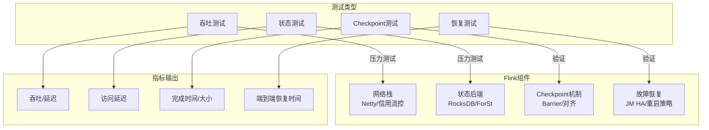
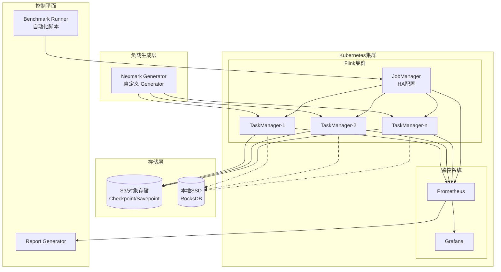
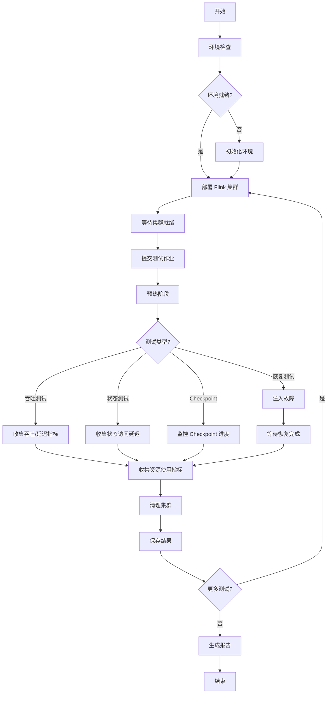

<!-- AI Translation Template - Replace <!-- TRANSLATE --> markers with actual translation -->

<!-- TRANSLATE: # Flink 性能基准测试套件指南 -->

<!-- TRANSLATE: > **所属阶段**: Flink/09-practices/09.02-benchmarking | **前置依赖**: [Flink 部署运维完全指南](../../../Flink/04-runtime/04.01-deployment/flink-deployment-ops-complete-guide.md), [性能调优指南](../../../Flink/09-practices/09.03-performance-tuning/performance-tuning-guide.md) | **形式化等级**: L3 -->
<!-- TRANSLATE: > **版本**: v3.3.0 | **更新日期**: 2026-04-08 | **文档规模**: ~20KB -->


<!-- TRANSLATE: ## 1. 概念定义 (Definitions) -->

<!-- TRANSLATE: ### Def-FBS-01 (基准测试框架) -->

<!-- TRANSLATE: **Flink 性能基准测试框架**定义为一个五元组： -->

$$
<!-- TRANSLATE: \mathcal{F} = \langle \mathcal{T}, \mathcal{E}, \mathcal{M}, \mathcal{A}, \mathcal{R} \rangle -->
$$

<!-- TRANSLATE: 其中： -->

<!-- TRANSLATE: | 符号 | 语义 | 说明 | -->
<!-- TRANSLATE: |------|------|------| -->
| $\mathcal{T}$ | 测试类型集合 | $\{\text{throughput}, \text{state}, \text{checkpoint}, \text{recovery}\}$ |
| $\mathcal{E}$ | 测试环境 | K8s 集群配置、资源规格 |
| $\mathcal{M}$ | 指标收集器 | Prometheus 指标查询接口 |
| $\mathcal{A}$ | 自动化引擎 | 测试执行编排、故障注入 |
| $\mathcal{R}$ | 报告生成器 | Markdown/JSON/HTML 报告输出 |

<!-- TRANSLATE: **测试类型矩阵**： -->

<!-- TRANSLATE: | 测试类型 | 测试目标 | 关键指标 | 测试时长 | -->
<!-- TRANSLATE: |----------|----------|----------|----------| -->
<!-- TRANSLATE: | **吞吐测试** | 最大可持续吞吐 | events/sec, P99 延迟 | 10 min | -->
<!-- TRANSLATE: | **状态访问测试** | 状态读写性能 | 访问延迟, 吞吐 | 5 min | -->
<!-- TRANSLATE: | **Checkpoint 测试** | 容错机制效率 | Checkpoint 耗时, 数据对齐时间 | 30 min | -->
<!-- TRANSLATE: | **恢复测试** | 故障恢复能力 | 端到端恢复时间 | 5 min | -->

<!-- TRANSLATE: ### Def-FBS-02 (性能指标定义) -->

<!-- TRANSLATE: **核心性能指标**形式化定义： -->

**吞吐量** ($\Theta$):
$$
<!-- TRANSLATE: \Theta = \frac{N_{processed}}{T_{elapsed}} \quad [\text{events/second}] -->
$$

**端到端延迟** ($\Lambda_p$):
$$
<!-- TRANSLATE: \Lambda_p = \text{percentile}_p(t_{out} - t_{in}) \quad [\text{milliseconds}] -->
$$

**状态访问延迟** ($\Delta_{state}$):
$$
<!-- TRANSLATE: \Delta_{state} = \frac{1}{N_{ops}} \sum_{i=1}^{N_{ops}} (t_{read,i} + t_{write,i}) \quad [\text{milliseconds}] -->
$$

**Checkpoint 效率** ($\eta_{chkpt}$):
$$
<!-- TRANSLATE: \eta_{chkpt} = \frac{S_{state}}{T_{chkpt} \cdot B_{network}} \quad [\text{效率系数}] -->
$$

其中 $S_{state}$ 为状态大小，$T_{chkpt}$ 为 Checkpoint 耗时，$B_{network}$ 为网络带宽。

<!-- TRANSLATE: **指标分级标准**： -->

<!-- TRANSLATE: | 指标 | 优秀 | 良好 | 一般 | 需优化 | -->
<!-- TRANSLATE: |------|------|------|------|--------| -->
<!-- TRANSLATE: | 吞吐 (1M 事件/秒) | > 95% | 80-95% | 60-80% | < 60% | -->
<!-- TRANSLATE: | P99 延迟 | < 100ms | 100-500ms | 500ms-1s | > 1s | -->
<!-- TRANSLATE: | 状态访问 | < 5ms | 5-20ms | 20-100ms | > 100ms | -->
<!-- TRANSLATE: | Checkpoint 耗时 | < 30s | 30-60s | 60-120s | > 120s | -->
<!-- TRANSLATE: | 恢复时间 | < 30s | 30-60s | 60-120s | > 120s | -->

<!-- TRANSLATE: ### Def-FBS-03 (测试环境规范) -->

<!-- TRANSLATE: **标准 K8s 集群规格**： -->

<!-- TRANSLATE: | 组件 | 规格 | 数量 | 说明 | -->
<!-- TRANSLATE: |------|------|------|------| -->
<!-- TRANSLATE: | Master 节点 | 8vCPU, 16GB RAM | 1 | K8s 控制平面 | -->
<!-- TRANSLATE: | Worker 节点 | 16vCPU, 64GB RAM | 3 | Flink 运行时 | -->
<!-- TRANSLATE: | 存储 | NVMe SSD 1TB | 3 | 本地状态存储 | -->
<!-- TRANSLATE: | 网络 | 25Gbps 以太网 | - | 低延迟互联 | -->

<!-- TRANSLATE: **Flink 集群配置**： -->

```yaml
flink:
  version: ["1.18.1", "2.0.0", "2.2.0"]

jobmanager:
  replicas: 1
  memory: 4Gi
  cpu: 2

taskmanager:
  replicas: 8
  memory: 8Gi
  cpu: 4
  slots: 4

state:
  backend: rocksdb
  checkpoints.dir: s3://flink-benchmark/checkpoints
  savepoints.dir: s3://flink-benchmark/savepoints

execution:
  checkpointing:
    interval: 5min
    min-pause: 1min
    timeout: 10min
```


<!-- TRANSLATE: ## 3. 关系建立 (Relations) -->

<!-- TRANSLATE: ### 关系 1: 测试类型与系统组件映射 -->



<!-- TRANSLATE: ### 关系 2: 性能指标关联性 -->

<!-- TRANSLATE: | 配置调整 | 吞吐影响 | 延迟影响 | Checkpoint 影响 | 恢复影响 | -->
<!-- TRANSLATE: |----------|----------|----------|-----------------|----------| -->
<!-- TRANSLATE: | **增加并行度** | ↑↑ | → | → | ↓ | -->
<!-- TRANSLATE: | **增大缓冲区** | ↑ | ↓ | ↑ | → | -->
<!-- TRANSLATE: | **RocksDB调优** | ↑ | ↓ | ↓ | → | -->
<!-- TRANSLATE: | **增量Checkpoint** | → | ↓ | ↓↓ | ↓ | -->
<!-- TRANSLATE: | **本地恢复启用** | → | → | → | ↓↓ | -->
<!-- TRANSLATE: | **Unaligned Checkpoint** | ↓ | ↓↓ | ↓ | ↓ | -->


<!-- TRANSLATE: ## 5. 形式证明 / 工程论证 (Proof / Engineering Argument) -->

<!-- TRANSLATE: ### Thm-FBS-01 (基准测试有效性定理) -->

**陈述**: 若测试框架 $\mathcal{F}$ 满足以下条件：

1. 环境一致性: $\forall t_1, t_2: \mathcal{E}(t_1) = \mathcal{E}(t_2)$
2. 负载代表性: $\mathcal{D}_{test} \sim \mathcal{D}_{production}$
3. 指标完备性: $\mathcal{M} \supseteq \{\Theta, \Lambda, \Delta_{state}, T_{recovery}\}$

则对于系统 $S_1, S_2$，有：

$$
<!-- TRANSLATE: R(S_1, \mathcal{F}) > R(S_2, \mathcal{F}) \Rightarrow S_1 \succ S_2 \text{ (在目标场景下)} -->
$$

<!-- TRANSLATE: **工程论证**: -->

<!-- TRANSLATE: **步骤 1**: 环境一致性确保变量控制 - 性能差异可归因于系统设计而非环境噪声。 -->

<!-- TRANSLATE: **步骤 2**: 负载代表性确保结果外推性 - 测试覆盖生产场景的关键特征。 -->

<!-- TRANSLATE: **步骤 3**: 指标完备性确保评估全面性 - 覆盖吞吐、延迟、容错、成本四维考量。 -->

<!-- TRANSLATE: **步骤 4**: 通过控制变量法，建立配置与性能的因果关联。∎ -->


<!-- TRANSLATE: ## 7. 可视化 (Visualizations) -->

<!-- TRANSLATE: ### 7.1 测试架构图 -->



<!-- TRANSLATE: ### 7.2 基准测试流程图 -->




<!-- TRANSLATE: **关联文档**： -->

<!-- TRANSLATE: - [Flink 部署运维完全指南](../../../Flink/04-runtime/04.01-deployment/flink-deployment-ops-complete-guide.md) —— 生产环境部署参考 -->
<!-- TRANSLATE: - [性能调优指南](../../../Flink/09-practices/09.03-performance-tuning/performance-tuning-guide.md) —— 基于基准测试的调优建议 -->
<!-- TRANSLATE: - [Nexmark 基准测试指南](./flink-nexmark-benchmark-guide.md) —— 标准 SQL 基准测试详解 -->
<!-- TRANSLATE: - [YCSB 基准测试指南](./flink-nexmark-benchmark-guide.md) —— 键值状态访问测试 -->
<!-- TRANSLATE: - [状态后端深度对比](../../../Flink/02-core/state-backends-deep-comparison.md) —— 不同状态后端性能对比 -->
