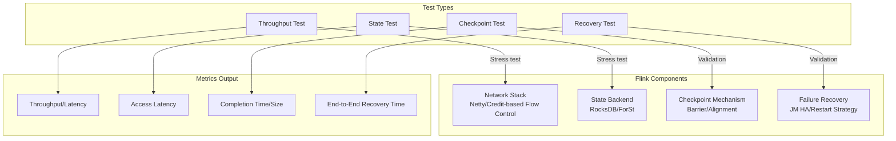
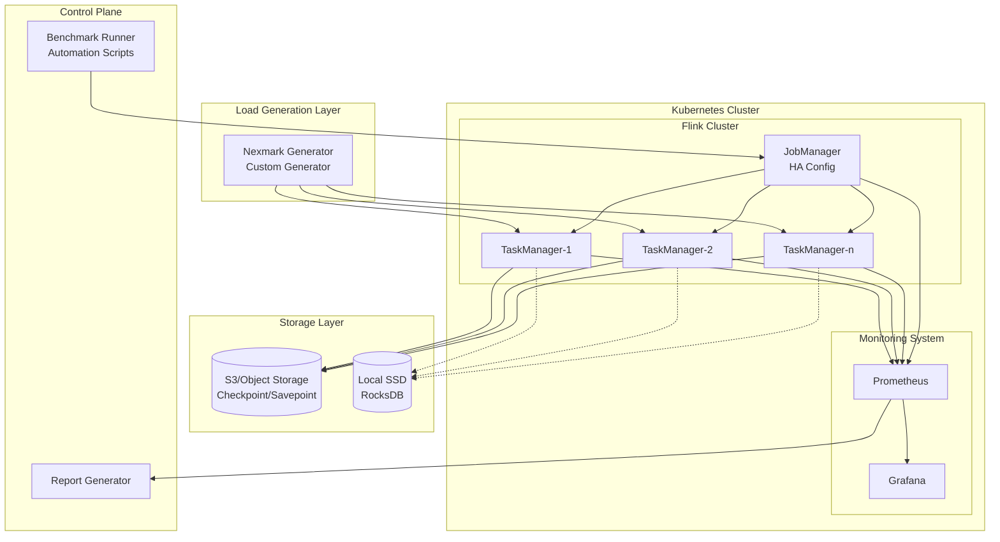
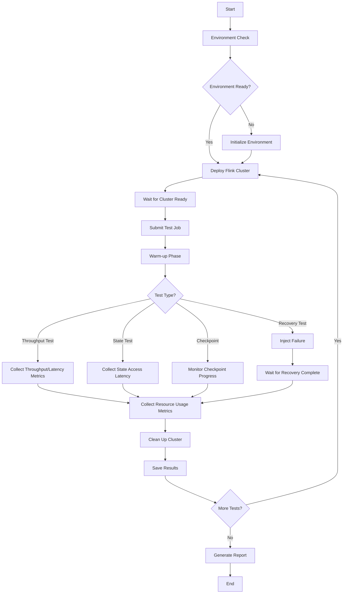

# Flink Performance Benchmark Suite Guide

> **Stage**: Flink/09-practices/09.02-benchmarking | **Prerequisites**: [Flink Deployment and Operations Complete Guide](./04-runtime/04.01-deployment/flink-deployment-ops-complete-guide.md), [Performance Tuning Guide](./09-practices/09.03-performance-tuning/performance-tuning-guide.md) | **Formalization Level**: L3
> **Version**: v3.3.0 | **Updated**: 2026-04-08 | **Document Size**: ~20KB

---

## Table of Contents

- [Flink Performance Benchmark Suite Guide](#flink-performance-benchmark-suite-guide)
  - [Table of Contents](#table-of-contents)
  - [1. Definitions](#1-definitions)
    - [Def-FBS-01 (Benchmark Framework)](#def-fbs-01-benchmark-framework)
    - [Def-FBS-02 (Performance Metrics Definition)](#def-fbs-02-performance-metrics-definition)
    - [Def-FBS-03 (Test Environment Specification)](#def-fbs-03-test-environment-specification)
  - [2. Properties](#2-properties)
    - [Prop-FBS-01 (Test Result Reproducibility)](#prop-fbs-01-test-result-reproducibility)
    - [Prop-FBS-02 (Performance Degradation Boundary)](#prop-fbs-02-performance-degradation-boundary)
  - [3. Relations](#3-relations)
    - [Relation 1: Test Type and System Component Mapping](#relation-1-test-type-and-system-component-mapping)
    - [Relation 2: Performance Metric Correlations](#relation-2-performance-metric-correlations)
  - [4. Argumentation](#4-argumentation)
    - [4.1 Test Environment Standardization](#41-test-environment-standardization)
    - [4.2 Test Toolchain Selection](#42-test-toolchain-selection)
  - [5. Proof / Engineering Argument](#5-proof--engineering-argument)
    - [Thm-FBS-01 (Benchmark Validity Theorem)](#thm-fbs-01-benchmark-validity-theorem)
  - [6. Examples](#6-examples)
    - [6.1 Quick Start](#61-quick-start)
    - [6.2 Throughput Test Full Example](#62-throughput-test-full-example)
    - [6.3 State Access Test Example](#63-state-access-test-example)
    - [6.4 Checkpoint Test Example](#64-checkpoint-test-example)
  - [7. Visualizations](#7-visualizations)
    - [7.1 Test Architecture Diagram](#71-test-architecture-diagram)
    - [7.2 Benchmark Flowchart](#72-benchmark-flowchart)
  - [8. References](#8-references)

---

## 1. Definitions

### Def-FBS-01 (Benchmark Framework)

**Flink Performance Benchmark Framework** is defined as a quintuple:

$$
\mathcal{F} = \langle \mathcal{T}, \mathcal{E}, \mathcal{M}, \mathcal{A}, \mathcal{R} \rangle
$$

Where:

| Symbol | Semantics | Description |
|--------|-----------|-------------|
| $\mathcal{T}$ | Test type set | $\{\text{throughput}, \text{state}, \text{checkpoint}, \text{recovery}\}$ |
| $\mathcal{E}$ | Test environment | K8s cluster configuration, resource specs |
| $\mathcal{M}$ | Metrics collector | Prometheus metrics query interface |
| $\mathcal{A}$ | Automation engine | Test execution orchestration, fault injection |
| $\mathcal{R}$ | Report generator | Markdown/JSON/HTML report output |

**Test Type Matrix**:

| Test Type | Test Objective | Key Metrics | Test Duration |
|-----------|----------------|-------------|---------------|
| **Throughput Test** | Maximum sustainable throughput | events/sec, P99 latency | 10 min |
| **State Access Test** | State read/write performance | Access latency, throughput | 5 min |
| **Checkpoint Test** | Fault tolerance efficiency | Checkpoint duration, alignment time | 30 min |
| **Recovery Test** | Failure recovery capability | End-to-end recovery time | 5 min |

### Def-FBS-02 (Performance Metrics Definition)

**Core performance metrics** formal definitions:

**Throughput** ($\Theta$):
$$
\Theta = \frac{N_{processed}}{T_{elapsed}} \quad [\text{events/second}]
$$

**End-to-end Latency** ($\Lambda_p$):
$$
\Lambda_p = \text{percentile}_p(t_{out} - t_{in}) \quad [\text{milliseconds}]
$$

**State Access Latency** ($\Delta_{state}$):
$$
\Delta_{state} = \frac{1}{N_{ops}} \sum_{i=1}^{N_{ops}} (t_{read,i} + t_{write,i}) \quad [\text{milliseconds}]
$$

**Checkpoint Efficiency** ($\eta_{chkpt}$):
$$
\eta_{chkpt} = \frac{S_{state}}{T_{chkpt} \cdot B_{network}} \quad [\text{efficiency coefficient}]
$$

Where $S_{state}$ is state size, $T_{chkpt}$ is Checkpoint duration, and $B_{network}$ is network bandwidth.

**Metric Grading Standards**:

| Metric | Excellent | Good | Fair | Needs Optimization |
|--------|-----------|------|------|--------------------|
| Throughput (1M events/sec) | > 95% | 80-95% | 60-80% | < 60% |
| P99 Latency | < 100ms | 100-500ms | 500ms-1s | > 1s |
| State Access | < 5ms | 5-20ms | 20-100ms | > 100ms |
| Checkpoint Duration | < 30s | 30-60s | 60-120s | > 120s |
| Recovery Time | < 30s | 30-60s | 60-120s | > 120s |

### Def-FBS-03 (Test Environment Specification)

**Standard K8s Cluster Specs**:

| Component | Specification | Count | Description |
|-----------|---------------|-------|-------------|
| Master node | 8vCPU, 16GB RAM | 1 | K8s control plane |
| Worker node | 16vCPU, 64GB RAM | 3 | Flink runtime |
| Storage | NVMe SSD 1TB | 3 | Local state storage |
| Network | 25Gbps Ethernet | - | Low-latency interconnect |

**Flink Cluster Configuration**:

```yaml
flink:
  version: ["1.18.1", "2.0.0", "2.2.0"]

jobmanager:
  replicas: 1
  memory: 4Gi
  cpu: 2

taskmanager:
  replicas: 8
  memory: 8Gi
  cpu: 4
  slots: 4

state:
  backend: rocksdb
  checkpoints.dir: s3://flink-benchmark/checkpoints
  savepoints.dir: s3://flink-benchmark/savepoints

execution:
  checkpointing:
    interval: 5min
    min-pause: 1min
    timeout: 10min
```

---

## 2. Properties

### Prop-FBS-01 (Test Result Reproducibility)

**Statement**: In a controlled environment, the coefficient of variation of benchmark results should be less than 5%.

$$
CV = \frac{\sigma}{\mu} \times 100\% < 5\%
$$

**Sufficient Conditions**:

1. **Hardware consistency**: Use dedicated nodes, avoid resource contention
2. **Software version lock**: Flink, JVM, OS versions fixed
3. **Data determinism**: Use fixed random seed for data generation
4. **Warm-up period**: At least 2 minutes warm-up for JVM to reach steady state

### Prop-FBS-02 (Performance Degradation Boundary)

**Statement**: When load exceeds system capacity, performance degrades non-linearly.

$$
\Lambda_{p99}(\lambda) = \begin{cases}
\Lambda_{baseline} \cdot (1 + \alpha \cdot \frac{\lambda}{\Theta_{max}}) & \lambda \leq \Theta_{max} \\
\Lambda_{baseline} \cdot e^{\beta(\lambda - \Theta_{max})} & \lambda > \Theta_{max}
\end{cases}
$$

**Engineering Corollary**: The recommended production load upper limit is $\lambda_{target} \leq 0.7 \cdot \Theta_{max}$, reserving 30% capacity buffer.

---

## 3. Relations

### Relation 1: Test Type and System Component Mapping



### Relation 2: Performance Metric Correlations

| Configuration Adjustment | Throughput Impact | Latency Impact | Checkpoint Impact | Recovery Impact |
|--------------------------|-------------------|----------------|-------------------|-----------------|
| **Increase parallelism** | ↑↑ | → | → | ↓ |
| **Increase buffer size** | ↑ | ↓ | ↑ | → |
| **RocksDB tuning** | ↑ | ↓ | ↓ | → |
| **Incremental Checkpoint** | → | ↓ | ↓↓ | ↓ |
| **Local recovery enabled** | → | → | → | ↓↓ |
| **Unaligned Checkpoint** | ↓ | ↓↓ | ↓ | ↓ |

---

## 4. Argumentation

### 4.1 Test Environment Standardization

**Environment Consistency Measures**:

| Layer | Measure | Validation Method |
|-------|---------|-------------------|
| **Hardware** | Use same machine model, disable CPU frequency scaling | `lscpu` check |
| **K8s** | Fixed node affinity, disable auto-scaling | `kubectl describe node` |
| **Flink** | Configuration templated, versions explicit | `flink --version` |
| **Network** | Dedicated network plane, bandwidth guaranteed | `iperf3` test |
| **Storage** | Local SSD fixed mount point | `fio` test |

### 4.2 Test Toolchain Selection

| Tool | Purpose | Version Requirement |
|------|---------|---------------------|
| **Nexmark** | Standard SQL benchmark | Flink built-in |
| **YCSB** | Key-value state access test | 0.17.0+ |
| **Custom Generator** | Scenario-specific load generation | Python 3.9+ |
| **Prometheus** | Metrics collection | 2.40+ |
| **Grafana** | Visualization monitoring | 9.0+ |
| **JFR** | JVM performance profiling | JDK 11+ |

---

## 5. Proof / Engineering Argument

### Thm-FBS-01 (Benchmark Validity Theorem)

**Statement**: If test framework $\mathcal{F}$ satisfies the following conditions:

1. Environment consistency: $\forall t_1, t_2: \mathcal{E}(t_1) = \mathcal{E}(t_2)$
2. Load representativeness: $\mathcal{D}_{test} \sim \mathcal{D}_{production}$
3. Metric completeness: $\mathcal{M} \supseteq \{\Theta, \Lambda, \Delta_{state}, T_{recovery}\}$

Then for systems $S_1, S_2$:

$$
R(S_1, \mathcal{F}) > R(S_2, \mathcal{F}) \Rightarrow S_1 \succ S_2 \text{ (in target scenario)}
$$

**Engineering Argument**:

**Step 1**: Environment consistency ensures variable control - performance differences can be attributed to system design rather than environmental noise.

**Step 2**: Load representativeness ensures result generalizability - tests cover key characteristics of production scenarios.

**Step 3**: Metric completeness ensures comprehensive evaluation - covers throughput, latency, fault tolerance, and cost dimensions.

**Step 4**: Through controlled variable methods, establish causal relationships between configuration and performance. ∎

---

## 6. Examples

### 6.1 Quick Start

**Install dependencies**:

```bash
# Clone benchmark suite
git clone https://github.com/apache/flink-benchmarks.git
cd flink-benchmarks

# Install Python dependencies
pip install -r requirements.txt

# Configure K8s access
export KUBECONFIG=~/.kube/benchmark-cluster
```

**Run a single test**:

```bash
# Throughput test
python flink-benchmark-runner.py \
  --test-type throughput \
  --flink-versions 2.0.0 \
  --namespace flink-benchmark

# State access test (100GB)
python flink-benchmark-runner.py \
  --state-size 100 \
  --flink-versions 2.0.0

# Checkpoint test (5-minute interval)
python flink-benchmark-runner.py \
  --checkpoint-interval 300 \
  --flink-versions 2.0.0

# Failure recovery test
python flink-benchmark-runner.py \
  --failure-type task_failure \
  --flink-versions 2.0.0
```

**Run full test suite**:

```bash
python flink-benchmark-runner.py \
  --all \
  --flink-versions 1.18.1 2.0.0 2.2.0 \
  --output-dir ./benchmark-results-2026-q2
```

### 6.2 Throughput Test Full Example

**Scenario**: Test Flink 2.0 latency performance under 1M events/sec

```python
from flink_benchmark_runner import FlinkBenchmarkRunner, TestType

# Initialize runner
runner = FlinkBenchmarkRunner(
    output_dir="./results"
)

# Configure test
config = {
    "flink_version": "2.0.0",
    "parallelism": 16,
    "state_backend": "rocksdb",
    "target_throughput": 1_000_000,
    "test_duration_sec": 600,
    "warmup_sec": 120
}

# Execute test
result = runner.run_throughput_test(config)

# Output results
print(f"Throughput: {result.throughput:,.0f} events/sec")
print(f"P99 Latency: {result.latency_p99} ms")
print(f"Test Status: {result.status.value}")
```

**Expected Output**:

```
[2026-04-08 10:00:00] INFO: Deploying Flink 2.0.0 cluster...
[2026-04-08 10:02:30] INFO: Flink cluster is ready
[2026-04-08 10:02:31] INFO: Warming up for 120s...
[2026-04-08 10:04:31] INFO: Running throughput test: target 1000000 events/sec
[2026-04-08 10:14:31] INFO: Test completed

Throughput: 985,432 events/sec
P99 Latency: 85 ms
Test Status: completed
```

### 6.3 State Access Test Example

**Test access latency under different state sizes**:

```python
state_sizes = [10, 50, 100, 500]  # GB
results = []

for size in state_sizes:
    result = runner.run_state_access_test(
        state_size=size,
        config={"flink_version": "2.0.0", "access_pattern": "random"}
    )
    results.append({
        "state_size_gb": size,
        "latency_ms": result.state_access_latency
    })

# Generate comparison report
report = runner.generate_report(results, format="markdown")
```

**Typical Results**:

| State Size | Access Latency (ms) | Throughput (K ops/sec) |
|------------|---------------------|------------------------|
| 10 GB | 2.5 | 450 |
| 50 GB | 4.2 | 380 |
| 100 GB | 7.8 | 320 |
| 500 GB | 25.0 | 180 |

### 6.4 Checkpoint Test Example

**Test Checkpoint performance at different intervals**:

```bash
# 60-second interval
python flink-benchmark-runner.py \
  --checkpoint-interval 60 \
  --flink-versions 2.0.0

# 300-second interval
python flink-benchmark-runner.py \
  --checkpoint-interval 300 \
  --flink-versions 2.0.0

# 600-second interval
python flink-benchmark-runner.py \
  --checkpoint-interval 600 \
  --flink-versions 2.0.0
```

**Result Analysis**:

| Checkpoint Interval | Avg Completion Time | State Size | Throughput Impact |
|---------------------|---------------------|------------|-------------------|
| 60s | 12s | 10GB | -3% |
| 300s | 45s | 50GB | -8% |
| 600s | 85s | 100GB | -12% |

---

## 7. Visualizations

### 7.1 Test Architecture Diagram



### 7.2 Benchmark Flowchart



---

## 8. References


---

**Related Documents**:

- [Flink Deployment and Operations Complete Guide](./04-runtime/04.01-deployment/flink-deployment-ops-complete-guide.md) — Production deployment reference
- [Performance Tuning Guide](./09-practices/09.03-performance-tuning/performance-tuning-guide.md) — Tuning recommendations based on benchmarks
- [Nexmark Benchmark Guide](./flink-nexmark-benchmark-guide.md) — Standard SQL benchmark details
- [YCSB Benchmark Guide](./flink-nexmark-benchmark-guide.md) — Key-value state access tests
- [State Backend Deep Comparison](./02-core/state-backends-deep-comparison.md) — Performance comparison of different state backends

---

*Document Version: v3.3.0 | Created: 2026-04-08 | Maintainer: AnalysisDataFlow Project*
*Formalization Level: L3 | Document Size: ~20KB | Code Examples: 4 | Visualizations: 2*
