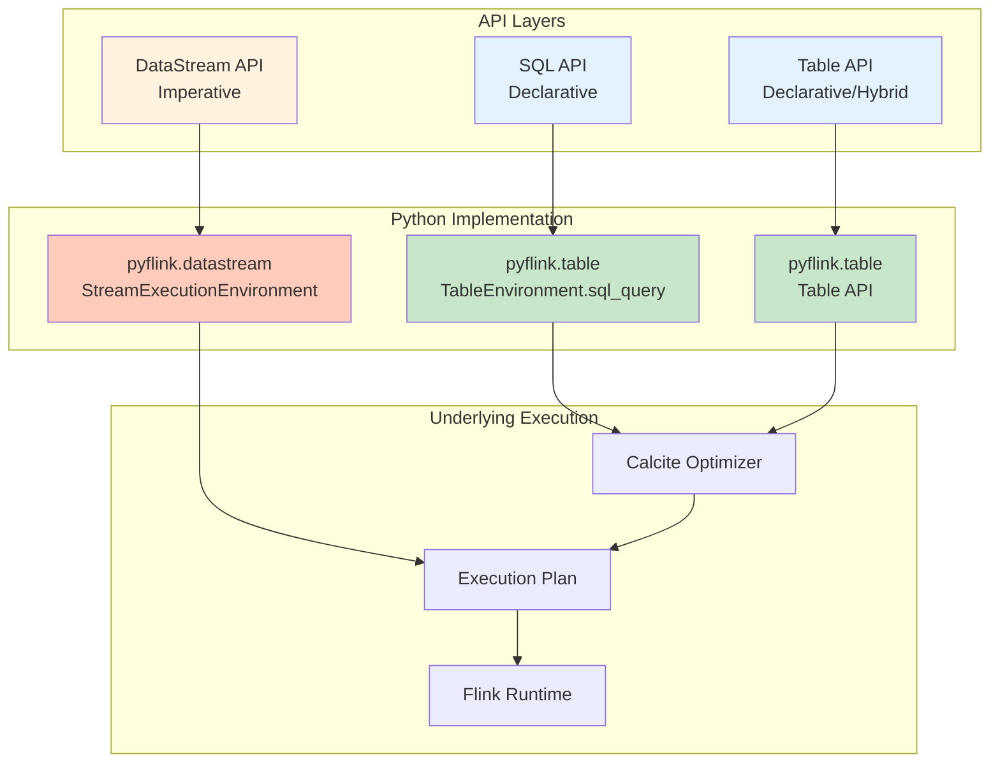
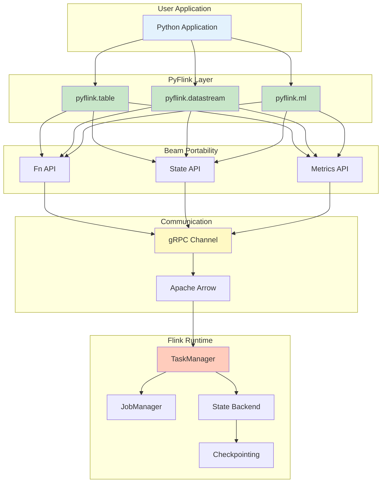
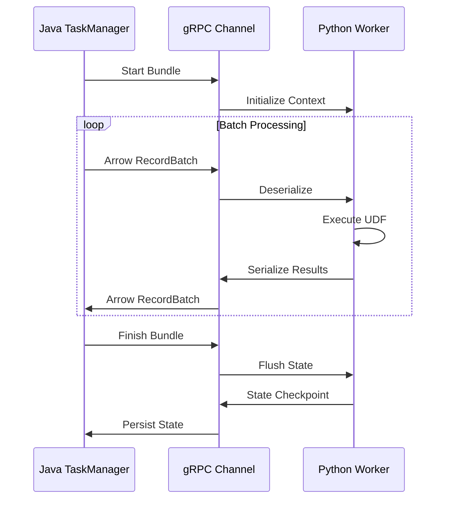
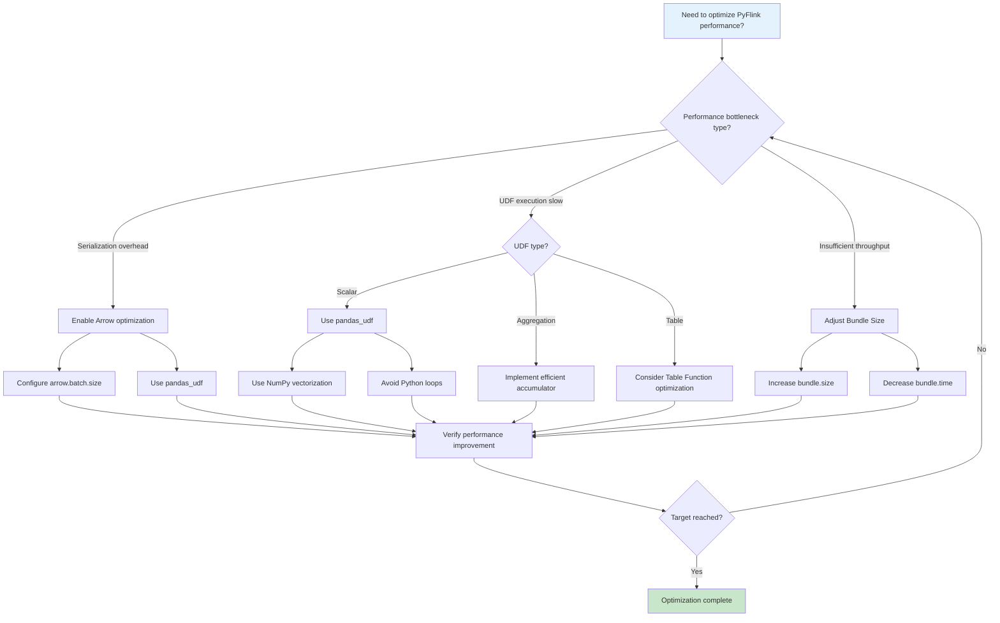

# PyFlink Deep Dive: Architecture Principles and Engineering Practices

> **Stage**: Flink/ Engineering Practice | **Prerequisites**: [Flink/09-language-foundations/pyflink-complete-guide.md](../../../Flink/03-api/09-language-foundations/pyflink-complete-guide.md), [Flink/02-core/checkpoint-mechanism-deep-dive.md](../../../Flink/02-core/checkpoint-mechanism-deep-dive.md) | **Formalization Level**: L3-L4
> **Version**: 2026.04 | **Applicable Versions**: Flink 1.18+ - 2.5+ | **Python**: 3.9+

---

## 1. Definitions

### Def-F-Py-01: PyFlink Architecture Model

**Formal Definition**: The PyFlink architecture is a cross-language execution framework defined as a 6-tuple:

$$
\mathcal{P}_{Flink} = (P_{vm}, J_{vm}, B_{bridge}, S_{ser}, E_{exec}, C_{coord})
$$

Where:

- $P_{vm}$: Python VM execution layer, running user Python code and UDFs
- $J_{vm}$: Java VM execution layer, running the Flink core engine
- $B_{bridge}$: Bidirectional communication bridge (Apache Beam Portability Framework)
- $S_{ser}$: Serialization layer (Apache Arrow + Protobuf + cloudpickle)
- $E_{exec}$: Execution environment abstraction layer
- $C_{coord}$: Cross-language coordinator (JobMaster ↔ Python Driver)

**Architecture Layer Diagram**

```
┌─────────────────────────────────────────────────────────────────────┐
│                        Application Layer                             │
│  ┌─────────────┐  ┌─────────────┐  ┌─────────────────────────────┐  │
│  │  Table API  │  │ DataStream  │  │     ML Pipeline API         │  │
│  │   (Python)  │  │   (Python)  │  │      (PyFlink ML)           │  │
│  └──────┬──────┘  └──────┬──────┘  └─────────────┬───────────────┘  │
├───────┼────────────────┼───────────────────────┼──────────────────┤
│       ▼                ▼                       ▼                    │
│  ┌─────────────────────────────────────────────────────────────┐   │
│  │              PyFlink Python API Layer                        │   │
│  │    (pyflink.table / pyflink.datastream / pyflink.ml)       │   │
│  └───────────────────────────┬─────────────────────────────────┘   │
├──────────────────────────────┼─────────────────────────────────────┤
│                              ▼                                      │
│  ┌─────────────────────────────────────────────────────────────┐   │
│  │           Apache Beam Portability Framework                 │   │
│  │  ┌─────────────┐  ┌─────────────┐  ┌─────────────────────┐  │   │
│  │  │  Fn API     │  │  State API  │  │   Metrics API       │  │   │
│  │  │ (UDF Exec)  │  │(State Ops)  │  │ (Monitoring)        │  │   │
│  │  └─────────────┘  └─────────────┘  └─────────────────────┘  │   │
│  └───────────────────────────┬─────────────────────────────────┘   │
├──────────────────────────────┼─────────────────────────────────────┤
│                              ▼                                      │
│  ┌─────────────────────────────────────────────────────────────┐   │
│  │              gRPC Communication Channel                     │   │
│  │         (Bundle Processing / Streaming Data Exchange)       │   │
│  └───────────────────────────┬─────────────────────────────────┘   │
├──────────────────────────────┼─────────────────────────────────────┤
│                              ▼                                      │
│  ┌─────────────────────────────────────────────────────────────┐   │
│  │              Flink Java Runtime Core                        │   │
│  │  ┌─────────────┐  ┌─────────────┐  ┌─────────────────────┐  │   │
│  │  │TaskManager  │  │Checkpointing│  │    Network Stack    │  │   │
│  │  │(Task Exec)  │  │   (State)   │  │  (Shuffle/Backpressure)│  │   │
│  │  └─────────────┘  └─────────────┘  └─────────────────────┘  │   │
│  └─────────────────────────────────────────────────────────────┘   │
└─────────────────────────────────────────────────────────────────────┘
```

### Def-F-Py-02: Python VM ↔ JVM Communication Protocol

**Formal Definition**: The cross-language communication protocol is defined as:

$$
\mathcal{C}_{proto} = (T_{transport}, S_{serialization}, B_{batching}, F_{flow})
$$

Where:

| Component | Technical Implementation | Function Description |
|-----------|-------------------------|----------------------|
| $T_{transport}$ | gRPC over HTTP/2 | Bidirectional streaming communication channel |
| $S_{serialization}$ | Apache Arrow (columnar) | Efficient batch data serialization |
| $B_{batching}$ | Bundle Processing | Micro-batch processing optimization |
| $F_{flow}$ | Flow control / backpressure | Prevent memory overflow |

**Communication Flow**

```
Python Driver                    Java JobManager
     │                                │
     │  1. Submit Job (JobGraph)      │
     │ ─────────────────────────────> │
     │                                │
     │  2. Deploy Tasks               │
     │ <───────────────────────────── │
     │                                │
Python Worker(s)                Java TaskManager(s)
     │                                │
     │  3. gRPC Channel Establish     │
     │ <════════════════════════════> │
     │                                │
     │  4. Arrow Data Streaming       │
     │ <════════════════════════════> │
     │     (Input Data → UDF → Output)│
     │                                │
     │  5. State Operations via State API
     │ <════════════════════════════> │
     │                                │
     │  6. Checkpoint Coordination    │
     │ <════════════════════════════> │
```

### Def-F-Py-03: UDF Execution Model

**Formal Definition**: The Python UDF execution model is defined as:

$$
\mathcal{U}_{exec} = (W_{pool}, Q_{input}, Q_{output}, P_{process}, T_{thread})
$$

Where:

- $W_{pool}$: Python Worker process pool
- $Q_{input}$: Input data queue (Arrow format)
- $Q_{output}$: Output data queue (Arrow format)
- $P_{process}$: UDF processing logic
- $T_{thread}$: Thread management strategy

**Bundle Processing Mechanism**

```
┌─────────────────────────────────────────────────────────────────┐
│                     Bundle Processing Cycle                     │
├─────────────────────────────────────────────────────────────────┤
│                                                                 │
│  Java TM                    gRPC Channel              Python    │
│  ────────                   ─────────────            Worker     │
│     │                             │                      │      │
│     │  Start Bundle               │                      │      │
│     │ ─────────────────────────>  │                      │      │
│     │                             │  Initialize Context  │      │
│     │                             │ ──────────────────>  │      │
│     │                             │                      │      │
│     │  Process Element [Batch]    │                      │      │
│     │ ─────────────────────────>  │  Arrow RecordBatch   │      │
│     │  (Arrow Data)               │ ──────────────────>  │      │
│     │                             │                      │      │
│     │                             │  Execute UDF         │      │
│     │                             │  ┌──────────────┐    │      │
│     │                             │  │ Map/FlatMap  │    │      │
│     │                             │  │ Filter/Agg   │    │      │
│     │                             │  └──────────────┘    │      │
│     │                             │                      │      │
│     │                             │  Return Results      │      │
│     │  Output Elements            │ <──────────────────  │      │
│     │ <─────────────────────────  │  (Arrow Data)        │      │
│     │                             │                      │      │
│     │  Finish Bundle              │                      │      │
│     │ ─────────────────────────>  │  Flush State         │      │
│     │                             │ ──────────────────>  │      │
│     │                             │                      │      │
│     │  Checkpoint State           │                      │      │
│     │ <═════════════════════════> │  Persist State       │      │
│     │                             │                      │      │
└─────────────────────────────────────────────────────────────────┘
```

---

## 2. Properties

### Lemma-F-Py-01: PyFlink UDF Serialization Overhead

**Lemma**: The data serialization overhead of PyFlink UDFs satisfies:

$$
T_{total} = T_{arrow\_ser} + T_{grpc\_trans} + T_{py\_exec} + T_{arrow\_deser}
$$

The approximate values of each component are:

| Operation | Time Complexity | Typical Latency (10K rows) |
|-----------|-----------------|---------------------------|
| Arrow serialization | $O(n)$ | 1-5 ms |
| gRPC transmission | $O(n)$ | 2-10 ms (local) / 10-50 ms (remote) |
| Python execution | Depends on UDF | 10-1000+ ms |
| Arrow deserialization | $O(n)$ | 1-5 ms |

**Optimization Direction**: Python execution is the main bottleneck; prioritize optimizing UDF code.

### Lemma-F-Py-02: Bundle Size and Throughput Relationship

**Lemma**: There is an optimal balance point between bundle size and throughput:

$$
Throughput_{optimal} = f(BundleSize) \text{ where } \frac{d(Throughput)}{d(BundleSize)} = 0
$$

**Typical Characteristics**:

| Bundle Size | Latency | Throughput | Applicable Scenarios |
|-------------|---------|------------|----------------------|
| 1-10 | Very low | Low | Latency-sensitive |
| 100-1000 | Medium | High | General scenarios |
| 10000+ | Higher | Saturated | Batch processing mode |

### Prop-F-Py-01: Python UDF vs Java UDF Performance Comparison

**Proposition**: In typical stream processing scenarios, the performance relationship between Python UDFs and Java UDFs is:

$$
Throughput_{PythonUDF} \approx 0.3 \times Throughput_{JavaUDF}
$$

**Exceptions** (Python UDF may be faster):

1. Complex mathematical operations using NumPy/Pandas vectorization
2. Calling native Python ML libraries (scikit-learn, PyTorch)
3. Deep integration with the Python ecosystem required

---

## 3. Relations

### Table API vs DataStream API Comparison



**Selection Decision Matrix**

| Scenario | Recommended API | Reason |
|----------|-----------------|--------|
| Complex ETL | Table API | Optimizer automatically optimizes execution plan |
| Complex event processing | DataStream API | Fine-grained control over time/state |
| Real-time feature engineering | Table API + Pandas UDF | Integration with ML ecosystem |
| Need low-level control | DataStream API | Directly operate State/Timer |
| SQL migration | Table API (SQL) | Minimize migration cost |

---

## 4. Argumentation

### PyFlink Applicable Scenario Analysis

**Advantageous Scenarios**

1. **Data Science & ML Integration**
   - Direct use of scikit-learn, PyTorch, TensorFlow
   - Native Pandas DataFrame support
   - Feature engineering and model inference unified

2. **Rapid Prototyping**
   - Concise Python syntax, high development efficiency
   - Rich third-party library ecosystem
   - Jupyter Notebook integration

3. **Complex Computation Logic**
   - String/text processing (NLP tasks)
   - Complex mathematical operations (NumPy/SciPy)
   - Custom business logic

**Disadvantageous Scenarios**

1. **Extremely High Throughput Requirements**
   - Pure Java UDFs have better performance
   - Cross-language serialization overhead

2. **Extremely Low Latency Requirements**
   - Bundle processing introduces batch latency
   - gRPC communication overhead

---

## 5. Proof / Engineering Argument

### Thm-F-Py-01: PyFlink Exactly-Once Semantic Guarantee

**Theorem**: With correct configuration, PyFlink can provide the same Exactly-Once processing semantics as Java Flink.

**Proof Sketch**:

1. **State consistency**: Python UDF state is delegated to the Java State Backend via the State API
   $$
   State_{Python} \xrightarrow{State API} State_{Java} \xrightarrow{Checkpoint} PersistentStorage
   $$

2. **Checkpoint coordination**: Python Workers participate in the two-phase Checkpoint protocol
   - Phase 1: Synchronous snapshot (stop processing)
   - Phase 2: Asynchronous persistence (resume processing)

3. **Data replay**: On failure, recover from Checkpoint and replay data from Source
   $$
   Recovery: Checkpoint_{n} \rightarrow State_{restored} + Source_{replay}
   $$

**Engineering Constraint**: Python UDFs must satisfy idempotency or state determinism; otherwise duplicate processing may occur.

---

## 6. Examples

### 6.1 Table API in Python

#### Basic Table API Operations

```python
from pyflink.table import EnvironmentSettings, TableEnvironment, DataTypes
from pyflink.table.expressions import col, lit

# Create Table Environment
env_settings = EnvironmentSettings.in_streaming_mode()
table_env = TableEnvironment.create(env_settings)

# Configure Checkpoint
table_env.get_config().get_configuration().set_string(
    "execution.checkpointing.interval", "10s"
)

# Create Kafka Source table
table_env.execute_sql("""
CREATE TABLE user_events (
    user_id STRING,
    event_type STRING,
    event_time TIMESTAMP(3),
    amount DECIMAL(10, 2),
    WATERMARK FOR event_time AS event_time - INTERVAL '5' SECOND
) WITH (
    'connector' = 'kafka',
    'topic' = 'user-events',
    'properties.bootstrap.servers' = 'kafka:9092',
    'format' = 'json',
    'scan.startup.mode' = 'latest-offset'
)
""")

# Create MySQL Sink table
table_env.execute_sql("""
CREATE TABLE event_stats (
    event_type STRING,
    event_count BIGINT,
    total_amount DECIMAL(18, 2),
    window_start TIMESTAMP(3),
    PRIMARY KEY (event_type, window_start) NOT ENFORCED
) WITH (
    'connector' = 'jdbc',
    'url' = 'jdbc:mysql://mysql:3306/analytics',
    'table-name' = 'event_stats',
    'username' = 'flink',
    'password' = 'flink123'
)
""")

# Define aggregation logic
result = table_env.from_path("user_events") \
    .window(
        Tumble.over(lit(1).hours).on(col("event_time")).alias("w")
    ) \
    .group_by(col("w"), col("event_type")) \
    .select(
        col("event_type"),
        col("user_id").count.alias("event_count"),
        col("amount").sum.alias("total_amount"),
        col("w").start.alias("window_start")
    )

# Execute insert
result.execute_insert("event_stats").wait()
```

#### Window Operations in Detail

```python
from pyflink.table import Tumble, Slide, Session
from pyflink.table.expressions import col

# Tumble Window
tumble_result = table_env.from_path("events") \
    .window(Tumble.over(lit(5).minutes).on(col("event_time")).alias("w")) \
    .group_by(col("user_id"), col("w")) \
    .select(col("user_id"), col("w").start, col("w").end, col("amount").sum)

# Slide Window
slide_result = table_env.from_path("events") \
    .window(Slide.over(lit(10).minutes).every(lit(2).minutes).on(col("event_time")).alias("w")) \
    .group_by(col("user_id"), col("w")) \
    .select(col("user_id"), col("w").start, col("amount").avg)

# Session Window
session_result = table_env.from_path("events") \
    .window(Session.with_gap(lit(30).minutes).on(col("event_time")).alias("w")) \
    .group_by(col("user_id"), col("w")) \
    .select(col("user_id"), col("w").start, col("w").end, col("event").count)
```

### 6.2 DataStream API in Python

#### Basic DataStream Operations

```python
from pyflink.datastream import StreamExecutionEnvironment, TimeCharacteristic
from pyflink.datastream.functions import MapFunction, FlatMapFunction, FilterFunction
from pyflink.common.typeinfo import Types

# Create execution environment
env = StreamExecutionEnvironment.get_execution_environment()
env.set_parallelism(4)
env.set_stream_time_characteristic(TimeCharacteristic.EventTime)

# Enable Checkpoint
env.enable_checkpointing(60000)  # 60 seconds
env.get_checkpoint_config().set_checkpointing_mode(
    CheckpointingMode.EXACTLY_ONCE
)

# Create data source
kafka_props = {
    'bootstrap.servers': 'kafka:9092',
    'group.id': 'pyflink-consumer'
}

# Define data type
from pyflink.common.serialization import SimpleStringSchema

ds = env.add_source(
    FlinkKafkaConsumer(
        topics='input-topic',
        deserialization_schema=SimpleStringSchema(),
        properties=kafka_props
    )
)

# Map operation
class ParseJson(MapFunction):
    def map(self, value):
        import json
        return json.loads(value)

parsed = ds.map(ParseJson(), output_type=Types.MAP(Types.STRING(), Types.STRING()))

# Filter operation
filtered = parsed.filter(lambda x: x.get('status') == 'active')

# FlatMap operation
class ExplodeEvents(FlatMapFunction):
    def flat_map(self, value, collector):
        events = value.get('events', [])
        for event in events:
            collector.collect({
                'user_id': value['user_id'],
                'event': event
            })

exploded = parsed.flat_map(ExplodeEvents())

# KeyBy + Window
from pyflink.datastream.window import TumblingEventTimeWindows, Time

result = parsed \
    .key_by(lambda x: x['user_id']) \
    .window(TumblingEventTimeWindows.of(Time.minutes(5))) \
    .aggregate(AverageAggregate())

# Sink
result.add_sink(FlinkKafkaProducer(
    topic='output-topic',
    serialization_schema=SimpleStringSchema(),
    producer_config=kafka_props
))

env.execute("Python DataStream Job")
```

#### State Operation Example

```python
from pyflink.datastream.functions import KeyedProcessFunction
from pyflink.datastream.state import ValueStateDescriptor
from pyflink.common.typeinfo import Types

class CountWithTimeout(KeyedProcessFunction):
    def __init__(self):
        self.state = None

    def open(self, runtime_context):
        # Define ValueState
        state_descriptor = ValueStateDescriptor(
            "last_count",
            Types.TUPLE([Types.STRING(), Types.LONG(), Types.LONG()])
        )
        self.state = runtime_context.get_state(state_descriptor)

    def process_element(self, value, ctx):
        import time
        current = self.state.value()
        current_count = 0

        if current is None:
            # First access
            current_count = 1
            # Register timer (trigger after 5 seconds)
            ctx.timer_service().register_event_time_timer(
                ctx.timestamp() + 5000
            )
        else:
            current_count = current[1] + 1

        self.state.update((value['user_id'], current_count, ctx.timestamp()))

        return [(value['user_id'], current_count)]

    def on_timer(self, timestamp, ctx):
        # Timer trigger logic
        result = self.state.value()
        if result:
            print(f"User {result[0]} had {result[1]} events in 5 seconds")
            self.state.clear()
```

### 6.3 UDF Development

#### Regular Python UDF

```python
from pyflink.table import DataTypes
from pyflink.table.udf import udf

# Scalar UDF
@udf(result_type=DataTypes.STRING())
def hash_user_id(user_id: str) -> str:
    """Hash the user ID"""
    import hashlib
    return hashlib.md5(user_id.encode()).hexdigest()[:8]

# Register and use
table_env.create_temporary_function("hash_user_id", hash_user_id)

result = table_env.sql_query("""
    SELECT
        hash_user_id(user_id) as short_id,
        event_type,
        event_time
    FROM user_events
""")

# Table API usage
result = table_env.from_path("user_events") \
    .select(
        hash_user_id(col("user_id")).alias("short_id"),
        col("event_type"),
        col("event_time")
    )
```

#### Pandas UDF (Vectorized Execution)

```python
from pyflink.table.udf import udf
from pyflink.table import DataTypes
import pandas as pd

# Enable vectorized execution using pandas_udf decorator
@udf(result_type=DataTypes.DOUBLE(), udf_type="pandas")
def calculate_discount(prices: pd.Series,
                       categories: pd.Series,
                       user_types: pd.Series) -> pd.Series:
    """
    Vectorized discount calculation.
    Leverages Pandas batch processing, 10-100x faster than row-by-row.
    """
    discounts = pd.Series(0.0, index=prices.index)

    # Extra discount for VIP users
    vip_mask = user_types == 'VIP'
    discounts[vip_mask] += 0.1

    # Category discounts
    category_discounts = {
        'electronics': 0.05,
        'clothing': 0.15,
        'food': 0.02
    }
    for cat, disc in category_discounts.items():
        cat_mask = categories == cat
        discounts[cat_mask] += disc

    # Threshold discount
    price_mask = prices > 1000
    discounts[price_mask] += 0.05

    # Max discount cap 30%
    discounts = discounts.clip(upper=0.3)

    return prices * (1 - discounts)

# Use Pandas UDF
result = table_env.from_path("orders") \
    .select(
        col("order_id"),
        col("price"),
        calculate_discount(
            col("price"),
            col("category"),
            col("user_type")
        ).alias("discounted_price")
    )
```

#### Aggregate UDF

```python
from pyflink.table.udf import udaf, AggregateFunction
from pyflink.table import DataTypes

class WeightedAverage(AggregateFunction):
    """Custom weighted average aggregate function"""

    def create_accumulator(self):
        # Return (sum, count) tuple
        return (0.0, 0)

    def accumulate(self, accumulator, value, weight):
        if value is not None and weight is not None:
            return (accumulator[0] + value * weight,
                   accumulator[1] + weight)
        return accumulator

    def retract(self, accumulator, value, weight):
        if value is not None and weight is not None:
            return (accumulator[0] - value * weight,
                   accumulator[1] - weight)
        return accumulator

    def merge(self, accumulator, accumulators):
        sum_val = accumulator[0]
        sum_weight = accumulator[1]
        for acc in accumulators:
            sum_val += acc[0]
            sum_weight += acc[1]
        return (sum_val, sum_weight)

    def get_value(self, accumulator):
        if accumulator[1] == 0:
            return 0.0
        return accumulator[0] / accumulator[1]

    def get_result_type(self):
        return DataTypes.DOUBLE()

    def get_accumulator_type(self):
        return DataTypes.ROW([
            DataTypes.FIELD("sum", DataTypes.DOUBLE()),
            DataTypes.FIELD("weight", DataTypes.INT())
        ])

# Register and use
weighted_avg = udaf(WeightedAverage())
table_env.create_temporary_function("weighted_avg", weighted_avg)

# Use in SQL
result = table_env.sql_query("""
    SELECT
        category,
        weighted_avg(price, quantity) as weighted_avg_price
    FROM orders
    GROUP BY category
""")
```

### 6.4 ML Ecosystem Integration

#### PyTorch Model Inference

```python
import torch
import torch.nn as nn
from pyflink.table.udf import udf
from pyflink.table import DataTypes
import pandas as pd

# Define simple neural network model
class RecommendationModel(nn.Module):
    def __init__(self, input_dim=10, hidden_dim=64, output_dim=5):
        super().__init__()
        self.fc1 = nn.Linear(input_dim, hidden_dim)
        self.fc2 = nn.Linear(hidden_dim, output_dim)
        self.relu = nn.ReLU()

    def forward(self, x):
        x = self.relu(self.fc1(x))
        return self.fc2(x)

# Load pre-trained model
model = RecommendationModel()
model.load_state_dict(torch.load('recommendation_model.pth'))
model.eval()

@udf(result_type=DataTypes.ARRAY(DataTypes.FLOAT()), udf_type="pandas")
def predict_scores(features: pd.Series) -> pd.Series:
    """
    Batch inference using PyTorch model.

    Args:
        features: Array of JSON strings, each element is a feature vector.

    Returns:
        Predicted scores of each sample for all items.
    """
    import json
    import numpy as np

    # Parse features
    feature_list = [json.loads(f) for f in features]
    feature_tensor = torch.tensor(feature_list, dtype=torch.float32)

    # Batch inference
    with torch.no_grad():
        predictions = model(feature_tensor)

    # Convert to Python list
    return pd.Series(predictions.numpy().tolist())

# Use model inference
result = table_env.sql_query("""
    SELECT
        user_id,
        product_id,
        predict_scores(user_features) as scores
    FROM user_product_pairs
""")
```

#### TensorFlow Integration

```python
import tensorflow as tf
from pyflink.table.udf import udf
import pandas as pd

# Load TensorFlow model
model = tf.keras.models.load_model('fraud_detection_model')

@udf(result_type=DataTypes.DOUBLE(), udf_type="pandas")
def fraud_probability(features: pd.Series) -> pd.Series:
    """
    Fraud detection model inference.
    """
    import json
    import numpy as np

    # Parse input features
    X = np.array([json.loads(f) for f in features])

    # Model inference
    predictions = model.predict(X, verbose=0)

    return pd.Series(predictions.flatten())

# Use in stream processing
result = table_env.sql_query("""
    SELECT
        transaction_id,
        amount,
        fraud_probability(feature_vector) as fraud_score,
        CASE
            WHEN fraud_probability(feature_vector) > 0.8 THEN 'HIGH_RISK'
            WHEN fraud_probability(feature_vector) > 0.5 THEN 'MEDIUM_RISK'
            ELSE 'LOW_RISK'
        END as risk_level
    FROM transactions
""")
```

#### Scikit-learn Integration

```python
from sklearn.ensemble import RandomForestClassifier
import joblib
from pyflink.table.udf import udf
import pandas as pd
import numpy as np

# Load scikit-learn model
clf = joblib.load('classification_model.pkl')

@udf(result_type=DataTypes.ROW([
    DataTypes.FIELD("predicted_class", DataTypes.INT()),
    DataTypes.FIELD("confidence", DataTypes.DOUBLE())
]), udf_type="pandas")
def classify_with_confidence(features: pd.Series) -> pd.DataFrame:
    """
    Classify using scikit-learn, returning class and confidence.
    """
    import json

    # Parse features
    X = np.array([json.loads(f) for f in features])

    # Predict
    predictions = clf.predict(X)
    probabilities = clf.predict_proba(X)
    confidences = np.max(probabilities, axis=1)

    return pd.DataFrame({
        'predicted_class': predictions,
        'confidence': confidences
    })
```

### 6.5 Performance Optimization

#### Vectorized Execution Optimization

```python
from pyflink.table import EnvironmentSettings, TableEnvironment

# Enable vectorized execution
env_settings = EnvironmentSettings.in_streaming_mode()
table_env = TableEnvironment.create(env_settings)

# Configure Python UDF execution optimization
config = table_env.get_config().get_configuration()

# Enable Arrow optimization
config.set_string("python.fn-execution.bundle.size", "1000")
config.set_string("python.fn-execution.bundle.time", "1000")
config.set_string("python.fn-execution.arrow.batch.size", "10000")

# Set Python Worker count (recommended = Task slot count)
config.set_string("python.fn-execution.parallelism", "4")

# Memory configuration
config.set_string("python.fn-execution.memory.managed", "true")
config.set_string("taskmanager.memory.task.off-heap.size", "512mb")
```

#### UDF Performance Tuning

```python
"""
PyFlink UDF performance optimization best practices
"""

# ❌ Inefficient: row-by-row processing
@udf(result_type=DataTypes.DOUBLE())
def slow_process(value):
    result = 0
    for i in range(len(value)):
        result += value[i] ** 2
    return result

# ✅ Efficient: use NumPy vectorization
import numpy as np

@udf(result_type=DataTypes.DOUBLE(), udf_type="pandas")
def fast_process(values: pd.Series) -> pd.Series:
    # Use NumPy vectorized operations
    return np.sum(values ** 2, axis=1)

# ❌ Inefficient: frequent object creation
@udf(result_type=DataTypes.STRING())
def slow_transform(data):
    result = []
    for item in data.split(','):
        result.append(item.strip().upper())
    return ','.join(result)

# ✅ Efficient: reduce intermediate objects
import re

# Pre-compile regex at module level
SPLIT_PATTERN = re.compile(r',\s*')

@udf(result_type=DataTypes.STRING(), udf_type="pandas")
def fast_transform(data: pd.Series) -> pd.Series:
    # Use Pandas native methods
    return data.str.split(',').str.join(',').str.upper()
```

### 6.6 Debugging Techniques

#### Local Debug Configuration

```python
from pyflink.datastream import StreamExecutionEnvironment
from pyflink.table import StreamTableEnvironment, EnvironmentSettings

# Create local execution environment (convenient for debugging)
env = StreamExecutionEnvironment.get_execution_environment()
env.set_parallelism(1)  # Single parallelism for easier debugging

# Enable detailed logs
env.get_config().set_auto_watermark_interval(0)

# Use in-memory data for quick testing
test_data = [
    ("user1", "click", 100),
    ("user2", "purchase", 200),
    ("user1", "click", 150)
]

ds = env.from_collection(
    test_data,
    type_info=Types.ROW([
        Types.STRING(),
        Types.STRING(),
        Types.INT()
    ])
)

# Print intermediate results for debugging
ds.print()

# Or collect results to Python list
results = ds.execute_and_collect()
for result in results:
    print(f"Debug: {result}")
```

#### Logging and Monitoring

```python
import logging
from pyflink.table.udf import udf

# Configure Python Worker logs
logging.basicConfig(
    level=logging.INFO,
    format='%(asctime)s - %(name)s - %(levelname)s - %(message)s'
)
logger = logging.getLogger('pyflink.udf')

@udf(result_type=DataTypes.STRING())
def debug_transform(value):
    """UDF with logging for easier troubleshooting"""
    logger.info(f"Processing value: {value}")

    try:
        result = complex_transformation(value)
        logger.info(f"Success: {value} -> {result}")
        return result
    except Exception as e:
        logger.error(f"Failed processing {value}: {str(e)}")
        raise

# View Metrics in Flink UI
# 1. Custom Counter
from pyflink.metrics import Counter

class MonitoredMap(MapFunction):
    def __init__(self):
        self.processed_count = None
        self.error_count = None

    def open(self, runtime_context):
        # Get or create metrics
        self.processed_count = runtime_context.get_metrics_group().counter("processed")
        self.error_count = runtime_context.get_metrics_group().counter("errors")

    def map(self, value):
        self.processed_count.inc()
        try:
            return transform(value)
        except Exception as e:
            self.error_count.inc()
            raise
```

#### Common Error Troubleshooting

```python
"""
PyFlink common issues and solutions
"""

# Issue 1: ImportError: No module named 'xxx'
# Solution: Ensure dependencies are available in Python Worker

# Method 1: Use requirements.txt
from pyflink.table import TableEnvironment

table_env.set_python_requirements(
    requirements_file_path="/path/to/requirements.txt",
    requirements_cache_dir="/path/to/cache"
)

# Method 2: Use Conda environment
table_env.set_python_executable("/path/to/conda/env/bin/python")

# Method 3: Package dependency files
table_env.add_python_archive("/path/to/site-packages.zip", "deps")

# Issue 2: Serialization Error
# Ensure objects used in UDFs are serializable

from typing import List
import pickle

# ❌ Wrong: using non-serializable objects
@udf(result_type=DataTypes.STRING())
def bad_udf(value):
    # Creating connection on each call is inefficient and may have thread issues
    conn = create_database_connection()
    return conn.query(value)

# ✅ Correct: initialize in open()
class GoodUdf(ScalarFunction):
    def __init__(self):
        self.conn = None

    def open(self, runtime_context):
        # Initialize once per Python Worker process
        self.conn = create_database_connection()

    def eval(self, value):
        return self.conn.query(value)

    def close(self):
        if self.conn:
            self.conn.close()

# Issue 3: Out of Memory (OOM)
# Solution: control batch size and memory usage

config = table_env.get_config().get_configuration()

# Reduce batch size
config.set_string("python.fn-execution.bundle.size", "100")

# Limit Arrow buffer size
config.set_string("python.fn-execution.arrow.batch.size", "1000")

# Enable backpressure
config.set_string("python.fn-execution.streaming.enabled", "true")
```

---

## 7. Visualizations

### PyFlink Architecture Panorama



### UDF Execution Flow



### Performance Optimization Decision Tree



---

## 8. References
