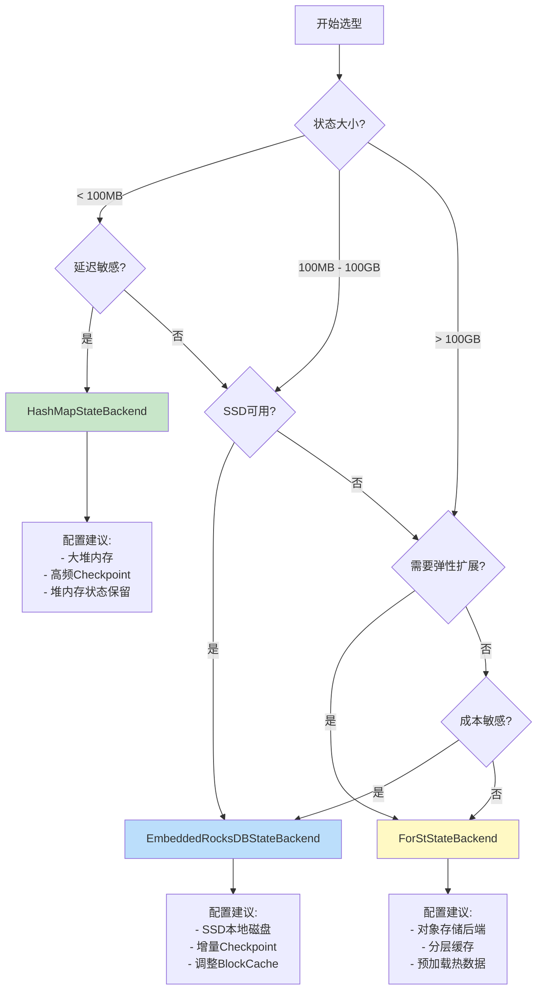

<!-- AI Translation Template - Replace <!-- TRANSLATE --> markers with actual translation -->

<!-- TRANSLATE: # Flink State Backends 深度对比与选型指南 -->

<!-- TRANSLATE: > **所属阶段**: Flink/ 工程实践 | **前置依赖**: [Flink/02-core-mechanisms/checkpoint-mechanism-deep-dive.md](02-core/checkpoint-mechanism-deep-dive.md), [Flink/3.9-state-backends-deep-comparison.md](./3.9-state-backends-deep-comparison.md) | **形式化等级**: L3-L4 -->
<!-- TRANSLATE: > **版本**: 2026.04 | **适用版本**: Flink 1.16+ - 2.5+ | **更新说明**: 新增 ForStStateBackend (Flink 2.0+) -->


<!-- TRANSLATE: ## 2. 属性推导 (Properties) -->

<!-- TRANSLATE: ### Lemma-F-SB-01: 内存状态容量约束 -->

<!-- TRANSLATE: **引理**: HashMapStateBackend 的最大状态容量受限于： -->

$$
<!-- TRANSLATE: MaxStateSize_{HashMap} = HeapSize \times 0.7 - NetworkBuffer - ManagedMemory - JVMOverhead -->
$$

<!-- TRANSLATE: **典型配置下的最大状态**: -->

<!-- TRANSLATE: | TM 堆内存 | Network Buffers | Managed Memory | 可用状态空间 | -->
<!-- TRANSLATE: |----------|-----------------|----------------|-------------| -->
<!-- TRANSLATE: | 4 GB | 400 MB (10%) | 1.6 GB (40%) | ~1 GB | -->
<!-- TRANSLATE: | 8 GB | 800 MB (10%) | 3.2 GB (40%) | ~2.4 GB | -->
<!-- TRANSLATE: | 16 GB | 1.6 GB (10%) | 6.4 GB (40%) | ~5.6 GB | -->
<!-- TRANSLATE: | 32 GB | 3.2 GB (10%) | 12.8 GB (40%) | ~12 GB | -->

<!-- TRANSLATE: ### Lemma-F-SB-02: RocksDB 访问延迟分解 -->

<!-- TRANSLATE: **引理**: EmbeddedRocksDBStateBackend 的状态访问延迟为： -->

$$
<!-- TRANSLATE: L_{access} = L_{memtable} + L_{cache} + L_{disk} + L_{deserialize} -->
$$

<!-- TRANSLATE: **各分量期望值**: -->

<!-- TRANSLATE: | 存储层级 | 命中条件 | 延迟范围 | 典型占比 | -->
<!-- TRANSLATE: |---------|---------|---------|---------| -->
<!-- TRANSLATE: | MemTable | Key 在活跃/不可变 MemTable | 1-5 μs | 20% | -->
<!-- TRANSLATE: | Block Cache | Key 在缓存块中 | 5-20 μs | 40% | -->
<!-- TRANSLATE: | L0 SST | Key 在 L0 层 | 50-200 μs | 20% | -->
<!-- TRANSLATE: | L1+ SST | Key 在底层 | 0.5-5 ms | 20% | -->

<!-- TRANSLATE: ### Lemma-F-SB-03: Checkpoint 时间模型 -->

<!-- TRANSLATE: **引理**: Checkpoint 完成时间与状态大小、后端类型的关系： -->

$$
<!-- TRANSLATE: T_{checkpoint} = T_{sync} + T_{async} -->
$$

<!-- TRANSLATE: **各后端特性**: -->

| 后端 | $T_{sync}$ | $T_{async}$ | 总时间特性 |
<!-- TRANSLATE: |------|-----------|------------|-----------| -->
| HashMap | $O(|State|)$ 序列化 | $O(|State|)$ 上传 | 随状态线性增长 |
| RocksDB | $O(1)$ 快照点 | $O(|\Delta|)$ 增量上传 | 与变更量相关 |
| ForSt | $O(1)$ delta 计算 | $O(|\Delta_{blocks}|)$ | 最小化上传 |

<!-- TRANSLATE: ### Prop-F-SB-01: 状态大小与恢复时间关系 -->

<!-- TRANSLATE: **命题**: 恢复时间与状态大小、后端类型的关系： -->

$$
<!-- TRANSLATE: T_{recovery} = T_{download} + T_{replay} + T_{rebuild} -->
$$

| 后端 | $T_{download}$ | $T_{replay}$ | $T_{rebuild}$ |
<!-- TRANSLATE: |------|---------------|-------------|---------------| -->
<!-- TRANSLATE: | HashMap | Full State | Small | 无 (内存即恢复) | -->
<!-- TRANSLATE: | RocksDB | Incremental SST | Medium | SST 加载 | -->
<!-- TRANSLATE: | ForSt | Parallel Delta | Small | Cache warmup | -->


<!-- TRANSLATE: ## 4. 论证过程 (Argumentation) -->

<!-- TRANSLATE: ### 场景适配性分析 -->

<!-- TRANSLATE: #### 场景 1: 实时风控系统 -->

<!-- TRANSLATE: **特征**: -->

<!-- TRANSLATE: - 状态大小: 中等 (规则库 + 会话状态) -->
<!-- TRANSLATE: - 访问模式: 高并发点查 -->
<!-- TRANSLATE: - 延迟要求: < 10ms p99 -->
<!-- TRANSLATE: - 恢复要求: 快速 (分钟级) -->

<!-- TRANSLATE: **推荐**: **HashMapStateBackend** -->

<!-- TRANSLATE: - 理由: 极低延迟，满足风控实时性要求 -->
<!-- TRANSLATE: - 配置: 充足堆内存 + 高频 Checkpoint -->

<!-- TRANSLATE: #### 场景 2: 用户行为分析 -->

<!-- TRANSLATE: **特征**: -->

<!-- TRANSLATE: - 状态大小: 大 (用户画像，TB级) -->
<!-- TRANSLATE: - 访问模式: 范围扫描 + 聚合 -->
<!-- TRANSLATE: - 延迟要求: 秒级可接受 -->
<!-- TRANSLATE: - 成本约束: 内存成本高 -->

<!-- TRANSLATE: **推荐**: **EmbeddedRocksDBStateBackend** -->

<!-- TRANSLATE: - 理由: 磁盘存储降低成本，增量 Checkpoint 减少 IO -->
<!-- TRANSLATE: - 配置: SSD 本地磁盘 + 增量 Checkpoint -->

<!-- TRANSLATE: #### 场景 3: 大规模实时推荐 -->

<!-- TRANSLATE: **特征**: -->

<!-- TRANSLATE: - 状态大小: 极大 (商品/用户向量) -->
<!-- TRANSLATE: - 访问模式: 混合 -->
<!-- TRANSLATE: - 弹性要求: 自动扩缩容 -->
<!-- TRANSLATE: - 多租户: 资源共享 -->

<!-- TRANSLATE: **推荐**: **ForStStateBackend** -->

<!-- TRANSLATE: - 理由: 存算分离支持弹性扩展，共享存储降低成本 -->
<!-- TRANSLATE: - 配置: 对象存储 (S3/OSS) + 分层缓存 -->


<!-- TRANSLATE: ## 6. 实例验证 (Examples) -->

<!-- TRANSLATE: ### 6.1 性能对比表 -->

<!-- TRANSLATE: #### 基准测试环境 -->

```yaml
# 测试集群配置
TaskManager: 3 nodes × 16 cores × 64GB RAM
CPU: Intel Xeon Gold 6248 @ 2.5GHz
Disk: NVMe SSD 2TB (RocksDB), RAM (HashMap)
Network: 25Gbps
Flink Version: 2.1.0
Workload: Window Aggregation (1 hour tumbling)
```

<!-- TRANSLATE: #### 吞吐量对比 -->

<!-- TRANSLATE: | State Backend | 10MB State | 1GB State | 100GB State | 1TB State | -->
<!-- TRANSLATE: |--------------|------------|-----------|-------------|-----------| -->
<!-- TRANSLATE: | **HashMap** | 500K evt/s | 450K evt/s | 200K evt/s | N/A (OOM) | -->
<!-- TRANSLATE: | **RocksDB** | 300K evt/s | 280K evt/s | 250K evt/s | 220K evt/s | -->
<!-- TRANSLATE: | **ForSt** | 350K evt/s | 330K evt/s | 300K evt/s | 280K evt/s | -->

<!-- TRANSLATE: #### 延迟对比 (p99) -->

<!-- TRANSLATE: | State Backend | 点查 (Point Lookup) | 范围扫描 (Range Scan) | 写入 (Write) | -->
<!-- TRANSLATE: |--------------|-------------------|---------------------|-------------| -->
<!-- TRANSLATE: | **HashMap** | 50 μs | 100 μs | 20 μs | -->
<!-- TRANSLATE: | **RocksDB** (MemTable) | 5 μs | 50 μs | 2 μs | -->
<!-- TRANSLATE: | **RocksDB** (Cache) | 15 μs | 200 μs | 2 μs | -->
<!-- TRANSLATE: | **RocksDB** (Disk) | 500 μs | 5 ms | 2 μs | -->
<!-- TRANSLATE: | **ForSt** (L1 Cache) | 10 μs | 100 μs | 5 μs | -->
<!-- TRANSLATE: | **ForSt** (L3 Remote) | 2 ms | 20 ms | 5 μs | -->

<!-- TRANSLATE: #### Checkpoint 性能对比 -->

<!-- TRANSLATE: | 状态大小 | HashMap (Full) | RocksDB (Incremental) | ForSt (Delta) | -->
<!-- TRANSLATE: |---------|---------------|----------------------|---------------| -->
<!-- TRANSLATE: | 1 GB | 30s | 5s | 3s | -->
<!-- TRANSLATE: | 10 GB | 300s | 20s | 10s | -->
<!-- TRANSLATE: | 100 GB | N/A | 60s | 30s | -->
<!-- TRANSLATE: | 1 TB | N/A | 180s | 60s | -->

<!-- TRANSLATE: *注: 假设 1% 状态变更率* -->

<!-- TRANSLATE: #### 恢复时间对比 -->

<!-- TRANSLATE: | 状态大小 | HashMap | RocksDB | ForSt | -->
<!-- TRANSLATE: |---------|---------|---------|-------| -->
<!-- TRANSLATE: | 1 GB | 20s | 30s | 15s | -->
<!-- TRANSLATE: | 10 GB | 120s | 90s | 30s | -->
<!-- TRANSLATE: | 100 GB | OOM | 300s | 60s | -->
<!-- TRANSLATE: | 1 TB | N/A | 1200s | 120s | -->

<!-- TRANSLATE: ### 6.2 选型决策树 -->



<!-- TRANSLATE: ### 6.3 配置示例 -->

<!-- TRANSLATE: #### HashMapStateBackend 配置 -->

```java
// Flink 配置
Configuration config = new Configuration();

// 设置 State Backend
config.set(StateBackendOptions.STATE_BACKEND, "hashmap");

// Checkpoint 配置 (必须配置 Checkpoint 存储)
config.set(CheckpointingOptions.CHECKPOINT_STORAGE, "filesystem");
config.set(CheckpointingOptions.CHECKPOINTS_DIRECTORY, "hdfs:///flink/checkpoints");

// 或者使用 S3
config.set(CheckpointingOptions.CHECKPOINTS_DIRECTORY, "s3://bucket/flink/checkpoints");
config.set(CheckpointingOptions.SAVEPOINT_DIRECTORY, "s3://bucket/flink/savepoints");

// Checkpoint 间隔
config.set(CheckpointingOptions.CHECKPOINTING_INTERVAL, Duration.ofSeconds(10));

// 堆内存状态保留 (Flink 2.0+)
config.set(StateBackendOptions.STATE_BACKEND_HEAP_MANAGED, true);

// 启用本地恢复 (加速重启)
config.set(CheckpointingOptions.LOCAL_RECOVERY, true);
```

<!-- TRANSLATE: #### EmbeddedRocksDBStateBackend 配置 -->

```java
// 基础配置
Configuration config = new Configuration();
config.set(StateBackendOptions.STATE_BACKEND, "rocksdb");
config.set(CheckpointingOptions.CHECKPOINT_STORAGE, "filesystem");
config.set(CheckpointingOptions.CHECKPOINTS_DIRECTORY, "hdfs:///flink/checkpoints");

// ========== RocksDB 核心配置 ==========

// MemTable 大小 (默认 64MB)
config.set(RocksDBOptions.MEMTABLE_SIZE, MemorySize.ofMebiBytes(128));

// 最大后台 Flush/Compaction 线程数
config.set(RocksDBOptions.MAX_BACKGROUND_THREADS, 4);

// Block Cache 大小 (默认 8MB，建议设为 TaskManager 内存的 30-40%)
config.set(RocksDBOptions.BLOCK_CACHE_SIZE, MemorySize.ofMebiBytes(512));

// Block 大小 (默认 4KB)
config.set(RocksDBOptions.BLOCK_SIZE, MemorySize.ofKibiBytes(16));

// ========== Checkpoint 优化 ==========

// 启用增量 Checkpoint
config.set(CheckpointingOptions.INCREMENTAL_CHECKPOINTS, true);

// Checkpoint 间隔
config.set(CheckpointingOptions.CHECKPOINTING_INTERVAL, Duration.ofMinutes(1));

// 最小暂停间隔 (避免 Checkpoint 过于频繁)
config.set(CheckpointingOptions.MIN_PAUSE_BETWEEN_CHECKPOINTS, Duration.ofSeconds(30));

// ========== 高级调优 ==========

// SST 文件大小 (默认 64MB)
config.set(RocksDBOptions.TARGET_FILE_SIZE_BASE, MemorySize.ofMebiBytes(64));

// L1 大小阈值
config.set(RocksDBOptions.MAX_SIZE_LEVEL_BASE, MemorySize.ofMebiBytes(256));

// 启用 Bloom Filter 优化点查
config.set(RocksDBOptions.USE_BLOOM_FILTER, true);

// Bloom Filter 位数/键
config.set(RocksDBOptions.BLOOM_FILTER_BITS_PER_KEY, 10.0);
```

<!-- TRANSLATE: #### ForStStateBackend 配置 (Flink 2.0+) -->

```java
// 基础配置
Configuration config = new Configuration();
config.set(StateBackendOptions.STATE_BACKEND, "forst");

// 远程存储配置 (S3)
config.set(ForStOptions.REMOTE_STORAGE_PATH, "s3://bucket/forst-state");
config.set(ForStOptions.REMOTE_STORAGE_CREDENTIALS_PROVIDER, "ENVIRONMENT");

// 或者使用 HDFS
config.set(ForStOptions.REMOTE_STORAGE_PATH, "hdfs:///forst-state");

// ========== 分层缓存配置 ==========

// L1 Cache (内存)
config.set(ForStOptions.L1_CACHE_SIZE, MemorySize.ofMebiBytes(1024));

// L2 Cache (本地 SSD)
config.set(ForStOptions.L2_CACHE_PATH, "/mnt/ssd/forst-cache");
config.set(ForStOptions.L2_CACHE_SIZE, MemorySize.ofGibiBytes(50));

// L3 (远程存储，无需配置，自动使用)

// ========== 网络优化 ==========

// gRPC 连接池大小
config.set(ForStOptions.REMOTE_IO_THREADS, 8);

// 预取窗口大小
config.set(ForStOptions.PREFETCH_WINDOW_SIZE, 10);

// 异步读取并行度
config.set(ForStOptions.ASYNC_READ_THREADS, 4);

// ========== Checkpoint 配置 ==========

// Delta Checkpoint 间隔
config.set(CheckpointingOptions.CHECKPOINTING_INTERVAL, Duration.ofMinutes(1));

// 启用并行恢复
config.set(ForStOptions.PARALLEL_RECOVERY, true);
config.set(ForStOptions.RECOVERY_THREADS, 16);
```

<!-- TRANSLATE: ### 6.4 调优指南 -->

<!-- TRANSLATE: #### RocksDB 性能调优检查清单 -->

```yaml
# 1. 内存分配检查
# 目标: Block Cache + MemTable + WriteBuffer < 0.5 × TM Managed Memory

# 计算公式:
# Total Memory = block-cache-size + (memtable-size × write-buffer-number)
# write-buffer-number = column-family-count × 2 (通常默认)

# 推荐配置 (32GB RAM TaskManager):
block-cache-size: 8GB              # 25% of TM memory
memtable-size: 128MB               # 默认 64MB
write-buffer-number: 4             # 根据 CF 数量调整
managed-memory-fraction: 0.4       # 40% 给 RocksDB

# 2. 磁盘 I/O 检查
# 确保使用 SSD，HDD 会导致性能下降 10-100x

# 3. Compaction 调优
# 监控 compaction-pending-bytes，持续高值表示需要更多 Compaction 线程

# 4. Bloom Filter 配置
# 点查多 → 启用 Bloom Filter
# 范围查多 → 禁用 Bloom Filter (节省内存)

# 5. 检查点优化
incremental-checkpoint: true       # 必须启用
min-pause-between-checkpoints: 30s # 避免过于频繁
timeout: 10min                     # 根据状态大小调整
```

<!-- TRANSLATE: #### 监控指标与调优 -->

```python
"""
RocksDB 关键监控指标及调优建议
"""

# ========== 关键指标 ==========

# 1. Block Cache 命中率
# 目标: > 95%
# 如果低 → 增加 block-cache-size

# 2. MemTable Flush 次数
# 监控: rocksdb_memtable_flush_duration
# 如果高 → 增加 memtable-size 或 flush 线程数

# 3. Compaction 压力
# 监控: rocksdb_compaction_pending_bytes
# 如果持续增长 → 增加 compaction 线程数

# 4. SST 文件数量
# 监控: rocksdb_num_sst_files
# 如果 L0 层 > 4 → 触发 Compaction 调优

# 5. Checkpoint 持续时间
# 目标: < 1分钟 (增量)
# 如果高 → 检查网络带宽、存储性能

# ========== 调优脚本示例 ==========

def analyze_rocksdb_metrics(metrics):
    """分析 RocksDB 指标并给出调优建议"""
    suggestions = []

    # Block Cache 分析
    cache_hit = metrics.get('rocksdb_block_cache_hit_rate', 0)
    if cache_hit < 0.90:
        suggestions.append({
            'issue': 'Block Cache 命中率低',
            'current': f'{cache_hit:.1%}',
            'target': '> 95%',
            'action': f'增加 block-cache-size 到当前 {1.5:.1f} 倍'
        })

    # MemTable 分析
    flush_duration = metrics.get('rocksdb_memtable_flush_duration', 0)
    if flush_duration > 10000:  # 10 seconds
        suggestions.append({
            'issue': 'MemTable Flush 慢',
            'current': f'{flush_duration}ms',
            'target': '< 5000ms',
            'action': '检查磁盘 I/O 性能或增加 memtable-size'
        })

    # Compaction 分析
    pending_bytes = metrics.get('rocksdb_compaction_pending_bytes', 0)
    if pending_bytes > 1024 * 1024 * 1024:  # 1GB
        suggestions.append({
            'issue': 'Compaction 积压',
            'current': f'{pending_bytes / 1e9:.2f}GB',
            'target': '< 100MB',
            'action': '增加 max-background-threads 或调整 LSM 层级'
        })

    return suggestions
```

<!-- TRANSLATE: ### 6.5 常见问题排查 -->

<!-- TRANSLATE: #### 问题 1: RocksDB OOM -->

```
症状: TaskManager 因 RocksDB 内存使用过多而被 Killed
原因: Block Cache + MemTable + WriteBuffer 超出限制
解决:
```

```java
// 限制 RocksDB 内存使用
config.set(RocksDBOptions.BLOCK_CACHE_SIZE, MemorySize.ofMebiBytes(256));
config.set(RocksDBOptions.MEMTABLE_SIZE, MemorySize.ofMebiBytes(32));

// 或者限制 Managed Memory
config.set(TaskManagerOptions.MANAGED_MEMORY_FRACTION, 0.3);
```

<!-- TRANSLATE: #### 问题 2: Checkpoint 超时 -->

```
症状: Checkpoint 持续超时失败
原因 1: 状态过大 + 全量 Checkpoint
解决: 启用增量 Checkpoint
```

```java
config.set(CheckpointingOptions.INCREMENTAL_CHECKPOINTS, true);
config.set(CheckpointingOptions.CHECKPOINTING_INTERVAL, Duration.ofMinutes(5));
```

```
原因 2: 网络带宽不足
解决: 限制并发 Checkpoint 数 + 增大超时
```

```java
config.set(CheckpointingOptions.MAX_CONCURRENT_CHECKPOINTS, 1);
config.set(CheckpointingOptions.CHECKPOINT_TIMEOUT, Duration.ofMinutes(30));
```

<!-- TRANSLATE: #### 问题 3: 状态恢复慢 -->

```
症状: 作业重启后恢复时间过长
原因: 全量状态下载
解决: 启用本地恢复 + 增量恢复
```

```java
// 本地恢复
config.set(CheckpointingOptions.LOCAL_RECOVERY, true);

// ForSt 并行恢复
config.set(ForStOptions.PARALLEL_RECOVERY, true);
config.set(ForStOptions.RECOVERY_THREADS, 16);
```


<!-- TRANSLATE: ## 8. 引用参考 (References) -->
