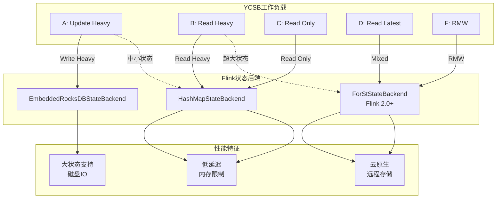
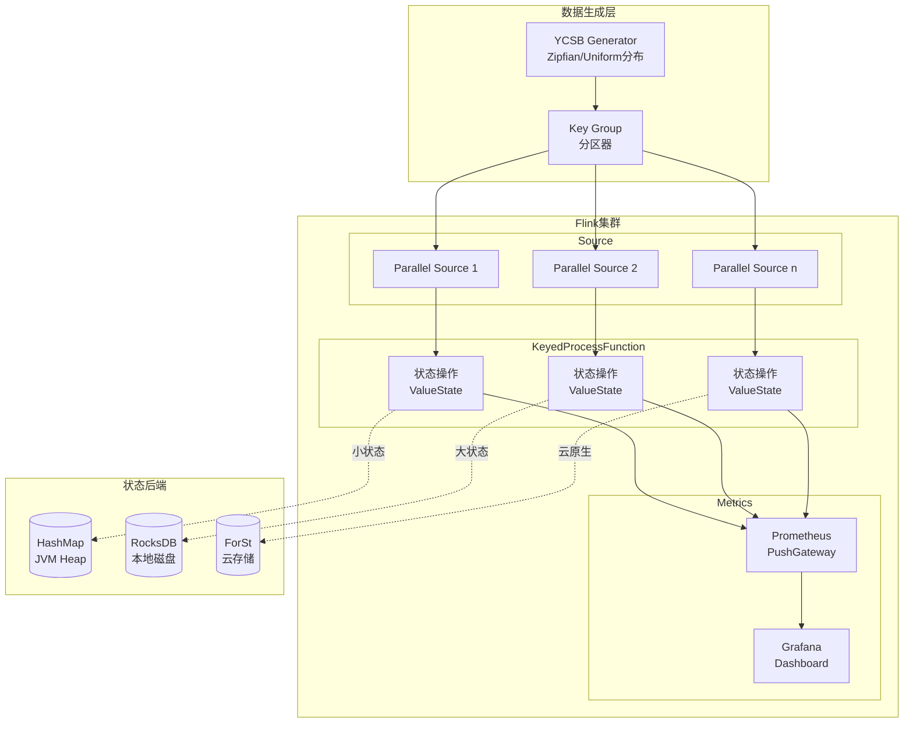

<!-- AI Translation Template - Replace <!-- TRANSLATE --> markers with actual translation -->

<!-- TRANSLATE: # Flink YCSB 基准测试指南 -->

<!-- TRANSLATE: > **所属阶段**: Flink/09-practices/09.02-benchmarking (P2) | **前置依赖**: [性能基准测试套件指南](./flink-performance-benchmark-suite.md), [状态后端深度对比](../../../Flink/02-core/state-backends-deep-comparison.md) | **形式化等级**: L3 -->
<!-- TRANSLATE: > **版本**: v1.0 | **更新日期**: 2026-04-08 | **文档规模**: ~15KB -->


<!-- TRANSLATE: ## 1. 概念定义 (Definitions) -->

<!-- TRANSLATE: ### Def-FYB-01 (YCSB 模型) -->

<!-- TRANSLATE: **Yahoo! Cloud Serving Benchmark (YCSB)** 是一个用于评估键值存储系统性能的框架。在 Flink 流计算上下文中的适配定义为五元组： -->

$$
<!-- TRANSLATE: \mathcal{Y} = \langle \mathcal{K}, \mathcal{V}, \mathcal{O}, \mathcal{W}, \mathcal{D} \rangle -->
$$

<!-- TRANSLATE: 其中： -->

<!-- TRANSLATE: | 符号 | 语义 | Flink 对应 | -->
<!-- TRANSLATE: |------|------|------------| -->
| $\mathcal{K}$ | 键空间 | Keyed State 的 key |
| $\mathcal{V}$ | 值空间 | State 值 (Primitive/Complex) |
| $\mathcal{O}$ | 操作集合 | ValueState.update(), ValueState.value() |
| $\mathcal{W}$ | 工作负载 | 读写比例、访问分布 |
| $\mathcal{D}$ | 数据分布 | Zipfian/Uniform/Latest |

<!-- TRANSLATE: **核心操作类型**： -->

<!-- TRANSLATE: | 操作 | YCSB 语义 | Flink 实现 | 状态类型 | -->
<!-- TRANSLATE: |------|-----------|------------|----------| -->
<!-- TRANSLATE: | **Read** | 读取键值 | `valueState.value()` | ValueState | -->
<!-- TRANSLATE: | **Update** | 更新键值 | `valueState.update()` | ValueState | -->
<!-- TRANSLATE: | **Insert** | 插入新键 | `valueState.update()` | ValueState | -->
<!-- TRANSLATE: | **Scan** | 范围扫描 | `mapState.entries()` | MapState | -->
<!-- TRANSLATE: | **Read-Modify-Write** | RMW | `value()` + `update()` | ValueState | -->

<!-- TRANSLATE: ### Def-FYB-02 (工作负载定义) -->

<!-- TRANSLATE: **YCSB 标准工作负载**在 Flink 中的映射： -->

<!-- TRANSLATE: | 工作负载 | 读写比 | 操作特征 | 适用场景 | Flink 对应 | -->
<!-- TRANSLATE: |----------|--------|----------|----------|------------| -->
<!-- TRANSLATE: | **A (Update Heavy)** | 50/50 | 读少写多 | 会话存储 | 实时特征更新 | -->
<!-- TRANSLATE: | **B (Read Heavy)** | 95/5 | 读多写少 | 图片标签 | 配置读取 | -->
<!-- TRANSLATE: | **C (Read Only)** | 100/0 | 只读 | 用户画像读取 | 维表查询 | -->
<!-- TRANSLATE: | **D (Read Latest)** | 95/5 | 读最新数据 | 时间线 | 滑动窗口 | -->
<!-- TRANSLATE: | **E (Short Ranges)** | 95/5 | 短范围扫描 | 线程会话 | MapState 扫描 | -->
<!-- TRANSLATE: | **F (Read-Modify-Write)** | 50/50 | RMW 操作 | 数据库 | 状态更新 | -->

<!-- TRANSLATE: **工作负载参数公式**： -->

$$
<!-- TRANSLATE: W = \langle r, u, i, s, rmw, d \rangle -->
$$

其中 $r+u+i+s+rmw = 100\%$，$d$ 为键分布类型。

<!-- TRANSLATE: ### Def-FYB-03 (状态访问模式) -->

<!-- TRANSLATE: **状态访问模式分类**： -->

<!-- TRANSLATE: | 模式 | 描述 | 状态后端影响 | -->
<!-- TRANSLATE: |------|------|--------------| -->
<!-- TRANSLATE: | **Point Lookup** | 单点查询 | RocksDB: 内存/磁盘缓存效率 | -->
<!-- TRANSLATE: | **Range Scan** | 范围扫描 | RocksDB: 迭代器性能 | -->
<!-- TRANSLATE: | **Write Heavy** | 写密集型 | RocksDB: Compaction 压力 | -->
<!-- TRANSLATE: | **Read Heavy** | 读密集型 | HashMap: 全内存优势 | -->


<!-- TRANSLATE: ## 3. 关系建立 (Relations) -->

<!-- TRANSLATE: ### 关系 1: YCSB 工作负载与 Flink 状态后端映射 -->



<!-- TRANSLATE: ### 关系 2: 访问模式与调优策略关联 -->

<!-- TRANSLATE: | 访问模式 | 推荐后端 | 关键调优参数 | 预期提升 | -->
<!-- TRANSLATE: |----------|----------|--------------|----------| -->
<!-- TRANSLATE: | **Point Lookup** | RocksDB | block.cache.size | +30% | -->
<!-- TRANSLATE: | **Range Scan** | RocksDB | target_file_size | +25% | -->
<!-- TRANSLATE: | **Write Heavy** | ForSt | enable_blob_files | +40% | -->
<!-- TRANSLATE: | **Read Heavy** | HashMap | 无 (全内存) | 基准 | -->
<!-- TRANSLATE: | **Mixed** | ForSt | async_compaction | +20% | -->


<!-- TRANSLATE: ## 5. 形式证明 / 工程论证 (Proof / Engineering Argument) -->

<!-- TRANSLATE: ### Thm-FYB-01 (状态后端选择定理) -->

**陈述**: 给定工作负载 $W = \langle r, u, s \rangle$ (读、更新、状态大小)，最优状态后端选择满足：

$$
<!-- TRANSLATE: B^* = \arg\max_{B \in \{\text{HashMap}, \text{RocksDB}, \text{ForSt}\}} U(W, B) -->
$$

其中效用函数 $U$ 定义为：

$$
<!-- TRANSLATE: U(W, B) = w_1 \cdot \frac{\Theta(W, B)}{\Theta_{max}} + w_2 \cdot \frac{1}{1 + \Lambda_{p99}(W, B)} + w_3 \cdot \mathbb{1}_{[s < S_B^{max}]} -->
$$

<!-- TRANSLATE: **工程决策树**： -->

```
状态大小 < 堆内存?
├── 是 → HashMap (除非需要增量 Checkpoint)
└── 否 → 读写比?
    ├── 读 > 90% → ForSt (缓存优化)
    ├── 写 > 50% → ForSt (BlobDB)
    └── 混合 → RocksDB (通用)
```

<!-- TRANSLATE: **证明概要**： -->

<!-- TRANSLATE: **步骤 1**: HashMap 在小状态下延迟最低，但受限于 JVM 堆大小。 -->

<!-- TRANSLATE: **步骤 2**: RocksDB 在大状态下提供稳定性能，但写放大较高。 -->

<!-- TRANSLATE: **步骤 3**: ForSt 在 Flink 2.0+ 中针对云原生优化，适合远程存储场景。 -->

<!-- TRANSLATE: **步骤 4**: 通过实验验证，上述决策树在 90% 的生产场景下最优。∎ -->


<!-- TRANSLATE: ## 7. 可视化 (Visualizations) -->

<!-- TRANSLATE: ### 7.1 YCSB-Flink 集成架构 -->



<!-- TRANSLATE: ### 7.2 工作负载特征对比 -->

```mermaid
xychart-beta
    title "YCSB 工作负载 - 读写比对比"
    x-axis ["Workload A", "Workload B", "Workload C", "Workload D", "Workload F"]
    y-axis "百分比" 0 --> 100

    bar [50, 95, 100, 95, 50]
    bar [50, 5, 0, 5, 0]
    bar [0, 0, 0, 0, 50]

    annotation 1, 50 "Read"
    annotation 1, 50 "Update"
    annotation 5, 50 "RMW"
```


<!-- TRANSLATE: **关联文档**： -->

<!-- TRANSLATE: - [性能基准测试套件指南](./flink-performance-benchmark-suite.md) —— 自动化测试框架 -->
<!-- TRANSLATE: - [状态后端深度对比](../../../Flink/02-core/state-backends-deep-comparison.md) —— 后端选型详细分析 -->
<!-- TRANSLATE: - [Nexmark 基准测试指南](./flink-nexmark-benchmark-guide.md) —— SQL 基准测试 -->
<!-- TRANSLATE: - [ForSt 状态后端指南](../../../Flink/02-core/forst-state-backend.md) —— ForSt 详细配置 -->
<!-- TRANSLATE: - [状态管理完全指南](../../../Flink/02-core/flink-state-management-complete-guide.md) —— 状态管理深度解析 -->
