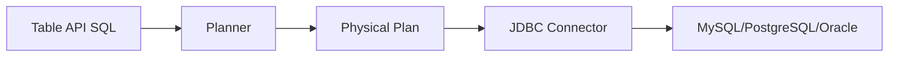
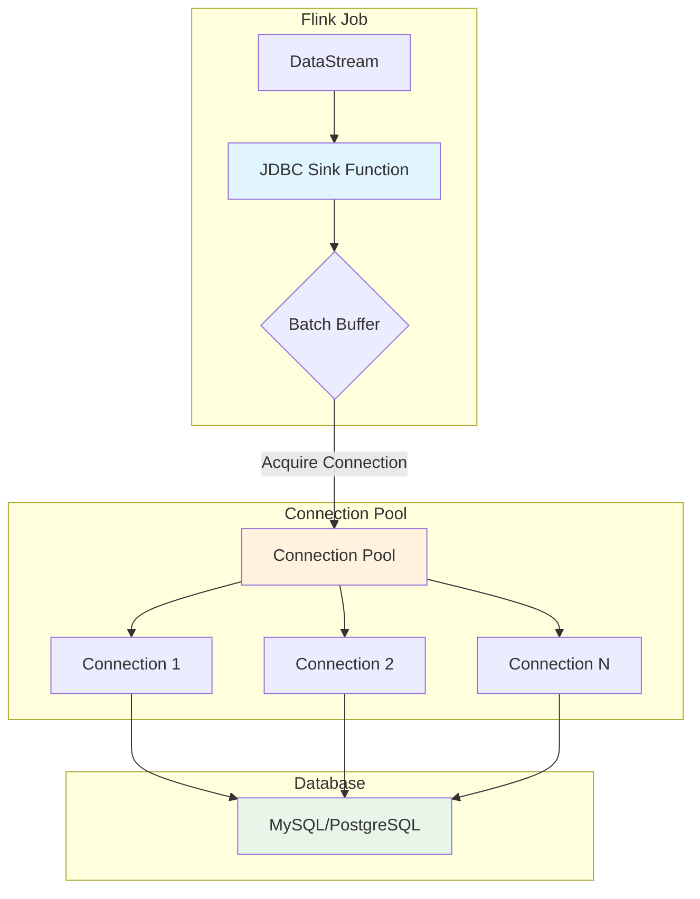
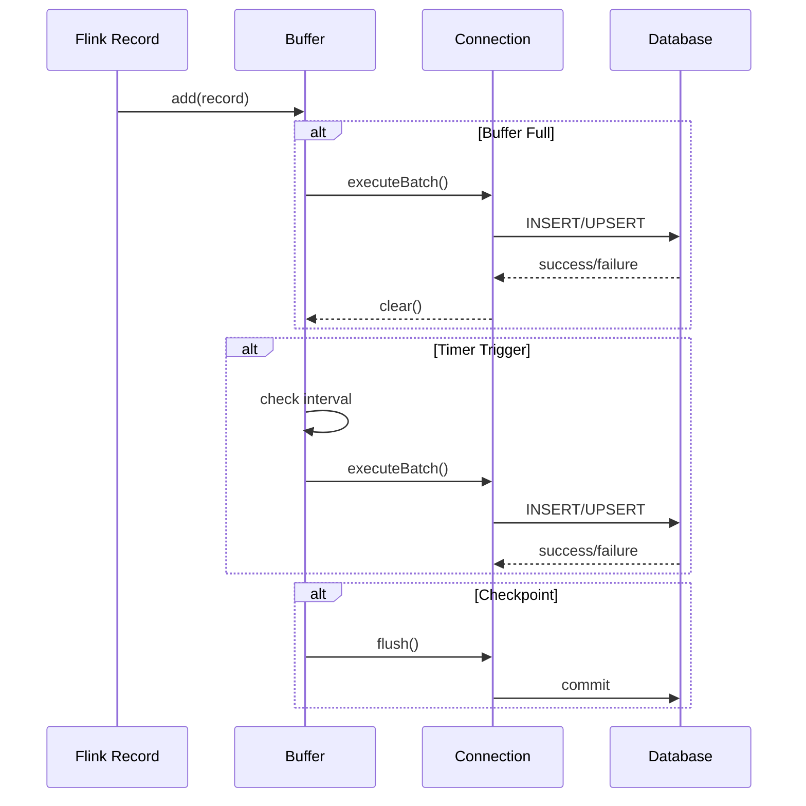
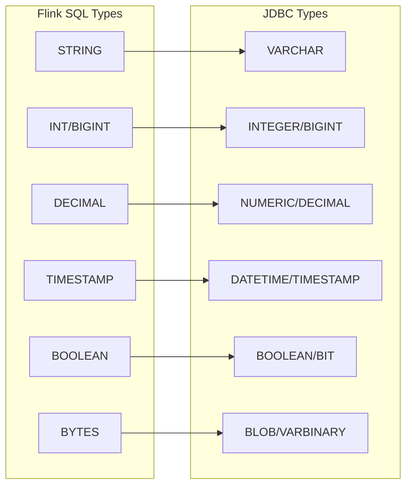

# JDBC Connector Detailed Guide

> Stage: Flink | Prerequisites: [data-types-complete-reference.md](./data-types-complete-reference.md) | Formalization Level: L4

---

## 1. Concept Definitions (Definitions)

### Def-F-JDBC-01: JDBC Source Definition

**Definition**: JDBC Source is a connector that reads data from relational databases via the JDBC protocol:

$$
\text{JDBCSource} = \langle C, Q, S, P, F \rangle
$$

Where:

- $C$: Database connection configuration $\langle url, user, pass, driver \rangle$
- $Q$: Query statement $\langle SELECT \dots FROM \dots WHERE \dots \rangle$
- $S$: Shard strategy $\{PKRange, PartitionColumn, None\}$
- $P$: Parallelism configuration $\langle min, max \rangle$
- $F$: Fetch Size

**Read Modes**:

| Mode | Description | Applicable Scenario |
|------|-------------|---------------------|
| **Batch** | One-time read of complete result set | Offline analysis, full sync |
| **Incremental CDC** | Stream read based on change capture | Real-time sync |
| **Partitioned Parallel** | Parallel read by primary key range | Large table read |

### Def-F-JDBC-02: JDBC Sink Definition

**Definition**: JDBC Sink is a connector that writes stream data to relational databases:

$$
\text{JDBCSink} = \langle C, T, W, B, E \rangle
$$

Where:

- $C$: Database connection configuration
- $T$: Target table
- $W$: Write mode $\{INSERT, REPLACE, UPDATE, UPSERT\}$
- $B$: Batch configuration $\langle batchSize, batchInterval, maxRetries \rangle$
- $E$: Exactly-Once configuration (optional XA transaction)

**Write Mode Semantics**:

| Mode | SQL Semantics | Idempotency |
|------|---------------|-------------|
| INSERT | `INSERT INTO` | ❌ No |
| REPLACE | `REPLACE INTO` / `MERGE` | ✅ Yes (with primary key) |
| UPDATE | `UPDATE ... WHERE` | ✅ Yes |
| UPSERT | `INSERT ... ON CONFLICT UPDATE` | ✅ Yes |

### Def-F-JDBC-03: Connection Pool Model

**Definition**: The connection pool maintained internally by the JDBC connector:

$$
\text{ConnectionPool} = \langle N_{min}, N_{max}, T_{idle}, T_{wait}, Q \rangle
$$

Where:

- $N_{min}$: Minimum connection count
- $N_{max}$: Maximum connection count
- $T_{idle}$: Connection idle timeout
- $T_{wait}$: Connection acquisition wait timeout
- $Q$: Connection queue

---

## 2. Property Derivation (Properties)

### Lemma-F-JDBC-01: Batch Write Throughput Boundary

**Lemma**: The maximum throughput of JDBC Sink is constrained by the following factors:

$$
T_{max} = \min\left( \frac{B_{size}}{B_{interval}}, \frac{C_{pool} \times R_{db}}{L_{network}} \right)
$$

Where:

- $B_{size}$: Batch size
- $B_{interval}$: Batch interval
- $C_{pool}$: Connection pool size
- $R_{db}$: Database write rate
- $L_{network}$: Network latency

### Lemma-F-JDBC-02: Connection Pool Deadlock-Free

**Lemma**: When $N_{max} \geq P_{parallelism}$, the connection pool will not deadlock.

**Proof**:

1. Each parallel subtask needs at most one connection
2. Maximum concurrent demand = Parallelism $P$
3. If $N_{max} \geq P$, there is always an available connection
4. No circular wait, satisfying deadlock avoidance conditions

### Prop-F-JDBC-01: Idempotent Write Conditions

**Proposition**: Under the following conditions, JDBC Sink can achieve Exactly-Once semantics:

1. **Primary Key Exists**: Target table has a unique primary key constraint
2. **Idempotent Statement**: Uses UPSERT/REPLACE semantics
3. **Transaction Support**: Database supports XA transactions (optional)

---

## 3. Relationship Establishment (Relations)

### 3.1 Relationship with DataStream API

```
DataStream API
    ↓
JDBC Sink Function
    ↓
JDBC Driver
    ↓
Database Server
```

### 3.2 Relationship with Table API



### 3.3 Database Dialect Mapping

| Feature | MySQL | PostgreSQL | Oracle | SQL Server |
|---------|-------|------------|--------|------------|
| UPSERT | `INSERT ... ON DUPLICATE KEY UPDATE` | `INSERT ... ON CONFLICT UPDATE` | `MERGE INTO` | `MERGE INTO` |
| Pagination | `LIMIT n OFFSET m` | `LIMIT n OFFSET m` | `ROWNUM` / `OFFSET FETCH` | `OFFSET m ROWS FETCH NEXT n ROWS ONLY` |
| Type Mapping | `VARCHAR` | `VARCHAR` | `VARCHAR2` | `VARCHAR` |

---

## 4. Argumentation Process (Argumentation)

### 4.1 Partitioned Read Strategy Selection

**Strategy Comparison**:

| Strategy | Pros | Cons | Applicable Scenario |
|----------|------|------|---------------------|
| Primary Key Range | Even distribution, no data skew | Requires numeric/sortable primary key | Large table full read |
| Partition Column | Leverages database partitioning | Requires predefined partition column | Already-partitioned table |
| No Partition | Simple, no extra config | Single-threaded, performance limited | Small table read |

### 4.2 XA Transaction vs Idempotent Write

| Characteristic | XA Transaction | Idempotent Write |
|----------------|----------------|------------------|
| Consistency | Strong consistency | Eventual consistency |
| Performance | Lower (two-phase commit) | Higher |
| Database Requirement | Must support XA | Must support UPSERT |
| Complexity | High | Low |
| Recommended Scenario | Financial transactions | Log sync |

---

## 5. Formal Proof / Engineering Argument (Proof / Engineering Argument)

### Thm-F-JDBC-01: Exactly-Once Correctness

**Theorem**: With XA transactions enabled and the database supporting XA, JDBC Sink provides Exactly-Once semantics.

**Proof Sketch**:

1. **Pre-commit**: At Checkpoint, Sink executes XA prepare
2. **Coordination**: JobManager collects prepare acknowledgments from all operators
3. **Commit**: When Checkpoint completes, coordinate commit of all XA transactions
4. **Rollback**: When Checkpoint fails, rollback all prepared transactions

### Thm-F-JDBC-02: Batch Write Atomicity

**Theorem**: Write operations within a single batch either all succeed or all fail.

**Proof**:

- Batch operations are encapsulated in a single database transaction
- Database transactions satisfy ACID atomicity
- Therefore batch operations are atomic

---

## 6. Example Validation (Examples)

### 6.1 Maven Dependencies

```xml
<dependency>
    <groupId>org.apache.flink</groupId>
    <artifactId>flink-connector-jdbc</artifactId>
    <version>3.1.2-1.17</version>
</dependency>

<!-- MySQL Driver -->
<dependency>
    <groupId>mysql</groupId>
    <artifactId>mysql-connector-java</artifactId>
    <version>8.0.33</version>
</dependency>

<!-- PostgreSQL Driver -->
<dependency>
    <groupId>org.postgresql</groupId>
    <artifactId>postgresql</artifactId>
    <version>42.6.0</version>
</dependency>
```

### 6.2 DataStream API Example

```java
import org.apache.flink.connector.jdbc.JdbcConnectionOptions;
import org.apache.flink.connector.jdbc.JdbcExecutionOptions;
import org.apache.flink.connector.jdbc.JdbcSink;
import org.apache.flink.connector.jdbc.JdbcStatementBuilder;

import org.apache.flink.streaming.api.datastream.DataStream;


// JDBC Sink configuration
DataStream<Order> orderStream = ...;

orderStream.addSink(JdbcSink.sink(
    "INSERT INTO orders (id, user_id, amount, create_time) VALUES (?, ?, ?, ?) " +
    "ON CONFLICT (id) DO UPDATE SET amount = EXCLUDED.amount",
    (JdbcStatementBuilder<Order>) (ps, order) -> {
        ps.setLong(1, order.getId());
        ps.setLong(2, order.getUserId());
        ps.setBigDecimal(3, order.getAmount());
        ps.setTimestamp(4, Timestamp.from(order.getCreateTime()));
    },
    JdbcExecutionOptions.builder()
        .withBatchSize(1000)
        .withBatchIntervalMs(200)
        .withMaxRetries(3)
        .build(),
    new JdbcConnectionOptions.JdbcConnectionOptionsBuilder()
        .withUrl("jdbc:postgresql://localhost:5432/mydb")
        .withDriverName("org.postgresql.Driver")
        .withUsername("user")
        .withPassword("password")
        .build()
));
```

### 6.3 Table API / SQL Example

```sql
-- Create JDBC table
CREATE TABLE products (
    id BIGINT PRIMARY KEY,
    name STRING,
    price DECIMAL(10, 2),
    update_time TIMESTAMP
) WITH (
    'connector' = 'jdbc',
    'url' = 'jdbc:mysql://localhost:3306/mydb',
    'table-name' = 'products',
    'username' = 'user',
    'password' = 'password',
    'driver' = 'com.mysql.cj.jdbc.Driver',
    -- Batch configuration
    'sink.buffer-flush.max-rows' = '1000',
    'sink.buffer-flush.interval' = '1s',
    'sink.max-retries' = '3'
);

-- Read from Kafka and write to JDBC
INSERT INTO products
SELECT
    id,
    name,
    price,
    CURRENT_TIMESTAMP AS update_time
FROM kafka_source;
```

### 6.4 JDBC Source Example

```java
import org.apache.flink.connector.jdbc.JdbcInputFormat;
import org.apache.flink.api.common.typeinfo.BasicTypeInfo;
import org.apache.flink.api.java.DataSet;
import org.apache.flink.api.java.ExecutionEnvironment;

DataSet<Row> dbData = env.createInput(
    JdbcInputFormat.buildJdbcInputFormat()
        .setDrivername("com.mysql.cj.jdbc.Driver")
        .setDBUrl("jdbc:mysql://localhost/mydb")
        .setUsername("user")
        .setPassword("password")
        .setQuery("SELECT id, name, price FROM products WHERE price > ?")
        .setRowTypeInfo(new RowTypeInfo(
            BasicTypeInfo.LONG_TYPE_INFO,
            BasicTypeInfo.STRING_TYPE_INFO,
            BasicTypeInfo.BIG_DEC_TYPE_INFO
        ))
        .setParametersProvider(new Serializable[][]{
            new Serializable[]{new BigDecimal("100.00")}
        })
        .finish()
);
```

---

## 7. Visualizations (Visualizations)

### 7.1 JDBC Connector Architecture Diagram



### 7.2 Batch Write Flow



### 7.3 Data Type Mapping Matrix



---

## 8. References (References)
