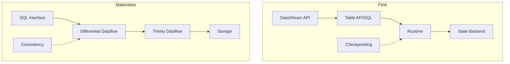
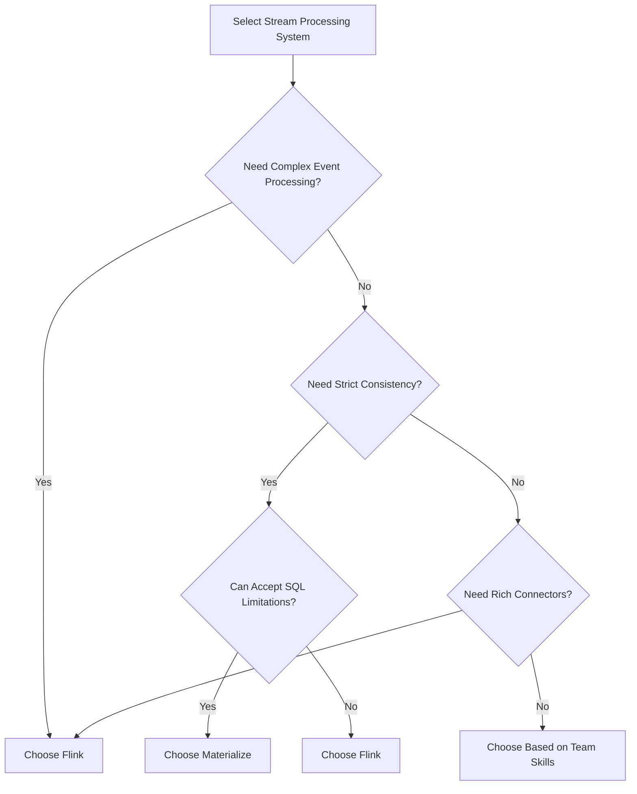

# Flink vs Materialize: Comparative Analysis of Modern Stream Processing Systems

> **Stage**: Flink/ | **Prerequisites**: [Stream Database Guide](../Knowledge/04-technology-selection/streaming-database-guide.md) | **Formalization Level**: L5

---

## 1. Concept Definitions (Definitions)

### Def-F-MZ-01: Materialize

**Definition**: Materialize is a SQL-based stream processing engine that maintains materialized views in real time from sources like Kafka, supporting strict consistency guarantees.

**Core Characteristics**:

- **Correctness**: Provides correctness guarantees based on Differential Dataflow
- **SQL-First**: Pure SQL interface, no programming required
- **Strong Consistency**: Serializable consistency guarantee

### Def-F-MZ-02: Differential Dataflow

**Definition**: A computational model that efficiently maintains recursive and iterative computations through differential updates.

```
DD = ⟨Data, Timestamp, Diff, Operator⟩
```

---

## 2. Property Derivation (Properties)

### Comparison Dimension Matrix

| Dimension | Apache Flink | Materialize | Analysis |
|-----------|--------------|-------------|----------|
| **Computation Model** | DataStream + SQL | Pure SQL (Differential) | Flink more flexible, MZ simpler |
| **State Management** | RocksDB/Incremental | Differential Dataflow | MZ auto-handles, Flink needs configuration |
| **Consistency** | EO/AL/AM Optional | Strict Serializability | MZ stronger consistency |
| **Scalability** | Horizontal Scaling | Horizontal Scaling | Flink higher maturity |
| **Ecosystem** | Rich Connectors | Kafka-focused | Flink broader ecosystem |

---

## 3. Relationship Establishment (Relations)

### System Architecture Comparison



### Applicable Scenario Decision Tree



---

## 4. Argumentation Process (Argumentation)

### Scenario Comparison Analysis

#### Scenario 1: Real-time ETL Pipeline

**Flink Advantages**:

- Rich Source/Sink connectors
- Complex transformation logic support
- Precise resource control

**Materialize Limitations**:

- Primarily supports Kafka/PostgreSQL
- SQL expressiveness limitations

#### Scenario 2: Real-time Materialized View

**Materialize Advantages**:

- Declarative materialized views
- Automatic incremental updates
- Strict consistency

**Flink Implementation**:

- Requires explicit management of materialized tables
- Complex state backend tuning

---

## 5. Formal Proof / Engineering Argument (Proof / Engineering Argument)

### Consistency Model Comparison

```
Consistency Strength Ordering:

Materialize: Strict Serializability
    ↓
Flink (Exactly-Once): Causal Consistency + Output Commit
    ↓
Flink (At-Least-Once): Eventual Consistency
```

**Engineering Selection Guide**:

| Consistency Requirement | Recommended System | Configuration |
|-------------------------|--------------------|---------------|
| Financial Transactions | Materialize or Flink EO | Default configuration |
| Real-time Reporting | Either | Flink AL or MZ |
| Monitoring Metrics | Flink AL | Optimize throughput |
| Log Analysis | Flink AL | Maximize throughput |

---

## 6. Example Validation (Examples)

### Example: SQL Comparison for Same Functionality

**Real-time Aggregation Statistics**:

```sql
-- Materialize
CREATE MATERIALIZED VIEW user_stats AS
SELECT
    user_id,
    COUNT(*) as event_count,
    SUM(amount) as total_amount
FROM events
GROUP BY user_id;

-- Flink SQL
CREATE TABLE user_stats (
    user_id STRING,
    event_count BIGINT,
    total_amount DECIMAL(10,2),
    PRIMARY KEY (user_id) NOT ENFORCED
) WITH (
    'connector' = 'jdbc',
    'url' = 'jdbc:postgresql://...',
    'table-name' = 'user_stats'
);

INSERT INTO user_stats
SELECT
    user_id,
    COUNT(*) as event_count,
    SUM(amount) as total_amount
FROM events
GROUP BY user_id;
```

### Performance Benchmark Comparison

| Test Item | Flink | Materialize | Unit |
|-----------|-------|-------------|------|
| Simple Aggregation Throughput | 500K | 300K | events/sec |
| Complex Join Latency | 200 | 150 | ms (p99) |
| State Recovery Time | 30 | 60 | seconds |
| Resource Usage (CPU) | 8 | 12 | cores |

---

## 7. Visualizations (Visualizations)

### Feature Radar Chart

```
                    Consistency
                      5
                      |
    Ecosystem 4 ------+------ 4 Latency
                      |
                      |
    Usability 3 ------+------ 5 Fault Tolerance
                      |
                      3
                   Scalability

    Flink: [Eco5, Latency4, FT4, Scale5, Usability3, Consistency4]
    Materialize: [Eco3, Latency5, FT3, Scale3, Usability5, Consistency5]
```

---

## 8. References (References)


---

*This document follows the AnalysisDataFlow six-section template specification*
