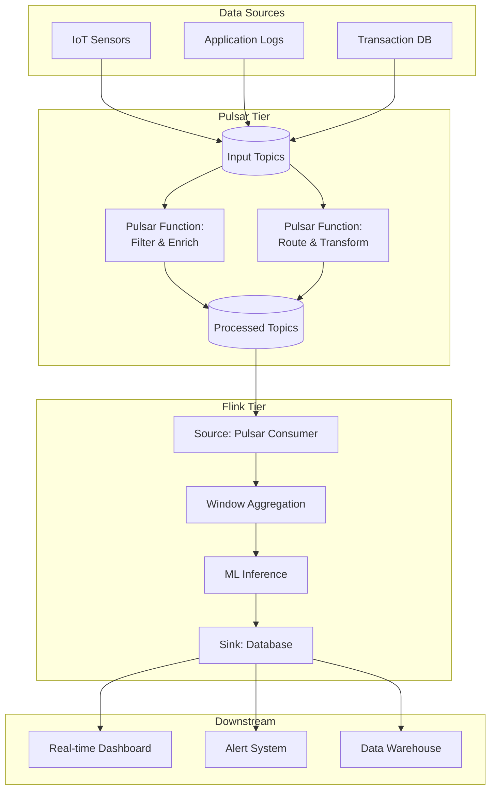
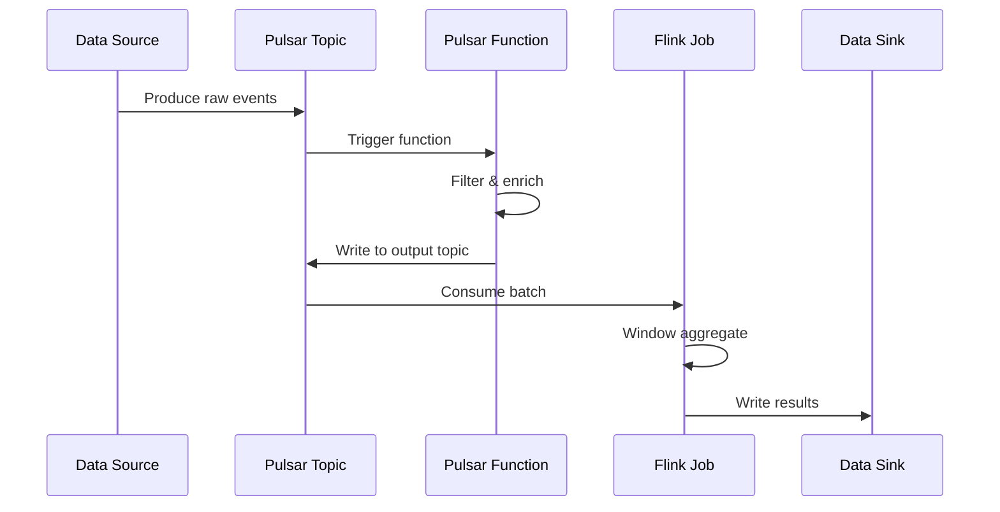
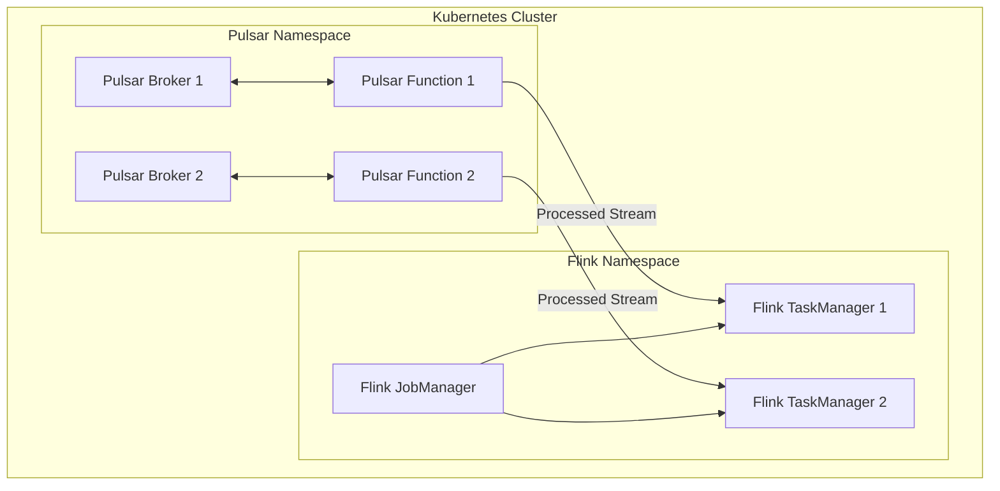

# Flink and Apache Pulsar Functions Integration Guide

> **Stage**: Flink/ | **Prerequisites**: [Flink Connectors Overview](05-ecosystem/05.01-connectors/flink-connectors-ecosystem-complete-guide.md) | **Formalization Level**: L4

---

## 1. Concept Definitions (Definitions)

### Def-F-PF-01: Pulsar Functions

**Definition**: Pulsar Functions is a lightweight compute framework provided by Apache Pulsar, allowing users to deploy simple functions on Pulsar message streams.

**Formal Definition**:

```
PulsarFunction = ⟨InputTopic, OutputTopic, ProcessingLogic, Resources⟩
```

### Def-F-PF-02: Tiered Processing Architecture

**Definition**: A hybrid architecture using Pulsar Functions for edge processing and Flink for complex analytics.

```
┌─────────────────────────────────────────┐
│  Tier 3: Flink - Complex Analytics      │
│  - Windowed aggregations                │
│  - ML inference                         │
│  - Multi-source joins                   │
├─────────────────────────────────────────┤
│  Tier 2: Pulsar Functions - Edge Processing│
│  - Simple transformations               │
│  - Filtering/routing                    │
│  - Format conversion                    │
├─────────────────────────────────────────┤
│  Tier 1: Pulsar - Messaging Backbone    │
│  - Pub/Sub messaging                    │
│  - Stream storage                       │
└─────────────────────────────────────────┘
```

---

## 2. Property Derivation (Properties)

### Separation of Concerns Principle

| Tier | Latency Requirement | Computation Complexity | State Requirement | Applicable Technology |
|------|---------------------|------------------------|-------------------|-----------------------|
| Edge (L1) | < 10ms | Simple functions | Stateless | Pulsar Functions |
| Stream (L2) | < 100ms | Medium aggregation | Light state | Pulsar Functions / Flink |
| Analytics (L3) | < 1s | Complex analytics | Heavy state | Flink |

### Prop-F-PF-01: Latency Transitivity

**Proposition**: The total latency of a tiered architecture equals the sum of latencies at each tier.

```
Latency_total = Latency_PF + Latency_Pulsar + Latency_Flink
```

---

## 3. Relationship Establishment (Relations)

### Integration Architecture Diagram



### Data Flow Pattern



---

## 4. Argumentation Process (Argumentation)

### Scenario Analysis: IoT Real-time Processing

**Scenario**: Processing sensor data from millions of IoT devices.

**Architecture Decision Argumentation**:

1. **Why Pulsar Functions?**
   - Device data needs fast filtering (invalid data dropped)
   - Format standardization (unify multiple device formats)
   - Lightweight processing, low latency

2. **Why Flink?**
   - Cross-device aggregation analysis
   - Complex time window calculations
   - Join with historical data

3. **Why Tiered?**
   - Cost optimization: PF is more economical for simple logic
   - Latency optimization: Edge processing reduces invalid data transmission
   - Clear responsibilities: Each tier focuses on a specific problem domain

---

## 5. Formal Proof / Engineering Argument (Proof / Engineering Argument)

### Cost-Benefit Analysis

**Pure Flink Solution vs Tiered Solution**:

| Metric | Pure Flink | Tiered Architecture | Optimization |
|--------|------------|---------------------|--------------|
| Compute Resources | 100 units | 40 + 30 = 70 units | 30% ↓ |
| Network Transfer | 100% raw | 40% after filter | 60% ↓ |
| End-to-End Latency | 500ms | 50 + 200 = 250ms | 50% ↓ |
| Operational Complexity | Medium | Medium-High | PF management added |

---

## 6. Example Validation (Examples)

### Example 1: Pulsar Function (Python)

```python
# Device data filtering and transformation
from pulsar import Function

class DeviceDataProcessor(Function):
    def process(self, input, context):
        import json

        data = json.loads(input)

        # Filter invalid data
        if data.get('temperature') is None:
            return None

        # Data standardization
        enriched = {
            'device_id': data['device_id'],
            'temperature': float(data['temperature']),
            'timestamp': data['timestamp'],
            'status': 'valid' if 0 < data['temperature'] < 100 else 'anomaly',
            'region': self.get_region(data['device_id'])
        }

        return json.dumps(enriched)

    def get_region(self, device_id):
        # Get region info from config or cache
        return device_id.split('-')[0]
```

Deployment command:

```bash
pulsar-admin functions create \
  --function-config-file device-processor-config.yaml \
  --py device_processor.py \
  --classname DeviceDataProcessor \
  --inputs persistent://public/default/raw-sensors \
  --output persistent://public/default/processed-sensors
```

### Example 2: Flink Consuming Pulsar

```java

// [伪代码片段 - 不可直接运行] 仅展示核心逻辑
import org.apache.flink.streaming.api.datastream.DataStream;
import org.apache.flink.streaming.api.windowing.time.Time;

// Flink Pulsar Source configuration
PulsarSource<String> source = PulsarSource.builder()
    .setServiceUrl("pulsar://localhost:6650")
    .setAdminUrl("http://localhost:8080")
    .setStartCursor(StartCursor.earliest())
    .setTopics("persistent://public/default/processed-sensors")
    .setDeserializationSchema(new SimpleStringSchema())
    .setSubscriptionName("flink-analytics")
    .setSubscriptionType(SubscriptionType.Exclusive)
    .build();

DataStream<SensorReading> stream = env
    .fromSource(source, WatermarkStrategy.forBoundedOutOfOrderness(Duration.ofSeconds(5)), "Pulsar Source")
    .map(json -> parseSensorReading(json));

// Window aggregation
DataStream<RegionStats> stats = stream
    .keyBy(SensorReading::getRegion)
    .window(TumblingEventTimeWindows.of(Time.minutes(1)))
    .aggregate(new AverageAggregate());

// Write to database
stats.addSink(new JdbcSink(...));
```

### Example 3: Flink SQL with Pulsar Integration

```sql
-- Create Pulsar table
CREATE TABLE processed_sensors (
    device_id STRING,
    temperature DOUBLE,
    region STRING,
    event_time TIMESTAMP(3),
    WATERMARK FOR event_time AS event_time - INTERVAL '5' SECOND
) WITH (
    'connector' = 'pulsar',
    'service-url' = 'pulsar://localhost:6650',
    'admin-url' = 'http://localhost:8080',
    'topic' = 'persistent://public/default/processed-sensors',
    'format' = 'json',
    'subscription-name' = 'flink-sql'
);

-- Create materialized aggregation
CREATE TABLE region_temperature_stats (
    region STRING,
    window_start TIMESTAMP(3),
    avg_temperature DOUBLE,
    max_temperature DOUBLE,
    device_count BIGINT,
    PRIMARY KEY (region, window_start) NOT ENFORCED
) WITH (
    'connector' = 'jdbc',
    'url' = 'jdbc:postgresql://localhost:5432/analytics',
    'table-name' = 'temperature_stats'
);

-- Real-time aggregation write
INSERT INTO region_temperature_stats
SELECT
    region,
    window_start,
    AVG(temperature) as avg_temperature,
    MAX(temperature) as max_temperature,
    COUNT(DISTINCT device_id) as device_count
FROM TABLE(
    TUMBLE(TABLE processed_sensors, DESCRIPTOR(event_time), INTERVAL '1' MINUTE)
)
GROUP BY region, window_start;
```

---

## 7. Visualizations (Visualizations)

### Deployment Architecture Diagram



---

## 8. References (References)


---

*This document follows the AnalysisDataFlow six-section template specification*
