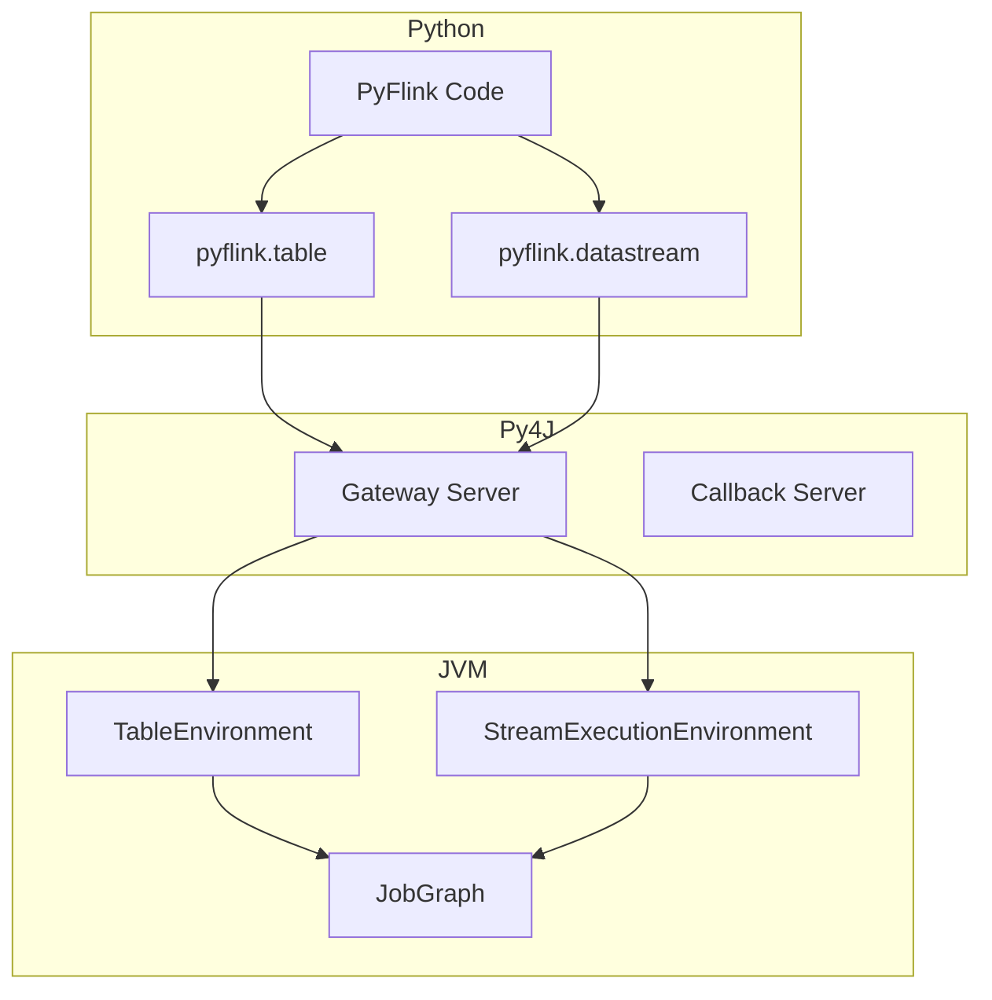
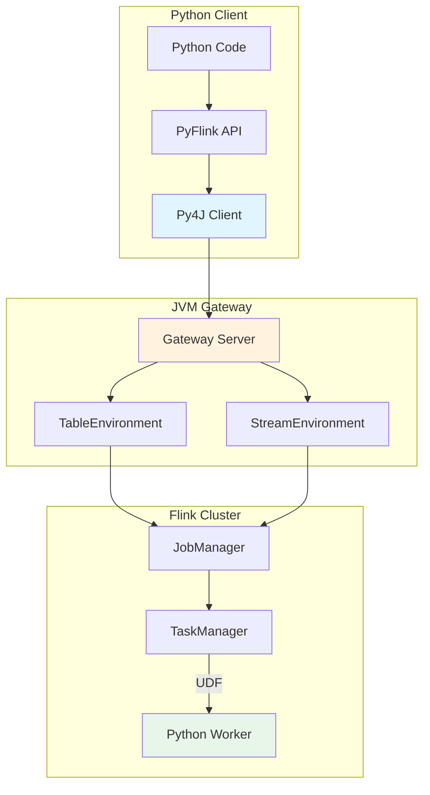
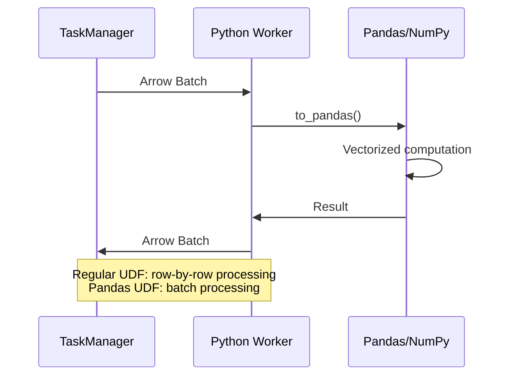
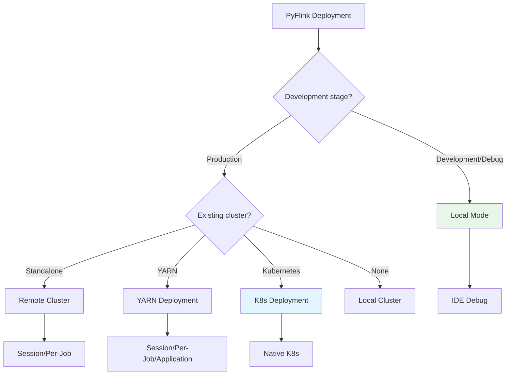

# PyFlink Deep Dive Guide

> Stage: Flink | Prerequisites: [data-types-complete-reference.md](./data-types-complete-reference.md) | Formalization Level: L3

---

## 1. Definitions

### Def-F-PyFlink-01: PyFlink Architecture

**Definition**: PyFlink is Apache Flink's Python API, bridging Python and the JVM via Py4J:

$$
\text{PyFlink} = (Python\_API, Py4J\_Bridge, JVM\_Runtime, UDF\_Engine)
$$

**Architecture Layers**:

```
┌─────────────────────────────────────┐
│         Python Application          │
│  (Table API / DataStream API / SQL) │
├─────────────────────────────────────┤
│           Py4J Bridge               │
│    (Python ←→ JVM Gateway)          │
├─────────────────────────────────────┤
│         Flink Runtime (JVM)         │
│  (JobManager / TaskManager)         │
├─────────────────────────────────────┤
│      Python UDF Execution           │
│  (Beam Portability / Process)       │
└─────────────────────────────────────┘
```

### Def-F-PyFlink-02: Python UDF Types

**Definition**: PyFlink supports multiple UDF types, classified by execution location:

| UDF Type | Execution Location | Applicable Scenario | Performance |
|----------|--------------------|---------------------|-------------|
| **ScalarFunction** | TaskManager | Row-by-row transformation | Medium |
| **TableFunction** | TaskManager | 1:N expansion | Medium |
| **AggregateFunction** | TaskManager | Aggregation computation | Medium |
| **Pandas UDF** | Python Worker | Vectorized computation | High |

### Def-F-PyFlink-03: Execution Environment

**Definition**: PyFlink execution environment configuration:

$$
\mathcal{E}_{py} = (P_{ver}, F_{ver}, V_{env}, E_{mode})
$$

Where:

- $P_{ver}$: Python version (3.9-3.12)
- $F_{ver}$: Flink version (1.18+)
- $V_{env}$: Virtual environment configuration
- $E_{mode}$: Execution mode $\{local, remote, yarn, k8s\}$

---

## 2. Properties

### Lemma-F-PyFlink-01: UDF Serialization Overhead

**Lemma**: Python UDFs have additional serialization overhead compared to Java UDFs:

$$
T_{py\_udf} = T_{java\_udf} + T_{serialization} + T_{py4j}
$$

Where:

- $T_{serialization}$: Conversion between Python objects and Flink row format
- $T_{py4j}$: Py4J bridge communication overhead

**Optimization Strategies**:

- Use Pandas UDFs for batch processing
- Enable object reuse
- Reduce UDF invocation frequency

### Lemma-F-PyFlink-02: Dependency Management Boundary

**Lemma**: PyFlink job dependencies must meet the following conditions for correct distribution:

1. **Requirements file**: Lists all pip dependencies
2. **Virtual environment packaging**: Or use `pyflink.shaded` approach
3. **Resource files**: Added via `add_python_file()`

### Prop-F-PyFlink-01: Pandas UDF Performance Advantage

**Proposition**: Pandas UDFs significantly outperform regular Python UDFs when processing batched data.

**Reasons**:

1. Vectorized computation (avoids Python loops)
2. Batch serialization (reduces IPC overhead)
3. Arrow memory format (zero-copy)

---

## 3. Relations

### 3.1 PyFlink and Java Flink Relationship



### 3.2 UDF Execution Mode Comparison

| Characteristic | Python UDF | Pandas UDF | Java UDF |
|----------------|------------|------------|----------|
| Language | Python | Python | Java/Scala |
| Execution | Per-row call | Batch call | In-JVM |
| Performance | Lower | Higher | Highest |
| Ecosystem | Python full ecosystem | Pandas/NumPy | Java ecosystem |
| Debugging | Easy | Easy | More complex |

### 3.3 Deployment Mode Mapping

| PyFlink API | Deployment Target | Applicable Scenario |
|-------------|-------------------|---------------------|
| `TableEnvironment` | Local/Cluster | SQL/Table jobs |
| `StreamExecutionEnvironment` | Local/Cluster | DataStream jobs |
| `remote()` | Remote cluster | Submit to existing cluster |
| Kubernetes | K8s | Cloud-native deployment |

---

## 4. Argumentation

### 4.1 PyFlink vs Java Flink Selection

| Dimension | PyFlink | Java Flink |
|-----------|---------|------------|
| Development efficiency | ⭐⭐⭐⭐⭐ | ⭐⭐⭐ |
| Runtime performance | ⭐⭐⭐ | ⭐⭐⭐⭐⭐ |
| Ecosystem integration | Python ML | Java ecosystem |
| Debugging experience | ⭐⭐⭐⭐⭐ | ⭐⭐⭐ |
| Production stability | ⭐⭐⭐⭐ | ⭐⭐⭐⭐⭐ |

**Recommended Scenarios**:

- **PyFlink**: ML integration, rapid prototyping, data science teams
- **Java Flink**: Production core pipelines, extreme performance requirements

### 4.2 UDF Type Selection Decision

```
Need Python ML libraries?
    ├─ No → Java/Scala UDF (optimal performance)
    └─ Yes → Data volume?
              ├─ Small → Regular Python UDF
              └─ Large → Pandas UDF (vectorized)
```

---

## 5. Proof / Engineering Argument

### Thm-F-PyFlink-01: Pandas UDF Throughput

**Theorem**: At batch size $N$, Pandas UDF throughput is $O(N)$ times that of regular Python UDFs.

**Engineering Argument**:

1. **Python UDF**: Called once per row, $N$ function call overheads
2. **Pandas UDF**: Called once per batch, 1 function call overhead
3. **Vectorization**: Pandas operations use underlying C optimizations
4. **Serialization**: Arrow format reduces serialization overhead

### Thm-F-PyFlink-02: Dependency Consistency

**Theorem**: Using `requirements.txt` + `set_python_executable()` guarantees dependency consistency.

**Proof**:

1. `requirements.txt` locks dependency versions
2. Virtual environment packaging ensures environment isolation
3. Distributed to all TaskManagers during job submission
4. Uses the specified Python interpreter at runtime

---

## 6. Examples

### 6.1 Environment Installation

```bash
# Create virtual environment
python -m venv pyflink_env
source pyflink_env/bin/activate  # Windows: pyflink_env\Scripts\activate

# Install PyFlink
pip install apache-flink==1.20.0

# Verify installation
python -c "from pyflink.table import TableEnvironment; print('PyFlink installed')"
```

### 6.2 Table API Example

```python
from pyflink.table import TableEnvironment, EnvironmentSettings
from pyflink.table.expressions import col

# Create execution environment
env_settings = EnvironmentSettings.in_streaming_mode()
t_env = TableEnvironment.create(env_settings)

# Create source table
t_env.execute_sql("""
    CREATE TABLE user_events (
        user_id STRING,
        event_type STRING,
        event_time TIMESTAMP(3),
        amount DOUBLE,
        WATERMARK FOR event_time AS event_time - INTERVAL '5' SECOND
    ) WITH (
        'connector' = 'kafka',
        'topic' = 'user-events',
        'properties.bootstrap.servers' = 'localhost:9092',
        'format' = 'json'
    )
""")

# Create result table
t_env.execute_sql("""
    CREATE TABLE event_stats (
        event_type STRING PRIMARY KEY NOT ENFORCED,
        total_amount DOUBLE,
        event_count BIGINT
    ) WITH (
        'connector' = 'jdbc',
        'url' = 'jdbc:mysql://localhost:3306/analytics',
        'table-name' = 'event_stats',
        'username' = 'user',
        'password' = 'password'
    )
""")

# Define processing logic
result = t_env.from_path("user_events") \
    .group_by(col("event_type")) \
    .select(
        col("event_type"),
        col("amount").sum.alias("total_amount"),
        col("user_id").count.alias("event_count")
    )

# Write result
result.execute_insert("event_stats").wait()
```

### 6.3 Python UDF Example

```python
from pyflink.table import DataTypes
from pyflink.table.udf import udf
import hashlib

# Scalar UDF
@udf(result_type=DataTypes.STRING())
def hash_user_id(user_id: str) -> str:
    """Generate hash for user ID"""
    return hashlib.md5(user_id.encode()).hexdigest()[:8]

# Register UDF
t_env.create_temporary_function("hash_user_id", hash_user_id)

# Use UDF
result = t_env.from_path("user_events") \
    .select(
        col("user_id"),
        call("hash_user_id", col("user_id")).alias("user_hash"),
        col("event_type")
    )

result.execute().print()
```

### 6.4 Pandas UDF Example

```python
from pyflink.table import DataTypes
from pyflink.table.udf import udf
import pandas as pd
import numpy as np

# Pandas scalar UDF (vectorized)
@udf(result_type=DataTypes.DOUBLE(), func_type="pandas")
def normalize_amount(amount: pd.Series) -> pd.Series:
    """Normalize amount (Z-score)"""
    mean = amount.mean()
    std = amount.std()
    return (amount - mean) / std

# Pandas table UDF (1:N expansion)
@udf(result_type=DataTypes.ROW([
    DataTypes.FIELD("quantile", DataTypes.STRING()),
    DataTypes.FIELD("value", DataTypes.DOUBLE())
]), func_type="pandas")
def calculate_quantiles(amount: pd.Series) -> pd.DataFrame:
    """Calculate quantiles"""
    quantiles = [0.25, 0.5, 0.75, 0.95]
    values = [amount.quantile(q) for q in quantiles]
    return pd.DataFrame({
        "quantile": [f"p{int(q*100)}" for q in quantiles],
        "value": values
    })

# Register and use
t_env.create_temporary_function("normalize_amount", normalize_amount)

result = t_env.from_path("user_events") \
    .select(
        col("user_id"),
        col("amount"),
        call("normalize_amount", col("amount")).alias("norm_amount")
    )
```

### 6.5 DataStream API Example

```python
from pyflink.datastream import StreamExecutionEnvironment
from pyflink.datastream.functions import MapFunction

# Create environment
env = StreamExecutionEnvironment.get_execution_environment()

# Add Kafka connector
env.add_jars("file:///path/to/flink-connector-kafka.jar")

# Custom MapFunction
class ParseEvent(MapFunction):
    def map(self, value):
        import json
        event = json.loads(value)
        return (
            event['user_id'],
            event['event_type'],
            event['timestamp']
        )

# Build stream processing job
dstream = env \
    .add_source(...) \
    .map(ParseEvent()) \
    .filter(lambda x: x[1] == 'purchase') \
    .key_by(lambda x: x[0]) \
    .reduce(lambda a, b: (a[0], a[1], a[2] + b[2]))

# Execute
env.execute("PyFlink DataStream Job")
```

### 6.6 Dependency Management Example

```text
# requirements.txt
apache-flink==1.20.0
pandas==2.0.3
numpy==1.24.3
scikit-learn==1.3.0

# Specify dependencies during job submission
from pyflink.table import TableEnvironment

t_env = TableEnvironment.create(...)

# Add Python files
t_env.add_python_file("/path/to/my_udf.py")
t_env.add_python_file("/path/to/requirements.txt")

# Or use conda environment
# t_env.set_python_executable("/path/to/conda/env/bin/python")
```

---

## 7. Visualizations

### 7.1 PyFlink Architecture Diagram



### 7.2 UDF Execution Flow



### 7.3 Deployment Mode Decision Tree



---

## 8. References
