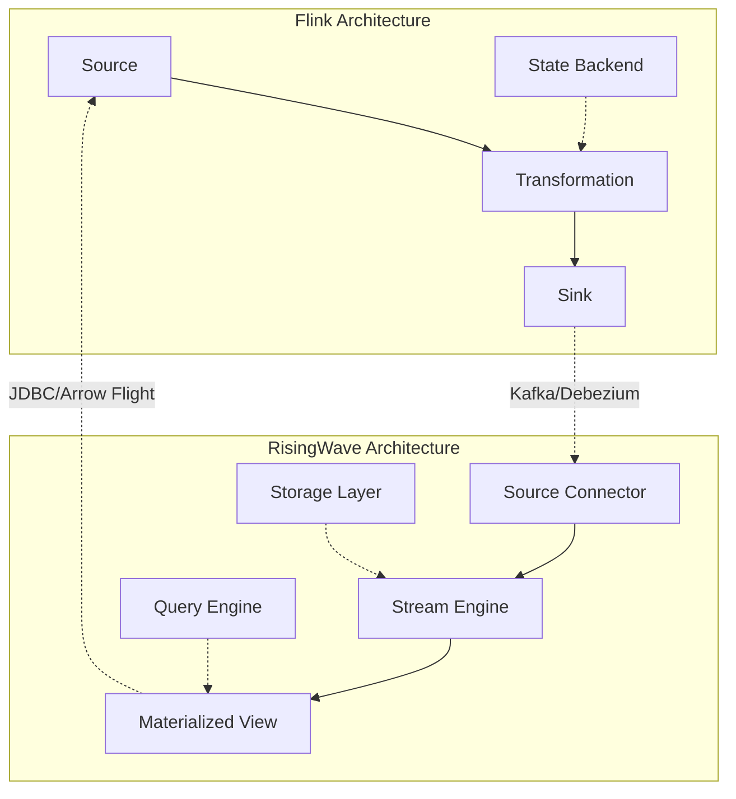
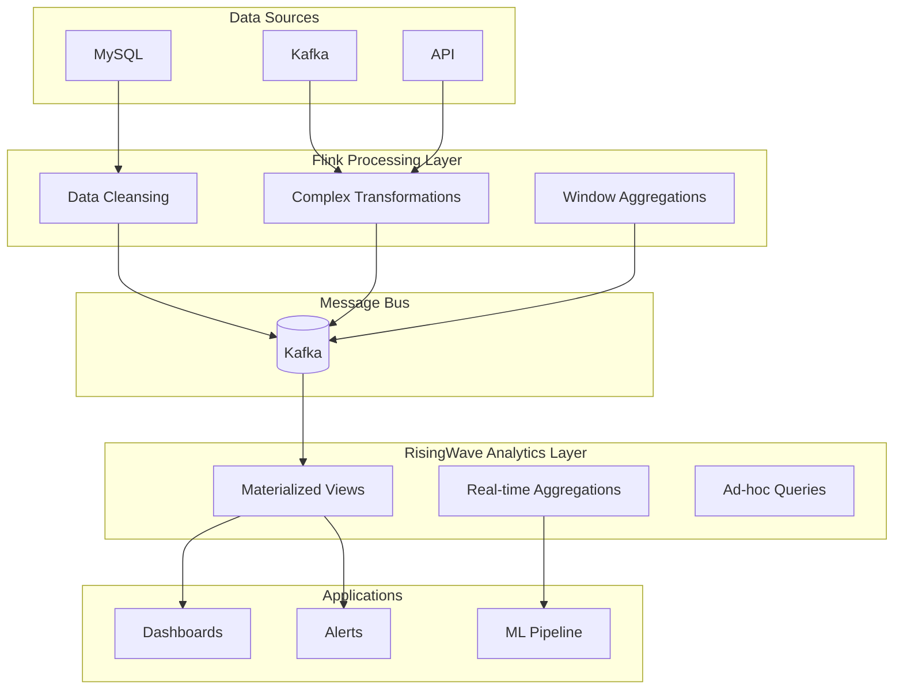

# RisingWave and Flink Deep Integration Guide

> **Stage**: Flink/ | **Prerequisites**: [Flink vs RisingWave Comparison](../Knowledge/04-technology-selection/flink-vs-risingwave.md) | **Formalization Level**: L5

---

## 1. Concept Definitions (Definitions)

### Def-F-RW-01: RisingWave

**Definition**: RisingWave is a distributed SQL stream processing database designed for real-time analytics, providing materialized view and ad-hoc query capabilities.

**Formal Definition**:

```
RisingWave = ⟨Stream, MV, Query, Storage⟩
```

Where Stream is the streaming data source, MV is the materialized view, Query is the SQL query interface, and Storage is the tiered storage system.

### Def-F-RW-02: Stream Processing Interoperability

**Definition**: The data transmission and state synchronization capabilities between two stream processing systems.

**Formal Definition**:

```
Interop(S₁, S₂) = ⟨Protocol, Schema, Semantics, Ordering⟩
```

---

## 2. Property Derivation (Properties)

### Lemma-F-RW-01: End-to-End Latency Upper Bound

**Lemma**: The end-to-end latency of the RisingWave + Flink integrated system satisfies:

```
Latency_total ≤ Latency_Flink + Latency_RisingWave + Latency_network + Latency_sync
```

**Proof Sketch**: Latency is the serial accumulation of component latencies, with network transmission and synchronization overhead as additional variables.

### Lemma-F-RW-02: Consistency Propagation

**Lemma**: If Flink provides Exactly-Once guarantee and RisingWave provides At-Least-Once ingestion, then the integrated system provides At-Least-Once guarantee.

---

## 3. Relationship Establishment (Relations)

### RisingWave and Flink Architecture Comparison



### Integration Pattern Matrix

| Pattern | Direction | Protocol | Latency | Applicable Scenario |
|---------|-----------|----------|---------|---------------------|
| Kafka Bridge | Flink → RW | Kafka | Sub-second | Real-time ETL |
| CDC Sync | RW → Flink | Debezium | Millisecond | Real-time Analytics Feedback |
| JDBC Query | Flink → RW | JDBC | 10-100ms | Dimension Table Join |
| Arrow Flight | Bidirectional | Arrow | Millisecond | High-performance Transport |

---

## 4. Argumentation Process (Argumentation)

### Scenario Analysis: Real-time Data Warehouse Layering

**Scenario**: Using Flink for data cleansing and transformation, RisingWave for real-time aggregation and ad-hoc queries.

```
Raw Data → Flink (Cleanse/Transform) → Kafka → RisingWave (Aggregate) → App Queries
```

**Argumentation**:

1. **Separation of Concerns**: Flink excels at complex transformations, RisingWave excels at real-time aggregation
2. **Storage Optimization**: RisingWave's materialized views avoid duplicate computation
3. **Query Flexibility**: RisingWave supports standard SQL ad-hoc queries
4. **Operational Simplification**: Each system focuses on its domain of expertise

---

## 5. Formal Proof / Engineering Argument (Proof / Engineering Argument)

### Engineering Argument: Latency Optimization

**Goal**: Prove the integration solution meets the < 5s end-to-end latency requirement.

**Argumentation Steps**:

| Component | Typical Latency | Optimization Strategy |
|-----------|-----------------|-----------------------|
| Flink Processing | 100-500ms | Optimize Checkpoint interval |
| Kafka Transfer | 10-100ms | Batch send optimization |
| RisingWave Ingest | 50-200ms | Parallel ingestion |
| RW Query | 10-500ms | Materialized view pre-aggregation |
| **Total** | **170-1300ms** | **< 5s target achieved** |

---

## 6. Example Validation (Examples)

### Example 1: Flink → RisingWave Kafka Integration

```java
// Flink Kafka Producer configuration
FlinkKafkaProducer<String> kafkaProducer = new FlinkKafkaProducer<>(
    "processed-events",
    new JsonSerializer(),
    kafkaProperties,
    FlinkKafkaProducer.Semantic.EXACTLY_ONCE
);

stream.addSink(kafkaProducer);
```

```sql
-- RisingWave consume Kafka
CREATE SOURCE processed_events (
    user_id VARCHAR,
    event_type VARCHAR,
    amount DECIMAL,
    event_time TIMESTAMP
) WITH (
    connector = 'kafka',
    topic = 'processed-events',
    properties.bootstrap.server = 'kafka:9092'
);

-- Create materialized view
CREATE MATERIALIZED VIEW hourly_stats AS
SELECT
    window_start,
    event_type,
    COUNT(*) as event_count,
    SUM(amount) as total_amount
FROM TUMBLE(processed_events, event_time, INTERVAL '1 HOUR')
GROUP BY window_start, event_type;
```

### Example 2: RisingWave → Flink CDC Integration

```sql
-- RisingWave create CDC Source
CREATE SOURCE user_changes (
    user_id INT PRIMARY KEY,
    user_name VARCHAR,
    updated_at TIMESTAMP
) WITH (
    connector = 'postgres-cdc',
    hostname = 'postgres',
    port = '5432',
    username = 'user',
    password = 'password',
    database.name = 'mydb',
    schema.name = 'public',
    table.name = 'users'
);
```

```java
// Flink CDC consume RisingWave (via Debezium)
DebeziumSourceFunction<String> source = DebeziumSourceFunction.<String>builder()
    .setBootstrapServers("kafka:9092")
    .setGroupId("flink-rw-cdc")
    .setTopicList("rw.user_changes")
    .build();
```

### Example 3: Flink Query RisingWave Dimension Table

```java
// Flink JDBC Lookup Join
Table result = tableEnv.sqlQuery(
    "SELECT " +
    "  o.order_id, " +
    "  o.user_id, " +
    "  u.user_name, " +
    "  o.amount " +
    "FROM orders AS o " +
    "LEFT JOIN rw_users FOR SYSTEM_TIME AS OF o.proc_time AS u " +
    "ON o.user_id = u.user_id"
);
```

---

## 7. Visualizations (Visualizations)

### Integration Architecture Diagram



---

## 8. References (References)


---

*This document follows the AnalysisDataFlow six-section template specification*
