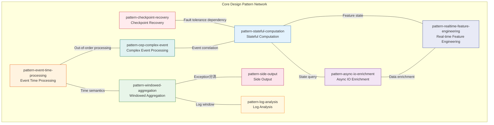
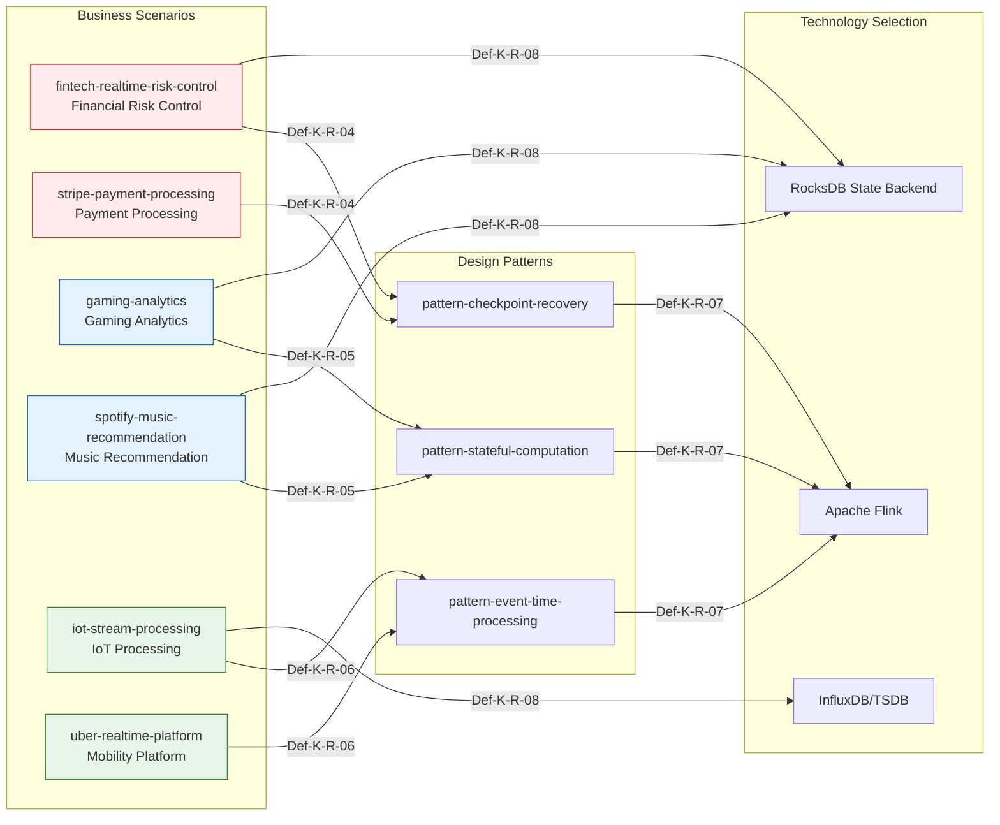

# Knowledge/ Pattern Relationship Panorama

> **Stage**: Knowledge/ | **Prerequisites**: [00-INDEX.md](00-INDEX.md) | **Formalization Level**: L3-L5
> **Version**: 2026.04 | **Document Size**: ~15KB

---

## Table of Contents

- [Knowledge/ Pattern Relationship Panorama](#knowledge-pattern-relationship-panorama)
  - [Table of Contents](#table-of-contents)
  - [1. Definitions](#1-definitions)
  - [2. Properties](#2-properties)
  - [4. Argumentation](#4-argumentation)
  - [5. Proof / Engineering Argument](#5-proof--engineering-argument)
  - [3. Relations](#3-relations)
    - [2.1 Concurrency Paradigm to Design Pattern Mapping](#21-concurrency-paradigm-to-design-pattern-mapping)
    - [2.2 Stream Model to Design Pattern Mapping](#22-stream-model-to-design-pattern-mapping)
    - [3. Design Pattern → Business Scenario](#3-design-pattern--business-scenario)
    - [3.1 Fault Tolerance Pattern to Business Mapping](#31-fault-tolerance-pattern-to-business-mapping)
    - [3.2 State Pattern to Business Mapping](#32-state-pattern-to-business-mapping)
    - [3.3 Time Pattern to Business Mapping](#33-time-pattern-to-business-mapping)
    - [4. Business Scenario → Technology Selection](#4-business-scenario--technology-selection)
    - [4.1 Business Scenario to Engine Selection](#41-business-scenario-to-engine-selection)
    - [4.2 Business Scenario to Storage Selection](#42-business-scenario-to-storage-selection)
    - [5. Technology Selection → Migration Guide](#5-technology-selection--migration-guide)
    - [6. Migration Guide → Best Practices](#6-migration-guide--best-practices)
  - [6. Examples](#6-examples)
  - [7. Visualizations](#7-visualizations)
    - [8.1 Concept to Practice Complete Chain](#81-concept-to-practice-complete-chain)
    - [8.2 Design Pattern Network](#82-design-pattern-network)
    - [8.3 Business Scenario-Technology Mapping Matrix](#83-business-scenario-technology-mapping-matrix)
  - [8. References](#8-references)

---

## 1. Definitions

**Def-K-R-01 (Knowledge Hierarchy Relationship Chain)**

The Knowledge/ directory constructs a six-layer progressive relationship chain from abstract concepts to concrete practice:

```
Concept Atlas (01-concept-atlas)
    ↓ Instantiation
Design Patterns (02-design-patterns)
    ↓ Applied to
Business Scenarios (03-business-patterns)
    ↓ Needs selection
Technology Selection (04-technology-selection)
    ↓ Guides
Migration Guides (05-mapping-guides)
    ↓ Lands in
Best Practices (07-best-practices)
```

---

## 2. Properties

**Table 1: Pattern-to-Business Mapping**

| Design Pattern | Applicable Business Scenario | Key Configuration | Relationship ID |
|----------------|------------------------------|-------------------|-----------------|
| pattern-checkpoint-recovery | Financial risk control, payment processing | checkpoint interval 5s | Def-K-R-04 |
| pattern-stateful-computation | Gaming analytics, recommendation systems | RocksDB state backend | Def-K-R-05 |
| pattern-event-time-processing | IoT processing, mobility platforms | Watermark strategy | Def-K-R-06 |
| pattern-windowed-aggregation | Real-time dashboards, metric aggregation | Window size configuration | Def-K-R-03 |
| pattern-cep-complex-event | Anti-fraud, risk rules | Pattern definition syntax | Def-K-R-03 |
| pattern-async-io-enrichment | Dimension table joins, data enrichment | Async timeout configuration | Def-K-R-02 |
| pattern-side-output | Exception分流, data cleansing | Side output tags | Def-K-R-03 |
| pattern-log-analysis | Log monitoring, ELK enhancement | Parsing rule configuration | - |
| pattern-realtime-feature-engineering | Feature platforms, ML pipelines | Feature TTL setting | - |

**Table 2: Business-to-Technology Mapping**

| Business Scenario | Recommended Engine | Storage Selection | Key Metrics | Relationship ID |
|-------------------|--------------------|-------------------|-------------|-----------------|
| fintech-realtime-risk-control | Flink | RocksDB | Latency <100ms | Def-K-R-07/08 |
| stripe-payment-processing | Flink | RocksDB | Zero loss | Def-K-R-04 |
| gaming-analytics | Flink | Redis/HBase | Throughput >100K/s | Def-K-R-05 |
| spotify-music-recommendation | Flink | RocksDB | Large state | Def-K-R-05 |
| iot-stream-processing | Flink | InfluxDB | Throughput >1M/s | Def-K-R-06/08 |
| uber-realtime-platform | Flink | Redis | Geospatial computation | Def-K-R-06 |
| alibaba-double11-flink | Flink | Hologres | High concurrency | - |
| netflix-streaming-pipeline | Flink | S3/Cassandra | Large scale | - |
| airbnb-marketplace-dynamics | Flink | Druid | Analytical | - |

---

## 4. Argumentation

This document focuses on mapping relationships between knowledge base layers; argumentation content is integrated into the specific analysis of each relationship chain.

---

## 5. Proof / Engineering Argument

This document is a pattern relationship panorama, focusing on mapping relationship presentation in engineering practice. For formal proofs, please refer to the relevant proof documents in the Struct/ directory.

---

## 3. Relations

### 2.1 Concurrency Paradigm to Design Pattern Mapping

**Def-K-R-02 (Paradigm Instantiation Relationship)**

```
01-concept-atlas/concurrency-paradigms-matrix.md
    ├── Actor Model/Dataflow Model
    │       ↓ Instantiation
    └── 02-design-patterns/
            ├── pattern-stateful-computation.md (Actor/Dataflow state)
            └── pattern-async-io-enrichment.md (CSP async communication)

    └── Dataflow Model
            ↓ Instantiation
            └── pattern-event-time-processing.md (Dataflow time semantics)
```

| Concurrency Paradigm | Design Pattern | Relationship Type | Key Mapping |
|----------------------|----------------|-------------------|-------------|
| Actor Model | pattern-stateful-computation | Direct instantiation | Actor state isolation → KeyedState |
| Dataflow Model | pattern-event-time-processing | Semantic inheritance | Event Time semantics → Watermark mechanism |
| CSP | pattern-async-io-enrichment | Communication pattern | Channel communication → AsyncFunction |
| Dataflow Model | pattern-windowed-aggregation | Computation model | Window computation → WindowOperator |

### 2.2 Stream Model to Design Pattern Mapping

**Def-K-R-03 (Stream Model Expansion Relationship)**

```
01-concept-atlas/streaming-models-mindmap.md
    ├── Stream processing core concepts
    │       ↓ Expanded into
    └── 02-design-patterns/
            ├── pattern-windowed-aggregation.md (window aggregation)
            ├── pattern-cep-complex-event.md (complex event)
            └── pattern-side-output.md (side output)
```

---

### 3. Design Pattern → Business Scenario

### 3.1 Fault Tolerance Pattern to Business Mapping

**Def-K-R-04 (Fault Tolerance Pattern Application Relationship)**

```
02-design-patterns/pattern-checkpoint-recovery.md
    └── Applied to
        ├── 03-business-patterns/fintech-realtime-risk-control.md (financial fault tolerance)
        │       └── Key requirements: Exactly-Once, latency <100ms
        │
        └── 03-business-patterns/stripe-payment-processing.md (payment fault tolerance)
                └── Key requirements: zero data loss, second-level recovery
```

### 3.2 State Pattern to Business Mapping

**Def-K-R-05 (State Pattern Application Relationship)**

```
02-design-patterns/pattern-stateful-computation.md
    └── Applied to
        ├── 03-business-patterns/gaming-analytics.md (gaming state)
        │       └── Key requirements: session state, real-time leaderboard
        │
        ├── 03-business-patterns/spotify-music-recommendation.md (recommendation state)
        │       └── Key requirements: user profile, collaborative filtering state
        │
        └── 03-business-patterns/real-time-recommendation.md (real-time recommendation)
                └── Key requirements: real-time features, model serving
```

### 3.3 Time Pattern to Business Mapping

**Def-K-R-06 (Time Pattern Application Relationship)**

```
02-design-patterns/pattern-event-time-processing.md
    └── Applied to
        ├── 03-business-patterns/iot-stream-processing.md (IoT time)
        │       └── Key requirements: out-of-order handling, sensor timestamps
        │
        └── 03-business-patterns/uber-realtime-platform.md (mobility time)
                └── Key requirements: geofencing, time window aggregation
```

---

### 4. Business Scenario → Technology Selection

### 4.1 Business Scenario to Engine Selection

**Def-K-R-07 (Engine Selection Relationship)**

| Business Scenario Document | Recommended Engine | Selection Document | Key Metrics |
|----------------------------|--------------------|--------------------|-------------|
| fintech-realtime-risk-control.md | Flink | engine-selection-guide.md | Latency <100ms |
| gaming-analytics.md | Flink | engine-selection-guide.md | Throughput >100K/s |
| iot-stream-processing.md | Flink | engine-selection-guide.md | Disorder tolerance |
| stripe-payment-processing.md | Flink + RisingWave | flink-vs-risingwave.md | exactly-once |
| uber-realtime-platform.md | Flink | engine-selection-guide.md | Geospatial computation |

### 4.2 Business Scenario to Storage Selection

**Def-K-R-08 (Storage Selection Relationship)**

```
03-business-patterns/iot-stream-processing.md
    └── Needs selection
        ├── 04-technology-selection/storage-selection-guide.md (select TSDB)
        │       └── Recommendation: InfluxDB, TimescaleDB
        │
        └── 04-technology-selection/streaming-database-guide.md (auxiliary storage)
                └── Recommendation: RisingWave materialized views

03-business-patterns/fintech-realtime-risk-control.md
    └── Needs selection
        └── 04-technology-selection/streaming-database-guide.md
                └── Recommendation: RocksDB state backend
```

---

### 5. Technology Selection → Migration Guide

**Def-K-R-09 (Migration Guidance Relationship)**

```
04-technology-selection/engine-selection-guide.md
    └── Guides
        ├── 05-mapping-guides/migration-guides/05.1-spark-streaming-to-flink-migration.md
        │       └── Scenario: from micro-batch to native streaming
        │
        ├── 05-mapping-guides/migration-guides/05.2-kafka-streams-to-flink-migration.md
        │       └── Scenario: enhanced state management
        │
        └── 05-mapping-guides/migration-guides/05.4-flink-1x-to-2x-migration.md
                └── Scenario: version upgrade, API migration
```

---

### 6. Migration Guide → Best Practices

**Def-K-R-10 (Practice Landing Relationship)**

```
05-mapping-guides/migration-guides/
    ├── 05.1-spark-streaming-to-flink-migration.md
    │       ↓ Lands in
    │       └── 07-best-practices/07.02-performance-tuning-patterns.md
    │
    ├── 05.2-kafka-streams-to-flink-migration.md
    │       ↓ Lands in
    │       └── 07-best-practices/07.01-flink-production-checklist.md
    │
    └── 05.4-flink-1x-to-2x-migration.md
            ↓ Lands in
            └── 07-best-practices/07.03-troubleshooting-guide.md
```

---

## 6. Examples

**Relationship Statistics Summary**

| Layer Relationship | Relationship Edge Count | Definition ID Range |
|--------------------|-------------------------|---------------------|
| Concept → Design Pattern | 6 | Def-K-R-02, Def-K-R-03 |
| Design Pattern → Business Scenario | 9 | Def-K-R-04, Def-K-R-05, Def-K-R-06 |
| Business Scenario → Technology Selection | 10 | Def-K-R-07, Def-K-R-08 |
| Technology Selection → Migration Guide | 3 | Def-K-R-09 |
| Migration Guide → Best Practices | 3 | Def-K-R-10 |
| **Total** | **31** | Def-K-R-01 ~ Def-K-R-10 |

**Pattern Coverage Statistics**

| Layer | Total Documents | Mapped Documents | Coverage |
|-------|-----------------|------------------|----------|
| 01-concept-atlas/ | 3 | 2 | 66.7% |
| 02-design-patterns/ | 9 | 7 | 77.8% |
| 03-business-patterns/ | 13 | 9 | 69.2% |
| 04-technology-selection/ | 5 | 4 | 80.0% |
| 05-mapping-guides/migration-guides/ | 5 | 3 | 60.0% |
| 07-best-practices/ | 7 | 3 | 42.9% |

---

## 7. Visualizations

### 8.1 Concept to Practice Complete Chain

```mermaid
graph LR
    subgraph "01 Concept Layer"
        Concept[01-concept-atlas<br/>Concept Atlas]
    end

    subgraph "02 Pattern Layer"
        Pattern[02-design-patterns<br/>Design Patterns]
    end

    subgraph "03 Business Layer"
        Business[03-business-patterns<br/>Business Scenarios]
    end

    subgraph "04 Selection Layer"
        Selection[04-technology-selection<br/>Technology Selection]
    end

    subgraph "05 Mapping Layer"
        Mapping[05-mapping-guides<br/>Migration Guides]
    end

    subgraph "07 Practice Layer"
        Practice[07-best-practices<br/>Best Practices]
    end

    Concept -->|"Def-K-R-02/03<br/>Instantiation"| Pattern
    Pattern -->|"Def-K-R-04/05/06<br/>Applied to"| Business
    Business -->|"Def-K-R-07/08<br/>Needs selection"| Selection
    Selection -->|"Def-K-R-09<br/>Guides"| Mapping
    Mapping -->|"Def-K-R-10<br/>Lands in"| Practice

    style Concept fill:#e3f2fd,stroke:#1565c0
    style Pattern fill:#e8f5e9,stroke:#2e7d32
    style Business fill:#fff3e0,stroke:#e65100
    style Selection fill:#f3e5f5,stroke:#6a1b9a
    style Mapping fill:#fce4ec,stroke:#c62828
    style Practice fill:#e0f2f1,stroke:#00695c
```



### 8.2 Design Pattern Network



### 8.3 Business Scenario-Technology Mapping Matrix



---

## 8. References
