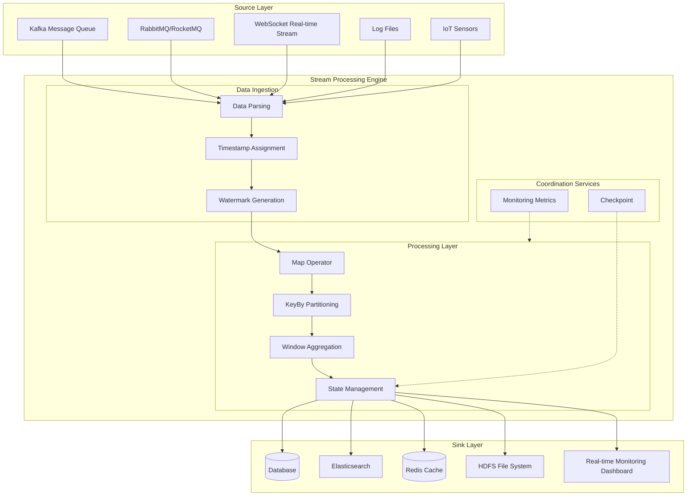
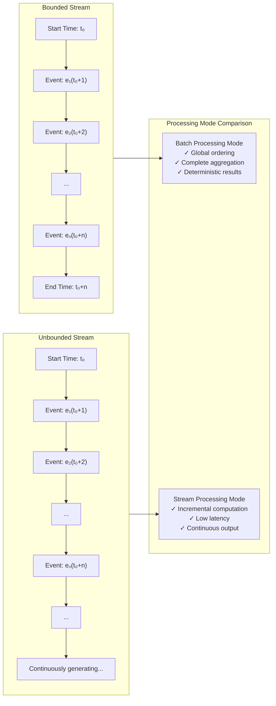
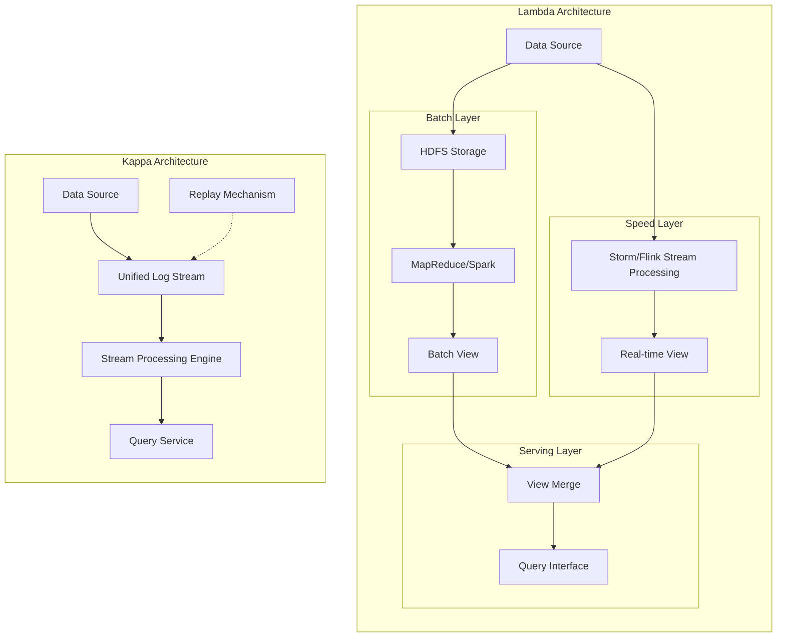
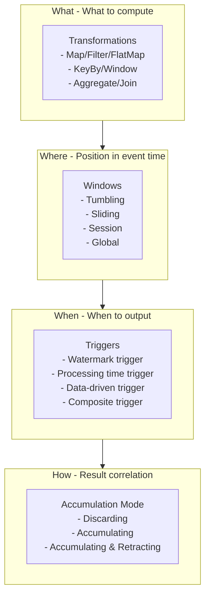

# Stream Processing Fundamentals

> **Stage**: Knowledge/01-concept-atlas | **Prerequisites**: None | **Formalization Level**: L2-L3 | **Difficulty**: Beginner | **Estimated Reading Time**: 45 minutes

---

## 1. Concept Definitions (Definitions)

### 1.1 Basic Definitions of Data Streams

**Definition 1.1.1 (Data Stream)** [Def-K-01-01]

A Data Stream is an infinite sequence $S = \langle e_1, e_2, e_3, \ldots \rangle$, where each element $e_i = (v_i, t_i, k_i)$ contains:

- $v_i$: Event value (Value)
- $t_i$: Event timestamp (Event Timestamp)
- $k_i$: Key (optional)

A data stream can be formally defined as a partial function from time to event values:
$$S: \mathbb{T} \rightharpoonup \mathcal{V}$$

Where $\mathbb{T}$ is the time domain (typically $(\mathbb{R}^+, \leq)$ or $(\mathbb{N}, \leq)$), and $\mathcal{V}$ is the value domain.

**Definition 1.1.2 (Bounded Stream)** [Def-K-01-02]

A Bounded Stream is a data stream defined over a finite time interval $[t_{start}, t_{end}]$, satisfying:
$$S_{bounded} = \{ (v, t, k) \in S \mid t_{start} \leq t \leq t_{end} \}, \quad |S_{bounded}| < \infty$$

A bounded stream has explicit start and end boundaries; its cardinality (number of elements) is finite.

**Definition 1.1.3 (Unbounded Stream)** [Def-K-01-03]

An Unbounded Stream is a data stream defined over an infinite time domain, satisfying:
$$S_{unbounded} = \{ (v, t, k) \in S \mid t \in [t_{start}, \infty) \}, \quad |S_{unbounded}| = \infty$$

An unbounded stream has no predefined end time; theoretically it will continuously produce data until system termination.

**Definition 1.1.4 (Stream Processing)** [Def-K-01-04]

Stream Processing is a computation process $P$ that maps an input stream $S_{in}$ to an output stream $S_{out}$:
$$P: S_{in} \rightarrow S_{out}$$

This process has the following characteristics:

1. **Incrementality**: Output is produced progressively as input arrives
2. **Continuity**: Computation is executed immediately upon data arrival
3. **Low latency**: End-to-end latency is typically required to be below the second level

**Definition 1.1.5 (Batch Processing)** [Def-K-01-05]

Batch Processing is an offline computation process over a bounded dataset $D$:
$$B: D \rightarrow R$$

Where $D$ is a static dataset and $R$ is the computation result. Batch processing assumes that data is fully available before computation begins.

### 1.2 Core Components of Stream Processing Systems

**Definition 1.1.6 (Data Source)** [Def-K-01-06]

A Data Source is the input endpoint of a stream processing system, responsible for producing or receiving data streams. Formally defined as a triple:
$$Source = (O, \Sigma, \delta)$$

Where:

- $O$: Set of observable events
- $\Sigma$: Set of source states
- $\delta: \Sigma \times O \rightarrow \Sigma$: State transition function

**Definition 1.1.7 (Data Sink)** [Def-K-01-07]

A Data Sink is the output endpoint of a stream processing system, responsible for persisting or forwarding processing results. Formally defined as:
$$Sink = (I, \Gamma, \rho)$$

Where:

- $I$: Set of input event types
- $\Gamma$: Target storage state
- $\rho: I \times \Gamma \rightarrow \Gamma$: Persistence function

**Definition 1.1.8 (Operator)** [Def-K-01-08]

An Operator is the basic computation unit in stream processing, performing specific data transformations:
$$Op: S_{in} \times \Theta \rightarrow S_{out}$$

Where $\Theta$ is the operator parameter/state space. Common operator types include:

- **Map**: $f: v \rightarrow v'$
- **Filter**: $p: v \rightarrow \{true, false\}$
- **Aggregate**: $g: 2^V \rightarrow V'$
- **Join**: $\Join: S_1 \times S_2 \rightarrow S_{out}$

### 1.3 Formal Definitions of Real-Time Characteristics

**Definition 1.1.9 (Processing Latency)** [Def-K-01-09]

Processing Latency is the time interval from when an event is produced until its result is consumed:
$$\mathcal{L}(e) = t_{sink}(e) - t_{event}(e)$$

Where:

- $t_{event}(e)$: The actual occurrence time of event $e$
- $t_{sink}(e)$: The time when event $e$'s processing result is received by the Sink

**Definition 1.1.10 (Real-Time Processing)** [Def-K-01-10]

Real-Time Processing is stream processing that satisfies latency constraints:
$$\forall e \in S: \mathcal{L}(e) \leq \mathcal{L}_{max}$$

According to latency requirements, it can be classified as:

- **Hard Real-time**: Latency constraints must be strictly met; violation will cause system failure
- **Soft Real-time**: Latency constraints can be occasionally violated, but statistical constraints must be met
- **Near Real-time**: Second-level to minute-level latency requirements

---

## 2. Property Derivation (Properties)

### 2.1 Basic Properties of Bounded and Unbounded Streams

**Lemma 2.1.1 (Completeness of Bounded Streams)** [Lemma-K-01-01]

Bounded streams $S_{bounded}$ support complete set operations, including:

- Global ordering: A total order can be established based on $t$
- Cardinality computation: $|S_{bounded}|$ is a well-defined finite value
- Complete aggregation: $\bigoplus_{e \in S_{bounded}} v(e)$ can be completed in finite time

*Proof*: Since $S_{bounded}$ is defined over a finite time interval and has a finite number of elements, according to the properties of finite sets, the above operations can all be completed. ∎

**Lemma 2.1.2 (Partial Order Property of Unbounded Streams)** [Lemma-K-01-02]

Events on an unbounded stream $S_{unbounded}$ can only establish a partial order relation $\preceq$:
$$e_i \preceq e_j \iff t_i \leq t_j$$

This partial order is not a total order, because there exist concurrent event pairs $(e_i, e_j)$ satisfying $t_i = t_j$ and $k_i \neq k_j$.

**Lemma 2.1.3 (Partitionability of Streams)** [Lemma-K-01-03]

Any data stream $S$ can be partitioned into disjoint substreams based on key $k$:
$$S = \bigcup_{k \in \mathcal{K}} S_k, \quad S_k = \{ e \in S \mid key(e) = k \}$$

And satisfies:
$$\forall k_i \neq k_j: S_{k_i} \cap S_{k_j} = \emptyset$$

### 2.2 Equivalence of Stream Processing and Batch Processing

**Theorem 2.2.1 (Stream-Batch Duality)** [Thm-K-01-01]

For any bounded dataset $D$, there exists a stream processing program $P$ and a batch processing program $B$ that produce the same result:
$$\forall D: P(D) = B(D)$$

Where $D$ is regarded as a bounded stream completed at time $t = t_{end}$.

*Proof Sketch*:

1. Label the input data $D$ of batch processing as a bounded stream completed at $t_{end}$
2. Stream processing operators can simulate Map and Reduce operations of batch processing
3. Window operations triggered at $t_{end}$ can produce aggregation results
4. According to the unity of the Dataflow model, the two computation results are equivalent. ∎

**Corollary 2.2.1 (Batch Processing as a Special Case of Stream Processing)** [Cor-K-01-01]

Batch processing is a special case of stream processing over a bounded time domain:
$$BatchProcessing = StreamProcessing|_{t \in [t_{start}, t_{end}]}$$

### 2.3 Temporal Characteristics of Stream Processing

**Proposition 2.3.1 (Event Order Constraints in Stream Processing)** [Prop-K-01-01]

Stream processing systems must handle three event orders:

1. **Event Order**: The physical time order in which events actually occur
2. **Ingestion Order**: The time order in which events enter the system
3. **Processing Order**: The time order in which events are processed by operators

The three satisfy:
$$EventOrder \preceq IngestionOrder \preceq ProcessingOrder$$

(Where $\preceq$ denotes the "not later than" partial order relation)

**Lemma 2.3.1 (Ubiquity of Out-of-Order Events)** [Lemma-K-01-04]

In distributed systems, out-of-order events necessarily exist:
$$\exists e_i, e_j \in S: t_i < t_j \land t'_i > t'_j$$

Where $t$ is event time and $t'$ is processing time.

*Proof*: Consider two event sources $A$ and $B$; event $e_A$ is produced at $t=1$, and $e_B$ at $t=2$. Due to the uncertainty of network latency, $e_B$ may arrive at the processing node before $e_A$. Therefore, out-of-order events necessarily exist. ∎

---

## 3. Relation Establishment (Relations)

### 3.1 Lambda Architecture and Kappa Architecture

**Definition 3.1.1 (Lambda Architecture)** [Def-K-01-11]

Lambda architecture is a hybrid processing pattern that simultaneously maintains:

- **Batch Layer**: Processes full historical data to guarantee accuracy
- **Speed Layer**: Processes real-time stream data to provide low latency
- **Serving Layer**: Merges results from both layers to provide a unified view

Formally represented as:
$$Result(t) = \alpha \cdot BatchResult(t) + (1-\alpha) \cdot SpeedResult(t)$$

**Definition 3.1.2 (Kappa Architecture)** [Def-K-01-12]

Kappa architecture is a purely stream-processing-based architecture that achieves batch processing functionality through replay mechanisms:
$$Result(t) = StreamProcessing(Replay(S, t_{start}, t))$$

**Theorem 3.1.1 (Architecture Equivalence)** [Thm-K-01-02]

In terms of functional completeness, Kappa architecture can simulate Lambda architecture:
$$\forall Lambda \exists Kappa: Kappa \Rightarrow Lambda$$

However, Lambda architecture has lower computation latency in certain scenarios.

### 3.2 Relation between Stream Processing and the Dataflow Model

**Definition 3.2.1 (Dataflow Model)** [Def-K-01-13]

The Dataflow model is a unified stream-batch processing model proposed by Google; its core concepts include:

- **What**: What result to compute (Transformations)
- **Where**: At which position in the event time domain (Windows)
- **When**: When to output results (Triggers)
- **How**: How results are correlated (Accumulation Mode)

**Theorem 3.2.1 (Completeness of Dataflow)** [Thm-K-01-03]

The Dataflow model can express all reasonable stream-batch computations:
$$\forall Computation \in \{Stream, Batch\}: \exists DataflowProgram \cong Computation$$

### 3.3 Relation between Stream Processing and the Actor Model

**Definition 3.3.1 (Stream Processing Actor)** [Def-K-01-14]

A Stream Processing Actor is the combination of the Actor model and stream processing semantics:
$$StreamActor = (State, Behavior, Inbox, Outbox, T)$$

Where $T$ is the time semantics processor, handling event-time-related logic.

**Theorem 3.3.1 (Actor-Stream Isomorphism)** [Thm-K-01-04]

A stream processing graph can establish an isomorphic mapping with an Actor system:
$$\phi: StreamGraph \rightarrow ActorSystem$$

Satisfying:

- Operator $\leftrightarrow$ Actor
- Data stream $\leftrightarrow$ Message passing
- Window trigger $\leftrightarrow$ Behavior switch

### 3.4 Mapping between Stream Processing and Relational Algebra

**Definition 3.4.1 (Stream Relational Algebra)** [Def-K-01-15]

Stream relational algebra extends standard relational algebra by introducing the time dimension:
$$R^T = R \times \mathbb{T}$$

Where $\mathbb{T}$ is the time type. Basic operations are extended as follows:

- **Selection**: $\sigma_{\theta}^T(R^T) = \{ r \in R \mid \theta(r) \land \tau(r) \in T \}$
- **Projection**: $\pi_{A}^T(R^T) = \{ r[A] \mid r \in R \land \tau(r) \in T \}$
- **Join**: $R^T \Join_{\theta}^T S^T = \{ (r, s) \mid \theta(r, s) \land |\tau(r) - \tau(s)| \leq \delta \}$

**Theorem 3.4.1 (Stream SQL Completeness)** [Thm-K-01-05]

Stream SQL (e.g., Flink SQL, Kafka KSQL) is equivalent in expressiveness to stream relational algebra:
$$StreamSQL \equiv StreamRelationalAlgebra$$

---

## 4. Argumentation Process (Argumentation)

### 4.1 Why Stream Processing is Needed

**Thesis 4.1.1 (Inevitability of Stream Processing)**

The low-latency demands of modern data processing make stream processing an inevitable choice.

**Argument**:

1. **Business demand-driven**:
   - Fraud detection requires millisecond-level response
   - IoT monitoring requires real-time alerting
   - Financial transactions require instant settlement

2. **Data characteristic changes**:
   - Data generation speed exceeds storage capacity
   - Data value decays rapidly over time
   - Data timeliness becomes a critical attribute

3. **Technology evolution trends**:
   - In-memory computing costs decline
   - Network bandwidth continues to grow
   - Distributed systems mature

**Conclusion**: Stream processing is not a replacement for batch processing, but a necessary extension of data processing.

### 4.2 Boundary Discussion of Bounded and Unbounded

**Thesis 4.2.1 (Relativity of Bounded and Unbounded)**

The distinction between bounded streams and unbounded streams is relative, depending on the observer's perspective.

**Argument**:

Consider a daily log processing scenario:

- **Minute-level perspective**: Today's logs are an unbounded stream (continuously appended)
- **Day-level perspective**: A single day's logs are a bounded stream (completed after 24 hours)
- **Year-level perspective**: Annual logs are an unbounded stream (continuously produced)

Formal expression:
$$Boundedness(S, \Delta t) = \begin{cases} true & \text{if } \exists t_{end}: \forall t > t_{end}, S(t) = \emptyset \\ false & \text{otherwise} \end{cases}$$

Where $\Delta t$ is the observation time window.

**Conclusion**: Boundedness is a property relative to the observation time granularity.

### 4.3 Real-Time Cost Analysis

**Thesis 4.3.1 (Real-Time Trade-offs)**

Pursuing lower latency necessarily brings increased costs.

**Cost Model**:

Let the latency requirement be $\mathcal{L}$ and the system cost be $C(\mathcal{L})$:
$$C(\mathcal{L}) = C_{base} + \frac{k}{\mathcal{L}^\alpha}, \quad \alpha > 1$$

Cost components:

1. **Computation cost**: Lower latency requires stronger computing power
2. **Storage cost**: Maintaining state requires memory resources
3. **Network cost**: Real-time transmission requires high bandwidth
4. **Complexity cost**: System design and maintenance difficulty increases

**Trade-off Strategies**:

- Adopt a layered architecture, using different processing paths for different latency requirements
- Use approximation algorithms, trading accuracy for latency
- Leverage resource elasticity, scaling on demand

---

## 5. Formal Proof / Engineering Argument (Proof / Engineering Argument)

### 5.1 Stream Processing Correctness Theorem

**Theorem 5.1.1 (Determinism of Stream Processing Results)** [Thm-K-01-06]

Under deterministic operators and ordered inputs, stream processing produces deterministic outputs:
$$\forall P \in Deterministic: \forall S: P(S) \text{ is deterministic}$$

*Formal Proof*:

**Preconditions**:

1. Operator $P$ is deterministic: the same input always produces the same output
2. The event times of input stream $S$ are monotonically non-decreasing
3. The watermark mechanism advances correctly

**Proof Process**:

Let $P$ consist of an operator graph $G = (V, E)$, where:

- $V = \{op_1, op_2, \ldots, op_n\}$ is the set of operators
- $E \subseteq V \times V$ is the set of dataflow edges

For any operator $op_i \in V$, its state transition function is:
$$op_i: (State_i, Input_i) \rightarrow (State'_i, Output_i)$$

Since $op_i$ is deterministic:
$$\forall s, i: op_i(s, i) = op_i(s, i)$$

That is, the same state and input always produce the same output.

For the entire graph $G$, its execution can be modeled as a sequence of state machine transitions:
$$(S_0, I_0) \xrightarrow{G} (S_1, O_1) \xrightarrow{G} (S_2, O_2) \xrightarrow{G} \cdots$$

Since:

1. The determinism of each operator guarantees local determinism
2. Event time monotonicity guarantees deterministic triggering order
3. The watermark mechanism guarantees deterministic window computation trigger points

Therefore the execution of the entire system is deterministic. ∎

### 5.2 Correctness of Out-of-Order Handling

**Theorem 5.2.1 (Completeness of Out-of-Order Handling)** [Thm-K-01-07]

Out-of-order handling based on event time and watermarks can guarantee result completeness:
$$\forall e \in S: t(e) \leq W(t) \Rightarrow e \text{ has been processed}$$

Where $W(t)$ is the watermark value at time $t$.

*Proof*:

**Definition**: Watermark $W$ is a monotonically non-decreasing function $W: \mathbb{T}_{proc} \rightarrow \mathbb{T}_{event}$, satisfying:
$$\forall t_1 \leq t_2: W(t_1) \leq W(t_2)$$

**Core Property**: Events with timestamps not exceeding $W(t)$ will not arrive later than $W(t)$.

**Proof**:

Let window $[t_s, t_e]$ trigger when watermark $W \geq t_e$.

Assume there exists an event $e$ satisfying $t(e) \in [t_s, t_e]$ but not included in the window result; then:

1. Either $e$ arrives after watermark $W \geq t_e$
2. Or the system implementation is incorrect

According to the watermark definition, if $t(e) \leq W$, then $e$ must have arrived before $W$ (otherwise the watermark promise is violated).

Therefore, under a correctly implemented watermark mechanism, all events that should be included have been received when the window triggers.

**Boundary Case**: If late data is allowed, then:
$$Result = Result_{ontime} \cup Result_{late}$$

Where $Result_{late}$ is handled through the Side Output mechanism. ∎

### 5.3 Engineering Argument for Stream-Batch Unification

**Engineering Theorem 5.3.1 (Feasibility of a Unified Execution Engine)** [Thm-K-01-08]

A single execution engine can simultaneously and efficiently support both stream processing and batch processing workloads.

*Engineering Argument*:

**Architecture Design**:

1. **Unified data abstraction**:
   - Batch processing: Bounded dataset = Stream over a finite time window
   - Stream processing: Unbounded data stream = Stream over an infinite time window

2. **Unified operator implementation**:

   ```
   Map: ∀ T. (a → b) → Stream T a → Stream T b
   Filter: ∀ T. (a → Bool) → Stream T a → Stream T a
   Window: ∀ T W. WindowSpec W → Stream T a → Stream T [a]
   ```

3. **Adaptive execution strategies**:
   - Bounded data: Adopt batch optimization strategies (vectorization, predicate pushdown)
   - Unbounded data: Adopt stream optimization strategies (pipelining, incremental computation)

**Performance Validation**:

According to Apache Flink benchmark data[^1]:

- Batch processing performance is comparable to dedicated batch processing engines (e.g., Spark SQL)
- Stream processing latency can be controlled at the millisecond level
- A unified architecture reduces the overhead of maintaining two separate systems

---

## 6. Example Validation (Examples)

### 6.1 Basic Stream Processing Examples

**Example 6.1.1: Real-Time Word Count (Flink Java)**

```java
import org.apache.flink.api.common.eventtime.WatermarkStrategy;
import org.apache.flink.api.common.functions.FlatMapFunction;
import org.apache.flink.api.java.tuple.Tuple2;
import org.apache.flink.streaming.api.datastream.DataStream;
import org.apache.flink.streaming.api.environment.StreamExecutionEnvironment;
import org.apache.flink.streaming.api.windowing.assigners.TumblingEventTimeWindows;
import org.apache.flink.streaming.api.windowing.time.Time;
import org.apache.flink.util.Collector;

public class WordCount {
    public static void main(String[] args) throws Exception {
        // Create execution environment
        final StreamExecutionEnvironment env =
            StreamExecutionEnvironment.getExecutionEnvironment();

        // Configure event time and watermark
        env.getConfig().setAutoWatermarkInterval(200);

        // Read data stream from Kafka
        DataStream<String> text = env
            .fromSource(
                KafkaSource.<String>builder()
                    .setBootstrapServers("localhost:9092")
                    .setTopics("input-topic")
                    .setGroupId("wordcount-group")
                    .setStartingOffsets(OffsetsInitializer.earliest())
                    .setValueOnlyDeserializer(new SimpleStringSchema())
                    .build(),
                WatermarkStrategy.forBoundedOutOfOrderness(
                    Duration.ofSeconds(5)),
                "Kafka Source"
            );

        // Tokenize and convert to (word, 1) pairs
        DataStream<Tuple2<String, Integer>> wordCounts = text
            .flatMap(new Tokenizer())
            .keyBy(value -> value.f0)
            .window(TumblingEventTimeWindows.of(Time.minutes(1)))
            .sum(1);

        // Output to Sink
        wordCounts.print();

        // Execute program
        env.execute("Streaming WordCount");
    }

    // Custom tokenizer operator
    public static class Tokenizer implements FlatMapFunction<String, Tuple2<String, Integer>> {
        @Override
        public void flatMap(String value, Collector<Tuple2<String, Integer>> out) {
            for (String word : value.toLowerCase().split("\\W+")) {
                if (word.length() > 0) {
                    out.collect(new Tuple2<>(word, 1));
                }
            }
        }
    }
}
```

**Example 6.1.2: Sensor Data Filtering (Python)**

```python
from pyflink.datastream import StreamExecutionEnvironment
from pyflink.datastream.functions import MapFunction, FilterFunction
from pyflink.common.typeinfo import Types
from pyflink.datastream.connectors.kafka import KafkaSource, KafkaOffsetsInitializer
from pyflink.common.watermark_strategy import WatermarkStrategy
import json

class SensorReading:
    def __init__(self, sensor_id, timestamp, temperature, humidity):
        self.sensor_id = sensor_id
        self.timestamp = timestamp
        self.temperature = temperature
        self.humidity = humidity

class ParseSensorData(MapFunction):
    """Parse JSON-formatted sensor data"""
    def map(self, value):
        data = json.loads(value)
        return SensorReading(
            data['sensor_id'],
            data['timestamp'],
            data['temperature'],
            data['humidity']
        )

class TemperatureAlertFilter(FilterFunction):
    """Filter anomalous temperature readings"""
    def __init__(self, threshold):
        self.threshold = threshold

    def filter(self, reading):
        return reading.temperature > self.threshold

# Create execution environment
env = StreamExecutionEnvironment.get_execution_environment()

# Configure Kafka data source
source = KafkaSource.builder() \
    .set_bootstrap_servers("localhost:9092") \
    .set_topics("sensor-data") \
    .set_group_id("sensor-processor") \
    .set_starting_offsets(KafkaOffsetsInitializer.earliest()) \
    .set_value_only_deserializer(SimpleStringSchema()) \
    .build()

# Build processing pipeline
readings = env.from_source(
    source,
    WatermarkStrategy.for_bounded_out_of_orderness(Duration.of_seconds(5)),
    "Sensor Source"
).map(ParseSensorData())

# Filter high-temperature alerts
high_temp_alerts = readings.filter(TemperatureAlertFilter(80.0))

# Output results
high_temp_alerts.print()

# Execute
env.execute("Sensor Monitoring")
```

### 6.2 Comparison of Bounded Stream and Unbounded Stream Processing

**Example 6.2.1: Batch Processing Mode (Bounded Stream)**

```java

import org.apache.flink.streaming.api.datastream.DataStream;

// Batch processing: process historical data files
DataStream<String> historicalData = env
    .readTextFile("hdfs://path/to/historical/logs");

DataStream<AnalyticsResult> batchResult = historicalData
    .map(this::parseLog)
    .keyBy(LogEntry::getUserId)
    .window(GlobalWindows.create())  // Global window, process all data
    .trigger(CountTrigger.of(10000)) // Trigger every 10000 records
    .aggregate(new UserBehaviorAggregator());

batchResult.writeAsText("hdfs://output/batch-results");
```

**Example 6.2.2: Stream Processing Mode (Unbounded Stream)**

```java

import org.apache.flink.streaming.api.datastream.DataStream;
import org.apache.flink.streaming.api.windowing.time.Time;

// Stream processing: real-time Kafka data processing
DataStream<String> realTimeData = env
    .fromSource(
        KafkaSource.<String>builder()
            .setBootstrapServers("kafka:9092")
            .setTopics("realtime-events")
            .build(),
        WatermarkStrategy.forBoundedOutOfOrderness(Duration.ofSeconds(10)),
        "Kafka Source"
    );

DataStream<AnalyticsResult> streamResult = realTimeData
    .map(this::parseEvent)
    .keyBy(Event::getUserId)
    .window(TumblingEventTimeWindows.of(Time.minutes(5)))
    .allowedLateness(Time.minutes(2))  // Allow 2 minutes lateness
    .sideOutputLateData(lateDataTag)   // Late data output to side stream
    .aggregate(new RealTimeAggregator());

streamResult.addSink(new ElasticsearchSink.Builder<>()
    .setBulkFlushMaxActions(1000)
    .setHosts(new HttpHost("es", 9200))
    .build());
```

### 6.3 Unification of Real-Time and Batch Processing

**Example 6.3.1: Unified Processing with Flink Table API**

```java
import org.apache.flink.table.api.EnvironmentSettings;
import org.apache.flink.table.api.TableEnvironment;
import org.apache.flink.table.api.Table;

public class UnifiedProcessing {
    public static void main(String[] args) {
        // Create unified Table Environment
        EnvironmentSettings settings = EnvironmentSettings
            .newInstance()
            .inStreamingMode()  // Switch to .inBatchMode() for batch processing
            .build();

        TableEnvironment tableEnv = TableEnvironment.create(settings);

        // Define data source (stream mode or batch mode)
        tableEnv.executeSql("""
            CREATE TABLE user_events (
                user_id STRING,
                event_type STRING,
                event_time TIMESTAMP(3),
                amount DECIMAL(10, 2),
                WATERMARK FOR event_time AS event_time - INTERVAL '5' SECOND
            ) WITH (
                'connector' = 'kafka',
                'topic' = 'user-events',
                'properties.bootstrap.servers' = 'localhost:9092',
                'format' = 'json'
            )
            """);

        // Define Sink
        tableEnv.executeSql("""
            CREATE TABLE hourly_stats (
                hour_start TIMESTAMP(3),
                event_type STRING,
                total_amount DECIMAL(10, 2),
                event_count BIGINT,
                PRIMARY KEY (hour_start, event_type) NOT ENFORCED
            ) WITH (
                'connector' = 'jdbc',
                'url' = 'jdbc:mysql://localhost:3306/analytics',
                'table-name' = 'hourly_statistics'
            )
            """);

        // Unified processing logic (applicable to both stream and batch)
        Table result = tableEnv.sqlQuery("""
            SELECT
                TUMBLE_START(event_time, INTERVAL '1' HOUR) as hour_start,
                event_type,
                SUM(amount) as total_amount,
                COUNT(*) as event_count
            FROM user_events
            GROUP BY
                TUMBLE(event_time, INTERVAL '1' HOUR),
                event_type
            """);

        // Execute insert
        result.executeInsert("hourly_stats");
    }
}
```

### 6.4 Complete Stream Processing Pipeline

**Example 6.4.1: E-Commerce Real-Time Recommendation Pipeline**

```java

import org.apache.flink.streaming.api.environment.StreamExecutionEnvironment;
import org.apache.flink.streaming.api.datastream.DataStream;
import org.apache.flink.streaming.api.windowing.time.Time;

public class RealTimeRecommendationPipeline {

    public static void main(String[] args) throws Exception {
        StreamExecutionEnvironment env =
            StreamExecutionEnvironment.getExecutionEnvironment();
        env.enableCheckpointing(60000); // Checkpoint every minute

        // 1. User behavior event stream
        DataStream<UserEvent> userEvents = env
            .fromSource(
                KafkaSource.<UserEvent>builder()
                    .setBootstrapServers("kafka:9092")
                    .setTopics("user-behavior")
                    .setValueOnlyDeserializer(new UserEventDeserializationSchema())
                    .build(),
                WatermarkStrategy
                    .<UserEvent>forBoundedOutOfOrderness(Duration.ofSeconds(30))
                    .withTimestampAssigner((event, timestamp) -> event.getTimestamp()),
                "User Events"
            );

        // 2. Product info dimension table
        DataStream<ProductInfo> productStream = env
            .fromSource(
                KafkaSource.<ProductInfo>builder()
                    .setBootstrapServers("kafka:9092")
                    .setTopics("product-catalog")
                    .build(),
                WatermarkStrategy.noWatermarks(),
                "Product Catalog"
            );

        // 3. Build product dimension table state
        MapStateDescriptor<String, ProductInfo> productStateDescriptor =
            new MapStateDescriptor<>("products", String.class, ProductInfo.class);

        BroadcastStream<ProductInfo> broadcastProducts = productStream
            .broadcast(productStateDescriptor);

        // 4. Join user behavior with product info
        DataStream<EnrichedEvent> enrichedEvents = userEvents
            .keyBy(UserEvent::getUserId)
            .connect(broadcastProducts)
            .process(new ProductEnrichmentFunction(productStateDescriptor));

        // 5. User session window aggregation
        DataStream<UserSession> sessions = enrichedEvents
            .keyBy(EnrichedEvent::getUserId)
            .window(EventTimeSessionWindows.withGap(Time.minutes(30)))
            .aggregate(new SessionAggregator());

        // 6. Generate recommendations
        DataStream<Recommendation> recommendations = sessions
            .keyBy(UserSession::getUserId)
            .process(new RecommendationGenerator());

        // 7. Output to recommendation service
        recommendations.addSink(
            new FlinkKafkaProducer<>("recommendations",
                new RecommendationSerializer(),
                kafkaProps));

        env.execute("Real-time Recommendation Pipeline");
    }
}

class ProductEnrichmentFunction extends KeyedBroadcastProcessFunction<String, UserEvent, ProductInfo, EnrichedEvent> {
    private final MapStateDescriptor<String, ProductInfo> productStateDescriptor;

    public ProductEnrichmentFunction(MapStateDescriptor<String, ProductInfo> descriptor) {
        this.productStateDescriptor = descriptor;
    }

    @Override
    public void processElement(UserEvent event, ReadOnlyContext ctx, Collector<EnrichedEvent> out) {
        ReadOnlyBroadcastState<String, ProductInfo> products =
            ctx.getBroadcastState(productStateDescriptor);

        try {
            ProductInfo product = products.get(event.getProductId());
            if (product != null) {
                out.collect(new EnrichedEvent(event, product));
            }
        } catch (Exception e) {
            // Handle exceptional cases
        }
    }

    @Override
    public void processBroadcastElement(ProductInfo product, Context ctx, Collector<EnrichedEvent> out) {
        BroadcastState<String, ProductInfo> products = ctx.getBroadcastState(productStateDescriptor);
        products.put(product.getProductId(), product);
    }
}
```

---

## 7. Visualizations (Visualizations)

### 7.1 Stream Processing System Architecture Diagram

The following shows the typical architecture of a stream processing system, comprising three main layers: data sources, processing engine, and data sinks:



### 7.2 Bounded Stream vs. Unbounded Stream Comparison



### 7.3 Lambda Architecture vs. Kappa Architecture Comparison



### 7.4 Dataflow Model of Stream Processing



### 7.5 Stream Processing Timeline

```mermaid
gantt
    title Stream Processing Time Semantic Comparison
    dateFormat X
    axisFormat %s

    section Event Generation
    Event 1    :0, 1
    Event 2    :2, 3
    Event 3    :5, 6
    Event 4    :7, 8
    Event 5    :10, 11

    section Event Time Axis
    Tumbling Window 1 : crit, 0, 5
    Tumbling Window 2 : crit, 5, 10

    section Processing Time Axis
    Processing Window 1 : active, 0, 4
    Processing Window 2 : active, 4, 9
```



---

## 8. References (References)

[^1]: Apache Flink Documentation, "DataStream API", 2025. <https://nightlies.apache.org/flink/flink-docs-stable/docs/dev/datastream/overview/>


---

## Appendix: Core Concept Quick Reference

| Concept | Definition | Key Attributes | Typical Applications |
|---------|------------|----------------|----------------------|
| **Data Stream** | Timestamped event sequence | Infiniteness, temporality, partitionability | Real-time computation, event-driven |
| **Bounded Stream** | Stream over finite time interval | Completable, sortable, aggregatable | Historical data processing, offline analysis |
| **Unbounded Stream** | Stream over infinite time interval | Continuous generation, requires windowing | Real-time monitoring, streaming ETL |
| **Real-Time Processing** | Computation satisfying latency constraints | Low latency, incrementality, continuity | Fraud detection, IoT processing |
| **Batch Processing** | Offline computation over bounded data | High throughput, completeness, determinism | Report generation, offline training |
| **Watermark** | Time advancement mechanism | Monotonicity, completeness guarantee | Out-of-order handling, window triggering |
| **Window** | Time/data grouping mechanism | Boundary definition, trigger strategy | Aggregation computation, pattern analysis |

---

> **Document Info**
>
> - Version: v1.0
> - Last Updated: 2026-04-11
> - Maintainer: Knowledge Team
> - Related Documents: [01.02-time-semantics.md](./01.02-time-semantics.md), [01.03-window-concepts.md](./01.03-window-concepts.md)
