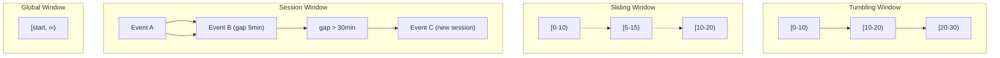
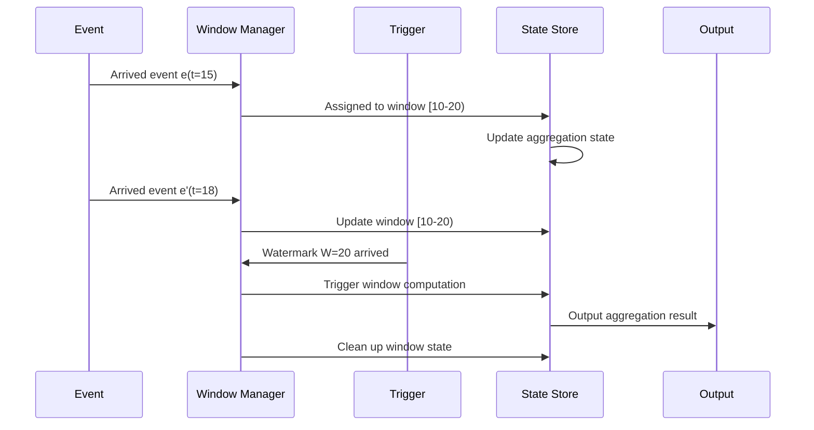

# Window Concepts Explained

> **Stage**: Knowledge/01-concept-atlas | **Prerequisites**: [01.02-time-semantics.md](./01.02-time-semantics.md) | **Formalization Level**: L3-L4 | **Difficulty**: Intermediate | **Estimated Reading Time**: 50 minutes

---

## 1. Definitions

### 1.1 Basic Window Definition

**Definition 1.1.1 (Window)** [Def-K-03-01]

A window is a finite subset on a data stream, used to divide infinite streams into finite chunks for computation. Formally defined as:
$$W: S \rightarrow 2^S, \quad W(S) = \{ w_1, w_2, \ldots, w_n \}$$

Where each window $w_i$ satisfies:

- **Finiteness**: $|w_i| < \infty$ (time window) or has an explicit count limit
- **Disjointness or Overlap**: Depending on the window type, windows may be disjoint or overlapping
- **Completeness**: $\bigcup_i w_i \subseteq S$ (for arrived data)

**Definition 1.1.2 (Time Window)** [Def-K-03-02]

A time window is an interval based on the event time domain $\mathbb{T}$:
$$win_{time} = [t_{start}, t_{end}) \subseteq \mathbb{T}$$

The window contains all events whose event time falls within this interval:
$$Events(win_{time}) = \{ e \in S \mid t_{event}(e) \in [t_{start}, t_{end}) \}$$

**Definition 1.1.3 (Count Window)** [Def-K-03-03]

A count window is a window based on element count, defined as:
$$win_{count} = \{ e_i \in S \mid i \in [n \cdot N, (n+1) \cdot N) \}$$

Where $N$ is the window size (number of elements) and $n$ is the window index.

### 1.2 Formal Definitions of Window Types

**Definition 1.2.1 (Tumbling Window)** [Def-K-03-04]

A tumbling window divides the time axis into fixed-length, non-overlapping consecutive intervals:
$$win_{tumbling}(k) = [k \cdot \Delta t, (k+1) \cdot \Delta t), \quad k \in \mathbb{N}$$

Where $\Delta t$ is the window size. Tumbling windows satisfy disjointness:
$$\forall i \neq j: win_{tumbling}(i) \cap win_{tumbling}(j) = \emptyset$$

**Definition 1.2.2 (Sliding Window)** [Def-K-03-05]

A sliding window advances with a fixed step size, and windows may overlap:
$$win_{sliding}(k) = [k \cdot \Delta s, k \cdot \Delta s + \Delta w), \quad k \in \mathbb{N}$$

Where:

- $\Delta w$: Window size
- $\Delta s$: Slide size
- Overlap condition: When $\Delta s < \Delta w$, $win(k) \cap win(k+1) \neq \emptyset$

**Definition 1.2.3 (Session Window)** [Def-K-03-06]

A session window is dynamically divided based on activity gaps, suitable for non-continuous activity scenarios:
$$win_{session} = [t_{start}, t_{end}) \text{ where } t_{end} - t_{last} > \Delta g$$

Where:

- $\Delta g$: Session gap duration
- $t_{last}$: The time of the last event in the window
- Window expansion rule: If a new event $e$ satisfies $t_{event}(e) - t_{last} \leq \Delta g$, the window is expanded to include $e$

**Definition 1.2.4 (Global Window)** [Def-K-03-07]

A global window is a single window containing all events:
$$win_{global} = [t_{min}, t_{max}) \text{ where } t_{max} \rightarrow \infty$$

A global window itself does not trigger computation and needs to be used with a custom trigger.

### 1.3 Window Lifecycle

**Definition 1.3.1 (Window Creation)** [Def-K-03-08]

The window creation condition $Create$ defines when a new window is instantiated:
$$Create: (e, W) \rightarrow \{true, false\}$$

Creation conditions for different window types:

- **Tumbling/Sliding windows**: Event time $t_{event}(e)$ falls into a new window interval
- **Session windows**: Existing session window gap exceeds $\Delta g$

**Definition 1.3.2 (Window Trigger)** [Def-K-03-09]

The window trigger condition $Trigger$ defines when to compute and output the window result:
$$Trigger: (win, W, S) \rightarrow \{true, false\}$$

Common trigger conditions:

- **Watermark trigger**: $Trigger_{wm} = (W \geq t_{end}(win))$
- **Processing time trigger**: $Trigger_{proc} = (t_{proc} \geq t_{scheduled})$
- **Element count trigger**: $Trigger_{count} = (|Events(win)| \geq N)$

**Definition 1.3.3 (Window Purge)** [Def-K-03-10]

The window purge condition $Purge$ defines when to release window state:
$$Purge: (win, t_{current}) \rightarrow \{true, false\}$$

Default purge policies:

- Purge after trigger (Discarding): Clear immediately after output
- Retain after trigger (Accumulating): Retain state until allowed lateness is exceeded

### 1.4 Advanced Window Concepts

**Definition 1.4.1 (Window Aggregation Mode)** [Def-K-03-11]

Window aggregation result handling modes:

1. **Discarding Mode**:
   $$Result_{new} = Aggregate(Events(win_{current}))$$
   Each trigger independently computes current window events.

2. **Accumulating Mode**:
   $$Result_{new} = Result_{old} \oplus Aggregate(Events(win_{new}))$$
   Accumulates newly arrived events on top of existing results.

3. **Accumulating & Retracting Mode**:
   $$\langle Retract(Result_{old}), Emit(Result_{new}) \rangle$$
   First sends a retraction of the old result, then sends the new result.

**Definition 1.4.2 (Allowed Lateness)** [Def-K-03-12]

Allowed lateness $\delta_{lateness}$ defines the time range during which late events are still accepted after the window triggers:
$$win_{effective} = [t_{start}, t_{end} + \delta_{lateness})$$

Late event handling policies:

- **Ignore**: Drop late events
- **Incremental update**: Update already output results
- **Side output**: Route late events to a separate stream

---

## 2. Properties

### 2.1 Basic Window Properties

**Lemma 2.1.1 (Window Finiteness)** [Lemma-K-03-01]

For fixed-size time windows, the expected number of events in the window is bounded:
$$E[|Events(win)|] = \lambda \cdot \Delta t$$

Where $\lambda$ is the event arrival rate and $\Delta t$ is the window size.

**Lemma 2.1.2 (Tumbling Window Disjointness)** [Lemma-K-03-02]

Tumbling window partitions are complete and disjoint:
$$\bigcup_{k=0}^{\infty} win_{tumbling}(k) = \mathbb{T}, \quad win_{tumbling}(i) \cap win_{tumbling}(j) = \emptyset \text{ if } i \neq j$$

**Lemma 2.1.3 (Sliding Window Overlap Degree)** [Lemma-K-03-03]

The overlap degree $O$ of a sliding window is defined as:
$$O = \frac{\Delta w - \Delta s}{\Delta s}$$

Each event may be contained in $\lceil \frac{\Delta w}{\Delta s} \rceil$ windows.

### 2.2 Session Window Dynamic Properties

**Theorem 2.2.1 (Session Window Completeness)** [Thm-K-03-01]

Session window partitions satisfy completeness and disjointness:
$$\bigcup_{win \in SessionWindows} Events(win) = S$$

And:
$$\forall win_i, win_j \in SessionWindows, i \neq j: Events(win_i) \cap Events(win_j) = \emptyset$$

**Theorem 2.2.2 (Session Window Merge Monotonicity)** [Thm-K-03-02]

The merge operation of session windows satisfies monotonicity:
$$|Windows_{after}| \leq |Windows_{before}|$$

### 2.3 Trigger Properties

**Lemma 2.3.1 (Watermark Trigger Completeness)** [Lemma-K-03-04]

The Watermark trigger guarantees computation on complete data:
$$Trigger_{wm}(win, W) = true \Rightarrow \forall e \in Events(win): e \text{ has arrived}$$

---

## 3. Relations

### 3.1 Window and SQL Relationship

**Definition 3.1.1 (Stream SQL Window Extension)** [Def-K-03-13]

Stream SQL's window extension to standard GROUP BY:

```sql
-- Tumbling window
SELECT TUMBLE_START(event_time, INTERVAL '1' HOUR) as window_start,
       user_id, COUNT(*) as cnt
FROM orders
GROUP BY TUMBLE(event_time, INTERVAL '1' HOUR), user_id

-- Sliding window
SELECT HOP_START(event_time, INTERVAL '5' MINUTE, INTERVAL '1' HOUR),
       COUNT(*) as cnt
FROM events
GROUP BY HOP(event_time, INTERVAL '5' MINUTE, INTERVAL '1' HOUR)

-- Session window
SELECT SESSION_START(event_time, INTERVAL '10' MINUTE),
       user_id, COUNT(*) as cnt
FROM clicks
GROUP BY SESSION(event_time, INTERVAL '10' MINUTE), user_id
```

### 3.2 Window and Time Semantics Relationship

**Definition 3.2.1 (Window Time Basis)** [Def-K-03-14]

Windows can be defined based on three time domains:

| Time Basis | Window Type | Characteristics |
|------------|-------------|-----------------|
| Event Time | EventTimeWindow | High accuracy, requires Watermark trigger |
| Processing Time | ProcessingTimeWindow | Low latency, simple |
| Ingestion Time | IngestionTimeWindow | Balanced |

### 3.3 Window and State Management Relationship

Window computation relies on state to store intermediate aggregation results; each window corresponds to one state instance.

---

## 4. Argumentation

### 4.1 Window Strategy Selection

**Decision Matrix**:

| Scenario Characteristic | Recommended Window | Reason |
|-------------------------|--------------------|--------|
| Fixed time statistics | Tumbling window | Disjoint, no duplicate computation |
| Trend analysis | Sliding window | Smooth, continuous perspective |
| User behavior analysis | Session window | Natural activity boundaries |
| Batch processing simulation | Global window | Complete data view |

### 4.2 Trigger Strategy Trade-offs

| Trigger Strategy | Latency | Completeness | Applicable Scenario |
|------------------|---------|--------------|---------------------|
| Watermark trigger | Medium | High | Accuracy priority |
| Processing time trigger | Low | Medium | Real-time priority |
| Count trigger | Variable | Low | Data-driven |

---

## 5. Proof / Engineering Argument

### 5.1 Window Partition Completeness Theorem

**Theorem 5.1.1 (Tumbling Window Partition Completeness)** [Thm-K-03-03]

Tumbling windows divide the time axis into a complete and disjoint set:
$$\forall t \in \mathbb{T}: \exists! k: t \in win_{tumbling}(k)$$

*Proof*:

**Existence**: For any $t \in \mathbb{T}$, let $k = \lfloor t / \Delta t \rfloor$, then $k \cdot \Delta t \leq t < (k+1) \cdot \Delta t$. Therefore $t \in win(k)$.

**Uniqueness**: Assume there exist $k_1 \neq k_2$ such that $t \in win(k_1) \cap win(k_2)$. Without loss of generality, let $k_1 < k_2$, then $t \geq k_2 \cdot \Delta t \geq (k_1 + 1) \cdot \Delta t$, but $t \in win(k_1)$ requires $t < (k_1 + 1) \cdot \Delta t$, contradiction.

Therefore the window partition is unique. ∎

### 5.2 Session Window Merge Algorithm Correctness

**Theorem 5.2.1 (Session Window Merge Correctness)** [Thm-K-03-04]

The session window merge algorithm produces windows that satisfy the session gap constraint.

*Proof Sketch*:

**Lemma 1**: Events within the same window satisfy the session gap constraint.

**Lemma 2**: Events in different windows do not satisfy the session gap constraint.

In summary, the session window partition is correct. ∎

---

## 6. Examples

### 6.1 Basic Window Configurations

**Example 6.1.1: Tumbling Window Configuration**

```java
import org.apache.flink.streaming.api.windowing.assigners.TumblingEventTimeWindows;
import org.apache.flink.streaming.api.windowing.time.Time;

import org.apache.flink.streaming.api.datastream.DataStream;


// 1-hour tumbling window
DataStream<Result> hourlyResult = stream
    .keyBy(Event::getUserId)
    .window(TumblingEventTimeWindows.of(Time.hours(1)))
    .aggregate(new CountAggregate());

// Tumbling window with offset (aligned to whole hour)
DataStream<Result> alignedHourly = stream
    .keyBy(Event::getUserId)
    .window(TumblingEventTimeWindows.of(Time.hours(1), Time.minutes(0)))
    .aggregate(new SumAggregate());
```

**Example 6.1.2: Sliding Window Configuration**

```java

import org.apache.flink.streaming.api.datastream.DataStream;
import org.apache.flink.streaming.api.windowing.time.Time;

// 5-minute window, 1-minute slide
DataStream<AverageMetric> slidingAvg = metrics
    .keyBy(Metric::getService)
    .window(SlidingEventTimeWindows.of(Time.minutes(5), Time.minutes(1)))
    .aggregate(new AverageAggregate());
```

**Example 6.1.3: Session Window Configuration**

```java

import org.apache.flink.streaming.api.datastream.DataStream;
import org.apache.flink.streaming.api.windowing.time.Time;

// Static gap session window
DataStream<SessionResult> sessions = clicks
    .keyBy(ClickEvent::getUserId)
    .window(EventTimeSessionWindows.withGap(Time.minutes(30)))
    .aggregate(new SessionAggregator());

// Dynamic gap session window
DataStream<SessionResult> dynamicSessions = clicks
    .keyBy(ClickEvent::getUserId)
    .window(EventTimeSessionWindows.withDynamicGap(
        (ClickEvent event) -> {
            return event.isPremiumUser() ? Time.minutes(60) : Time.minutes(10);
        }))
    .aggregate(new SessionAggregator());
```

### 6.2 Custom Trigger

```java
// Composite trigger: every 100 elements or Watermark trigger (whichever comes first)
public static class ElementOrWatermarkTrigger<T> extends Trigger<T, TimeWindow> {
    private final long maxCount;
    private final ReducingStateDescriptor<Long> countDesc;

    public ElementOrWatermarkTrigger(long maxCount) {
        this.maxCount = maxCount;
        this.countDesc = new ReducingStateDescriptor<>("count",
            (a, b) -> a + b, LongSerializer.INSTANCE);
    }

    @Override
    public TriggerResult onElement(T element, long timestamp,
            TimeWindow window, TriggerContext ctx) throws Exception {
        ReducingState<Long> count = ctx.getPartitionedState(countDesc);
        count.add(1L);
        if (count.get() >= maxCount) {
            return TriggerResult.FIRE;
        }
        return TriggerResult.CONTINUE;
    }

    @Override
    public TriggerResult onEventTime(long time, TimeWindow window, TriggerContext ctx) {
        if (time == window.maxTimestamp()) {
            return TriggerResult.FIRE;
        }
        return TriggerResult.CONTINUE;
    }

    @Override
    public void clear(TimeWindow window, TriggerContext ctx) {
        ctx.getPartitionedState(countDesc).clear();
    }
}
```

### 6.3 Allowed Lateness and Side Output

```java

import org.apache.flink.streaming.api.datastream.DataStream;
import org.apache.flink.streaming.api.windowing.time.Time;

// Late data handling
SingleOutputStreamOperator<Result> mainResult = stream
    .keyBy(Event::getKey)
    .window(TumblingEventTimeWindows.of(Time.minutes(5)))
    .allowedLateness(Time.minutes(2))
    .sideOutputLateData(lateDataTag)
    .aggregate(new IncrementalAggregate());

// Get late data stream
DataStream<Event> lateData = mainResult.getSideOutput(lateDataTag);
lateData.addSink(new LateDataLogger());
```

### 6.4 Window Join Operations

```java

import org.apache.flink.streaming.api.datastream.DataStream;
import org.apache.flink.streaming.api.windowing.time.Time;

// Window Join: orders and payments must match within 5 minutes
DataStream<EnrichedOrder> enrichedOrders = orders
    .join(payments)
    .where(Order::getOrderId)
    .equalTo(Payment::getOrderId)
    .window(TumblingEventTimeWindows.of(Time.minutes(5)))
    .apply((order, payment) -> new EnrichedOrder(order, payment));

// Interval Join
DataStream<OrderShipment> orderShipments = orders
    .keyBy(Order::getOrderId)
    .intervalJoin(shipments.keyBy(Shipment::getOrderId))
    .between(Time.minutes(5), Time.hours(24))
    .process(new ProcessJoinFunction<Order, Shipment, OrderShipment>() {
        @Override
        public void processElement(Order order, Shipment shipment,
                Context ctx, Collector<OrderShipment> out) {
            out.collect(new OrderShipment(order, shipment));
        }
    });
```

---

## 7. Visualizations

### 7.1 Window Type Comparison



### 7.2 Window Lifecycle



### 7.3 Tumbling Window vs Sliding Window Comparison

```mermaid
gantt
    title Tumbling Window vs Sliding Window Timeline
    dateFormat X
    axisFormat %d

    section Tumbling Window
    Window 1    :0, 10
    Window 2    :10, 20
    Window 3    :20, 30

    section Sliding Window (Overlapping)
    Window 1    :0, 10
    Window 2    :5, 15
    Window 3    :10, 20
    Window 4    :15, 25
```



---

## 8. References


---

## Appendix: Window Selection Decision Tree

```
Select window type
│
├─ Need fixed time boundary?
│  ├─ Yes → Choose tumbling window
│  │        ├─ Need window alignment?
│  │        │  ├─ Yes → Set offset
│  │        │  └─ No → Default config
│  │        └─ Window size?
│  │           ├─ Hour-level → TumblingEventTimeWindows.of(Time.hours(n))
│  │           ├─ Minute-level → TumblingEventTimeWindows.of(Time.minutes(n))
│  │           └─ Second-level → TumblingEventTimeWindows.of(Time.seconds(n))
│  │
│  └─ No → Need smooth trend?
│         ├─ Yes → Choose sliding window
│         │        ├─ Window size > slide size
│         │        └─ Overlap degree = window size / slide size
│         │
│         └─ No → Partition by activity boundary?
│                ├─ Yes → Choose session window
│                │        ├─ Set session gap
│                │        └─ Consider dynamic gap
│                │
│                └─ No → Choose global window + custom trigger
```

---

> **Document Info**
>
> - Version: v1.0
> - Last Updated: 2026-04-11
> - Maintainer: Knowledge Team
> - Related Documents: [01.02-time-semantics.md](./01.02-time-semantics.md), [01.04-state-management-concepts.md](./01.04-state-management-concepts.md)
