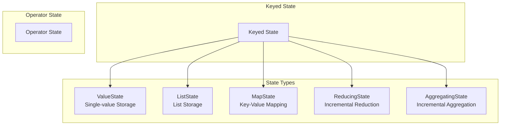
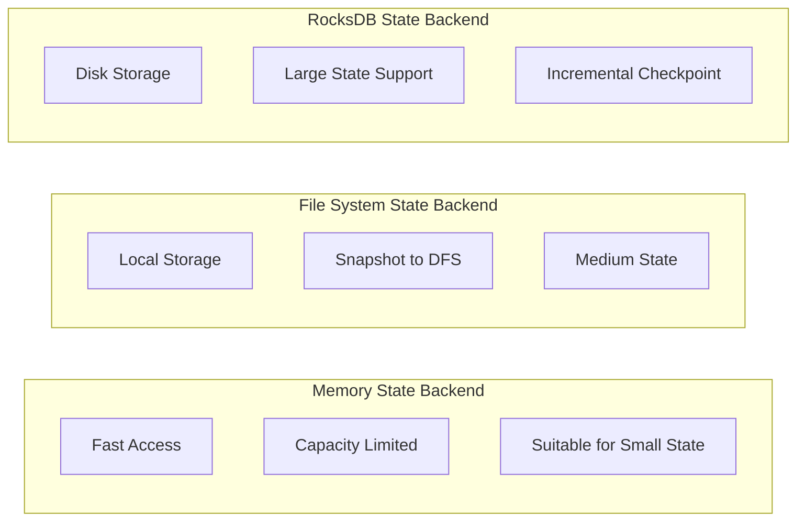

# State Management Concepts Explained

> **Stage**: Knowledge/01-concept-atlas | **Prerequisites**: [01.02-time-semantics.md](./01.02-time-semantics.md) | **Formalization Level**: L3-L4 | **Difficulty**: Advanced | **Estimated Reading Time**: 55 minutes

---

## 1. Definitions

### 1.1 Basic Definition of State

**Definition 1.1.1 (State)** [Def-K-04-01]

State is the data that a stream processing operator needs to persist during computation, formally defined as:
$$State: (K, V, T) \rightarrow V'$$

Where:

- $K$: State key space (optional)
- $V$: State value space
- $T$: Time domain (used for TTL)

State is the foundation for implementing stateful computations (such as aggregation, join, and pattern matching) in stream processing.

**Definition 1.1.2 (Operator State)** [Def-K-04-02]

Operator state is bound to the operator instance, and all parallel subtasks share the same state logic:
$$OperatorState: Op \rightarrow 2^{(K \times V)}$$

Characteristics of operator state:

- State partitioning is independent of data partitioning
- Suitable for source/sink state management
- Supports redistribution strategies

**Definition 1.1.3 (Keyed State)** [Def-K-04-03]

Keyed state is partitioned by data key, with each key having independent state:
$$KeyedState: K \rightarrow V$$

Characteristics of keyed state:

- State and data are partitioned by the same key
- Data with the same key is guaranteed to be processed by the same subtask
- Supports finer-grained state management

### 1.2 Formal Definition of State Types

**Definition 1.2.1 (ValueState)** [Def-K-04-04]

ValueState stores a single value:
$$ValueState: K \rightharpoonup V$$

Operation interface:

- $value(): V$ - Get current value
- $update(V): \text{Unit}$ - Update value
- $clear(): \text{Unit}$ - Clear state

**Definition 1.2.2 (ListState)** [Def-K-04-05]

ListState stores a list of elements:
$$ListState: K \rightharpoonup V^*$$

Operation interface:

- $get(): List\langle V \rangle$ - Get list
- $add(V): \text{Unit}$ - Add element
- $update(List\langle V \rangle): \text{Unit}$ - Update entire list
- $clear(): \text{Unit}$ - Clear state

**Definition 1.2.3 (MapState)** [Def-K-04-06]

MapState stores a key-value mapping:
$$MapState: K \rightarrow (K' \rightharpoonup V')$$

Operation interface:

- $get(UK): UV$ - Get value for key
- $put(UK, UV): \text{Unit}$ - Insert key-value pair
- $contains(UK): Boolean$ - Check if key exists
- $keys(): Iterator\langle UK \rangle$ - Get all keys
- $values(): Iterator\langle UV \rangle$ - Get all values
- $remove(UK): \text{Unit}$ - Remove key-value pair

**Definition 1.2.4 (ReducingState)** [Def-K-04-07]

ReducingState incrementally aggregates via a reduce function:
$$ReducingState: K \rightharpoonup V, \quad reduce: V \times V \rightarrow V$$

Operation interface:

- $get(): V$ - Get reduction result
- $add(V): \text{Unit}$ - Add element and trigger reduction
- $clear(): \text{Unit}$ - Clear state

**Definition 1.2.5 (AggregatingState)** [Def-K-04-08]

AggregatingState supports aggregation with different input and output types:
$$AggregatingState: K \rightharpoonup ACC, \quad aggregate: ACC \times IN \rightarrow ACC$$

Where $ACC$ is the accumulator type, $IN$ is the input type, and $OUT$ is the output type.

### 1.3 State Backends and Storage

**Definition 1.3.1 (State Backend)** [Def-K-04-09]

State backend is the implementation mechanism for state storage:
$$StateBackend = \{ MemoryStateBackend, FsStateBackend, RocksDBStateBackend \}$$

**Definition 1.3.2 (Memory State Backend)** [Def-K-04-10]

Memory state backend stores state in JVM heap memory:
$$MemoryStateBackend: State \rightarrow Heap$$

Characteristics:

- Fast access speed
- State size limited by JVM heap memory
- Not suitable for large-state scenarios

**Definition 1.3.3 (File System State Backend)** [Def-K-04-11]

File system state backend stores state snapshots in a distributed file system:
$$FsStateBackend: State_{local} \rightarrow Heap, \quad Snapshot \rightarrow DFS$$

**Definition 1.3.4 (RocksDB State Backend)** [Def-K-04-12]

RocksDB state backend uses embedded RocksDB for state storage:
$$RocksDBStateBackend: State \rightarrow RocksDB \rightarrow LocalDisk$$

Characteristics:

- Supports large state (can exceed memory)
- Incremental Checkpoint support
- Read/write performance slightly lower than memory

### 1.4 State TTL Mechanism

**Definition 1.3.5 (State TTL)** [Def-K-04-13]

State TTL (Time-To-Live) defines the survival time of state:
$$TTL: State \rightarrow \mathbb{T}$$

When $t_{current} - t_{lastAccess} > TTL$, the state is marked as expired.

**Definition 1.3.6 (Update Strategy)** [Def-K-04-14]

- **OnCreateAndWrite**: Update expiration time on create and write
- **OnReadAndWrite**: Update expiration time on read and write

**Definition 1.3.7 (Cleanup Strategy)** [Def-K-04-15]

- **FullStateScan**: Full state scan cleanup
- **IncrementalCleanup**: Incremental cleanup
- **RocksDBCompaction**: Cleanup via RocksDB compaction

---

## 2. Properties

### 2.1 Basic State Properties

**Lemma 2.1.1 (Locality of Keyed State)** [Lemma-K-04-01]

Keyed state satisfies data locality:
$$\forall k: State(k) \text{ and } Data(k) \text{ on same partition}$$

**Lemma 2.1.2 (Atomicity of State Operations)** [Lemma-K-04-02]

A single state update operation is atomic:
$$\forall op \in \{value, update, clear\}: op \text{ is atomic}$$

**Theorem 2.1.1 (State Consistency)** [Thm-K-04-01]

Under Exactly-Once semantics, state updates and outputs maintain consistency.

### 2.2 Relationships Among State Types

**Lemma 2.2.1 (Expressiveness of State Types)** [Lemma-K-04-03]

Expressiveness of each state type:
$$MapState \succ ListState \succ ValueState$$

That is, MapState can simulate the other two state types.

**Lemma 2.2.2 (Relationship between AggregatingState and ReducingState)** [Lemma-K-04-04]

ReducingState is a special case of AggregatingState:
$$ReducingState = AggregatingState|_{IN = OUT = ACC}$$

---

## 3. Relations

### 3.1 Relationship between State and Checkpoint

State is the core content of Checkpoint; each Checkpoint captures a consistent snapshot of all operator states.

### 3.2 Relationship between State and Window

Window computation relies on state to store intermediate aggregation results. Each window instance corresponds to a state entry.

### 3.3 Relationship between State and Fault Tolerance

**Theorem 3.3.1 (Correctness of State Recovery)** [Thm-K-04-02]

The state recovered from Checkpoint is consistent with the pre-failure state:
$$State_{recovered} = State_{before\_failure}$$

---

## 4. Argumentation

### 4.1 State Type Selection

| Scenario | Recommended State Type | Reason |
|-----|-------------|------|
| Counter | ValueState | Single-value storage |
| Event buffering | ListState | Supports append |
| Dimension table join | MapState | Key-value lookup |
| Aggregation computation | ReducingState/AggregatingState | Incremental computation |

### 4.2 State Backend Selection

| Scenario | Recommended Backend | Reason |
|-----|---------|------|
| Small state, rapid iteration | MemoryStateBackend | Fast access, simple development |
| Medium state, production | FsStateBackend | Balanced performance and reliability |
| Large state, incremental Checkpoint | RocksDBStateBackend | Supports large state, incremental backup |

### 4.3 TTL Design Considerations

| State Type | Recommended TTL | Cleanup Strategy |
|---------|--------|---------|
| Session state | Session timeout + buffer | OnReadAndWrite |
| Temporary aggregation | Window lateness + buffer | OnCreateAndWrite |
| Dimension table cache | Business expiration time | OnReadAndWrite |

---

## 5. Proof / Engineering Argument

### 5.1 Correctness of Incremental Aggregation

**Theorem 5.1.1 (Incremental Aggregation Equivalence)** [Thm-K-04-03]

For aggregation functions satisfying associativity, incremental aggregation results are equivalent to full aggregation:
$$f_{incremental}(e_1, e_2, \ldots, e_n) = f_{batch}(\{e_1, e_2, \ldots, e_n\})$$

*Proof*:

Let $f$ satisfy associativity: $f(f(a, b), c) = f(a, f(b, c))$

**Inductive Proof**:

**Base**: When $n = 2$, $f(e_1, e_2) = f(e_2, e_1)$, holds by commutativity.

**Induction**: Assume it holds for $n = k$, prove for $n = k+1$:

$$f_{incremental}(e_1, \ldots, e_{k+1}) = f(f_{incremental}(e_1, \ldots, e_k), e_{k+1})$$

By inductive hypothesis and associativity, it can be rearranged to:
$$= f_{batch}(\{e_1, \ldots, e_{k+1}\})$$

Therefore, incremental aggregation is correct. ∎

### 5.2 State Backend Performance Analysis

**Theorem 5.2.1 (State Backend Complexity)** [Thm-K-04-04]

| Backend Type | Read Complexity | Write Complexity | Space Complexity |
|---------|---------|---------|-----------|
| MemoryStateBackend | $O(1)$ | $O(1)$ | $O(S)$ |
| RocksDBStateBackend | $O(\log N)$ | $O(\log N)$ | $O(S)$ |

Where $S$ is the state size and $N$ is the number of keys in RocksDB.

---

## 6. Examples

### 6.1 State Usage Examples

**Example 6.1.1: ValueState Usage**

```java

import org.apache.flink.api.common.state.ValueState;
import org.apache.flink.api.common.state.ValueStateDescriptor;
import org.apache.flink.api.common.typeinfo.Types;

public class CounterFunction extends KeyedProcessFunction<String, Event, Result> {
    private ValueState<Long> counterState;

    @Override
    public void open(Configuration parameters) {
        ValueStateDescriptor<Long> descriptor =
            new ValueStateDescriptor<>("counter", Types.LONG);
        counterState = getRuntimeContext().getState(descriptor);
    }

    @Override
    public void processElement(Event event, Context ctx, Collector<Result> out)
            throws Exception {
        Long current = counterState.value();
        if (current == null) {
            current = 0L;
        }
        current++;
        counterState.update(current);
        out.collect(new Result(event.getKey(), current));
    }
}
```

**Example 6.1.2: ListState Usage**

```java
public class BufferFunction extends KeyedProcessFunction<String, Event, List<Event>> {
    private ListState<Event> eventListState;

    @Override
    public void open(Configuration parameters) {
        ListStateDescriptor<Event> descriptor =
            new ListStateDescriptor<>("events", Event.class);
        eventListState = getRuntimeContext().getListState(descriptor);
    }

    @Override
    public void processElement(Event event, Context ctx, Collector<List<Event>> out)
            throws Exception {
        eventListState.add(event);

        // Output every 10 events
        List<Event> events = new ArrayList<>();
        eventListState.get().forEach(events::add);

        if (events.size() >= 10) {
            out.collect(events);
            eventListState.clear();
        }
    }
}
```

**Example 6.1.3: MapState Usage**

```java
public class UserVisitFunction extends KeyedProcessFunction<String, Event, Stats> {
    private MapState<String, Integer> userVisitCount;

    @Override
    public void open(Configuration parameters) {
        MapStateDescriptor<String, Integer> descriptor =
            new MapStateDescriptor<>("user-visits", String.class, Integer.class);
        userVisitCount = getRuntimeContext().getMapState(descriptor);
    }

    @Override
    public void processElement(Event event, Context ctx, Collector<Stats> out)
            throws Exception {
        String userId = event.getUserId();
        Integer count = userVisitCount.get(userId);
        if (count == null) {
            count = 0;
        }
        userVisitCount.put(userId, count + 1);

        // Output current visit statistics for all users
        Stats stats = new Stats();
        for (Map.Entry<String, Integer> entry : userVisitCount.entries()) {
            stats.add(entry.getKey(), entry.getValue());
        }
        out.collect(stats);
    }
}
```

### 6.2 TTL Configuration Example

```java

// [伪代码片段 - 不可直接运行] 仅展示核心逻辑
import org.apache.flink.streaming.api.windowing.time.Time;

// Configure state TTL
StateTtlConfig ttlConfig = StateTtlConfig
    .newBuilder(Time.hours(24))
    .setUpdateType(StateTtlConfig.UpdateType.OnCreateAndWrite)
    .setStateVisibility(StateTtlConfig.StateVisibility.NeverReturnExpired)
    .cleanupFullSnapshot()
    .build();

ValueStateDescriptor<MyState> descriptor =
    new ValueStateDescriptor<>("my-state", MyState.class);
descriptor.enableTimeToLive(ttlConfig);
```

### 6.3 State Backend Configuration

```java
// [伪代码片段 - 不可直接运行] 仅展示核心逻辑
// RocksDB state backend
EmbeddedRocksDBStateBackend rocksDbBackend =
    new EmbeddedRocksDBStateBackend(true); // Enable incremental Checkpoint
env.setStateBackend(rocksDbBackend);
env.getCheckpointConfig().setCheckpointStorage("hdfs://checkpoints");

// Configure RocksDB memory
DefaultConfigurableOptionsFactory optionsFactory =
    new DefaultConfigurableOptionsFactory();
optionsFactory.setRocksDBOptions("max_background_jobs", "4");
optionsFactory.setRocksDBOptions("write_buffer_size", "64MB");
rocksDbBackend.setRocksDBOptions(optionsFactory);
```

---

## 7. Visualizations

### 7.1 State Type Relationships



### 7.2 State Backend Comparison



---

## 8. References


---

> **Document Info**
>
> - Version: v1.0
> - Last Updated: 2026-04-11
> - Maintainer: Knowledge Team
> - Related Documents: [01.03-window-concepts.md](./01.03-window-concepts.md), [01.05-consistency-models.md](./01.05-consistency-models.md)
