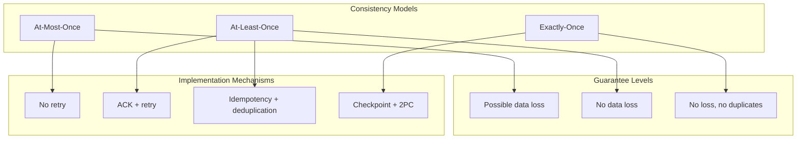
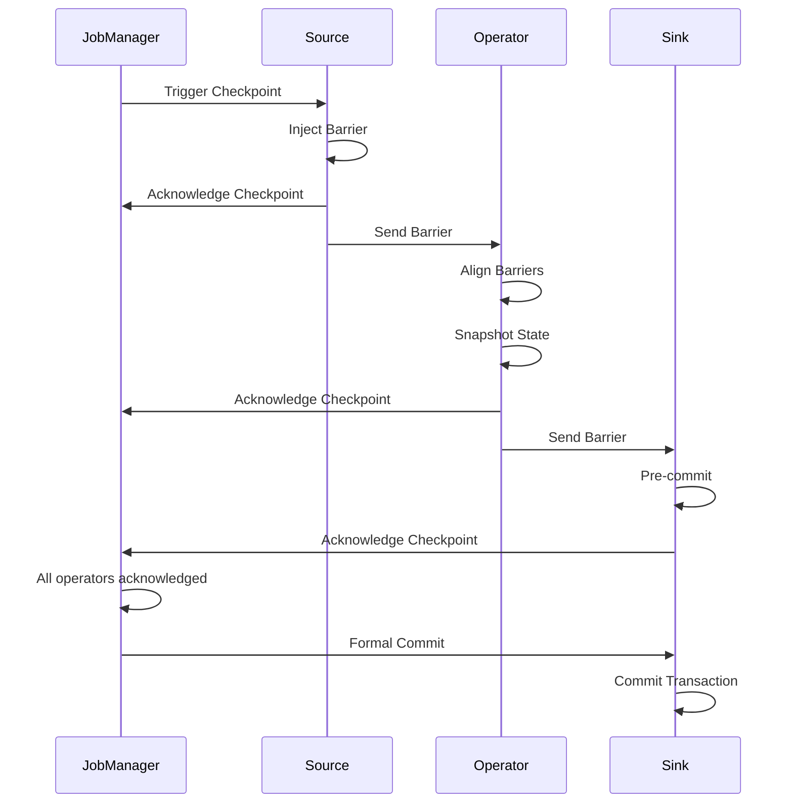

# Consistency Models Explained

> **Stage**: Knowledge/01-concept-atlas | **Prerequisites**: [01.04-state-management-concepts.md](./01.04-state-management-concepts.md) | **Formality Level**: L4-L5 | **Difficulty**: Advanced | **Estimated Reading Time**: 60 minutes

---

## 1. Definitions

### 1.1 Basic Consistency Definitions

**Definition 1.1.1 (Consistency Model)** [Def-K-05-01]

A consistency model defines the observable behavior of data operations in a distributed system, specifying the valid execution order of operations:
$$ConsistencyModel = \{ AtMostOnce, AtLeastOnce, ExactlyOnce \}$$

**Definition 1.1.2 (At-Most-Once)** [Def-K-05-02]

At-Most-Once semantics guarantee that each message is processed at most once:
$$\forall m \in Messages: Count_{process}(m) \leq 1$$

Characteristics:

- May lose data, no duplicate processing
- Simplest to implement
- Suitable for log collection, metrics reporting, and other scenarios tolerant of loss

**Definition 1.1.3 (At-Least-Once)** [Def-K-05-03]

At-Least-Once semantics guarantee that each message is processed at least once:
$$\forall m \in Messages: Count_{process}(m) \geq 1$$

Characteristics:

- No data loss, possible duplicate processing
- Requires idempotency or deduplication mechanism
- Suitable for most business scenarios

**Definition 1.1.4 (Exactly-Once)** [Def-K-05-04]

Exactly-Once semantics guarantee that each message is processed exactly once:
$$\forall m \in Messages: Count_{process}(m) = 1$$

Characteristics:

- No data loss, no duplicate processing
- Complex to implement, with performance overhead
- Suitable for financial transactions, order processing, and other critical businesses

### 1.2 End-to-End Consistency

**Definition 1.2.1 (End-to-End Exactly-Once)** [Def-K-05-05]

End-to-end Exactly-Once across the entire pipeline from data source to data sink:
$$ExactlyOnce_{end-to-end} = ExactlyOnce_{source} \cap ExactlyOnce_{process} \cap ExactlyOnce_{sink}$$

End-to-end consistency requirements:

1. **Replayable Source**: Supports re-consuming data from a specific position
2. **Idempotent or Transactional Processing**: Guarantees no duplicate processing
3. **Transactional Sink**: Guarantees no duplicate output

**Definition 1.2.2 (Idempotency)** [Def-K-05-06]

An idempotent operation produces the same result when executed multiple times:
$$\forall f: Idempotent(f) \iff \forall x: f(f(x)) = f(x)$$

In stream processing, idempotency is an important means to achieve Exactly-Once.

### 1.3 Distributed Snapshots

**Definition 1.3.1 (Checkpoint)** [Def-K-05-07]

A Checkpoint is a consistent snapshot of a distributed system, capturing the global state at a specific moment:
$$Checkpoint = \{ State_{op} \mid op \in Operators \} \cup \{ Position_{source} \}$$

**Definition 1.3.2 (Barrier)** [Def-K-05-08]

A Barrier is a special marker for Checkpointing that flows with the data stream to coordinate snapshots:
$$Barrier = (checkpoint\_id, timestamp)$$

Barrier guarantees:

- All operators align their states at the Barrier
- All data before the Barrier is fully processed
- All data after the Barrier belongs to the next snapshot cycle

---

## 2. Properties

### 2.1 Consistency Hierarchy

**Lemma 2.1.1 (Consistency Implication Relation)** [Lemma-K-05-01]

$$ExactlyOnce \Rightarrow AtLeastOnce$$

$$AtLeastOnce \nRightarrow AtMostOnce \text{ (in general)}$$

**Theorem 2.1.1 (Sufficient Condition for Exactly-Once)** [Thm-K-05-01]

At-Least-Once + Idempotency = Exactly-Once

*Proof*:

Suppose the system guarantees At-Least-Once, then each message is processed at least once.

If all operations are idempotent, then:
$$process(m) = process(process(m)) = process^n(m)$$

Therefore, even if a message is processed multiple times, the final result is the same as processing it once. ∎

### 2.2 Checkpoint Properties

**Lemma 2.2.1 (Completeness of Barrier Alignment)** [Lemma-K-05-02]

Barrier alignment guarantees a consistent view of all operator states.

**Theorem 2.2.1 (Correctness of Checkpoint Recovery)** [Thm-K-05-02]

The state recovered from a Checkpoint is consistent with the state before the failure.

---

## 3. Relations

### 3.1 Relationship Between Consistency and Checkpoint

The Checkpoint mechanism is the foundation for achieving Exactly-Once, guaranteeing state consistency through distributed snapshots.

### 3.2 Relationship Between Consistency and State Management

**Theorem 3.2.1 (State Consistency Requirement)** [Thm-K-05-03]

Exactly-Once requires state updates and outputs to be committed atomically.

### 3.3 Relationship Between Consistency and Sink

**Definition 3.3.1 (Two-Phase Commit Sink)** [Def-K-05-09]

A Two-Phase Commit (2PC) Sink guarantees output atomicity:

1. **Pre-commit Phase**: Writes data to the external system but does not commit
2. **Commit Phase**: Formally commits after Checkpoint completion

---

## 4. Argumentation

### 4.1 Consistency Model Selection

| Scenario | Recommended Consistency | Reason |
|----------|------------------------|--------|
| Log collection | At-Most-Once | Allows data loss, pursues high throughput |
| Metrics statistics | At-Least-Once | No data loss, duplication acceptable |
| Recommendation systems | At-Least-Once | Approximate results acceptable |
| Financial transactions | Exactly-Once | Must be precisely consistent |
| Order processing | Exactly-Once | Cannot double-charge |

### 4.2 Implementation Mechanism Comparison

| Mechanism | Overhead | Complexity | Applicable Scenario |
|-----------|----------|------------|---------------------|
| At-Most-Once | Lowest | Simplest | Loss-tolerant |
| At-Least-Once + Idempotency | Medium | Medium | Most businesses |
| At-Least-Once + Deduplication | Medium | Medium | Non-idempotent operations |
| Exactly-Once (2PC) | High | Complex | Critical business |

---

## 5. Proof / Engineering Argument

### 5.1 Correctness of Two-Phase Commit

**Theorem 5.1.1 (2PC Exactly-Once)** [Thm-K-05-04]

The two-phase commit protocol guarantees Exactly-Once when both the coordinator and participants are available.

*Proof Sketch*:

**Phase 1: Pre-commit**

- The coordinator asks all participants if they can commit
- Participants execute local transactions but do not commit
- Participants reply YES/NO

**Phase 2: Formal Commit**

- If all participants reply YES, the coordinator sends COMMIT
- Participants formally commit upon receiving COMMIT
- If any participant replies NO, the coordinator sends ROLLBACK

**Correctness Analysis**:

1. **Atomicity**: All participants either all commit or all rollback
2. **Consistency**: System state is consistent before and after the transaction
3. **Isolation**: Data is not visible during the pre-commit phase
4. **Durability**: Data is persisted after commit

Therefore, 2PC guarantees end-to-end Exactly-Once. ∎

### 5.2 Correctness of the Checkpoint Algorithm

**Theorem 5.2.1 (Chandy-Lamport Snapshot Correctness)** [Thm-K-05-05]

The Chandy-Lamport algorithm produces a consistent snapshot.

*Proof Sketch*:

**Algorithm Steps**:

1. The coordinator injects Barriers into all Sources
2. Barriers propagate downstream to operators
3. Operators snapshot their states after receiving Barriers from all inputs
4. After snapshot completion, send Barriers downstream

**Consistency Guarantee**:

- The Barrier defines a logical point in time
- All data before the Barrier is processed
- All data after the Barrier is delayed for processing
- Therefore, the snapshot captures a consistent global state

---

## 6. Examples

### 6.1 Flink Exactly-Once Configuration

```java

// [伪代码片段 - 不可直接运行] 仅展示核心逻辑
import org.apache.flink.streaming.api.CheckpointingMode;

// Checkpoint configuration
env.enableCheckpointing(60000); // Checkpoint every minute
env.getCheckpointConfig().setCheckpointingMode(CheckpointingMode.EXACTLY_ONCE);
env.getCheckpointConfig().setMinPauseBetweenCheckpoints(30000);
env.getCheckpointConfig().setCheckpointTimeout(600000);
env.getCheckpointConfig().setMaxConcurrentCheckpoints(1);
env.getCheckpointConfig().enableExternalizedCheckpoints(
    ExternalizedCheckpointCleanup.RETAIN_ON_CANCELLATION);

// Exactly-Once Sink - Kafka
FlinkKafkaProducer<String> kafkaSink = new FlinkKafkaProducer<>(
    "output-topic",
    new SimpleStringSchema(),
    kafkaProps,
    FlinkKafkaProducer.Semantic.EXACTLY_ONCE
);
stream.addSink(kafkaSink);

// Exactly-Once Sink - JDBC (two-phase commit)
JdbcExactlyOnceSink<String> jdbcSink = JdbcExactlyOnceSink.sink(
    "INSERT INTO results (id, value) VALUES (?, ?)",
    (ps, value) -> {
        ps.setString(1, value.getId());
        ps.setString(2, value.getValue());
    },
    JdbcExecutionOptions.builder()
        .withBatchSize(1000)
        .withBatchIntervalMs(200)
        .build(),
    JdbcConnectionOptions.JdbcConnectionOptionsBuilder()
        .withUrl("jdbc:mysql://localhost:3306/mydb")
        .withDriverName("com.mysql.cj.jdbc.Driver")
        .withUsername("user")
        .withPassword("password")
        .build()
);
stream.addSink(jdbcSink);
```

### 6.2 Idempotency Implementation Example

```java
// Idempotent update - ID-based deduplication

import org.apache.flink.api.common.state.ValueState;
import org.apache.flink.api.common.state.ValueStateDescriptor;

public class IdempotentProcessFunction extends KeyedProcessFunction<String, Event, Result> {
    private ValueState<Set<String>> processedIds;

    @Override
    public void open(Configuration parameters) {
        ValueStateDescriptor<Set<String>> descriptor =
            new ValueStateDescriptor<>("processed-ids", TypeInformation.of(new TypeHint<Set<String>>() {}));
        processedIds = getRuntimeContext().getState(descriptor);
    }

    @Override
    public void processElement(Event event, Context ctx, Collector<Result> out)
            throws Exception {
        Set<String> ids = processedIds.value();
        if (ids == null) {
            ids = new HashSet<>();
        }

        if (!ids.contains(event.getId())) {
            // Process event
            Result result = process(event);
            out.collect(result);

            // Record as processed
            ids.add(event.getId());
            processedIds.update(ids);
        }
    }
}
```

### 6.3 Custom Two-Phase Commit Sink

```java
public class TwoPhaseCommitSink extends TwoPhaseCommitSinkFunction<Event, Transaction, Void> {

    public TwoPhaseCommitSink() {
        super(TypeInformation.of(Event.class).createSerializer(new ExecutionConfig()),
              TypeInformation.of(Transaction.class).createSerializer(new ExecutionConfig()));
    }

    @Override
    protected void invoke(Transaction transaction, Event value, Context context) {
        transaction.write(value);
    }

    @Override
    protected Transaction beginTransaction() {
        // Start new transaction
        return new Transaction();
    }

    @Override
    protected void preCommit(Transaction transaction) {
        // Pre-commit - data written but not committed
        transaction.flush();
    }

    @Override
    protected void commit(Transaction transaction) {
        // Formal commit
        transaction.commit();
    }

    @Override
    protected void abort(Transaction transaction) {
        // Rollback
        transaction.rollback();
    }
}
```

---

## 7. Visualizations

### 7.1 Consistency Model Hierarchy



### 7.2 Checkpoint Flow



---

## 8. References


---

## Appendix: Consistency Model Decision Matrix

| Business Scenario | Tolerates Loss | Tolerates Duplicates | Recommended Consistency | Implementation |
|-------------------|----------------|----------------------|-------------------------|----------------|
| Log collection | Yes | No | At-Most-Once | No retry |
| Monitoring metrics | No | Yes | At-Least-Once | ACK + retry |
| User behavior analysis | No | Yes | At-Least-Once | Idempotent write |
| Recommendation results | No | Yes | At-Least-Once | Idempotent update |
| Order processing | No | No | Exactly-Once | 2PC |
| Payment transactions | No | No | Exactly-Once | 2PC + idempotency |
| Inventory deduction | No | No | Exactly-Once | 2PC + optimistic locking |

---

> **Document Info**
>
> - Version: v1.0
> - Last Updated: 2026-04-11
> - Maintainer: Knowledge Team
> - Related Documents: [01.04-state-management-concepts.md](./01.04-state-management-concepts.md), [01.01-stream-processing-fundamentals.md](./01.01-stream-processing-fundamentals.md)
