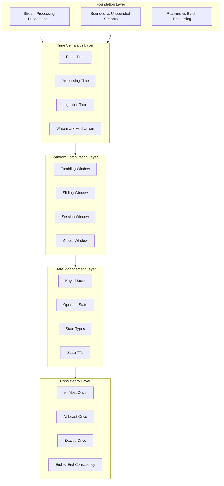

# Concept Atlas

> **Stage**: Knowledge/01-concept-atlas | **Positioning**: Core Concept Knowledge System for Stream Computing | **Difficulty**: Beginner to Advanced | **Target Audience**: Stream computing learners, developers, architects

---

## Table of Contents

The Concept Atlas is the core knowledge system of the stream computing field, systematically organizing foundational concepts, time semantics, window mechanisms, state management, and consistency models.

### Core Document List

| Doc ID | Document Name | Topic | Difficulty | Word Count |
|--------|---------------|-------|------------|------------|
| 01.01 | [stream-processing-fundamentals.md](./01.01-stream-processing-fundamentals.md) | Stream Processing Fundamentals | Beginner | 35,000+ |
| 01.02 | [time-semantics.md](./01.02-time-semantics.md) | Time Semantics in Detail | Intermediate | 43,000+ |
| 01.03 | [window-concepts.md](./01.03-window-concepts.md) | Window Concepts in Detail | Intermediate | 25,000+ |
| 01.04 | [state-management-concepts.md](./01.04-state-management-concepts.md) | State Management Concepts | Advanced | 22,000+ |
| 01.05 | [consistency-models.md](./01.05-consistency-models.md) | Consistency Models | Advanced | 26,000+ |

---

## Concept Atlas Navigation

### Concept Hierarchy



### Concept Dependency Relations

| Concept | Prerequisites | Follow-up Concepts | Related Implementation |
|---------|---------------|--------------------|------------------------|
| Data Stream | None | Time Semantics, Windows | Flink DataStream |
| Event Time | Data Stream | Windows, State | Watermark |
| Window | Event Time, Watermark | State Management | Window Operator |
| State | Window | Consistency | State Backend |
| Exactly-Once | State, Checkpoint | End-to-End Consistency | Two-Phase Commit |

---

## Recommended Learning Paths

### Path 1: Beginner Path (Recommended)

**For**: Beginners in stream computing, no prior experience

```
Week 1: 01.01 Stream Processing Fundamentals
        - Understand the difference between bounded and unbounded streams
        - Master the relationship between stream processing and batch processing
        - Familiarize yourself with stream processing system architecture

Weeks 2-3: 01.02 Time Semantics in Detail
        - Deeply understand the three time semantics
        - Master the Watermark mechanism
        - Learn to handle out-of-order events

Week 4: 01.03 Window Concepts in Detail
        - Master the characteristics of various window types
        - Learn how to choose window strategies
        - Understand window triggering mechanisms

Weeks 5-6: 01.04 State Management Concepts
        - Understand keyed state and operator state
        - Master the use of various state types
        - Learn about State Backend selection

Week 7: 01.05 Consistency Models
        - Understand the three consistency models
        - Master Exactly-Once implementation
        - Understand end-to-end consistency
```

### Path 2: Practitioner Path

**For**: Those with programming experience who need to quickly get started with stream processing development

```
Week 1: Quick read of 01.01 + 01.02
        - Focus on mastering Event Time and Watermark
        - Understand the core challenges of stream processing

Weeks 2-3: Deep dive into 01.03 + 01.04
        - Master window and state programming practices
        - Complete example code exercises

Week 4: Study 01.05
        - Understand Exactly-Once configuration
        - Master failure recovery mechanisms
```

### Path 3: Architect Path

**For**: Architects who need to design stream processing systems

```
Week 1: Full document overview
        - Understand the overall architecture of all concepts
        - Build a complete knowledge system

Weeks 2-3: Deep research into time semantics and consistency
        - Master the time problem in distributed systems
        - Understand the tradeoffs of consistency models

Week 4: Window and state optimization
        - Master performance tuning strategies
        - Understand State Backend selection
```

---

## Core Concepts Quick Reference

### Stream Processing Fundamentals

| Concept | One-Sentence Explanation | Key Points |
|---------|--------------------------|------------|
| Bounded Stream | Data stream over a finite time interval | Completable, sortable, suitable for batch processing |
| Unbounded Stream | Data stream over an infinite time interval | Continuously generated, requires window processing, real-time |
| Event Time | The actual time when the event occurred | Objective, immutable, high accuracy |
| Processing Time | The time when the event is processed | Subjective, depends on system clock, low latency |

### Time Semantics

| Concept | One-Sentence Explanation | Application Scenario |
|---------|--------------------------|----------------------|
| Watermark | Time progress mechanism | Out-of-order handling, window triggering |
| Out-of-Order Event | Event whose arrival order differs from its time order | Network latency, inevitable in distributed systems |
| Allowed Lateness | Time after window triggering to continue accepting late events | Balancing latency and accuracy |

### Window Mechanisms

| Window Type | Characteristics | Typical Application |
|-------------|-----------------|---------------------|
| Tumbling Window | Fixed size, non-overlapping | Fixed-period statistics |
| Sliding Window | Fixed size, overlapping | Trend analysis, smoothing computation |
| Session Window | Dynamic size, activity-based division | User behavior analysis |
| Global Window | Single window | Custom trigger logic |

### State Management

| State Type | Characteristics | Usage Scenario |
|------------|-----------------|----------------|
| ValueState | Single-value storage | Counters, accumulators |
| ListState | List storage | Event buffering, history records |
| MapState | Key-value mapping | Dimension table joins, indexing |
| ReducingState | Incremental reduction | Aggregation computation |

### Consistency Models

| Consistency Level | Guarantee | Cost |
|-------------------|-----------|------|
| At-Most-Once | No duplicates | Possible data loss |
| At-Least-Once | No data loss | Possible duplicates |
| Exactly-Once | Exactly once | Performance overhead |

---

## Key Theorem Index

| Theorem ID | Theorem Name | Document |
|------------|--------------|----------|
| Thm-K-01-01 | Stream-Batch Duality | 01.01 |
| Thm-K-02-01 | Watermark Monotonicity Guarantee | 01.02 |
| Thm-K-02-02 | Watermark Completeness Guarantee | 01.02 |
| Thm-K-03-01 | Window Partition Completeness | 01.03 |
| Thm-K-04-01 | State Consistency | 01.04 |
| Thm-K-05-01 | Exactly-Once Sufficient Condition | 01.05 |

---

## Code Example Index

| Example Type | Location | Description |
|--------------|----------|-------------|
| Basic WordCount | 01.01-6.1 | Real-time word count |
| Watermark Configuration | 01.02-6.1 | Configuration for three time semantics |
| Window Configuration | 01.03-6.1 | Usage of various window types |
| State Usage | 01.04-6.1 | Examples of various state types |
| Exactly-Once Configuration | 01.05-6.1 | Flink Exactly-Once |

---

## Related Resources

### External References

- [Apache Flink Official Documentation](https://nightlies.apache.org/flink/flink-docs-stable/)
- [The Dataflow Model Paper](https://research.google.com/pubs/pub43864.html)
- [Streaming Systems Book](https://www.oreilly.com/library/view/streaming-systems/9781491983867/)

### In-Project Related Documents

- [Knowledge/ Directory](../) - Knowledge structure documents
- [Struct/ Directory](../../Struct/) - Formal theory documents
- [Flink/ Directory](../../Flink/) - Flink-specific documents

---

## Changelog

| Version | Date | Update Content |
|---------|------|----------------|
| v1.0 | 2026-04-11 | Initial version, created 5 core concept documents |

---

> **Document Info**
>
> - Version: v1.0
> - Last Updated: 2026-04-11
> - Maintainer: Knowledge Team
> - Status: Complete
