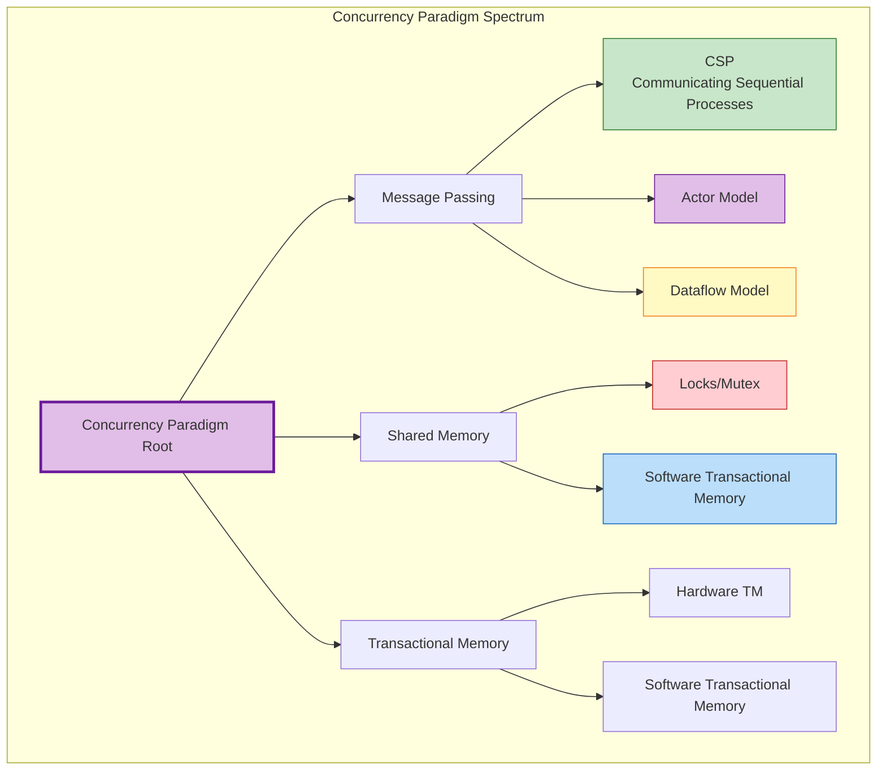
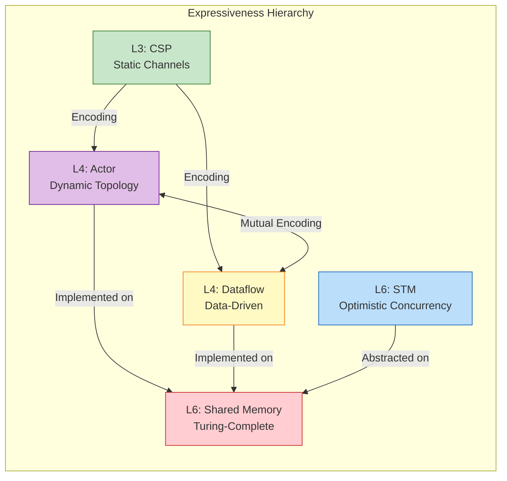
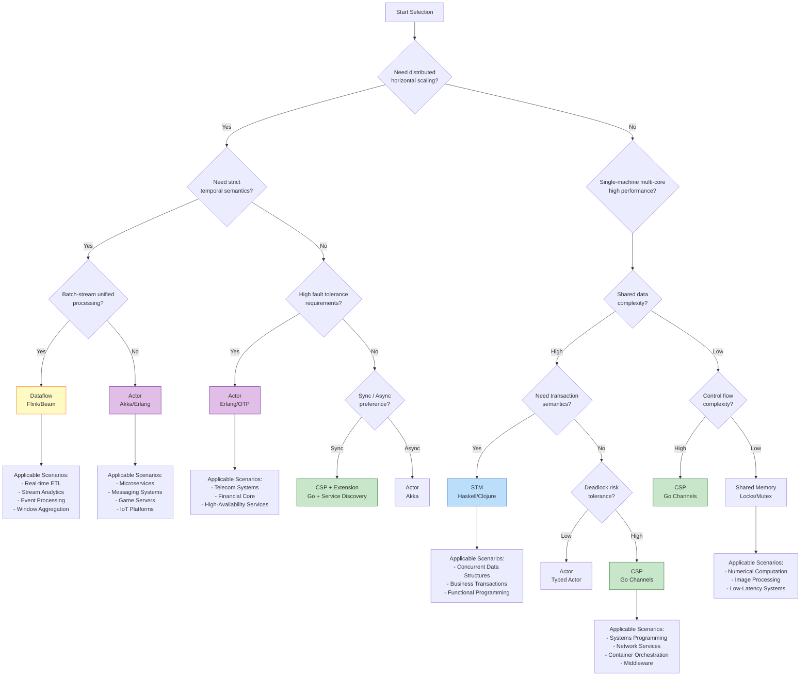
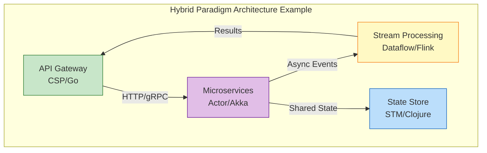
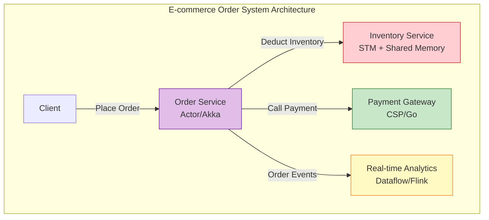
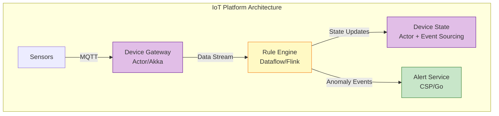
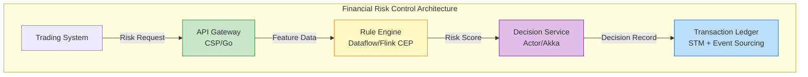
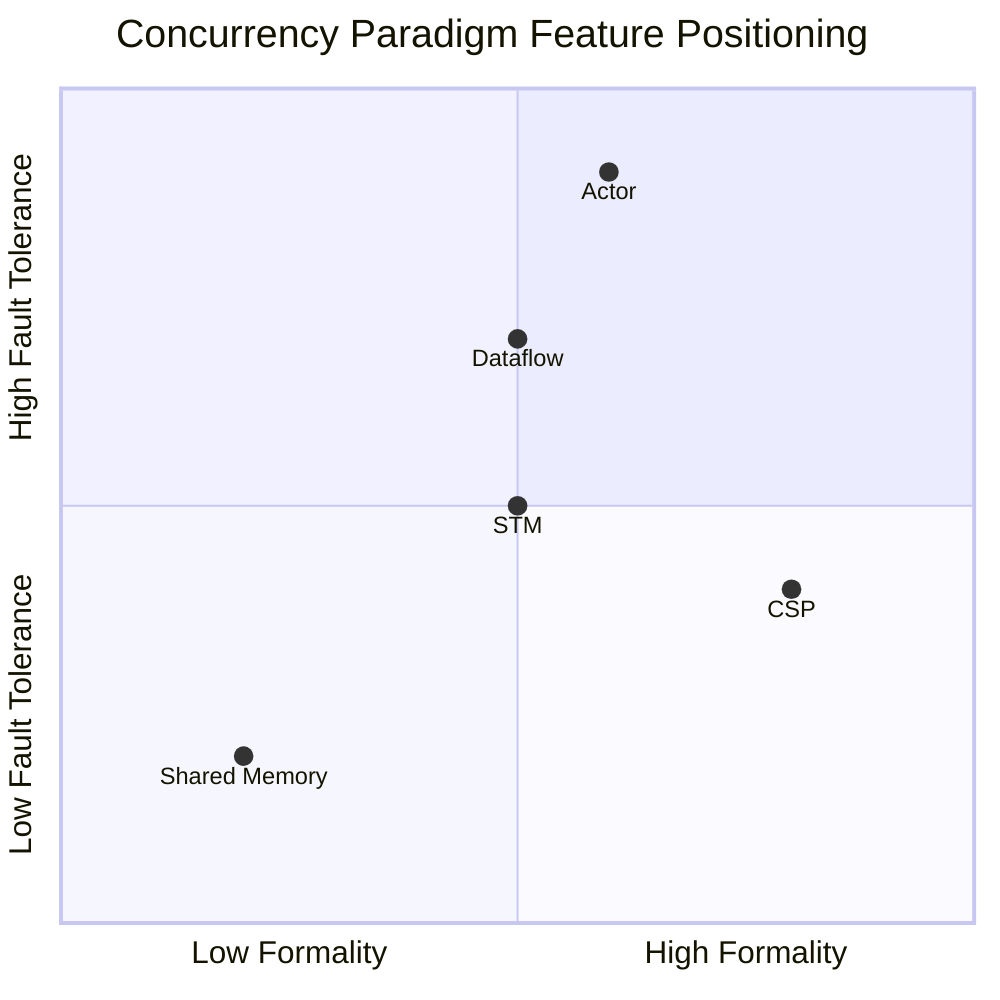

# Concurrency Paradigms Comparison Matrix

> **Stage**: Knowledge | **Prerequisites**: [Related Documents] | **Formalization Level**: L3

> **Document Positioning**: Systematic comparison and selection guide for core paradigms of concurrent computation
> **Formalization Level**: L3-L6 | **Prerequisites**: [../../Struct/01-foundation/]
> **Version**: 2026.04 | **Document Size**: ~20KB

---

## Table of Contents

- [Concurrency Paradigms Comparison Matrix](#concurrency-paradigms-comparison-matrix)
  - [Table of Contents](#table-of-contents)
  - [1. Definitions](#1-definitions)
    - [1.1 Concurrency Paradigm Spectrum](#11-concurrency-paradigm-spectrum)
    - [1.2 Core Definitions of Each Paradigm](#12-core-definitions-of-each-paradigm)
      - [Def-K-01-01. CSP (Communicating Sequential Processes)](#def-k-01-01-csp-communicating-sequential-processes)
      - [Def-K-01-02. Actor Model](#def-k-01-02-actor-model)
      - [Def-K-01-03. Dataflow Model](#def-k-01-03-dataflow-model)
      - [Def-K-01-04. Shared Memory with Locks](#def-k-01-04-shared-memory-with-locks)
      - [Def-K-01-05. Software Transactional Memory (STM)](#def-k-01-05-software-transactional-memory-stm)
    - [1.3 Paradigm Expressiveness Hierarchy](#13-paradigm-expressiveness-hierarchy)
  - [2. Properties / Characteristics](#2-properties-characteristics)
    - [2.1 Core Dimension Definitions](#21-core-dimension-definitions)
      - [Def-K-01-06. Communication Style](#def-k-01-06-communication-style)
      - [Def-K-01-07. State Isolation](#def-k-01-07-state-isolation)
      - [Def-K-01-08. Fault Tolerance](#def-k-01-08-fault-tolerance)
      - [Def-K-01-09. Scalability](#def-k-01-09-scalability)
      - [Def-K-01-10. Composability](#def-k-01-10-composability)
      - [Def-K-01-11. Formality](#def-k-01-11-formality)
    - [2.2 Property Derivation](#22-property-derivation)
      - [Prop-K-01-01. Message Passing vs Shared Memory Complexity Separation](#prop-k-01-01-message-passing-vs-shared-memory-complexity-separation)
      - [Prop-K-01-02. Determinism Advantage of Synchronous Communication](#prop-k-01-02-determinism-advantage-of-synchronous-communication)
      - [Prop-K-01-03. Positive Correlation Between State Isolation and Fault Tolerance](#prop-k-01-03-positive-correlation-between-state-isolation-and-fault-tolerance)
  - [3. Relations / Comparison](#3-relations-comparison)
    - [3.1 Inter-Paradigm Expressiveness Relations](#31-inter-paradigm-expressiveness-relations)
    - [3.2 Relation Details](#32-relation-details)
      - [Relation 1: CSP $\\subset$ Actor (Weaker Expressiveness)](#relation-1-csp-subset-actor-weaker-expressiveness)
      - [Relation 2: Actor $\\approx$ Dataflow (Turing-Complete Equivalence)](#relation-2-actor-approx-dataflow-turing-complete-equivalence)
      - [Relation 3: Shared Memory $\\perp$ STM (Semantically Incomparable)](#relation-3-shared-memory-perp-stm-semantically-incomparable)
      - [Relation 4: Dataflow $\\supset$ Kahn Process Network](#relation-4-dataflow-supset-kahn-process-network)
    - [3.3 Large Comparison Matrices](#33-large-comparison-matrices)
      - [Table 1: Core Feature Comparison Matrix](#table-1-core-feature-comparison-matrix)
      - [Table 2: State and Consistency Comparison Matrix](#table-2-state-and-consistency-comparison-matrix)
      - [Table 3: Fault Tolerance and Reliability Comparison Matrix](#table-3-fault-tolerance-and-reliability-comparison-matrix)
      - [Table 4: Scalability and Performance Comparison Matrix](#table-4-scalability-and-performance-comparison-matrix)
      - [Table 5: Composability and Engineering Characteristics Comparison Matrix](#table-5-composability-and-engineering-characteristics-comparison-matrix)
      - [Table 6: Formalization and Verification Comparison Matrix](#table-6-formalization-and-verification-comparison-matrix)
  - [4. Argumentation / Selection Logic](#4-argumentation-selection-logic)
    - [4.1 Paradigm Selection Decision Tree](#41-paradigm-selection-decision-tree)
    - [4.2 Scenario-Driven Selection Argumentation](#42-scenario-driven-selection-argumentation)
      - [Argument 1: Why High-Fault-Tolerance Systems Should Choose the Actor Model](#argument-1-why-high-fault-tolerance-systems-should-choose-the-actor-model)
      - [Argument 2: Why Stream Processing Systems Should Choose the Dataflow Model](#argument-2-why-stream-processing-systems-should-choose-the-dataflow-model)
      - [Argument 3: Why Systems Programming Should Choose the CSP Model](#argument-3-why-systems-programming-should-choose-the-csp-model)
      - [Argument 4: Why Shared Mutable State Should Choose STM](#argument-4-why-shared-mutable-state-should-choose-stm)
    - [4.3 Hybrid Paradigm Strategy](#43-hybrid-paradigm-strategy)
  - [5. Engineering Examples](#5-engineering-examples)
    - [5.1 Example 1: E-commerce Order System Paradigm Selection](#51-example-1-e-commerce-order-system-paradigm-selection)
    - [5.2 Example 2: IoT Data Processing Platform Paradigm Selection](#52-example-2-iot-data-processing-platform-paradigm-selection)
    - [5.3 Example 3: Financial Risk Control System Paradigm Selection](#53-example-3-financial-risk-control-system-paradigm-selection)
    - [5.4 Counter-Example Analysis](#54-counter-example-analysis)
      - [Counter-Example 1: Misusing Actor Model in Stream Processing Scenarios](#counter-example-1-misusing-actor-model-in-stream-processing-scenarios)
      - [Counter-Example 2: Misusing Shared Memory in High-Concurrency Network Services](#counter-example-2-misusing-shared-memory-in-high-concurrency-network-services)
      - [Counter-Example 3: Misusing STM in Fault-Tolerant Systems](#counter-example-3-misusing-stm-in-fault-tolerant-systems)
  - [6. Visualization Summary](#6-visualization-summary)
    - [6.1 Paradigm Feature Radar Chart Comparison](#61-paradigm-feature-radar-chart-comparison)
    - [6.2 Paradigm Applicable Scenario Summary](#62-paradigm-applicable-scenario-summary)
  - [Related Documents](#related-documents)
    - [Upstream Dependencies](#upstream-dependencies)
    - [Same-Layer Relations](#same-layer-relations)
    - [Downstream Applications](#downstream-applications)
  - [References](#references)

## 1. Definitions

### 1.1 Concurrency Paradigm Spectrum

In the field of concurrent programming, there exist multiple **Concurrency Paradigms** that fundamentally answer the question "how do concurrent units interact." This matrix focuses on five core paradigms:

### 1.2 Core Definitions of Each Paradigm

#### Def-K-01-01. CSP (Communicating Sequential Processes)

**Formal Definition** (see [../../Struct/01-foundation/01.05-csp-formalization.md](../../Struct/01-foundation/01.05-csp-formalization.md)):

$$
\text{CSP} ::= \text{STOP} \mid \text{SKIP} \mid a \to P \mid P \mathbin{\square} Q \mid P \mathbin{\sqcap} Q \mid P \mathbin{|||} Q \mid P \mathbin{\parallel_A} Q
$$

**Core Features**:

- **Synchronous Communication**: Handshake communication through explicit channels
- **Static Naming**: Channel names are fixed at the syntax level
- **External Choice**: Environment determines branch direction ($\square$)
- **Compositional Semantics**: Hierarchical composition through parallel operators

**Representative Implementations**: Go Channels, Occam, FDR Model Checker

---

#### Def-K-01-02. Actor Model

**Formal Definition** (see [../../Struct/01-foundation/01.03-actor-model-formalization.md](../../Struct/01-foundation/01.03-actor-model-formalization.md)):

$$
\mathcal{A} = (\alpha, b, m, \sigma)
$$

where $\alpha$ is an unforgeable address, $b$ is the behavior function, $m$ is the Mailbox, and $\sigma$ is private state.

**Core Features**:

- **Asynchronous Message Passing**: Decouples sending and receiving through Mailbox
- **Location Transparency**: ActorRef hides physical location
- **Supervision Tree**: Hierarchical fault-tolerance structure
- **Dynamic Creation**: Spawn new Actors at runtime

**Representative Implementations**: Erlang/OTP, Akka (Scala/Java), Pekko

---

#### Def-K-01-03. Dataflow Model

**Formal Definition** (see [../../Struct/01-foundation/01.04-dataflow-model-formalization.md](../../Struct/01-foundation/01.04-dataflow-model-formalization.md)):

$$
\mathcal{G} = (V, E, P, \Sigma, \mathbb{T})
$$

where $V$ is the operator set, $E$ the data dependency edges, $P$ the parallelism function, $\Sigma$ the stream type signature, and $\mathbb{T}$ the time domain.

**Core Features**:

- **Data-Driven Execution**: Operator firing determined by input data availability
- **Directed Acyclic Graph**: Computation topology expressed as DAG
- **Time Semantics**: Event time / Processing time / Watermark
- **Stateful Operators**: Key-partitioned stateful computation

**Representative Implementations**: Apache Flink, Apache Beam, TensorFlow Dataflow

---

#### Def-K-01-04. Shared Memory with Locks

**Formal Definition**:

$$
\mathcal{M} = (S, L, \mathcal{O}, \mathcal{T})
$$

where $S$ is the shared state space, $L$ the lock set, $\mathcal{O}$ the operation set, and $\mathcal{T}$ the thread set.

**Core Features**:

- **Explicit Synchronization**: Protects critical sections through locks/mutexes
- **Memory Sharing**: Multiple threads directly access the same memory address
- **Fine-Grained Control**: Developer precisely controls synchronization granularity
- **Risk Exposure**: Deadlocks, race conditions, priority inversion

**Representative Implementations**: Pthreads, Java synchronized, C++ std::mutex

---

#### Def-K-01-05. Software Transactional Memory (STM)

**Formal Definition**:

$$
\text{STM} = (\mathcal{T}, \mathcal{V}, \mathcal{L}, \text{commit}, \text{abort})
$$

where $\mathcal{T}$ is the transaction set, $\mathcal{V}$ version control, and $\mathcal{L}$ the conflict detection mechanism.

**Core Features**:

- **Optimistic Concurrency**: Execute first, validate later; rollback on conflict
- **Atomicity Semantics**: Operations within a transaction are either all committed or all abandoned
- **Composability**: Transactions can be nested and composed
- **Declarative Synchronization**: No explicit lock management needed

**Representative Implementations**: Haskell STM, Clojure refs, Scala STM

---

### 1.3 Paradigm Expressiveness Hierarchy

According to the six-layer expressiveness hierarchy in [../../Struct/01-foundation/01.01-unified-streaming-theory.md](../../Struct/01-foundation/01.01-unified-streaming-theory.md):

| Level | Paradigm | Expressiveness | Decidability |
|-------|----------|----------------|--------------|
| L3 | CSP (Finite State) | Static name communication | PSPACE-complete |
| L4 | Actor, Dataflow | Dynamic topology, mobility | Partially decidable |
| L4 | π-Calculus | Name passing | Undecidable |
| L6 | Shared Memory, STM | Turing-complete | Undecidable |

---

## 2. Properties / Characteristics

### 2.1 Core Dimension Definitions

#### Def-K-01-06. Communication Style

| Dimension | Description |
|-----------|-------------|
| **Synchronous** | Sender blocks until receiver is ready |
| **Asynchronous** | Sender returns immediately; message buffered and forwarded |
| **Direct** | Processes interact directly |
| **Indirect** | Interaction through intermediate medium (channel, Mailbox, shared memory) |

#### Def-K-01-07. State Isolation

| Level | Description |
|-------|-------------|
| **Full Isolation** | No shared state; all state is private |
| **Controlled Sharing** | Access shared state through explicit mechanisms |
| **Full Sharing** | Direct access to shared memory |

#### Def-K-01-08. Fault Tolerance

| Level | Description |
|-------|-------------|
| **Native Support** | Paradigm has built-in fault detection and recovery mechanisms |
| **Framework Support** | Fault tolerance achieved through libraries/frameworks |
| **Application-Level** | Developer implements fault tolerance manually |

#### Def-K-01-09. Scalability

| Dimension | Description |
|-----------|-------------|
| **Vertical Scaling** | Single-machine multi-core utilization |
| **Horizontal Scaling** | Distributed node expansion capability |
| **Elasticity** | Dynamic resource adjustment capability |

#### Def-K-01-10. Composability

| Level | Description |
|-------|-------------|
| **High** | Components freely composable with semantics preserved |
| **Medium** | Composition requires specific constraints |
| **Low** | Composition is difficult and prone to introducing problems |

#### Def-K-01-11. Formality

| Level | Description |
|-------|-------------|
| **Strict** | Complete formal semantics and verification toolchain |
| **Semi-Formal** | Partial formal definitions and type system |
| **Engineering** | Primarily relies on implementation specifications |

---

### 2.2 Property Derivation

#### Prop-K-01-01. Message Passing vs Shared Memory Complexity Separation

**Statement**: Message passing paradigms shift concurrency complexity from "synchronization control" to "protocol design," while shared memory paradigms retain complexity in "synchronization control."

**Derivation**:

1. Shared memory requires explicit lock management (deadlock prevention, granularity selection, priority handling)
2. Message passing eliminates data races through ownership transfer, but introduces message protocol complexity
3. According to π-calculus analysis in [../../Struct/01-foundation/01.02-process-calculus-primer.md](../../Struct/01-foundation/01.02-process-calculus-primer.md), dynamic topology increases expressiveness but reduces decidability
4. Engineering practice shows that message passing has better fault isolation, but latency is typically higher

#### Prop-K-01-02. Determinism Advantage of Synchronous Communication

**Statement**: Synchronous communication (CSP style) is easier to reason about and verify than asynchronous communication.

**Derivation**:

1. Synchronous communication eliminates uncertainty from buffer overflow
2. CSP's trace semantics provide exhaustive verification capabilities (FDR model checker)
3. According to [../../Struct/01-foundation/01.05-csp-formalization.md](../../Struct/01-foundation/01.05-csp-formalization.md), CSP finite state subsets are PSPACE-decidable
4. Asynchronous communication introduces message queue state, causing faster state space explosion
5. But asynchronous communication provides better throughput and decoupling

#### Prop-K-01-03. Positive Correlation Between State Isolation and Fault Tolerance

**Statement**: The degree of state isolation is positively correlated with fault tolerance.

**Derivation**:

1. The Actor model's full state isolation supports single-Actor failures not affecting other Actors (Lemma-S-03-02)
2. Shared memory model's shared state makes fault propagation difficult to bound
3. The Dataflow model's key-partitioned state achieves fault localization
4. Supervision tree mechanisms depend on clear fault boundaries (see Def-S-03-05 in Actor formalization)

---

## 3. Relations / Comparison

### 3.1 Inter-Paradigm Expressiveness Relations

### 3.2 Relation Details

#### Relation 1: CSP $\subset$ Actor (Weaker Expressiveness)

**Argument** (based on [../../Struct/01-foundation/01.02-process-calculus-primer.md](../../Struct/01-foundation/01.02-process-calculus-primer.md) Thm-S-02-01):

- **Encoding Existence**: CSP can be encoded as an Actor subset — model Channel as a single-message-buffer Actor, and synchronous communication is simulated through request-reply protocol
- **Separation Result**: Actor supports dynamic address creation and address passing (mobility); CSP's static channel naming cannot directly express runtime topology changes
- **Conclusion**: CSP $\subset$ Actor (expressiveness level L3 $\subset$ L4)

#### Relation 2: Actor $\approx$ Dataflow (Turing-Complete Equivalence)

**Argument** (based on [../../Struct/01-foundation/01.01-unified-streaming-theory.md](../../Struct/01-foundation/01.01-unified-streaming-theory.md)):

- **Actor → Dataflow**: Actor mapped to KeyedProcessor, Mailbox mapped to Channel, dynamic creation mapped to dynamic operator instances
- **Dataflow → Actor**: Operator mapped to Actor, data edge mapped to async message passing
- **Key Difference**: Actor is control-driven (message triggered), Dataflow is data-driven (data availability triggered)
- **Conclusion**: Both are Turing-complete equivalent, but applicable scenarios differ

#### Relation 3: Shared Memory $\perp$ STM (Semantically Incomparable)

**Argument**:

- Shared Memory is based on pessimistic concurrency control with explicit locks
- STM is based on optimistic concurrency control, rolling back on conflict
- Both are equivalent in expressiveness (both Turing-complete), but semantics are not directly comparable
- STM provides a higher level of abstraction, but may introduce transaction conflict overhead

#### Relation 4: Dataflow $\supset$ Kahn Process Network

**Argument** (based on [../../Struct/01-foundation/01.04-dataflow-model-formalization.md](../../Struct/01-foundation/01.04-dataflow-model-formalization.md)):

- Dataflow model adds explicit parallelism, partitioning strategy, and time semantics on top of KPN
- Dataflow supports stateful window aggregation; KPN assumes pure function transformation
- Dataflow's Watermark mechanism is a temporal primitive not present in KPN

---

### 3.3 Large Comparison Matrices

#### Table 1: Core Feature Comparison Matrix

| Dimension | CSP | Actor | Dataflow | Shared Memory | STM |
|-----------|-----|-------|----------|---------------|-----|
| **Communication Style** | Sync / Optional Async | Async | Data-Driven | Direct Memory Access | Shared within Transaction Boundary |
| **Communication Medium** | Channel (explicit) | Mailbox (implicit) | Data Stream | Shared Memory | Transactional Memory Region |
| **Synchronization Semantics** | Strong sync (handshake) | Weak sync (delivery) | No sync (dependency-driven) | Explicit synchronization primitives | Optimistic concurrency |
| **Buffer Strategy** | Optional bounded buffer | Bounded/unbounded mailbox | Network buffer | No buffer | Version log |

#### Table 2: State and Consistency Comparison Matrix

| Dimension | CSP | Actor | Dataflow | Shared Memory | STM |
|-----------|-----|-------|----------|---------------|-----|
| **State Isolation** | Full isolation | Full isolation | Key-partition isolation | Full sharing | Shared within transaction boundary |
| **State Location** | Channel / Stateless | Inside Actor | Operator local state | Global shared | Versioned snapshot |
| **Consistency Model** | happens-before | Eventual consistency | Exactly-Once (optional) | Sequential consistency | Atomicity |
| **State Persistence** | Requires external implementation | Event sourcing | Checkpoint | Requires external implementation | Log replay |
| **Race Conditions** | None (design avoids) | Avoided by single-threaded processing | Avoided by key partitioning | Requires explicit handling | Transaction detection |

#### Table 3: Fault Tolerance and Reliability Comparison Matrix

| Dimension | CSP | Actor | Dataflow | Shared Memory | STM |
|-----------|-----|-------|----------|---------------|-----|
| **Fault Tolerance Mechanism** | Requires application-level | Supervision tree (native) | Checkpoint (native) | Requires application-level | Transaction rollback |
| **Fault Isolation** | Channel fault propagation | Actor-level isolation | Task-level isolation | Difficult to bound | Transaction-level isolation |
| **Fault Recovery** | No built-in mechanism | Restart strategy | State recovery | No built-in mechanism | Automatic retry |
| **Fault Tolerance Granularity** | Process-level | Actor-level | Subtask-level | None | Transaction-level |
| **Fault Detection** | Channel close awareness | link/monitor mechanism | Heartbeat detection | None | Conflict detection |

#### Table 4: Scalability and Performance Comparison Matrix

| Dimension | CSP | Actor | Dataflow | Shared Memory | STM |
|-----------|-----|-------|----------|---------------|-----|
| **Vertical Scaling** | Excellent (light goroutine) | Excellent (lightweight process) | Good (parallel operators) | Excellent (thread pool) | Good |
| **Horizontal Scaling** | Requires additional framework | Native support | Native support | Requires additional framework | Limited support |
| **Distributed Support** | Requires extension (e.g., Go+etcd) | Native support | Native support | Requires DSM system | Requires distributed STM |
| **Latency Characteristics** | Low latency (sync) | Medium latency (async) | Medium latency (batch) | Extremely low latency | Low latency |
| **Throughput Characteristics** | High throughput (streaming) | High throughput (messages) | Extremely high throughput (batch+stream) | High throughput | Medium throughput |
| **Resource Overhead** | Extremely low (~2KB/goroutine) | Low (~300B/Erlang process) | Medium | Medium | High (version management) |

#### Table 5: Composability and Engineering Characteristics Comparison Matrix

| Dimension | CSP | Actor | Dataflow | Shared Memory | STM |
|-----------|-----|-------|----------|---------------|-----|
| **Composability** | High (channel as first-class citizen) | Medium (requires protocol matching) | High (operator chaining) | Low (prone to deadlock) | High (transaction nesting) |
| **Type Safety** | Channel type checking | Message type checking | Stream type signature | Weak (outside type system) | Language-dependent |
| **Deadlock Risk** | Medium (circular wait) | Low (timeout mechanism) | Low (DAG topology) | High | Low (conflict detection) |
| **Livelock Risk** | Low | Low | Low | Medium | Medium (conflict retry) |
| **Debugging Difficulty** | Medium | Medium | Low (deterministic) | High | Medium |
| **Learning Curve** | Gentle | Medium | Steep | Gentle | Medium |

#### Table 6: Formalization and Verification Comparison Matrix

| Dimension | CSP | Actor | Dataflow | Shared Memory | STM |
|-----------|-----|-------|----------|---------------|-----|
| **Formality Level** | Strict | Semi-formal | Semi-formal | Engineering-focused | Semi-formal |
| **Process Algebra Foundation** | CSP algebra | Asynchronous π-calculus | Kahn networks | None | Transaction logic |
| **Verification Toolchain** | FDR4 (model checking) | Limited (type system) | Limited (static analysis) | Limited (dynamic detection) | Language-dependent tools |
| **Bisimulation Theory** | Failure / trace equivalence | Weak bisimulation | Observational equivalence | None | Transaction equivalence |
| **Decidability** | PSPACE-complete (finite subset) | Undecidable | Undecidable | Undecidable | Implementation-dependent |
| **Formal Proof Support** | Strong | Medium | Limited | Weak | Medium |

---

## 4. Argumentation / Selection Logic

### 4.1 Paradigm Selection Decision Tree

### 4.2 Scenario-Driven Selection Argumentation

#### Argument 1: Why High-Fault-Tolerance Systems Should Choose the Actor Model

**Scenario**: Telecom-grade communication systems (5G core network, SMS gateway)

**Argument**:

1. **Fault Isolation Requirement**: Telecom systems require that a single point of failure does not affect overall service. The Actor model's full state isolation (Def-S-03-01) ensures that a single Actor crash does not destroy other Actors' states.

2. **Supervision Tree Mechanism**: Erlang/OTP's supervision tree (Def-S-03-05) provides declarative fault-tolerance strategies, supporting one_for_one, one_for_all, and other restart strategies, with fault recovery code orthogonally separated from business code.

3. **Hot Update Requirement**: Telecom systems need to update without stopping service. The Actor model supports runtime code hot-swapping; the supervision tree can coordinate restarts between old and new versions.

4. **Counter-Example**: If using Shared Memory, shared state corruption may cause cascading failures, and fault boundaries are difficult to bound.

**Conclusion**: For systems with extremely high fault-tolerance requirements, the Actor model's native fault-tolerance abstraction is the best choice.

---

#### Argument 2: Why Stream Processing Systems Should Choose the Dataflow Model

**Scenario**: Large-scale real-time data analytics (ad bidding, user behavior analysis)

**Argument**:

1. **Time Semantics Requirement**: Business logic depends on event occurrence time rather than processing time. The Dataflow model's event time semantics (Def-S-04-04) and Watermark mechanism provide correct processing capability for out-of-order data.

2. **State Consistency**: Exactly-Once semantics (see [../../Struct/01-foundation/01.04-dataflow-model-formalization.md](../../Struct/01-foundation/01.04-dataflow-model-formalization.md)) are guaranteed through Checkpoint mechanisms, meeting data analytics accuracy requirements.

3. **Horizontal Scaling**: Dataflow's parallelism function $P: V \to \mathbb{N}^+$ (Def-S-04-01) supports dynamically adjusting parallelism based on data volume, achieving elastic scaling.

4. **Window Abstraction**: Window operators (Def-S-04-05) slice infinite streams into finite computation units, supporting Tumbling, Sliding, Session, and other window types.

5. **Counter-Example**: If using the Actor model to implement the same functionality, one would need to manually implement time semantics, window management, and state recovery, with extremely high complexity.

**Conclusion**: For large-scale stream processing, the time semantics and fault-tolerance mechanisms provided by the Dataflow model are irreplaceable.

---

#### Argument 3: Why Systems Programming Should Choose the CSP Model

**Scenario**: Cloud-native infrastructure (Kubernetes, container runtime)

**Argument**:

1. **Resource Efficiency**: Go goroutines have ~2KB initial stacks; Actor processes ~300B + JVM overhead (Go comparison analysis). CSP is lighter in resource-constrained environments.

2. **Synchronization Semantics**: Systems programming requires precise synchronization control. CSP's synchronous channels provide natural happens-before relationships (see [../../Struct/01-foundation/01.05-csp-formalization.md](../../Struct/01-foundation/01.05-csp-formalization.md)), simplifying concurrent reasoning.

3. **select Multiplexing**: Go's `select` statement provides native multi-way selection capability, extremely efficient for implementing timeouts, cancellations, and priority control.

4. **Simple Deployment**: Go compiles to static binaries without runtime dependencies, suitable for containerized deployment.

5. **Counter-Example**: If using the Actor model, async messages' Mailbox scheduling increases latency, and requires an additional runtime system.

**Conclusion**: For resource-sensitive, simply deployable systems programming, the CSP model is a better choice.

---

#### Argument 4: Why Shared Mutable State Should Choose STM

**Scenario**: Concurrent data structures (red-black trees, skip lists) implementation

**Argument**:

1. **Composability Requirement**: Composite operations of concurrent data structures (e.g., query then modify) require atomicity guarantees. STM's transaction composability allows multiple operations to be encapsulated as a single transaction.

2. **Deadlock Avoidance**: Explicit locks in complex data structure operations are prone to deadlock. STM's optimistic concurrency control avoids deadlock through conflict detection and retry.

3. **Fine-Grained Control**: STM supports fine-grained read-write version control, outperforming coarse-grained locks in read-heavy scenarios.

4. **Counter-Example**: If using Shared Memory + Locks, lock granularity must be carefully designed, and composite operation atomicity is difficult to guarantee.

**Conclusion**: For shared mutable state requiring transaction semantics, STM provides a safer abstraction.

---

### 4.3 Hybrid Paradigm Strategy

Modern complex systems often adopt a **hybrid paradigm** strategy:

**Layered Selection Principles**:

| Layer | Recommended Paradigm | Rationale |
|-------|----------------------|-----------|
| Network Access Layer | CSP | High concurrency, low latency, resource efficient |
| Business Service Layer | Actor | Fault tolerance, elasticity, distributed friendly |
| Data Processing Layer | Dataflow | Time semantics, state management, horizontal scaling |
| State Management Layer | STM/Shared Memory | Transaction consistency, performance optimization |

---

## 5. Engineering Examples

### 5.1 Example 1: E-commerce Order System Paradigm Selection

**Scenario Requirements**:

- High-concurrency order creation
- Inventory consistency guarantee
- Real-time order status update
- Fault tolerance and recovery

**Paradigm Selection**:

**Selection Rationale**:

1. **Order Service (Actor)**: Order lifecycle requires fault-tolerant processing; supervision tree ensures order Actor recovery after crash. Order Actor encapsulates order state, avoiding sharing.

2. **Inventory Service (STM)**: Inventory deduction requires transactional guarantees (check inventory → deduct → record); STM ensures composite operation atomicity.

3. **Payment Gateway (CSP)**: Payment interface calls require timeout control and circuit breaker mechanisms; Go's `select` + `context` provide comprehensive timeout and cancellation semantics.

4. **Real-time Analytics (Dataflow)**: Order data requires real-time aggregation statistics; Flink's window operators and Exactly-Once semantics guarantee statistical accuracy.

---

### 5.2 Example 2: IoT Data Processing Platform Paradigm Selection

**Scenario Requirements**:

- Million-level device connections
- High-throughput sensor data
- Real-time anomaly detection
- Device state management

**Paradigm Selection**:

**Selection Rationale**:

1. **Device Gateway (Actor)**: Each device maps to an Actor, naturally supporting million-level concurrent connections. Supervision tree handles device Actor failures.

2. **Rule Engine (Dataflow)**: Sensor data is an unbounded stream requiring Watermark mechanism for out-of-order data. Window operators support sliding window anomaly detection.

3. **Device State (Actor + Event Sourcing)**: Device state changes are persisted through event sourcing, supporting state backtracking and auditing.

4. **Alert Service (CSP)**: Alerts require low-latency notification; Go's high-concurrency network processing capability meets requirements.

---

### 5.3 Example 3: Financial Risk Control System Paradigm Selection

**Scenario Requirements**:

- Millisecond-level latency requirements
- Complex rule computation
- Transaction consistency
- Auditing and compliance

**Paradigm Selection**:

**Selection Rationale**:

1. **API Gateway (CSP)**: Financial trading is extremely latency-sensitive; Go's low GC overhead and high-performance network stack meet requirements.

2. **Rule Engine (Dataflow CEP)**: Complex Event Processing (CEP) pattern matching requires windows and sequence operations; Flink CEP provides declarative pattern matching.

3. **Decision Service (Actor)**: Decision logic requires fault tolerance and high availability; supervision tree ensures continuous service availability.

4. **Transaction Ledger (STM + Event Sourcing)**: Transaction records require atomicity and immutability; STM guarantees transaction consistency, and event sourcing provides audit trails.

---

### 5.4 Counter-Example Analysis

#### Counter-Example 1: Misusing Actor Model in Stream Processing Scenarios

**Scenario**: Attempting to implement a real-time ad bidding system with Akka Actor

**Problems**:

1. Actor lacks built-in time semantics, making it difficult to handle ad bidding time windows
2. Mailbox's FIFO order is inconsistent with event time order, causing incorrect bidding results
3. Need to manually implement Exactly-Once semantics, with extremely high complexity
4. Lacks Watermark mechanism, unable to determine when bidding results can be output

**Consequences**: High system latency, poor accuracy, difficult maintenance.

**Correct Approach**: Adopt the Dataflow model (Flink), leveraging its native time semantics and window operators.

---

#### Counter-Example 2: Misusing Shared Memory in High-Concurrency Network Services

**Scenario**: Attempting to implement a high-performance gateway with Java synchronized

**Problems**:

1. Coarse-grained locks cause severe thread contention and low throughput
2. Fine-grained lock design is complex and prone to deadlock
3. Thread context switch overhead is large, with unstable latency
4. Difficult to horizontally scale to multiple machines

**Consequences**: System performance bottlenecks are obvious, unable to support high concurrency.

**Correct Approach**: Adopt the CSP model (Go), leveraging goroutine and channel lightweight concurrency.

---

#### Counter-Example 3: Misusing STM in Fault-Tolerant Systems

**Scenario**: Attempting to implement a distributed transaction coordinator with STM

**Problems**:

1. STM mainly targets single-machine shared memory; distributed STM implementations are complex and immature
2. Distributed transactions need to span the network; STM's conflict detection is difficult to extend to distributed scenarios
3. Lacks fault recovery mechanisms; transaction coordinator state recovery is difficult after crash

**Consequences**: Poor system reliability, data consistency difficult to guarantee.

**Correct Approach**: Adopt the Actor model (Saga pattern) or Dataflow model (two-phase commit), leveraging their native distributed support.

---

## 6. Visualization Summary

### 6.1 Paradigm Feature Radar Chart Comparison

### 6.2 Paradigm Applicable Scenario Summary

| Scenario Feature | Recommended Paradigm | Alternative |
|------------------|----------------------|-------------|
| High-fault-tolerance distributed systems | Actor | Dataflow |
| Large-scale stream processing | Dataflow | Actor |
| High-performance network services | CSP | Shared Memory |
| Concurrent data structures | STM | Shared Memory + Locks |
| Batch-stream unified processing | Dataflow | Actor + Batch framework |
| Real-time control systems | CSP | Shared Memory |
| Complex transaction processing | STM | Actor + Saga |

---

## Related Documents

### Upstream Dependencies

- [../../Struct/01-foundation/01.01-unified-streaming-theory.md](../../Struct/01-foundation/01.01-unified-streaming-theory.md) — Unified streaming theory and six-layer expressiveness hierarchy
- [../../Struct/01-foundation/01.02-process-calculus-primer.md](../../Struct/01-foundation/01.02-process-calculus-primer.md) — Process calculus foundations (CCS, CSP, π-calculus)

### Same-Layer Relations

- [../../Struct/01-foundation/01.03-actor-model-formalization.md](../../Struct/01-foundation/01.03-actor-model-formalization.md) — Strict Actor model formalization
- [../../Struct/01-foundation/01.04-dataflow-model-formalization.md](../../Struct/01-foundation/01.04-dataflow-model-formalization.md) — Strict Dataflow model formalization
- [../../Struct/01-foundation/01.05-csp-formalization.md](../../Struct/01-foundation/01.05-csp-formalization.md) — Strict CSP formalization
- [../../Struct/01-foundation/01.06-petri-net-formalization.md](../../Struct/01-foundation/01.06-petri-net-formalization.md) — Petri net formalization (can serve as Shared Memory formalization reference)

### Downstream Applications

- [../../release/v3.0.0/docs/NAVIGATION-INDEX.md](../../release/v3.0.0/docs/NAVIGATION-INDEX.md) — Project comprehensive navigation index
- [../../Struct/05-comparative-analysis/05.01-go-vs-scala-expressiveness.md](../../Struct/05-comparative-analysis/05.01-go-vs-scala-expressiveness.md) — Go vs Scala expressiveness comparison

---

## References

---

*Document Version: 2026.04 | Formalization Level: L3-L6 | Status: Core Skeleton*
*Document Size: ~20KB | Related Matrices: 6 large comparison tables | Decision Trees: 1*

---

*Document Version: v1.0 | Created: 2026-04-20*
