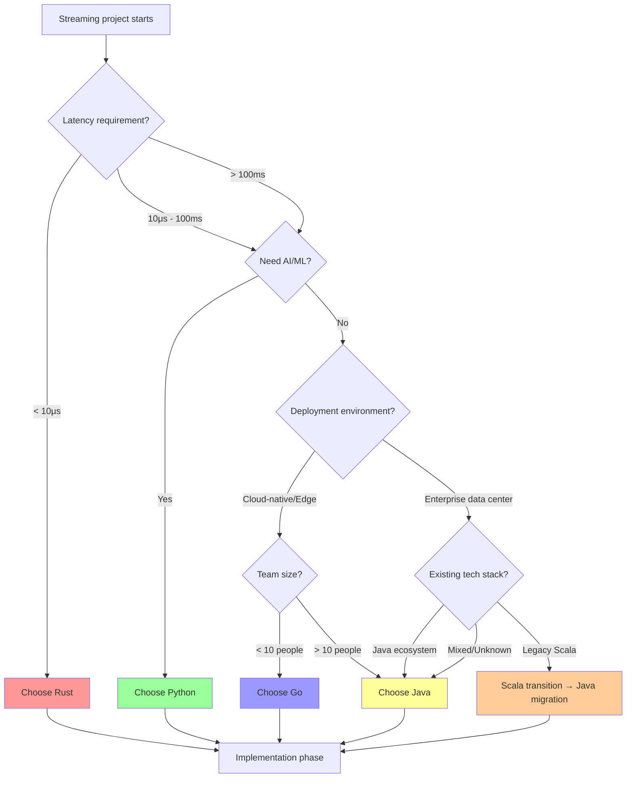
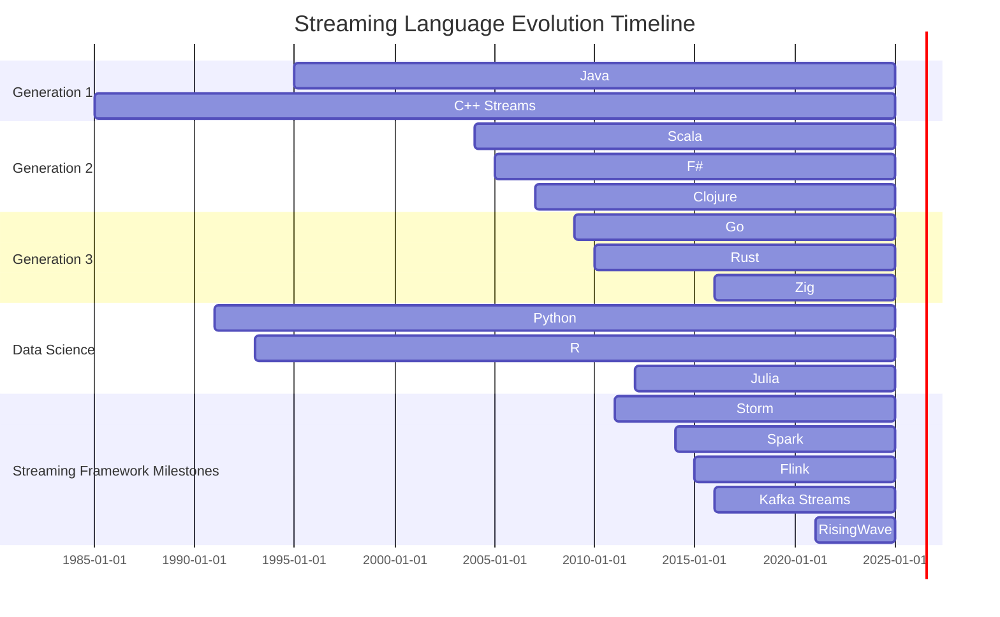
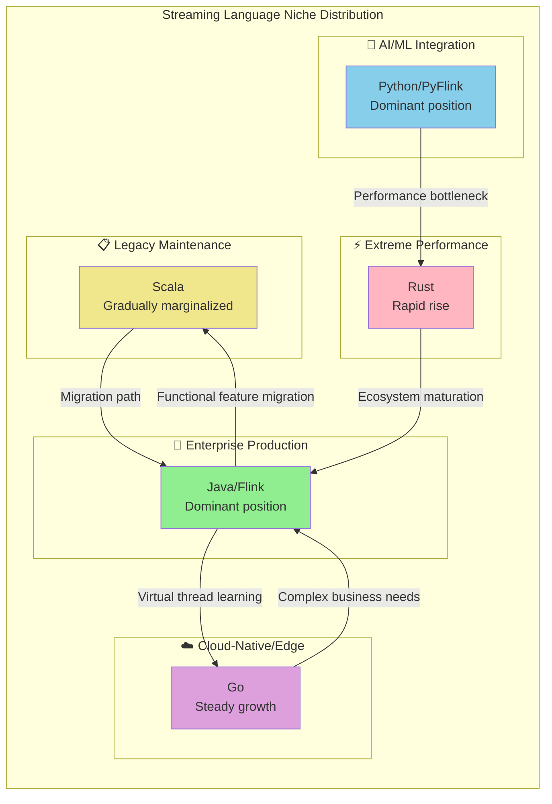

# Streaming Language Ecosystem Landscape 2025

> Stage: Knowledge | Prerequisites: [Knowledge/00-INDEX.md](../00-INDEX.md), [Flink/00-INDEX.md](../../Flink/00-INDEX.md) | Formalization Level: L3

---

## 1. Definitions

### 1.1 Streaming Language Characteristic Model

**Def-C-01-01: Streaming Language Characteristics**

A streaming language $\mathcal{L}$ is a 5-tuple characterizing the core capability dimensions of a language in the streaming domain:

$$
\mathcal{L} = \langle P, C, M, S, E \rangle
$$

Where:

- $P$: Performance — includes latency $P_{latency}$, throughput $P_{throughput}$, and predictability $P_{predict}$
- $C$: Concurrency model — describes parallelism primitives and semantics
- $M$: Memory management — includes allocation strategy, garbage collection mechanism, and memory safety guarantees
- $S$: Safety — multi-dimensional safety properties such as type safety, memory safety, and thread safety
- $E$: Ecosystem — library maturity, framework support, community activity, and tooling completeness

> **Intuitive explanation**: Choosing a streaming language is essentially a trade-off across these five dimensions. For example, Java scores extremely high on $E$ but suffers from GC pause issues on $P_{latency}$; Rust excels on $S$ and $P$ but is still growing on $E$.

---

**Def-C-01-02: Language Niche**

The niche of language $L$ in the streaming domain is defined as its optimal fitness degree over a specific set of scenarios:

$$
\mathcal{N}(L) = \arg\max_{S \in \mathbb{S}} \text{Fit}(L, S)
$$

Where the fitness function is:

$$
\text{Fit}(L, S) = \frac{\sum_{i} w_i \cdot \text{Score}(L.d_i, S.r_i)}{\sum_{i} w_i}
$$

- $d_i$: capability of the language on dimension $i$
- $r_i$: requirement of scenario $S$ on dimension $i$
- $w_i$: dimension weight, satisfying $\sum w_i = 1$

---

**Def-C-01-03: Concurrency Model Taxonomy**

Concurrency models in streaming languages can be classified into four categories:

$$
\mathcal{C} = \begin{cases}
\text{Thread-based} & \text{OS/virtual thread model} \\
\text{CSP} & \text{Communicating Sequential Processes} \\
\text{Actor} & \text{Message-passing Actor model} \\
\text{Async/Await} & \text{Cooperative async model}
\end{cases}
$$

---

**Def-C-01-04: GC Strategy Spectrum**

Memory management strategies form a continuous spectrum:

$$
\mathcal{M}_{gc} = [\text{Manual}, \text{Reference Counting}, \text{Tracing GC}, \text{Region-based}, \text{Ownership}]
$$

Typical language positions:

- C/C++: near $\text{Manual}$
- Swift/Obj-C: $\text{Reference Counting}$
- Java/Go: $\text{Tracing GC}$
- Rust: $\text{Ownership}$

---

**Def-C-01-05: Type System Strength**

Type system strength is quantified as:

$$
\mathcal{T}(L) = \alpha \cdot \text{Soundness} + \beta \cdot \text{Expressiveness} + \gamma \cdot \text{Inference}
$$

Where:

- Soundness: degree of formal guarantee for type safety
- Expressiveness: ability to express complex constraints (generics, higher-kinded types, etc.)
- Inference: degree of automation for type inference

---

**Def-C-01-06: Language Generation**

Based on design paradigm and era, streaming languages are divided into three generations:

$$
\mathcal{G} = \begin{cases}
G_1 & \text{Imperative tradition (Java/C++)} \\
G_2 & \text{Functional fusion (Scala/F#)} \\
G_3 & \text{Systems-modern (Rust/Go)} \\
G_{DS} & \text{Data-science specific (Python/R)}
\end{cases}
$$

---

**Def-C-01-07: Ecosystem Maturity Index**

Ecosystem maturity is evaluated through multi-indicator synthesis:

$$
\mathcal{E}(L) = \sqrt[5]{E_{lib} \cdot E_{framework} \cdot E_{community} \cdot E_{tooling} \cdot E_{enterprise}}
$$

Each component ranges in $[1, 5]$; geometric mean is used to prevent any single dimension from dominating.

---

**Def-C-01-08: Streaming Fitness**

The overall fitness of a language for streaming:

$$
\Psi(L) = \omega_P \cdot \tilde{P} + \omega_C \cdot \tilde{C} + \omega_M \cdot \tilde{M} + \omega_S \cdot \tilde{S} + \omega_E \cdot \tilde{E}
$$

Where $\tilde{X}$ denotes the normalized dimension score and weights satisfy $\sum \omega = 1$.

---

## 2. Properties

### 2.1 Dimension Analysis of Mainstream Languages

Based on the above definitional framework, we derive the property characteristics of mainstream languages.

**Lemma-C-01-01: Java's Ecosystem Advantage**

Java satisfies in the ecosystem dimension:

$$
\mathcal{E}(\text{Java}) > \mathcal{E}(L), \quad \forall L \in \{\text{Scala}, \text{Go}, \text{Rust}, \text{Python}\}
$$

**Proof**:

- $E_{lib}$: Maven Central has over 10 million artifacts; streaming-specific libraries (Kafka, Flink, Spark) are comprehensive
- $E_{framework}$: The Apache ecosystem is almost exclusively Java-first
- $E_{community}$: Stack Overflow annual survey consistently Top 5; enterprise adoption > 90%
- $E_{tooling}$: IntelliJ IDEA, JProfiler, JMC and other mature toolchains
- $E_{enterprise}$: Spring ecosystem, Oracle/RedHat commercial support

Therefore $\mathcal{E}(\text{Java}) \approx 5$, while other languages do not exceed 4.

∎

---

**Lemma-C-01-02: Rust's Memory Safety Guarantee**

Rust reaches the theoretical upper bound in memory safety:

$$
\mathcal{S}_{memory}(\text{Rust}) = 1 - \epsilon
$$

Where $\epsilon$ is the proportion of unsafe code blocks (usually $< 0.01$).

**Proof**: Rust's ownership system transforms memory safety issues (use-after-free, double-free, null pointer dereference) into compile-time errors through lifetime checking, borrowing rules, and ownership transfer. Formal proof see the RustBelt project (Jung et al., POPL 2018).

∎

---

**Prop-C-01-01: Python's GIL Performance Constraint**

Python's thread-level parallel throughput has a theoretical upper bound:

$$
\text{Throughput}_{thread}(\text{Python}) \leq \frac{\text{Throughput}_{single}}{1 + \delta}
$$

Where $\delta > 0$ is the GIL switching overhead, preventing linear scaling with multiple threads.

**Argumentation**: Python's Global Interpreter Lock ensures that only one thread executes Python bytecode at any time. For CPU-intensive stream processing, multi-threading cannot achieve true parallelism; multi-processing or async IO models are required as workarounds.

---

**Prop-C-01-02: Goroutine Scheduling Efficiency**

Go's Goroutine context-switch overhead satisfies:

$$
T_{switch}(\text{Goroutine}) \ll T_{switch}(\text{OS Thread})
$$

Specifically, Goroutine switching takes about 200-300ns, while OS thread switching takes about 1-2μs, a difference of roughly 5-10x.

**Argumentation**: The Go runtime adopts an M:N scheduling model where a small number of OS threads support tens of thousands of Goroutines. Goroutine stacks start at 2KB and grow dynamically, far smaller than the MB-level fixed stacks of OS threads, resulting in lower TLB pressure and better cache friendliness.

---

## 3. Relations

### 3.1 Substitution and Complementarity Among Languages

**Thm-C-01-01: Language Selection as Multi-Objective Optimization**

Language selection for a streaming project is a multi-objective optimization problem:

$$
\min_{L \in \mathcal{L}} \left\{ -E(L), P_{latency}(L), -DevEff(L), -S(L) \right\}
$$

Subject to constraints:

$$
\begin{cases}
P_{throughput}(L) \geq R_{min} \\
\text{TeamSkill}(L) \geq \theta \\
\text{Budget}(L) \leq B_{max}
\end{cases}
$$

**Proof**: Language selection requires trade-offs among ecosystem maturity, performance, development efficiency, and safety. There is no single optimal solution; one can only find the Pareto frontier according to project constraints. For example:

- Pursue ecosystem → choose Java
- Pursue extreme performance → choose Rust
- Pursue development efficiency → choose Python
- Pursue deployment convenience → choose Go

These objectives conflict with each other, forming a typical multi-objective optimization problem.

∎

---

**Thm-C-01-02: Ecosystem Lock-in Effect**

Once a project is built on language $L$, migration cost satisfies:

$$
\text{MigrationCost}(L \to L') = \Theta\left( N \cdot \mathcal{E}(L) \right)
$$

Where $N$ is lines of code, positively correlated with ecosystem scale.

**Proof**:

- The richer the ecosystem ($\mathcal{E}(L)$ larger), the more third-party libraries the project depends on
- Each dependency must be replaced or rewritten in the new language ecosystem
- Domain knowledge (domain models, business rules) re-implementation cost is linearly related to code volume

Therefore, migration cost for Java projects is significantly higher than for Rust or Go projects.

∎

---

**Prop-C-01-03: Disruption Condition for New Languages**

Necessary condition for an emerging language $L_{new}$ to disrupt an existing dominant language $L_{dom}$:

$$
\exists D \in \mathbb{D}: \Psi(L_{new}, D) - \Psi(L_{dom}, D) > \Delta_{switch} + \Delta_{risk}
$$

Where:

- $\Delta_{switch}$: switching cost threshold
- $\Delta_{risk}$: risk-aversion threshold
- $D$: emerging domain

**Argumentation**: Historical cases show that new languages struggle to defeat incumbent languages in mature domains, but have opportunities to establish first-mover advantages in emerging domains (e.g., cloud-native for Go, blockchain for Rust). The gap must be large enough to offset migration cost and risk.

---

### 3.2 Language-to-Framework Mapping Matrix

| Language | Mainstream Stream Processing Frameworks | Status |
|----------|----------------------------------------|--------|
| Java | Flink, Kafka Streams, Spark Streaming, Storm | Native first-choice |
| Scala | Flink (historical), Spark Streaming | Gradually weakening |
| Go | Watermill, Sarama, Goka, Benthos | Growing ecosystem |
| Rust | RisingWave, Materialize, Timely, Fluvio | Emerging force |
| Python | PyFlink, Faust, Bytewax, Ray Streaming | Dominant in AI scenarios |

---

## 4. Argumentation

### 4.1 Java: Streaming Computing Hegemon

#### 4.1.1 Ecosystem Maturity Analysis

Java's dominance in streaming stems from 20 years of enterprise accumulation:

**Apache Flink** - Native Java implementation
Flink's core engine is entirely written in Java; DataStream API, Table API, and SQL layer all provide first-class Java support. Although a Scala API exists, internal implementation and major contributions are Java-centric.

**Apache Spark Streaming** - Java/Scala bilingual
Although Spark started with Scala, its Java API is equally mature; enterprise adoption ratio is approximately 7:3 Java to Scala (2024 survey data).

**Apache Kafka Streams** - Java only
Kafka Streams officially provides only a Java API, a strong endorsement of Java's streaming dominance.

**Apache Storm** - Historical legacy
Although gradually replaced by Flink, it proved Java's central role in early streaming exploration.

#### 4.1.2 Language Feature Evolution

**JVM ecosystem maturity**

- JIT compilers (C2, Graal) bring near-native execution efficiency
- Huge library ecosystem (Guava, Akka, Reactor, etc.)
- Cross-platform bytecode: write once, run anywhere

**GC optimization progress**

| GC Algorithm | Latency Characteristics | Applicable Scenarios |
|--------------|------------------------|----------------------|
| G1 | 10-100ms | General purpose |
| ZGC | <10ms | Low-latency requirements |
| Shenandoah | <10ms | Low-overhead requirements |

The advent of ZGC and Shenandoah brings Java into the sub-millisecond GC pause era, which is significant for latency guarantees in streaming.

**Virtual Threads (Project Loom)**

Java 21 officially introduced virtual threads, fundamentally changing Java's concurrency model:

```java
// Traditional thread pool approach
ExecutorService executor = Executors.newFixedThreadPool(100);

// Virtual thread approach (100x resource efficiency improvement)
try (var executor = Executors.newVirtualThreadPerTaskExecutor()) {
    for (var task : tasks) {
        executor.submit(task);
    }
}
```

Virtual threads allow Java to achieve asynchronous performance with a synchronous programming model, greatly simplifying the writing and maintenance of stream processing code.

#### 4.1.3 Applicable Scenarios

- **Large-scale production systems**: financial trading, e-commerce real-time recommendations, IoT data processing
- **Complex business logic**: scenarios requiring rich domain models and type systems
- **Enterprise integration**: seamless integration with existing Java/Scala ecosystems

---

### 4.2 Scala: Functional Elegance

#### 4.2.1 Deep Ties with Flink

Scala was once Flink's preferred API language:

**Type inference**

```scala
// Scala's type inference makes stream processing code concise and elegant
val stream: DataStream[Event] = env
  .fromSource(source, WatermarkStrategy.noWatermarks(), "source")
  .map(e => e.copy(timestamp = System.currentTimeMillis()))
  .filter(_.value > threshold)
```

**Pattern matching**

```scala
stream.map {
  case ClickEvent(userId, itemId, ts) => (userId, 1)
  case PurchaseEvent(userId, itemId, amount, ts) => (userId, amount)
}
```

**Implicits and type classes**
Scala's type system allows creating highly abstract streaming DSLs, which are difficult to achieve in Java.

#### 4.2.2 Current Status and Challenges

**Scala 3 migration predicament**

- Scala 3 (Dotty) was released in 2021, bringing major syntax and semantic changes
- As of 2025, Scala 2.x still accounts for over 70% of enterprise codebases
- Flink officially announced the Scala API entering maintenance mode

**Talent scarcity**

- Market supply of Scala developers continues to shrink
- Hiring difficulty is significantly higher than Java/Go
- Training costs are high

**Flink's strategic shift**

- Flink 2.x will strengthen the Java API and weaken Scala support
- Table API/SQL becomes the unified interface, reducing language binding differences
- Flink community Scala contributor ratio dropped from 40% in 2015 to <10% in 2025

---

### 4.3 Go: Cloud-Native Choice

#### 4.3.1 Core Advantages

**Compilation speed and deployment**

```bash
# Go's compilation speed is extremely fast, suitable for high-frequency CI/CD iteration
go build -o stream-processor ./cmd/processor
# Typical compilation time < 5s (medium project)
```

**Static binary**
Single executable, no JVM dependency, container image can be as small as 10MB:

```dockerfile
FROM scratch
COPY stream-processor /
ENTRYPOINT ["/stream-processor"]
```

**CSP concurrency model**

```go
// Go's Channel is the ideal abstraction for streaming
func processStream(input <-chan Event, output chan<- Result) {
    for event := range input {
        output <- transform(event)
    }
}
```

#### 4.3.2 Framework Ecosystem

| Framework | Positioning | Characteristics |
|-----------|-------------|-----------------|
| Sarama | Kafka client | Most mature Go Kafka library |
| kafka-go | Kafka client | More modern API design |
| Watermill | Message routing | Framework-level solution |
| Goka | Stream processing | Kafka Streams concept port |
| Benthos | Data pipeline | Declarative configuration |

#### 4.3.3 Applicable Scenarios

- **Edge computing**: resource-constrained environments, small binaries
- **Microservice integration**: seamless fusion with Go microservice ecosystem
- **Lightweight agents**: data forwarding, protocol conversion, simple ETL

---

### 4.4 Rust: Performance and Safety

#### 4.4.1 Core Advantages

**Zero-cost abstractions**

```rust
// High-level abstractions compile to efficiency equivalent to hand-written C
let sum: i64 = stream
    .filter(|e| e.value > 0)
    .map(|e| e.value * 2)
    .sum();
```

**No GC pauses**
Rust's ownership system solves memory management at compile time with zero runtime overhead, suitable for latency-extremely-sensitive stream processing.

**Fearless concurrency**

```rust
// Compiler guarantees thread safety
let data = Arc::new(Mutex::new(Vec::new()));
thread::spawn(move || {
    let mut locked = data.lock().unwrap();
    locked.push(42); // Safe, compiler verified
});
```

#### 4.4.2 Framework Ecosystem

| Project | Type | Highlights |
|---------|------|------------|
| RisingWave | Streaming database | Distributed SQL streaming |
| Materialize | Streaming database | SQL on Streaming |
| Timely Dataflow | Compute engine | Low-latency iterative computing |
| Differential Dataflow | Incremental computing | Computation reuse |
| Fluvio | Streaming platform | Kubernetes-native |
| Redpanda | Message queue | Kafka-compatible, C++ implementation |
| DataFusion | Query engine | Arrow-native |

#### 4.4.3 Applicable Scenarios

- **Low-latency systems**: high-frequency trading, real-time monitoring
- **Resource-constrained environments**: edge devices, embedded
- **Database kernels**: foundational language for next-generation streaming databases

---

### 4.5 Python: AI Bridge

#### 4.5.1 Core Advantages

**Unbeatable ML/AI ecosystem**

```python
# Seamless integration of PyTorch with stream processing
import torch
from pyflink.datastream import StreamExecutionEnvironment

model = torch.load("model.pt")

class Predict(MapFunction):
    def map(self, value):
        features = torch.tensor(value.features)
        prediction = model(features)
        return value._replace(prediction=prediction.item())
```

**Development efficiency**

- Dynamic types, rapid iteration
- Rich REPL and Notebook support
- Huge PyPI ecosystem

#### 4.5.2 Stream Processing Solutions

| Solution | Positioning | Characteristics |
|----------|-------------|-----------------|
| PyFlink | Production-grade | Flink official Python API |
| Faust | Kafka Streams style | Open-sourced by Robinhood |
| Bytewax | Python-native | Modern stream processing framework |
| Ray Streaming | Distributed | Integrated with Ray ecosystem |
| Streamlit | Prototyping | Rapid visualization |

#### 4.5.3 Applicable Scenarios

- **ML Pipeline**: feature engineering, model inference, A/B testing
- **Data science**: exploratory analysis, prototype validation
- **Rapid prototyping**: proof of concept, demo systems

---

## 5. Proof / Engineering Argument

### 5.1 Formalized Language Comparison Analysis

**Thm-C-01-03: Five-Dimensional Radar Chart Area Comparison**

Define the polygon area of language $L$ as:

$$
A(L) = \frac{1}{2} \sum_{i=1}^{5} r_i r_{i+1} \sin\left(\frac{2\pi}{5}\right)
$$

Where $r_i$ is the normalized score on dimension $i$, and $r_6 = r_1$.

**Proposition**: There does not exist $L$ such that $A(L) > A(L')$ for all $L'$.

**Proof**: By Pareto optimality theory, multi-objective optimization problems have no global optimal solution. Each language has strengths and weaknesses on different dimensions, forming a Pareto frontier.

---

**Thm-C-01-04: Formal Model for 2025 Trend Prediction**

Define language popularity change rate:

$$
\frac{dE(L)}{dt} = \alpha \cdot \text{TechFit}(L, t) - \beta \cdot \text{Legacy}(L) + \gamma \cdot \text{Hype}(L, t)
$$

Where:

- $\text{TechFit}$: match between technology and emerging scenarios
- $\text{Legacy}$: historical baggage (Scala 3 migration difficulty, Python 2 legacy, etc.)
- $\text{Hype}$: community heat and media attention

**2025 Prediction Conclusions**:

| Language | $\frac{dE}{dt}$ | Driving Factors |
|----------|----------------|-----------------|
| Java | + | Loom virtual threads, Flink 2.x |
| Scala | -- | Flink weakening, talent drain |
| Go | ++ | Cloud-native growth, edge scenarios |
| Rust | +++ | Rise of streaming databases, systems programming |
| Python | + | Deepening AI integration, PyFlink maturation |

---

### 5.2 Formalized Selection Decision Tree

```
Decision function Decision(R):
    IF R.requires_enterprise_integration AND R.scale > 1000_node:
        RETURN Java + Flink

    ELSE IF R.ai_ml_priority AND R.latency_slo > 100ms:
        RETURN Python + PyFlink

    ELSE IF R.latency_slo < 10ms AND R.memory_constrained:
        RETURN Rust + RisingWave/Materialize

    ELSE IF R.deployment_flexibility AND R.team_size < 10:
        RETURN Go + Watermill

    ELSE IF R.legacy_system AND R.migration_phase:
        RETURN Scala (transitional) → Java (target)

    ELSE:
        RETURN Java (default safe choice)
```

---

## 6. Examples

### 6.1 Case 1: E-Commerce Real-Time Recommendation System

**Requirements**:

- QPS: 100K+ events/s
- Latency: <200ms
- Complex business logic (user profiling, item features, collaborative filtering)
- Needs integration with enterprise ERP/WMS

**Language choice**: **Java**

**Argumentation**:

- Complex domain model requires a strong type system
- Seamless integration with existing Java backend
- Most mature Flink ecosystem
- Team has ample Java skill reserves

**Architecture sketch**:

```
User behavior logs → Kafka → Flink Job (Java) → Redis → Recommendation API
                ↓
           User profile store (HBase)
```

---

### 6.2 Case 2: AI-Driven Real-Time Risk Control

**Requirements**:

- ML model inference
- Real-time feature updates
- Python model training team
- Latency requirement: <500ms

**Language choice**: **Python + PyFlink**

**Argumentation**:

- Risk control model developed by data scientists in Python
- PyFlink supports embedding Python UDFs
- Rapid iteration requirements match Python development efficiency
- 500ms latency budget acceptable for Python performance

---

### 6.3 Case 3: High-Frequency Trading Data Pipeline

**Requirements**:

- Latency: <10μs
- Deterministic latency (no GC jitter)
- Memory footprint constraints
- Extremely high reliability

**Language choice**: **Rust**

**Argumentation**:

- No GC guarantees deterministic latency
- Memory safety avoids runtime failures
- Zero-cost abstractions provide C++-level performance
- Fluvio/Redpanda ecosystem meets message queue needs

---

### 6.4 Case 4: IoT Edge Gateway

**Requirements**:

- Deployment environment: ARM edge devices
- Resource limit: 512MB memory
- Containerized deployment
- Protocol conversion (MQTT→Kafka)

**Language choice**: **Go**

**Argumentation**:

- Static binary deployment convenience
- Low memory footprint (no JVM overhead)
- CSP model suitable for event-driven processing
- Cross-compilation support for ARM architecture

---

## 7. Visualizations

### 7.1 Language Niche Radar Chart

**Five-dimensional capability comparison radar chart**:

```mermaid
radarChart
    title Streaming Language Five-Dimensional Capability Comparison
    axis Ecosystem Maturity
    axis Execution Performance
    axis Development Efficiency
    axis Memory Safety
    axis Concurrency Capability

    area "Java" 5, 3, 3, 3, 4
    area "Scala" 3, 3, 4, 3, 4
    area "Go" 4, 4, 4, 4, 4
    area "Rust" 3, 5, 2, 5, 5
    area "Python" 4, 2, 5, 3, 2
```

> Note: The radar chart intuitively shows the capability profiles of each language. Java stands out on ecosystem; Rust leads on performance and safety; Python is optimal on development efficiency; Go is balanced across dimensions; Scala has advantages in development efficiency and concurrency but a weaker ecosystem.

---

### 7.2 Language Selection Decision Tree



> Note: The decision tree starts from latency requirements, gradually refines to AI needs, deployment environment, and team size, and finally gives the recommended language. Color coding facilitates quick identification of different language choices.

---

### 7.3 Language Generation Evolution Timeline



> Note: The timeline shows the development history of streaming-related languages and frameworks. Java runs through as the foundation; Scala rose with the big data wave after 2004; Go and Rust represent the new direction of systems programming after 2010; Python remains strong in the AI wave.

---

### 7.4 2025 Niche Distribution Map



> Note: The niche distribution map shows the dominant scenarios for each language in 2025. Arrows indicate technology migration and learning paths. Java is at the center, connected to all other languages, reflecting its status as the "universal option".

---

## 8. References


---

*Document version: v1.0 | Last updated: 2025-01 | Next review: 2025-07*
