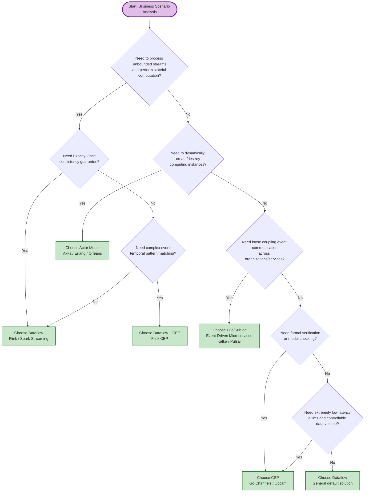
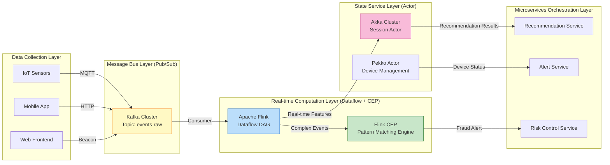

# Streaming Computation Models Concept Map

> **Stage**: Knowledge/01-concept-atlas | **Prerequisites**: [../../Struct/01-foundation/01.02-process-calculus-primer.md](../../Struct/01-foundation/01.02-process-calculus-primer.md), [../../Struct/01-foundation/01.04-dataflow-model-formalization.md](../../Struct/01-foundation/01.04-dataflow-model-formalization.md) | **Formalization Level**: L3 (Engineering Concept Layer)

---

## Table of Contents

- [Streaming Computation Models Concept Map](#streaming-computation-models-concept-map)
  - [Table of Contents](#table-of-contents)
  - [1. Definitions](#1-definitions)
    - [Def-K-01-01 Streaming Computation Model](#def-k-01-01-streaming-computation-model)
    - [Def-K-01-02 Dataflow Model](#def-k-01-02-dataflow-model)
    - [Def-K-01-03 Actor Model](#def-k-01-03-actor-model)
    - [Def-K-01-04 CSP (Communicating Sequential Processes)](#def-k-01-04-csp-communicating-sequential-processes)
    - [Def-K-01-05 Pub/Sub (Publish-Subscribe)](#def-k-01-05-pubsub-publish-subscribe)
    - [Def-K-01-06 CEP (Complex Event Processing)](#def-k-01-06-cep-complex-event-processing)
    - [Def-K-01-07 Microservices Streaming](#def-k-01-07-microservices-streaming)
  - [2. Properties](#2-properties)
    - [Prop-K-01-01 (Determinism Guarantee of Dataflow)](#prop-k-01-01-determinism-guarantee-of-dataflow)
    - [Prop-K-01-02 (Local Order Consistency of Actor)](#prop-k-01-02-local-order-consistency-of-actor)
    - [Prop-K-01-03 (Built-in Backpressure of CSP)](#prop-k-01-03-built-in-backpressure-of-csp)
    - [Prop-K-01-04 (Throughput-Latency Trade-off of Pub/Sub)](#prop-k-01-04-throughput-latency-trade-off-of-pubsub)
    - [Prop-K-01-05 (Expressiveness and State Explosion of CEP)](#prop-k-01-05-expressiveness-and-state-explosion-of-cep)
  - [3. Relations](#3-relations)
    - [Relation 1: Dataflow `≈` Actor (Turing-Complete Equivalence)](#relation-1-dataflow-actor-turing-complete-equivalence)
    - [Relation 2: Dataflow `↦` CSP (Async vs Sync Continuum)](#relation-2-dataflow-csp-async-vs-sync-continuum)
    - [Relation 3: Pub/Sub `⊂` Actor (Decoupling as Special Case of Address Anonymization)](#relation-3-pubsub-actor-decoupling-as-special-case-of-address-anonymization)
    - [Relation 4: CEP `⊂` Dataflow (Pattern Matching as Syntactic Sugar for Stateful Operators)](#relation-4-cep-dataflow-pattern-matching-as-syntactic-sugar-for-stateful-operators)
    - [Relation 5: Dataflow `↦` DBSP (Algebraic Encoding of Incremental Computation)](#relation-5-dataflow-dbsp-algebraic-encoding-of-incremental-computation)
    - [Figure 3.1 Streaming Computation Model Classification Mind Map](#figure-31-streaming-computation-model-classification-mind-map)
  - [4. Argumentation](#4-argumentation)
    - [Lemma 4.1 (Static Topology Model Scheduling Optimizability)](#lemma-41-static-topology-model-scheduling-optimizability)
    - [Lemma 4.2 (Dynamic Topology Model Scaling Elasticity)](#lemma-42-dynamic-topology-model-scaling-elasticity)
    - [Table 4.1 Six-Dimension Comparison Matrix of Streaming Computation Models](#table-41-six-dimension-comparison-matrix-of-streaming-computation-models)
  - [5. Proof / Engineering Argument](#5-proof-engineering-argument)
    - [Theorem 5.1 (Sufficient Conditions for Streaming Computation Model Selection)](#theorem-51-sufficient-conditions-for-streaming-computation-model-selection)
    - [Figure 5.1 Streaming Computation Model Selection Decision Tree](#figure-51-streaming-computation-model-selection-decision-tree)
    - [Lemma 5.2 (Composition Boundary of Hybrid Models)](#lemma-52-composition-boundary-of-hybrid-models)
  - [6. Examples](#6-examples)
    - [Example 6.1 Dataflow Example: Real-time User Behavior Analysis (Flink)](#example-61-dataflow-example-real-time-user-behavior-analysis-flink)
    - [Example 6.2 Actor Example: IoT Device Session Management (Akka)](#example-62-actor-example-iot-device-session-management-akka)
    - [Example 6.3 CSP Example: High-Concurrency Rate Limiter (Go)](#example-63-csp-example-high-concurrency-rate-limiter-go)
    - [Example 6.4 CEP + Pub/Sub Hybrid Example: Financial Risk Control Real-time Alerting](#example-64-cep-pubsub-hybrid-example-financial-risk-control-real-time-alerting)
  - [7. Visualizations](#7-visualizations)
    - [Figure 7.1 Hybrid Architecture Reference: End-to-End Stream Processing System](#figure-71-hybrid-architecture-reference-end-to-end-stream-processing-system)
  - [8. References](#8-references)

## 1. Definitions

### Def-K-01-01 Streaming Computation Model

**Definition**: A streaming computation model is a class of computational paradigm abstractions designed for **real-time processing of unbounded, continuously arriving data sequences**. Its core characteristic is expressing computation as the flow of data among topological nodes, rather than the traditional "input → compute → output" batch processing mode.

**Engineering Intuition**: Imagine an automated assembly line — parts (data records) continuously enter the conveyor belt, and each workstation (operator/process) processes passing parts at a fixed rhythm. The stream model focuses on "how to organize this assembly line," rather than "when a particular batch order will be completed."

**Formal Anchor**: The theoretical foundation of this definition comes from the continuous function semantics and FIFO channel assumption in Kahn Process Networks (KPN)[^1]. See [Struct/01-foundation/01.04-dataflow-model-formalization.md](../../Struct/01-foundation/01.04-dataflow-model-formalization.md) for details.

---

### Def-K-01-02 Dataflow Model

**Definition**: The Dataflow model expresses computation as a directed graph $G=(V,E)$, where vertices $V$ represent **operators** and edges $E$ represent **data dependency channels**. Data flows along edges in the form of discrete records or tokens, and operators fire when inputs are available.

**Variant Hierarchy**:

- **SDF (Synchronous Dataflow)**: Static production-consumption rates, suitable for DSP and embedded real-time systems.
- **DDF (Dynamic Dataflow)**: Dynamic production-consumption rates, supporting data-dependent control flow (conditional branching, iteration). This is the theoretical basis for general stream processing engines (Flink, Spark Streaming)[^2].

**Key Engineering Properties**:

- Determinism: Kahn semantics guarantee unique output history, independent of scheduling order.
- Explicit Parallelism: Each operator can be configured with independent parallelism $\lambda: V \to \mathbb{N}^+$.
- Built-in Time Semantics: Supports three time abstractions: EventTime, ProcessingTime, and IngestionTime.

---

### Def-K-01-03 Actor Model

**Definition**: The Actor model abstracts computation as a set of independent, autonomous entities (Actors) that interact via **asynchronous message passing**. Each Actor encapsulates private state, a mailbox, and a behavior function. Throughout its lifecycle, it follows a serial processing pattern of "receive one message → update state → send zero or more messages"[^3].

**Formal Correspondence**: In Aπ (Actor π-Calculus), an Actor configuration can be represented as $\langle \alpha, \mu, P \rangle$, where $\alpha$ is a unique address, $\mu$ is the message queue, and $P$ is the behavior process. See [Struct/01-foundation/01.03-actor-model-formalization.md](../../Struct/01-foundation/01.03-actor-model-formalization.md) for details.

**Engineering Intuition**: Actors are like independent office workers communicating via mail. Each worker has their own desk (state) and inbox (mailbox); they cannot be interrupted while processing mail (single-thread semantics), and can send new mail to any colleague at a known address (dynamic topology).

---

### Def-K-01-04 CSP (Communicating Sequential Processes)

**Definition**: CSP is a concurrency model based on **synchronous handshake communication**. Processes interact through explicitly named channels, and both sender and receiver must be ready on the channel simultaneously for communication to complete. CSP emphasizes compositional algebra (parallel composition, choice, hiding) and trace semantics analysis[^4].

**Engineering Intuition**: CSP's synchronous communication is like a phone call — both parties must pick up the handset simultaneously to talk. If one party is not ready, the other blocks waiting. This "rendezvous" mechanism naturally provides backpressure and synchronization points.

**Formal Anchor**: The core CSP syntax includes $P \mathbin{\Box} Q$ (external choice), $P \parallel_A Q$ (synchronous parallel), and $P \setminus A$ (hiding). See [Struct/01-foundation/01.05-csp-formalization.md](../../Struct/01-foundation/01.05-csp-formalization.md) for details.

---

### Def-K-01-05 Pub/Sub (Publish-Subscribe)

**Definition**: Pub/Sub is a message distribution paradigm centered on **topics**. Publishers send messages to logical topics, and subscribers receive messages asynchronously by subscribing to topics. Publishers and subscribers are completely decoupled and need not know of each other's existence[^5].

**Difference from Actor**: Pub/Sub is "address-anonymized" message passing — messages are not sent to a specific Actor, but to a logical broadcast channel. This enables many-to-many communication, but loses direct control over the message receiver's lifecycle.

---

### Def-K-01-06 CEP (Complex Event Processing)

**Definition**: CEP is a stream computing variant that identifies **complex patterns** over raw event streams. It treats event sequences as temporal structures, deriving high-level business events from low-level events through declarative rules (e.g., "A occurs and B occurs within 5 minutes, with no C in between")[^6].

**Relation to Dataflow**: CEP can be viewed as a "pattern matching DSL" layer atop the Dataflow model. In Flink, the CEP library compiles pattern rules into an NFA (Non-deterministic Finite Automaton), which is then embedded into DataStream operators for execution.

---

### Def-K-01-07 Microservices Streaming

**Definition**: Microservices streaming is not a single theoretical model, but an architectural style that uses streaming data interaction as the primary communication path between services. It typically combines Pub/Sub (event bus), REST/gRPC (synchronous requests), and Saga (long-running transactions) patterns, emphasizing organizational boundaries, independent deployment, and eventual consistency[^7].

**Engineering Intuition**: If Dataflow is "neural signal transmission within a single brain," microservices streaming is "multiple independent brains exchanging information through a public bulletin board." The focus shifts from "correctness of a single computation graph" to "contracts and governance across service boundaries."

---

## 2. Properties

### Prop-K-01-01 (Determinism Guarantee of Dataflow)

**Statement**: Under Kahn semantics, as long as channels satisfy the FIFO assumption and operators are Scott-continuous functions, the output of a Dataflow graph for a given input history is uniquely determined, independent of the physical execution order of operators.

**Engineering Significance**: This means we can freely adjust operator scheduling strategies, parallelism allocation, or execution locations (local/remote/container) without changing result correctness. This is the theoretical foundation that enables Flink to perform transparent scaling and fault recovery.

**Source**: This property directly follows from the fixed-point semantics of Kahn Process Networks. See [Struct/02-properties/02.01-determinism-in-streaming.md](../../Struct/02-properties/02.01-determinism-in-streaming.md).

---

### Prop-K-01-02 (Local Order Consistency of Actor)

**Statement**: For a single Actor instance, message processing order strictly equals the enqueue order of the Mailbox (FIFO), and state modification order is consistent with message processing order. Therefore, no data races exist within a single Actor.

**Engineering Significance**: Developers need not use lock mechanisms within a single Actor. However, cross-Actor state consistency requires causal ordering of message passing or external coordination mechanisms (such as two-phase commit).

**Boundary Conditions**: If using a custom Mailbox (e.g., priority queue) or a Dispatcher that schedules multiple Actors onto the same thread pool, the above guarantee may need re-examination.

---

### Prop-K-01-03 (Built-in Backpressure of CSP)

**Statement**: Because CSP's synchronous communication requires both sender and receiver to be ready simultaneously, when the receiver processes slower than the sender, the sender naturally blocks. This blocking behavior is equivalent to a zero-overhead backpressure mechanism.

**Engineering Significance**: In Go's channel implementation, unbuffered channels directly provide CSP-style backpressure; buffered channels are an engineering compromise between KPN and CSP — the sender blocks only when the buffer is full.

---

### Prop-K-01-04 (Throughput-Latency Trade-off of Pub/Sub)

**Statement**: Pub/Sub systems improve throughput by introducing persistent message logs (e.g., Kafka's Log) and batched consumption, at the cost of increased end-to-end latency. This trade-off can be formalized as: $\text{Latency} \propto \text{BatchSize} / \text{Throughput}$.

**Engineering Significance**: In scenarios requiring extremely low latency (<10ms), pure Pub/Sub is often not the optimal choice; Dataflow (such as Flink's direct network transmission) or CSP's synchronous channels should be preferred.

---

### Prop-K-01-05 (Expressiveness and State Explosion of CEP)

**Statement**: The pattern expressiveness of CEP is proportional to the number of states in its internal state machine. CEP engines supporting Kleene closure ($A+$), time windows, and negation patterns (no $B$ after $A$) have NFA state spaces that grow exponentially in the worst case.

**Engineering Significance**: Overly complex CEP rules (e.g., nested `followedBy` more than 5 levels deep) lead to surging memory usage and increased matching latency. In engineering practice, it is recommended to decompose complex patterns into multiple simple sub-patterns, connected through intermediate Topics.

---

## 3. Relations

### Relation 1: Dataflow `≈` Actor (Turing-Complete Equivalence)

**Argument**:

- **Dataflow → Actor Encoding**: Each Dataflow operator can be mapped to an Actor, data edges between operators mapped to message channels between Actors, and KeyedState mapped to private Actor state.
- **Actor → Dataflow Encoding**: Each Actor mapped to a stateful operator in the Dataflow graph, Mailbox mapped to input buffer, ActorRef address mapped to virtual partition key.

**Differences**:

| Dimension | Dataflow | Actor |
|-----------|----------|-------|
| Topology Dynamics | Static DAG (immutable at runtime) | Dynamic (can spawn new Actors) |
| State Sharing | Keyed State (shared by key partition) | Strictly private |
| Fault Tolerance Strategy | Checkpoint + Replay | Supervision Tree |
| Time Abstraction | EventTime / Watermark | No built-in time model |

> **Inference [Theory→Model]**: Dataflow and Actor are equivalent in expressive power in the Turing-complete sense, but engineering selection should focus on "whether topology is dynamic" and "whether time semantics matter"[^8].
>
> **Further Reading**: [DBSP Theory Framework: Algebraic Foundation of Incremental View Maintenance](../../Struct/06-frontier/dbsp-theory-framework.md) unifies database queries and stream processing under the Z-set algebraic structure, providing a rigorous mathematical foundation for incremental computation in the Dataflow model.

---

### Relation 2: Dataflow `↦` CSP (Async vs Sync Continuum)

**Argument**:

- FIFO channels in Kahn networks can be encoded as infinite buffer processes in CSP: $B = \mu X.(in?x \to out!x \to X)$.
- The difference: CSP defaults to synchronous communication, while Dataflow defaults to asynchronous communication (operators are decoupled through bounded/unbounded buffers).
- Flink's Network Buffer Pool and Go's buffered channels are both engineering compromises between the two.

---

### Relation 3: Pub/Sub `⊂` Actor (Decoupling as Special Case of Address Anonymization)

**Argument**:

- A "Topic" in Pub/Sub can be viewed as a special Broker Actor: all Publishers send messages to this Actor, and the Broker broadcasts messages to all Subscribers.
- Therefore, Pub/Sub is a restricted usage of the Actor model: the Publisher does not know the Subscriber's specific address, only the Broker's address.
- This anonymization brings loose coupling, but loses the Actor model's ability to "directly know the receiver's lifecycle."

---

### Relation 4: CEP `⊂` Dataflow (Pattern Matching as Syntactic Sugar for Stateful Operators)

**Argument**:

- The underlying execution model of CEP engines (e.g., Flink CEP) is still Dataflow. Pattern rules are compiled into state machine operators and embedded in the DataStream DAG.
- CEP adds time window semantics and NFA state transition logic on top of Dataflow, but does not extend Dataflow's basic expressive power.

---

### Relation 5: Dataflow `↦` DBSP (Algebraic Encoding of Incremental Computation)

**Argument**:

- The DBSP theory framework unifies database queries and stream processing under the **Z-set** algebraic structure. By introducing the differential operator $\nabla$ and integral operator $\nabla^{-1}$, it establishes a complete theory of incremental computation.
- The incremental semantics of the Dataflow model (e.g., Flink's Changelog, Paimon's LSM-Tree incremental logs) can be strictly encoded as sequences of Z-set transformers in DBSP.
- This encoding proves that continuous queries in Dataflow and Incremental View Maintenance (IVM) in databases are mathematically isomorphic.

> **Further Reading**: [DBSP Unifies Database Queries and Stream Processing under Z-set Algebra](../../Struct/06-frontier/dbsp-theory-framework.md)

---

### Figure 3.1 Streaming Computation Model Classification Mind Map

The following mind map shows the position of six core streaming computation models in the "control-driven vs data-driven" and "synchronous vs asynchronous" continuum, as well as their mapping to underlying formal theories.

```mermaid
graph TB
    subgraph "Formal Theory Foundations"
        FORMAL_KPN[KPN / Dataflow Theory<br/>see Struct/01-foundation/01.04]
        FORMAL_ACTOR[Actor Calculus Aπ<br/>see Struct/01-foundation/01.03]
        FORMAL_CSP[CSP Process Algebra<br/>see Struct/01-foundation/01.05]
    end

    subgraph "Streaming Computation Model Spectrum"
        ROOT[Streaming Computation Models]
        ROOT --> DATA_DRIVEN[Data-Driven]
        ROOT --> MSG_DRIVEN[Message-Driven]
        ROOT --> SYNC_DRIVEN[Sync-Control]

        DATA_DRIVEN --> DATAFLOW[Dataflow Model<br/>Flink / Spark Streaming]
        DATA_DRIVEN --> CEP[CEP Complex Event Processing<br/>Flink CEP / Drools]

        MSG_DRIVEN --> ACTOR[Actor Model<br/>Akka / Erlang / Orleans]
        MSG_DRIVEN --> PUBSUB[Pub/Sub Publish-Subscribe<br/>Kafka / Pulsar / RabbitMQ]
        MSG_DRIVEN --> MICRO[Microservices Streaming<br/>Event-Driven Architecture]

        SYNC_DRIVEN --> CSP_IMPL[CSP Implementation<br/>Go Channels / Occam]
    end

    subgraph "Key Distinguishing Dimensions"
        DIM1[Topology Dynamics]<-->DIM1A[Static DAG] & DIM1B[Dynamic Topology]
        DIM2[Communication Semantics]<-->DIM2A[Async FIFO] & DIM2B[Sync Handshake]
        DIM3[Time Abstraction]<-->DIM3A[Built-in EventTime] & DIM3B[No Built-in Time]
    end

    DATAFLOW -->|Static DAG| DIM1A
    CEP -->|Static DAG| DIM1A
    ACTOR -->|Dynamic spawn| DIM1B
    PUBSUB -->|Dynamic subscribe| DIM1B
    MICRO -->|Dynamic service discovery| DIM1B

    DATAFLOW -->|Async FIFO| DIM2A
    CEP -->|Async FIFO| DIM2A
    ACTOR -->|Async messages| DIM2A
    PUBSUB -->|Async broadcast| DIM2A
    CSP_IMPL -->|Sync handshake| DIM2B

    DATAFLOW -->|EventTime / Watermark| DIM3A
    CEP -->|Window-based time| DIM3A
    ACTOR -->|No built-in time| DIM3B
    PUBSUB -->|No built-in time| DIM3B
    CSP_IMPL -->|No built-in time| DIM3B

    FORMAL_KPN --> DATAFLOW
    FORMAL_KPN --> CEP
    FORMAL_ACTOR --> ACTOR
    FORMAL_ACTOR --> PUBSUB
    FORMAL_ACTOR --> MICRO
    FORMAL_CSP --> CSP_IMPL

    style ROOT fill:#e1bee7,stroke:#6a1b9a,stroke-width:3px
    style DATAFLOW fill:#bbdefb,stroke:#1565c0
    style ACTOR fill:#bbdefb,stroke:#1565c0
    style CSP_IMPL fill:#bbdefb,stroke:#1565c0
    style CEP fill:#c8e6c9,stroke:#2e7d32
    style PUBSUB fill:#c8e6c9,stroke:#2e7d32
    style MICRO fill:#c8e6c9,stroke:#2e7d32
```



**Figure Notes**:

- The purple root node represents the overall category of "Streaming Computation Models."
- Blue nodes are independent theoretical foundation schools (Dataflow, Actor, CSP).
- Green nodes are engineering variants built upon blue nodes (CEP based on Dataflow, Pub/Sub and Microservices based on Actor's async messaging ideas).
- Underlying dimension arrows show the distribution of models across three core properties: topology, communication, and time.

---

## 4. Argumentation

### Lemma 4.1 (Static Topology Model Scheduling Optimizability)

**Statement**: If a stream computation model's topology is fully determined at compile time (e.g., Dataflow SDF, CSP finite control subset), then its scheduling strategy can be statically analyzed and optimized before runtime.

**Engineering Argument**:

1. **Premise Analysis**: Dataflow SDF's production-consumption rates are compile-time constants, and the topology matrix $\Gamma$ can be fully constructed. CSP's channel set is also statically defined at the syntax level (see [Struct/01-foundation/01.05-csp-formalization.md](../../Struct/01-foundation/01.05-csp-formalization.md)).
2. **Derivation**: For SDF, solving $\Gamma \cdot r = 0$ yields the periodic scheduling vector $r$, from which critical paths and maximum throughput can be computed. For CSP, model checking tools such as FDR can perform exhaustive verification on finite state subsets.
3. **Conclusion**: Static topology models are suitable for domains with strict requirements on latency, throughput, or correctness (e.g., DSP, aerospace control).

---

### Lemma 4.2 (Dynamic Topology Model Scaling Elasticity)

**Statement**: If a stream computation model supports dynamically creating new nodes at runtime (e.g., Actor's spawn, π-Calculus's $(\nu a)$), then the system can automatically expand or contract computing resources based on load.

**Engineering Argument**:

1. **Premise Analysis**: Actor's `spawn` operation can create new instances with independent mailboxes and states (see [Struct/01-foundation/01.03-actor-model-formalization.md](../../Struct/01-foundation/01.03-actor-model-formalization.md)).
2. **Derivation**: In Akka Cluster, Actors can automatically start new instances based on message queue length (through Router/Pool mechanisms), or migrate Actors to less loaded nodes.
3. **Conclusion**: Dynamic topology models are more suitable for Internet service scenarios with large load fluctuations and elastic scaling requirements.

---

### Table 4.1 Six-Dimension Comparison Matrix of Streaming Computation Models

The following matrix compares six streaming computation models from key dimensions for engineering selection. Ratings use a 1-5 star scale; more stars indicate better performance on that dimension.

| Dimension | Dataflow | Actor | CSP | Pub/Sub | CEP | Microservices |
|-----------|:--------:|:-----:|:---:|:-------:|:---:|:-------------:|
| **Latency** | ★★★☆☆<br/>(ms~s) | ★★★☆☆<br/>(μs~ms) | ★★★★☆<br/>(μs~ms) | ★★☆☆☆<br/>(ms~s) | ★★★☆☆<br/>(ms~s) | ★★☆☆☆<br/>(ms~s) |
| **Throughput** | ★★★★★<br/>(High parallel batch) | ★★★☆☆<br/>(Mailbox limited) | ★★★☆☆<br/>(Sync overhead) | ★★★★★<br/>(Disk seq write) | ★★★☆☆<br/>(State machine overhead) | ★★★☆☆<br/>(Network serialization) |
| **State Management** | ★★★★★<br/>(Built-in Keyed/Operator State) | ★★★☆☆<br/>(Private state, manual persistence) | ★★☆☆☆<br/>(No built-in state) | ★★☆☆☆<br/>(Offset management) | ★★★★☆<br/>(NFA state window) | ★★★☆☆<br/>(Saga / Event Sourcing) |
| **Fault Tolerance** | ★★★★★<br/>(Checkpoint + Exactly-Once) | ★★★☆☆<br/>(Supervision tree + persistent Actor) | ★★★☆☆<br/>(Process restart) | ★★★★☆<br/>(Multi-replica + replay) | ★★★★☆<br/>(Relies on underlying Dataflow) | ★★★☆☆<br/>(Saga / Compensating transactions) |
| **Expressiveness** | ★★★★☆<br/>(Turing-complete, static topology) | ★★★★★<br/>(Turing-complete, dynamic topology) | ★★★☆☆<br/>(L4, static channels) | ★★★☆☆<br/>(Message routing) | ★★★★☆<br/>(Temporal pattern matching) | ★★★★☆<br/>(Combines multiple patterns) |
| **Formal Verifiability** | ★★★★☆<br/>(SDF decidable, DDF restricted) | ★★☆☆☆<br/>(Generally undecidable) | ★★★★★<br/>(FDR model checking) | ★★☆☆☆<br/>(Protocol verification) | ★★★☆☆<br/>(Pattern correctness) | ★★☆☆☆<br/>(Contract testing) |

**Matrix Interpretation**:

- **Dataflow** performs strongest in throughput, state management, and fault tolerance. It is the first choice for "large-scale stateful stream processing."
- **Actor** is optimal in expressiveness and dynamic topology. Suitable for scenarios requiring runtime creation/destruction of computing entities with latency sensitivity.
- **CSP** excels in latency and formal verifiability, but is weaker in throughput and state management. Suitable for verifiable high-concurrency control and resource coordination.
- **Pub/Sub** has the highest throughput, but weaker latency and state management. Suitable for decoupled systems, log aggregation, and event buses.
- **CEP** is a capability enhancement package for Dataflow, specifically solving "temporal pattern matching" problems. Not suitable as a standalone general computation model.
- **Microservices** is an architecture-level composite model; its stream processing capability depends on the specific underlying Pub/Sub, REST, or Actor implementation.

---

## 5. Proof / Engineering Argument

### Theorem 5.1 (Sufficient Conditions for Streaming Computation Model Selection)

**Statement**: Given a business scenario, if it satisfies some subset of the following condition set, then there exists a unique optimal (Pareto-optimal) streaming computation model recommendation.

**Condition Set**:

- $C_1$: Needs to process unbounded data streams and perform stateful aggregation (e.g., window computation).
- $C_2$: Needs strict end-to-end consistency guarantee (Exactly-Once).
- $C_3$: Needs to dynamically create/destroy computing instances at runtime.
- $C_4$: Needs complex event temporal pattern matching.
- $C_5$: Needs loose coupling communication across organizations/services.
- $C_6$: Needs formal verification or model checking.
- $C_7$: Needs extremely low end-to-end latency (< 1ms) with controllable data volume.

**Engineering Argument (Decision Tree Derivation)**:

1. If $C_1 \land C_2$ is true → Choose **Dataflow** (Flink). The Dataflow model has built-in state management and Checkpoint mechanisms, and is currently the only model that maturely supports Exactly-Once stateful stream processing at industrial scale.
2. If $C_3$ is true and $C_1$ is false → Choose **Actor** (Akka/Pekko). Actor's dynamic spawn and address passing capabilities are the strongest among the six models.
3. If $C_4$ is true → Overlay **CEP** on top of **Dataflow**. CEP itself does not solve general computation problems and must rely on a Dataflow execution engine.
4. If $C_5$ is true and $C_1 \land C_2$ is false → Choose **Pub/Sub** or **Microservices**. When the focus is service decoupling rather than real-time computation correctness, message buses such as Kafka / Pulsar are the most economical choice.
5. If $C_6$ is true and $C_3$ is false → Choose **CSP** (Go/Occam). CSP's static channel nature enables model checking tools such as FDR to perform exhaustive verification.
6. If $C_7$ is true and $C_1$ is false → Choose **CSP** synchronous communication. CSP's rendezvous mechanism eliminates queuing delay introduced by buffer queues.

---

### Figure 5.1 Streaming Computation Model Selection Decision Tree

The following decision tree encodes the six conditions above into interactive decision paths, helping engineers quickly locate the model suitable for their scenario.



**Decision Tree Usage Notes**:

- Diamond nodes are decision questions, ordered by priority from high to low.
- Green ellipse nodes are final recommendations. If multiple conditions are simultaneously satisfied, prioritize the leaf node reached first along the path.
- For most Internet data pipeline scenarios, **Dataflow (Flink)** is a conservative but reliable default choice.

---

### Lemma 5.2 (Composition Boundary of Hybrid Models)

**Statement**: In practical engineering, a single streaming computation model is often insufficient to cover the entire system. Different models can be combined at system boundaries, but must satisfy three conditions: type compatibility, order preservation, and backpressure coordination (see [Struct/03-relationships/03.02-hybrid-system-composition.md](../../Struct/03-relationships/03.02-flink-to-process-calculus.md)).

**Engineering Recommendations**:

- **Dataflow + Pub/Sub**: Use Kafka as Flink's Source/Sink to achieve "computation and storage decoupling." The number of Kafka Topic partitions should be no less than Flink Source parallelism to avoid uneven backpressure.
- **Actor + Dataflow**: Use Akka to handle user requests and session states, and Flink for backend batch analysis. Bridge through an Adapter (e.g., Akka Streams), ensuring cross-boundary message type consistency and FIFO order.
- **CSP + Actor**: In Go microservices, use gRPC (CSP-style request-response) for synchronous calls, and Kafka (Actor-style async messages) for event notifications.

---

## 6. Examples

### Example 6.1 Dataflow Example: Real-time User Behavior Analysis (Flink)

**Scenario**: An e-commerce platform needs to count each user's clicks in the past 5 minutes in real time, for dynamic recommendation.

**Model Selection Rationale**: This scenario satisfies $C_1$ (stateful window aggregation) and $C_2$ (recommendation results must not be duplicated due to failures), so Dataflow (Flink) is chosen.

**Core Code Skeleton**:

```scala
val clicks: DataStream[ClickEvent] = env
  .addSource(new FlinkKafkaConsumer("clicks", schema, props))

val result = clicks
  .keyBy(_.userId)
  .window(TumblingEventTimeWindows.of(Time.minutes(5)))
  .aggregate(new ClickCountAggregate)
  .addSink(new FlinkKafkaProducer("recommendations", schema, props))
```

**Model Correspondence**:

- `keyBy(_.userId)` → Partitioning strategy $\pi$ in Dataflow.
- `TumblingEventTimeWindows` → Time window semantics in Dataflow, relying on Watermark mechanism to advance event time.
- `ClickCountAggregate` → Stateful operator; state is automatically managed by Flink's KeyedStateBackend and persisted through Checkpoint.

---

### Example 6.2 Actor Example: IoT Device Session Management (Akka)

**Scenario**: After each IoT device connects to the platform, an independent session Actor is needed to maintain device state (online/offline, firmware version, last heartbeat time). When the number of devices dynamically grows from 10,000 to 1,000,000, the system needs to elastically create Actor instances.

**Model Selection Rationale**: This scenario satisfies $C_3$ (dynamic instance creation), and each device's state is naturally isolated, so the Actor model is chosen.

**Core Code Skeleton**:

```scala
class DeviceActor(deviceId: String) extends Actor {
  var status: DeviceStatus = DeviceStatus.Online
  var lastHeartbeat: Long = System.currentTimeMillis()

  def receive = {
    case Heartbeat(ts) =>
      lastHeartbeat = ts
      status = DeviceStatus.Online
    case GetStatus =>
      sender() ! status
    case TerminateSession =>
      context.stop(self)
  }
}

// Dynamic creation
val deviceActor = system.actorOf(
  Props(new DeviceActor(deviceId)),
  name = s"device-$deviceId"
)
```

**Model Correspondence**:

- `DeviceActor` → Behavior process $P$ in Actor configuration $\langle \alpha, \mu, P \rangle$.
- `var status` → Private state $\sigma$ of the Actor.
- `context.stop(self)` → Dynamic termination of Actor lifecycle, corresponding to configuration disappearance in Aπ.

---

### Example 6.3 CSP Example: High-Concurrency Rate Limiter (Go)

**Scenario**: An API gateway needs precise rate limiting for downstream services: at most 1000 requests per second; excess requests must be immediately rejected or queued.

**Model Selection Rationale**: This scenario requires strict synchronous coordination (token acquisition and request processing must atomically complete), and the state is simple (a counter), so CSP (Go channel) is chosen.

**Core Code Skeleton**:

```go
func rateLimiter(requests <-chan Request, responses chan<- Response) {
    ticker := time.NewTicker(time.Millisecond)
    tokens := make(chan struct{}, 1000)

    go func() {
        for range ticker.C {
            select {
            case tokens <- struct{}{}:
            default:
            }
        }
    }()

    for req := range requests {
        <-tokens  // CSP sync: must wait for token to proceed
        responses <- process(req)
    }
}
```

**Model Correspondence**:

- `tokens <- struct{}{}` and `<-tokens` → Synchronous channel communication $c!v$ and $c?x$ in CSP.
- `make(chan struct{}, 1000)` → Bounded buffer, an engineering compromise between KPN's infinite FIFO and CSP's synchronous channel.

---

### Example 6.4 CEP + Pub/Sub Hybrid Example: Financial Risk Control Real-time Alerting

**Scenario**: In a bank's transaction stream, if the same account has ATM withdrawals in two different countries within 30 seconds, a fraud alert is triggered. Alert information is pushed to the risk control center via Kafka.

**Model Selection Rationale**: This scenario satisfies $C_4$ (complex temporal pattern: withdrawal in country A followed by withdrawal in country B within 30 seconds), while requiring loose coupling notification across systems. Therefore, **Dataflow + CEP** is chosen for pattern matching, and **Pub/Sub** for alert distribution.

**Core Pattern Definition (Flink CEP)**:

```scala
val pattern = Pattern
  .begin[Transaction]("first")
  .where(_.country == "A")
  .next("second")
  .where(_.country == "B")
  .within(Time.seconds(30))

val alerts = CEP.pattern(transactions.keyBy(_.accountId), pattern)
  .process(new FraudAlertHandler)
  .addSink(new FlinkKafkaProducer("fraud-alerts", schema, props))
```

**Model Correspondence**:

- `Pattern.begin(...).next(...).within(...)` → CEP's declarative pattern language, compiled into an NFA state transition graph at the底层.
- `FlinkKafkaProducer` → Publishes computation results to a Pub/Sub system, completing the model transition from "real-time computation" to "event notification."

---

## 7. Visualizations

### Figure 7.1 Hybrid Architecture Reference: End-to-End Stream Processing System

The following architecture diagram shows how a typical modern enterprise-grade stream processing system combines Dataflow, Actor, Pub/Sub, and Microservices models.



**Figure Notes**:

- **Pub/Sub (Kafka)** serves as the system's "main artery,"承担 data persistence and decoupling responsibilities.
- **Dataflow (Flink)** is responsible for high-throughput, stateful real-time computation.
- **CEP** identifies abnormal patterns within Flink and triggers downstream actions.
- **Actor (Akka/Pekko)** manages long-lifecycle user/device session states.
- **Microservices** receive computation results and provide business APIs.

---

## 8. References

[^1]: Kahn, G. (1974). "The semantics of a simple language for parallel programming." IFIP Congress.
[^2]: Lee, E.A. & Messerschmitt, D.G. (1987). "Synchronous data flow." Proc. IEEE, 75(9).
[^3]: Agha, G. (1986). "Actors: A Model of Concurrent Computation in Distributed Systems." MIT Press.
[^4]: Hoare, C.A.R. (1978). "Communicating Sequential Processes." CACM, 21(8).
[^5]: Eugster, P.T. et al. (2003). "The many faces of publish/subscribe." ACM Computing Surveys, 35(2).
[^6]: Luckham, D.C. (2002). "The Power of Events: An Introduction to Complex Event Processing in Distributed Enterprise Systems." Addison-Wesley.
[^7]: Newman, S. (2021). "Building Microservices: Designing Fine-Grained Systems." 2nd ed., O'Reilly.
[^8]: Akidau, T. et al. (2015). "The Dataflow Model: A Practical Approach to Balancing Correctness, Latency, and Cost in Massive-Scale, Unbounded, Out-of-Order Data Processing." PVLDB, 8(12).

---

**Related Documents**:

- [../../Struct/01-foundation/01.02-process-calculus-primer.md](../../Struct/01-foundation/01.02-process-calculus-primer.md)
- [../../Struct/01-foundation/01.03-actor-model-formalization.md](../../Struct/01-foundation/01.03-actor-model-formalization.md)
- [../../Struct/01-foundation/01.05-csp-formalization.md](../../Struct/01-foundation/01.05-csp-formalization.md)
- [../../Struct/01-foundation/01.04-dataflow-model-formalization.md](../../Struct/01-foundation/01.04-dataflow-model-formalization.md)
- [../../Struct/02-properties/02.01-determinism-in-streaming.md](../../Struct/02-properties/02.01-determinism-in-streaming.md)
- [../../Struct/03-relationships/03.02-flink-to-process-calculus.md](../../Struct/03-relationships/03.02-flink-to-process-calculus.md)

---

*Document Version: v1.0 | Created: 2026-04-20*
