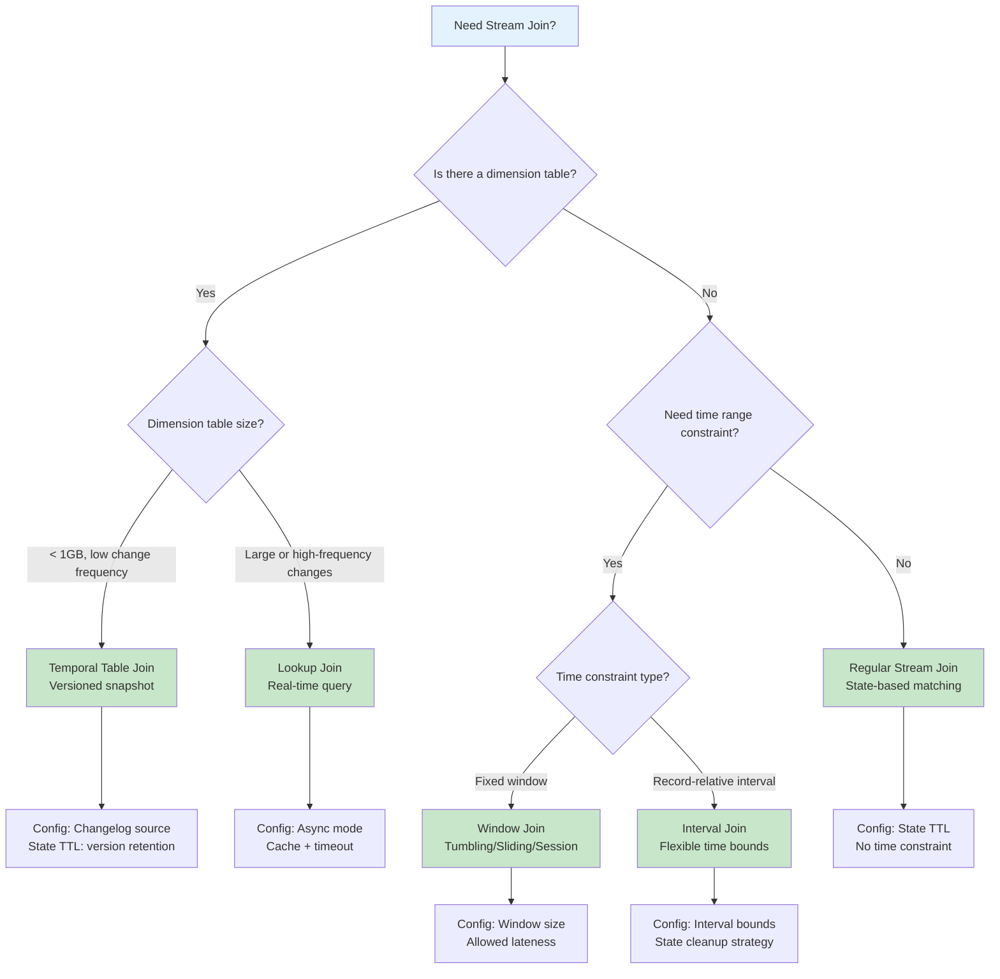
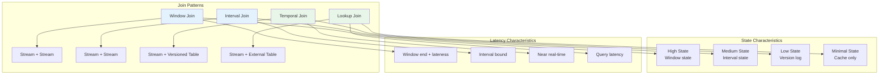
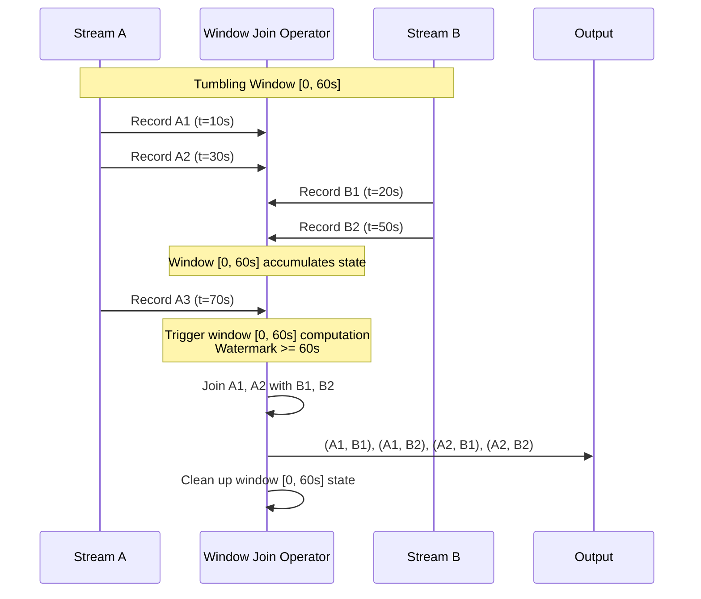
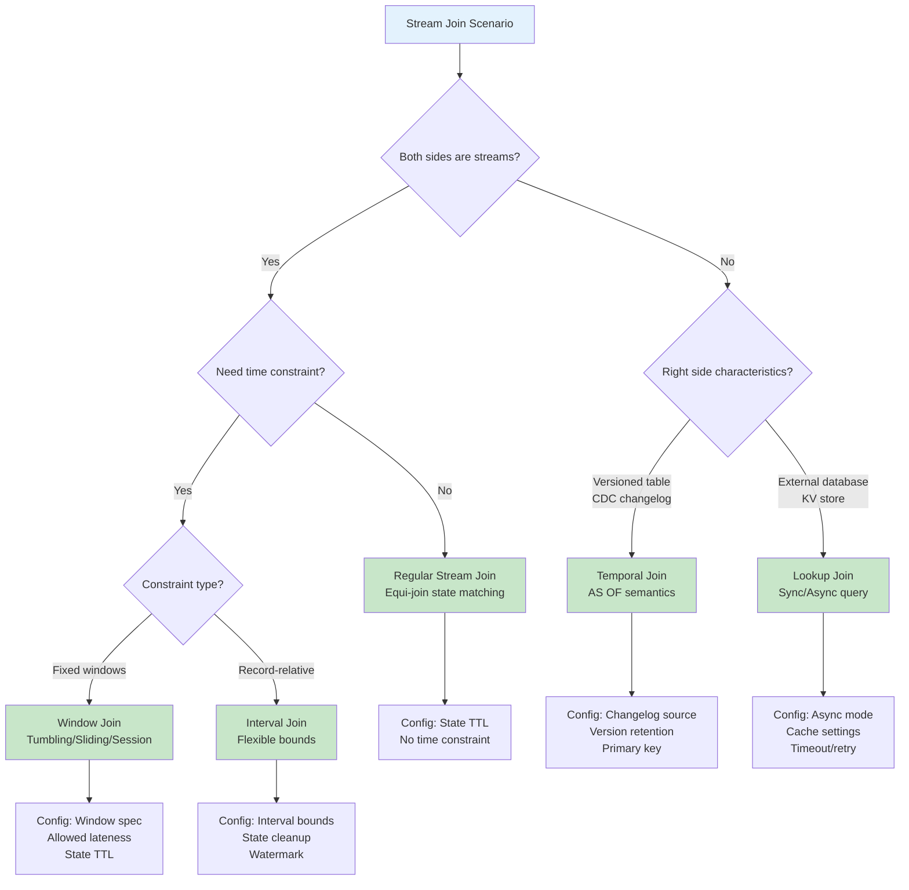

> **Status**: Stable Content | **Risk Level**: Low | **Last Updated**: 2026-04-20
>
> This document provides comprehensive design patterns for stream joins in stream processing systems, with formal semantics and Flink SQL/Table API implementations.
>

# Stream Join Design Patterns: Window Join, Interval Join, Temporal Table Join, and Lookup Join

> **Stage**: Knowledge/02-design-patterns | **Prerequisites**: [flink-streaming-multi-join-operator-en.md](../../../Flink/02-core/flink-streaming-multi-join-operator-en.md), [01.02-flow-semantics.md](../../../Struct/01-foundation/01.02-flow-semantics.md) | **Formalization Level**: L3-L4

---

## Table of Contents

- [Stream Join Design Patterns: Window Join, Interval Join, Temporal Table Join, and Lookup Join](#stream-join-design-patterns-window-join-interval-join-temporal-table-join-and-lookup-join)
  - [Table of Contents](#table-of-contents)
  - [1. Definitions](#1-definitions)
    - [Def-K-02-01: Stream Join](#def-k-02-01-stream-join)
    - [Def-K-02-02: Window Join](#def-k-02-02-window-join)
    - [Def-K-02-03: Interval Join](#def-k-02-03-interval-join)
    - [Def-K-02-04: Temporal Table Join](#def-k-02-04-temporal-table-join)
    - [Def-K-02-05: Lookup Join](#def-k-02-05-lookup-join)
    - [Def-K-02-06: State Requirements for Joins](#def-k-02-06-state-requirements-for-joins)
  - [2. Properties](#2-properties)
    - [Lemma-K-02-01: Window Join Determinism](#lemma-k-02-01-window-join-determinism)
    - [Lemma-K-02-02: Interval Join Complexity Bound](#lemma-k-02-02-interval-join-complexity-bound)
    - [Lemma-K-02-03: Temporal Join Idempotence](#lemma-k-02-03-temporal-join-idempotence)
    - [Prop-K-02-01: State Requirements Matrix](#prop-k-02-01-state-requirements-matrix)
    - [Prop-K-02-02: At-Least-Once Join Semantics](#prop-k-02-02-at-least-once-join-semantics)
    - [Prop-K-02-03: Exactly-Once Join Semantics](#prop-k-02-03-exactly-once-join-semantics)
  - [3. Relations](#3-relations)
    - [3.1 Join Pattern Comparison Matrix](#31-join-pattern-comparison-matrix)
    - [3.2 Join Type and State Growth Relations](#32-join-type-and-state-growth-relations)
    - [3.3 Join Pattern and Flink Operator Mapping](#33-join-pattern-and-flink-operator-mapping)
    - [3.4 Temporal Semantics Comparison](#34-temporal-semantics-comparison)
  - [4. Argumentation](#4-argumentation)
    - [4.1 Join Pattern Selection Decision Tree](#41-join-pattern-selection-decision-tree)
    - [4.2 Counterexample: Window Join Late Data Loss](#42-counterexample-window-join-late-data-loss)
    - [4.3 Counterexample: Interval Join State Explosion](#43-counterexample-interval-join-state-explosion)
    - [4.4 Temporal Table Join Version Selection Strategy](#44-temporal-table-join-version-selection-strategy)
  - [5. Proof / Engineering Argument](#5-proof-engineering-argument)
    - [Thm-K-02-01: Interval Join Completeness Theorem](#thm-k-02-01-interval-join-completeness-theorem)
    - [Thm-K-02-02: Temporal Table Join Snapshot Isolation Theorem](#thm-k-02-02-temporal-table-join-snapshot-isolation-theorem)
  - [6. Examples](#6-examples)
    - [6.1 Order-Payment Window Join](#61-order-payment-window-join)
    - [6.2 Ad Attribution Interval Join](#62-ad-attribution-interval-join)
    - [6.3 Currency Conversion Temporal Table Join](#63-currency-conversion-temporal-table-join)
    - [6.4 User Enrichment Lookup Join](#64-user-enrichment-lookup-join)
    - [6.5 Multi-way Join Pattern](#65-multi-way-join-pattern)
    - [6.6 Join Performance Tuning](#66-join-performance-tuning)
  - [7. Visualizations](#7-visualizations)
    - [7.1 Join Pattern Overview](#71-join-pattern-overview)
    - [7.2 Window Join Sequence Diagram](#72-window-join-sequence-diagram)
    - [7.3 Interval Join Gantt Chart](#73-interval-join-gantt-chart)
    - [7.4 Temporal Table Join Architecture](#74-temporal-table-join-architecture)
    - [7.5 Join Pattern Selection Decision Tree](#75-join-pattern-selection-decision-tree)
  - [8. References](#8-references)

---

## 1. Definitions

### Def-K-02-01: Stream Join

**Definition**: Stream Join is a binary operator that combines records from two unbounded input streams based on join conditions and temporal constraints.

Formally, for input streams $S_1$ and $S_2$:

$$S_1 \bowtie_{\theta}^{\tau} S_2 = \{(r_1, r_2) \mid r_1 \in S_1 \land r_2 \in S_2 \land \theta(r_1, r_2) \land \tau(r_1.t, r_2.t)\}$$

Where:

| Component | Description | Example |
|------|------|------|
| $\theta$ | Join condition predicate | $r_1.k = r_2.k$ (equi-join) |
| $\tau$ | Temporal constraint | $|r_1.t - r_2.t| \leq \delta$ (time window) |

---

### Def-K-02-02: Window Join

**Definition**: Window Join divides input streams into finite windows, performing join within each window:

$$S_1 \bowtie_{\theta}^{W} S_2 = \bigcup_{w \in W} (S_1[w] \bowtie_{\theta} S_2[w])$$

Where $W = \{w_1, w_2, \ldots\}$ is the window set, $S[w]$ denotes records in stream $S$ within window $w$.

**Supported Window Types**:

| Window Type | Definition | Use Case |
|------|------|------|
| **Tumbling Window** | Fixed size, no overlap | Periodic statistics |
| **Sliding Window** | Fixed size, with overlap | Moving average |
| **Session Window** | Dynamic size, gap-based | User behavior analysis |

**Flink SQL Syntax**:

```sql
SELECT *
FROM orders o
JOIN shipments s ON o.order_id = s.order_id
AND o.rowtime BETWEEN s.rowtime - INTERVAL '10' MINUTE AND s.rowtime + INTERVAL '10' MINUTE;
```

---

### Def-K-02-03: Interval Join

**Definition**: Interval Join defines a time interval around each record, joining with records from the other stream within that interval:

$$S_1 \bowtie_{\theta}^{[a,b]} S_2 = \{(r_1, r_2) \mid \theta(r_1, r_2) \land r_2.t \in [r_1.t + a, r_1.t + b]\}$$

Where $[a, b]$ is the time interval (can be negative, indicating records before/after).

**Key Difference from Window Join**:

| Dimension | Window Join | Interval Join |
|------|--------|------|
| **Time Basis** | Absolute window boundaries | Relative to each record |
| **State Growth** | $O(W)$ per key | $O(b - a)$ per key |
| **Late Data** | Depends on allowed lateness | Naturally supported |
| **Output Delay** | Window end + allowed lateness | Event arrival + interval |

---

### Def-K-02-04: Temporal Table Join

**Definition**: Temporal Table Join associates each record from the fact stream with a versioned snapshot from the dimension table (as of the fact record's event time):

$$S_{fact} \bowtie_{\theta}^{AS\ OF} S_{dim} = \{(r_f, r_d) \mid \theta(r_f, r_d) \land r_d.t_{version} = \max\{t \mid t \leq r_f.t_{event}\}\}$$

**Key Characteristics**:

1. **Versioned Dimension Table**: Dimension table maintains historical versions
2. **AS OF Semantics**: Fact record sees dimension table state at its event time
3. **Changelog Driven**: Dimension table changes propagated via CDC changelog

**Flink SQL Syntax**:

```sql
SELECT o.order_id, o.amount, r.rate
FROM orders AS o
FOR SYSTEM_TIME AS OF o.rowtime
JOIN exchange_rates FOR SYSTEM_TIME AS OF o.rowtime AS r
ON o.currency = r.currency;
```

---

### Def-K-02-05: Lookup Join

**Definition**: Lookup Join (also called Dimension Join) queries external dimension table in real-time for each fact record:

$$S_{fact} \bowtie_{\theta}^{LOOKUP} S_{dim} = \{(r_f, r_d) \mid \theta(r_f, r_d) \land r_d = \text{lookup}(r_f.k, r_f.t)\}$$

Where $\text{lookup}(k, t)$ is the real-time query function.

**Two Implementation Modes**:

| Mode | Mechanism | Latency | Throughput |
|------|------|------|--------|
| **Sync Lookup** | Block and wait for query result | High (10-100ms) | Low |
| **Async Lookup** | Async query + timeout | Medium (1-10ms) | High |

---

### Def-K-02-06: State Requirements for Joins

**Definition**: State requirements describe the state storage size and lifecycle management requirements for different join patterns:

| Join Type | State Content | State Size | TTL Strategy |
|------|--------|------|--------|
| Window Join | All records in current window | $O(W \cdot \lambda)$ | Window end + allowed lateness |
| Interval Join | Records within interval | $O((b-a) \cdot \lambda)$ | Record time + interval |
| Temporal Join | Dimension table changelog | $O(|dim| \cdot versions)$ | Version retention period |
| Lookup Join | Async query cache | $O(cache\_size)$ | Cache expiration |

Where $W$ is window size, $\lambda$ is input rate, $[a,b]$ is interval bounds.

---

## 2. Properties

### Lemma-K-02-01: Window Join Determinism

**Lemma**: Window Join output is deterministic if and only if window boundaries and watermarks are deterministic.

**Proof**:

Window join groups records by window and performs join within each window. If window boundaries are fixed (e.g., tumbling windows aligned to fixed time points), then for any record, its target window is uniquely determined. If watermark progression is deterministic (e.g., periodic watermark generation), then window trigger timing is also deterministic.

$\square$

**Counterexample**: If using processing-time windows, different parallel instances may have different processing speeds, causing records to be assigned to different windows → non-deterministic output.

---

### Lemma-K-02-02: Interval Join Complexity Bound

**Lemma**: The per-key state size of Interval Join is bounded by:

$$|State_k| \leq \lambda_k \cdot (b - a) + |S_{pending}|$$

Where:

- $\lambda_k$: Input rate of key $k$ (records/time unit)
- $[a, b]$: Interval bounds (time units)
- $|S_{pending}|$: Records waiting for interval expiration

**Proof**: Each record from $S_1$ with key $k$ needs to retain state for interval $[a, b]$ duration. During this period, expected number of matching records from $S_2$ is $\lambda_k \cdot (b - a)$. $ \square $

---

### Lemma-K-02-03: Temporal Join Idempotence

**Lemma**: Temporal Join is idempotent with respect to fact stream: reprocessing the same fact record with the same event time always yields the same dimension snapshot.

**Proof**: Temporal Join's dimension snapshot is determined by the fact record's event time $t_f$:

$$\text{Snapshot}(t_f) = \{r_d \mid r_d.t_{version} \leq t_f \land \nexists r_d': r_d'.t_{version} \in (r_d.t_{version}, t_f]\}$$

For fixed $t_f$, snapshot is uniquely determined by dimension table's version history. Reprocessing with same $t_f$ yields same snapshot. $ \square $

---

### Prop-K-02-01: State Requirements Matrix

**Proposition**: State requirements comparison for different join patterns:

| Join Pattern | Left State | Right State | Total State | Growth Pattern |
|------|--------|--------|--------|--------|
| **Window Join (Tumbling)** | $O(W \cdot \lambda_1)$ | $O(W \cdot \lambda_2)$ | $O(W \cdot (\lambda_1 + \lambda_2))$ | Step function |
| **Window Join (Sliding)** | $O(W \cdot \lambda_1 \cdot overlap)$ | $O(W \cdot \lambda_2 \cdot overlap)$ | $O(W \cdot overlap \cdot (\lambda_1 + \lambda_2))$ | Linear |
| **Interval Join** | $O((b-a) \cdot \lambda_1)$ | $O((b-a) \cdot \lambda_2)$ | $O((b-a) \cdot (\lambda_1 + \lambda_2))$ | Linear |
| **Temporal Join** | Minimal | $O(|dim|)$ | $O(|dim|)$ | Step function |
| **Lookup Join** | Minimal | External | External | N/A |

---

### Prop-K-02-02: At-Least-Once Join Semantics

**Proposition**: Under at-least-once semantics, join output may contain duplicates:

$$
\exists (r_1, r_2) \in O: \text{count}((r_1, r_2)) \geq 1
$$

Duplicates occur when:

1. Fact stream reprocesses (source offset rollback)
2. Dimension table changelog replays
3. State recovery from incomplete checkpoint

**Detection**: Add unique identifier to output, downstream deduplication.

---

### Prop-K-02-03: Exactly-Once Join Semantics

**Proposition**: Under exactly-once semantics (Flink Checkpoint + two-phase commit), join output contains no duplicates:

$$\forall (r_1, r_2) \in O: \text{count}((r_1, r_2)) = 1$$

**Guarantee Conditions**:

1. Fact stream: Kafka with transactional producer
2. Join state: RocksDB incremental checkpoint
3. Output sink: Two-phase commit (e.g., Kafka transactional producer, JDBC XA)

---

## 3. Relations

### 3.1 Join Pattern Comparison Matrix

| Dimension | Window Join | Interval Join | Temporal Join | Lookup Join |
|------|--------|--------|--------|--------|
| **Temporal Semantics** | Window boundaries | Record-relative interval | AS OF timestamp | Real-time query |
| **Left Stream** | Stream | Stream | Stream (fact) | Stream (fact) |
| **Right Stream** | Stream | Stream | Versioned table | External table |
| **State Size** | Large | Medium | Small | Minimal |
| **Output Delay** | Window end + lateness | Interval end | Near real-time | Query latency |
| **Late Data** | Supported (allowed lateness) | Naturally supported | Not applicable | Not applicable |
| **Flink Operator** | Window Join | Interval Join | Temporal Join | Lookup Join |
| **SQL Syntax Complexity** | Medium | Medium | Low | Low |

### 3.2 Join Type and State Growth Relations

```
State Growth Rate (per key):

Window Join:        ████████████████████  O(W · λ)
Interval Join:      ██████████████        O((b-a) · λ)
Temporal Join:      ████                  O(|dim|)
Lookup Join:        █                     O(cache)

Low State ◄─────────────────────────────────► High State
```

### 3.3 Join Pattern and Flink Operator Mapping

| Join Pattern | Flink SQL | Flink DataStream | State Backend |
|------|-----------|-----------------|--------------|
| Window Join | `JOIN ... ON ... AND window` | `IntervalJoin` (legacy) | RocksDB |
| Interval Join | `JOIN ... ON ... AND between` | `IntervalJoin` | RocksDB |
| Temporal Join | `FOR SYSTEM_TIME AS OF` | `TemporalTableJoin` | RocksDB |
| Lookup Join | `FOR SYSTEM_TIME AS OF` + Lookup | `AsyncWaitOperator` | Heap/External |

### 3.4 Temporal Semantics Comparison

| Join Pattern | Time Reference | Output Trigger | Late Data Handling |
|------|---------|---------|---------|
| Window Join | Window end time | Watermark reaches window end | Allowed lateness |
| Interval Join | Record event time | Opposite stream record arrival | Buffer until interval end |
| Temporal Join | Fact record event time | Fact record arrival | Dimension version snapshot |
| Lookup Join | Processing time | Fact record arrival | N/A (real-time query) |

---

## 4. Argumentation

### 4.1 Join Pattern Selection Decision Tree



### 4.2 Counterexample: Window Join Late Data Loss

**Problem**: User reports data loss in Window Join.

**Scenario**:

```sql
-- 1-minute tumbling window, allowed lateness 5 minutes
SELECT *
FROM clicks c
JOIN impressions i ON c.ad_id = i.ad_id
AND c.rowtime BETWEEN i.rowtime - INTERVAL '1' MINUTE AND i.rowtime + INTERVAL '1' MINUTE;
```

**Phenomenon**:

- Input rate: 100K records/s
- Window: 1 minute
- Allowed lateness: 5 minutes
- But some records with 3-minute delay still lost

**Root Cause**:

```
Timeline:
  t=0: Window [0, 60s] starts
  t=60s: Window closes, triggers join computation
  t=65s: Allowed lateness (5s) expires, window state cleaned up
  t=63s: A delayed click record arrives (delay 63s)

Result: Record cannot join because window state has been cleaned up!
```

**Analysis**: Allowed lateness (5 minutes) is the time after window closes, not record delay. If record delay > window end + allowed lateness, data is lost.

**Solution**:

```sql
-- Option 1: Increase allowed lateness
SELECT * FROM ...
-- Increase from 5 minutes to 30 minutes

-- Option 2: Use Interval Join (naturally supports late data)
SELECT *
FROM clicks c
JOIN impressions i ON c.ad_id = i.ad_id
AND c.rowtime BETWEEN i.rowtime - INTERVAL '30' MINUTE AND i.rowtime + INTERVAL '30' MINUTE;

-- Option 3: Use side output for late data
```

### 4.3 Counterexample: Interval Join State Explosion

**Problem**: Interval Join job OOM after running for 2 hours.

**Scenario**:

```sql
-- Interval: ± 1 hour
SELECT *
FROM events_a a
JOIN events_b b ON a.user_id = b.user_id
AND a.rowtime BETWEEN b.rowtime - INTERVAL '60' MINUTE AND b.rowtime + INTERVAL '60' MINUTE;
```

**Analysis**:

```
Input rate: 10K records/s per stream
Interval: 2 hours (± 60 minutes)
State per key: 10K × 7200s = 72M records
If 1M keys: Total state = 72M × 1M = 72 trillion records

Even with 100 bytes per record: 7.2 PB (impossible!)
```

**Root Cause**: Interval too large, causing state explosion.

**Solution**:

```sql
-- Option 1: Reduce interval
AND a.rowtime BETWEEN b.rowtime - INTERVAL '5' MINUTE AND b.rowtime + INTERVAL '5' MINUTE;

-- Option 2: Add filter conditions to reduce matching scope
AND a.event_type = 'click' AND b.event_type = 'conversion';

-- Option 3: Use Temporal Join instead (if one side is dimension table)
```

### 4.4 Temporal Table Join Version Selection Strategy

**Problem**: Temporal Join uses incorrect dimension version.

**Scenario**:

```sql
-- Exchange rate dimension table, updated every hour
SELECT o.order_id, o.amount * r.rate as amount_usd
FROM orders o
FOR SYSTEM_TIME AS OF o.rowtime
JOIN exchange_rates FOR SYSTEM_TIME AS OF o.rowtime AS r
ON o.currency = r.currency;
```

**Phenomenon**:

- Order event time: 2024-01-01 12:30:00
- Exchange rate version: 2024-01-01 12:00:00 (latest version before event time)
- But user expects to use 13:00 version

**Analysis**: Temporal Join's AS OF semantics uses the latest version before or equal to event time, not after.

$$\text{Version}(t_{event}) = \max\{t_{version} \mid t_{version} \leq t_{event}\}$$

**Solution**:

```sql
-- If need to use future version (not recommended, violates causality)
-- Should preprocess dimension table, advance version timestamps

-- Or use Lookup Join (real-time query)
SELECT o.order_id, o.amount * r.rate as amount_usd
FROM orders AS o
LEFT JOIN exchange_rates FOR SYSTEM_TIME AS OF CURRENT_TIMESTAMP AS r
ON o.currency = r.currency;
```

---

## 5. Proof / Engineering Argument

### Thm-K-02-01: Interval Join Completeness Theorem

**Theorem**: For any two records $r_1 \in S_1$ and $r_2 \in S_2$, if their timestamps satisfy the interval constraint $|r_1.t - r_2.t| \leq \delta$, then Interval Join outputs $(r_1, r_2)$.

**Proof**:

Interval Join maintains state for each key within interval $\delta$:

1. When $r_1$ arrives at time $t_1$, it is added to state $State_1$ with TTL $t_1 + \delta$
2. When $r_2$ arrives at time $t_2$, query $State_1$ for matching key within $[t_2 - \delta, t_2 + \delta]$
3. If $r_1$ is within query range ($|t_1 - t_2| \leq \delta$), output $(r_1, r_2)$
4. Symmetrically, $r_2$ arrival triggers same logic

Therefore, all record pairs satisfying interval constraint are output. $ \square $

---

### Thm-K-02-02: Temporal Table Join Snapshot Isolation Theorem

**Theorem**: Temporal Table Join provides snapshot isolation semantics: for any fact record $r_f$, the dimension snapshot it sees is a consistent version at time $r_f.t_{event}$.

**Proof**:

1. Dimension table changelog maintains all historical versions: $\{D_t \mid t \in T\}$
2. For fact record with event time $t_f$, query snapshot:

$$D_{snapshot}(t_f) = D_{\max\{t \mid t \leq t_f\}}$$

1. Since changelog is ordered and monotonically increasing, $D_{snapshot}(t_f)$ is a consistent snapshot
2. Multiple fact records with same $t_f$ see the same snapshot
3. Fact records with different $t_f$ see different snapshots, but each is consistent

$\square$

**Engineering Corollary**: Temporal Join naturally supports "time travel queries", allowing analysis of historical data using dimension table state at that time.

---

## 6. Examples

### 6.1 Order-Payment Window Join

```sql
-- ============================================
-- Scenario: Match orders with payments within 5-minute window
-- ============================================

CREATE TABLE orders (
    order_id STRING,
    user_id STRING,
    amount DECIMAL(10, 2),
    order_time TIMESTAMP(3),
    WATERMARK FOR order_time AS order_time - INTERVAL '5' SECOND
) WITH (
    'connector' = 'kafka',
    'topic' = 'orders',
    'format' = 'json'
);

CREATE TABLE payments (
    payment_id STRING,
    order_id STRING,
    payment_amount DECIMAL(10, 2),
    payment_time TIMESTAMP(3),
    WATERMARK FOR payment_time AS payment_time - INTERVAL '5' SECOND
) WITH (
    'connector' = 'kafka',
    'topic' = 'payments',
    'format' = 'json'
);

-- Tumbling window join: Match orders and payments in same 5-minute window
SELECT
    o.order_id,
    o.user_id,
    o.amount as order_amount,
    p.payment_amount,
    p.payment_time
FROM orders o
JOIN payments p ON o.order_id = p.order_id
AND o.order_time BETWEEN p.payment_time - INTERVAL '2' MINUTE
                     AND p.payment_time + INTERVAL '2' MINUTE;
```

**Key Configuration Points**:

```sql
-- State TTL configuration (clean up state after interval ends)
SET 'table.exec.state.ttl' = '5 min';

-- If using window join, configure allowed lateness
SET 'table.exec.allow-lateness' = '1 min';
```

### 6.2 Ad Attribution Interval Join

```sql
-- ============================================
-- Scenario: Ad click to conversion attribution (within 7 days)
-- ============================================

CREATE TABLE ad_clicks (
    click_id STRING,
    user_id STRING,
    ad_id STRING,
    click_time TIMESTAMP(3),
    WATERMARK FOR click_time AS click_time - INTERVAL '1' HOUR
) WITH ('connector' = 'kafka', 'topic' = 'ad_clicks', 'format' = 'json');

CREATE TABLE conversions (
    conversion_id STRING,
    user_id STRING,
    conversion_value DECIMAL(10, 2),
    conversion_time TIMESTAMP(3),
    WATERMARK FOR conversion_time AS conversion_time - INTERVAL '1' HOUR
) WITH ('connector' = 'kafka', 'topic' = 'conversions', 'format' = 'json');

-- Interval Join: Click can match conversion within 7 days after click
SELECT
    c.click_id,
    c.ad_id,
    c.user_id,
    conv.conversion_id,
    conv.conversion_value,
    TIMESTAMPDIFF(DAY, c.click_time, conv.conversion_time) as attribution_window
FROM ad_clicks c
JOIN conversions conv ON c.user_id = conv.user_id
AND conv.conversion_time BETWEEN c.click_time
    AND c.click_time + INTERVAL '7' DAY;
```

**State Optimization Configuration**:

```sql
-- 7-day state is too large, need optimization
-- Option 1: Reduce attribution window
AND conv.conversion_time BETWEEN c.click_time
    AND c.click_time + INTERVAL '1' DAY;

-- Option 2: Use incremental aggregation (first aggregate then join)
-- Pre-aggregate clicks and conversions per user per day
```

### 6.3 Currency Conversion Temporal Table Join

```sql
-- ============================================
-- Scenario: Real-time currency conversion using versioned exchange rates
-- ============================================

-- Fact table: Orders
CREATE TABLE orders (
    order_id STRING,
    currency STRING,
    amount DECIMAL(10, 2),
    order_time TIMESTAMP(3),
    WATERMARK FOR order_time AS order_time - INTERVAL '5' SECOND,
    PRIMARY KEY (order_id) NOT ENFORCED
) WITH ('connector' = 'kafka', 'topic' = 'orders', 'format' = 'json');

-- Dimension table: Exchange rates (CDC changelog)
CREATE TABLE exchange_rates (
    currency STRING,
    rate DECIMAL(10, 6),
    update_time TIMESTAMP(3),
    WATERMARK FOR update_time AS update_time - INTERVAL '5' SECOND,
    PRIMARY KEY (currency) NOT ENFORCED
) WITH (
    'connector' = 'kafka',
    'topic' = 'exchange_rates_changelog',
    'format' = 'debezium-json'
);

-- Temporal Join: Use exchange rate version at order time
SELECT
    o.order_id,
    o.currency,
    o.amount,
    r.rate,
    o.amount * r.rate as amount_usd,
    o.order_time,
    r.update_time as rate_version
FROM orders AS o
FOR SYSTEM_TIME AS OF o.order_time
JOIN exchange_rates FOR SYSTEM_TIME AS OF o.order_time AS r
ON o.currency = r.currency;
```

**Output Example**:

| order_id | currency | amount | rate | amount_usd | order_time | rate_version |
|---------|---------|--------|------|-----------|------------|-------------|
| 001 | EUR | 100.00 | 1.0800 | 108.00 | 2024-01-01 10:00:00 | 2024-01-01 09:00:00 |
| 002 | EUR | 200.00 | 1.0850 | 217.00 | 2024-01-01 11:00:00 | 2024-01-01 10:00:00 |
| 003 | JPY | 10000 | 0.0067 | 67.00 | 2024-01-01 10:30:00 | 2024-01-01 09:00:00 |

### 6.4 User Enrichment Lookup Join

```sql
-- ============================================
-- Scenario: Real-time user enrichment via async lookup
-- ============================================

-- Fact stream: Events
CREATE TABLE events (
    event_id STRING,
    user_id STRING,
    event_type STRING,
    event_time TIMESTAMP(3),
    WATERMARK FOR event_time AS event_time - INTERVAL '5' SECOND
) WITH ('connector' = 'kafka', 'topic' = 'events', 'format' = 'json');

-- Dimension table: User profiles (external database)
CREATE TABLE user_profiles (
    user_id STRING,
    user_name STRING,
    age INT,
    city STRING,
    country STRING,
    PRIMARY KEY (user_id) NOT ENFORCED
) WITH (
    'connector' = 'jdbc',
    'url' = 'jdbc:mysql://mysql:3306/users',
    'table-name' = 'user_profiles',
    'lookup.cache.max-rows' = '10000',
    'lookup.cache.ttl' = '10 min',
    'lookup.max-retries' = '3'
);

-- Async Lookup Join with cache
SELECT
    e.event_id,
    e.user_id,
    e.event_type,
    u.user_name,
    u.age,
    u.city,
    u.country,
    e.event_time
FROM events AS e
LEFT JOIN user_profiles FOR SYSTEM_TIME AS OF e.event_time AS u
ON e.user_id = u.user_id;
```

**Async Lookup Configuration**:

```sql
-- Async mode (recommended)
SET 'table.optimizer.async-lookup-enabled' = 'true';
SET 'table.optimizer.async-lookup-buffer-capacity' = '1000';
SET 'table.optimizer.async-lookup-timeout' = '5s';

-- Cache configuration
SET 'table.optimizer.lookup.cache.enabled' = 'true';
SET 'table.optimizer.lookup.cache.max-rows' = '10000';
SET 'table.optimizer.lookup.cache.ttl' = '10 min';
```

### 6.5 Multi-way Join Pattern

```sql
-- ============================================
-- Scenario: Multi-way join combining multiple patterns
-- ============================================

-- Orders + Payments (Interval Join)
-- + Exchange rates (Temporal Join)
-- + User profiles (Lookup Join)

WITH order_payments AS (
    -- Step 1: Orders join payments (Interval Join)
    SELECT
        o.order_id,
        o.user_id,
        o.currency,
        o.amount,
        p.payment_id,
        p.payment_time
    FROM orders o
    JOIN payments p ON o.order_id = p.order_id
    AND p.payment_time BETWEEN o.order_time - INTERVAL '5' MINUTE
                           AND o.order_time + INTERVAL '30' MINUTE
),

enriched_orders AS (
    -- Step 2: Join exchange rates (Temporal Join)
    SELECT
        op.*,
        r.rate,
        op.amount * r.rate as amount_usd
    FROM order_payments op
    FOR SYSTEM_TIME AS OF op.payment_time
    JOIN exchange_rates FOR SYSTEM_TIME AS OF op.payment_time AS r
    ON op.currency = r.currency
)

-- Step 3: Final output with user enrichment (Lookup Join)
SELECT
    eo.*,
    u.user_name,
    u.city,
    u.country
FROM enriched_orders eo
LEFT JOIN user_profiles FOR SYSTEM_TIME AS OF CURRENT_TIMESTAMP AS u
ON eo.user_id = u.user_id;
```

### 6.6 Join Performance Tuning

```sql
-- ============================================
-- Join Performance Tuning Configuration
-- ============================================

-- 1. State backend configuration
SET 'state.backend' = 'rocksdb';
SET 'state.backend.incremental' = 'true';
SET 'state.backend.rocksdb.memory.managed' = 'true';

-- 2. Mini-batch optimization (reduce state access)
SET 'table.exec.mini-batch.enabled' = 'true';
SET 'table.exec.mini-batch.allow-latency' = '1s';
SET 'table.exec.mini-batch.size' = '1000';

-- 3. Local-global aggregation (if join involves aggregation)
SET 'table.optimizer.agg-phase-strategy' = 'TWO_PHASE';

-- 4. Broadcast join hint (if one side is small)
-- /*+ BROADCAST(small_table) */

-- 5. State TTL configuration (critical!)
SET 'table.exec.state.ttl' = '24h';

-- 6. Parallelism configuration
SET 'pipeline.operator-chaining' = 'true';
SET 'taskmanager.network.memory.buffer-size' = '32kb';
```

---

## 7. Visualizations

### 7.1 Join Pattern Overview



### 7.2 Window Join Sequence Diagram



### 7.3 Interval Join Gantt Chart

```mermaid
gantt
    title Interval Join: Record Matching Timeline
    dateFormat X
    axisFormat %ss

    section Stream A
    A1 (t=10s)        :a1, 10, 11
    A2 (t=25s)        :a2, 25, 26
    A3 (t=40s)        :a3, 40, 41

    section Stream B
    B1 (t=15s)        :b1, 15, 16
    B2 (t=35s)        :b2, 35, 36
    B3 (t=50s)        :b3, 50, 51

    section Matches
    A1-B1 (|t|=5s)   :m1, 15, 16
    A2-B2 (|t|=10s)  :m2, 35, 36
    A3-B2 (|t|=5s)   :m3, 40, 41
```



**Interval Constraint**: $\pm 15s$ (A1 can match B records within [t-15s, t+15s])

### 7.4 Temporal Table Join Architecture

```mermaid
graph TB
    subgraph "Fact Stream"
        F1[Order Events<br/>order_id, currency, amount, event_time]
    end

    subgraph "Temporal Join Operator"
        TJO[Temporal Join]
        VS[Versioned State<br/>currency → {rate, version_time}]
    end

    subgraph "Dimension Changelog"
        DC[CDC Source<br/>exchange_rates changelog]
        D1[(EUR, 1.08, 09:00)]
        D2[(EUR, 1.09, 10:00)]
        D3[(JPY, 0.0067, 09:00)]
    end

    subgraph "Output"
        O1[Enriched Orders<br/>amount * rate_at_event_time]
    end

    F1 --> TJO
    DC --> D1
    DC --> D2
    DC --> D3
    D1 --> VS
    D2 --> VS
    D3 --> VS
    VS -.-> TJO
    TJO --> O1

    style F1 fill:#E3F2FD
    style DC fill:#FFF3E0
    style VS fill:#E8F5E9
    style TJO fill:#F3E5F5
    style O1 fill:#C8E6C9
```

### 7.5 Join Pattern Selection Decision Tree



---

## 8. References


---

*Document Version: v1.0 | Last Updated: 2026-04-20 | Status: Complete | Formalization Level: L3-L4*
