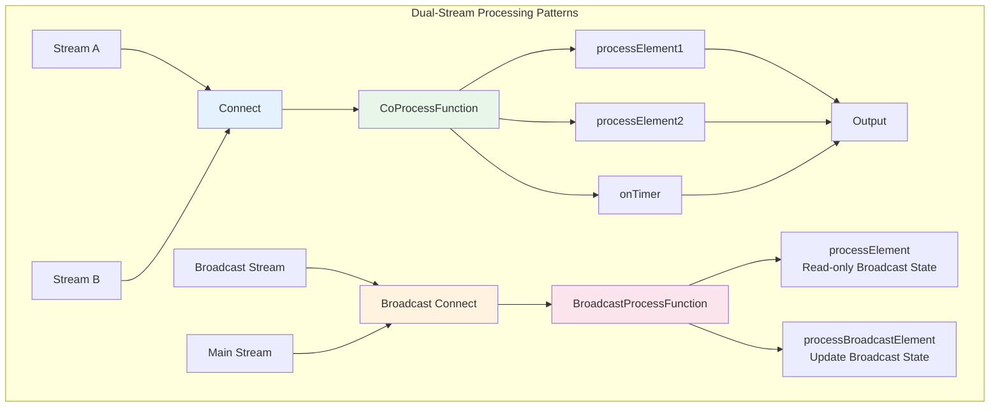
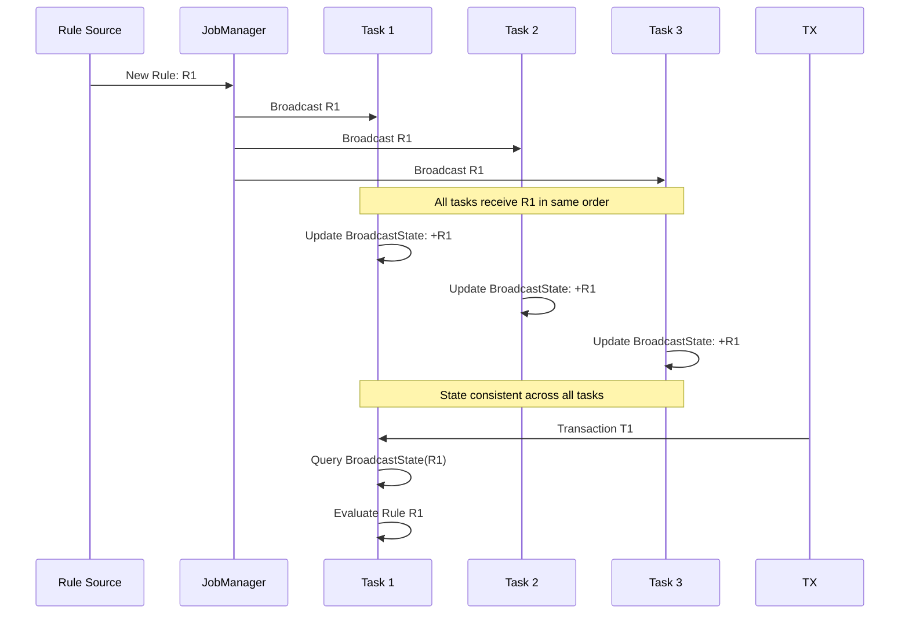
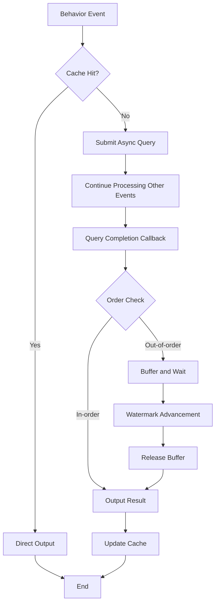

# Dual-Stream Processing Patterns

> **Language**: English | **Translated from**: [Knowledge/02-design-patterns/02.02-dual-stream-patterns.md](../../../Knowledge/02-design-patterns/02.02-dual-stream-patterns.md) | **Translation date**: 2026-04-20
>
> **Stage**: Knowledge/02-design-patterns | **Prerequisites**: [02.01-stream-join-patterns.md](./02.01-stream-join-patterns-en.md) | **Formalization Level**: L4-L5
>
> This pattern addresses the core challenges of coordinated dual-stream processing, covering Connect/CoProcess, Broadcast State, and asynchronous dual-stream Join.

---

## Table of Contents

- [Dual-Stream Processing Patterns](#dual-stream-processing-patterns)
  - [Table of Contents](#table-of-contents)
  - [1. Definitions](#1-definitions)
    - [1.1 Essence of Dual-Stream Processing](#11-essence-of-dual-stream-processing)
    - [1.2 Connect and CoProcessFunction](#12-connect-and-coprocessfunction)
    - [1.3 Broadcast State Pattern](#13-broadcast-state-pattern)
    - [1.4 Dual-Stream Async Join](#14-dual-stream-async-join)
  - [2. Properties](#2-properties)
    - [2.1 Properties of Connect/CoProcess](#21-properties-of-connectcoprocess)
    - [2.2 Properties of Broadcast State](#22-properties-of-broadcast-state)
    - [2.3 Properties of Dual-Stream Async Join](#23-properties-of-dual-stream-async-join)
  - [3. Relations](#3-relations)
    - [3.1 Relationship Between Dual-Stream Patterns and Join Patterns](#31-relationship-between-dual-stream-patterns-and-join-patterns)
    - [3.2 Relationship with Other Concepts](#32-relationship-with-other-concepts)
  - [4. Argumentation](#4-argumentation)
    - [4.1 Connect vs Union](#41-connect-vs-union)
    - [4.2 Applicability Boundaries of Broadcast State](#42-applicability-boundaries-of-broadcast-state)
    - [4.3 Completeness Guarantee of Async Join](#43-completeness-guarantee-of-async-join)
  - [5. Proof / Engineering Argument](#5-proof--engineering-argument)
    - [5.1 Broadcast State Consistency Proof](#51-broadcast-state-consistency-proof)
    - [5.2 Expressiveness of CoProcessFunction](#52-expressiveness-of-coprocessfunction)
  - [6. Examples](#6-examples)
    - [6.1 Connect and CoProcessFunction Implementation](#61-connect-and-coprocessfunction-implementation)
    - [6.2 Broadcast State Pattern Implementation](#62-broadcast-state-pattern-implementation)
    - [6.3 Dual-Stream Async Join Implementation](#63-dual-stream-async-join-implementation)
  - [7. Visualizations](#7-visualizations)
    - [7.1 Dual-Stream Processing Patterns Overview](#71-dual-stream-processing-patterns-overview)
    - [7.2 Broadcast State Mechanism](#72-broadcast-state-mechanism)
    - [7.3 Async Dual-Stream Join Flow](#73-async-dual-stream-join-flow)
  - [8. References](#8-references)

---

## 1. Definitions

### 1.1 Essence of Dual-Stream Processing

**Def-K-02-07 [Dual-Stream Processing]**: Dual-stream processing refers to the coordinated computation of streams $S_A$ and $S_B$ to produce an output stream $S_{out}$. Compared to single-stream processing, dual-stream processing must resolve the following core issues:

$$
\text{DualStream}(S_A, S_B) = \{(o, t_o) \mid o = f(A_{buf}, B_{buf}), A_{buf} \subseteq S_A, B_{buf} \subseteq S_B\}
$$

Where $A_{buf}$ and $B_{buf}$ are the local buffer states of the two streams at the time of computation.

### 1.2 Connect and CoProcessFunction

**Def-K-02-08 [Connect Operation]**: Connect is the operation that merges two heterogeneous streams into a ConnectedStreams, formalized as:

$$
\text{Connect}: S_A \times S_B \to S_{A \cup B}^{conn}
$$

Where $S_A$ and $S_B$ can have different data types: $Type(S_A) \neq Type(S_B)$.

**Def-K-02-09 [CoProcessFunction]**: CoProcessFunction is a dual-input processing function acting on ConnectedStreams, defining two independent processing interfaces:

$$
\begin{aligned}
\text{processElement1}&: (e_A \in S_A, \text{Context}, \text{Collector}) \to \text{Action} \\
\text{processElement2}&: (e_B \in S_B, \text{Context}, \text{Collector}) \to \text{Action} \\
\text{onTimer}&: (\text{timestamp}, \text{Context}, \text{Collector}) \to \text{Action}
\end{aligned}
$$

### 1.3 Broadcast State Pattern

**Def-K-02-10 [Broadcast Stream]**: Broadcast Stream is a special stream that broadcasts stream $S_B$ to all parallel subtasks, ensuring each subtask receives a complete data replica:

$$
\text{Broadcast}(S_B) = \{S_B^{(i)} \mid S_B^{(i)} = S_B, \forall i \in [1, N_{parallel}]\}
$$

Where $N_{parallel}$ is the parallelism, and each subtask $i$ obtains a complete copy of $S_B$.

**Def-K-02-11 [Broadcast State]**: Broadcast State is a special state associated with a Broadcast Stream, with the following characteristics:

- **Write-only state**: Updated only through the broadcast stream
- **Full replication**: All subtasks hold identical state replicas
- **Strict ordering**: Events from the broadcast stream are processed in the same order on all subtasks

Formalized as:

$$
\text{BroadcastState}^{(i)}[t] = \text{BroadcastState}^{(j)}[t], \quad \forall i, j, t
$$

### 1.4 Dual-Stream Async Join

**Def-K-02-12 [Dual-Stream Async Join]**: Dual-Stream Async Join is a non-blocking Join pattern where, when data arrives on one side, it asynchronously queries the state of the other side or external storage:

$$
\text{AsyncDualJoin}(a, B_{state}) = \text{Future}\{(a, b) \mid b \in B_{state}, \theta(a, b)\}
$$

Key characteristics:

- **Non-blocking**: Processing continues with other events while the query is in progress
- **Out-of-order completion**: A query issued earlier may complete later
- **Concurrency control**: The number of concurrent queries must be limited

---

## 2. Properties

### 2.1 Properties of Connect/CoProcess

**Lemma-K-02-04 [Type Preservation]**: The Connect operation preserves the type information of both input streams, allowing elements of different types to be processed separately within the CoProcessFunction.

**Lemma-K-02-05 [Watermark Alignment]**: The Watermark of Connected Streams takes the minimum of the two stream Watermarks:

$$
W_{conn} = \min(W_A, W_B)
$$

This means that if one side's Watermark stalls, the processing of the entire Connected Stream will be delayed.

### 2.2 Properties of Broadcast State

**Lemma-K-02-06 [State Consistency]**: In all parallel subtasks, the Broadcast State content remains consistent at all times.

*Proof*: Data from the broadcast stream is sent to all subtasks, and the processing order is identical (guaranteed by Flink's deterministic routing). Therefore, for any two subtasks $i$ and $j$, after processing the same number of events, their states must be identical. □

**Lemma-K-02-07 [Key Independence]**: Broadcast State does not depend on a Key; all subtasks share the same namespace.

**Prop-K-02-04 [Broadcast State Limitations]**:

- The broadcast side cannot access non-broadcast side state
- The non-broadcast side can read but not write broadcast state
- Checkpoint must ensure a consistent snapshot of broadcast state

### 2.3 Properties of Dual-Stream Async Join

**Lemma-K-02-08 [Latency Hiding]**: Let the async query latency be $L$ and the concurrency be $C$. The maximum throughput the system can sustain is:

$$
\lambda_{max} = \frac{C}{L}
$$

**Lemma-K-02-09 [Out-of-order Output]**: The output order of async Join may differ from the input order. For input sequence $(a_1, a_2)$, the output sequence could be $(a_2 \bowtie b, a_1 \bowtie b)$.

---

## 3. Relations

### 3.1 Relationship Between Dual-Stream Patterns and Join Patterns

```
┌─────────────────────────────────────────────────────────────────────────┐
│                    Dual-Stream Processing Pattern Relation Map           │
├─────────────────────────────────────────────────────────────────────────┤
│                                                                         │
│  ┌──────────────┐      Basic Capability   ┌──────────────┐             │
│  │   Connect    │───────────────────────►│CoProcessFunc │             │
│  │ (Connect Streams)│                    │(Coordination)│             │
│  └──────┬───────┘                        └──────┬───────┘             │
│         │                                       │                      │
│         │ Specialization                        │ Specialization       │
│         ▼                                       ▼                      │
│  ┌──────────────┐                        ┌──────────────┐             │
│  │Broadcast Conn│                        │Keyed CoProcess│            │
│  │(Broadcast Connect)│                   │(Keyed Coordination)│      │
│  └──────┬───────┘                        └──────┬───────┘             │
│         │                                       │                      │
│         ▼                                       ▼                      │
│  ┌──────────────┐                        ┌──────────────┐             │
│  │BroadcastState│                        │ Async Dual   │             │
│  │(Broadcast State)│                     │    Join      │             │
│  │              │                        │(Async Dual-Stream Join)│  │
│  └──────────────┘                        └──────────────┘             │
│                                                                         │
└─────────────────────────────────────────────────────────────────────────┘
```

### 3.2 Relationship with Other Concepts

**Relationship with Checkpoint**:

- Connect: Both streams' states are snapshotted separately
- Broadcast State: The broadcast-side state only needs to be saved once (all subtasks are identical)
- Async Join: Must handle consistency of in-flight queries

**Relationship with Watermark**:

- Connect: Watermark takes the minimum value
- Broadcast: Watermark advancement on the broadcast side can trigger timers on the non-broadcast side
- Async Join: Watermark advancement must wait for all in-flight queries to complete

---

## 4. Argumentation

### 4.1 Connect vs Union

**Question**: When to use Connect, and when to use Union?

**Analysis**:

| Characteristic | Union | Connect |
|---------------|-------|---------|
| Type requirement | Must be identical | Can be different |
| Processing function | Single input | Dual independent inputs |
| State access | Single-stream state | Can coordinate dual-stream states |
| Complexity | Simple | Complex but more flexible |

**Selection Principles**:

- Same type and no coordination needed → Union
- Different types or dual-stream state coordination needed → Connect

### 4.2 Applicability Boundaries of Broadcast State

**Applicable Scenarios**:

- Configuration stream updates processing rules (rules broadcast to all tasks)
- Dimension table updates (small table broadcast to large stream)
- Model parameter updates (ML model broadcast)

**Inapplicable Scenarios**:

- Broadcast stream data volume too large (network pressure)
- Dynamic partitioning required (Broadcast State has no Key concept)
- High-frequency updates (cost of broadcasting each update to all subtasks is high)

### 4.3 Completeness Guarantee of Async Join

**Question**: How does async Join guarantee Exactly-Once semantics?

**Solutions**:

1. **Checkpoint Barrier Alignment**: Wait for all in-flight async operations to complete before taking a Checkpoint
2. **Idempotent Output**: Output to external systems that support idempotent writes
3. **Two-Phase Commit**: Use external transactions to guarantee output consistency

---

## 5. Proof / Engineering Argument

### 5.1 Broadcast State Consistency Proof

**Thm-K-02-03 [Broadcast State Strong Consistency]**: In all parallel subtasks, Broadcast State remains consistent at any moment.

**Proof**:

Let the broadcast stream be $S_B = \{b_1, b_2, ..., b_n\}$ and the parallelism be $P$.

1. **Routing Determinism**: Flink's deterministic routing ensures each $b_i$ is sent to the same position in all subtasks
2. **Processing Order**: Each subtask processes $\{b_1, b_2, ..., b_n\}$ in order
3. **State Update**: Let the state after step $k$ be $State_k = f(State_{k-1}, b_k)$

Since all subtasks start from the same initial state $State_0$, apply the same update function $f$, and process the same event sequence in the same order, for any $k$:

$$
State_k^{(i)} = State_k^{(j)}, \quad \forall i, j \in [1, P]
$$

That is, the states of all subtasks remain consistent at all times. □

### 5.2 Expressiveness of CoProcessFunction

**Thm-K-02-04 [CoProcessFunction Completeness]**: CoProcessFunction can express any dual-stream coordinated computation.

**Proof Sketch**:

Let any dual-stream coordinated computation be $C: S_A \times S_B \to S_{out}$. We can construct the corresponding CoProcessFunction:

1. Use ValueState to store historical records of $S_A$
2. Use ValueState to store historical records of $S_B$
3. processElement1: Store $e_A$ in state, scan $S_B$ state to compute
4. processElement2: Store $e_B$ in state, scan $S_A$ state to compute
5. onTimer: Handle timeouts, clean up expired state

Through appropriate state management and timer settings, any dual-stream computation can be simulated. □

---

## 6. Examples

### 6.1 Connect and CoProcessFunction Implementation

**Scenario**: Real-time order-inventory matching, with deferred processing when inventory is insufficient.

```java
/**
 * Connect and CoProcessFunction Implementation: Order-Inventory Matching
 *
 * Business Logic:
 * - Order stream: user order requests
 * - Inventory stream: product inventory updates
 * - Goal: real-time matching of orders with inventory, waiting for restock when insufficient
 */

import org.apache.flink.streaming.api.environment.StreamExecutionEnvironment;
import org.apache.flink.streaming.api.datastream.DataStream;
import org.apache.flink.api.common.state.ValueState;
import org.apache.flink.api.common.state.ValueStateDescriptor;
import org.apache.flink.api.common.typeinfo.Types;

public class OrderInventoryCoProcess {

    // Order event
    public static class OrderEvent {
        public String orderId;
        public String productId;
        public int quantity;
        public double amount;
        public long timestamp;

        public OrderEvent(String orderId, String productId, int quantity,
                         double amount, long timestamp) {
            this.orderId = orderId;
            this.productId = productId;
            this.quantity = quantity;
            this.amount = amount;
            this.timestamp = timestamp;
        }
    }

    // Inventory event
    public static class InventoryEvent {
        public String productId;
        public int availableQuantity;
        public long timestamp;

        public InventoryEvent(String productId, int availableQuantity, long timestamp) {
            this.productId = productId;
            this.availableQuantity = availableQuantity;
            this.timestamp = timestamp;
        }
    }

    // Processing result
    public static class OrderResult {
        public String orderId;
        public String productId;
        public int requestedQty;
        public int fulfilledQty;
        public String status;  // FULFILLED, PARTIAL, PENDING
        public long processTime;

        @Override
        public String toString() {
            return String.format("OrderResult{order=%s, product=%s, status=%s, qty=%d/%d}",
                orderId, productId, status, fulfilledQty, requestedQty);
        }
    }

    public static void main(String[] args) throws Exception {
        StreamExecutionEnvironment env = StreamExecutionEnvironment.getExecutionEnvironment();

        // Order stream
        DataStream<OrderEvent> orderStream = env
            .fromSource(
                KafkaSource.<OrderEvent>builder()
                    .setBootstrapServers("kafka:9092")
                    .setTopics("orders")
                    .build(),
                WatermarkStrategy.<OrderEvent>forBoundedOutOfOrderness(Duration.ofSeconds(5))
                    .withTimestampAssigner((e, ts) -> e.timestamp),
                "Orders"
            );

        // Inventory stream
        DataStream<InventoryEvent> inventoryStream = env
            .fromSource(
                KafkaSource.<InventoryEvent>builder()
                    .setBootstrapServers("kafka:9092")
                    .setTopics("inventory")
                    .build(),
                WatermarkStrategy.<InventoryEvent>forBoundedOutOfOrderness(Duration.ofSeconds(5))
                    .withTimestampAssigner((e, ts) -> e.timestamp),
                "Inventory"
            );

        // Connect the two streams
        ConnectedStreams<OrderEvent, InventoryEvent> connected =
            orderStream.connect(inventoryStream);

        // Process using CoProcessFunction
        DataStream<OrderResult> resultStream = connected
            .keyBy(
                order -> order.productId,      // Left stream Key selector
                inventory -> inventory.productId // Right stream Key selector
            )
            .process(new OrderInventoryMatcher());

        resultStream.addSink(new ResultSink());

        env.execute("Order-Inventory CoProcess");
    }
}

/**
 * Order-Inventory Matching CoProcessFunction
 */
class OrderInventoryMatcher extends CoProcessFunction<
    OrderInventoryCoProcess.OrderEvent,
    OrderInventoryCoProcess.InventoryEvent,
    OrderInventoryCoProcess.OrderResult> {

    // Inventory state
    private ValueState<Integer> inventoryState;
    // Pending order queue
    private ListState<OrderInventoryCoProcess.OrderEvent> pendingOrdersState;
    // Order timeout timer
    private MapState<String, Long> orderTimerState;

    @Override
    public void open(Configuration parameters) {
        inventoryState = getRuntimeContext().getState(
            new ValueStateDescriptor<>("inventory", Types.INT));

        pendingOrdersState = getRuntimeContext().getListState(
            new ListStateDescriptor<>("pending-orders",
                Types.POJO(OrderInventoryCoProcess.OrderEvent.class)));

        orderTimerState = getRuntimeContext().getMapState(
            new MapStateDescriptor<>("order-timers", Types.STRING, Types.LONG));
    }

    @Override
    public void processElement1(
        OrderInventoryCoProcess.OrderEvent order,
        Context ctx,
        Collector<OrderInventoryCoProcess.OrderResult> out) throws Exception {

        Integer currentInventory = inventoryState.value();

        if (currentInventory == null) {
            currentInventory = 0;
        }

        if (currentInventory >= order.quantity) {
            // Sufficient inventory, process immediately
            currentInventory -= order.quantity;
            inventoryState.update(currentInventory);

            out.collect(new OrderInventoryCoProcess.OrderResult(
                order.orderId, order.productId, order.quantity,
                order.quantity, "FULFILLED", ctx.timestamp()
            ));

            // Try processing pending orders
            processPendingOrders(out, ctx);
        } else {
            // Insufficient inventory, add to pending queue
            pendingOrdersState.add(order);

            // Register timeout timer (5 minutes)
            long timeout = ctx.timestamp() + TimeUnit.MINUTES.toMillis(5);
            ctx.timerService().registerEventTimeTimer(timeout);
            orderTimerState.put(order.orderId, timeout);

            out.collect(new OrderInventoryCoProcess.OrderResult(
                order.orderId, order.productId, order.quantity,
                0, "PENDING", ctx.timestamp()
            ));
        }
    }

    @Override
    public void processElement2(
        OrderInventoryCoProcess.InventoryEvent inventory,
        Context ctx,
        Collector<OrderInventoryCoProcess.OrderResult> out) throws Exception {

        // Update inventory
        inventoryState.update(inventory.availableQuantity);

        // Try processing pending orders
        processPendingOrders(out, ctx);
    }

    @Override
    public void onTimer(
        long timestamp,
        OnTimerContext ctx,
        Collector<OrderInventoryCoProcess.OrderResult> out) throws Exception {

        // Check timed-out orders
        Iterator<Map.Entry<String, Long>> timerIter = orderTimerState.iterator();
        while (timerIter.hasNext()) {
            Map.Entry<String, Long> entry = timerIter.next();
            if (entry.getValue() <= timestamp) {
                // Order timed out, remove from pending queue
                String orderId = entry.getKey();
                removePendingOrder(orderId);

                // Output timeout result
                out.collect(new OrderInventoryCoProcess.OrderResult(
                    orderId, ctx.getCurrentKey().toString(), 0, 0,
                    "TIMEOUT", timestamp
                ));

                timerIter.remove();
            }
        }
    }

    private void processPendingOrders(
        Collector<OrderInventoryCoProcess.OrderResult> out,
        Context ctx) throws Exception {

        Integer currentInventory = inventoryState.value();
        if (currentInventory == null || currentInventory <= 0) {
            return;
        }

        // Process pending orders in FIFO order
        List<OrderInventoryCoProcess.OrderEvent> pending = new ArrayList<>();
        pendingOrdersState.get().forEach(pending::add);

        for (OrderInventoryCoProcess.OrderEvent order : pending) {
            if (currentInventory >= order.quantity) {
                // Can process
                currentInventory -= order.quantity;

                out.collect(new OrderInventoryCoProcess.OrderResult(
                    order.orderId, order.productId, order.quantity,
                    order.quantity, "FULFILLED", ctx.timestamp()
                ));

                // Delete timer
                orderTimerState.remove(order.orderId);
            } else {
                // Insufficient inventory, partial processing or skip
                break;
            }
        }

        inventoryState.update(currentInventory);

        // Update pending queue
        pendingOrdersState.update(pending.stream()
            .filter(o -> orderTimerState.contains(o.orderId))
            .collect(Collectors.toList()));
    }

    private void removePendingOrder(String orderId) throws Exception {
        List<OrderInventoryCoProcess.OrderEvent> pending = new ArrayList<>();
        pendingOrdersState.get().forEach(pending::add);

        pendingOrdersState.update(pending.stream()
            .filter(o -> !o.orderId.equals(orderId))
            .collect(Collectors.toList()));
    }
}
```

### 6.2 Broadcast State Pattern Implementation

**Scenario**: Dynamic rule engine, with rule changes taking effect in real time.

```java
import java.util.Map;

import org.apache.flink.streaming.api.environment.StreamExecutionEnvironment;
import org.apache.flink.streaming.api.datastream.DataStream;
import org.apache.flink.api.common.typeinfo.Types;

/**
 * Broadcast State Implementation: Dynamic Risk Control Rule Engine
 *
 * Business Logic:
 * - Transaction stream: user transaction events
 * - Rule stream: risk control rule updates (broadcast to all tasks)
 * - Goal: evaluate transaction risk in real time according to the latest rules
 */
public class DynamicRuleEngine {

    // Transaction event
    public static class Transaction {
        public String transactionId;
        public String userId;
        public String cardId;
        public double amount;
        public String merchantCategory;
        public long timestamp;
        public String location;

        public Transaction(String transactionId, String userId, String cardId,
                          double amount, String merchantCategory,
                          long timestamp, String location) {
            this.transactionId = transactionId;
            this.userId = userId;
            this.cardId = cardId;
            this.amount = amount;
            this.merchantCategory = merchantCategory;
            this.timestamp = timestamp;
            this.location = location;
        }
    }

    // Risk control rule
    public static class RiskRule {
        public String ruleId;
        public String ruleType;  // AMOUNT_LIMIT, VELOCITY_CHECK, GEO_ANOMALY
        public Map<String, Object> parameters;
        public int priority;
        public boolean enabled;

        public RiskRule(String ruleId, String ruleType,
                       Map<String, Object> parameters, int priority) {
            this.ruleId = ruleId;
            this.ruleType = ruleType;
            this.parameters = parameters;
            this.priority = priority;
            this.enabled = true;
        }
    }

    // Risk assessment result
    public static class RiskAssessment {
        public String transactionId;
        public String userId;
        public double riskScore;
        public List<String> triggeredRules;
        public String decision;  // APPROVE, REVIEW, DECLINE
        public long assessTime;

        @Override
        public String toString() {
            return String.format("RiskAssessment{tx=%s, score=%.2f, decision=%s, rules=%s}",
                transactionId, riskScore, decision, triggeredRules);
        }
    }

    public static void main(String[] args) throws Exception {
        StreamExecutionEnvironment env = StreamExecutionEnvironment.getExecutionEnvironment();

        // Transaction stream
        DataStream<Transaction> transactionStream = env
            .fromSource(
                KafkaSource.<Transaction>builder()
                    .setBootstrapServers("kafka:9092")
                    .setTopics("transactions")
                    .build(),
                WatermarkStrategy.<Transaction>forBoundedOutOfOrderness(Duration.ofSeconds(5))
                    .withTimestampAssigner((e, ts) -> e.timestamp),
                "Transactions"
            );

        // Rule stream (to be broadcast)
        DataStream<RiskRule> ruleStream = env
            .fromSource(
                KafkaSource.<RiskRule>builder()
                    .setBootstrapServers("kafka:9092")
                    .setTopics("risk-rules")
                    .build(),
                WatermarkStrategy.<RiskRule>forBoundedOutOfOrderness(Duration.ofSeconds(1)),
                "Risk Rules"
            );

        // Create broadcast state descriptor
        MapStateDescriptor<String, RiskRule> ruleStateDescriptor =
            new MapStateDescriptor<>(
                "risk-rules",
                Types.STRING,
                Types.POJO(RiskRule.class)
            );

        // Broadcast rule stream
        BroadcastStream<RiskRule> broadcastRuleStream = ruleStream
            .broadcast(ruleStateDescriptor);

        // Connect transaction stream and broadcast rule stream
        DataStream<RiskAssessment> assessmentStream = transactionStream
            .keyBy(tx -> tx.userId)
            .connect(broadcastRuleStream)
            .process(new RiskEvaluator(ruleStateDescriptor));

        // Split processing
        OutputTag<RiskAssessment> highRiskTag = new OutputTag<RiskAssessment>("high-risk"){};
        OutputTag<RiskAssessment> reviewTag = new OutputTag<RiskAssessment>("review"){};

        SingleOutputStreamOperator<RiskAssessment> mainStream = assessmentStream
            .process(new RiskSplitter(highRiskTag, reviewTag));

        // Output to different downstreams
        mainStream.addSink(new ApproveSink());  // Approved transactions
        mainStream.getSideOutput(highRiskTag).addSink(new AlertSink());  // High risk
        mainStream.getSideOutput(reviewTag).addSink(new ReviewSink());   // Pending review

        env.execute("Dynamic Risk Rule Engine");
    }
}

/**
 * Risk Assessment BroadcastProcessFunction
 */
class RiskEvaluator extends KeyedBroadcastProcessFunction<
    String,  // Key type
    DynamicRuleEngine.Transaction,  // Non-broadcast input
    DynamicRuleEngine.RiskRule,     // Broadcast input
    DynamicRuleEngine.RiskAssessment> {  // Output

    private final MapStateDescriptor<String, DynamicRuleEngine.RiskRule> ruleStateDescriptor;

    // User transaction history (non-broadcast state)
    private ListState<DynamicRuleEngine.Transaction> userHistoryState;

    public RiskEvaluator(MapStateDescriptor<String, DynamicRuleEngine.RiskRule> descriptor) {
        this.ruleStateDescriptor = descriptor;
    }

    @Override
    public void open(Configuration parameters) {
        userHistoryState = getRuntimeContext().getListState(
            new ListStateDescriptor<>("user-history",
                Types.POJO(DynamicRuleEngine.Transaction.class)));
    }

    @Override
    public void processElement(
        DynamicRuleEngine.Transaction transaction,
        ReadOnlyContext ctx,
        Collector<DynamicRuleEngine.RiskAssessment> out) throws Exception {

        // Read broadcast state (read-only)
        ReadOnlyBroadcastState<String, DynamicRuleEngine.RiskRule> rules =
            ctx.getBroadcastState(ruleStateDescriptor);

        List<String> triggeredRules = new ArrayList<>();
        double totalRiskScore = 0.0;

        // Evaluate all enabled rules
        for (Map.Entry<String, DynamicRuleEngine.RiskRule> entry : rules.immutableEntries()) {
            DynamicRuleEngine.RiskRule rule = entry.getValue();
            if (!rule.enabled) continue;

            double ruleScore = evaluateRule(transaction, rule);
            if (ruleScore > 0) {
                triggeredRules.add(rule.ruleId);
                totalRiskScore += ruleScore * rule.priority;
            }
        }

        // Normalize risk score
        double normalizedScore = Math.min(totalRiskScore / 100.0, 1.0);

        // Decision
        String decision;
        if (normalizedScore < 0.3) {
            decision = "APPROVE";
        } else if (normalizedScore < 0.7) {
            decision = "REVIEW";
        } else {
            decision = "DECLINE";
        }

        out.collect(new DynamicRuleEngine.RiskAssessment(
            transaction.transactionId,
            transaction.userId,
            normalizedScore,
            triggeredRules,
            decision,
            ctx.currentWatermark()
        ));

        // Update user history
        userHistoryState.add(transaction);

        // Clean up expired history (keep last 24 hours)
        cleanupOldHistory(transaction.timestamp - TimeUnit.HOURS.toMillis(24));
    }

    @Override
    public void processBroadcastElement(
        DynamicRuleEngine.RiskRule rule,
        Context ctx,
        Collector<DynamicRuleEngine.RiskAssessment> out) throws Exception {

        // Update broadcast state (all subtasks will execute)
        BroadcastState<String, DynamicRuleEngine.RiskRule> rules =
            ctx.getBroadcastState(ruleStateDescriptor);

        if (rule.enabled) {
            rules.put(rule.ruleId, rule);
            System.out.println("[Broadcast] Rule updated: " + rule.ruleId +
                " on task " + getRuntimeContext().getIndexOfThisSubtask());
        } else {
            rules.remove(rule.ruleId);
            System.out.println("[Broadcast] Rule removed: " + rule.ruleId);
        }
    }

    private double evaluateRule(DynamicRuleEngine.Transaction tx,
                               DynamicRuleEngine.RiskRule rule) {
        switch (rule.ruleType) {
            case "AMOUNT_LIMIT":
                double limit = (Double) rule.parameters.get("maxAmount");
                return tx.amount > limit ? (tx.amount - limit) / limit : 0;

            case "VELOCITY_CHECK":
                int maxTxPerHour = (Integer) rule.parameters.get("maxTxPerHour");
                // Calculate transaction count in last hour
                long oneHourAgo = tx.timestamp - TimeUnit.HOURS.toMillis(1);
                long recentTxCount = StreamSupport.stream(userHistoryState.get().spliterator(), false)
                    .filter(t -> t.timestamp > oneHourAgo)
                    .count();
                return recentTxCount > maxTxPerHour ?
                    (recentTxCount - maxTxPerHour) / (double) maxTxPerHour : 0;

            case "GEO_ANOMALY":
                String lastLocation = getLastLocation();
                if (lastLocation != null && !lastLocation.equals(tx.location)) {
                    long timeGap = tx.timestamp - getLastTransactionTime();
                    double distance = calculateDistance(lastLocation, tx.location);
                    // Speed check: if movement speed exceeds reasonable range
                    double speed = distance / (timeGap / 3600000.0);  // km/h
                    double maxSpeed = (Double) rule.parameters.get("maxSpeedKmH");
                    return speed > maxSpeed ? 1.0 : 0;
                }
                return 0;

            default:
                return 0;
        }
    }

    private void cleanupOldHistory(long cutoffTime) throws Exception {
        List<DynamicRuleEngine.Transaction> recent = new ArrayList<>();
        for (DynamicRuleEngine.Transaction tx : userHistoryState.get()) {
            if (tx.timestamp > cutoffTime) {
                recent.add(tx);
            }
        }
        userHistoryState.update(recent);
    }

    private String getLastLocation() throws Exception {
        return StreamSupport.stream(userHistoryState.get().spliterator(), false)
            .reduce((first, second) -> second)
            .map(t -> t.location)
            .orElse(null);
    }

    private long getLastTransactionTime() throws Exception {
        return StreamSupport.stream(userHistoryState.get().spliterator(), false)
            .reduce((first, second) -> second)
            .map(t -> t.timestamp)
            .orElse(0L);
    }

    private double calculateDistance(String loc1, String loc2) {
        // Simplified distance calculation; actual implementation should use geo-coordinates
        return loc1.equals(loc2) ? 0 : 100;
    }
}

/**
 * Risk Splitter
 */
class RiskSplitter extends ProcessFunction<
    DynamicRuleEngine.RiskAssessment,
    DynamicRuleEngine.RiskAssessment> {

    private final OutputTag<DynamicRuleEngine.RiskAssessment> highRiskTag;
    private final OutputTag<DynamicRuleEngine.RiskAssessment> reviewTag;

    public RiskSplitter(OutputTag<DynamicRuleEngine.RiskAssessment> highRiskTag,
                       OutputTag<DynamicRuleEngine.RiskAssessment> reviewTag) {
        this.highRiskTag = highRiskTag;
        this.reviewTag = reviewTag;
    }

    @Override
    public void processElement(
        DynamicRuleEngine.RiskAssessment assessment,
        Context ctx,
        Collector<DynamicRuleEngine.RiskAssessment> out) {

        switch (assessment.decision) {
            case "APPROVE":
                out.collect(assessment);
                break;
            case "REVIEW":
                ctx.output(reviewTag, assessment);
                break;
            case "DECLINE":
                ctx.output(highRiskTag, assessment);
                break;
        }
    }
}
```

### 6.3 Dual-Stream Async Join Implementation

**Scenario**: Real-time user profile enrichment, asynchronously querying multiple data sources.

```java
/**
 * Dual-Stream Async Join Implementation: Real-Time User Behavior Profile
 *
 * Business Logic:
 * - Behavior stream: user action events in the APP
 * - Profile stream: user profile attribute updates
 * - Goal: async query profile data to generate complete behavior records in real time
 */

import org.apache.flink.streaming.api.environment.StreamExecutionEnvironment;
import org.apache.flink.streaming.api.datastream.DataStream;
import org.apache.flink.api.common.state.ValueState;
import org.apache.flink.api.common.state.ValueStateDescriptor;
import org.apache.flink.api.common.typeinfo.Types;

public class AsyncDualStreamJoin {

    public static void main(String[] args) throws Exception {
        StreamExecutionEnvironment env = StreamExecutionEnvironment.getExecutionEnvironment();

        // User behavior stream
        DataStream<UserBehavior> behaviorStream = env
            .fromSource(
                KafkaSource.<UserBehavior>builder()
                    .setBootstrapServers("kafka:9092")
                    .setTopics("user-behavior")
                    .build(),
                WatermarkStrategy.forBoundedOutOfOrderness(Duration.ofSeconds(5)),
                "User Behavior"
            );

        // User profile update stream
        DataStream<ProfileUpdate> profileStream = env
            .fromSource(
                KafkaSource.<ProfileUpdate>builder()
                    .setBootstrapServers("kafka:9092")
                    .setTopics("profile-updates")
                    .build(),
                WatermarkStrategy.forBoundedOutOfOrderness(Duration.ofSeconds(5)),
                "Profile Updates"
            );

        // Option 1: Using AsyncFunction + State to implement async dual-stream Join
        DataStream<EnrichedBehavior> enrichedStream = behaviorStream
            .keyBy(b -> b.userId)
            .process(new AsyncProfileEnricher());

        // Option 2: Using Connected Streams + AsyncFunction
        DataStream<EnrichedBehavior> enrichedStream2 = behaviorStream
            .keyBy(b -> b.userId)
            .connect(profileStream.keyBy(p -> p.userId))
            .process(new AsyncCoProcessEnricher());

        enrichedStream.addSink(new ElasticsearchSink<>());

        env.execute("Async Dual Stream Join");
    }
}

/**
 * Async Profile Enrichment Processor
 */
class AsyncProfileEnricher extends KeyedProcessFunction<String, UserBehavior, EnrichedBehavior> {

    // Local profile cache
    private ValueState<UserProfile> profileCacheState;
    // Pending behavior queue
    private ListState<UserBehavior> pendingBehaviorsState;
    // Async query in-flight
    private transient ExecutorService asyncExecutor;
    private transient RedisAsyncCommands<String, String> redisAsync;

    @Override
    public void open(Configuration parameters) {
        profileCacheState = getRuntimeContext().getState(
            new ValueStateDescriptor<>("profile-cache", Types.POJO(UserProfile.class)));

        pendingBehaviorsState = getRuntimeContext().getListState(
            new ListStateDescriptor<>("pending-behaviors", Types.POJO(UserBehavior.class)));

        // Initialize Redis async connection
        RedisClient client = RedisClient.create("redis://redis:6379");
        StatefulRedisConnection<String, String> connection = client.connect();
        redisAsync = connection.async();

        asyncExecutor = Executors.newFixedThreadPool(20);
    }

    @Override
    public void processElement(
        UserBehavior behavior,
        Context ctx,
        Collector<EnrichedBehavior> out) throws Exception {

        UserProfile cachedProfile = profileCacheState.value();

        if (cachedProfile != null && isFresh(cachedProfile)) {
            // Cache hit and fresh, output directly
            out.collect(enrich(behavior, cachedProfile));
        } else {
            // Cache miss or expired, async query
            pendingBehaviorsState.add(behavior);

            asyncExecutor.submit(() -> {
                try {
                    // Async query to Redis
                    RedisFuture<Map<String, String>> future =
                        redisAsync.hgetall("profile:" + behavior.userId);

                    Map<String, String> profileData = future.get(500, TimeUnit.MILLISECONDS);

                    if (profileData != null && !profileData.isEmpty()) {
                        UserProfile profile = parseProfile(profileData);

                        // Output result (note: special output mechanism required)
                        ctx.output(
                            new OutputTag<EnrichedBehavior>("async-result"){},
                            enrich(behavior, profile)
                        );

                        // Update cache
                        profileCacheState.update(profile);
                    }
                } catch (Exception e) {
                    // Query failed, output basic version
                    ctx.output(
                        new OutputTag<EnrichedBehavior>("async-result"){},
                        enrichWithDefault(behavior)
                    );
                }
            });
        }
    }

    private boolean isFresh(UserProfile profile) {
        return System.currentTimeMillis() - profile.updateTime < TimeUnit.MINUTES.toMillis(5);
    }

    private EnrichedBehavior enrich(UserBehavior behavior, UserProfile profile) {
        return new EnrichedBehavior(
            behavior.userId,
            behavior.action,
            behavior.timestamp,
            profile.age,
            profile.gender,
            profile.city,
            profile.interests,
            profile.memberLevel
        );
    }

    private EnrichedBehavior enrichWithDefault(UserBehavior behavior) {
        return new EnrichedBehavior(
            behavior.userId, behavior.action, behavior.timestamp,
            null, null, null, null, 0
        );
    }

    private UserProfile parseProfile(Map<String, String> data) {
        return new UserProfile(
            Integer.parseInt(data.getOrDefault("age", "0")),
            data.get("gender"),
            data.get("city"),
            Arrays.asList(data.getOrDefault("interests", "").split(",")),
            Integer.parseInt(data.getOrDefault("level", "0")),
            System.currentTimeMillis()
        );
    }
}

/**
 * More complete async dual-stream Join implementation
 * Using Flink's AsyncDataStream API
 */
class CompleteAsyncDualJoin {

    public static DataStream<EnrichedBehavior> implement(
            DataStream<UserBehavior> behaviorStream,
            DataStream<ProfileUpdate> profileStream) {

        // First process profile stream, build a queryable state store
        // Here using Redis as external state storage

        // Profile updates written to Redis
        profileStream.addSink(new RedisProfileSink());

        // Behavior stream async queries Redis for enrichment
        return AsyncDataStream.unorderedWait(
            behaviorStream,
            new AsyncProfileLookupFunction(),
            1000,  // 1 second timeout
            TimeUnit.MILLISECONDS,
            100    // Max concurrency 100
        );
    }
}

/**
 * Async profile lookup function
 */
class AsyncProfileLookupFunction extends RichAsyncFunction<UserBehavior, EnrichedBehavior> {

    private transient RedisAsyncCommands<String, String> redisAsync;
    private transient Meter lookupLatency;
    private transient Counter cacheHits;
    private transient Counter cacheMisses;

    @Override
    public void open(Configuration parameters) {
        RedisClient client = RedisClient.create("redis://redis:6379");
        StatefulRedisConnection<String, String> connection = client.connect();
        redisAsync = connection.async();

        // Register metrics
        lookupLatency = getRuntimeContext()
            .getMetricGroup()
            .meter("asyncLookupLatency", new DropwizardMeterWrapper(new Meter()));
        cacheHits = getRuntimeContext().getMetricGroup().counter("profileCacheHits");
        cacheMisses = getRuntimeContext().getMetricGroup().counter("profileCacheMisses");
    }

    @Override
    public void asyncInvoke(UserBehavior behavior, ResultFuture<EnrichedBehavior> resultFuture) {
        long startTime = System.currentTimeMillis();

        // Async query user profile
        RedisFuture<Map<String, String>> future =
            redisAsync.hgetall("profile:" + behavior.userId);

        future.thenAccept(profileData -> {
            long latency = System.currentTimeMillis() - startTime;
            lookupLatency.markEvent(latency);

            EnrichedBehavior enriched;
            if (profileData != null && !profileData.isEmpty()) {
                cacheHits.inc();
                enriched = createEnrichedBehavior(behavior, profileData);
            } else {
                cacheMisses.inc();
                enriched = createEnrichedBehavior(behavior, null);
            }

            resultFuture.complete(Collections.singletonList(enriched));
        }).exceptionally(throwable -> {
            // Query failed, return default
            resultFuture.complete(Collections.singletonList(
                createEnrichedBehavior(behavior, null)
            ));
            return null;
        });
    }

    private EnrichedBehavior createEnrichedBehavior(
            UserBehavior behavior, Map<String, String> profileData) {

        if (profileData == null) {
            return new EnrichedBehavior(
                behavior.userId, behavior.action, behavior.timestamp,
                behavior.deviceId, behavior.sessionId,
                null, null, null, null, 0
            );
        }

        return new EnrichedBehavior(
            behavior.userId,
            behavior.action,
            behavior.timestamp,
            behavior.deviceId,
            behavior.sessionId,
            profileData.get("age"),
            profileData.get("gender"),
            profileData.get("city"),
            parseInterests(profileData.get("interests")),
            Integer.parseInt(profileData.getOrDefault("level", "0"))
        );
    }

    private List<String> parseInterests(String interests) {
        if (interests == null || interests.isEmpty()) {
            return Collections.emptyList();
        }
        return Arrays.asList(interests.split(","));
    }

    @Override
    public void close() {
        // Clean up resources
    }
}
```

---

## 7. Visualizations

### 7.1 Dual-Stream Processing Patterns Overview



### 7.2 Broadcast State Mechanism



### 7.3 Async Dual-Stream Join Flow



---

## 8. References

---

*Document Version: v1.0 | Created: 2026-04-18*
