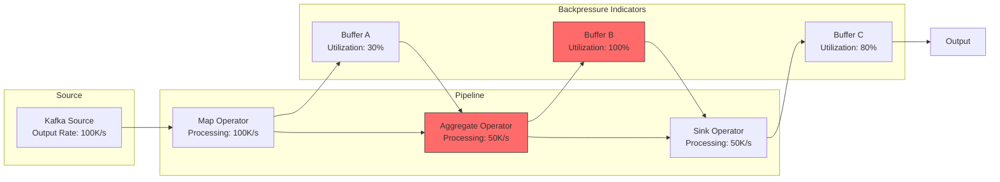
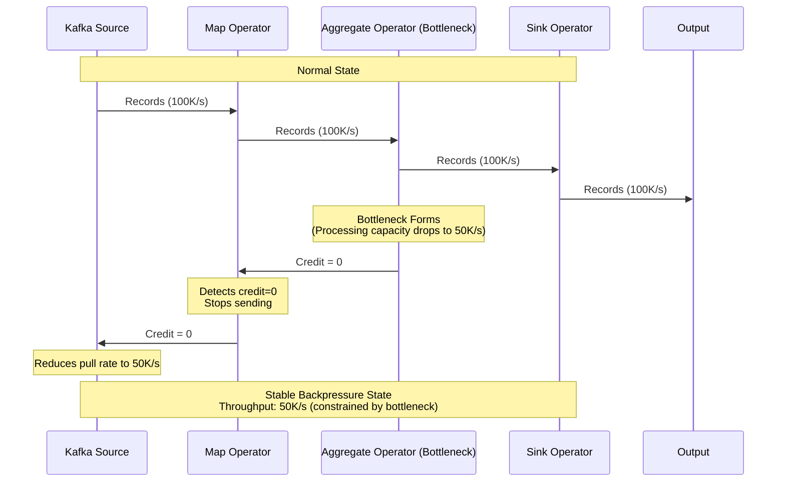
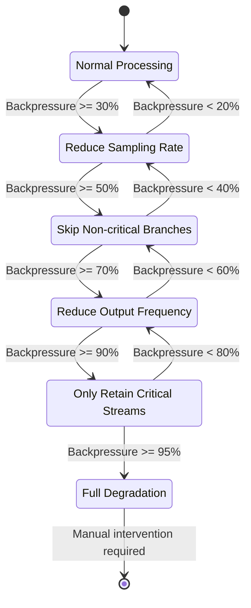
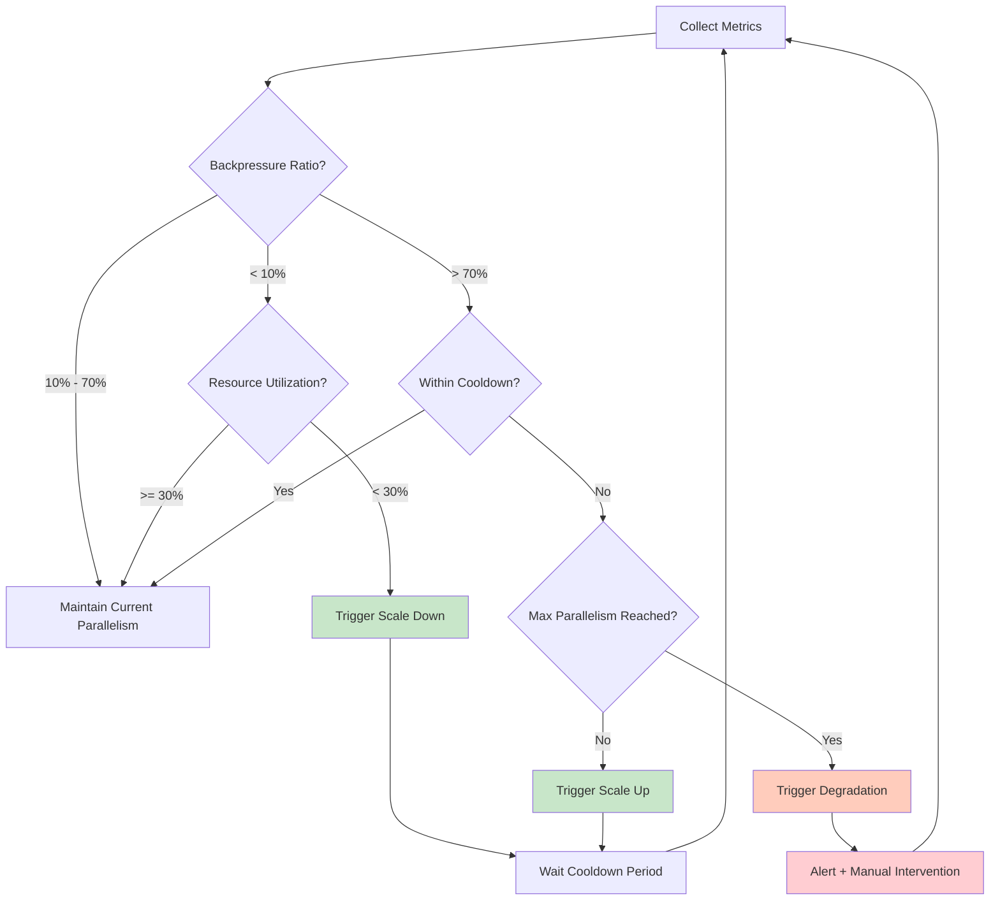

> **Status**: Stable Content | **Risk Level**: Low | **Last Updated**: 2026-04-20
>
> This document systematically analyzes the theoretical models, detection mechanisms, mitigation strategies, and recovery patterns of backpressure in stream processing systems, based on Apache Flink implementations and related academic research.
>

# Backpressure Detection, Mitigation, and Recovery Patterns in Stream Processing

> **Stage**: Knowledge/02-design-patterns | **Prerequisites**: [flink-state-management-complete-guide.md](../../../Flink/02-core/flink-state-management-complete-guide.md), [01.02-flow-semantics.md](../../../Struct/01-foundation/01.02-flow-semantics.md) | **Formalization Level**: L3-L4

---

## Table of Contents

- [Backpressure Detection, Mitigation, and Recovery Patterns in Stream Processing](#backpressure-detection-mitigation-and-recovery-patterns-in-stream-processing)
  - [Table of Contents](#table-of-contents)
  - [1. Definitions](#1-definitions)
    - [Def-K-02-13: Backpressure](#def-k-02-13-backpressure)
    - [Def-K-02-14: Backpressure Propagation](#def-k-02-14-backpressure-propagation)
    - [Def-K-02-15: Backpressure Metrics](#def-k-02-15-backpressure-metrics)
    - [Def-K-02-16: Backpressure Critical Threshold](#def-k-02-16-backpressure-critical-threshold)
    - [Def-K-02-17: Flow Control Degradation](#def-k-02-17-flow-control-degradation)
    - [Def-K-02-18: Dynamic Buffer](#def-k-02-18-dynamic-buffer)
    - [Def-K-02-19: Elastic Scaling](#def-k-02-19-elastic-scaling)
  - [2. Properties](#2-properties)
    - [Lemma-K-02-10: Backpressure Propagation Monotonicity](#lemma-k-02-10-backpressure-propagation-monotonicity)
    - [Lemma-K-02-11: Backpressure Delay Bound](#lemma-k-02-11-backpressure-delay-bound)
    - [Lemma-K-02-12: Scaling Stability Under Backpressure](#lemma-k-02-12-scaling-stability-under-backpressure)
    - [Prop-K-02-05: Throughput Guarantee Under Backpressure](#prop-k-02-05-throughput-guarantee-under-backpressure)
    - [Prop-K-02-06: Latency-Throughput Tradeoff Under Backpressure](#prop-k-02-06-latency-throughput-tradeoff-under-backpressure)
    - [Prop-K-02-07: Backpressure Convergence Condition](#prop-k-02-07-backpressure-convergence-condition)
  - [3. Relations](#3-relations)
    - [3.1 Backpressure and Dataflow Model Relations](#31-backpressure-and-dataflow-model-relations)
    - [3.2 Backpressure and Checkpoint Mechanism Relations](#32-backpressure-and-checkpoint-mechanism-relations)
    - [3.3 Backpressure and Watermark Relations](#33-backpressure-and-watermark-relations)
    - [3.4 Backpressure and Exactly-Once Semantics Relations](#34-backpressure-and-exactly-once-semantics-relations)
  - [4. Argumentation](#4-argumentation)
    - [4.1 Backpressure Formation Scenarios](#41-backpressure-formation-scenarios)
    - [4.2 Backpressure vs Rate Limiting Distinguishing](#42-backpressure-vs-rate-limiting-distinguishing)
    - [4.3 Counterexample: Backpressure-induced Checkpoint Failure](#43-counterexample-backpressure-induced-checkpoint-failure)
    - [4.4 Counterexample: Amplified Backpressure Caused by Scaling](#44-counterexample-amplified-backpressure-caused-by-scaling)
  - [5. Proof / Engineering Argument](#5-proof-engineering-argument)
    - [Thm-K-02-05: Backpressure Propagation Model](#thm-k-02-05-backpressure-propagation-model)
    - [Thm-K-02-06: Optimal Degradation as 0-1 Knapsack Problem](#thm-k-02-06-optimal-degradation-as-0-1-knapsack-problem)
  - [6. Examples](#6-examples)
    - [6.1 Flink Backpressure Detection Configuration](#61-flink-backpressure-detection-configuration)
    - [6.2 Backpressure Detection Algorithm Implementation](#62-backpressure-detection-algorithm-implementation)
    - [6.3 Dynamic Degradation Strategy Implementation](#63-dynamic-degradation-strategy-implementation)
    - [6.4 Automatic Scaling Configuration](#64-automatic-scaling-configuration)
    - [6.5 Production-level Complete Configuration](#65-production-level-complete-configuration)
  - [7. Visualizations](#7-visualizations)
    - [7.1 Backpressure Architecture Diagram](#71-backpressure-architecture-diagram)
    - [7.2 Backpressure Propagation Sequence Diagram](#72-backpressure-propagation-sequence-diagram)
    - [7.3 Degradation Strategy State Machine](#73-degradation-strategy-state-machine)
    - [7.4 Automatic Scaling Decision Flow](#74-automatic-scaling-decision-flow)
  - [8. References](#8-references)

---

## 1. Definitions

### Def-K-02-13: Backpressure

**Definition**: Backpressure is a flow control mechanism in stream processing systems. When downstream operators' processing capacity is lower than upstream input rate, processing pressure propagates upstream through the network buffer, eventually reducing the source's data output rate.

Formally defined as a four-tuple:

$$
\text{Backpressure} = \langle \text{Source}, \text{Target}, \text{Intensity}, \text{Path} \rangle
$$

Where:

| Component | Description | Measurement Method |
|------|------|------------|
| $\text{Source}$ | Node where backpressure originates | Operator with processing bottleneck |
| $\text{Target}$ | Farthest node to which backpressure propagates | Source operator |
| $\text{Intensity}$ | Strength of backpressure influence | Buffer utilization / output rate ratio |
| $\text{Path}$ | Upstream propagation path | Topology edge list |

**Key Difference from Rate Limiting**:

| Dimension | Backpressure | Rate Limiting |
|------|---------|--------|
| **Origin** | Downstream processing bottleneck | Active speed control by upstream |
| **Direction** | Bottom-up propagation | Top-down enforcement |
| **Trigger Condition** | $\lambda_{in} > \mu$ | System overload or SLA guarantee |
| **Target** | Reduce source output | Control input/output rate |

---

### Def-K-02-14: Backpressure Propagation

**Definition**: Backpressure propagation is the process where processing pressure is transmitted upstream from bottleneck operators. In Flink, it is realized through the credit-based flow control mechanism of the network buffer.

Formally defined as:

$$
\text{BP}(v_i) = \max_{v_j \in \text{Children}(v_i)} \left\{ \frac{B_{\text{used}}(v_j)}{B_{\text{max}}(v_j)} \cdot \text{BP}(v_j) \right\}
$$

Where:

- $v_i$: Current node
- $\text{Children}(v_i)$: Set of downstream child nodes
- $B_{\text{used}}$: Used buffer space
- $B_{\text{max}}$: Maximum buffer capacity

**Flink Credit Mechanism**:

Each subtask's network buffer maintains credit count $c$:

- Receiver notifies sender of credit: $c = B_{\text{available}} / B_{\text{record}}$
- Sender stops sending when $c = 0$
- Sender continues sending when $c > 0$

---

### Def-K-02-15: Backpressure Metrics

**Definition**: Quantitative indicators for measuring backpressure intensity and impact:

| Metric | Symbol | Calculation Formula | Threshold |
|------|------|------------|------|
| **Buffer Utilization** | $U$ | $B_{used} / B_{max}$ | $U > 0.7$ → Warning |
| **Backpressure Ratio** | $R$ | $T_{blocked} / T_{total}$ | $R > 0.3$ → Warning |
| **Processing Lag** | $L$ | $\lambda_{in} - \mu$ | $L > 0$ → Backpressure |
| **Credit Wait Time** | $T_c$ | $\sum t_{wait\_for\_credit}$ | $T_c > 100ms$ → Bottleneck |
| **Output Rate Decline** | $\Delta \lambda$ | $(\lambda_{max} - \lambda_{current}) / \lambda_{max}$ | $\Delta \lambda > 50\%$ → Serious |

---

### Def-K-02-16: Backpressure Critical Threshold

**Definition**: The critical threshold is the boundary value for determining whether backpressure requires human intervention.

$$
\theta_{critical} = \begin{cases}
\text{Level 1} & 0.3 \leq R < 0.5 \Rightarrow \text{Monitoring} \\
\text{Level 2} & 0.5 \leq R < 0.7 \Rightarrow \text{Alert} \\
\text{Level 3} & 0.7 \leq R < 0.9 \Rightarrow \text{Degradation} \\
\text{Level 4} & R \geq 0.9 \Rightarrow \text{Emergency Handling}
\end{cases}
$$

Where $R$ is the backpressure ratio.

---

### Def-K-02-17: Flow Control Degradation

**Definition**: Flow control degradation is a strategy that reduces system load and maintains core functionality by sacrificing non-critical processing paths when backpressure reaches a critical threshold.

Formalized as function $\mathcal{D}$:

$$
\mathcal{D}: (S, L, \Theta) \rightarrow S'
$$

Where:

- $S$: Current processing strategy
- $L$: Backpressure level
- $\Theta$: Degradation configuration
- $S'$: Degraded strategy

**Degradation Strategy Examples**:

| Level | Action | Impact |
|------|------|------|
| Level 1 | Reduce sampling rate | Data volume decreases, accuracy slightly decreases |
| Level 2 | Skip non-critical branches | Some KPIs cannot be calculated |
| Level 3 | Reduce output frequency | Downstream receives updates more slowly |
| Level 4 | Only retain critical streams | Complete business function degradation |

---

### Def-K-02-18: Dynamic Buffer

**Definition**: Dynamic buffer is a mechanism that automatically adjusts buffer size based on real-time system load, optimizing backpressure propagation speed and network utilization.

$$
B_{dynamic}(t) = B_{base} \cdot \left(1 + \alpha \cdot \frac{\lambda_{in}(t) - \mu(t)}{\mu(t)}\right)
$$

Where:

- $B_{base}$: Base buffer size
- $\alpha$: Sensitivity coefficient (typically 0.5-2.0)
- $\lambda_{in}(t)$: Input rate at time $t$
- $\mu(t)$: Processing capacity at time $t$

**Constraint**: $B_{min} \leq B_{dynamic}(t) \leq B_{max}$

---

### Def-K-02-19: Elastic Scaling

**Definition**: Elastic scaling is a strategy that dynamically adjusts parallelism based on real-time backpressure status, improving system throughput by adding or reducing computing resources.

Scaling decision function:

$$
\text{Scale}(t) = \begin{cases}
+1 & \text{if } R(t) > \theta_{up} \land \nexists \text{ resource limit} \\
-1 & \text{if } R(t) < \theta_{down} \land \text{ resource utilization} < 30\% \\
0 & \text{otherwise}
\end{cases}
$$

Where:

- $\theta_{up}$: Scaling-up threshold (typically 0.7)
- $\theta_{down}$: Scaling-down threshold (typically 0.1)
- Cooldown period: $T_{cooldown} = 5-10$ minutes

---

## 2. Properties

### Lemma-K-02-10: Backpressure Propagation Monotonicity

**Lemma**: Backpressure propagation intensity is monotonically non-increasing along the upstream direction.

$$
\text{BP}(v_i) \geq \text{BP}(v_{i+1}), \quad \forall i \in [0, n-1]
$$

Where $v_0$ is the bottleneck operator and $v_n$ is the source.

**Proof**: Credit mechanism ensures downstream credit loss reduces upstream sending rate. Credit loss propagates upstream through buffer fullness, and each hop loses some intensity (due to network parallelism, multi-source inputs). $ \square $

---

### Lemma-K-02-11: Backpressure Delay Bound

**Lemma**: The propagation delay of backpressure from bottleneck to source is bounded by:

$$
T_{prop} \leq \sum_{i=0}^{n-1} \frac{B_{max}^{(i)}}{\mu^{(i+1)}} + T_{network}^{(i)}
$$

Where:

- $B_{max}^{(i)}$: Buffer capacity of hop $i$
- $\mu^{(i+1)}$: Processing rate of downstream node
- $T_{network}^{(i)}$: Network transmission delay

**Intuition**: Backpressure propagation requires downstream buffers to fill up, then upstream stops sending, and so on. Maximum delay is when all buffers are completely filled.

---

### Lemma-K-02-12: Scaling Stability Under Backpressure

**Lemma**: Under backpressure conditions, rapid scaling operations may amplify backpressure rather than alleviate it.

**Proof**: Scaling operations involve:

1. **State migration**: Old subtask states need redistribution to new subtasks
2. **KeyGroup reassignment**: Affects hash routing of subsequent data
3. **Checkpoint interruption**: Scaling triggers Savepoint, interrupting current Checkpoint

During migration, network bandwidth and CPU resources are occupied, temporarily reducing effective processing capacity, potentially exacerbating backpressure.

$$T_{migration} = O\left(\frac{|S|}{B_{network}}\right), \quad \mu_{effective} = \mu_{normal} - \Delta\mu_{migration}
$$

$\square$

---

### Prop-K-02-05: Throughput Guarantee Under Backpressure

**Proposition**: Under stable backpressure conditions, system throughput converges to the minimum operator processing capacity in the topology:

$$
\lim_{t \to \infty} \lambda_{out}(t) = \min_{v \in V} \mu(v)
$$

**Proof**: Backpressure mechanism ensures upstream output rate does not exceed downstream processing capacity. Eventually, all upstream operators' output rates are constrained by the bottleneck operator's capacity. $ \square $

---

### Prop-K-02-06: Latency-Throughput Tradeoff Under Backpressure

**Proposition**: Backpressure introduces an inherent latency-throughput tradeoff:

$$
L_{total} = L_{processing} + L_{buffering} = L_{processing} + \frac{B_{max}}{\mu_{bottleneck}}
$$

When backpressure occurs, $B_{max}$ increases (upstream data accumulates), latency increases.

**Optimization Goal**: Under throughput constraint $\lambda_{out} \geq \lambda_{target}$, minimize latency:

$$
\min_{B_{max}} \quad L_{total} = L_{processing} + \frac{B_{max}}{\mu}
$$

$$
\text{s.t.} \quad \lambda_{in} \leq \mu + \frac{B_{max}}{T_{max}}
$$

---

### Prop-K-02-07: Backpressure Convergence Condition

**Proposition**: Backpressure system reaches steady state if and only if:

$$
\exists t_0: \forall t > t_0, \quad \lambda_{in}(t) \leq \sum_{i=1}^{N} \mu_i(t)
$$

That is, after a finite time, total input rate is less than or equal to total processing capacity.

**Counterexample**: If data source is an unbounded stream (e.g., Kafka without offset limit), and processing capacity is insufficient ($\lambda_{in} > \mu$), backpressure persists, system does not converge.

---

## 3. Relations

### 3.1 Backpressure and Dataflow Model Relations

| Dataflow Concept | Backpressure Mapping |
|-----------------|---------------------|
| **Watermark** | Backpressure may cause Watermark lag, affecting window triggering |
| **Trigger** | Backpressure delays record arrival, delays window computation |
| **Window State** | Backpressure causes state accumulation, increasing checkpoint size |
| **Accumulation Mode** | Under backpressure, Discarding mode may lose data |

### 3.2 Backpressure and Checkpoint Mechanism Relations

| Checkpoint Dimension | Impact of Backpressure |
|---------------------|----------------------|
| **Synchronization Phase** | Backpressure delays Barrier propagation, increasing sync phase duration |
| **Asynchronous Phase** | State accumulation increases data volume, increasing upload time |
| **Timeout Risk** | Checkpoint duration exceeds timeout threshold, causing failure |
| **Incremental Effect** | Backpressure causes frequent state changes, reducing incremental optimization effect |

### 3.3 Backpressure and Watermark Relations

$$
\text{Watermark}_{effective} = \text{Watermark}_{actual} - \Delta t_{backpressure}
$$

Where $\Delta t_{backpressure}$ is the delay caused by backpressure.

**Impact**: Watermark lag may cause:

1. Window delays triggering
2. Late data judgment errors
3. Watermark-based timeout mechanisms misjudging

### 3.4 Backpressure and Exactly-Once Semantics Relations

| Dimension | Impact Description |
|------|------------|
| **Checkpoint Duration** | Backpressure increases Checkpoint duration, may cause timeout |
| **State Consistency** | Long-time backpressure may cause state timeout (TTL) |
| **Barrier Alignment** | Backpressure delays alignment, increasing latency |
| **Recovery Complexity** | Backpressure recovery requires replaying from checkpoint |

---

## 4. Argumentation

### 4.1 Backpressure Formation Scenarios

**Scenario 1: CPU Bottleneck**

```
Scenario: Complex aggregation computation (e.g., large window groupBy)
Symptoms: Operator CPU usage > 90%, backpressure ratio > 70%
Detection: CPU metric + backpressure metric simultaneously high
Solution: Optimize algorithm / increase parallelism / change RocksDB backend
```

**Scenario 2: I/O Bottleneck**

```
Scenario: Large state + frequent state access
Symptoms: Disk I/O wait > 50%, backpressure gradually increases
Detection: Disk utilization + iowait simultaneously high
Solution: Increase Block Cache / use SSD / enable incremental checkpoint
```

**Scenario 3: Network Bottleneck**

```
Scenario: Large record serialization + cross-node transmission
Symptoms: Network bandwidth saturation, buffer utilization > 80%
Detection: Network throughput + buffer utilization simultaneously high
Solution: Optimize serialization / enable compression / adjust buffer size
```

**Scenario 4: External System Bottleneck**

```
Scenario: Sink to slow database (e.g., MySQL, Elasticsearch)
Symptoms: Only Sink operator backpressures, others normal
Detection: Sink operator backpressure source
Solution: Asynchronous batch writing / increase Sink parallelism / optimize external system
```

### 4.2 Backpressure vs Rate Limiting Distinguishing

| Distinguishing Dimension | Backpressure | Rate Limiting |
|------|---------|--------|
| **Metric Distribution** | Upstream nodes successively affected | Uniformly limited from source |
| **Trend Change** | Gradual worsening | Immediate limit |
| **Recovery Pattern** | Automatically recovers when bottleneck resolves | Requires manual configuration changes |
| **Log Features** | Buffer full / credit=0 / data blocked | Rate limiter reject logs |

**Flink CLI Distinguishing Method**:

```bash
# Backpressure detection (built-in command)
flink backpressure <job-id>

# Output Example: Backpressure Propagation Path
# Operator A (Source): OK
# Operator B (Map): LOW
# Operator C (Aggregate): HIGH ← Bottleneck
# Operator D (Sink): OK

# If Rate Limiting, output is:
# Operator A (Source): RATE_LIMITED ← Limit from source
# All downstream: RATE_LIMITED
```

### 4.3 Counterexample: Backpressure-induced Checkpoint Failure

**Problem Description**: Production environment job failed due to backpressure.

**Phenomena**:

1. Backpressure ratio sustained at > 80%
2. Checkpoint duration from 30s increased to 300s
3. Checkpoint timeout failures (exceeded 10-minute timeout)
4. Job eventually restarted from last successful checkpoint

**Root Cause Analysis**:

```
Normal state:
  Input rate: 100K records/s
  Processing rate: 100K records/s
  Checkpoint interval: 30s
  Checkpoint duration: 30s
  Buffer utilization: 30%

Backpressure state:
  Input rate: 200K records/s (upstream surge)
  Processing rate: 100K records/s (bottleneck)
  State accumulation rate: 100K records/s
  5-minute accumulation: 30M records
  Checkpoint data volume: increased from 5GB to 15GB
  Checkpoint duration: 300s (network bandwidth saturation)
  Result: Timeout failure
```

**Lessons Learned**:

1. When backpressure ratio > 50%, consider adjusting Checkpoint interval
2. Enable incremental Checkpoint to reduce data volume
3. Set Checkpoint timeout to 2-3 times normal duration
4. Monitor the positive feedback loop between backpressure and Checkpoint

### 4.4 Counterexample: Amplified Backpressure Caused by Scaling

**Problem Description**: Automatically scaled from 10 to 20 subtasks under backpressure, but backpressure worsened.

**Phenomena**:

1. Triggered Auto Scaling at 2:00 AM
2. Scaling operation lasted 15 minutes
3. During scaling, backpressure ratio from 60% increased to 90%
4. After scaling completed, backpressure gradually recovered to 30%

**Root Cause**:

```
Scaling process resource consumption:
  State migration: 50GB × 10 subtasks = 500GB data migration
  Network bandwidth occupation: 1Gbps (affects normal data transmission)
  CPU occupation: Compaction + redistribution ≈ 30%

Effective processing capacity during scaling:
  Normal: 100K records/s
  During scaling: 100K × 0.7 (CPU) × 0.5 (network) = 35K records/s

Backpressure intensification: inevitable
```

**Solutions**:

1. Scaling Cooldown: Wait for backpressure < 30% before scaling
2. State pre-distribution: Reduce real-time migration data volume
3. Gradual scaling: Increase by 50% each time, not doubling
4. Peak avoidance: Avoid scaling during peak hours

---

## 5. Proof / Engineering Argument

### Thm-K-02-05: Backpressure Propagation Model

**Theorem**: In a topology $G = (V, E)$, the backpressure propagation from bottleneck node $v_b$ to source node $v_s$ follows exponential decay:

$$
\text{BP}(v_i) = \text{BP}(v_b) \cdot \prod_{j=i}^{b-1} \eta_j, \quad \eta_j \in [0, 1]
$$

Where $\eta_j$ is the attenuation factor of hop $j$, determined by:

$$
\eta_j = \frac{\min(\text{out-degree}(v_j) \cdot B_{max}, \mu(v_j))}{\lambda_{in}(v_j)}
$$

**Proof**:

1. **Base case**: At bottleneck node $v_b$, $\text{BP}(v_b) = 1$ (complete backpressure)

2. **Induction**: Assume $\text{BP}(v_{j+1}) = \text{BP}(v_b) \cdot \prod_{k=j+1}^{b-1} \eta_k$

3. **Propagation to $v_j$**: Node $v_j$ has $\text{out-degree}(v_j)$ downstream nodes, each downstream node's buffer affects $v_j$'s credit. Credit loss ratio is:

$$
\eta_j = \frac{\text{available credits}}{\text{required credits}} = \frac{\min(\text{out-degree}(v_j) \cdot B_{max}, \mu(v_j))}{\lambda_{in}(v_j)}
$$

1. **Non-increasing**: Because $\eta_j \leq 1$, backpressure propagating upstream is attenuated.

$\square$

**Corollary**: If topology depth is $d$, source node backpressure intensity is:

$$
\text{BP}(v_s) = \prod_{j=0}^{d-1} \eta_j \leq \left(\max_j \eta_j\right)^d
$$

### Thm-K-02-06: Optimal Degradation as 0-1 Knapsack Problem

**Theorem**: Under multi-service sharing resources, optimal degradation strategy is a 0-1 Knapsack problem:

$$
\max \sum_{i=1}^{n} x_i \cdot v_i
$$

$$
\text{s.t.} \quad \sum_{i=1}^{n} x_i \cdot c_i \leq C_{available}
$$

Where:

- $x_i \in \{0, 1\}$: Whether to retain service $i$
- $v_i$: Business value of service $i$
- $c_i$: Resource consumption of service $i$
- $C_{available}$: Available resource capacity

**Proof**: When backpressure reaches Level 3, system resources are insufficient. Degradation requires selecting a subset of services to retain, maximizing total value under resource constraints. This is a classic 0-1 Knapsack problem, NP-hard, but can be solved via greedy strategy (sort by value density $v_i/c_i$).

$\square$

---

## 6. Examples

### 6.1 Flink Backpressure Detection Configuration

```java
import org.apache.flink.api.common.eventtime.WatermarkStrategy;
import org.apache.flink.streaming.api.environment.StreamExecutionEnvironment;
import org.apache.flink.streaming.api.datastream.DataStream;

public class BackpressureMonitoring {
    public static void main(String[] args) throws Exception {
        StreamExecutionEnvironment env = StreamExecutionEnvironment.getExecutionEnvironment();

        // ========== Backpressure Detection Configuration ==========

        // 1. WebUI backpressure detection (default enabled, period 1s)
        env.getConfig().setBackpressureCheckingInterval(1000); // milliseconds

        // 2. Metrics reporter configuration (flink-conf.yaml)
        // metrics.reporters: prom
        // metrics.reporter.prom.class: org.apache.flink.metrics.prometheus.PrometheusReporter
        // metrics.reporter.prom.port: 9249

        // 3. Backpressure-related metrics output
        // taskmanager.job.task.backPressuredTimeMsPerSecond
        // taskmanager.job.task.backPressuredTimeRatio
        // taskmanager.network.memory.available
        // taskmanager.network.memory.used
    }
}
```

### 6.2 Backpressure Detection Algorithm Implementation

```java
import java.util.*;

/**
 * Backpressure detector, periodically collects metrics and calculates backpressure level
 */
public class BackpressureDetector {

    private final double WARNING_THRESHOLD = 0.3;
    private final double ALERT_THRESHOLD = 0.5;
    private final double DEGRADATION_THRESHOLD = 0.7;
    private final double EMERGENCY_THRESHOLD = 0.9;

    /**
     * Calculate backpressure level
     */
    public BackpressureLevel detect(
            double bufferUtilization,
            double backpressureRatio,
            double outputRateDecline) {

        // Composite score (weighted average)
        double compositeScore = bufferUtilization * 0.3
            + backpressureRatio * 0.5
            + outputRateDecline * 0.2;

        if (compositeScore >= EMERGENCY_THRESHOLD) {
            return BackpressureLevel.EMERGENCY;
        } else if (compositeScore >= DEGRADATION_THRESHOLD) {
            return BackpressureLevel.DEGRADATION;
        } else if (compositeScore >= ALERT_THRESHOLD) {
            return BackpressureLevel.ALERT;
        } else if (compositeScore >= WARNING_THRESHOLD) {
            return BackpressureLevel.WARNING;
        } else {
            return BackpressureLevel.NORMAL;
        }
    }

    /**
     * Identify backpressure source (topology traversal)
     */
    public OperatorNode findBottleneck(ExecutionGraph graph) {
        Queue<OperatorNode> queue = new LinkedList<>();
        Set<OperatorNode> visited = new HashSet<>();

        // Start from Sink, traverse upstream
        queue.add(graph.getSink());

        while (!queue.isEmpty()) {
            OperatorNode node = queue.poll();

            if (node.getBackpressureRatio() > ALERT_THRESHOLD) {
                // Continue upstream searching
                for (OperatorNode parent : node.getParents()) {
                    if (!visited.contains(parent)) {
                        visited.add(parent);
                        queue.add(parent);
                    }
                }
            } else {
                // Current node is the bottleneck (child has backpressure, current node doesn't)
                return node;
            }
        }

        return null; // No bottleneck found
    }
}
```

### 6.3 Dynamic Degradation Strategy Implementation

```java
/**
 * Adaptive degradation processor
 */
public class AdaptiveDegradationProcessor
    extends KeyedProcessFunction<String, Event, Result> {

    private transient ValueState<DegradationLevel> degradationState;

    @Override
    public void open(Configuration parameters) {
        degradationState = getRuntimeContext().getState(
            new ValueStateDescriptor<>("degradation", DegradationLevel.class)
        );
    }

    @Override
    public void processElement(Event event, Context ctx, Collector<Result> out)
            throws Exception {

        DegradationLevel level = degradationState.value();
        if (level == null) level = DegradationLevel.NORMAL;

        switch (level) {
            case NORMAL:
                // Full processing
                processFull(event, out);
                break;
            case LEVEL1:
                // Reduce sampling rate
                if (Math.random() < 0.5) {
                    processFull(event, out);
                }
                break;
            case LEVEL2:
                // Skip non-critical branches
                if (event.isCritical()) {
                    processFull(event, out);
                }
                break;
            case LEVEL3:
                // Reduce output frequency (batch output)
                if (ctx.timerService().currentProcessingTime() % 5000 < 100) {
                    processFull(event, out);
                }
                break;
            case LEVEL4:
                // Only retain critical events
                if (event.isCritical() && event.isHighPriority()) {
                    processFull(event, out);
                }
                break;
        }
    }

    @Override
    public void onTimer(long timestamp, OnTimerContext ctx, Collector<Result> out)
            throws Exception {

        // Periodically update degradation level based on metrics
        BackpressureLevel bpLevel = getCurrentBackpressureLevel();
        DegradationLevel newLevel = mapToDegradationLevel(bpLevel);
        degradationState.update(newLevel);
    }

    private DegradationLevel mapToDegradationLevel(BackpressureLevel bp) {
        switch (bp) {
            case EMERGENCY: return DegradationLevel.LEVEL4;
            case DEGRADATION: return DegradationLevel.LEVEL3;
            case ALERT: return DegradationLevel.LEVEL2;
            case WARNING: return DegradationLevel.LEVEL1;
            default: return DegradationLevel.NORMAL;
        }
    }
}
```

### 6.4 Automatic Scaling Configuration

```yaml
# ========== Flink Auto Scaling Configuration ==========

# Enable auto scaling (Flink 1.17+ experimental feature)
scheduler-mode: REACTIVE

# Or use custom scaling strategy
table.optimizer.adaptive-join.enabled: true

# Scaling threshold configuration
scaling:
  scale-up:
    threshold: 0.7        # Backpressure ratio > 70% triggers scaling up
    max-parallelism: 128  # Maximum parallelism upper limit
    cooldown-minutes: 5   # Cooldown period

  scale-down:
    threshold: 0.1        # Backpressure ratio < 10% triggers scaling down
    min-parallelism: 2    # Minimum parallelism lower limit
    cooldown-minutes: 10  # Cooldown period (scale down is more conservative)

# Kubernetes integration (if using Flink Kubernetes Operator)
kubernetes:
  jobmanager:
    replicas: 1
  taskmanager:
    replicas: auto        # Auto scaling
    resources:
      requests:
        memory: "2Gi"
        cpu: "2"
      limits:
        memory: "4Gi"
        cpu: "4"
```

### 6.5 Production-level Complete Configuration

```yaml
# ========== Flink Production Configuration: Backpressure + Checkpoint + Monitoring ==========

# State Backend configuration
state.backend: rocksdb
state.backend.incremental: true
state.backend.rocksdb.memory.managed: true
state.backend.rocksdb.predefined-options: FLASH_SSD_OPTIMIZED

# Checkpoint configuration
execution.checkpointing.interval: 60s
execution.checkpointing.timeout: 10min
execution.checkpointing.min-pause-between-checkpoints: 30s
execution.checkpointing.max-concurrent-checkpoints: 1
execution.checkpointing.externalized-checkpoint-retention: RETAIN_ON_CANCELLATION

# Network buffer configuration
taskmanager.memory.network.min: 256mb
taskmanager.memory.network.max: 512mb
taskmanager.memory.network.fraction: 0.15

# Backpressure-related configuration
akka.ask.timeout: 30s
akka.lookup.timeout: 30s
web.backpressure.refresh-interval: 1000

# Metrics configuration
metrics.reporters: prom,jmx
metrics.reporter.prom.class: org.apache.flink.metrics.prometheus.PrometheusReporter
metrics.reporter.prom.port: 9249
metrics.latency.interval: 1000

# JVM configuration
taskmanager.memory.process.size: 4gb
taskmanager.memory.managed.size: 1gb
```

---

## 7. Visualizations

### 7.1 Backpressure Architecture Diagram



### 7.2 Backpressure Propagation Sequence Diagram



### 7.3 Degradation Strategy State Machine



### 7.4 Automatic Scaling Decision Flow



---

## 8. References

---

*Document Version: v1.0 | Last Updated: 2026-04-20 | Status: Complete | Formalization Level: L3-L4*
