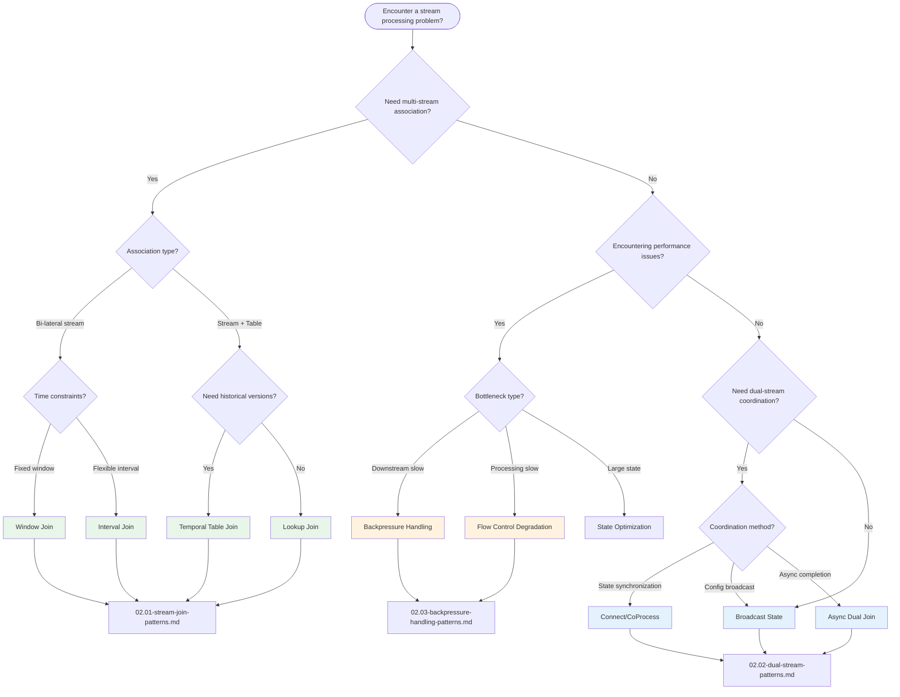

# Design Patterns Directory

> **Stage**: Knowledge/02-design-patterns | **Formalization Level**: L3-L5
>
> Stream computing design pattern index, providing pattern selection decision trees and scenario-based pattern catalogs.

---

## Table of Contents

- [Design Patterns Directory](#design-patterns-directory)
  - [Table of Contents](#table-of-contents)
  - [Design Patterns Overview](#design-patterns-overview)
    - [What Are Stream Computing Design Patterns?](#what-are-stream-computing-design-patterns)
    - [Pattern Numbering System](#pattern-numbering-system)
  - [Pattern Selection Decision Tree](#pattern-selection-decision-tree)
  - [By Scenario](#by-scenario)
    - [1. Data Association Scenarios](#1-data-association-scenarios)
    - [2. Performance Optimization Scenarios](#2-performance-optimization-scenarios)
    - [3. Dual-Stream Coordination Scenarios](#3-dual-stream-coordination-scenarios)
  - [Pattern Quick Reference](#pattern-quick-reference)
    - [Stream Join Pattern Comparison](#stream-join-pattern-comparison)
    - [Dual-Stream Processing Pattern Comparison](#dual-stream-processing-pattern-comparison)
    - [Backpressure Handling Strategy Matrix](#backpressure-handling-strategy-matrix)
  - [Pattern Combination Recommendations](#pattern-combination-recommendations)
    - [Typical Combination Patterns](#typical-combination-patterns)
  - [Further Reading](#further-reading)
    - [Core Documents](#core-documents)
    - [Related Pattern Documents](#related-pattern-documents)
    - [Formal Theory](#formal-theory)

---

## Design Patterns Overview

### What Are Stream Computing Design Patterns?

Stream computing design patterns are formalized descriptions of **reusable solutions to common problems** in stream processing systems. Each pattern includes:

- **Problem Definition**: The core challenge the pattern addresses
- **Solution**: Verified solution approach and implementation
- **Code Examples**: Engineering implementations ready for use
- **Applicable Scenarios**: Clear usage boundaries and limitations

### Pattern Numbering System

This directory adopts the standard `Def-K-02-{serial}` numbering system:

| Pattern Category | Number Range | Example |
|---------|---------|------|
| Stream Join | Def-K-02-01 ~ 02-06 | Def-K-02-01 [Stream Join] |
| Dual-Stream Processing | Def-K-02-07 ~ 02-12 | Def-K-02-08 [Connect Operation] |
| Backpressure Handling | Def-K-02-13 ~ 02-19 | Def-K-02-13 [Backpressure] |

---

## Pattern Selection Decision Tree



---

## By Scenario

### 1. Data Association Scenarios

| Scenario | Recommended Pattern | Document | Complexity |
|-----|---------|------|-------|
| Real-time order and payment association | Window Join | [02.01](02.01-stream-join-patterns.md) | ★★☆ |
| Ad click attribution | Interval Join | [02.01](02.01-stream-join-patterns.md) | ★★★ |
| Historical exchange rate conversion | Temporal Table Join | [02.01](02.01-stream-join-patterns.md) | ★★★ |
| User info enrichment | Lookup Join | [02.01](02.01-stream-join-patterns.md) | ★☆☆ |
| Order inventory matching | Connect + CoProcess | [02.02](02.02-dual-stream-patterns.md) | ★★★ |
| Real-time risk control rules | Broadcast State | [02.02](02.02-dual-stream-patterns.md) | ★★★ |

### 2. Performance Optimization Scenarios

| Scenario | Recommended Pattern | Document | Key Metrics |
|-----|---------|------|---------|
| Severe system backpressure | Backpressure detection + dynamic buffering | [02.03](02.03-backpressure-handling-patterns.md) | Queue occupancy, latency |
| Peak degradation | Flow control degradation | [02.03](02.03-backpressure-handling-patterns.md) | Sampling rate, feature trimming |
| Elastic scaling | Auto-scaling | [02.03](02.03-backpressure-handling-patterns.md) | Parallelism, cooldown period |

### 3. Dual-Stream Coordination Scenarios

| Scenario | Recommended Pattern | Document | Key Features |
|-----|---------|------|---------|
| Dynamic config updates | Broadcast State | [02.02](02.02-dual-stream-patterns.md) | Full task synchronization |
| Heterogeneous stream processing | Connect | [02.02](02.02-dual-stream-patterns.md) | Type preservation |
| Async external queries | Async I/O | [02.02](02.02-dual-stream-patterns.md) | Latency hiding |

---

## Pattern Quick Reference

### Stream Join Pattern Comparison

```
┌────────────────────┬──────────────────┬─────────────────┬─────────────────┐
│     Pattern        │    Scenario      │     State Need  │    Latency      │
├────────────────────┼──────────────────┼─────────────────┼─────────────────┤
│ Window Join        │ Bi-lateral stream│ Window buffer   │ Window-end trigger│
│ Interval Join      │ Time-related     │ Time-ordered buf│ Instant match   │
│ Temporal Join      │ Historical ver.  │ Versioned state │ Instant query   │
│ Lookup Join        │ External dim table│ No/local cache  │ Sync/async query│
└────────────────────┴──────────────────┴─────────────────┴─────────────────┘
```

### Dual-Stream Processing Pattern Comparison

```
┌────────────────────┬──────────────────┬─────────────────┬─────────────────┐
│     Pattern        │    Core Capability│     State Type  │    Complexity   │
├────────────────────┼──────────────────┼─────────────────┼─────────────────┤
│ Connect            │ Heterogeneous stream coordination│ Dual-stream independent state│ ★★☆            │
│ Broadcast State    │ Config sync broadcast│ Read-only broadcast state│ ★★★            │
│ Async Dual Join    │ Async non-blocking Join│ External state/cache│ ★★★            │
└────────────────────┴──────────────────┴─────────────────┴─────────────────┘
```

### Backpressure Handling Strategy Matrix

```
┌────────────────────┬──────────────────┬─────────────────┬─────────────────┐
│     Strategy       │    Trigger       │     Recovery    │    Data Quality │
├────────────────────┼──────────────────┼─────────────────┼─────────────────┤
│ Dynamic buffer expansion│ Queue > 50%   │ Fast            │ No loss         │
│ Flow control degradation (L1)│ Mild backpressure│ Fast           │ Slight drop     │
│ Flow control degradation (L2)│ Moderate backpressure│ Fairly fast    │ Medium drop     │
│ Flow control degradation (L3)│ Severe backpressure│ Fairly fast    │ Obvious drop    │
│ Elastic scaling    │ Persistent backpressure│ Slow (minutes)│ No loss         │
└────────────────────┴──────────────────┴─────────────────┴─────────────────┘
```

---

## Pattern Combination Recommendations

### Typical Combination Patterns

**1. Real-time Risk Control System**

```
User behavior stream ──┬─► Broadcast State ◄── Rule update stream
             │
             └─► CoProcessFunction ──► Risk assessment result
                    ▲
                    └── Query user profile (Async Lookup)
```

**2. Real-time Data Warehouse ETL**

```
Business stream ──► Window Join ──► Temporal Join ──► Cleaned result
             │                │
             └── Config stream ─────┴── Exchange rate history table
```

**3. High-Availability Recommendation System**

```
Click stream ──► Async Dual Join ──► With degradation handling ──► Recommendation result
             │                    │
             └── User profile(cache)    └── Backpressure detection
```

---

## Further Reading

### Core Documents

- [02.01 Stream Join Patterns](02.01-stream-join-patterns.md) - Window Join, Interval Join, Temporal Join, Lookup Join
- [02.02 Dual-Stream Processing Patterns](02.02-dual-stream-patterns.md) - Connect/CoProcess, Broadcast State, Async Dual Join
- [02.03 Backpressure Handling Patterns](02.03-backpressure-handling-patterns.md) - Detection, dynamic buffering, flow control degradation, elastic scaling

### Related Pattern Documents

- [pattern-event-time-processing.md](pattern-event-time-processing.md) - Event time processing
- [pattern-windowed-aggregation.md](pattern-windowed-aggregation.md) - Windowed aggregation
- [pattern-stateful-computation.md](pattern-stateful-computation.md) - Stateful computation
- [pattern-async-io-enrichment.md](pattern-async-io-enrichment.md) - Async I/O enrichment

### Formal Theory

- [Struct/01-foundation/](../../Struct/01-foundation/) - Stream computing theoretical foundations
- [Struct/00-INDEX.md](../../Struct/00-INDEX.md) - Distributed consistency

---

*Last Updated: 2026-04-11 | Document Version: v1.0*
