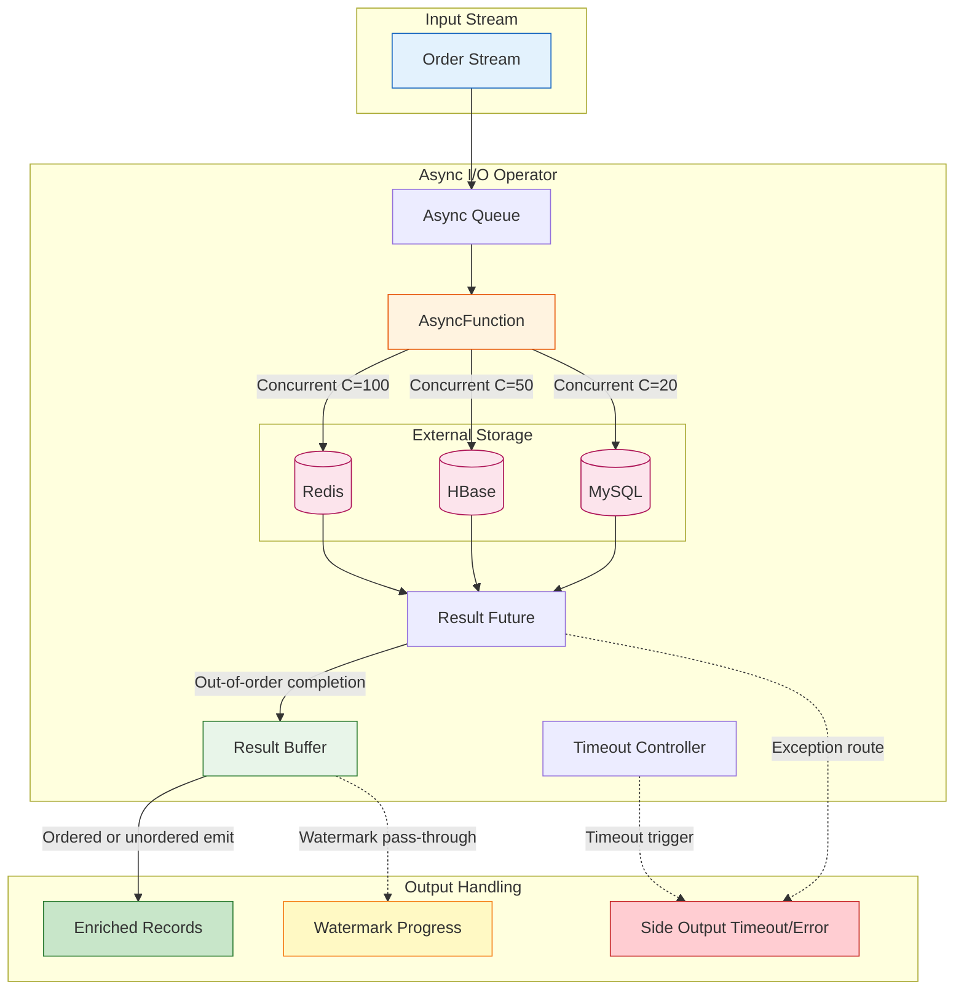

# Pattern: Async I/O Enrichment

> **Pattern ID**: 04/7 | **Series**: Knowledge/02-design-patterns | **Formalization Level**: L4-L5 | **Complexity**: ★★★☆☆
>
> This pattern resolves the core tension between **external data querying** and **stream processing latency** in stream processing, achieving high-throughput, low-latency data enrichment through asynchronous non-blocking I/O.

---

## 1. Definitions

### Def-K-02-05 (Async I/O Enrichment Pattern)

The **Async I/O Enrichment Pattern** is a stream processing design pattern that enriches stream records with external data through non-blocking concurrent queries, without blocking the main processing thread.

Let $\mathcal{R}$ be the set of stream records, $\mathcal{S}$ the external data store, and $f: \mathcal{R} \times \mathcal{S} \to \mathcal{R}'$ the enrichment function. The processing latency of traditional synchronous mode is:

$$
T_{\text{sync}} = |\mathcal{R}| \times (t_{\text{network}} + t_{\text{query}} + t_{\text{serialization}})
$$

The processing latency of asynchronous mode is:

$$
T_{\text{async}} \approx \frac{|\mathcal{R}| \times t_{\text{avg}}}{C}
$$

Where $C$ is the number of concurrent queries and $t_{\text{avg}}$ is the average single-query time.

**Core objectives**:

1. **Maximize throughput**: Allow a single operator instance to process multiple I/O requests concurrently
2. **Minimize latency**: Avoid records waiting for I/O completion and blocking subsequent processing
3. **Controlled resources**: Prevent resource exhaustion through backpressure and timeout mechanisms

---

### Def-K-02-06 (AsyncFunction Interface)

**AsyncFunction** is the asynchronous processing interface provided by Flink, defining the basic contract for async I/O operations.

```scala
// Flink AsyncFunction core interface
trait AsyncFunction[IN, OUT] extends Function {
  // Asynchronously process each input element
  def asyncInvoke(input: IN, resultFuture: ResultFuture[OUT]): Unit

  // Timeout callback (optional)
  def timeout(input: IN, resultFuture: ResultFuture[OUT]): Unit
}
```

**Semantic constraints**:

1. **Non-blocking promise**: `asyncInvoke` must return immediately and must not perform synchronous I/O
2. **Result callback**: Return results via `ResultFuture.complete()` or `completeExceptionally()`
3. **Single completion**: Each `resultFuture` can only be completed once (Exactly-Once semantics)
4. **Thread safety**: Implementations must consider state consistency under concurrent invocations

---

### Def-K-02-07 (Result Buffer)

The **Result Buffer** is a temporary storage structure maintained inside the async I/O operator, used to cache query results that have completed but have not yet been emitted in order.

Let the buffer be $B$, formally:

$$
B = \{(seq, result, status) \mid seq \in \mathbb{N}, result \in \mathcal{R}', status \in \{\text{PENDING}, \text{COMPLETED}\}\}
$$

Where $seq$ is the record sequence number used to guarantee output order.

**Buffer management strategies**:

| Strategy | Description | Applicable Scenario |
|------|------|---------|
| **Ordered** | Emit results in input order; buffer sorted by sequence number | Strict ordering required |
| **Unordered** | Emit results immediately upon completion; minimize latency | Order-independent enrichment |

---

### Def-K-02-08 (Timeout Control)

**Timeout control** is the fault-tolerance mechanism of async I/O, defining the upper bound of query waiting time.

Given timeout parameter $\tau > 0$, for query $q$ initiated at time $t_0$, the timeout condition is:

$$
\text{Timeout}(q) \iff t_{\text{now}} - t_0 > \tau
$$

After timeout, the system may choose to:

1. **Drop the record**: Route to side output or ignore
2. **Return default value**: Use a preset fallback value to continue processing
3. **Retry**: Re-initiate the query within a limited number of attempts

---

## 2. Properties

### Prop-K-02-01 (Async Throughput Improvement)

**Statement**: Let synchronous I/O throughput be $S_{\text{sync}} = \frac{1}{t_{\text{io}}}$, where $t_{\text{io}}$ is the average single I/O latency. Asynchronous I/O throughput with concurrency $C$ satisfies:

$$
S_{\text{async}} = \frac{C}{t_{\text{io}}} = C \times S_{\text{sync}}
$$

**Proof sketch**:

1. In synchronous mode, each record exclusively occupies the processing thread until I/O completes
2. In asynchronous mode, the thread initiates I/O and immediately returns to fetch the next record
3. Theoretically, a single thread can track $C$ in-flight queries simultaneously
4. Therefore throughput scales linearly with concurrency until network or external service bottleneck is reached

**Engineering constraints**: Actual throughput is limited by

- External store QPS ceiling
- Network connection pool size
- Operator memory buffer capacity

---

### Prop-K-02-02 (Concurrency-Memory Tradeoff)

**Statement**: Let the average record size be $s$ bytes, concurrency $C$, average I/O latency $t_{\text{io}}$, and record arrival rate $\lambda$. In ordered mode, required buffer memory $M$ satisfies:

$$
M \geq \lambda \times t_{\text{io}} \times s
$$

**Derivation**:

1. At any moment, there are approximately $\lambda \times t_{\text{io}}$ in-flight requests in the system
2. Each request is associated with an input record (waiting for result) and an output result
3. Ordered mode needs to cache out-of-order completion results until all preceding sequence numbers have been emitted
4. In the worst case, the buffer needs to accommodate all in-flight records

**Tradeoff matrix**:

| Concurrency $C$ | Throughput | Memory Demand | Latency |
|-----------|-------|---------|------|
| Low (10) | Medium | Low | Low |
| Medium (100) | High | Medium | Medium |
| High (1000) | Very High | High | Possible jitter |

---

## 3. Relations

### Relation to Watermark Monotonicity

The async I/O operator, as a node in the Dataflow graph, must obey Watermark monotonicity constraints (see **Lemma-S-04-02** in Struct/02-properties/02.03-watermark-monotonicity.md):

> **Lemma-S-04-02**: Watermark propagation in the Dataflow graph is monotonically non-decreasing.

**Relation argument**:

1. **Ordered mode**: The async operator emits results in input order; Watermark can be passed through directly, and monotonicity is naturally preserved
2. **Unordered mode**: Special handling is required — Watermark must wait for all in-flight queries to complete before advancing, otherwise downstream windows may be triggered prematurely, leading to incomplete results

**Formal expression**:

Let the Watermark of the unordered async operator at time $t$ be:

$$
w_{\text{async}}(t) = \min(w_{\text{in}}(t), \min_{q \in \text{InFlight}(t)} t_e(q))
$$

That is, the output Watermark takes the minimum of the input Watermark and the event times of all in-flight queries. This guarantees that even if query results arrive out of order, the semantics asserted by the Watermark are not violated.

---

### Relation to Checkpoint Mechanism

When participating in Checkpoint, the async I/O operator must guarantee:

1. **In-flight request state**: All initiated but incomplete queries must be recorded in the Checkpoint
2. **Buffer state**: The contents of the result buffer need to be persisted
3. **Exactly-Once semantics**: After recovery, in-flight requests must be re-initiated or recovered from already persisted results

Flink's AsyncFunction implements this through:

- When Checkpoint is triggered, pause initiating new queries
- Wait for current in-flight queries to complete or timeout
- Serialize buffer state and incomplete queries to the state backend

---

## 4. Argumentation

### 4.1 Synchronous I/O Performance Bottleneck

**Problem**: In real-time risk control scenarios, each transaction requires querying a user profile (stored in Redis) for risk assessment.

```
Synchronous processing:
─────────────────────────────────────────────────────►

  Request 1 ──[Query Redis: 10ms]──► Result 1
  Request 2 ──[Query Redis: 10ms]──► Result 2
  Request 3 ──[Query Redis: 10ms]──► Result 3

Throughput: 100 TPS (single thread)
```

**Bottleneck analysis**:

- Redis query latency 10ms, single-thread throughput 100 TPS
- Thread spends 99% of time waiting
- CPU utilization extremely low, severe resource waste

**Async effect** (concurrency = 100):

```
Async processing:
─────────────────────────────────────────────────────►

  Request 1 ──[initiate]─┐
  Request 2 ──[initiate]─┤
  Request 3 ──[initiate]─┤  concurrent, no waiting
  ...              ─┤
  Request 100 ─[initiate]─┘

  Result 2 ──[callback]──► (may complete first)
  Result 1 ──[callback]──►
  Result 100 ─[callback]──►

Throughput: 10,000 TPS (single thread)
```

---

### 4.2 Ordered vs Unordered Tradeoff

**Ordered mode**:

```
Input:  [A, B, C, D, E]
       │  │  │  │  │
       ▼  ▼  ▼  ▼  ▼
      [Query A][Query B][Query C][Query D][Query E]
       │     │     │     │     │
       ▼     ▼     ▼     ▼     ▼
Done: [A]   [B]   [C]   [D]   [E]  (may complete out of order)
       │
       ▼
Output: Wait for all preceding records, then emit in order
      ─────────────────────────────────►
      [A, B, C, D, E] (preserve input order)

Cost: Requires buffer; latency may increase
```

**Unordered mode**:

```
Input:  [A, B, C, D, E]
       │  │  │  │  │
       ▼  ▼  ▼  ▼  ▼
      [Query A][Query B][Query C][Query D][Query E]
       │     │     │     │     │
       ▼     ▼     ▼     ▼     ▼
Done: [A]   [B]   [C]   [D]   [E]
       │
       ▼
Output: Emit immediately
      ─────────────────────────────────►
      [B, A, D, C, E] (output order follows completion order)

Cost: May break business logic requiring ordering guarantees
```

**Decision matrix**:

| Scenario | Recommended Mode | Rationale |
|------|---------|------|
| Strict ordering required | Ordered | Downstream window aggregation depends on input order |
| Independent record processing | Unordered | Maximize throughput, minimize latency |
| CEP pattern matching | Ordered | Sequence detection depends on event order |
| Simple field enrichment | Unordered | No ordering dependency |

---

### 4.3 External Service Failure Propagation Boundary

**Problem**: When external stores (Redis/MySQL/HBase) fail, how to prevent cascading failures?

**Defense strategy hierarchy**:

```
┌─────────────────────────────────────────────────────────────┐
│                    Failure Propagation Defense               │
├─────────────────────────────────────────────────────────────┤
│                                                             │
│  Level 1: Timeout Control                                  │
│  ─────────────────────                                       │
│  Config: timeout = 5s, maxConcurrentRequests = 100          │
│  Behavior: Timed-out queries trigger timeout() callback;    │
│            records can be routed to side output             │
│                                                             │
│  Level 2: Exception Handling                               │
│  ─────────────────────                                       │
│  Config: Catch Exception, return default value              │
│  Behavior: On query failure, continue with degraded data;   │
│            stream processing is not interrupted             │
│                                                             │
│  Level 3: Circuit Breaker                                  │
│  ─────────────────────                                       │
│  Config: Open circuit breaker after N consecutive failures  │
│  Behavior: Prevent failure propagation; protect external    │
│            service from being overwhelmed                   │
│                                                             │
│  Level 4: Backpressure & Rate Limiting                     │
│  ────────────────────────────────                            │
│  Config: AsyncDataStream.unorderedWait(capacity = 1000)     │
│  Behavior: When buffer is full, backpressure upstream;      │
│            prevent memory overflow                          │
│                                                             │
└─────────────────────────────────────────────────────────────┘
```

---

## 5. Proof / Engineering Argument

**Theorem (Async I/O Throughput Lower Bound)**:

Let external store query latency follow distribution $D$ with expectation $E[D] = \mu$, and concurrency be $C$. Then async I/O operator throughput $S$ satisfies:

$$
S \geq \frac{C}{\mu + \epsilon}
$$

Where $\epsilon$ is internal processing overhead.

**Engineering argument**:

1. **Little's Law**: Let $L$ be the average number of in-flight requests, $\lambda$ the arrival rate, and $W$ the average residence time. Then $L = \lambda W$
2. In steady state, $L \approx C$ (maximum concurrency reached), $W \approx \mu$
3. Therefore $\lambda \approx \frac{C}{\mu}$
4. Actual throughput is limited by min($\lambda$, external service QPS ceiling)

**Exactly-Once semantic guarantee**:

Under Flink's Checkpoint mechanism, the async I/O operator guarantees Exactly-Once output:

1. When the Checkpoint Barrier arrives, the operator pauses initiating new queries
2. Waits for all in-flight queries to complete or timeout
3. Persists buffer state and incomplete query state
4. On recovery, reconstructs state from Checkpoint and re-sends incomplete queries

**Ordered mode Watermark safety**:

In ordered mode, Watermark is passed through in order, not breaking Watermark monotonicity.

**Unordered mode Watermark safety**:

For unordered mode, let the operator pause at time $t$ (Checkpoint Barrier arrival). Then:

$$
w_{\text{checkpointed}} = \min(w_{\text{in}}(t), \min_{q \in \text{InFlight}} t_e(q))
$$

After recovery, Watermark resumes from $w_{\text{checkpointed}}$, guaranteeing no violation of monotonicity constraints.

---

## 6. Examples

### 6.1 Flink AsyncDataStream Complete Example

**Scenario**: Real-time order stream needs to query HBase for user profiles for enrichment.

```scala
import org.apache.flink.streaming.api.scala._
import org.apache.flink.streaming.api.scala.async.{AsyncFunction, ResultFuture}
import org.apache.hadoop.hbase.{HBaseConfiguration, TableName}
import org.apache.hadoop.hbase.client._
import java.util.concurrent.TimeUnit
import scala.concurrent.{ExecutionContext, Future}
import scala.util.{Failure, Success}

case class Order(orderId: String, userId: String, amount: Double, timestamp: Long)
case class EnrichedOrder(
  orderId: String, userId: String, amount: Double,
  timestamp: Long, userProfile: UserProfile
)
case class UserProfile(userId: String, creditScore: Int, vipLevel: Int)

class HBaseAsyncFunction extends AsyncFunction[Order, EnrichedOrder] {
  @transient private var connection: Connection = _
  @transient private var asyncTable: AsyncTable[AdvancedScanResultConsumer] = _

  private val HBASE_ZK_QUORUM = "zk1,zk2,zk3"
  private val TABLE_NAME = "user_profiles"
  private val CF_PROFILE = "profile".getBytes
  private val COL_CREDIT = "credit_score".getBytes
  private val COL_VIP = "vip_level".getBytes

  override def open(parameters: Configuration): Unit = {
    val config = HBaseConfiguration.create()
    config.set("hbase.zookeeper.quorum", HBASE_ZK_QUORUM)
    connection = ConnectionFactory.createConnection(config)
    asyncTable = connection.getTable(TableName.valueOf(TABLE_NAME))
  }

  override def close(): Unit = {
    if (asyncTable != null) asyncTable.close()
    if (connection != null) connection.close()
  }

  override def asyncInvoke(
    order: Order, resultFuture: ResultFuture[EnrichedOrder]
  ): Unit = {
    val get = new Get(order.userId.getBytes)
    get.addColumn(CF_PROFILE, COL_CREDIT)
    get.addColumn(CF_PROFILE, COL_VIP)

    val completableFuture = asyncTable.get(get)
    val scalaFuture = Future {
      val result = completableFuture.get()
      if (result.isEmpty) {
        UserProfile(order.userId, creditScore = 500, vipLevel = 0)
      } else {
        val creditScore = Option(result.getValue(CF_PROFILE, COL_CREDIT))
          .map(bytes => new String(bytes).toInt).getOrElse(500)
        val vipLevel = Option(result.getValue(CF_PROFILE, COL_VIP))
          .map(bytes => new String(bytes).toInt).getOrElse(0)
        UserProfile(order.userId, creditScore, vipLevel)
      }
    }(ExecutionContext.global)

    scalaFuture.onComplete {
      case Success(profile) =>
        val enriched = EnrichedOrder(
          order.orderId, order.userId, order.amount, order.timestamp, profile
        )
        resultFuture.complete(java.util.Collections.singletonList(enriched))
      case Failure(exception) =>
        resultFuture.completeExceptionally(exception)
    }(ExecutionContext.global)
  }

  override def timeout(
    order: Order, resultFuture: ResultFuture[EnrichedOrder]
  ): Unit = {
    val defaultProfile = UserProfile(order.userId, creditScore = -1, vipLevel = -1)
    val enriched = EnrichedOrder(
      order.orderId, order.userId, order.amount, order.timestamp, defaultProfile
    )
    resultFuture.complete(java.util.Collections.singletonList(enriched))
  }
}

// Main pipeline
object AsyncEnrichmentJob {
  def main(args: Array[String]): Unit = {
    val env = StreamExecutionEnvironment.getExecutionEnvironment
    env.setParallelism(4)

    val orderStream: DataStream[Order] = env
      .fromSource(
        KafkaSource.builder[Order]()
          .setBootstrapServers("kafka:9092")
          .setTopics("orders")
          .setGroupId("async-enrichment")
          .setStartingOffsets(OffsetsInitializer.latest())
          .setValueOnlyDeserializer(new OrderDeserializer())
          .build(),
        WatermarkStrategy
          .forBoundedOutOfOrderness[Order](Duration.ofSeconds(5))
          .withTimestampAssigner((order, _) => order.timestamp),
        "Kafka Orders"
      )

    val enrichedStream: DataStream[EnrichedOrder] = AsyncDataStream
      .unorderedWait(
        orderStream,
        new HBaseAsyncFunction(),
        5, TimeUnit.SECONDS,
        100
      )

    val riskScoredStream = enrichedStream
      .map(enriched => calculateRiskScore(enriched))
      .filter(_.riskScore > 80)

    riskScoredStream.addSink(
      KafkaSink.builder[RiskScoredOrder]()
        .setBootstrapServers("kafka:9092")
        .setRecordSerializer(...)
        .build()
    )

    env.execute("Async I/O Enrichment Job")
  }
}
```

---

### 6.2 Redis Async Query Implementation

**Scenario**: Use Redis cache for user geolocation, achieving millisecond-level query.

```scala
import io.lettuce.core.{RedisClient, RedisFuture}
import io.lettuce.core.api.async.RedisAsyncCommands
import org.apache.flink.streaming.api.scala.async.{AsyncFunction, ResultFuture}

class RedisGeoAsyncFunction extends AsyncFunction[LocationQuery, LocationResult] {
  @transient private var redisClient: RedisClient = _
  @transient private var asyncCommands: RedisAsyncCommands[String, String] = _

  override def open(parameters: Configuration): Unit = {
    redisClient = RedisClient.create("redis://redis-cluster:6379")
    val connection = redisClient.connect()
    asyncCommands = connection.async()
  }

  override def close(): Unit = {
    if (asyncCommands != null) asyncCommands.getStatefulConnection.close()
    if (redisClient != null) redisClient.shutdown()
  }

  override def asyncInvoke(
    query: LocationQuery, resultFuture: ResultFuture[LocationResult]
  ): Unit = {
    val redisKey = s"geo:${query.userId}"
    val redisFuture: RedisFuture[String] = asyncCommands.get(redisKey)

    redisFuture.thenAccept { value =>
      val location = Option(value) match {
        case Some(geoStr) =>
          val parts = geoStr.split(",")
          GeoLocation(parts(0).toDouble, parts(1).toDouble)
        case None => GeoLocation(0.0, 0.0)
      }
      resultFuture.complete(java.util.Collections.singletonList(
        LocationResult(query.userId, query.timestamp, location)
      ))
    }.exceptionally { ex =>
      resultFuture.completeExceptionally(ex)
      null
    }
  }

  override def timeout(
    query: LocationQuery, resultFuture: ResultFuture[LocationResult]
  ): Unit = {
    resultFuture.complete(java.util.Collections.singletonList(
      LocationResult(query.userId, query.timestamp, GeoLocation(-1.0, -1.0))
    ))
  }
}
```

---

### 6.3 Timeout and Exception Handling Configuration

```scala
object AsyncIOConfig {
  // Config 1: High throughput scenario (unordered)
  def highThroughputConfig[IN, OUT](
    input: DataStream[IN], asyncFunc: AsyncFunction[IN, OUT]
  ): DataStream[OUT] = {
    AsyncDataStream.unorderedWait(
      input, asyncFunc, 5, TimeUnit.SECONDS, 1000
    )
  }

  // Config 2: Order-sensitive scenario (ordered)
  def orderedConfig[IN, OUT](
    input: DataStream[IN], asyncFunc: AsyncFunction[IN, OUT]
  ): DataStream[OUT] = {
    AsyncDataStream.orderedWait(
      input, asyncFunc, 10, TimeUnit.SECONDS, 100
    )
  }
}
```

---

## 7. Visualizations

### Async I/O Enrichment Architecture



*Figure 7-1: Async I/O enrichment pattern architecture. Input records enter the async queue; AsyncFunction initiates concurrent external queries; results are buffered and emitted according to the configured ordering strategy; timeout and exceptions are routed to side output.*

### Ordered vs Unordered Mode Comparison

```mermaid
flowchart TB
    subgraph "Ordered Mode"
        O_IN[Input: A,B,C,D,E] --> O_Q[Request Queue]
        O_Q -->|Concurrent| O_EXT[(External Store)]
        O_EXT -->|C completes first| O_BUF1[Buffer: [C]]
        O_EXT -->|A completes| O_BUF2[Buffer: [A,C]]
        O_EXT -->|B completes| O_BUF3[Buffer: [A,B,C]]
        O_BUF3 -->|Wait for D,E| O_BUF4[Buffer: [A,B,C,D,E]]
        O_BUF4 -->|Emit in order| O_OUT[Output: A,B,C,D,E]
        O_BUF1 -.->|Watermark pause| O_W1[wm = min(t_e(A), t_e(C))]
        O_BUF4 -.->|Watermark resume| O_W2[wm = t_e(E)]
    end

    subgraph "Unordered Mode"
        U_IN[Input: A,B,C,D,E] --> U_Q[Request Queue]
        U_Q -->|Concurrent| U_EXT[(External Store)]
        U_EXT -->|C completes first| U_OUT1[Output: C]
        U_EXT -->|A completes| U_OUT2[Output: A]
        U_EXT -->|E completes| U_OUT3[Output: E]
        U_OUT1 -.->|Watermark advance| U_W1[wm = min(in_wm, in_flight)]
    end

    style O_OUT fill:#c8e6c9,stroke:#2e7d32
    style U_OUT1 fill:#c8e6c9,stroke:#2e7d32
    style U_OUT2 fill:#c8e6c9,stroke:#2e7d32
    style U_OUT3 fill:#c8e6c9,stroke:#2e7d32
    style O_W1 fill:#fff9c4,stroke:#f57f17
    style O_W2 fill:#fff9c4,stroke:#f57f17
    style U_W1 fill:#fff9c4,stroke:#f57f17
```

*Figure 7-2: Ordered mode buffers out-of-order completions until all preceding records are available; Unordered mode emits immediately upon completion, minimizing latency.*

---

## 8. References


---

*Document Version: v1.0 | Updated: 2026-04-20 | Status: Complete*
