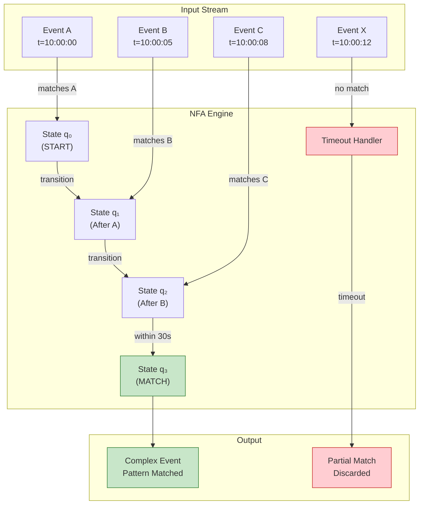
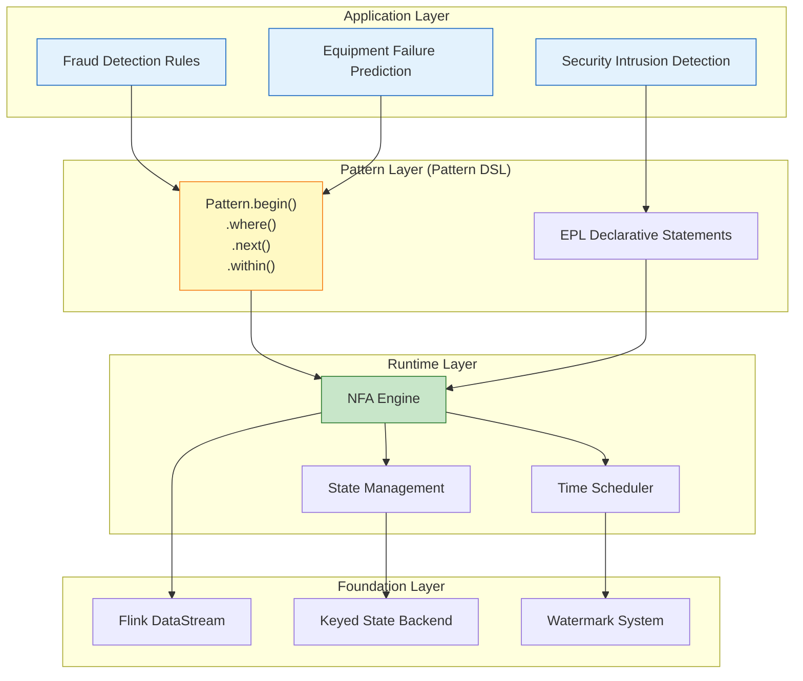
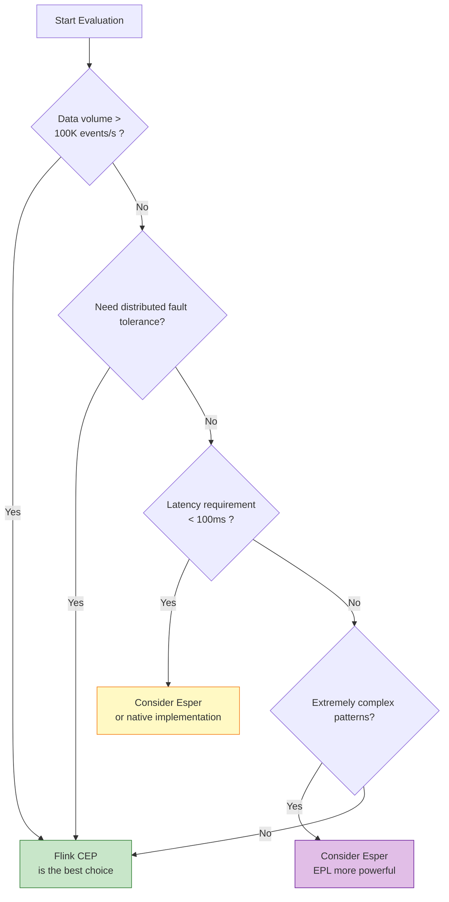

# Pattern: Complex Event Processing (CEP)

> **Pattern ID**: 03/7 | **Series**: Knowledge/02-design-patterns | **Formalization Level**: L4-L5
>
> This pattern addresses the real-time recognition and extraction of **high-order business semantic events** from **low-level raw event streams**, providing declarative event-correlation mechanisms based on pattern matching.

## 1. Definitions

### Def-K-02-09 (Complex Event)

A **Complex Event (CE)** is a high-order event extracted from raw event streams via pattern matching, defined as a quadruple [^3][^8]:

$$
\text{CE} = (E_{\text{constituents}}, \phi_{\text{pattern}}, \Delta_{\text{window}}, a_{\text{derived}})
$$

Where:

- $E_{\text{constituents}}$: set of atomic events constituting this complex event
- $\phi_{\text{pattern}}$: matching pattern predicate
- $\Delta_{\text{window}}$: time window constraint
- $a_{\text{derived}}$: derived attributes (e.g., risk score, confidence)

**Event Hierarchy** [^1][^2]:

| Level | Event Type | Example | Processing Complexity |
|-------|-----------|---------|----------------------|
| **L0** | Atomic | Sensor reading, single transaction, single click | Simple filter/map |
| **L1** | Derived | 5-min average temperature, user session aggregation | Window aggregation |
| **L2** | Complex | Sustained temp rise + vibration spike = equipment failure | Multi-event correlation |
| **L3** | Situational | Cross-device, cross-time, cross-domain business context | Complex reasoning |

---

### Def-K-02-10 (Pattern)

A **Pattern** is a constraint description over event sequences, defined as a quintuple [^3][^4]:

$$
\mathcal{P} = (N, E_{\text{NFA}}, \Sigma_{\text{predicates}}, \Delta_{\text{time}}, C_{\text{correlation}})
$$

Where:

- $N$: NFA (nondeterministic finite automaton) state set
- $E_{\text{NFA}}$: NFA state transition edges
- $\Sigma_{\text{predicates}}$: event predicate alphabet
- $\Delta_{\text{time}}$: time constraint function
- $C_{\text{correlation}}$: event correlation conditions

---

### Def-K-02-11 (Pattern Matching)

**Pattern Matching** is the function identifying all event subsequences satisfying pattern $\mathcal{P}$ from the input event stream [^3][^8]:

$$
\text{Match}: \text{Stream}(E) \times \mathcal{P} \to \mathcal{P}(\text{Seq}(E))
$$

Where $\mathcal{P}(\text{Seq}(E))$ is the powerset of event sequences. Matching results satisfy:

$$
\forall \sigma \in \text{Match}(S, \mathcal{P}): \mathcal{P}(\sigma) = \text{true}
$$

---

## 2. Properties

### Prop-K-02-06 (Pattern Matching Complexity Bound)

**Statement**: CEP pattern matching time and space complexity depend on pattern structure with explicit upper bounds [^3].

| Pattern Type | Time Complexity | Space Complexity | Note |
|-------------|----------------|-----------------|------|
| Simple sequence (A→B) | $O(n)$ | $O(1)$ | Single pass |
| Kleene star (A*) | $O(n^2)$ | $O(n)$ | Must maintain multiple active matches |
| Alternation (A\|B) | $O(n \cdot |\mathcal{P}|)$ | $O(|\mathcal{P}|)$ | NFA parallel states |
| With correlation (A→B, sameKey) | $O(n \cdot k)$ | $O(k)$ | $k$ = number of keys |

**Proof Sketch**:

1. Each input event triggers at most one transition evaluation per active NFA state
2. Active state count is bounded by both pattern complexity and time window constraints
3. Under Keyed partitioning, complexity is computed per-key independently
4. Production recommendation: pattern length ≤ 10-20 steps to avoid NFA state explosion

---

### Prop-K-02-07 (Time Window Boundedness)

**Statement**: Given pattern matching time window $\Delta$, for any event sequence $\sigma = \langle e_1, e_2, \ldots, e_n \rangle$, it can be accepted by the pattern only if the time span between first and last events does not exceed the window bound:

$$
\text{Within}(\sigma, \Delta) \iff t_{\text{last}}(\sigma) - t_{\text{first}}(\sigma) \leq \Delta
$$

**Engineering significance**:

- Window bound $\Delta$ ensures partial matches do not accumulate indefinitely
- After Watermark advances past $t_{\text{first}} + \Delta$, incomplete partial matches can be safely cleaned
- Combined with Watermark monotonicity theorem, guarantees deterministic timeout cleanup

---

## 3. Relations

### Relation with Event Time Processing

CEP pattern matching deeply depends on event-time semantics [^4][^11]:

- Pattern `.within(Time)` constraints use event time as the measurement baseline
- Watermark monotonicity guarantees deterministic pattern matching time boundaries
- Late events are isolated via side output without affecting completeness of already-matched results

### Relation with Stateful Computation

CEP's NFA state machine uses Keyed State implementation [^9][^12]:

- Each key maintains an independent set of active NFA states
- State updates are serialized within a single key, satisfying local determinism
- Checkpoint mechanism guarantees NFA state recovery consistency

### Relation with Async I/O Enrichment

Complex events may require asynchronous external context queries to complete attributes [^5][^6]:

- Example: After matching a transfer pattern in fraud detection, asynchronously query the user's historical risk score
- Async I/O out-of-order completion must coordinate with CEP's sequence-preserving patterns
- External query timeout results can be routed to CEP side output for degraded processing

### Relation with Checkpoint & Recovery

CEP state recovery depends on Checkpoint mechanism [^11][^13]:

- Checkpoint captures NFA active states and partial-match buffers
- After recovery, pattern matching continues from checkpointed state, ensuring already-processed events are not re-matched
- End-to-end Exactly-Once requires replayable Source and transactional Sink

---

## 4. Argumentation

### 4.1 The Gap Between Raw Events and Business Semantics

In stream processing systems, underlying data sources produce **raw events**, while business decisions require **complex events**. This semantic-level difference manifests as [^1][^2]:

$$
E_{\text{complex}} = \{ (e_{i_1}, e_{i_2}, \ldots, e_{i_k}) \mid \text{Pattern}(e_{i_1}, e_{i_2}, \ldots, e_{i_k}) = \text{true} \}
$$

**Typical business challenges**:

- **Financial fraud detection** [^5]: Fraudsters use multi-step attacks (login → password change → large transfer); single-event thresholds cannot identify dispersed small probing transactions
- **IoT equipment failure prediction** [^6]: Multi-sensor collaborative anomalies (sustained temperature rise + vibration spike) reduce false positives more than single-metric thresholds
- **Network security intrusion detection** [^7]: APT attacks permeate slowly across days or weeks, requiring cross-long-window event correlation

---

### 4.2 Temporal Correlation Complexity

CEP's core challenge lies in handling **temporal relationships** between events [^1][^4]:

| Dimension | Description | Formalization |
|-----------|-------------|---------------|
| **Sequence** | Event A must occur before B | $A \to B$ |
| **Time Window** | Pattern must complete within specified time | $\text{within}(T)$ |
| **Logic Composition** | AND / OR / NOT combinations | $A \land B$, $A \lor B$, $A \land \neg B$ |
| **Quantifiers** | Zero-or-more, one-or-more, optional, repeat | $A^*$, $A^+$, $A?$, $A\{n\}$ |
| **Attribute Correlation** | Same user, same device | $\text{userId}(A) = \text{userId}(B)$ |

**Temporal constraint formalization** [^3]:

For event sequence $\sigma = \langle e_1, \ldots, e_n \rangle$ with timestamps $\langle t_1, \ldots, t_n \rangle$, pattern $P$ is a conjunction of temporal constraints:

$$
P(\sigma) = \bigwedge_{i=1}^{n-1} \phi_i(e_i, e_{i+1}) \land \theta(t_n - t_1)
$$

Where $\phi_i$ are inter-event attribute constraints and $\theta$ is the total time window constraint.

---

### 4.3 Applicable Scenarios and Performance Boundaries

**Recommended scenarios** [^4][^8]:

| Scenario | Typical Pattern | CEP Advantage | Configuration |
|----------|----------------|---------------|---------------|
| Real-time fraud detection | Login → password change → transfer | Identify multi-step attack chains | 30min window, per-user partition |
| IoT failure prediction | Multi-sensor collaborative anomaly | Reduce single-metric false positives | 30s-5min window, per-device partition |
| Network intrusion detection | Scan → penetrate → exfiltrate | Cross-long-window correlation | 1-24h window, per-IP partition |
| Business process monitoring | Order → payment → shipment | SLA timeout alerts | Per-order partition, with timeout |
| Financial trading surveillance | Price anomaly sequence | Identify market manipulation | Second-level window, per-symbol partition |

**Not recommended** [^8]:

| Scenario | Reason | Alternative |
|----------|--------|-------------|
| Simple threshold alerts | CEP introduces unnecessary complexity | Direct Filter + window aggregation |
| Ultra-low latency (<50ms) | NFA matching has fixed overhead | Native state machine implementation |
| Unconstrained correlation | Infinite window causes state explosion | Session window + timeout cleanup |
| Pure statistical analysis | CEP not optimized for aggregation | SQL / Table API |
| Cross-long-period complex reasoning | State maintenance cost too high | Rule engine (Drools) |

**Performance boundaries** [^8][^9]:

```
┌─────────────────────────────────────────────────────────────┐
│                    Flink CEP Performance Bounds             │
├─────────────────────────────────────────────────────────────┤
│                                                             │
│  Single-parallelism throughput: 5,000 - 50,000 events/s    │
│  Typical latency: 100ms - 5s (including window wait)        │
│  Max pattern length: 10-20 steps (avoid NFA state explosion)│
│  Recommended window size: < 1 hour (state management cost)  │
│  Max key count: depends on state backend (RocksDB supports TB)│
│                                                             │
└─────────────────────────────────────────────────────────────┘
```

---

## 5. Proof / Engineering Argument

### 5.1 NFA Encoding Correctness

**Engineering argument**: CEP engines compile patterns into NFA while preserving semantic equivalence.

**Example pattern**: $A \to B \to C$ (A followed by B followed by C)

**NFA representation**:

```
                    ┌─────────────────────────────────────┐
                    │                                     │
    ┌──────┐   A    ┌──────┐   B    ┌──────┐   C    ┌──────┐
    │ q₀   │───────▶│ q₁   │───────▶│ q₂   │───────▶│ q₃   │
    │START │        │      │        │      │        │MATCH │
    └──────┘        └──────┘        └──────┘        └──────┘
       │                                              ▲
       │               ┌──────────────────────────────┘
       │               │  (if B unsatisfied, match fails)
       │               │
       └───────────────┘  new event arrives, restart from q₀
```

**Argument structure**:

1. **Pattern-to-NFA mapping is surjective**: For every pattern construct supported by CEP (sequence, choice, quantifiers, time windows), a corresponding NFA substructure exists
2. **NFA execution preserves pattern semantics**: NFA transition conditions correspond to pattern predicates $\Sigma_{\text{predicates}}$; state paths correspond to event sequences $\sigma$
3. **Acceptance condition equivalence**: NFA reaches accepting state iff the event sequence satisfies all constraints (including $\Delta_{\text{time}}$ and $C_{\text{correlation}}$)
4. **No false positives**: If $\sigma$ is accepted by NFA, then $\mathcal{P}(\sigma) = \text{true}$

---

### 5.2 CEP System Architecture

**Flink CEP Architecture** [^4][^8]:

```
┌─────────────────────────────────────────────────────────────────────────────┐
│                         Flink CEP Runtime Architecture                       │
├─────────────────────────────────────────────────────────────────────────────┤
│                                                                             │
│  ┌──────────────┐    ┌──────────────┐    ┌──────────────┐    ┌───────────┐ │
│  │  Input       │───▶│  KeyBy       │───▶│  CEP         │───▶│  Output   │ │
│  │  Stream      │    │  (Partition) │    │  Operator    │    │  Stream   │ │
│  └──────────────┘    └──────────────┘    └──────┬───────┘    └───────────┘ │
│                                                 │                          │
│                        ┌────────────────────────┘                          │
│                        ▼                                                   │
│  ┌─────────────────────────────────────────────────────────────────────┐   │
│  │                        CEP Operator Internals                        │   │
│  │  ┌────────────┐  ┌────────────┐  ┌────────────┐  ┌────────────┐     │   │
│  │  │  NFA       │  │  Event     │  │  State     │  │  Timeout   │     │   │
│  │  │  Compiler  │  │  Buffer    │  │  Manager   │  │  Handler   │     │   │
│  │  │            │  │            │  │            │  │            │     │   │
│  │  │  Pattern   │  │  Buffer    │  │  NFA       │  │  Expired   │     │   │
│  │  │  → State   │  │  for match │  │  state     │  │  match     │     │   │
│  │  │  machine   │  │  waiting   │  │  storage   │  │  cleanup   │     │   │
│  │  └────────────┘  └────────────┘  └────────────┘  └────────────┘     │   │
│  └─────────────────────────────────────────────────────────────────────┘   │
│                                                                             │
└─────────────────────────────────────────────────────────────────────────────┘
```

**Architecture design principles**:

1. **KeyBy first**: Ensures events of the same business entity (user/device/order) route to the same parallel instance, satisfying serialization of state updates
2. **Independent NFA Compiler**: Patterns are compiled to state machines at job submission time; runtime only executes state transitions, reducing matching overhead
3. **Separated Event Buffer and State Manager**: Buffer manages pending events; state manager persists NFA states; both coordinate via Checkpoint for consistency
4. **Timeout Handler coordinates with Watermark**: Timeout cleanup is driven by Watermark advancement, avoiding nondeterminism from system clock

---

### 5.3 Performance Boundaries and Optimization

**Optimization 1: Early filtering to reduce candidate events** [^4][^9]
Filtering before pattern matching via `filter()` significantly reduces active NFA state count.

**Optimization 2: Reasonable time window sizing** [^9]
Window too small may miss valid matches; too large causes state accumulation. Typical values: 30 seconds to 30 minutes.

**Optimization 3: Use RocksDB state backend** [^9]
Large-state CEP jobs must use RocksDB with state TTL automatic cleanup to prevent OOM.

**Optimization 4: Pattern deduplication to reduce NFA branches** [^8]
Precise filtering conditions reduce parallel active NFA state count, lowering time complexity from $O(n^2)$ to near $O(n)$.

---

## 6. Examples

### Flink CEP: Financial Fraud Detection

```java
// Fraud pattern: anomalous login → password change → large transfer (within 30 min)
Pattern<TransactionEvent, ?> fraudPattern = Pattern
    .<TransactionEvent>begin("login")
    .where(evt -> evt.getEventType().equals("LOGIN") && evt.getRiskLevel() > 0.5)
    .next("passwordChange")
    .where(evt -> evt.getEventType().equals("PASSWORD_CHANGE"))
    .next("largeTransfer")
    .where(evt -> evt.getEventType().equals("TRANSFER") && evt.getAmount() > 100000)
    .within(Time.minutes(30));

PatternStream<TransactionEvent> patternStream = CEP.pattern(
    transactionStream.keyBy(TransactionEvent::getUserId),
    fraudPattern
);

DataStream<AlertEvent> alerts = patternStream.process(
    new PatternProcessFunction<TransactionEvent, AlertEvent>() {
        @Override
        public void processMatch(Map<String, List<TransactionEvent>> match,
                                 Context ctx, Collector<AlertEvent> out) {
            double riskScore = calculateRiskScore(match);
            out.collect(new AlertEvent(
                match.get("largeTransfer").get(0).getUserId(),
                "FRAUD_SUSPECTED", riskScore, System.currentTimeMillis()
            ));
        }
    }
);
```

---

### Flink CEP: IoT Equipment Failure Detection

```java
// Failure pattern: high temperature → vibration spike (within 30 seconds)
Pattern<SensorEvent, ?> failurePattern = Pattern
    .<SensorEvent>begin("highTemp")
    .where(evt -> evt.getSensorType().equals("TEMPERATURE") && evt.getValue() > 80)
    .followedBy("vibrationSpike")
    .where(evt -> evt.getSensorType().equals("VIBRATION") && evt.getValue() > 10)
    .within(Time.seconds(30));

PatternStream<SensorEvent> patternStream = CEP.pattern(
    sensorStream.keyBy(SensorEvent::getDeviceId),
    failurePattern
);
```

---

### Flink CEP: Brute Force Detection with Quantifiers

```java
// Pattern: 3 consecutive failed logins followed by successful login
Pattern<LoginEvent, ?> bruteForcePattern = Pattern
    .<LoginEvent>begin("failedLogins")
    .where(evt -> !evt.isSuccess())
    .times(3)
    .consecutive()
    .next("successLogin")
    .where(LoginEvent::isSuccess)
    .within(Time.minutes(5));
```

---

### Flink CEP: Timeout Handling with Side Output

```java
OutputTag<String> timeoutTag = new OutputTag<String>("timeout"){};

DataStream<ComplexEvent> result = patternStream.process(
    new PatternProcessFunction<Event, ComplexEvent>() {
        @Override
        public void processMatch(Map<String, List<Event>> match,
                                 Context ctx, Collector<ComplexEvent> out) {
            out.collect(new ComplexEvent(match, "MATCHED"));
        }
        @Override
        public void processTimedOutMatch(Map<String, List<Event>> match, Context ctx) {
            ctx.output(timeoutTag, "Pattern timed out: " + match);
        }
    }
);

DataStream<String> timeouts = result.getSideOutput(timeoutTag);
```

---

## 7. Visualizations

### CEP Pattern Matching Flow



---

### CEP System Hierarchy



---

### Flink CEP Selection Decision Tree



---

## 8. References

[^1]: D. Luckham, *The Power of Events: An Introduction to Complex Event Processing in Distributed Enterprise Systems*, Addison-Wesley, 2002.
[^2]: A. Adi and O. Etzion, "Amit - The Situation Manager," *The VLDB Journal*, 13(2), 2004.
[^3]: Complex event processing formal semantics, see [Struct/03-relations/03.02-cep-formal-semantics.md](../../../../Struct/03-relationships/03.02-flink-to-process-calculus.md)
[^4]: Apache Flink Documentation, "FlinkCEP - Complex Event Processing for Flink," 2025. <https://nightlies.apache.org/flink/flink-docs-stable/docs/libs/cep/>
[^5]: Financial real-time risk control case, see [Knowledge/03-business-patterns/fintech-realtime-risk-control.md](../../../../Knowledge/03-business-patterns/fintech-realtime-risk-control.md)
[^6]: IoT stream processing case, see [Flink/09-practices/09.01-case-studies/case-iot-stream-processing.md](../../../../Flink/09-practices/09.01-case-studies/case-iot-stream-processing.md)
[^7]: G. Cugola and A. Margara, "Complex Event Processing: A Survey," *Technical Report*, Politecnico di Milano, 2010.
[^8]: Apache Flink CEP library design, see [Flink/03-api-patterns/flink-cep-deep-dive.md](../../../../Flink/09-practices/09.01-case-studies/case-financial-realtime-risk-control.md)
[^9]: Flink state backend and CEP optimization, see [Flink/09-practices/09.03-performance-tuning/state-backend-selection.md](../../../../Flink/09-practices/09.03-performance-tuning/state-backend-selection.md)

---

*Document Version: v1.0-en | Updated: 2026-04-20 | Status: Core Summary*
