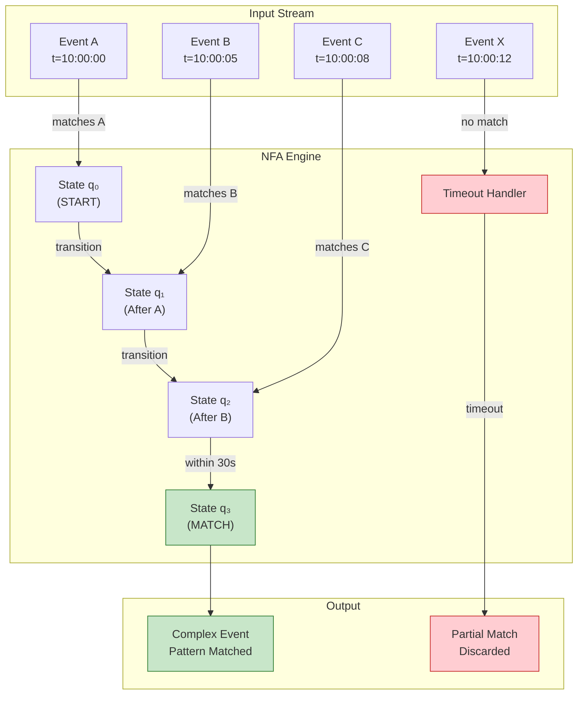
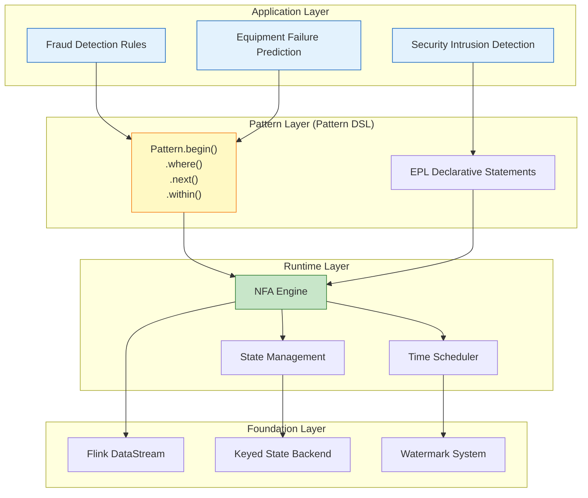
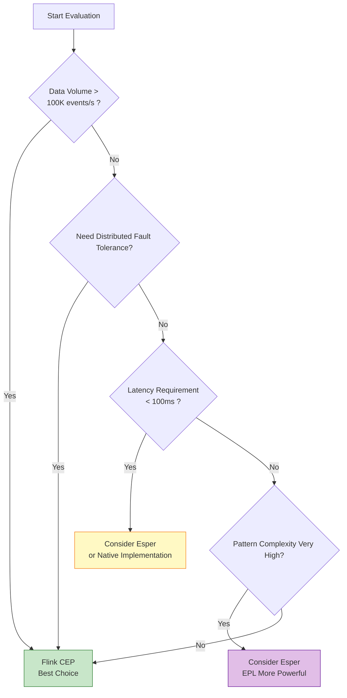

# Pattern: Complex Event Processing (CEP)

> **Stage**: Knowledge | **Prerequisites**: [Related Documents] | **Formalization Level**: L3

> **Pattern ID**: 03/7 | **Series**: Knowledge/02-design-patterns | **Formalization Level**: L4-L5
>
> This pattern addresses the real-time recognition and extraction from **low-level raw event streams** to **high-level business semantic events**, providing a declarative event correlation mechanism based on pattern matching.

---

## Table of Contents

- [Pattern: Complex Event Processing (CEP)](#pattern-complex-event-processing-cep)
  - [Table of Contents](#table-of-contents)
  - [1. Definitions](#1-definitions)
    - [Def-K-02-09 (Complex Event)](#def-k-02-09-complex-event)
    - [Def-K-02-10 (Pattern)](#def-k-02-10-pattern)
    - [Def-K-02-11 (Pattern Matching)](#def-k-02-11-pattern-matching)
  - [2. Properties](#2-properties)
    - [Prop-K-02-06 (Pattern Matching Complexity Bound)](#prop-k-02-06-pattern-matching-complexity-bound)
    - [Prop-K-02-07 (Time Window Boundedness)](#prop-k-02-07-time-window-boundedness)
  - [3. Relations](#3-relations)
    - [Relation with Event Time Processing](#relation-with-event-time-processing)
    - [Relation with Stateful Computation](#relation-with-stateful-computation)
    - [Relation with Async I/O Enrichment](#relation-with-async-io-enrichment)
    - [Relation with Checkpoint \& Recovery](#relation-with-checkpoint-recovery)
  - [4. Argumentation](#4-argumentation)
    - [4.1 The Gap Between Raw Events and Business Semantics](#41-the-gap-between-raw-events-and-business-semantics)
    - [4.2 Complexity of Temporal Correlation](#42-complexity-of-temporal-correlation)
    - [4.3 Applicable Scenarios and Performance Boundaries](#43-applicable-scenarios-and-performance-boundaries)
  - [5. Formal Guarantees](#5-formal-guarantees)
    - [5.1 Dependent Formal Definitions](#51-dependent-formal-definitions)
    - [5.2 Satisfied Formal Properties](#52-satisfied-formal-properties)
    - [5.3 Property Preservation Under Pattern Composition](#53-property-preservation-under-pattern-composition)
    - [5.4 Boundary Conditions and Constraints](#54-boundary-conditions-and-constraints)
    - [5.5 CEP Formal Semantics](#55-cep-formal-semantics)
  - [6. Proof / Engineering Argument](#6-proof-engineering-argument)
    - [6.1 NFA Encoding Correctness Argument](#61-nfa-encoding-correctness-argument)
    - [6.2 CEP System Architecture Engineering Argument](#62-cep-system-architecture-engineering-argument)
    - [6.3 Performance Boundaries and Optimization Argument](#63-performance-boundaries-and-optimization-argument)
  - [7. Examples](#7-examples)
    - [7.1 Flink CEP Basic Usage](#71-flink-cep-basic-usage)
    - [7.2 Temporal Constraints and Pattern Modifiers](#72-temporal-constraints-and-pattern-modifiers)
    - [7.3 Complex Pattern Composition](#73-complex-pattern-composition)
    - [7.4 Esper CEP Comparison](#74-esper-cep-comparison)
    - [7.5 Performance Optimization Strategies](#75-performance-optimization-strategies)
  - [8. Visualizations](#8-visualizations)
    - [8.1 CEP Pattern Matching Flowchart](#81-cep-pattern-matching-flowchart)
    - [8.2 CEP System Hierarchy Diagram](#82-cep-system-hierarchy-diagram)
    - [8.3 Flink CEP Selection Decision Tree](#83-flink-cep-selection-decision-tree)
  - [9. References](#9-references)

---

## 1. Definitions

### Def-K-02-09 (Complex Event)

**Definition**: A Complex Event (CE) is a high-order event extracted from raw event streams through pattern matching, defined as a quadruple [^3][^8]:

$$
\text{CE} = (E_{\text{constituents}}, \phi_{\text{pattern}}, \Delta_{\text{window}}, a_{\text{derived}})
$$

Where:

- $E_{\text{constituents}}$: The set of atomic events constituting this complex event
- $\phi_{\text{pattern}}$: Matching pattern predicate
- $\Delta_{\text{window}}$: Time window constraint
- $a_{\text{derived}}$: Derived attributes (e.g., risk score, confidence)

**Event Hierarchy** [^1][^2]:

| Level | Event Type | Example | Processing Complexity |
|-------|-----------|---------|---------------------|
| **L0** | Atomic Event | Sensor reading, single transaction, single click | Simple filter/map |
| **L1** | Derived Event | 5-minute average temperature, user session window aggregation | Window aggregation |
| **L2** | Complex Event | Temperature continuously rising + vibration anomaly = equipment failure | Multi-event correlation |
| **L3** | Situational Event | Cross-device, cross-time, cross-domain business situation | Complex reasoning |

---

### Def-K-02-10 (Pattern)

**Definition**: A Pattern is a constraint description of event sequences, defined as a quintuple [^3][^4]:

$$
\mathcal{P} = (N, E_{\text{NFA}}, \Sigma_{\text{predicates}}, \Delta_{\text{time}}, C_{\text{correlation}})
$$

Where:

- $N$: NFA (Nondeterministic Finite Automaton) state set
- $E_{\text{NFA}}$: NFA state transition edges
- $\Sigma_{\text{predicates}}$: Event predicate alphabet
- $\Delta_{\text{time}}$: Time constraint function
- $C_{\text{correlation}}$: Event correlation conditions

---

### Def-K-02-11 (Pattern Matching)

**Definition**: Pattern matching is the function that identifies all event subsequences satisfying pattern $\mathcal{P}$ from the input event stream [^3][^8]:

$$
\text{Match}: \text{Stream}(E) \times \mathcal{P} \to \mathcal{P}(\text{Seq}(E))
$$

Where $\mathcal{P}(\text{Seq}(E))$ denotes the power set of event sequences. Matching results satisfy:

$$
\forall \sigma \in \text{Match}(S, \mathcal{P}): \mathcal{P}(\sigma) = \text{true}
$$

---

## 2. Properties

### Prop-K-02-06 (Pattern Matching Complexity Bound)

**Proposition**: CEP pattern matching time complexity and space complexity depend on pattern structure, with explicit upper bounds [^3].

| Pattern Type | Time Complexity | Space Complexity | Note |
|-------------|-----------------|------------------|------|
| Simple Sequence (A→B) | $O(n)$ | $O(1)$ | Single pass |
| Kleene Star (A*) | $O(n^2)$ | $O(n)$ | Must maintain multiple active matches |
| Alternation (A\|B) | $O(n \cdot |\mathcal{P}|)$ | $O(|\mathcal{P}|)$ | NFA parallel states |
| With Correlation (A→B, sameKey) | $O(n \cdot k)$ | $O(k)$ | $k$ is key count |

**Derivation**:

1. Each input event triggers at most one transition evaluation for all active states in the NFA
2. The number of active states is doubly constrained by pattern complexity and time window bounds
3. Under Keyed partitioning, complexity is calculated independently per key, so total complexity is linear in key count
4. In production, recommended pattern length does not exceed 10-20 steps to avoid NFA state explosion

---

### Prop-K-02-07 (Time Window Boundedness)

**Proposition**: Let the pattern matching time window be $\Delta$. For any event sequence $\sigma = \langle e_1, e_2, \ldots, e_n \rangle$, it can be accepted by the pattern only if the time difference between first and last events does not exceed the window upper bound:

$$
\text{Within}(\sigma, \Delta) \iff t_{\text{last}}(\sigma) - t_{\text{first}}(\sigma) \leq \Delta
$$

**Engineering Significance**:

- Window upper bound $\Delta$ ensures partial matches do not accumulate indefinitely
- After Watermark advances beyond $t_{\text{first}} + \Delta$, incomplete partial matches can be safely cleaned up
- This property combined with **Thm-S-09-01** (Watermark Monotonicity Theorem) guarantees deterministic timeout cleanup

---

## 3. Relations

### Relation with Event Time Processing

CEP pattern matching deeply depends on event time semantics [^4][^11]:

- Pattern `.within(Time)` constraints use event time as the measurement baseline
- Watermark monotonicity (**Thm-S-09-01**) guarantees deterministic pattern matching time boundaries
- Late events are isolated through side outputs without affecting the completeness of already-matched results

### Relation with Stateful Computation

CEP's NFA state machine uses Keyed State implementation [^9][^12]:

- Each key maintains an independent set of NFA active states
- State updates are serialized within a single key, satisfying **Thm-S-03-01** local determinism
- Checkpoint mechanism guarantees NFA state recovery consistency (**Thm-S-17-01**)

### Relation with Async I/O Enrichment

Complex events may require asynchronous queries to external context to complete attributes [^5][^6]:

- Example: In fraud detection, after matching a transfer pattern, asynchronously query the user's historical risk control score
- Async I/O out-of-order completion must be coordinated with CEP's order-preserving patterns
- External query timeout results can be routed to CEP's side output for degraded processing

### Relation with Checkpoint & Recovery

CEP state recovery depends on Checkpoint mechanism [^11][^13]:

- Checkpoint captures NFA active states and partial match buffers
- After recovery, pattern matching continues from checkpointed state, guaranteeing already-processed events are not re-matched
- End-to-end Exactly-Once requires replayable Source and transactional Sink (**Thm-S-18-01**)

---

## 4. Argumentation

### 4.1 The Gap Between Raw Events and Business Semantics

In stream processing systems, underlying data sources produce **raw events**, while business decisions need to be based on **complex events**. This semantic level difference manifests as [^1][^2]:

**Formal Description** [^3]:

Let raw event stream be $E_{\text{raw}} = \{e_1, e_2, \ldots, e_n\}$, where each event $e_i = (t_i, a_i, v_i)$ contains timestamp, attribute set, and value. Business-relevant complex events $E_{\text{complex}}$ are pattern matching results of raw events:

$$
E_{\text{complex}} = \{ (e_{i_1}, e_{i_2}, \ldots, e_{i_k}) \mid \text{Pattern}(e_{i_1}, e_{i_2}, \ldots, e_{i_k}) = \text{true} \}
$$

Where Pattern is the user-defined event sequence constraint condition.

**Typical Challenges in Business Scenarios**:

- **Financial Fraud Detection** [^5]: Fraudsters employ multi-step attacks (login from abnormal location → password change → large transfer), single-event thresholds cannot identify dispersed small exploratory transactions
- **IoT Equipment Failure Prediction** [^6]: Multi-sensor indicator collaborative anomalies (temperature continuously rising + vibration spike) reduce false positive rates more than single-indicator thresholds
- **Network Security Intrusion Detection** [^7]: APT attacks involve slow infiltration across days or even weeks, requiring identification of cross-long-window event correlations

---

### 4.2 Complexity of Temporal Correlation

The core challenge of CEP lies in handling **temporal relationships** between events [^1][^4]:

```
┌─────────────────────────────────────────────────────────────────────────┐
│                      CEP Temporal Correlation Dimensions                 │
├─────────────────────────────────────────────────────────────────────────┤
│                                                                         │
│  1. Sequence Relationship                                                │
│     └── Event A must occur before Event B:  A → B                       │
│     └── Strict sequence (next):  A.next(B) means B immediately follows A │
│                                                                         │
│  2. Time Window                                                          │
│     └── Pattern must complete within specified time:  within(T)         │
│     └── Relative time constraint:  B occurs within 5 minutes after A    │
│                                                                         │
│  3. Logic Composition                                                    │
│     └── AND:  Both A and B occur                                        │
│     └── OR:   A or B occurs                                             │
│     └── NOT:  After A, B does not occur                                 │
│                                                                         │
│  4. Quantifier Modifiers                                                 │
│     └── Zero or more:  A*                                               │
│     └── One or more:  A+                                                │
│     └── Optional:       A?                                              │
│     └── Repeat n times:  A{n}                                           │
│                                                                         │
│  5. Attribute Correlation                                                │
│     └── Same user:  userId(A) = userId(B)                               │
│     └── Same device:  deviceId(A) = deviceId(B)                         │
│                                                                         │
└─────────────────────────────────────────────────────────────────────────┘
```

**Temporal Constraints Formalization** [^3]:

Let event sequence $\sigma = \langle e_1, e_2, \ldots, e_n \rangle$ with timestamps $\langle t_1, t_2, \ldots, t_n \rangle$. Pattern $P$ is the conjunction of temporal constraints:

$$
P(\sigma) = \bigwedge_{i=1}^{n-1} \phi_i(e_i, e_{i+1}) \land \theta(t_n - t_1)
$$

Where $\phi_i$ are attribute constraints between events, and $\theta$ is the total time window constraint.

---

### 4.3 Applicable Scenarios and Performance Boundaries

**Recommended Usage Scenarios** [^4][^8]:

| Scenario | Typical Pattern | CEP Advantage | Configuration Recommendation |
|----------|----------------|---------------|------------------------------|
| **Real-time Fraud Detection** | Login → Password Change → Transfer | Identify multi-step attack chains | 30min window, partition by user |
| **IoT Equipment Failure Prediction** | Multi-sensor collaborative anomaly | Reduce single-indicator false positives | 30s-5min window, partition by device |
| **Network Security Intrusion Detection** | Scan → Penetrate → Exfiltrate | Cross-long-window correlation | 1-24h window, partition by IP |
| **Business Process Monitoring** | Order → Payment → Shipment | SLA timeout alerts | Partition by order, with timeout handling |
| **Financial Trading Monitoring** | Price anomaly sequence | Identify market manipulation | Second-level window, partition by instrument |

**Not Recommended Scenarios** [^8]:

| Scenario | Reason | Alternative |
|----------|--------|-------------|
| Simple threshold alerting | CEP introduces unnecessary complexity | Direct Filter + Window aggregation |
| Ultra-low latency (<50ms) | NFA matching has fixed overhead | Native state machine implementation |
| Uncorrelated association without time constraints | Infinite window causes state bloat | Session window + timeout cleanup |
| Pure statistical analysis | CEP is not good at aggregation | SQL/Table API |
| Cross-long-period complex reasoning | State maintenance cost too high | Rule engine (Drools) |

**Performance Boundaries** [^8][^9]:

```
┌─────────────────────────────────────────────────────────────────┐
│                    Flink CEP Performance Boundaries              │
├─────────────────────────────────────────────────────────────────┤
│                                                                 │
│  Single parallelism throughput: 5,000 - 50,000 events/s          │
│  Typical latency: 100ms - 5s (including window wait)             │
│  Maximum pattern length: 10-20 steps (avoid NFA state explosion) │
│  Recommended window size: < 1 hour (state management overhead)   │
│  Maximum key count: depends on state backend (RocksDB supports TB-level) │
│                                                                 │
└─────────────────────────────────────────────────────────────────┘
```

---

## 5. Formal Guarantees

This section establishes the formal connection between the CEP Complex Event Processing pattern and the Struct/ theoretical layer.

### 5.1 Dependent Formal Definitions

| Definition ID | Name | Source | Role in This Pattern |
|---------------|------|--------|---------------------|
| **Def-S-04-04** | Watermark Semantics | Struct/01.04 | Defines CEP time window progress boundaries |
| **Def-S-08-04** | Exactly-Once Semantics | Struct/02.02 | Complex event output causal impact count = 1 |
| **Def-S-10-01** | Safety | Struct/02.04 | Pattern matching produces no false positives (verifiable by finite execution) |
| **Def-S-10-02** | Liveness | Struct/02.04 | Valid patterns are eventually detected (under fairness assumption) |

### 5.2 Satisfied Formal Properties

| Theorem/Lemma ID | Name | Source | Guarantee Content |
|------------------|------|--------|-------------------|
| **Thm-S-09-01** | Watermark Monotonicity Theorem | Struct/02.03 | CEP time windows do not re-trigger |
| **Lemma-S-04-02** | Watermark Monotonicity Lemma | Struct/01.04 | NFA state machine event time progress remains monotonic |
| **Thm-S-03-01** | Actor Local Determinism Theorem | Struct/01.03 | Keyed CEP state updates are serialized, guaranteeing local determinism |
| **Thm-S-17-01** | Checkpoint Consistency Theorem | Struct/04.01 | CEP NFA state snapshot consistency guarantee |

### 5.3 Property Preservation Under Pattern Composition

**CEP + Event Time Composition**:

- Watermark monotonicity guarantees deterministic pattern matching time boundaries
- Late data is isolated through side outputs without affecting already-matched results

**CEP + Stateful Computation Composition**:

- NFA states use Keyed State implementation, satisfying **Thm-S-03-01** local determinism
- Checkpoint mechanism guarantees NFA state recovery consistency

**CEP + Windowed Aggregation Composition**:

- Window aggregation results can serve as atomic event inputs to CEP
- Window trigger event timestamps serve as CEP temporal baseline

### 5.4 Boundary Conditions and Constraints

| Constraint Condition | Formal Description | Violation Consequence |
|---------------------|-------------------|----------------------|
| Pattern window bounded | $\text{within}(\Delta), \Delta < \infty$ | Infinite window causes state bloat |
| NFA state finite | Active match count $\leq C_{\max}$ | State explosion, memory exhaustion |
| Event time ordered | $t_e(e_i) \leq t_e(e_{i+1}) + \delta$ | Severe disorder causes pattern misses |
| Key partitioning consistent | $\text{hash}(k) \mod \text{parallelism}$ fixed | Key drift causes state loss |

### 5.5 CEP Formal Semantics

CEP pattern matching can be formalized as the evaluation problem of **temporal regular expressions**:

$$
\mathcal{L}(\mathcal{P}) = \{ \sigma \in \text{Stream}(E) \mid \sigma \models \mathcal{P} \}
$$

Where $\mathcal{P}$ is the pattern, $\sigma$ is the event sequence, and $\models$ is the satisfaction relation.

**NFA Encoding Preservation**:

- Pattern $\mathcal{P}$ is compiled to NFA $N_{\mathcal{P}}$
- Language accepted by $N_{\mathcal{P}}$ equals $\mathcal{L}(\mathcal{P})$
- Checkpoint captures NFA state, guaranteeing language equivalence after recovery

This complements the Dataflow model defined in [Struct/01-foundation/01.04-dataflow-model-formalization-en.md](../../Struct/01-foundation/01.04-dataflow-model-formalization-en.md):

- Dataflow model focuses on **operator composition** and **time semantics**
- CEP model focuses on **event sequence recognition** and **pattern matching**

---

## 6. Proof / Engineering Argument

### 6.1 NFA Encoding Correctness Argument

**Engineering Argument**: The process of CEP engines compiling patterns into NFA preserves semantic equivalence.

NFA-based matching engine [^4][^8]:

```
Pattern: A → B → C (A followed by B followed by C)

NFA Representation:
                    ┌─────────────────────────────────────┐
                    │                                     │
    ┌──────┐   A    ┌──────┐   B    ┌──────┐   C    ┌──────┐
    │ q₀   │───────▶│ q₁   │───────▶│ q₂   │───────▶│ q₃   │
    │START │        │      │        │      │        │MATCH │
    └──────┘        └──────┘        └──────┘        └──────┘
       │                                              ▲
       │               ┌──────────────────────────────┘
       │               │  (if B not satisfied, match fails)
       │               │
       └───────────────┘  New event arrives, match starts from q₀
```

**Argument Structure**:

1. **Pattern to NFA mapping is surjective**: For each pattern construct supported by CEP (sequence, choice, quantifiers, time windows), there exists a corresponding NFA substructure
2. **NFA execution preserves pattern semantics**: NFA state transition conditions correspond to pattern predicates $\Sigma_{\text{predicates}}$; state paths correspond to event sequences $\sigma$
3. **Acceptance condition equivalence**: NFA reaches accept state if and only if the event sequence satisfies all pattern constraints (including time window $\Delta_{\text{time}}$ and attribute correlation $C_{\text{correlation}}$)
4. **No false positives**: If $\sigma$ is accepted by NFA, then necessarily $\mathcal{P}(\sigma) = \text{true}$ (safety, **Def-S-10-01**)

---

### 6.2 CEP System Architecture Engineering Argument

**Flink CEP Architecture** [^4][^8]:

```
┌─────────────────────────────────────────────────────────────────────────────┐
│                         Flink CEP Runtime Architecture                       │
├─────────────────────────────────────────────────────────────────────────────┤
│                                                                             │
│  ┌──────────────┐    ┌──────────────┐    ┌──────────────┐    ┌───────────┐ │
│  │  Input       │───▶│  KeyBy       │───▶│  CEP         │───▶│  Output   │ │
│  │  Stream      │    │  (Partition)  │    │  Operator    │    │  Stream   │ │
│  └──────────────┘    └──────────────┘    └──────┬───────┘    └───────────┘ │
│                                                 │                          │
│                        ┌────────────────────────┘                          │
│                        ▼                                                   │
│  ┌─────────────────────────────────────────────────────────────────────┐   │
│  │                        CEP Operator Internal                         │   │
│  │  ┌────────────┐  ┌────────────┐  ┌────────────┐  ┌────────────┐     │   │
│  │  │  NFA       │  │  Event     │  │  State     │  │  Timeout   │     │   │
│  │  │  Compiler  │  │  Buffer    │  │  Manager   │  │  Handler   │     │   │
│  │  │            │  │            │  │            │  │            │     │   │
│  │  │  Compile   │  │  Buffer    │  │  NFA State │  │  Expired   │     │   │
│  │  │  to FSM    │  │  for match │  │  Storage   │  │  match cleanup│  │   │
│  │  └────────────┘  └────────────┘  └────────────┘  └────────────┘     │   │
│  └─────────────────────────────────────────────────────────────────────┘   │
│                                                                             │
└─────────────────────────────────────────────────────────────────────────────┘
```

**Architecture Design Principles**:

1. **KeyBy Prepositioning**: Ensures events of the same business entity (user/device/order) are routed to the same parallel instance, satisfying serialization of state updates
2. **NFA Compiler Independence**: Patterns are compiled to state machines at job submission time; runtime only executes state transitions, reducing matching overhead
3. **Event Buffer and State Manager Separation**: Buffer manages pending events, state manager persists NFA state; both coordinate through Checkpoint to guarantee consistency
4. **Timeout Handler Coordinated with Watermark**: Timeout cleanup is driven by Watermark advancement, avoiding nondeterminism from using system clocks

---

### 6.3 Performance Boundaries and Optimization Argument

**Optimization 1: Early Filtering to Reduce Candidate Events** [^4][^9]

Filtering events before pattern matching through `filter()` significantly reduces the number of NFA active states.

**Optimization 2: Reasonable Time Window Setting** [^9]

Windows too small may miss valid matches; windows too large cause state accumulation. Recommendation: determine window size based on business analysis, typical values are 30 seconds to 30 minutes.

**Optimization 3: Use RocksDB State Backend** [^9]

Large-state CEP jobs must use RocksDB, with state TTL automatic cleanup of expired matches to prevent memory overflow.

**Optimization 4: Pattern Deduplication to Reduce NFA Branches** [^8]

Precise filter conditions reduce the number of parallel active states in NFA, reducing time complexity from $O(n^2)$ to near $O(n)$.

---

## 7. Examples

### 7.1 Flink CEP Basic Usage

**Example 1: Financial Fraud Detection** [^5][^8]

```java
// [Pseudocode snippet — not directly runnable] Core logic only
import org.apache.flink.cep.CEP;
import org.apache.flink.cep.PatternStream;
import org.apache.flink.cep.pattern.Pattern;
import org.apache.flink.cep.pattern.conditions.SimpleCondition;

import org.apache.flink.streaming.api.datastream.DataStream;
import org.apache.flink.streaming.api.windowing.time.Time;

// Define fraud detection pattern: abnormal login → password change → large transfer (within 30 minutes)
Pattern<TransactionEvent, ?> fraudPattern = Pattern
    .<TransactionEvent>begin("login")
    .where(new SimpleCondition<TransactionEvent>() {
        @Override
        public boolean filter(TransactionEvent event) {
            return event.getEventType().equals("LOGIN")
                && event.getRiskLevel() > 0.5;  // abnormal location login
        }
    })
    .next("passwordChange")
    .where(new SimpleCondition<TransactionEvent>() {
        @Override
        public boolean filter(TransactionEvent event) {
            return event.getEventType().equals("PASSWORD_CHANGE");
        }
    })
    .next("largeTransfer")
    .where(new SimpleCondition<TransactionEvent>() {
        @Override
        public boolean filter(TransactionEvent event) {
            return event.getEventType().equals("TRANSFER")
                && event.getAmount() > 100000;  // over 100K
        }
    })
    .within(Time.minutes(30));  // 30-minute time window

// Apply pattern to stream
PatternStream<TransactionEvent> patternStream = CEP.pattern(
    transactionStream.keyBy(TransactionEvent::getUserId),  // partition by user
    fraudPattern
);

// Process matching results
DataStream<AlertEvent> alerts = patternStream
    .process(new PatternProcessFunction<TransactionEvent, AlertEvent>() {
        @Override
        public void processMatch(
            Map<String, List<TransactionEvent>> match,
            Context ctx,
            Collector<AlertEvent> out) {

            TransactionEvent login = match.get("login").get(0);
            TransactionEvent passwordChange = match.get("passwordChange").get(0);
            TransactionEvent transfer = match.get("largeTransfer").get(0);

            double riskScore = calculateRiskScore(login, passwordChange, transfer);

            out.collect(new AlertEvent(
                transfer.getUserId(),
                "FRAUD_SUSPECTED",
                riskScore,
                System.currentTimeMillis()
            ));
        }
    });
```

**Example 2: IoT Equipment Failure Detection** [^6][^9]

```java
// [Pseudocode snippet — not directly runnable] Core logic only
import org.apache.flink.streaming.api.datastream.DataStream;
import org.apache.flink.streaming.api.windowing.time.Time;

// Define equipment failure pattern: high temperature → vibration spike (within 30 seconds)
Pattern<SensorEvent, ?> failurePattern = Pattern
    .<SensorEvent>begin("highTemp")
    .where(new SimpleCondition<SensorEvent>() {
        @Override
        public boolean filter(SensorEvent event) {
            return event.getSensorType().equals("TEMPERATURE")
                && event.getValue() > 80;  // temperature exceeds 80°C
        }
    })
    .followedBy("vibrationSpike")
    .where(new SimpleCondition<SensorEvent>() {
        @Override
        public boolean filter(SensorEvent event) {
            return event.getSensorType().equals("VIBRATION")
                && event.getValue() > 10;  // vibration exceeds 10mm/s
        }
    })
    .within(Time.seconds(30));

// Apply pattern
PatternStream<SensorEvent> patternStream = CEP.pattern(
    sensorStream.keyBy(SensorEvent::getDeviceId),
    failurePattern
);

// Output failure alerts
DataStream<FailureAlert> failures = patternStream
    .process(new PatternProcessFunction<SensorEvent, FailureAlert>() {
        @Override
        public void processMatch(
            Map<String, List<SensorEvent>> match,
            Context ctx,
            Collector<FailureAlert> out) {

            SensorEvent tempEvent = match.get("highTemp").get(0);
            SensorEvent vibEvent = match.get("vibrationSpike").get(0);

            out.collect(new FailureAlert(
                tempEvent.getDeviceId(),
                "BEARING_WEAR",
                "High temperature followed by vibration spike",
                ctx.timestamp()
            ));
        }
    });
```

---

### 7.2 Temporal Constraints and Pattern Modifiers

**Example 3: Using Quantifier Modifiers** [^8]

```java
// [Pseudocode snippet — not directly runnable] Core logic only
import org.apache.flink.streaming.api.windowing.time.Time;

// Pattern: 3 consecutive failed logins, then successful login (possible brute force)
Pattern<LoginEvent, ?> bruteForcePattern = Pattern
    .<LoginEvent>begin("failedLogins")
    .where(new SimpleCondition<LoginEvent>() {
        @Override
        public boolean filter(LoginEvent event) {
            return !event.isSuccess();
        }
    })
    .times(3)  // exactly 3 times
    .consecutive()  // must be consecutive
    .next("successLogin")
    .where(new SimpleCondition<LoginEvent>() {
        @Override
        public boolean filter(LoginEvent event) {
            return event.isSuccess();
        }
    })
    .within(Time.minutes(5));

// Pattern: device goes offline then reconnects within 1 hour (network glitch vs real failure)
Pattern<DeviceEvent, ?> networkGlitchPattern = Pattern
    .<DeviceEvent>begin("offline")
    .where(evt -> evt.getStatus().equals("OFFLINE"))
    .followedBy("online")
    .where(evt -> evt.getStatus().equals("ONLINE"))
    .within(Time.hours(1));
```

**Example 4: Using followedByAny to Handle Nondeterminism** [^8]

```java
// [Pseudocode snippet — not directly runnable] Core logic only
import org.apache.flink.streaming.api.windowing.time.Time;

// Pattern: A followed by B, but A may have multiple subsequent B candidates (greedy matching)
Pattern<Event, ?> greedyPattern = Pattern
    .<Event>begin("start")
    .where(evt -> evt.getType().equals("START"))
    .followedByAny("middle")  // nondeterminism: select all possible matches
    .where(evt -> evt.getType().equals("MIDDLE"))
    .followedBy("end")
    .where(evt -> evt.getType().equals("END"))
    .within(Time.minutes(10));
```

---

### 7.3 Complex Pattern Composition

**Example 5: Using AND / OR Composition** [^8]

```java
// [Pseudocode snippet — not directly runnable] Core logic only
import org.apache.flink.streaming.api.windowing.time.Time;

// Composite condition: on same device, high temperature OR high pressure, then shutdown
Pattern<AlarmEvent, ?> shutdownPattern = Pattern
    .<AlarmEvent>begin("alarm")
    .where(new SimpleCondition<AlarmEvent>() {
        @Override
        public boolean filter(AlarmEvent event) {
            return event.getSeverity().equals("HIGH");
        }
    })
    .or(new SimpleCondition<AlarmEvent>() {
        @Override
        public boolean filter(AlarmEvent event) {
            return event.getType().equals("TEMPERATURE_ALARM")
                && event.getValue() > 100;
        }
    })
    .next("shutdown")
    .where(evt -> evt.getType().equals("SHUTDOWN"))
    .within(Time.minutes(5));
```

**Example 6: Using Side Output for Timeouts** [^4][^9]

```java
// [Pseudocode snippet — not directly runnable] Core logic only
import org.apache.flink.streaming.api.datastream.DataStream;

// Define output tag for capturing timeout events
OutputTag<String> timeoutTag = new OutputTag<String>("timeout"){};

// Process pattern matches and timeouts
PatternStream<Event> patternStream = CEP.pattern(stream, pattern);

DataStream<ComplexEvent> result = patternStream
    .process(new PatternProcessFunction<Event, ComplexEvent>() {
        @Override
        public void processMatch(
            Map<String, List<Event>> match,
            Context ctx,
            Collector<ComplexEvent> out) {
            // Normal match processing
            out.collect(new ComplexEvent(match, "MATCHED"));
        }

        @Override
        public void processTimedOutMatch(
            Map<String, List<Event>> match,
            Context ctx) {
            // Timeout match processing
            ctx.output(timeoutTag, "Pattern timed out: " + match);
        }
    });

// Get timeout event stream
DataStream<String> timeouts = result.getSideOutput(timeoutTag);
```

---

### 7.4 Esper CEP Comparison

**Esper Declarative EPL (Event Processing Language)** [^10]:

Esper uses SQL-like declarative language to define patterns:

```sql
-- Example 1: Financial fraud detection (corresponding to Flink Example 1)
SELECT *
FROM pattern [
    every a=LoginEvent(riskLevel > 0.5)
    -> b=PasswordChangeEvent(userId = a.userId)
    -> c=TransferEvent(userId = a.userId, amount > 100000)
    WHERE timer:within(30 minutes)
];

-- Example 2: IoT failure detection (corresponding to Flink Example 2)
SELECT *
FROM pattern [
    every a=SensorEvent(sensorType='TEMPERATURE', value > 80)
    -> b=SensorEvent(sensorType='VIBRATION', value > 10, deviceId = a.deviceId)
    WHERE timer:within(30 seconds)
];

-- Example 3: Complex statistical pattern (Esper unique advantage)
SELECT userId, count(*), avg(amount)
FROM TransactionEvent.win:time(5 minutes)
GROUP BY userId
HAVING count(*) > 10 AND avg(amount) > 5000;
```

**Flink CEP vs Esper Comparison** [^8][^10]:

| Feature | Flink CEP | Esper |
|---------|-----------|-------|
| **Deployment Mode** | Distributed stream processing | Embedded / Standalone service |
| **Data Scale** | Large scale (TB/hour) | Medium-small scale (GB/hour) |
| **Latency** | Second-level | Millisecond-level |
| **State Management** | Distributed state backend | Local memory / database |
| **Fault Tolerance** | Exactly-Once Checkpoint | Depends on external storage |
| **Expressiveness** | Medium (NFA-based) | Strong (full EPL) |
| **Learning Curve** | Steep (requires Flink knowledge) | Gentle (SQL-like) |
| **Ecosystem Integration** | Deep Flink ecosystem integration | Standalone system |

---

### 7.5 Performance Optimization Strategies

**Optimization 1: Early Filtering to Reduce Candidate Events** [^4][^9]

```java
// [Pseudocode snippet — not directly runnable] Core logic only
import org.apache.flink.streaming.api.datastream.DataStream;

// Before optimization: all events enter CEP engine
Pattern<Event, ?> unoptimized = Pattern
    .<Event>begin("start")
    .where(evt -> true)  // accept all events
    .next("middle")
    .where(evt -> evt.getType().equals("IMPORTANT"));

// After optimization: filter before entering CEP
DataStream<Event> filtered = eventStream
    .filter(evt -> evt.getType().equals("IMPORTANT")
        || evt.getType().equals("START"));

Pattern<Event, ?> optimized = Pattern
    .<Event>begin("start")
    .where(evt -> evt.getType().equals("START"))
    .next("middle")
    .where(evt -> evt.getType().equals("IMPORTANT"));
```

**Optimization 2: Reasonable Time Window Setting** [^9]

```java
// [Pseudocode snippet — not directly runnable] Core logic only
import org.apache.flink.streaming.api.windowing.time.Time;

// Window too small: may miss valid matches
.within(Time.seconds(5))   // too tight

// Window too large: state accumulation, memory pressure
.within(Time.hours(24))    // too loose

// Recommendation: determine based on business analysis
.within(Time.minutes(30));  // balance latency and memory
```

**Optimization 3: Use RocksDB State Backend** [^9]

```java
// [Pseudocode snippet — not directly runnable] Core logic only
import org.apache.flink.streaming.api.windowing.time.Time;

// Large-state CEP jobs must use RocksDB
env.setStateBackend(new EmbeddedRocksDBStateBackend(true));

// Configure state TTL for automatic cleanup
StateTtlConfig ttlConfig = StateTtlConfig
    .newBuilder(Time.hours(1))
    .setUpdateType(StateTtlConfig.UpdateType.OnCreateAndWrite)
    .setStateVisibility(StateTtlConfig.StateVisibility.NeverReturnExpired)
    .cleanupIncrementally(10, true)
    .build();
```

**Optimization 4: Pattern Deduplication to Reduce NFA Branches** [^8]

```java
// [Pseudocode snippet — not directly runnable] Core logic only
// Inefficient: vague subsequent conditions cause NFA explosion
Pattern<Event, ?> inefficient = Pattern
    .<Event>begin("a")
    .where(evt -> evt.getType().equals("A"))
    .followedBy("b")
    .where(evt -> evt.getValue() > 0)  // too broad
    .followedBy("c")
    .where(evt -> evt.getValue() > 0);

// Efficient: precise filter conditions
Pattern<Event, ?> efficient = Pattern
    .<Event>begin("a")
    .where(evt -> evt.getType().equals("A"))
    .followedBy("b")
    .where(evt -> evt.getType().equals("B") && evt.getValue() > 100)
    .followedBy("c")
    .where(evt -> evt.getType().equals("C"));
```

---

## 8. Visualizations

### 8.1 CEP Pattern Matching Flowchart

The following Mermaid diagram shows the complete flow of the NFA engine processing event sequences:



---

### 8.2 CEP System Hierarchy Diagram

The following Mermaid diagram shows the hierarchical structure of CEP in stream processing systems:



---

### 8.3 Flink CEP Selection Decision Tree

The following decision tree helps evaluate whether to use Flink CEP in different scenarios:



---

## 9. References

[^1]: D. Luckham, *The Power of Events: An Introduction to Complex Event Processing in Distributed Enterprise Systems*, Addison-Wesley, 2002.

[^2]: A. Adi and O. Etzion, "Amit - The Situation Manager," *The VLDB Journal*, 13(2), 2004. <https://doi.org/10.1007/s00778-004-0128-y>

[^3]: Complex Event Processing formal semantics, see [Struct/03-relations/03.02-cep-formal-semantics.md](../../Struct/03-relationships/03.02-flink-to-process-calculus.md)

[^4]: Apache Flink Documentation, "FlinkCEP - Complex Event Processing for Flink," 2025. <https://nightlies.apache.org/flink/flink-docs-stable/docs/libs/cep/>

[^5]: Financial risk control real-time fraud detection case, see [Knowledge/03-business-patterns/fintech-realtime-risk-control.md](../../Knowledge/03-business-patterns/fintech-realtime-risk-control.md)

[^6]: IoT stream processing industrial case, see [Flink/09-practices/09.01-case-studies/case-iot-stream-processing.md](../../Flink/09-practices/09.01-case-studies/case-iot-stream-processing.md)

[^7]: G. Cugola and A. Margara, "Complex Event Processing: A Survey," *Technical Report*, Politecnico di Milano, 2010.

[^8]: Apache Flink CEP library design and implementation, see [Flink/03-api-patterns/flink-cep-deep-dive.md](../../Flink/09-practices/09.01-case-studies/case-financial-realtime-risk-control.md)

[^9]: Flink state backend and CEP optimization, see [Flink/09-practices/09.03-performance-tuning/state-backend-selection.md](../../Flink/09-practices/09.03-performance-tuning/state-backend-selection.md)

[^10]: Esper Documentation, "Event Processing Language," 2024. <https://www.espertech.com/esper/>

[^11]: T. Akidau et al., "The Dataflow Model," *PVLDB*, 8(12), 2015.

[^12]: Apache Flink Documentation, "Stateful Stream Processing," 2025. <https://nightlies.apache.org/flink/flink-docs-stable/docs/concepts/stateful-stream-processing/>

[^13]: Apache Flink Documentation, "Checkpointing," 2025. <https://nightlies.apache.org/flink/flink-docs-stable/docs/dev/datastream/fault-tolerance/checkpointing/>
