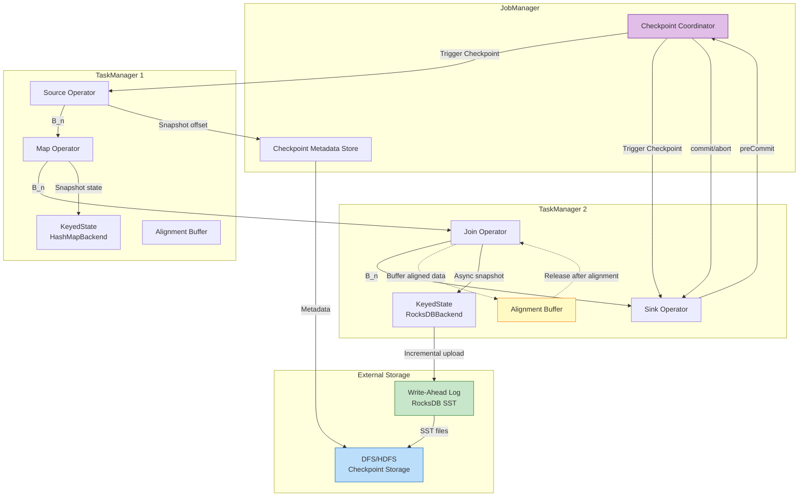
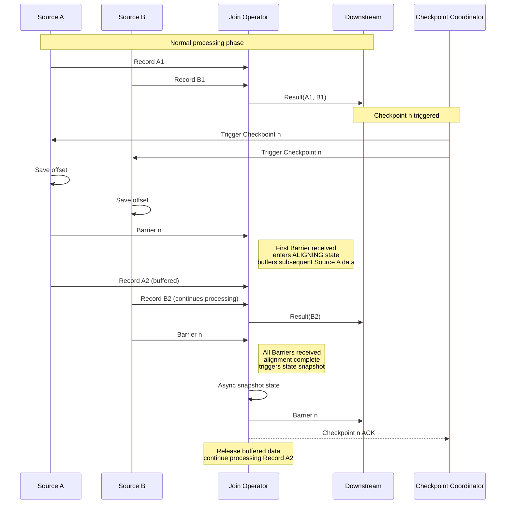
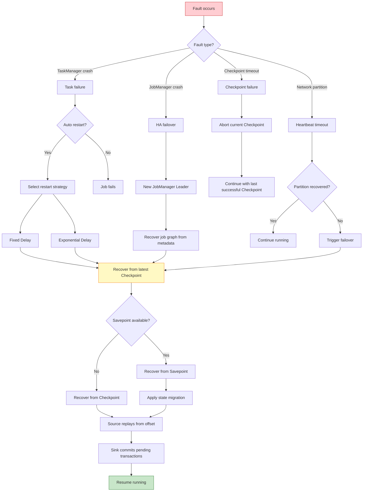

# Pattern: Checkpoint & Recovery

> **Pattern ID**: 07/7 | **Series**: Knowledge/02-design-patterns | **Formalization Level**: L5 | **Complexity**: ★★★★★
>
> This pattern addresses **fault recovery** and **consistency guarantees** in distributed stream processing, implementing Exactly-Once semantics via Checkpoint mechanisms with complete recovery strategies.

## 1. Definitions

### Def-K-02-07-01 (Checkpoint Mechanism)

**Definition**: Checkpoint is Flink's **distributed snapshot mechanism**, periodically capturing globally consistent state during stream processing execution to support fault recovery.

Formally, Checkpoint $C_n$ is defined as:

$$
C_n = \langle S_n^{(src)}, S_n^{(ops)}, S_n^{(sink)}, M_n \rangle
$$

Where:

- $S_n^{(src)}$: Source operator offset state
- $S_n^{(ops)}$: intermediate operator Keyed/Operator state
- $S_n^{(sink)}$: Sink operator transaction state
- $M_n$: in-flight message sets on each channel

**Checkpoint Lifecycle**:

```
Trigger → Inject → Align → Snapshot → Ack → Complete
```

**Engineering Essentials**:

- Asynchronous execution: snapshot persistence runs in parallel with data processing
- Incremental storage: saves only state changes
- Consistency guarantee: achieves Consistent Cut via Barrier alignment

---

### Def-K-02-07-02 (Checkpoint Barrier)

**Definition**: Checkpoint Barrier is a special control event injected into the data stream, carrying Checkpoint ID and defining a logical time boundary.

$$
B_n = \langle \text{type} = \text{BARRIER}, \; \text{cid} = n, \; \text{timestamp} = ts \rangle
$$

**Barrier Semantics**:

- All data before Barrier $B_n$ has been processed
- All data after Barrier $B_n$ has not yet been processed
- Barrier divides the infinite stream into finite segments, each independently recoverable

**Propagation Rules**:

| Scenario | Behavior | Consistency Impact |
|----------|----------|-------------------|
| Source | Injects Barrier into data stream | Marks replay point |
| Single-input operator | Snapshots and forwards Barrier upon receipt | No delay |
| Multi-input operator | Waits for Barriers from all input channels (alignment) | Guarantees consistency |

---

### Def-K-02-07-03 (Barrier Alignment)

**Definition**: Barrier Alignment is the core mechanism by which multi-input operators ensure Checkpoint consistency, requiring the operator to receive Barriers with the same Checkpoint ID from all input channels before triggering state snapshot.

$$
\text{Aligned}(v, n) \iff \forall ch_i \in In(v): B_n \in \text{Received}(v, ch_i)
$$

**Alignment Mode Comparison**:

| Feature | EXACTLY_ONCE | AT_LEAST_ONCE |
|---------|-------------|---------------|
| Alignment requirement | Must wait for all Barriers | Snapshots upon any Barrier receipt |
| Buffering behavior | Buffers data from aligned channels | No buffering, continues processing |
| Consistency guarantee | Strong consistency | Eventual consistency (may duplicate) |
| Latency impact | Alignment delay exists | No alignment delay |
| Applicable scenarios | Finance, trading, billing | Logs, monitoring, approximate statistics |
| Throughput impact | May decrease | No impact |

---

### Def-K-02-07-04 (State Backend)

**Definition**: State Backend is Flink's pluggable component responsible for state storage, access, and Checkpoint persistence.

**Two Primary Implementations**:

| Feature | HashMapStateBackend | RocksDBStateBackend |
|---------|---------------------|---------------------|
| **Storage location** | JVM Heap memory | Local disk (RocksDB) |
| **State size limit** | TaskManager memory bound | Local disk capacity bound |
| **Access latency** | Extremely low (direct memory) | Low (memory + disk cache) |
| **Incremental Checkpoint** | Supported (configurable) | Native support (SST-based) |
| **Incremental granularity** | State object level | SST file level |
| **Large state support** | Unsuitable (> 100MB) | Suitable (TB-level) |
| **Incremental efficiency** | Moderate (requires serialization compare) | High (leverages SST immutability) |

---

### Def-K-02-07-05 (Fault Recovery Strategy)

**Definition**: Fault recovery strategy defines the rule set for how Flink jobs recover from Checkpoints or Savepoints after failure.

**Recovery Strategy Hierarchy**:

```
Recovery Strategy
├── Automatic Recovery (Restart Strategies)
│   ├── Fixed Delay Restart
│   ├── Exponential Delay Restart
│   └── No Restart
├── Failover Strategies
│   ├── Region Failover (fine-grained)
│   └── Full Failover (default)
└── State Recovery
    ├── Latest Checkpoint
    ├── Specific Checkpoint
    └── Savepoint (cross-version supported)
```

**Savepoint Features**:

- User-triggered, lifecycle independent of job
- Supports state format upgrade and operator migration
- Enables job version rollback and A/B testing

---

## 2. Properties

### Lemma-K-02-07-01 (Barrier Propagation Monotonicity)

**Statement**: Checkpoint Barriers propagate monotonically along directed edges in the dataflow graph, never crossing or reversing.

$$
\forall t_1 < t_2: \; B_n \in \text{Sent}(u, e, t_1) \implies B_n \in \text{Received}(v, e, t_2) \land \nexists m: B_n \prec m \prec B_n'
$$

**Engineering significance**:

- Guarantees causal relationship of Checkpoint boundaries
- Prevents out-of-order Barriers from causing state inconsistency
- Provides temporal foundation for Exactly-Once

---

### Lemma-K-02-07-02 (Alignment Window Boundedness)

**Statement**: In EXACTLY_ONCE mode, alignment window duration is constrained by Checkpoint timeout.

$$
\text{AW}(v, n) = t_{\text{last}}(B_n) - t_{\text{first}}(B_n) \leq T_{timeout}
$$

If exceeded, Checkpoint is marked FAILED.

**Engineering practice**:

- Cross-datacenter deployments require increased timeout
- Network jitter scenarios recommend enabling Unaligned Checkpoint
- During alignment window, data from aligned channels is buffered

---

### Prop-K-02-07-01 (Asynchronous Snapshot Performance Advantage)

**Statement**: Asynchronous snapshot mechanisms significantly reduce Checkpoint impact on processing latency while maintaining semantic equivalence with synchronous snapshots.

| Metric | Synchronous Snapshot | Asynchronous Snapshot |
|--------|---------------------|----------------------|
| Blocking time | $O(|State|)$ | $O(1)$ (state reference copy) |
| Tail latency | Linear with state size | Independent of state size |
| Throughput degradation | Significant | Minor |
| Memory overhead | Low | Medium (dual state references) |

**Conclusion**: Asynchronous snapshot achieves non-blocking stream processing continuity by offloading persistence to background threads—recommended for production.

---

## 3. Relations

### Relation 1: Checkpoint and Chandy-Lamport Snapshot Algorithm

**Relationship**: Flink Checkpoint is a structured implementation of the Chandy-Lamport distributed snapshot algorithm [^1] adapted for stream processing.

| Chandy-Lamport | Flink Checkpoint | Note |
|----------------|------------------|------|
| Marker message | Checkpoint Barrier | Semantically equivalent, both carry snapshot ID |
| Process state recording | Operator state snapshot | Instant capture of local state |
| Channel state recording | Data buffered during alignment | Explicitly records in-flight messages |
| Snapshot completion | Checkpoint ACK | JobManager explicitly collects acknowledgments |

**Key Enhancements**:

- **Asynchronous persistence**: separates serialization from upload to reduce latency
- **Incremental snapshot**: backs up only changed portions to optimize storage
- **Two-phase commit Sink**: aligns external system transactions with Checkpoints

---

### Relation 2: Checkpoint and Exactly-Once Semantics

**Relationship**: Checkpoint consistency is a **necessary but insufficient** condition for end-to-end Exactly-Once.

$$
\text{End-to-End-EO}(J) \implies \text{ConsistentCheckpoint}(Ops) \land \text{Replayable}(Src) \land \text{AtomicOutput}(Snk)
$$

**Proof Structure**:

```
┌─────────────────────────────────────────────────────────────┐
│                    Exactly-Once Proof Structure             │
├─────────────────────────────────────────────────────────────┤
│                                                             │
│  Lemma: Source Replayable                                   │
│  └── Guarantees no data loss after recovery (At-Least-Once) │
│                                                             │
│  Lemma: State Recovery Consistency                          │
│  └── Thm: Checkpoint Consistency Theorem                    │
│      └── Guarantees internal state recovery correctness     │
│                                                             │
│  Lemma: 2PC Atomicity                                       │
│  └── Guarantees no duplicate external output                │
│                                                             │
│  Thm: Exactly-Once Correctness                              │
│  └── Conjunction of all three yields end-to-end EO          │
│                                                             │
└─────────────────────────────────────────────────────────────┘
```

---

## 4. Argumentation

### 4.1 Alignment Mode Selection

**Scenario Analysis**:

| Scenario | Recommended Mode | Rationale |
|----------|-----------------|-----------|
| Financial transaction processing | EXACTLY_ONCE | Fund calculations must be precise; duplication/loss unacceptable |
| Log aggregation analysis | AT_LEAST_ONCE | Approximate statistics tolerate minor duplication; pursues high throughput |
| Cross-datacenter Join | AT_LEAST_ONCE | High network latency makes alignment windows prone to timeout |
| Real-time recommendation features | EXACTLY_ONCE | User behavior features must be accurate; affects recommendation quality |
| Monitoring alerts | AT_LEAST_ONCE | Alerts can duplicate; must not lose but can repeat |

**Decision Flow**:

```
Do you need precise counting or fund calculation?
├── Yes ──► EXACTLY_ONCE
│          - Configure sufficient alignment timeout
│          - Monitor alignment delay metrics
└── No ──► Is network latency > 100ms?
            ├── Yes ──► AT_LEAST_ONCE
            │          - Or enable Unaligned Checkpoint
            └── No ──► Throughput sensitive?
                        ├── Yes ──► AT_LEAST_ONCE
                        └── No ──► EXACTLY_ONCE
```

---

### 4.2 State Backend Selection

**HashMapStateBackend** applicable when:

- State size < 100MB
- Requires extremely low access latency (< 1ms)
- Short-window aggregation (minute-level)
- Configuration parameter states

**RocksDBStateBackend** applicable when:

- State size > 100MB or unknown
- Long-window aggregation (hour/day-level)
- Large Keyspace (millions of keys)
- Incremental Checkpoint to optimize storage cost

**Performance Benchmark** (typical scenarios):

| State Size | HashMap Latency | RocksDB Latency | Recommendation |
|-----------|----------------|----------------|----------------|
| 10 MB | 0.1 μs | 5 μs | HashMap |
| 100 MB | 0.5 μs | 5 μs | HashMap |
| 1 GB | OOM | 10 μs | RocksDB |
| 100 GB | N/A | 50 μs | RocksDB |

---

### 4.3 Incremental Checkpoint Effectiveness

**Assumptions**: State size 10 GB, 1% change per second (100 MB), Checkpoint interval 5 minutes.

| Metric | Full Checkpoint | Incremental Checkpoint |
|--------|----------------|----------------------|
| Per-upload volume | 10 GB | ~100 MB |
| Network bandwidth | High | Low (~1%) |
| Checkpoint duration | 100s | 5s |
| Storage cost (30 days) | 10 GB × 8640 = 86 TB | 10 GB + 100 MB × 8640 = 874 GB |
| Recovery time | 10 GB download | 10 GB download (needs merge) |

**Conclusion**: Incremental Checkpoint dramatically reduces network bandwidth and storage costs, suitable for large-state scenarios. Flink automatically merges incremental files during recovery, transparent to users.

---

## 5. Proof / Engineering Argument

### Checkpoint Consistency Theorem (Thm-S-17-01)

**Theorem Statement**: Flink's Checkpoint algorithm produces a consistent global state.

Formally, let $\mathcal{G}_n = \langle \mathcal{S}^{(n)}, \mathcal{C}^{(n)} \rangle$ be the global state captured by Checkpoint $n$:

$$
\text{Consistent}(\mathcal{G}_n) \land \text{NoOrphans}(\mathcal{G}_n) \land \text{Reachable}(\mathcal{G}_n)
$$

**Proof Sketch**:

1. **Barrier propagation invariant**: Upstream operators forward Barriers only after completing their own snapshots
2. **State consistency lemma**: Aligned snapshots form a consistent global state
3. **Alignment point uniqueness**: Each operator has a unique alignment moment
4. **No orphan messages**: Global state contains no orphan messages

**Engineering significance**: Checkpoint consistency guarantees that after fault recovery, system state corresponds to a real reachable execution moment before failure, avoiding causal paradox states.

---

### Exactly-Once Correctness Theorem (Thm-S-18-01)

**Theorem Statement**: Flink jobs configured with Checkpoint mechanism and two-phase commit (2PC) transactional Sink achieve end-to-end Exactly-Once semantics.

**Formal Expression**:

Let Flink job $J = (Src, Ops, Snk)$ satisfy:

1. $Src$ is replayable
2. $Ops$ uses Barrier-aligned Checkpoint mechanism
3. $Snk$ uses transactional 2PC protocol

Then $J$ guarantees end-to-end Exactly-Once:

$$
\forall r \in \text{Input}. \; |\{ e \in \text{Output} \mid \text{caused\_by}(e, r) \}| = 1
$$

**Proof Structure**:

```
At-Least-Once (no loss)
├── Source replayable lemma
│   └── Replays from Checkpoint offset after failure
│   └── All data processed at least once

At-Most-Once (no duplication)
├── 2PC atomicity lemma
│   └── preCommit data invisible externally before Checkpoint success
│   └── After failure recovery, preCommitted transactions safely commit (idempotent)
│   └── Or abort and re-process into new transaction

Exactly-Once = At-Least-Once ∧ At-Most-Once
```

---

## 6. Examples

### Flink Checkpoint Basic Configuration

```scala
import org.apache.flink.streaming.api.scala._
import org.apache.flink.streaming.api.CheckpointingMode
import java.util.concurrent.TimeUnit

val env = StreamExecutionEnvironment.getExecutionEnvironment

// Basic Checkpoint configuration
env.enableCheckpointing(60000)  // 60-second interval
env.getCheckpointConfig.setCheckpointingMode(CheckpointingMode.EXACTLY_ONCE)
env.getCheckpointConfig.setCheckpointTimeout(TimeUnit.MINUTES.toMillis(5))
env.getCheckpointConfig.setMaxConcurrentCheckpoints(1)
env.getCheckpointConfig.setMinPauseBetweenCheckpoints(30000)
env.getCheckpointConfig.enableExternalizedCheckpoints(
  ExternalizedCheckpointCleanup.RETAIN_ON_CANCELLATION
)
```

---

### Advanced Checkpoint Configuration

```scala
val config = new Configuration()

// 1. Unaligned Checkpoint (low-latency scenarios)
config.setBoolean(CheckpointingOptions.ENABLE_UNALIGNED, true)
config.setLong(CheckpointingOptions.ALIGNED_CHECKPOINT_TIMEOUT, TimeUnit.SECONDS.toMillis(30))

// 2. Incremental Checkpoint (RocksDB native support)
config.setBoolean(CheckpointingOptions.INCREMENTAL_CHECKPOINTS, true)

// 3. Local recovery (priority local disk restore)
config.setBoolean(CheckpointingOptions.LOCAL_RECOVERY, true)

val env = StreamExecutionEnvironment.getExecutionEnvironment(config)
env.enableCheckpointing(60000)
```

---

### State Backend Configuration

```scala
// HashMapStateBackend (small state, low latency)
val hashMapBackend = new HashMapStateBackend()
env.setStateBackend(hashMapBackend)
env.getCheckpointConfig.setCheckpointStorage("hdfs:///checkpoints")

// RocksDBStateBackend (large state, incremental Checkpoint)
val rocksDBBackend = new EmbeddedRocksDBStateBackend(true) // true = incremental
env.setStateBackend(rocksDBBackend)
env.getCheckpointConfig.setCheckpointStorage("hdfs:///checkpoints")
```

---

### Restart Strategy and Savepoint Management

```scala
// Fixed delay restart (recommended)
env.setRestartStrategy(RestartStrategies.fixedDelayRestart(
  3,                    // max restarts
  Time.of(10, TimeUnit.SECONDS)  // restart interval
))

// Exponential delay restart (for transient faults)
env.setRestartStrategy(RestartStrategies.exponentialDelayRestart(
  Time.of(100, TimeUnit.MILLISECONDS),
  Time.of(10, TimeUnit.MINUTES),
  1.5, Time.of(5, TimeUnit.MINUTES), 0.1
))

// Region-level failover (fine-grained)
// Config: pipeline.fail-over-strategy: region
```

---

## 7. Visualizations

### Checkpoint Mechanism Architecture



---

### Barrier Alignment Sequence



---

### Fault Recovery Decision Tree



---

## 8. References

[^1]: Chandy, K. M., & Lamport, L. "Distributed Snapshots: Determining Global States of Distributed Systems." *ACM Transactions on Computer Systems*, 3(1), 1985, pp. 63-75. <https://doi.org/10.1145/214451.214456>

---

*Document Version: v1.0-en | Updated: 2026-04-20 | Status: Core Summary*
