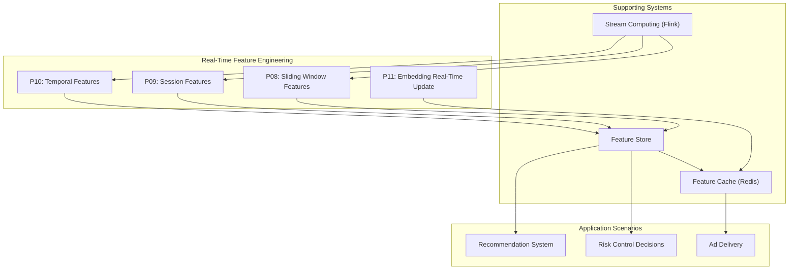
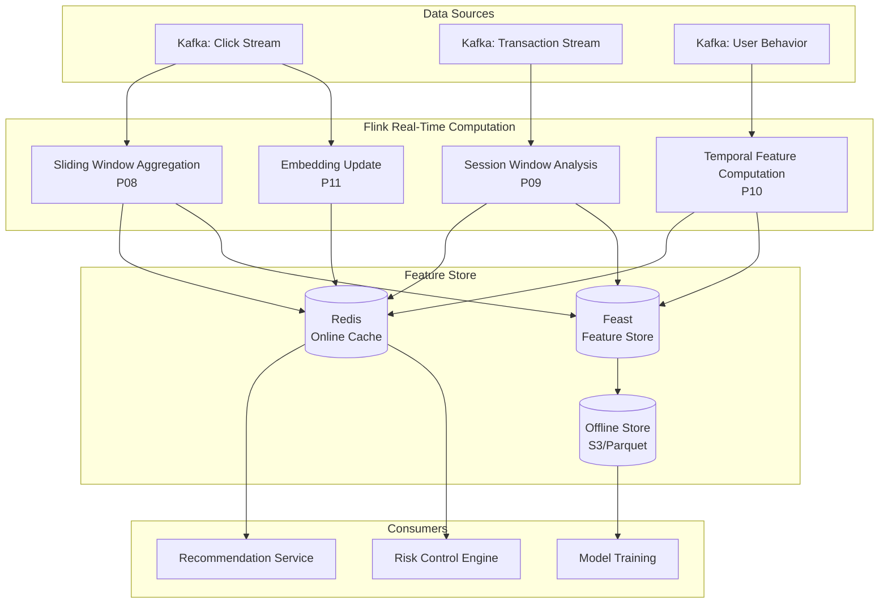
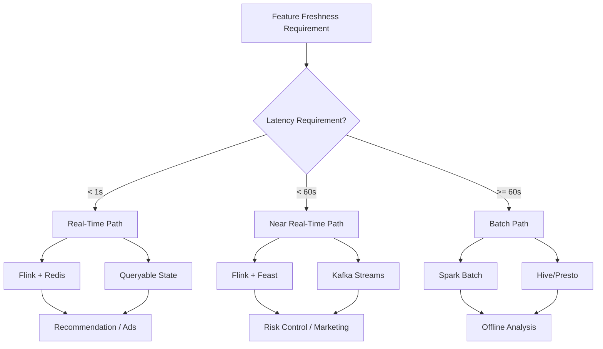
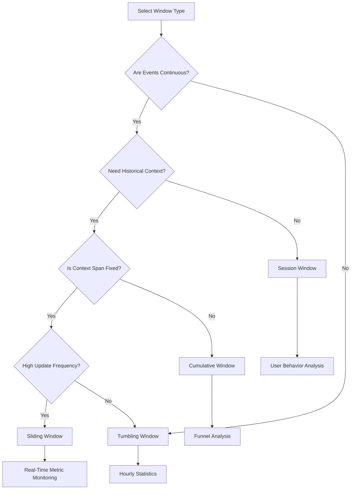

# Design Pattern: Real-Time Feature Engineering

> **Stage**: Knowledge/02-design-patterns | **Prerequisites**: [../01-concept-atlas/streaming-models-mindmap.md](../01-concept-atlas/streaming-models-mindmap.md) | **Formalization Level**: L4

---

## 1. Definitions

### Def-K-02-10: Feature Freshness

**Definition**: Feature freshness $\mathcal{F}$ is defined as the maximum allowed time deviation between the feature computation time and the current time:

$$\mathcal{F}(f, t) = t - \tau_{\text{computed}}(f)$$

Where $f$ is the feature value and $\tau_{\text{computed}}(f)$ is the last computation timestamp of that feature.

**Freshness Levels**:

| Level | Latency Requirement | Applicable Scenario |
|-------|---------------------|---------------------|
| Real-time | $\mathcal{F} < 1\text{s}$ | High-frequency trading, real-time recommendation |
| Near-real-time | $1\text{s} \leq \mathcal{F} < 60\text{s}$ | Content recommendation, ad delivery |
| Quasi-real-time | $60\text{s} \leq \mathcal{F} < 5\text{min}$ | Risk control decisions, user profiling |
| Batch | $\mathcal{F} \geq 5\text{min}$ | Offline analysis, report generation |

### Def-K-02-11: Windowed Feature Aggregation

**Definition**: Windowed feature aggregation is a transformation that applies an aggregate operation to an event stream $\mathcal{S}$ over a bounded time window $\mathcal{W}$:

$$\text{Agg}(\mathcal{S}, \mathcal{W}, \oplus) = \{ \oplus \{ e \mid e \in \mathcal{S} \land \tau(e) \in \mathcal{W}_i \} \}_{i \in \mathcal{I}}$$

Where:

- $\mathcal{W} = \{ \mathcal{W}_i \}_{i \in \mathcal{I}}$ is a sequence of windows
- $\oplus$ is the aggregation operator (sum, avg, count, max, min, etc.)
- $\tau(e)$ is the timestamp of event $e$

**Window Type Semantics**:

- **Tumbling Window**: $\mathcal{W}_i = [i \cdot L, (i+1) \cdot L)$, windows do not overlap
- **Sliding Window**: $\mathcal{W}_i = [i \cdot S, i \cdot S + L)$, overlap ratio $\rho = 1 - S/L$
- **Session Window**: $\mathcal{W}_i$ is dynamically split by inactivity gaps $g$

### Def-K-02-12: Feature Store

**Definition**: A feature store is a feature-management subsystem $\mathcal{FS}$ that supports dual-mode access:

$$\mathcal{FS} = \langle \mathcal{O}, \mathcal{R}, \mathcal{M}, \mathcal{G} \rangle$$

Where:

- $\mathcal{O}$: Offline store (columnar storage, e.g., HDFS/S3 + Parquet)
- $\mathcal{R}$: Online store (low-latency KV, e.g., Redis/Cassandra)
- $\mathcal{M}$: Metadata management (feature definitions, lineage, versioning)
- $\mathcal{G}$: Governance layer (access control, monitoring, SLA)

**Consistency Constraint**: The online feature $f_{\text{online}}$ and offline feature $f_{\text{offline}}$ must satisfy:

$$\mathbb{E}[f_{\text{online}}] = \mathbb{E}[f_{\text{offline}}] \quad \land \quad |f_{\text{online}} - f_{\text{offline}}| < \epsilon$$

---

## 2. Properties

### Lemma-K-02-04: Consistency of Window Boundary Event Handling

**Proposition**: For a stream processing system with watermark delay $\delta$, the eventual consistency condition for window aggregation results is:

$$\forall e: \tau(e) \in \mathcal{W}_i \implies e \text{ counted in } \mathcal{W}_i \lor \tau_{\text{proc}}(e) > T_{\text{watermark}}(\mathcal{W}_i) + \delta$$

**Engineering Meaning**: Late events are either correctly processed or explicitly dropped / sidelined, ensuring reproducible results.

### Lemma-K-02-05: Efficiency of Sliding-Window Feature Computation

**Proposition**: For a sliding window with length $L$ and step $S$, the feature reuse rate $\eta$ is:

$$\eta = 1 - \frac{S}{L} = \rho \quad (S \leq L)$$

**Corollary**: When $\rho \geq 0.5$, incremental computation can reduce computational cost by 50%+.

### Lemma-K-02-06: Online / Offline Feature Consistency Guarantee

**Proposition**: When using the same compute logic and unified time semantics (Processing Time vs Event Time), the feature deviation upper bound is:

$$\Delta = |\text{RT}(f) - \text{Batch}(f)| \leq \sum_{i} \omega_i \cdot \delta_i$$

Where $\omega_i$ is the delay weight of each data source and $\delta_i$ is the corresponding latency.

---

## 3. Relations

### 3.1 Mapping Between Feature Engineering and Stream Computing Models

| Feature Engineering Concept | Stream Computing Counterpart | Relationship Type |
|-----------------------------|------------------------------|-------------------|
| Feature Freshness | Watermark Delay | Equivalent Constraint |
| Window Aggregation | Window Operator | Direct Mapping |
| Feature Backfill | Backfill Job | Batch-Stream Unification |
| Feature Serving | Queryable State | Runtime Exposure |

### 3.2 Design Pattern Relationship Graph



---

## 4. Argumentation

### 4.1 P08: Sliding Window Features

**Problem**: How to compute features such as "number of clicks in the last 5 minutes" in a continuously changing stream?

**Solution**: Sliding window aggregation

**Computation Semantics**:

- Window length $L = 5\text{min}$
- Slide step $S = 10\text{s}$
- Feature value $f_i = \text{count}(\{ e \mid \tau(e) \in [t_i - L, t_i] \})$

**Incremental Optimization Strategy**:

1. Maintain a circular buffer storing event counts within the window
2. Output a result every $S$ seconds, reusing the overlapping $L-S$ region
3. Use Flink's `Evictor` to handle late data

**Counterexample Analysis**: If non-incremental computation is used (each window independently scans the full data), when $L=1\text{h}, S=1\text{s}$, the computational complexity is $O(3600 \times \text{throughput})$, which is not scalable.

### 4.2 P09: Session Features

**Problem**: How to capture behavioral patterns within a single user "visit"?

**Solution**: Dynamic session windows

**Session Definition**: A session $\mathcal{S}$ is an event sequence satisfying:

- $\forall i: \tau(e_{i+1}) - \tau(e_i) \leq g$ (gap threshold, e.g., 30 min)
- Same user / device event sequence

**Key Features**:

- Session duration: $|\mathcal{S}| = \max_i \tau(e_i) - \min_i \tau(e_i)$
- Session depth: Number of page views / events
- Conversion rate: Number of target events / total sessions

**Boundary Handling**:

- Session timeout extension: Allow brief waiting for late events; actual window close time = last event time + $g$
- Late events: Events arriving beyond the maximum delay threshold start a new session

### 4.3 P10: Temporal Features (Lagged Features)

**Problem**: How to capture temporal dependencies in time series?

**Solution**: Lagged features and difference features

**Feature Types**:

1. **Lagged**: $f_t^{(k)} = f_{t-k}$, e.g., "inventory level 1 hour ago"
2. **Diff**: $\Delta f_t^{(k)} = f_t - f_{t-k}$, e.g., "price change within 1 hour"
3. **Growth Rate**: $r_t^{(k)} = \frac{f_t - f_{t-k}}{f_{t-k}}$

**Implementation Challenge**: Requires maintaining historical state; in Flink this is achieved via `KeyedProcessFunction` or `ConnectedStreams` for self-join.

### 4.4 P11: Real-Time Embedding Update

**Problem**: How to incorporate real-time interaction feedback into pre-trained embedding vectors?

**Solution**: Online learning + Approximate Nearest Neighbor (ANN) update

**Architecture Essentials**:

1. **Incremental Training**: User real-time behavior triggers mini-batch gradient updates
2. **Hot Update**: New embedding vectors are written to Redis / Vector DB
3. **Consistency**: Version numbers are used to distinguish embeddings from different iteration cycles

**Trade-off Analysis**:

- Update frequency vs computational cost: Real-time updates (per event) are too expensive; micro-batching (e.g., 1-min window) is typically adopted
- Model stability vs response speed: Introduce moving-average smoothing: $\theta_{new} = \alpha \cdot \theta_{update} + (1-\alpha) \cdot \theta_{old}$

---

## 5. Engineering Argument

### 5.1 Flink + Redis Feature Cache Architecture

**Architecture Decision**: Why use Redis as the online feature cache?

| Dimension | Redis | Alternative (Cassandra) | Decision |
|-----------|-------|-------------------------|----------|
| Read Latency | < 1 ms (P99) | ~10 ms | Real-time inference requires low latency |
| Data Structures | Rich (Hash, ZSet) | Limited | Complex feature storage needs |
| Write Throughput | 100K+ ops/s | Higher | Sufficient for requirements |
| Operational Complexity | Medium | Higher | Team familiarity |

**Hot-Key Handling**:

- For ultra-high-frequency features (e.g., global statistics), adopt a local cache + Redis two-tier cache
- Use Redis Cluster sharding to avoid single-node hotspots

### 5.2 Flink + Feast Feature Store Integration

**Feast Architecture Role**:

```
┌─────────────────────────────────────────────────────────────┐
│                        Feast SDK                            │
├──────────────┬────────────────────┬─────────────────────────┤
│   Offline    │    Registry        │       Online            │
│   Store      │   (Feature Def.    │       Store             │
│ (BigQuery/   │    / Metadata)     │   (Redis/DynamoDB/      │
│  Snowflake)  ├────────────────────┤    Bigtable)            │
└──────────────┴────────────────────┴─────────────────────────┘
         ▲                   ▲                    ▲
         │                   │                    │
    Training Data Gen.   Feature Discovery      Online Serving
```

**Integration Modes**:

1. **Push Mode**: Flink jobs write real-time computed features to Feast Online Store
2. **Pull Mode**: Model services fetch online features via Feast SDK (point-in-time correct)
3. **Unified Definition**: Features are defined once in Feast, automatically generating Flink SQL and training datasets

### 5.3 Real-Time vs Offline Feature Consistency Guarantee

**Sources of Consistency Threats**:

1. **Compute Engine Differences**: Flink UDF vs Spark UDF implementations inconsistent
2. **Data Source Differences**: Kafka vs offline log delays / losses
3. **Time Semantic Differences**: Event Time vs Processing Time handled inconsistently

**Engineering Countermeasures**:

| Threat | Countermeasure |
|--------|----------------|
| UDF Inconsistency | Shared feature computation library (Python/Java bridge or unified DSL) |
| Data Differences | Unified log collection (Kafka as Single Source of Truth) |
| Time Handling | Unified use of Event Time with explicit Watermark strategy |
| Validation | Build feature monitoring dashboard, real-time comparison of online/offline feature distributions |

---

## 6. Examples

### 6.1 Case: Real-Time Features for Recommendation System

**Scenario**: E-commerce real-time personalized recommendation

**Feature Design**:

| Feature Name | Type | Computation Method | Freshness |
|--------------|------|--------------------|-----------|
| user_click_5m | Sliding Window | Number of clicked items in last 5 min | < 10 s |
| user_category_pref | Session Feature | Preferred category in current session | < 30 s |
| item_ctr_1h | Temporal Feature | Item CTR in last 1 hour | < 1 min |
| user_embedding | Embedding Feature | Real-time behavior updated vector | < 5 min |

**Flink Implementation Snippet**:

```sql
-- Sliding window feature: user click count in last 5 minutes
CREATE TABLE user_clicks (
    user_id STRING,
    item_id STRING,
    click_time TIMESTAMP(3),
    WATERMARK FOR click_time AS click_time - INTERVAL '5' SECOND
) WITH (
    'connector' = 'kafka',
    'topic' = 'click_events',
    ...
);

CREATE TABLE user_features (
    user_id STRING,
    click_count_5m BIGINT,
    window_start TIMESTAMP(3),
    PRIMARY KEY (user_id) NOT ENFORCED
) WITH (
    'connector' = 'redis',
    'command' = 'SET'
);

INSERT INTO user_features
SELECT
    user_id,
    COUNT(*) as click_count_5m,
    TUMBLE_START(click_time, INTERVAL '10' SECOND) as window_start
FROM user_clicks
GROUP BY
    user_id,
    HOP(click_time, INTERVAL '10' SECOND, INTERVAL '5' MINUTE);
```

### 6.2 Case: Risk Control Feature Engineering

**Scenario**: Real-time risk control decisions for financial transactions

**Feature Design**:

| Feature Name | Type | Computation Method | Purpose |
|--------------|------|--------------------|---------|
| tx_amount_1h_sum | Sliding Window | Sum of transaction amount in 1 hour | Anomaly detection |
| device_risk_score | Session Feature | Device risk rating | Device fingerprint |
| velocity_5m | Temporal Feature | Transaction frequency in 5 minutes | Fraud detection |
| merchant_embedding | Embedding Feature | Merchant risk embedding | Correlation analysis |

**Session Window Implementation**:

```java
// Flink DataStream API: session window statistics of user behavior
DataStream<Transaction> transactions = ...

DataStream<UserSessionFeature> sessionFeatures = transactions
    .keyBy(Transaction::getUserId)
    .window(EventTimeSessionWindows.withGap(Time.minutes(30)))
    .aggregate(new SessionAggregator())
    .addSink(new RedisSink<>());

// SessionAggregator implementation

import org.apache.flink.streaming.api.datastream.DataStream;
import org.apache.flink.api.common.functions.AggregateFunction;
import org.apache.flink.streaming.api.windowing.time.Time;

public class SessionAggregator implements
    AggregateFunction<Transaction, SessionAcc, UserSessionFeature> {

    @Override
    public SessionAcc createAccumulator() {
        return new SessionAcc();
    }

    @Override
    public SessionAcc add(Transaction tx, SessionAcc acc) {
        acc.addTransaction(tx);
        return acc;
    }

    @Override
    public UserSessionFeature getResult(SessionAcc acc) {
        return new UserSessionFeature(
            acc.getUserId(),
            acc.getTotalAmount(),
            acc.getTransactionCount(),
            acc.getUniqueMerchants(),
            acc.calculateRiskScore()
        );
    }
}
```

---

## 7. Visualizations

### 7.1 Real-Time Feature Engineering Architecture Panorama



### 7.2 Feature Freshness and System Component Relationship



### 7.3 Window Type Decision Tree



---

## 8. References


---

*Document Version: v1.0 | Created: 2026-04-02 | Formalization Level: L4*
