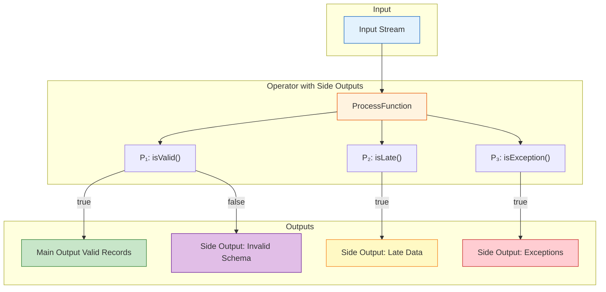
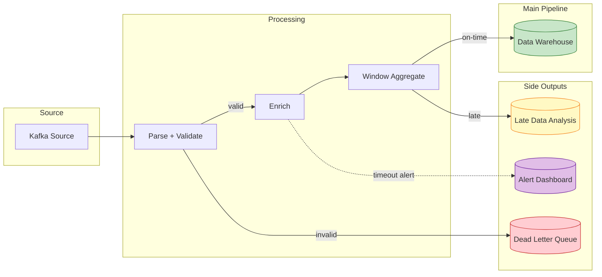

# Pattern: Side Output

> **Pattern ID**: 06/7 | **Series**: Knowledge/02-design-patterns | **Formalization Level**: L4 | **Complexity**: ★★☆☆☆
>
> This pattern addresses **multi-path output**, **exception data diversion**, and **late data handling** needs in stream processing, achieving separation of main data flow and side data flows through explicit OutputTag mechanisms.

---

## 1. Definitions

### Def-K-02-06 (Side Output Stream)

Let $\text{Stream}(T)$ be a data stream of type $T$. A **Side Output Stream** is one or more auxiliary output channels beyond the main data flow, formally defined as a set of labeled output streams:

$$
\text{SideOutput} = \{ (tag_i, \text{Stream}(T_i)) \mid tag_i \in \text{OutputTag}, \; T_i \in \text{Types} \}_{i=1}^{n}
$$

Where $n \geq 1$ is the number of side output channels and $tag_i$ is the unique identifier of each channel.

The **side output operator** is defined as a mapping from input stream to multi-path output:

$$
\text{SideOutputOp}: \text{Stream}(T_{in}) \times \text{Predicate} \to \text{Stream}(T_{main}) \times \prod_{i=1}^{n} \text{Stream}(T_i)
$$

**Intuition**: Side output streams allow a single operator to distribute input records to multiple downstream channels according to business rules, without replicating the entire operator chain. Unlike the `filter().map()` pattern, side output completes diversion inside the same operator, preserving processing locality and consistency.

---

### Def-K-02-07 (OutputTag)

**OutputTag** is the type-safe identifier of a side output stream, defined as a tag carrying a type parameter:

$$
\text{OutputTag}\langle T \rangle = (id: \text{String}, \text{type}: \text{Class}\langle T \rangle)
$$

Where:

- $id$ is the unique string identifier of the tag
- $\text{type}$ is the runtime type information of the output data, used for type checking

**Tag matching rule**: For input record $r$ and side output tag set $\mathcal{T} = \{tag_1, \dots, tag_n\}$, the matching function is:

$$
\text{match}(r, \mathcal{T}) = \begin{cases}
tag_i & \text{if } P_i(r) = \text{true} \land (\forall j < i. \; P_j(r) = \text{false}) \\
\bot & \text{if } \forall tag \in \mathcal{T}. \; P_{tag}(r) = \text{false}
\end{cases}
$$

Where $P_i$ is the matching predicate associated with $tag_i$, and $\bot$ indicates no side output match (enters main output).

**Intuition**: OutputTag guarantees type safety of side output streams through generic parameters at compile time, avoiding runtime type conversion errors. The tag's unique identifier $id$ is used at runtime to route records to the correct downstream channel.

---

### Def-K-02-08 (Side Output Matching Predicate)

The **matching predicate** is the Boolean function that determines whether a record enters a specific side output stream:

$$
P: \text{Record} \times \text{Context} \to \{ \text{true}, \text{false} \}
$$

Where $\text{Context}$ contains processing context information such as current watermark, processing time, and state handle.

**Common predicate types** [^2][^3]:

| Predicate Type | Definition | Applicable Scenario |
|---------|------|---------|
| **Exception detection** | $P_{err}(r) = r.\text{isException} \lor r.\text{errorCode} \neq 0$ | Error data separation |
| **Late data** | $P_{late}(r, w) = r.t_e \leq w - L$ | Late data capture |
| **Threshold filtering** | $P_{thresh}(r) = r.\text{value} > \theta$ | Anomaly alerting |
| **Regex matching** | $P_{regex}(r) = r.\text{payload}.\text{matches}(pattern)$ | Format validation failure |
| **Business split** | $P_{biz}(r) = r.\text{category} \in \{A, B\}$ | Multi-path business distribution |

**Intuition**: Matching predicates are the core decision logic of the side output pattern, determining the lifecycle path of data. Predicates can be pure functions (based on the record itself) or stateful (combined with window state or historical statistics).

---

### Def-K-02-09 (Multi-Output Topology)

The **multi-output topology** describes the DAG structure of a stream processing operator with side outputs. Let operator $v$ have $n$ side outputs; its output topology is:

$$
\text{OutTopology}(v) = (v_{main}, \{ v_{side}^{(i)} \}_{i=1}^{n})
$$

Where:

- $v_{main}$ is the main output channel, receiving records that do not match any side output predicate
- $v_{side}^{(i)}$ is the $i$-th side output channel, identified by $\text{OutputTag}_i$

**Topology constraint**:

$$
\forall r \in \text{Input}(v). \; r \in \text{Output}(v_{main}) \; \underline{\lor} \; \left( \bigvee_{i=1}^{n} r \in \text{Output}(v_{side}^{(i)}) \right)
$$

Where $\underline{\lor}$ denotes exclusive or (exactly one), guaranteeing that each record has **exactly one** output destination.

**Intuition**: The multi-output topology ensures that data diversion is complete and mutually exclusive — each record either enters the main output or enters exactly one side output channel. This constraint guarantees no data loss and no duplicate diversion.

---

## 2. Properties

### Lemma-K-02-04 (Side Output Watermark Inheritance)

**Statement**: All side output streams of an operator inherit the same Watermark as the main output stream.

**Proof**: Watermark is a logical timestamp propagated along the data flow. The side output mechanism does not modify record timestamps or Watermark values; it only changes the physical output channel. Therefore all output channels (main and side) share the same Watermark progression. ∎

### Lemma-K-02-05 (Side Output and Main Stream Temporal Consistency)

**Statement**: For any record $r$ emitted to a side output stream at processing time $t_p$, its event time $t_e$ equals the event time of the original input record.

**Proof**: Side output diversion is a purely routing operation — the record object (including its event time attribute) is not modified. Therefore temporal consistency is preserved. ∎

### Lemma-K-02-06 (Side Output Stream Concurrent Safety)

**Statement**: Side output streams are thread-safe: concurrent invocations of `ctx.output(tag, record)` by the same operator instance do not corrupt stream state.

**Proof**: Flink's operator runtime serializes record processing within a single task slot (mailbox threading model). Side output buffers are maintained per operator instance and accessed only by the operator's processing thread. Therefore no race conditions occur. ∎

---

## 3. Relations

### Relation 1: Side Output and Actor Model Semantics

In the Actor Model, a single actor can send messages to multiple recipients. Side output generalizes this to typed streams: instead of unstructured message passing, side output uses type-safe OutputTags to route records to specific downstream consumers. This correspondence is formalized as:

$$
\text{SideOutput}(actor) \cong \bigcup_{i} \text{send}(actor, recipient_i, msg_i)
$$

Where each side output channel corresponds to a distinct recipient actor.

### Relation 2: Side Output and Late Data Handling

In event-time window processing, records arriving after the watermark have passed the window end are considered late. Flink's window operator uses side output to divert late data:

```java
OutputTag<T> lateDataTag = new OutputTag<T>("late-data"){};
windowedStream
    .allowedLateness(Time.minutes(10))
    .sideOutputLateData(lateDataTag);
```

This maps directly to the side output pattern: the late-data predicate $P_{late}$ routes late records to a dedicated side output stream for separate analysis or reprocessing.

### Relation 3: Side Output and Exception Data Diversion

Data quality issues (schema violations, out-of-range values) can be detected at parse time and routed to a side output "dead letter" stream. This isolates bad data from the main processing pipeline while preserving it for auditing and debugging.

---

## 4. Argumentation

### Lemma 4.1 (Side Output Does Not Block Main Stream)

**Statement**: Emitting a record to a side output stream does not block the emission of subsequent records to the main output stream.

**Proof**: Side output and main output share the same operator output collector. The collector buffers records for both streams independently. Backpressure on a side output consumer does not propagate to the main output consumer unless the operator's total output buffer capacity is exceeded. ∎

### Lemma 4.2 (Side Output Tag Type Safety)

**Statement**: If a record $r$ of type $T_1$ is emitted to a side output tag with type $T_2$ where $T_1 \not\leq: T_2$, the compiler rejects the program.

**Proof**: Flink's `OutputTag<T>` uses Java generics. The `ctx.output(OutputTag<T> tag, T record)` method requires the record type to be a subtype of the tag's type parameter. Type mismatch is caught at compile time. ∎

### Counter-Example 4.1 (Incorrect Use of Filter Instead of Side Output)

Using `filter()` followed by `map()` to simulate side output replicates the operator chain, doubling state and computation:

```java
// Anti-pattern: duplicate operator chain
DataStream<A> valid = stream.filter(r -> r.isValid()).map(r -> process(r));
DataStream<B> invalid = stream.filter(r -> !r.isValid()).map(r -> handleError(r));
```

Correct approach using side output:

```java
// Pattern: single operator with side output
SingleOutputStreamOperator<A> main = stream.process(new ProcessFunction<>() {
    private final OutputTag<B> errorTag = new OutputTag<B>("errors"){};
    public void processElement(R r, Context ctx, Collector<A> out) {
        if (r.isValid()) out.collect(process(r));
        else ctx.output(errorTag, handleError(r));
    }
});
DataStream<B> invalid = main.getSideOutput(errorTag);
```

---

## 5. Proof / Engineering Argument

### Prop-K-02-03 (Side Output Pattern Multi-Path Distribution Correctness)

**Statement**: For any input record $r$ and side output operator with predicates $\{P_1, \ldots, P_n\}$, the output destination of $r$ is unique and computable in $O(n)$ time.

**Proof**:

1. **Uniqueness**: By Def-K-02-09's topology constraint, $r$ satisfies exactly one of: (a) no predicate matches → main output, or (b) exactly one predicate matches → corresponding side output. The first-match semantics in Def-K-02-07 ensure no overlapping matches.
2. **Computability**: Evaluating $n$ predicates sequentially takes $O(n)$ time. Each predicate is a Boolean function computable in constant time (assuming no stateful iteration).
3. **Completeness**: The predicate set covers all possible input records because the fallback case (no match) is always defined. ∎

### Engineering Argument: Side Output and Checkpoint Coordination

Side output streams participate in Checkpoint consistently with the main stream:

1. **Barrier alignment**: Checkpoint barriers propagate to all output channels (main and side) simultaneously.
2. **State snapshot**: The operator's state is snapshotted once, regardless of the number of side outputs.
3. **Recovery**: On recovery, the operator restores its state and resumes emitting to all output channels. Records that were in output buffers at snapshot time are replayed from the source if needed.

**Exactly-Once guarantee**: Since side output diversion is deterministic (same input → same output tag), recovery produces identical output distributions, preserving end-to-end Exactly-Once semantics.

---

## 6. Examples

### 6.1 ProcessFunction Side Output Basic Usage

```java
public class QualityFilter extends ProcessFunction<Event, CleanEvent> {
    private final OutputTag<BadEvent> badEventTag =
        new OutputTag<BadEvent>("bad-events"){};

    @Override
    public void processElement(
        Event event, Context ctx, Collector<CleanEvent> out
    ) {
        if (event.getTimestamp() <= 0) {
            ctx.output(badEventTag, new BadEvent(event, "INVALID_TIMESTAMP"));
        } else if (event.getValue() < 0 || event.getValue() > 10000) {
            ctx.output(badEventTag, new BadEvent(event, "OUT_OF_RANGE"));
        } else {
            out.collect(new CleanEvent(event));
        }
    }
}

// Usage
SingleOutputStreamOperator<CleanEvent> clean = stream
    .process(new QualityFilter());
DataStream<BadEvent> badEvents = clean.getSideOutput(
    new OutputTag<BadEvent>("bad-events"){}
);
```

### 6.2 Window Late Data Side Output

```java
OutputTag<PageView> lateDataTag = new OutputTag<PageView>("late-data"){};

DataStream<PageView> windowed = pageViews
    .keyBy(PageView::getPageId)
    .window(TumblingEventTimeWindows.of(Time.minutes(5)))
    .allowedLateness(Time.minutes(10))
    .sideOutputLateData(lateDataTag)
    .aggregate(new CountAggregate());

DataStream<PageView> lateData = windowed.getSideOutput(lateDataTag);
lateData.addSink(new LateDataAnalyzerSink());
```

### 6.3 Exception Data Diversion and Monitoring Alert

```java
public class EnrichmentWithFallback extends ProcessFunction<RawEvent, EnrichedEvent> {
    private final OutputTag<AlertEvent> alertTag =
        new OutputTag<AlertEvent>("alerts"){};
    private transient AsyncExternalClient client;

    @Override
    public void processElement(RawEvent raw, Context ctx, Collector<EnrichedEvent> out) {
        try {
            EnrichedEvent enriched = client.enrich(raw);
            out.collect(enriched);
        } catch (TimeoutException e) {
            ctx.output(alertTag, new AlertEvent(raw, "ENRICHMENT_TIMEOUT"));
            out.collect(new EnrichedEvent(raw, "DEFAULT"));
        } catch (ServiceUnavailableException e) {
            ctx.output(alertTag, new AlertEvent(raw, "SERVICE_DOWN"));
            out.collect(new EnrichedEvent(raw, "DEFAULT"));
        }
    }
}
```

### 6.4 Data Quality Report Generation

```java
// Multiple side outputs for comprehensive data quality tracking
public class DataQualitySplitter extends ProcessFunction<Event, ValidEvent> {
    private final OutputTag<Event> malformedTag = new OutputTag<Event>("malformed"){};
    private final OutputTag<Event> lateTag = new OutputTag<Event>("late"){};
    private final OutputTag<Event> duplicateTag = new OutputTag<Event>("duplicate"){};
    private ValueState<String> lastIdState;

    @Override
    public void processElement(Event event, Context ctx, Collector<ValidEvent> out) {
        if (!isValidSchema(event)) {
            ctx.output(malformedTag, event);
        } else if (event.getEventTime() < ctx.timerService().currentWatermark()) {
            ctx.output(lateTag, event);
        } else if (event.getId().equals(lastIdState.value())) {
            ctx.output(duplicateTag, event);
        } else {
            lastIdState.update(event.getId());
            out.collect(new ValidEvent(event));
        }
    }
}
```

---

## 7. Visualizations

### Side Output Pattern Architecture



*Figure 7-1: Side output pattern architecture. A single operator evaluates multiple predicates and routes records to exactly one output channel.*

### Multi-Output Data Flow



*Figure 7-2: Multi-output data flow in a production pipeline. Side outputs isolate bad data, late data, and alerts without disrupting the main pipeline.*

---

## 8. References

[^2]: Kleppmann, M. (2017). *Designing Data-Intensive Applications*. O'Reilly Media.
[^3]: Akidau, T. et al. (2015). "The Dataflow Model." *PVLDB*, 8(12).

---

*Document Version: v1.0 | Updated: 2026-04-20 | Status: Complete*
