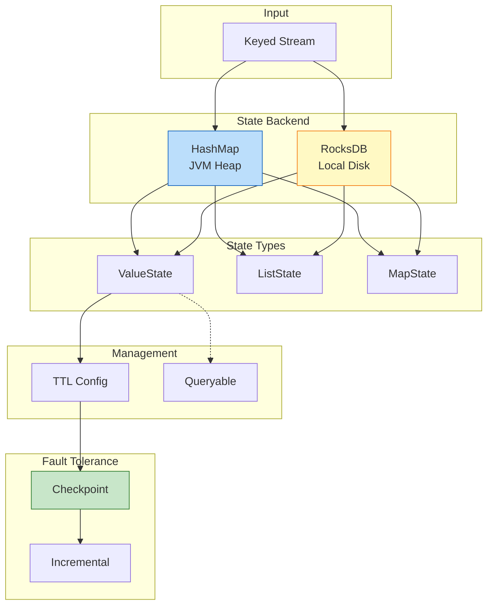

# Design Pattern: Stateful Computation

> **Pattern ID**: 05/7 | **Series**: Knowledge/02-design-patterns | **Formalization Level**: L4-L5
>
> This pattern addresses the core tension among **state consistency**, **fault-tolerant recovery**, and **large-scale state management** in distributed stream processing.

---

## Table of Contents

- [Design Pattern: Stateful Computation](#design-pattern-stateful-computation)
  - [Table of Contents](#table-of-contents)
  - [1. Definitions](#1-definitions)
    - [Def-K-02-04 (Operator State)](#def-k-02-04-operator-state)
    - [Def-K-02-05 (Keyed State)](#def-k-02-05-keyed-state)
    - [Def-K-02-06 (State Backend)](#def-k-02-06-state-backend)
    - [Def-K-02-07 (State TTL)](#def-k-02-07-state-ttl)
    - [Def-K-02-08 (Queryable State)](#def-k-02-08-queryable-state)
  - [2. Properties](#2-properties)
    - [Prop-K-02-03 (State Partitioning Determinism)](#prop-k-02-03-state-partitioning-determinism)
    - [Prop-K-02-04 (TTL Validity Boundary)](#prop-k-02-04-ttl-validity-boundary)
    - [Prop-K-02-05 (State Backend Access Latency)](#prop-k-02-05-state-backend-access-latency)
  - [3. Relations](#3-relations)
    - [Relation to Event Time Processing](#relation-to-event-time-processing)
    - [Relation to Windowed Aggregation](#relation-to-windowed-aggregation)
    - [Relation to Checkpoint Mechanism](#relation-to-checkpoint-mechanism)
  - [4. Argumentation](#4-argumentation)
    - [4.1 Challenges of Distributed Stateful Computation](#41-challenges-of-distributed-stateful-computation)
    - [4.2 State Backend Selection Argument](#42-state-backend-selection-argument)
    - [4.3 Applicability Analysis](#43-applicability-analysis)
  - [8. Formal Guarantees](#8-formal-guarantees)
    - [8.1 Dependent Formal Definitions](#81-dependent-formal-definitions)
    - [8.2 Satisfied Formal Properties](#82-satisfied-formal-properties)
    - [8.3 Property Preservation Under Composition](#83-property-preservation-under-composition)
    - [8.4 Boundary Conditions and Constraints](#84-boundary-conditions-and-constraints)
    - [8.5 Formal Characteristics of State Backends](#85-formal-characteristics-of-state-backends)
  - [5. Proof / Engineering Argument](#5-proof--engineering-argument)
    - [5.1 Keyed State Local Determinism Argument](#51-keyed-state-local-determinism-argument)
    - [5.2 Incremental Checkpoint Consistency Argument](#52-incremental-checkpoint-consistency-argument)
    - [5.3 State Backend Selection Engineering Trade-offs](#53-state-backend-selection-engineering-trade-offs)
  - [6. Examples](#6-examples)
    - [6.1 Keyed State Basic Usage](#61-keyed-state-basic-usage)
    - [6.2 State TTL Configuration](#62-state-ttl-configuration)
    - [6.3 State Backend Configuration](#63-state-backend-configuration)
    - [6.4 Queryable State Implementation](#64-queryable-state-implementation)
  - [7. Visualizations](#7-visualizations)
    - [7.1 State Management Architecture Diagram](#71-state-management-architecture-diagram)
    - [7.2 State Backend Selection Decision Tree](#72-state-backend-selection-decision-tree)
  - [9. References](#9-references)

---

## 1. Definitions

### Def-K-02-04 (Operator State)

**Definition**: Operator State is global state bound to an operator instance; all records in the stream share the same state副本 [^1].

Formally, let the operator instance be $o_i$, then:

$$
S_{\text{operator}}(o_i) \in \mathcal{V}
$$

where $\mathcal{V}$ is the state value space. Typical uses of Operator State include: offset tracking in Kafka Source, global configuration tables in Broadcast State.

---

### Def-K-02-05 (Keyed State)

**Definition**: Keyed State is key-partitioned local state; each key maintains an independent state副本 [^1].

$$
S_{\text{keyed}}: (\text{TaskInstance} \times \text{Key}) \to \text{StateValue}
$$

Keyed State access is strictly limited to operators after `keyBy()`. Flink guarantees that all records with the same key are routed to the same parallel sub-task, ensuring serialized state updates (**Thm-S-03-01**).

**State Types** [^1]:

| Type | Description | Scenario |
|------|-------------|----------|
| ValueState | Single-value state | Counters |
| ListState | List state | Historical records |
| MapState | Map structure | Key-value collections |
| ReducingState | Reducible state | Incremental aggregation |

---

### Def-K-02-06 (State Backend)

**Definition**: State Backend is the pluggable abstraction layer in Flink responsible for state storage, access, and Checkpoint snapshot persistence [^2].

$$
\mathcal{B} = (S_{\text{storage}}, \Phi_{\text{access}}, \Psi_{\text{snapshot}}, \Omega_{\text{recovery}})
$$

where:

- $S_{\text{storage}}$: physical storage medium (JVM Heap or local disk)
- $\Phi_{\text{access}}$: state read/write interface
- $\Psi_{\text{snapshot}}$: asynchronous snapshot mechanism
- $\Omega_{\text{recovery}}$: fault-recovery workflow

**Major Implementation Comparison**:

| Feature | HashMapStateBackend | RocksDBStateBackend |
|---------|---------------------|---------------------|
| Storage Location | JVM Heap memory | Local disk (RocksDB) |
| State Size Limit | Limited by TaskManager memory | Limited by local disk capacity |
| Access Latency | Extremely low (in-memory direct access) | Low (memory + disk cache) |
| Incremental Checkpoint | Supported (requires config) | Native support (SST-based) |
| Large State Support | Not suitable (> 100MB) | Suitable (TB-level) |

---

### Def-K-02-07 (State TTL)

**Definition**: TTL (Time-To-Live) defines the valid lifetime of state; state exceeding TTL is considered expired and triggers cleanup [^6].

$$
\text{Valid}(S_k, t) \iff t - \text{LastAccess}(S_k) < \text{TTL}
$$

**Cleanup Strategies**:

| Strategy | Trigger Timing | Applicable Backends |
|----------|----------------|---------------------|
| Full Snapshot | During Checkpoint | Universal |
| Incremental | On state access | Universal |
| RocksDB Compaction | During compaction | RocksDB only |

---

### Def-K-02-08 (Queryable State)

**Definition**: Queryable State allows external clients to read-only access Keyed State inside an operator via RPC [^8].

```
Client ──RPC──► Queryable State Server ◄──Local── Task Manager
                                                │
                                                ▼
                                          Keyed State
```

**Limitations**: read-only access, Keyed State only, relatively high network overhead. Queryable State has been marked as deprecated in Flink 1.17+; REST API or external storage are recommended alternatives [^8].

---

## 2. Properties

### Prop-K-02-03 (State Partitioning Determinism)

**Proposition**: Keyed State is distributed across parallel sub-tasks by the hash of the key; all records with the same key are necessarily routed to the same sub-task.

$$
\text{Partition}(key) = \text{hash}(key) \mod \text{parallelism}
$$

**Derivation**:

1. The `keyBy()` operator partitions based on the hash of the key
2. Flink's data exchange layer guarantees that data with the same partition number is sent to the same Task instance
3. Therefore, state updates for the same key are executed serially within a single thread
4. Combined with **Lemma-S-03-01** (Actor mailbox serial processing lemma), Keyed State updates satisfy local determinism (**Thm-S-03-01**)

---

### Prop-K-02-04 (TTL Validity Boundary)

**Proposition**: Let the last access time of state be $t_{\text{last}}$ and TTL be $T$; then state $S_k$ is valid at time $t$ if and only if:

$$
t - t_{\text{last}} < T
$$

**Engineering Constraints**:

- TTL cleanup is asynchronous/lazy; expired state may still be briefly accessed before cleanup
- `StateVisibility.NeverReturnExpired` configuration ensures expired state is never returned
- TTL should be set shorter than the Checkpoint retention period to avoid state bloat increasing recovery time

---

### Prop-K-02-05 (State Backend Access Latency)

**Proposition**: Let the state size be $|S|$; HashMapStateBackend access latency is $O(1)$, independent of state size; RocksDBStateBackend access latency is $O(\log |S|)$ (based on LSM-Tree level lookup).

**Performance Comparison** (typical scenarios):

| State Size | HashMap Access Latency | RocksDB Access Latency | Recommendation |
|------------|------------------------|------------------------|----------------|
| 10 MB | ~0.1 μs | ~5 μs | HashMap |
| 100 MB | ~0.5 μs | ~5 μs | HashMap |
| 1 GB | OOM | ~10 μs | RocksDB |
| 100 GB | N/A | ~50 μs | RocksDB |

---

## 3. Relations

### Relation to Event Time Processing

Stateful computation is deeply coupled with Event Time [^10]:

- State access can be combined with event timestamps to implement time-windowed state (e.g., session windows)
- Watermark advancement can drive state expiration cleanup (TTL)
- The monotonicity of event time guarantees states are updated in the correct temporal order

### Relation to Windowed Aggregation

Windowed aggregation internally relies on Keyed State [^11]:

- Aggregation results for Tumbling/Sliding/Session Windows are stored in ValueState or ListState
- Window trigger state and computation state are stored separately
- The Allowed Lateness mechanism of windows relies on persistent state retention

### Relation to Checkpoint Mechanism

Checkpoint is the foundation of fault tolerance for stateful computation [^2][^9]:

- The State Backend implements the snapshot requirements of **Thm-S-17-01**, capturing a consistent global state
- Incremental Checkpoint persists only the changed portion of state, optimizing storage efficiency without altering consistency guarantees
- During fault recovery, state is rebuilt from Checkpoint, and combined with Source replay to achieve Exactly-Once (**Thm-S-18-01**)

---

## 4. Argumentation

### 4.1 Challenges of Distributed Stateful Computation

In distributed stream processing, stateful computation needs to maintain context information across events:

| Challenge Dimension | Problem Description | Typical Impact |
|---------------------|---------------------|----------------|
| **Fault-tolerant Consistency** | How to recover state upon node failure | Exactly-Once semantics violation |
| **State Scale** | Storage and access of massive key-value pairs | OOM, GC pauses |
| **State Expiration** | Cleanup of invalid state | State bloat |
| **External Query** | External access to runtime state | Insufficient observability |

**Formal Description**: Let the state of operator $o_i$ at time $t$ be $S_t(o_i)$; stateful computation satisfies:

$$
\text{Output}(o_i, r_j, t) = f(r_j, S_{t-1}(o_i))
$$

That is, the output depends on historically accumulated state, making fault recovery require precise restoration of historical state.

**Core Tension Triangle**:

```
         Consistency
              ▲
             /|\
            / | \
           /  |  \
          /   |   \
Low Latency ◄──────────────► Large Scale
```

- Strong consistency requires Barrier alignment, increasing latency
- Large-scale state requires disk storage, with higher access latency
- Low latency demands in-memory computation, limiting state scale

---

### 4.2 State Backend Selection Argument

**HashMapStateBackend Applicable Scenarios** [^9]:

- State size < 100MB
- Requires extremely low access latency (< 1ms)
- Short-window aggregation (minute-level)
- Configuration parameter state

**RocksDBStateBackend Applicable Scenarios** [^9]:

- State size > 100MB or unknown
- Long-window aggregation (hour/day-level)
- Large Keyspace (millions of keys)
- Incremental Checkpoint to optimize storage cost

**Selection Decision Tree** [^9]:

```
State size < 30% of TM heap memory ?
├── Yes ──► HashMapStateBackend (low latency)
└── No  ──► RocksDBStateBackend (large state)
```

---

### 4.3 Applicability Analysis

**Recommended** [^1][^9]:

| Scenario | Rationale | Configuration |
|----------|-----------|---------------|
| Session Window | Maintain sessions across events | ValueState + TTL |
| Cumulative Metrics | Daily/monthly cumulative statistics | ReducingState + Incremental Checkpoint |
| CEP Pattern Matching | NFA state machine | MapState + Short TTL |
| Deduplication Filter | Exact deduplication | ValueState + Expiration cleanup |

**Not Recommended** [^1]:

| Scenario | Rationale | Alternative |
|----------|-----------|-------------|
| Pure stateless transformation | No state needed | map/filter |
| Large object cache | Not suitable for caching | Redis |
| Cross-job sharing | Job isolation | External database |

---

## 8. Formal Guarantees

This section establishes the formal connection between the stateful computation pattern and the Struct/ theoretical layer.

### 8.1 Dependent Formal Definitions

| Definition ID | Name | Source | Role in This Pattern |
|---------------|------|--------|----------------------|
| **Def-S-03-01** | Classic Actor Quadruple | Struct/01.03 | Concurrency model foundation for Keyed State: $\langle \alpha, b, m, \sigma \rangle$ |
| **Def-S-04-01** | Dataflow Graph (DAG) | Struct/01.04 | Stateful operator as stateful vertex $\langle V, E, P, \Sigma, \mathbb{T} \rangle$ |
| **Def-S-17-02** | Consistent Global State | Struct/04.01 | Checkpoint-captured state must form a consistent cut |
| **Def-S-18-05** | Idempotency | Struct/04.02 | State update replay must satisfy idempotency |

### 8.2 Satisfied Formal Properties

| Theorem/Lemma ID | Name | Source | Guarantee |
|------------------|------|--------|-----------|
| **Thm-S-03-01** | Actor Local Determinism Theorem | Struct/01.03 | Single-key state updates are serialized, guaranteeing local determinism |
| **Lemma-S-03-01** | Actor Mailbox Serial Processing Lemma | Struct/01.03 | Messages with the same key are processed FIFO |
| **Thm-S-17-01** | Checkpoint Consistency Theorem | Struct/04.01 | State snapshots form a consistent global state |
| **Thm-S-18-01** | Exactly-Once Correctness Theorem | Struct/04.02 | State recovery + Source replay = Exactly-Once |
| **Lemma-S-18-03** | State Recovery Consistency Lemma | Struct/04.02 | Recovered state is consistent with some pre-failure moment |

### 8.3 Property Preservation Under Composition

**Stateful Computation + Event Time Composition**:

- State access can be combined with event timestamps to implement time-windowed state
- Watermark drives state expiration cleanup (TTL)

**Stateful Computation + Checkpoint Composition**:

- State Backend implements the snapshot requirements of **Thm-S-17-01**
- Incremental Checkpoint optimization does not change consistency guarantees

**Stateful Computation + Windowed Aggregation Composition**:

- Window state is implemented using Keyed State
- Window trigger state and computation state are stored separately

### 8.4 Boundary Conditions and Constraints

| Constraint | Formal Description | Violation Consequence |
|------------|--------------------|-----------------------|
| Fixed Key Partitioning | $\text{hash}(k) \mod \text{parallelism}$ unchanged | Key drift, state loss |
| Finite State Size | $\|S\| < \infty$ | OOM, job crash |
| Reasonable TTL Config | TTL < Checkpoint interval $\times N$ | State bloat, increased recovery time |
| Isolated Concurrent Access | Single key, single-thread access | Data races, state corruption |

### 8.5 Formal Characteristics of State Backends

| Backend Type | Storage Model | Consistency Guarantee | Applicable Scenario |
|--------------|---------------|-----------------------|---------------------|
| HashMapStateBackend | In-memory KV | **Thm-S-17-01** | Small state (<100MB) |
| RocksDBStateBackend | LSM-Tree | **Thm-S-17-01** | Large state (TB-level) |

---

## 5. Proof / Engineering Argument

### 5.1 Keyed State Local Determinism Argument

**Theorem Statement** (citing **Thm-S-03-01**) [^12]:

> In the Actor model, the local execution of a single Actor is deterministic: for the same initial state and the same message sequence, the output state sequence is unique.

**Mapping to Flink Keyed State**:

1. Flink's `keyBy()` partitions the stream by key, equivalent to creating a logical Actor for each key
2. All records with the same key are delivered to the same Task thread in FIFO order (**Lemma-S-03-01**)
3. Keyed State `update()` operations are executed serially within a single thread, free of data races
4. Therefore, the evolution of Keyed State satisfies local determinism

**Engineering Significance**: Local determinism is the foundation for reproducibility after fault recovery. Even though parallel processing across different keys may have scheduling non-determinism, the state evolution path for a single key is deterministic.

---

### 5.2 Incremental Checkpoint Consistency Argument

**Argument Goal**: Prove that incremental Checkpoint does not break global state consistency (**Thm-S-17-01**) while optimizing storage efficiency.

**Argument Structure**:

1. **Completeness of State Snapshot**: Each Checkpoint captures incremental changes plus a baseline full state, which can fully reconstruct the global state at that moment
2. **SST Immutability**: Once generated, RocksDB SST files are never modified; incremental snapshots only need to reference new SSTs, naturally satisfying the consistent-cut requirement
3. **Recovery Correctness**: During recovery, Flink automatically merges baseline and incremental files; the reconstructed state is semantically equivalent to a full snapshot
4. **No Orphan Messages**: Incremental Checkpoint does not alter Barrier alignment semantics, so in-flight message processing is consistent with full snapshots (**Lemma-S-17-04**)

**Conclusion**: Incremental Checkpoint is an optimized implementation of **Thm-S-17-01**, not a weakened one.

---

### 5.3 State Backend Selection Engineering Trade-offs

**Trade-off Matrix**:

| Dimension | HashMapStateBackend | RocksDBStateBackend |
|-----------|---------------------|---------------------|
| Access Latency | ~10-100 ns | 1-100 μs |
| State Capacity | Several MB - Several GB | TB-level |
| GC Impact | Large state causes frequent Full GC | Minimal impact on JVM Heap |
| Incremental Checkpoint | Not supported (high object-level comparison overhead) | Native support (SST-level) |
| Recovery Speed | Fast (memory load) | Medium (requires LSM-Tree rebuild) |

**Decision Rule**:

$$
\text{Backend} = \begin{cases}
\text{HashMap} & \text{if } |S| < 0.3 \times \text{TM\_Heap} \land \text{Latency} < 1\text{ms} \\
\text{RocksDB} & \text{otherwise}
\end{cases}
$$

where $|S|$ is the estimated state size and TM_Heap is the TaskManager heap memory.

---

## 6. Examples

### 6.1 Keyed State Basic Usage

```scala
class UserVisitCounter extends ProcessFunction[UserEvent, UserStats] {
  private var visitCountState: ValueState[Long] = _

  override def open(parameters: Configuration): Unit = {
    val descriptor = new ValueStateDescriptor[Long](
      "visit-count", classOf[Long]
    )
    visitCountState = getRuntimeContext.getState(descriptor)
  }

  override def processElement(
    event: UserEvent,
    ctx: Context,
    out: Collector[UserStats]
  ): Unit = {
    val currentCount = Option(visitCountState.value()).getOrElse(0L)
    val newCount = currentCount + 1
    visitCountState.update(newCount)
    out.collect(UserStats(event.userId, newCount))
  }
}
```

---

### 6.2 State TTL Configuration

```scala
val ttlConfig = StateTtlConfig
  .newBuilder(Time.minutes(30))
  .setUpdateType(OnCreateAndWrite)
  .setStateVisibility(NeverReturnExpired)
  .cleanupFullSnapshot()
  .build()

val descriptor = new ValueStateDescriptor[SessionInfo](
  "session", classOf[SessionInfo]
)
descriptor.enableTimeToLive(ttlConfig)
```

---

### 6.3 State Backend Configuration

**HashMapStateBackend** (small state) [^9]:

```scala
env.setStateBackend(new HashMapStateBackend())
env.getCheckpointConfig.setCheckpointStorage("hdfs:///checkpoints")
```

**RocksDBStateBackend** (large state + incremental) [^9]:

```scala
val rocksDbBackend = new EmbeddedRocksDBStateBackend(true) // true = incremental
env.setStateBackend(rocksDbBackend)
env.getCheckpointConfig.setCheckpointStorage("hdfs:///checkpoints")
```

---

### 6.4 Queryable State Implementation

```scala
val descriptor = new ValueStateDescriptor[UserProfile](
  "user-profile", classOf[UserProfile]
)
descriptor.setQueryable("queryable-user-profile")
```

External query [^8]:

```scala
val client = new QueryableStateClient("jobmanager", 9069)
val future = client.getKvState(
  jobId, "queryable-user-profile", "user_123",
  keySerializer, stateDescriptor
)
```

---

## 7. Visualizations

### 7.1 State Management Architecture Diagram

The following Mermaid diagram shows the core components and layer relationships of the stateful computation pattern:



---

### 7.2 State Backend Selection Decision Tree

The following decision tree helps select the appropriate state backend under different scenarios:

```mermaid
flowchart TD
    A[State Backend Selection] --> B{State size <br/>< 30% of TM heap memory ?}
    B -->|Yes| C{Latency requirement < 1ms ?}
    B -->|No|  D[RocksDBStateBackend<br/>Large state / Incremental Checkpoint]

    C -->|Yes| E[HashMapStateBackend<br/>Low latency / In-memory access]
    C -->|No|  F{Need incremental Checkpoint ?}
    F -->|Yes| D
    F -->|No|  G[HashMapStateBackend<br/>Medium state]

    style A fill:#e3f2fd,stroke:#1565c0
    style E fill:#c8e6c9,stroke:#2e7d32
    style D fill:#fff9c4,stroke:#f57f17
    style G fill:#e1bee7,stroke:#6a1b9a
```

---

## 9. References

[^1]: Flink State Documentation. <https://nightlies.apache.org/flink/flink-docs-stable/docs/dev/datastream/fault-tolerance/state/>

[^2]: Carbone et al., "State Management in Apache Flink," *PVLDB*, 2017.

[^6]: Flink State TTL. <https://nightlies.apache.org/flink/flink-docs-stable/docs/dev/datastream/fault-tolerance/state/#state-time-to-live-ttl>

[^8]: Flink Queryable State. <https://archive.org/web/*/https://nightlies.apache.org/flink/flink-docs-release-1.16/docs/dev/datastream/fault-tolerance/queryable_state/> <!-- 404 as of 2026-04: deprecated in Flink 1.17+ -->

[^9]: Flink State Backend Selection. [Flink/09-practices/09.03-performance-tuning/state-backend-selection.md](../../Flink/09-practices/09.03-performance-tuning/state-backend-selection.md)

[^10]: Flink Time Semantics. [Flink/02-core/time-semantics-and-watermark.md](../../Flink/02-core/time-semantics-and-watermark.md)

[^11]: Flink Checkpoint Mechanism. [Flink/02-core/checkpoint-mechanism-deep-dive.md](../../Flink/02-core/checkpoint-mechanism-deep-dive.md)

[^12]: Type Safety Derivation. [Struct/02-properties/02.05-type-safety-derivation.md](../../Struct/02-properties/02.05-type-safety-derivation.md)

---

*Document Version: v1.0 | Last Updated: 2026-04-02*
