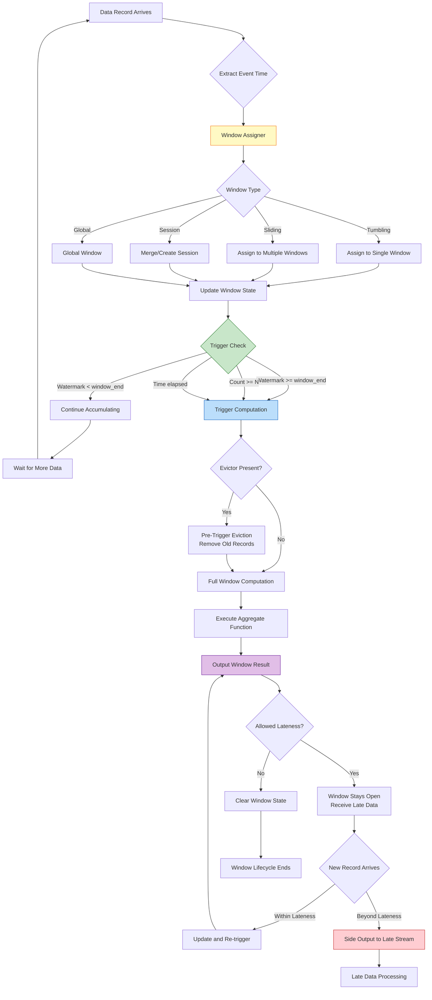

# Pattern: Windowed Aggregation

> **Stage**: Knowledge | **Prerequisites**: [Related Documents] | **Formalization Level**: L3

> **Pattern ID**: 02/7 | **Series**: Knowledge/02-design-patterns | **Formalization Level**: L4 | **Complexity**: ★★☆☆☆
>
> This pattern divides unbounded data streams into finite time buckets for aggregation computation, resolving the tension between **batch processing semantics** and **stream computing** in stream processing.

---

## Table of Contents

- [Pattern: Windowed Aggregation](#pattern-windowed-aggregation)
  - [Table of Contents](#table-of-contents)
  - [1. Definitions](#1-definitions)
    - [Def-K-02-01 (Window Assigner)](#def-k-02-01-window-assigner)
    - [Def-K-02-02 (Window Type Classification)](#def-k-02-02-window-type-classification)
    - [Def-K-02-03 (Trigger)](#def-k-02-03-trigger)
    - [Def-K-02-04 (Evictor)](#def-k-02-04-evictor)
    - [Def-K-02-05 (Window Aggregate Function)](#def-k-02-05-window-aggregate-function)
  - [2. Properties](#2-properties)
    - [Prop-K-02-01 (Window Time Coverage Completeness)](#prop-k-02-01-window-time-coverage-completeness)
    - [Prop-K-02-02 (Window Assignment Determinism)](#prop-k-02-02-window-assignment-determinism)
  - [3. Relations](#3-relations)
    - [Relation: Windowed Aggregation `↦` Def-S-04-05](#relation-windowed-aggregation--def-s-04-05)
    - [Relation: Windowed Aggregation and Watermark](#relation-windowed-aggregation-and-watermark)
  - [4. Argumentation](#4-argumentation)
    - [4.1 Window Type Selection Decision Matrix](#41-window-type-selection-decision-matrix)
    - [4.2 Trigger Strategy Comparison](#42-trigger-strategy-comparison)
    - [4.3 Evictor and Incremental Computation Trade-off](#43-evictor-and-incremental-computation-trade-off)
  - [5. Proof / Engineering Argument](#5-proof--engineering-argument)
    - [Thm-K-02-01 (Windowed Aggregation Correctness Conditions)](#thm-k-02-01-windowed-aggregation-correctness-conditions)
  - [6. Examples](#6-examples)
    - [6.1 Flink DataStream API Examples](#61-flink-datastream-api-examples)
    - [6.2 Flink SQL Examples](#62-flink-sql-examples)
    - [6.3 Trigger and Evictor Combined Usage](#63-trigger-and-evictor-combined-usage)
  - [7. Visualizations](#7-visualizations)
    - [Window Type Comparison](#window-type-comparison)
    - [Window Aggregation Execution Flow](#window-aggregation-execution-flow)
  - [8. Formal Guarantees](#8-formal-guarantees)
    - [8.1 Dependent Formal Definitions](#81-dependent-formal-definitions)
    - [8.2 Satisfied Formal Properties](#82-satisfied-formal-properties)
    - [8.3 Property Preservation Under Pattern Composition](#83-property-preservation-under-pattern-composition)
    - [8.4 Boundary Conditions and Constraints](#84-boundary-conditions-and-constraints)
    - [8.5 Engineering-to-Theory Mapping](#85-engineering-to-theory-mapping)
  - [9. References](#9-references)

---

## 1. Definitions

This section establishes the rigorous formal foundation of the windowed aggregation pattern, covering core definitions of window assigners, window types, triggers, evictors, and aggregate functions. These concepts are the cornerstone for stream processing systems to extend from per-record computation to batch aggregation.

### Def-K-02-01 (Window Assigner)

A **Window Assigner** is the function that maps each record in a stream to a set of time windows [^1][^2]:

$$
\text{Assigner}: \mathcal{D} \times \mathbb{T} \to \mathcal{P}(\text{WindowID})
$$

Where:

- $\mathcal{D}$ is the record data domain
- $\mathbb{T}$ is the event time domain
- $\text{WindowID} = (wid, t_{start}, t_{end})$ is the window identifier, containing start time and end time

**Core Properties of Assigners** [^1]:

| Property | Mathematical Description | Engineering Meaning |
|----------|-------------------------|---------------------|
| **Time Coverage** | $\bigcup_{wid \in W} [t_{start}, t_{end}) \supseteq \text{EventTimeRange}$ | All event times belong to at least one window |
| **Non-negativity** | $\forall wid: t_{end} > t_{start}$ | Windows must have positive time span |
| **Forwardness** | If $t_e(r_1) < t_e(r_2)$, then $t_{end}(W(r_1)) \leq t_{end}(W(r_2))$ | Window boundaries are monotonically non-decreasing with event time |

**Intuitive Explanation**: The window assigner is the fundamental abstraction connecting unbounded streams to finite computation. It divides the continuous time axis into discrete time buckets, enabling aggregation operations from batch processing (such as SUM, COUNT, AVG) to be defined on streams.

---

### Def-K-02-02 (Window Type Classification)

Based on time bucket partitioning strategy, standard window types are defined as follows [^1][^2][^3]:

**Tumbling Window**:

$$
\text{Tumbling}(\delta): wid_n = [n\delta, (n+1)\delta), \quad n \in \mathbb{Z}
$$

- Window size fixed at $\delta$
- Windows **do not overlap**: $wid_n \cap wid_{n+1} = \emptyset$
- Each record belongs to **exactly one window**

**Sliding Window**:

$$
\text{Sliding}(\delta, s): wid_n = [n \cdot s, n \cdot s + \delta), \quad n \in \mathbb{Z}
$$

- Window size is $\delta$, slide step is $s$
- When $s < \delta$, windows **overlap**
- Each record may belong to **multiple windows** (at most $\lceil \delta/s \rceil$)

**Session Window**:

$$
\text{Session}(g, r_1, r_2, \ldots): wid = [t_{first}, t_{last} + g)
$$

Where:

- $g$ is the session gap timeout
- $t_{first}$ is the event time of the first record in the session
- $t_{last}$ is the event time of the last record in the session
- Session closes after **inactivity exceeds $g$ time**

**Global Window**:

$$
\text{Global}: wid_{global} = (-\infty, +\infty)
$$

- Only one global window containing all records
- Typically used with **custom triggers**
- Suitable for **global statistics** or **trigger-driven aggregation**

**Window Type Feature Comparison** [^3]:

| Window Type | Window Count | Record Membership | Typical Application |
|------------|-------------|-------------------|---------------------|
| Tumbling | $T/\delta$ | Single window | Fixed-period statistics (per-minute PV) |
| Sliding | $T/s$ | Multiple windows | Moving average (past 5 minutes every 10 seconds) |
| Session | Dynamic | Single window | User behavior analysis (session duration) |
| Global | 1 | Global | Global Top-N, custom trigger |

---

### Def-K-02-03 (Trigger)

A **Trigger** is the predicate function that decides when a window outputs computation results [^1][^2]:

$$
\text{Trigger}: \text{WindowID} \times \mathbb{T}_{watermark} \times \text{State} \to \{\text{FIRE}, \text{CONTINUE}, \text{PURGE}\}
$$

**Standard Trigger Types** [^2][^3]:

| Trigger Type | Trigger Condition | Semantic Description |
|-------------|-------------------|---------------------|
| **Event Time** | $w \geq t_{end}$ | Watermark passes window end time |
| **Processing Time** | $t_{proc} \geq t_{end}$ | Processing time reaches window end |
| **Count** | $|S_{wid}| \geq N$ | Record count in window reaches threshold |
| **Continuous** | $\Delta t_{proc} \geq \delta$ | Periodic trigger (every N seconds) |
| **Delta** | $\|v_{new} - v_{last}\| \geq \epsilon$ | Result change exceeds threshold |

**Trigger Return Actions** [^2]:

- **FIRE**: Trigger window computation and output results
- **CONTINUE**: Continue accumulating, do not output results
- **PURGE**: Clear window state (optional, often combined with FIRE)

**Intuitive Explanation**: The trigger is the "when to compute" control mechanism in stream processing. Unlike batch processing where computation happens after all data arrives, stream processing windows need to decide when to output the "current best estimate" while data continuously arrives.

---

### Def-K-02-04 (Evictor)

An **Evictor** is the function that selectively removes elements from window state before or after window triggering [^2][^3]:

$$
\text{Evictor}: \mathcal{P}(\mathcal{D}) \times \text{TriggerContext} \to \mathcal{P}(\mathcal{D})
$$

**Standard Evictor Types** [^2]:

| Evictor Type | Timing | Removal Strategy |
|-------------|--------|-----------------|
| **CountEvictor** | Pre-trigger | Keep only the most recent $N$ records |
| **TimeEvictor** | Pre-trigger | Keep only records within the most recent $\delta$ time |
| **DeltaEvictor** | Pre-trigger | Remove old records based on data attribute difference |

**Relationship Between Evictor and Incremental Computation**:

```
┌─────────────────────────────────────────────────────────────┐
│                    Evictor Action Timing                     │
├─────────────────────────────────────────────────────────────┤
│                                                             │
│  1. Pre-Trigger Eviction                                    │
│     ├── Input: all records in window                        │
│     ├── Evict: remove old records meeting conditions        │
│     └── Compute: execute aggregate function on remaining    │
│                                                             │
│  2. Post-Trigger Eviction                                   │
│     ├── Trigger: first compute and output on all records    │
│     ├── Evict: then remove some records                     │
│     └── Continue: window stays open, can continue accumulating│
│                                                             │
└─────────────────────────────────────────────────────────────┘
```

**Intuitive Explanation**: The evictor provides fine-grained control over "which data to retain within a window." When a window contains large amounts of historical data but only recent data is needed, the evictor can filter before computation, reducing aggregate function computation overhead.

---

### Def-K-02-05 (Window Aggregate Function)

A **Window Aggregate Function** defines how multiple records within a window are merged into a single result value [^1][^2]:

$$
\text{Aggregate}: \mathcal{P}(\mathcal{D}) \to \mathcal{R}
$$

**Aggregate Function Classification** [^3]:

| Aggregate Type | Incremental? | Requires Deduplication? | Examples |
|---------------|-------------|------------------------|----------|
| **Distributive** | Yes | No | SUM, COUNT, MIN, MAX |
| **Algebraic** | Yes | No | AVG (needs SUM+COUNT), STD |
| **Holistic** | No | Yes | MEDIAN, PERCENTILE, MODE |
| **Unique** | Yes | Yes | DISTINCT COUNT |

**Incremental Aggregation Algebraic Condition** [^1]:

If aggregate function $f$ can be expressed as composition of two functions $f = g \circ h$, where:

- $h: \mathcal{D} \to \mathcal{A}$ maps records to intermediate accumulator values
- $g: \mathcal{A} \to \mathcal{R}$ converts accumulator to final result
- $h$ satisfies **associativity**: $h(h(a, b), c) = h(a, h(b, c))$

Then $f$ supports incremental computation with $O(1)$ state complexity.

**Intuitive Explanation**: Aggregate functions are the "core logic" of window computation. Distinguishing incremental from non-incremental aggregates is crucial for state management — Distributive aggregates require only constant state, while Holistic aggregates require storing all records in the window.

---

## 2. Properties

### Prop-K-02-01 (Window Time Coverage Completeness)

**Statement**: For any event time $t \in \mathbb{T}$, there exists at least one window $wid$ such that $t \in [t_{start}(wid), t_{end}(wid))$.

**Derivation** [^1]:

1. Tumbling window: For window size $\delta$, $t$ necessarily belongs to window $wid_{\lfloor t/\delta \rfloor} = [\lfloor t/\delta \rfloor \cdot \delta, (\lfloor t/\delta \rfloor + 1) \cdot \delta)$
2. Sliding window: Similarly, $t$ belongs to all windows satisfying $n \cdot s \leq t < n \cdot s + \delta$
3. Session window: Since session boundaries are data-driven, as long as $t$ corresponds to some record, that record belongs to some session
4. Global window: Obviously covers all time

**Engineering Inference**: Time coverage completeness guarantees "no data omission" — any record with an event timestamp is captured by at least one window. This is the foundation for semantic equivalence between stream processing and batch processing. ∎

---

### Prop-K-02-02 (Window Assignment Determinism)

**Statement**: For a given window assignment strategy and fixed event time, a record's window membership is deterministic:

$$
\forall r_1, r_2: t_e(r_1) = t_e(r_2) \implies \text{Assigner}(r_1) = \text{Assigner}(r_2)
$$

**Derivation** [^2]:

1. By Def-K-02-02, boundary calculations for all standard window types are deterministic functions:
   - Tumbling: $wid = \lfloor t_e/\delta \rfloor \cdot \delta$
   - Sliding: $wid_n = [n \cdot s, n \cdot s + \delta)$, where $n$ is uniquely determined by $t_e$
   - Session: Window boundaries are data-driven, but given the same record set, session partitioning is unique

2. Window assigners depend only on $t_e(r)$, involving no randomness or external state

3. Therefore, records with identical event times necessarily map to identical window sets ∎

**Engineering Inference**: Window assignment determinism guarantees **result reproducibility** — identical input streams produce identical window partitions upon re-execution, which is a critical prerequisite for debugging and testing.

---

## 3. Relations

### Relation: Windowed Aggregation `↦` Def-S-04-05

**Encoding Existence** [^4]:

The window aggregation concepts in this pattern have a strict mapping relationship with Def-S-04-05 (Window Formalization) defined in Struct/01-foundation/01.04-dataflow-model-formalization-en.md:

| This Pattern Concept | Def-S-04-05 Counterpart | Mapping Relationship |
|---------------------|------------------------|---------------------|
| Window Assigner (Def-K-02-01) | $W: \mathcal{D} \to \mathcal{P}(\text{WindowID})$ | Direct correspondence |
| Window Type (Def-K-02-02) | Concrete implementation of window assigner | Specialization |
| Trigger (Def-K-02-03) | $T: \text{WindowID} \times \mathbb{T} \to \{\text{FIRE}, \text{CONTINUE}\}$ | Direct correspondence |
| Window Aggregate Function (Def-K-02-05) | $\bigoplus$ aggregation operation | Semantic equivalence |
| Allowed Lateness | $F \in \mathbb{T}$ | Direct correspondence |

**Difference Explanation**:

- Def-S-04-05 does not explicitly contain the "evictor" concept, which is an extension by systems like Flink on top of the Dataflow model
- Def-S-04-05's window state $A$ is refined in this pattern as accumulator semantics of aggregate functions

**Conclusion**: The windowed aggregation in this pattern is an engineering implementation refinement of Def-S-04-05; both maintain consistency in core semantics.

---

### Relation: Windowed Aggregation and Watermark

**Dependency Relationship** [^1][^2]:

Correct execution of windowed aggregation depends on the progress guarantee provided by the Watermark mechanism:

$$
\text{Window Trigger} \circ \text{Watermark} \implies \text{Deterministic Output}
$$

**Formal Description** [^4]:

Let window $wid = [t_{start}, t_{end})$, current Watermark be $w$, allowed lateness be $F$, then:

| Condition | Behavior | Watermark Role |
|-----------|----------|---------------|
| $w < t_{end}$ | Window stays open, continues accumulating | Indicates data may still arrive |
| $t_{end} \leq w < t_{end} + F$ | Triggers computation, window still open for late data | Normal trigger |
| $w \geq t_{end} + F$ | Triggers final computation, window closes | Allowed lateness exhausted |

**Inference**: Watermark monotonicity (Lemma-S-04-02) guarantees **idempotency** of window triggering — the same window will not re-trigger.

---

## 4. Argumentation

### 4.1 Window Type Selection Decision Matrix

**Selection Criteria** [^3][^5]:

| Business Requirement | Recommended Window Type | Reason |
|---------------------|------------------------|--------|
| Fixed-period statistics (per-minute PV/UV) | Tumbling | Non-overlapping, statistical results do not interfere |
| Moving statistics (past 5 minutes every 10 seconds) | Sliding | Overlapping windows support smooth aggregation |
| Session analysis (user visit duration) | Session | Dynamic boundaries match user behavior patterns |
| Global Top-N / Leaderboard | Global + Trigger | Global view with custom trigger |
| Anomaly detection (mutation recognition) | Session/Delta | Fine-grained sessions capture anomaly patterns |

**Computation Cost Comparison** [^3]:

Assuming stream throughput of $R$ records/second and processing time span $T$:

| Window Type | Window Instance Count | Records per Window | State Complexity |
|------------|----------------------|-------------------|-----------------|
| Tumbling ($\delta$) | $T/\delta$ | 1 | $O(T/\delta \times \text{keys})$ |
| Sliding ($\delta$, $s$) | $T/s$ | $\delta/s$ | $O(T/s \times \text{keys})$ |
| Session ($g$) | Dynamic | 1 | $O(\text{active sessions})$ |
| Global | 1 | 1 | $O(\text{keys})$ |

**Key Observation**: Sliding window state complexity grows linearly with overlap degree $\delta/s$. When $\delta = 5$ minutes and $s = 1$ second, each record belongs to 300 windows, causing severe state bloat.

---

### 4.2 Trigger Strategy Comparison

**Trigger Selection Decision Tree** [^2][^3]:

```
Need result real-time?
├── No ──► Event Time Trigger (Watermark arrival trigger, most accurate)
└── Yes ──► Can accept approximate results?
            ├── No ──► Processing Time Trigger (low latency but may miss)
            └── Yes ──► Continuous Trigger (periodically output current estimate)
                        ├── Need final correction? ──► Allow late updates
                        └── No correction needed? ──► Only output real-time estimate
```

**Latency-Accuracy Trade-off** [^1]:

| Trigger Strategy | Result Latency | Result Accuracy | Applicable Scenario |
|-----------------|----------------|-----------------|---------------------|
| Event Time | High (Watermark delay) | High (complete data) | Financial statistics, reports |
| Processing Time | Low (immediate) | Low (may miss late data) | Real-time monitoring |
| Continuous + Allowed Lateness | Medium | Medium (approximate then corrected) | Real-time recommendations |

---

### 4.3 Evictor and Incremental Computation Trade-off

**Evictor Usage Scenarios** [^2][^3]:

| Scenario | Evictor Type | Benefit |
|----------|-------------|---------|
| Only need most recent N records | CountEvictor | Bounded state, supports infinite streams |
| Only need data from most recent M minutes | TimeEvictor | State auto-expires |
| Data value decays over time | DeltaEvictor | Prioritize retaining high-value data |

**Conflict with Incremental Aggregation** [^2]:

Evictors and incremental aggregation have **semantic tension**:

- **Incremental aggregation** (e.g., SUM, COUNT) depends on complete accumulator state; evicting historical data breaks the accumulator
- **Solutions**:
  1. Use non-incremental aggregation (ProcessWindowFunction), store raw data, evict before trigger
  2. Do not use evictors, rely on state TTL for automatic cleanup
  3. Custom evictable incremental accumulator (must guarantee associativity)

**Engineering Recommendation**: If evictors must be used, prefer ProcessWindowFunction + pre-trigger eviction combination.

---

## 5. Proof / Engineering Argument

### Thm-K-02-01 (Windowed Aggregation Correctness Conditions)

**Statement**: Let a windowed aggregation operation be defined by the following parameters:

- Window assigner $W$ (satisfying Def-K-02-01)
- Trigger $T$ (satisfying Def-K-02-03)
- Aggregate function $\bigoplus$ (satisfying associativity condition of Def-K-02-05)
- Watermark strategy satisfying $w(t) = \max_{r \in \text{observed}} t_e(r) - L$

Then when maximum out-of-order tolerance $L$ is greater than or equal to actual data out-of-order degree, window aggregation results are **complete and correct**.

**Engineering Argument** [^1][^4]:

**Step 1: Establish Watermark Guarantee**

By Def-S-04-04, Watermark $w$'s semantics guarantee: all records with event time $\leq w$ have either arrived or will never arrive.

**Step 2: Determine Window Trigger Condition**

Window $wid = [t_{start}, t_{end})$ triggers at:
$$
\tau_{trigger} = \min\{t \mid w(t) \geq t_{end}\}
$$

**Step 3: Analyze Completeness Condition**

Let actual data out-of-order degree be $D_{actual}$, i.e., for any record $r$, its arrival delay satisfies $t_a(r) - t_e(r) \leq D_{actual}$.

- When $L \geq D_{actual}$, Watermark advancement satisfies:
  $$
  w(t) = \max t_e - L \leq \max t_e - D_{actual} \leq \min_{r} t_a(r)
  $$
  That is, Watermark always lags behind the earliest possible arrival time, guaranteeing all records arrive before trigger.

- When $L < D_{actual}$, there exists record $r$ satisfying $t_e(r) \leq t_{end}$ but $t_a(r) > \tau_{trigger}$, this record is judged as late.

**Step 4: Result Correctness**

Let $R_k$ be the set of records belonging to key $k$ within the window.

1. By Prop-S-04-01, aggregate function $\bigoplus$'s associativity guarantees: as long as the input record set is fixed, the result is independent of arrival order
2. When $L \geq D_{actual}$, $R_k$ contains all records that should belong, result is **complete**
3. When $L < D_{actual}$, $R_k$ is a proper subset, result is **deterministic but incomplete**

**Conclusion** [^1]:

$$
\text{Result Correctness} = \begin{cases}
\text{Complete} & L \geq D_{actual} \\
\text{Deterministic but Incomplete} & L < D_{actual}
\end{cases}
$$

> **Engineering Inference**: Watermark delay parameter $L$ is the explicit trade-off control point between "result latency" and "result completeness" in stream processing systems. This theorem provides the theoretical basis for Flink's `allowedLateness` mechanism [^2][^3].

---

## 6. Examples

### 6.1 Flink DataStream API Examples

**Example 1: Tumbling window statistics for transaction volume every 5 seconds** [^3][^6]

```java
// [Pseudocode snippet — not directly runnable] Core logic only
import org.apache.flink.streaming.api.scala._
import org.apache.flink.streaming.api.windowing.assigners.TumblingEventTimeWindows
import org.apache.flink.streaming.api.windowing.time.Time

import org.apache.flink.api.common.functions.AggregateFunction;
import org.apache.flink.streaming.api.windowing.time.Time;

// Transaction data stream
val transactionStream: DataStream[Transaction] = env
  .fromSource(kafkaSource, watermarkStrategy, "Transactions")

// Tumbling window aggregation: transaction volume per currency every 5 seconds
val windowedAgg = transactionStream
  .keyBy(_.currency)
  .window(TumblingEventTimeWindows.of(Time.seconds(5)))
  .aggregate(new SumAggregate())

// Aggregate function implementation (incremental aggregation)
class SumAggregate extends AggregateFunction[Transaction, Double, Double] {
  override def createAccumulator(): Double = 0.0

  override def add(value: Transaction, accumulator: Double): Double =
    accumulator + value.amount

  override def getResult(accumulator: Double): Double = accumulator

  override def merge(a: Double, b: Double): Double = a + b
}
```

**Example 2: Sliding window moving average for past 1 minute every 10 seconds** [^3]

```java
// [Pseudocode snippet — not directly runnable] Core logic only
// Sliding window: window size 60 seconds, slide step 10 seconds
val slidingAgg = sensorStream
  .keyBy(_.sensorId)
  .window(SlidingEventTimeWindows.of(Time.minutes(1), Time.seconds(10)))
  .aggregate(new AverageAggregate())

// Average aggregation (needs SUM and COUNT)
class AverageAggregate extends AggregateFunction[SensorReading, (Double, Long), Double] {
  override def createAccumulator(): (Double, Long) = (0.0, 0L)

  override def add(value: SensorReading, acc: (Double, Long)): (Double, Long) =
    (acc._1 + value.temperature, acc._2 + 1)

  override def getResult(acc: (Double, Long)): Double = acc._1 / acc._2

  override def merge(a: (Double, Long), b: (Double, Long)): (Double, Long) =
    (a._1 + b._1, a._2 + b._2)
}
```

**Example 3: Session window for user visit behavior analysis** [^3][^5]

```scala
// Session window: close session after 5 minutes of inactivity
val sessionAgg = clickStream
  .keyBy(_.userId)
  .window(EventTimeSessionWindows.withGap(Time.minutes(5)))
  .allowedLateness(Time.seconds(30))  // allow 30 seconds late updates
  .sideOutputLateData(lateDataTag)     // late data side output
  .process(new UserSessionFunction())

// Session processing function (full window function)
class UserSessionFunction extends ProcessWindowFunction[
  ClickEvent,           // input type
  UserSession,          // output type
  String,               // key type
  TimeWindow            // window type
] {

  override def process(
    userId: String,
    context: Context,
    events: Iterable[ClickEvent],
    out: Collector[UserSession]
  ): Unit = {

    val sortedEvents = events.toList.sortBy(_.timestamp)

    val sessionStart = context.window.getStart
    val sessionEnd = context.window.getEnd
    val clickCount = events.size
    val uniquePages = events.map(_.pageUrl).toSet.size

    val hasConversion = events.exists(_.eventType == "PURCHASE")

    out.collect(UserSession(
      userId = userId,
      startTime = sessionStart,
      endTime = sessionEnd,
      duration = sessionEnd - sessionStart,
      clickCount = clickCount,
      uniquePages = uniquePages,
      converted = hasConversion
    ))
  }
}
```

---

### 6.2 Flink SQL Examples

**Example 1: TUMBLE Tumbling Window** [^3][^7]

```sql
-- Sales per category every 5 minutes
SELECT
  TUMBLE_START(event_time, INTERVAL '5' MINUTE) as window_start,
  TUMBLE_END(event_time, INTERVAL '5' MINUTE) as window_end,
  category,
  SUM(amount) as total_sales,
  COUNT(*) as order_count,
  AVG(amount) as avg_order_value
FROM orders
GROUP BY
  TUMBLE(event_time, INTERVAL '5' MINUTE),
  category;
```

**Example 2: HOP Sliding Window** [^7]

```sql
-- Moving statistics for past 1 hour refreshing every 5 minutes
SELECT
  HOP_START(event_time, INTERVAL '5' MINUTE, INTERVAL '1' HOUR) as window_start,
  HOP_END(event_time, INTERVAL '5' MINUTE, INTERVAL '1' HOUR) as window_end,
  product_id,
  SUM(quantity) as total_quantity,
  MAX(price) as max_price
FROM product_events
GROUP BY
  HOP(event_time, INTERVAL '5' MINUTE, INTERVAL '1' HOUR),
  product_id;
```

**Example 3: SESSION Session Window** [^7]

```sql
-- Session window: 20 minutes of inactivity as session boundary
SELECT
  SESSION_START(event_time, INTERVAL '20' MINUTE) as session_start,
  SESSION_END(event_time, INTERVAL '20' MINUTE) as session_end,
  user_id,
  COUNT(*) as event_count,
  COLLECT(DISTINCT page_url) as visited_pages
FROM user_clicks
GROUP BY
  SESSION(event_time, INTERVAL '20' MINUTE),
  user_id;
```

**Example 4: Table Definition with Watermark** [^7]

```sql
-- Define table with event time and Watermark
CREATE TABLE sensor_readings (
  sensor_id STRING,
  temperature DOUBLE,
  humidity DOUBLE,
  event_time TIMESTAMP(3),
  -- Define Watermark: allow 10 seconds out-of-order
  WATERMARK FOR event_time AS event_time - INTERVAL '10' SECOND
) WITH (
  'connector' = 'kafka',
  'topic' = 'sensor-data',
  'format' = 'json'
);

-- Use window aggregation
SELECT
  sensor_id,
  TUMBLE_START(event_time, INTERVAL '1' MINUTE) as window_start,
  AVG(temperature) as avg_temp,
  MAX(humidity) as max_humidity
FROM sensor_readings
GROUP BY
  sensor_id,
  TUMBLE(event_time, INTERVAL '1' MINUTE);
```

---

### 6.3 Trigger and Evictor Combined Usage

**Scenario: Real-time Top-N leaderboard, update every 10 seconds, keep only most recent 100 records** [^3]

```java
// [Pseudocode snippet — not directly runnable] Core logic only
import org.apache.flink.streaming.api.windowing.triggers.ContinuousTrigger
import org.apache.flink.streaming.api.windowing.evictors.CountEvictor

import org.apache.flink.streaming.api.windowing.time.Time;

// Global window + custom trigger + evictor
val topNStream = scoreStream
  .keyBy(_.gameId)
  .window(GlobalWindows.create())  // global window

  // Trigger computation every 10 seconds
  .trigger(ContinuousTrigger.of(Time.seconds(10)))

  // Keep only most recent 100 records before trigger
  .evictor(CountEvictor.of(100))

  // Compute Top-N
  .process(new TopNFunction(10))

// Top-N computation function
class TopNFunction(n: Int) extends ProcessWindowFunction[Score, RankEntry, String, GlobalWindow] {

  override def process(
    gameId: String,
    context: Context,
    scores: Iterable[Score],
    out: Collector[RankEntry]
  ): Unit = {

    // Due to evictor, scores contains at most 100 records
    val topN = scores
      .toList
      .sortBy(-_.points)  // descending order
      .take(n)
      .zipWithIndex

    topN.foreach { case (score, rank) =>
      out.collect(RankEntry(
        gameId = gameId,
        playerId = score.playerId,
        rank = rank + 1,
        points = score.points,
        timestamp = context.currentProcessingTime
      ))
    }
  }
}
```

**Complete Watermark and Window Combination Example** [^3][^6]:

```java
// [Pseudocode snippet — not directly runnable] Core logic only
import org.apache.flink.streaming.api.datastream.DataStream;
import org.apache.flink.streaming.api.windowing.time.Time;

// Complete window aggregation flow configuration
DataStream<PageView> pageViews = env
  .fromSource(
    kafkaSource,
    // Watermark strategy: allow 5 seconds out-of-order, 1 minute idle detection
    WatermarkStrategy
      .<PageView>forBoundedOutOfOrderness(Duration.ofSeconds(5))
      .withIdleness(Duration.ofMinutes(1)),
    "Page Views"
  )
  .assignTimestampsAndWatermarks(
    WatermarkStrategy
      .<PageView>forBoundedOutOfOrderness(Duration.ofSeconds(5))
      .withTimestampAssigner((pv, _) -> pv.timestamp)
  );

// Window aggregation: 5-second tumbling window, allow 1 minute lateness
DataStream<PageViewStats> stats = pageViews
  .keyBy(_.pageUrl)
  .window(TumblingEventTimeWindows.of(Time.seconds(5)))
  .allowedLateness(Time.minutes(1))
  .sideOutputLateData(lateDataTag)
  .aggregate(new PageViewAggregate());

// Get late data stream
DataStream<PageView> lateData = stats.getSideOutput(lateDataTag);
lateData.addSink(new LateDataLoggingSink());
```

---

## 7. Visualizations

### Window Type Comparison

The following chart shows the time bucket partitioning strategy differences among four standard window types [^1][^2][^3]:

```mermaid
gantt
    title Window Type Time Partitioning Comparison (Time Axis 0-60 seconds)
    dateFormat X
    axisFormat %s

    section Tumbling (δ=15s)
    Window 0-15     : 0, 15
    Window 15-30    : 15, 15
    Window 30-45    : 30, 15
    Window 45-60    : 45, 15

    section Sliding (δ=20s, s=10s)
    Window 0-20     : 0, 20
    Window 10-30    : 10, 20
    Window 20-40    : 20, 20
    Window 30-50    : 30, 20
    Window 40-60    : 40, 20

    section Session (gap=15s)
    Session A (records t=5,12)   : 5, 12
    Session B (records t=25,32)  : 25, 12
    Session C (records t=45,50,58): 45, 18

    section Global Window
    Global Window   : 0, 60
```



**Diagram Explanation**:

- **Tumbling window**: Fixed size (15 seconds), non-overlapping, suitable for periodic statistics
- **Sliding window**: Fixed size (20 seconds), step 10 seconds, 50% overlap between windows, suitable for moving average
- **Session window**: Dynamic boundaries, triggered by record intervals (>15s gap) for new sessions, suitable for user behavior analysis
- **Global window**: Single window covering all time, must be used with triggers

---

### Window Aggregation Execution Flow

The following flowchart shows the complete lifecycle of windowed aggregation from data arrival, window assignment to result output [^2][^3]:



**Diagram Explanation**:

- Yellow node: Window assigner routes records to corresponding windows
- Green node: Trigger decides when to compute
- Blue node: Trigger computation then execute aggregation
- Purple node: Result output
- Red node: Late data processing

---

## 8. Formal Guarantees

This section establishes the formal connection between the windowed aggregation pattern and the Struct/ theoretical layer, specifying the theorems, definitions this pattern depends on, and the semantic guarantees it provides.

### 8.1 Dependent Formal Definitions

| Definition ID | Name | Source | Role |
|---------------|------|--------|------|
| **Def-S-04-05** | Window Formalization | Struct/01.04 | WindowOp = (W, A, T, F) window operator quadruple |
| **Def-S-04-04** | Watermark Semantics | Struct/01.04 | Window trigger depends on Watermark monotonicity |
| **Def-S-07-01** | Deterministic Stream Computing System | Struct/02.01 | Window assignment determinism guarantees result reproducibility |

### 8.2 Satisfied Formal Properties

| Theorem ID | Name | Source | Guarantee Content |
|------------|------|--------|-------------------|
| **Thm-S-09-01** | Watermark Monotonicity Theorem | Struct/02.03 | Window trigger timing uniqueness |
| **Thm-S-04-01** | Dataflow Determinism Theorem | Struct/01.04 | Window aggregation result independent of arrival order |
| **Thm-S-07-01** | Stream Computing Determinism Theorem | Struct/02.01 | Pure function + event time → determinism |

### 8.3 Property Preservation Under Pattern Composition

| Combined Pattern | Preserved Property | Proof Basis |
|-----------------|-------------------|-------------|
| Window + Event Time | Trigger determinism | Thm-S-09-01 |
| Window + Checkpoint | State recovery consistency | Thm-S-17-01 |
| Window + Async I/O | Pre-aggregation enrichment order preservation | Lemma-S-04-02 |

### 8.4 Boundary Conditions and Constraints

| Constraint Condition | Formal Description | Violation Consequence |
|---------------------|-------------------|----------------------|
| Out-of-order bound L ≥ D_actual | Watermark delay parameter must be ≥ actual out-of-order degree | Data loss or incomplete results |
| Monotonicity preservation | ∀t₁ ≤ t₂: w(t₁) ≤ w(t₂) | Window re-triggering, incorrect results |
| Window time coverage | $\bigcup_{wid \in W} [t_{start}, t_{end}) \supseteq \text{EventTimeRange}$ | Data omission |
| Trigger determinism | Trigger function outputs deterministically given state | Non-deterministic trigger, inconsistent results |

### 8.5 Engineering-to-Theory Mapping

| Theory Concept | Flink API | Formalization Basis |
|---------------|-----------|---------------------|
| Window Assigner | `WindowAssigner` | Def-S-04-05 window function W |
| Tumbling Window | `TumblingEventTimeWindows` | Def-K-02-02 Tumbling(δ) |
| Sliding Window | `SlidingEventTimeWindows` | Def-K-02-02 Sliding(δ, s) |
| Session Window | `EventTimeSessionWindows` | Def-K-02-02 Session(g) |
| Trigger | `Trigger` | Def-S-04-05 trigger T |
| Allowed Lateness | `.allowedLateness()` | Def-S-04-05 parameter F |

---

## 9. References

[^1]: T. Akidau et al., "The Dataflow Model: A Practical Approach to Balancing Correctness, Latency, and Cost in Massive-Scale, Unbounded, Out-of-Order Data Processing," *PVLDB*, 8(12), 2015. <https://doi.org/10.14778/2824032.2824076>

[^2]: Apache Flink Documentation, "Windowing," 2025. <https://nightlies.apache.org/flink/flink-docs-stable/docs/dev/datastream/operators/windows/>

[^3]: Apache Flink Documentation, "Window Operators," 2025. <https://nightlies.apache.org/flink/flink-docs-stable/docs/dev/datastream/operators/windows/#window-assigners>

[^4]: Window formalization definition, see [Struct/01-foundation/01.04-dataflow-model-formalization-en.md](../../Struct/01-foundation/01.04-dataflow-model-formalization-en.md)

[^5]: Financial risk control real-time fraud detection case, see [Flink/09-practices/09.01-case-studies/case-financial-realtime-risk-control.md](../../Flink/09-practices/09.01-case-studies/case-financial-realtime-risk-control.md)

[^6]: IoT stream processing industrial case, see [Flink/09-practices/09.01-case-studies/case-iot-stream-processing.md](../../Flink/09-practices/09.01-case-studies/case-iot-stream-processing.md)

[^7]: Apache Flink SQL Documentation, "Windowing Table-Valued Functions," 2025. <https://nightlies.apache.org/flink/flink-docs-stable/docs/dev/table/sql/queries/window-tvf/>

---

*Document Version: v1.0 | Last Updated: 2026-04-20 | Status: Completed*
