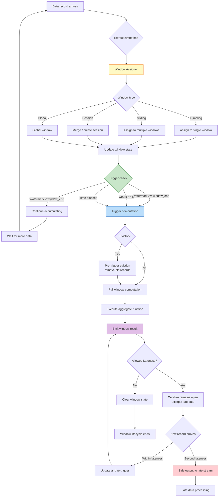

# Pattern: Windowed Aggregation

> **Pattern ID**: 02/7 | **Series**: Knowledge/02-design-patterns | **Formalization Level**: L4 | **Complexity**: ★★☆☆☆
>
> This pattern partitions unbounded data streams into finite time buckets for aggregation, resolving the tension between **batch semantics** and **stream computing**.

## 1. Definitions

### Def-K-02-01 (Window Assigner)

A **Window Assigner** is a function mapping each stream record to a set of time windows [^1][^2]:

$$
\text{Assigner}: \mathcal{D} \times \mathbb{T} \to \mathcal{P}(\text{WindowID})
$$

Where:

- $\mathcal{D}$: record data domain
- $\mathbb{T}$: event time domain
- $\text{WindowID} = (wid, t_{start}, t_{end})$: window identifier

**Core Properties** [^1]:

| Property | Mathematical Description | Engineering Meaning |
|----------|-------------------------|---------------------|
| **Time coverage** | $\bigcup_{wid \in W} [t_{start}, t_{end}) \supseteq \text{EventTimeRange}$ | Every event time belongs to at least one window |
| **Non-negativity** | $\forall wid: t_{end} > t_{start}$ | Windows have positive time span |
| **Forwardness** | If $t_e(r_1) < t_e(r_2)$ then $t_{end}(W(r_1)) \leq t_{end}(W(r_2))$ | Window boundaries monotonically non-decreasing |

**Intuition**: The window assigner is the fundamental abstraction connecting unbounded streams to finite computation. It slices the continuous time axis into discrete buckets, enabling batch-style aggregations (SUM, COUNT, AVG) to be defined on streams.

---

### Def-K-02-02 (Window Type Classification)

**Tumbling Window**:
$$
\text{Tumbling}(\delta): wid_n = [n\delta, (n+1)\delta), \quad n \in \mathbb{Z}
$$

- Fixed size $\delta$, **non-overlapping**: $wid_n \cap wid_{n+1} = \emptyset$
- Each record belongs to **exactly one** window

**Sliding Window**:
$$
\text{Sliding}(\delta, s): wid_n = [n \cdot s, n \cdot s + \delta), \quad n \in \mathbb{Z}
$$

- Window size $\delta$, slide step $s$
- When $s < \delta$, windows **overlap**
- Each record may belong to **multiple** windows (at most $\lceil \delta/s \rceil$)

**Session Window**:
$$
\text{Session}(g, r_1, r_2, \ldots): wid = [t_{first}, t_{last} + g)
$$

- $g$ = session gap timeout
- Closes after **inactivity exceeds $g$**

**Global Window**:
$$
\text{Global}: wid_{global} = (-\infty, +\infty)
$$

- Single window containing all records
- Typically combined with **custom triggers**

**Comparison**:

| Window Type | Window Count | Record Membership | Typical Application |
|-------------|-------------|-------------------|---------------------|
| Tumbling | $T/\delta$ | Single window | Fixed-period stats (per-minute PV) |
| Sliding | $T/s$ | Multiple windows | Moving average (5-min every 10-sec) |
| Session | Dynamic | Single window | User behavior analysis (session duration) |
| Global | 1 | Global | Global Top-N, custom trigger |

---

### Def-K-02-03 (Trigger)

A **Trigger** is a predicate determining when a window emits its computed result [^1][^2]:

$$
\text{Trigger}: \text{WindowID} \times \mathbb{T}_{watermark} \times \text{State} \to \{\text{FIRE}, \text{CONTINUE}, \text{PURGE}\}
$$

**Standard Trigger Types**:

| Trigger Type | Condition | Semantics |
|-------------|-----------|-----------|
| **Event Time** | $w \geq t_{end}$ | Watermark passes window end time |
| **Processing Time** | $t_{proc} \geq t_{end}$ | Processing time reaches window end |
| **Count** | $|S_{wid}| \geq N$ | Record count in window reaches threshold |
| **Continuous** | $\Delta t_{proc} \geq \delta$ | Periodic trigger (every N seconds) |
| **Delta** | $\|v_{new} - v_{last}\| \geq \epsilon$ | Result change exceeds threshold |

**Trigger Actions**:

- **FIRE**: trigger computation and emit result
- **CONTINUE**: continue accumulating, no output
- **PURGE**: clear window state (often combined with FIRE)

---

### Def-K-02-04 (Evictor)

An **Evictor** selectively removes elements from window state before or after triggering [^2][^3]:

$$
\text{Evictor}: \mathcal{P}(\mathcal{D}) \times \text{TriggerContext} \to \mathcal{P}(\mathcal{D})
$$

**Standard Evictor Types**:

| Evictor Type | Timing | Removal Strategy |
|-------------|--------|-----------------|
| **CountEvictor** | Pre-trigger | Keep only most recent $N$ records |
| **TimeEvictor** | Pre-trigger | Keep only records within recent $\delta$ time |
| **DeltaEvictor** | Pre-trigger | Remove old records based on data property difference |

**Intuition**: Evictors provide fine-grained control over "which data to retain in the window." When a window contains large amounts of historical data but only recent data is needed, evictors can filter before computation, reducing aggregation overhead.

---

### Def-K-02-05 (Window Aggregate Function)

A **Window Aggregate Function** defines how multiple records within a window are merged into a single result value [^1][^2]:

$$
\text{Aggregate}: \mathcal{P}(\mathcal{D}) \to \mathcal{R}
$$

**Aggregation Function Classification**:

| Aggregation Type | Incremental? | Deduplication? | Examples |
|-----------------|--------------|----------------|----------|
| **Distributive** | Yes | No | SUM, COUNT, MIN, MAX |
| **Algebraic** | Yes | No | AVG (needs SUM+COUNT), STD |
| **Holistic** | No | Yes | MEDIAN, PERCENTILE, MODE |
| **Unique** | Yes | Yes | DISTINCT COUNT |

**Incremental Aggregation Condition** [^1]:
If aggregate $f$ can be expressed as $f = g \circ h$ where $h: \mathcal{D} \to \mathcal{A}$ maps to accumulator and $h$ is **associative**, then $f$ supports incremental computation with $O(1)$ state complexity.

---

## 2. Properties

### Prop-K-02-01 (Window Time Coverage Completeness)

**Statement**: For any event time $t \in \mathbb{T}$, at least one window $wid$ exists such that $t \in [t_{start}(wid), t_{end}(wid))$.

**Proof**:

1. Tumbling: for window size $\delta$, $t$ belongs to $wid_{\lfloor t/\delta \rfloor} = [\lfloor t/\delta \rfloor \cdot \delta, (\lfloor t/\delta \rfloor + 1) \cdot \delta)$
2. Sliding: similarly, $t$ belongs to all windows satisfying $n \cdot s \leq t < n \cdot s + \delta$
3. Session: as long as $t$ corresponds to some record, that record belongs to some session
4. Global: trivially covers all time

**Engineering inference**: Time coverage completeness guarantees "no data loss"—any event-timestamped record is captured by at least one window. This is the foundation for stream-to-batch semantic equivalence. ∎

---

### Prop-K-02-02 (Window Assignment Determinism)

**Statement**: For a given window assignment strategy and fixed event time, record window membership is deterministic:

$$
\forall r_1, r_2: t_e(r_1) = t_e(r_2) \implies \text{Assigner}(r_1) = \text{Assigner}(r_2)
$$

**Proof**: By Def-K-02-02, all standard window type boundaries are deterministic functions of $t_e$. The assigner depends only on $t_e(r)$, involving no randomness or external state. ∎

**Engineering inference**: Window assignment determinism guarantees **result reproducibility**—the same input stream produces identical window partitions on re-execution, essential for debugging and testing.

---

## 3. Relations

### Relation: Windowed Aggregation `↦` Def-S-04-05

**Mapping** [^4]:

| This Pattern | Def-S-04-05 | Mapping |
|-------------|-------------|---------|
| Window Assigner (Def-K-02-01) | $W: \mathcal{D} \to \mathcal{P}(\text{WindowID})$ | Direct correspondence |
| Window Type (Def-K-02-02) | Concrete assigner implementations | Specialization |
| Trigger (Def-K-02-03) | $T: \text{WindowID} \times \mathbb{T} \to \{\text{FIRE}, \text{CONTINUE}\}$ | Direct correspondence |
| Window Aggregate (Def-K-02-05) | $\bigoplus$ aggregation | Semantic equivalence |
| Allowed Lateness | $F \in \mathbb{T}$ | Direct correspondence |

**Differences**:

- Def-S-04-05 does not explicitly include "evictor" concept—this is a Flink extension beyond the Dataflow model
- Def-S-04-05's window state $A$ is refined in this pattern to accumulator semantics

**Conclusion**: This pattern's windowed aggregation is an engineering refinement of Def-S-04-05; core semantics are consistent.

---

### Relation: Windowed Aggregation and Watermark

**Dependency** [^1][^2]:

Window aggregation correctness depends on Watermark mechanism progress guarantees:

$$
\text{Window Trigger} \circ \text{Watermark} \implies \text{Deterministic Output}
$$

**Formal Description** [^4]:

For window $wid = [t_{start}, t_{end})$, current Watermark $w$, allowed lateness $F$:

| Condition | Behavior | Watermark Role |
|-----------|----------|----------------|
| $w < t_{end}$ | Window remains open, continues accumulating | Indicates possible future data |
| $t_{end} \leq w < t_{end} + F$ | Triggers computation; window still open for late data | Normal trigger |
| $w \geq t_{end} + F$ | Triggers final computation; window closes | Allowed lateness exhausted |

**Inference**: Watermark monotonicity (Lemma-S-04-02) guarantees trigger **idempotency**—the same window never triggers twice.

---

## 4. Argumentation

### 4.1 Window Type Selection Decision Matrix

| Business Need | Recommended Window | Rationale |
|--------------|-------------------|-----------|
| Fixed-period stats (per-minute PV/UV) | Tumbling | Non-overlapping; stats don't interfere |
| Moving stats (past 5 min every 10 sec) | Sliding | Overlapping windows support smooth aggregation |
| Session analysis (user visit duration) | Session | Dynamic boundaries match user behavior |
| Global Top-N / leaderboard | Global + Trigger | Global view with custom triggering |
| Anomaly detection (spike identification) | Session / Delta | Fine-grained sessions capture anomaly patterns |

**Computational Cost Comparison** (throughput $R$ records/sec, time span $T$):

| Window Type | Window Instances | Records per Window | State Complexity |
|-------------|-----------------|-------------------|-----------------|
| Tumbling ($\delta$) | $T/\delta$ | 1 | $O(T/\delta \times \text{keys})$ |
| Sliding ($\delta$, $s$) | $T/s$ | $\delta/s$ | $O(T/s \times \text{keys})$ |
| Session ($g$) | Dynamic | 1 | $O(\text{active sessions})$ |
| Global | 1 | 1 | $O(\text{keys})$ |

**Key observation**: Sliding window state complexity grows linearly with overlap ratio $\delta/s$. When $\delta = 5$ minutes, $s = 1$ second, each record belongs to 300 windows, causing severe state inflation.

---

### 4.2 Trigger Strategy Comparison

**Trigger Selection Decision Tree**:

```
Do you need result real-time?
├── No ──► Event Time Trigger (Watermark-triggered, most accurate)
└── Yes ──► Can you accept approximate results?
            ├── No ──► Processing Time Trigger (low latency but may miss late data)
            └── Yes ──► Continuous Trigger (periodically outputs current estimate)
                        ├── Need final correction? ──► Allow late updates
                        └── No correction needed? ──► Output real-time estimate only
```

**Latency-Accuracy Trade-off**:

| Trigger Strategy | Result Latency | Result Accuracy | Applicable Scenario |
|-----------------|----------------|-----------------|---------------------|
| Event Time | High (Watermark delay) | High (complete data) | Financial stats, reports |
| Processing Time | Low (immediate) | Low (may miss late data) | Real-time monitoring |
| Continuous + Allowed Lateness | Medium | Medium (approximate then corrected) | Real-time recommendations |

---

### 4.3 Evictor and Incremental Computation Trade-off

**Evictor vs Incremental Aggregation Conflict** [^2]:

Evictors and incremental aggregation have **semantic tension**:

- **Incremental aggregation** (SUM, COUNT) depends on complete accumulator state; evicting historical data breaks the accumulator
- **Solutions**:
  1. Use non-incremental aggregation (ProcessWindowFunction), store raw data, evict before trigger
  2. Disable evictors, rely on state TTL for automatic cleanup
  3. Custom evictable incremental accumulator (must preserve associativity)

**Engineering recommendation**: If evictors are required, prefer ProcessWindowFunction + pre-trigger eviction combination.

---

## 5. Proof / Engineering Argument

### Thm-K-02-01 (Window Aggregation Correctness Condition)

**Statement**: Given a window aggregation with:

- Window assigner $W$ (satisfying Def-K-02-01)
- Trigger $T$ (satisfying Def-K-02-03)
- Aggregate function $\bigoplus$ (satisfying Def-K-02-05 associativity condition)
- Watermark strategy $w(t) = \max_{r \in \text{observed}} t_e(r) - L$

If max out-of-order tolerance $L$ ≥ actual data disorder degree, then window aggregation results are **complete and correct**.

**Engineering Argument** [^1][^4]:

**Step 1: Watermark guarantee**
By Def-S-04-04, Watermark $w$ guarantees: all events with timestamp $\leq w$ have either arrived or will never arrive.

**Step 2: Window trigger condition**
Window $wid = [t_{start}, t_{end})$ triggers at:
$$\tau_{trigger} = \min\{t \mid w(t) \geq t_{end}\}$$

**Step 3: Completeness analysis**
Let actual data disorder degree be $D_{actual}$ (max arrival delay $t_a(r) - t_e(r)$).

- When $L \geq D_{actual}$: Watermark satisfies $w(t) \leq \min_r t_a(r)$, so all records arrive before trigger.
- When $L < D_{actual}$: Some records with $t_e(r) \leq t_{end}$ arrive after $\tau_{trigger}$ and are classified as late.

**Step 4: Result correctness**
For key $k$'s record set $R_k$ in the window:

1. By Prop-S-04-01, associativity of $\bigoplus$ ensures result depends only on input set, not arrival order
2. When $L \geq D_{actual}$, $R_k$ contains all expected records → result is **complete**
3. When $L < D_{actual}$, $R_k$ is a proper subset → result is **deterministic but incomplete**

**Conclusion**:
$$
\text{Result Correctness} = \begin{cases}
\text{Complete} & L \geq D_{actual} \\
\text{Deterministic but Incomplete} & L < D_{actual}
\end{cases}
$$

> **Engineering inference**: Watermark delay parameter $L$ is the explicit trade-off control point between "result latency" and "result completeness" in stream processing systems. This theorem provides theoretical justification for Flink's `allowedLateness` mechanism [^2][^3].

---

## 6. Examples

### Flink DataStream API: Tumbling Window

```java
// Tumbling window: 5-second transaction totals per currency
DataStream<Transaction> transactions = env
    .fromSource(kafkaSource, watermarkStrategy, "Transactions");

DataStream<Tuple2<String, Double>> windowedAgg = transactions
    .keyBy(_.currency)
    .window(TumblingEventTimeWindows.of(Time.seconds(5)))
    .aggregate(new SumAggregate());

// Incremental aggregate function
class SumAggregate implements AggregateFunction<Transaction, Double, Double> {
    public Double createAccumulator() { return 0.0; }
    public Double add(Transaction value, Double acc) { return acc + value.amount; }
    public Double getResult(Double acc) { return acc; }
    public Double merge(Double a, Double b) { return a + b; }
}
```

---

### Flink DataStream API: Sliding Window

```java
// Sliding window: 1-minute moving average every 10 seconds
DataStream<SensorReading> sensorStream = /* ... */;

DataStream<Double> slidingAgg = sensorStream
    .keyBy(_.sensorId)
    .window(SlidingEventTimeWindows.of(Time.minutes(1), Time.seconds(10)))
    .aggregate(new AverageAggregate());

// Average needs SUM and COUNT
class AverageAggregate implements AggregateFunction<SensorReading, (Double, Long), Double> {
    public (Double, Long) createAccumulator() { return (0.0, 0L); }
    public (Double, Long) add(SensorReading value, (Double, Long) acc) {
        return (acc._1 + value.temperature, acc._2 + 1);
    }
    public Double getResult((Double, Long) acc) { return acc._1 / acc._2; }
    public (Double, Long) merge((Double, Long) a, (Double, Long) b) {
        return (a._1 + b._1, a._2 + b._2);
    }
}
```

---

### Flink DataStream API: Session Window

```java
// Session window: 5-minute inactivity gap
DataStream<ClickEvent> clickStream = /* ... */;

DataStream<UserSession> sessionAgg = clickStream
    .keyBy(_.userId)
    .window(EventTimeSessionWindows.withGap(Time.minutes(5)))
    .allowedLateness(Time.seconds(30))
    .sideOutputLateData(lateDataTag)
    .process(new UserSessionFunction());
```

---

### Flink SQL Window Aggregation

```sql
-- TUMBLE: 5-minute sales per category
SELECT
  TUMBLE_START(event_time, INTERVAL '5' MINUTE) as window_start,
  TUMBLE_END(event_time, INTERVAL '5' MINUTE) as window_end,
  category,
  SUM(amount) as total_sales,
  COUNT(*) as order_count,
  AVG(amount) as avg_order_value
FROM orders
GROUP BY TUMBLE(event_time, INTERVAL '5' MINUTE), category;

-- HOP: 1-hour moving stats every 5 minutes
SELECT
  HOP_START(event_time, INTERVAL '5' MINUTE, INTERVAL '1' HOUR) as window_start,
  product_id,
  SUM(quantity) as total_quantity,
  MAX(price) as max_price
FROM product_events
GROUP BY HOP(event_time, INTERVAL '5' MINUTE, INTERVAL '1' HOUR), product_id;

-- SESSION: 20-minute inactivity gap
SELECT
  SESSION_START(event_time, INTERVAL '20' MINUTE) as session_start,
  user_id,
  COUNT(*) as event_count
FROM user_clicks
GROUP BY SESSION(event_time, INTERVAL '20' MINUTE), user_id;
```

---

## 7. Visualizations

### Window Type Comparison

```mermaid
gantt
    title Window Type Time Partition Comparison (Time Axis 0-60 seconds)
    dateFormat X
    axisFormat %s

    section Tumbling (δ=15s)
    Window 0-15     : 0, 15
    Window 15-30    : 15, 15
    Window 30-45    : 30, 15
    Window 45-60    : 45, 15

    section Sliding (δ=20s, s=10s)
    Window 0-20     : 0, 20
    Window 10-30    : 10, 20
    Window 20-40    : 20, 20
    Window 30-50    : 30, 20
    Window 40-60    : 40, 20

    section Session (gap=15s)
    Session A (t=5,12)   : 5, 12
    Session B (t=25,32)  : 25, 12
    Session C (t=45,50,58): 45, 18

    section Global
    Global Window   : 0, 60
```



**Legend**:

- **Tumbling**: Fixed size (15s), non-overlapping—suitable for periodic statistics
- **Sliding**: Fixed size (20s), step 10s, 50% overlap—suitable for moving averages
- **Session**: Dynamic boundaries triggered by record gaps (>15s gap)—suitable for user behavior analysis
- **Global**: Single window covering all time—requires trigger cooperation

---

### Window Aggregation Execution Flow



**Legend**:

- Yellow: Window assigner routes records to corresponding windows
- Green: Trigger decides when to compute
- Blue: Trigger computation executes aggregation
- Purple: Result emission
- Red: Late data handling

---

## 8. References

[^1]: T. Akidau et al., "The Dataflow Model: A Practical Approach to Balancing Correctness, Latency, and Cost in Massive-Scale, Unbounded, Out-of-Order Data Processing," *PVLDB*, 8(12), 2015. <https://doi.org/10.14778/2824032.2824076>
[^2]: Apache Flink Documentation, "Windowing," 2025. <https://nightlies.apache.org/flink/flink-docs-stable/docs/dev/datastream/operators/windows/>
[^3]: Apache Flink Documentation, "Window Operators," 2025. <https://nightlies.apache.org/flink/flink-docs-stable/docs/dev/datastream/operators/windows/#window-assigners>
[^4]: Window formalization definition, see [Struct/01-foundation/01.04-dataflow-model-formalization.md](../../../../Struct/01-foundation/01.04-dataflow-model-formalization.md)

---

*Document Version: v1.0-en | Updated: 2026-04-20 | Status: Core Summary*
